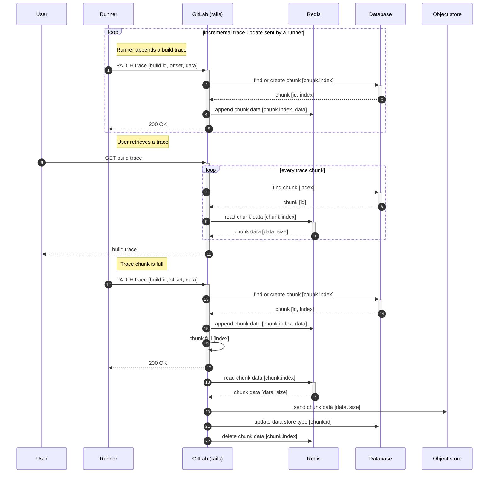



クラウドネイティブと Kubernetes の採用は、GitLab がプロジェクトを背景に企業として成長するうえで最大の追い風となる 2 つの要因のうちの一つであると認識されています。

この取り組みについては、[インフラストラクチャチームのハンドブック](../../../infrastructure-platforms/production/architecture/)により詳しい説明があります。

## 従来のビルドログ

従来のジョブログは、ローカル共有ストレージの可用性に大きく依存しています。

GitLab Runner が新しいビルド出力の一部を送信するたびに、この出力をディスク上のファイルに書き込みます。これはシンプルな仕組みですが、共有ローカルストレージに依存しています。GitLab Runner が API リクエストを行うたびに異なるノードに接続する可能性があるため、すべての GitLab Web ノードマシンで同じファイルが利用できる必要があります。ジョブが完了するとトレースファイルの内容がオブジェクトストアに送信されるため、Sidekiq もファイルへのアクセスが必要です。

## 新しいアーキテクチャ

新しいアーキテクチャでは、ビルドログをファイルに書き込む代わりに、Redis にデータを書き込みます。

十分なパフォーマンスと耐障害性を実現するために、チャンク式の I/O メカニズムを実装しました。データを Redis にチャンク単位で保存し、所望のチャンクサイズに達したらオブジェクトストアに移行します。

簡略化したシーケンス図を以下に示します。

## NFS の依存

2017 年、私たちは NFS インフラのスケーリングにおいて深刻な問題を経験しました。NFS を [CephFS](https://docs.ceph.com/en/latest/cephfs/) で置き換えようとしましたが、うまくいきませんでした。

それ以来、NFS クラスターの運用・保守コストが大きいことが明らかになり、Kubernetes への移行を決めた場合には [GitLab を共有ローカルストレージと NFS から切り離す必要がある](https://gitlab.com/gitlab-org/gitlab-pages/-/issues/426#note_375646396)ことが明確になりました。

1. NFS は単一障害点になる可能性があります
1. NFS は垂直方向にしか信頼性高くスケーリングできません
1. Kubernetes に移行するとマウントポイントの数が桁違いに増加します
1. NFS は極めて信頼性の高いネットワークに依存しており、Kubernetes 環境では提供が難しい場合があります
1. NFS に顧客データを保存することは、セキュリティリスクを伴います

NFS の切り離しなしに GitLab を Kubernetes に移行すると、複雑性が爆発的に増大し、保守コストが膨大になり、可用性への大きな悪影響をもたらします。

## イテレーション

1. ✓ 共有ローカルストレージに依存しない新しいアーキテクチャを実装する
1. ✓ パフォーマンスとエッジケースを評価し、新しいアーキテクチャを改善するためにイテレーションする
1. ✓ クラウドネイティブビルドログの正確性検証メカニズムを設計する
1. ✓ パフォーマンスと正確性に関する可観測性メカニズムを構築する
1. ✓ 本番環境に段階的に機能をロールアウトする

新しいアーキテクチャを本番稼働可能な状態にして GitLab.com で有効化するために必要な作業は、[Cloud Native Build Logs on GitLab.com](https://gitlab.com/groups/gitlab-org/-/epics/4275) エピックで追跡されていました。

GitLab.com でこの機能を有効化することは、[新しいアーキテクチャを全員に一般提供する](https://gitlab.com/groups/gitlab-org/-/epics/3791)ためのサブタスクです。

## ステータス

この変更は実装済みであり、GitLab.com で有効化されています。

私たちは[この機能をより耐障害性が高く観測可能にするためのエピック](https://gitlab.com/groups/gitlab-org/-/epics/4860)に取り組んでいます。
