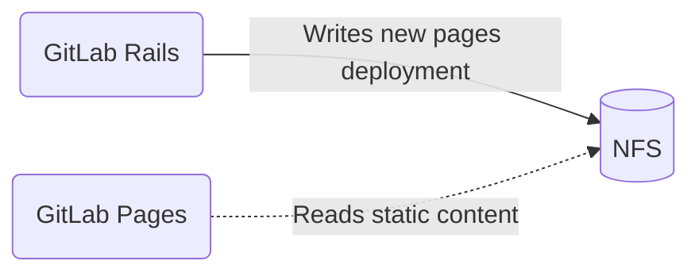
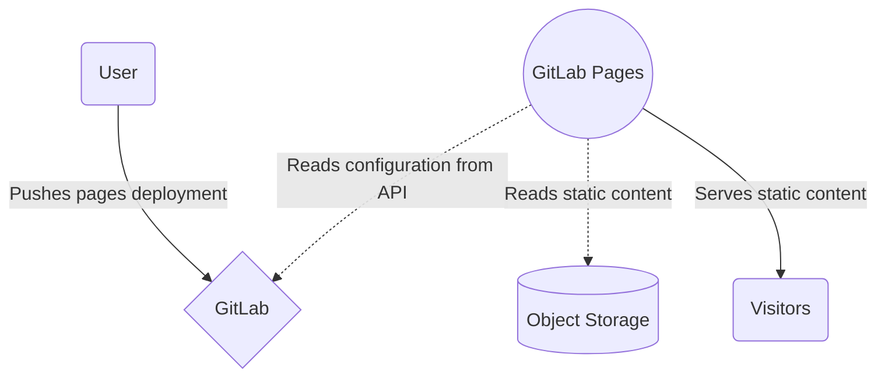

このページには今後予定されている製品・機能・機能性に関する情報が含まれています。ここに示す情報は参考目的のみです。購入・計画の決定にこの情報を使用しないでください。製品・機能・機能性の開発、リリース、タイミングは変更または延期される可能性があり、GitLab Inc. の独自の判断に委ねられています。

<table class="w-full text-sm border-collapse">
<thead>
<tr class="bg-gray-100 text-left">
<th class="px-3 py-2 border border-gray-300">Status</th>
<th class="px-3 py-2 border border-gray-300">Authors</th>
<th class="px-3 py-2 border border-gray-300">Coach</th>
<th class="px-3 py-2 border border-gray-300">DRIs</th>
<th class="px-3 py-2 border border-gray-300">Owning Stage</th>
<th class="px-3 py-2 border border-gray-300">Created</th>
</tr>
</thead>
<tbody>
<tr>
<td class="px-3 py-2 border border-gray-300">implemented</td>
<td class="px-3 py-2 border border-gray-300"><a href="https://gitlab.com/grzesiek" class="text-blue-600 hover:underline">@grzesiek</a></td>
<td class="px-3 py-2 border border-gray-300"><a href="https://gitlab.com/ayufan" class="text-blue-600 hover:underline">@ayufan</a>, <a href="https://gitlab.com/grzesiek" class="text-blue-600 hover:underline">@grzesiek</a></td>
<td class="px-3 py-2 border border-gray-300"><a href="https://gitlab.com/ogolowinski" class="text-blue-600 hover:underline">@ogolowinski</a>, <a href="https://gitlab.com/dcroft" class="text-blue-600 hover:underline">@dcroft</a>, <a href="https://gitlab.com/vshushlin" class="text-blue-600 hover:underline">@vshushlin</a></td>
<td class="px-3 py-2 border border-gray-300">~devops::release</td>
<td class="px-3 py-2 border border-gray-300">2019-05-16</td>
</tr>
</tbody>
</table>

GitLab Pages は GitLab 製品の重要なコンポーネントです。主に静的コンテンツを配信するために使用されており、明確に定義された限られた責務を持ちます。しかし残念ながら、GitLab.com の Kubernetes 移行のブロッカーになってしまっています。

クラウドネイティブと Kubernetes の採用は、GitLab がプロジェクトを背景に企業として成長するうえで最大の追い風となる 2 つの要因のうちの一つであると認識されています。

この取り組みについては、[インフラストラクチャチームのハンドブックページ](../../../infrastructure-platforms/production/architecture/)により詳しい説明があります。

GitLab Pages は NFS と強く結びついており、Kubernetes への移行をアンブロックするためには GitLab Pages のアーキテクチャに大幅な変更が必要です。これは 1 年以上前から取り組んでいる継続的な作業です。このブループリントは、なぜそれが重要なのか、そしてロードマップが何であるかを理解するのに役立つでしょう。

## GitLab Pages の仕組み

GitLab Pages は、静的コンテンツを配信するように設計されたデーモンで、[Go](https://go.dev/) で書かれています。

当初、GitLab Pages は、グループ > プロジェクトのディレクトリ構造で階層化されたローカル共有ブロックストレージ（NFS）に静的コンテンツを保存するように設計されていました。プロジェクトを表す各ディレクトリには、GitLab Pages デーモンが読み取って配信することが想定された設定ファイルと静的コンテンツが含まれていました。

この初期設計は、NFS の依存関係などいくつかの理由から時代遅れになり、より「デカップルされたサービス」的なアーキテクチャに置き換えることを決定しました。私たちが取り組んでいる新しいアーキテクチャについて、このブループリントで説明します。

## NFS の依存

2017 年、私たちは NFS インフラのスケーリングにおいて深刻な問題を経験しました。NFS を [CephFS](https://docs.ceph.com/en/latest/cephfs/) で置き換えようとしましたが、うまくいきませんでした。

それ以来、NFS クラスターの運用・保守コストが大きいことが明らかになり、Kubernetes への移行を決めた場合には [GitLab を共有ローカルストレージと NFS から切り離す必要がある](https://gitlab.com/gitlab-org/gitlab-pages/-/issues/426#note_375646396)ことが明確になりました。

1. NFS は単一障害点になる可能性があります
1. NFS は垂直方向にしか信頼性高くスケーリングできません
1. Kubernetes に移行するとマウントポイントの数が桁違いに増加します
1. NFS は極めて信頼性の高いネットワークに依存しており、Kubernetes 環境では提供が難しい場合があります
1. NFS に顧客データを保存することは、セキュリティリスクを伴います

NFS の切り離しなしに GitLab を Kubernetes に移行すると、複雑性が爆発的に増大し、保守コストが膨大になり、可用性への大きな悪影響をもたらします。

## 新しい GitLab Pages アーキテクチャ

- GitLab Pages は、ローカル共有ストレージから `config.json` ファイルを読み取る代わりに、GitLab 内部 API からドメインの設定を取得します。
- GitLab Pages はオブジェクトストレージから静的コンテンツを配信します。

この新しいアーキテクチャについては、[ブログ記事](https://about.gitlab.com/blog/2020/08/03/how-gitlab-pages-uses-the-gitlab-api-to-serve-content/)でも簡単に説明されています。

## イテレーション

1. ✓ GitLab Pages 設定ソースを GitLab API を使用するように再設計する
1. ✓ パフォーマンスを評価し、信頼性の高いキャッシュメカニズムを構築する
1. ✓ GitLab.com 上で新しいソースを段階的にロールアウトする
1. ✓ GitLab Pages API ドメイン設定ソースをデフォルトで有効化する
1. フィーチャーフラグを通じてさまざまな配信方法の実験を可能にする
1. 意味のある実験を通じてオブジェクトストア配信の設計を三角測量する
1. 段階的に機能するページ移行メカニズムを設計する
1. GitLab.com 上でオブジェクトストレージ配信への段階的な移行を進める

詳細なロードマップを含む [GitLab Pages Architecture](https://gitlab.com/groups/gitlab-org/-/epics/1316) エピックも参照してください。
