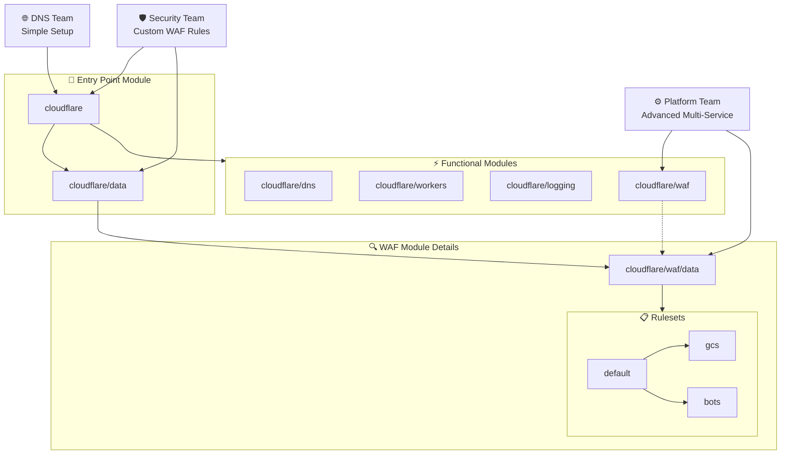

<!-- Design Documents often contain forward-looking statements -->
<!-- vale gitlab.FutureTense = NO -->


<div class="my-3 border-l-4 border-blue-500 bg-blue-50 px-4 py-3 rounded-r text-sm text-blue-800">
このページには今後予定されている製品・機能・機能性に関する情報が含まれています。ここに示す情報は参考目的のみです。購入・計画の決定にこの情報を使用しないでください。製品・機能・機能性の開発、リリース、タイミングは変更または延期される可能性があり、GitLab Inc. の独自の判断に委ねられています。
</div>

<div class="overflow-x-auto my-4">
<table class="w-full text-sm border-collapse">
<thead>
<tr class="bg-gray-100 text-left">
<th class="px-3 py-2 border border-gray-300">Status</th>
<th class="px-3 py-2 border border-gray-300">Authors</th>
<th class="px-3 py-2 border border-gray-300">Coach</th>
<th class="px-3 py-2 border border-gray-300">DRIs</th>
<th class="px-3 py-2 border border-gray-300">Owning Stage</th>
<th class="px-3 py-2 border border-gray-300">Created</th>
</tr>
</thead>
<tbody>
<tr>
<td class="px-3 py-2 border border-gray-300"><span class="inline-block rounded px-2 py-0.5 text-xs font-medium bg-gray-100 text-gray-700">proposed</span></td>
<td class="px-3 py-2 border border-gray-300"><a href="https://gitlab.com/jcstephenson" class="text-blue-600 hover:underline">@jcstephenson</a></td>
<td class="px-3 py-2 border border-gray-300"><a href="https://gitlab.com/cmiskell" class="text-blue-600 hover:underline">@cmiskell</a>, <a href="https://gitlab.com/cfeick" class="text-blue-600 hover:underline">@cfeick</a></td>
<td class="px-3 py-2 border border-gray-300"><a href="https://gitlab.com/jcstephenson" class="text-blue-600 hover:underline">@jcstephenson</a>, <a href="https://gitlab.com/sabrams" class="text-blue-600 hover:underline">@sabrams</a></td>
<td class="px-3 py-2 border border-gray-300"><span class="inline-block rounded px-2 py-0.5 text-xs font-medium bg-gray-100 text-gray-700">~devops::platforms</span></td>
<td class="px-3 py-2 border border-gray-300">2025-05-20</td>
</tr>
</tbody>
</table>
</div>


## 概要

このドキュメントでは、GitLab 内部チーム全体にわたって Cloudflare 設定に対するセキュアで拡張可能なインターフェースを提供する一連の Terraform モジュールのアーキテクチャと実装アプローチについて説明します。GitLab のエッジネットワーキングのニーズが増大し、より多くのチームが Cloudflare を採用するにつれて、セキュアでコンプライアンスに準拠したエッジネットワーキングソリューションを実装しながら運用上の卓越性を達成できる標準化されたアプローチが必要となっています。

提案するソリューションは、適切なデフォルト値、ドキュメント、明確なアップグレードパスを備えた一連の Terraform モジュールを提供します。この標準化により、チームは Cloudflare の機能を効果的に活用でき、組織全体での実装の複雑さが軽減されます。

この作業は[このエピック](https://gitlab.com/groups/gitlab-com/gl-infra/-/epics/1561)で追跡されており、優先順位付けとプロジェクト管理についてさらに議論しています。

## 動機

GitLab の推奨エッジネットワーキングプロバイダーとしての Cloudflare の使用は継続的に成長しており、複数のチームがインフラストラクチャ全体にわたって DNS 管理、WAF 設定、ワーカーのデプロイのソリューションを実装しています（[例 1](https://gitlab.com/gitlab-com/gl-infra/gitlab-dedicated/instrumentor/-/blob/main/common/modules/cloudflare/instance-domains/main.tf)、[例 2](https://gitlab.com/groups/gitlab-com/gl-infra/platform/runway/-/epics/18)、[`cloudflare-waf-rules` モジュール](https://gitlab.com/gitlab-com/gl-infra/terraform-modules/cloudflare/cloudflare-waf-rules)、[`dns-record` モジュール](https://gitlab.com/gitlab-com/gl-infra/terraform-modules/dns/dns-record)）。これにより、すべてのチームに恩恵をもたらすより統一されスケーラブルな基盤を確立する機会が生まれています。

標準化されたインフラストラクチャの提供とプラットフォームファーストの考え方を持つ成熟した GitLab プラットフォームへ向けて移行するにあたり、Cloudflare 管理のパターンを確立することは、実装の複雑さを削減し、エッジでのセキュリティとコンプライアンスを標準化することで大きな戦略的価値を提供します。テスト、ドキュメント、明確なアップグレードプロセスを通じて、チームが自律的に Cloudflare 設定を実装・保守できるようにすることができます。WAF ルールとレート制限設定のための [`cloudflare-waf-rules`](https://gitlab.com/gitlab-com/gl-infra/terraform-modules/cloudflare/cloudflare-waf-rules) モジュールのアプローチを発展させることで、セキュリティとコンプライアンスのリスクに対応する能力を強化し、チームが拡張可能な方法で Cloudflare の機能を実装できるようにします。

このアプローチは、[Cloudflare プロバイダーのアップグレード](https://gitlab.com/gitlab-com/gl-infra/production-engineering/-/issues/26235)を含む今後のメンテナンス作業に向けても有利な立場を確立し、すべての実装にわたって調整された、リスクを低減したアップグレードプロセスの実装を可能にします。

### ゴール

- GitLab の要件に適した Edge/WAF 抽象化を提供し、明確で理解しやすいインターフェースを提供し、実装のカプセル化、モジュール化、置き換え可能性を促進する
- すべての Cloudflare 実装にわたって一貫したセキュリティとコンプライアンスの標準を確立する
- 一般的なユースケースと特殊な要件の両方に対応する柔軟で拡張可能なモジュール設定を提供する
- 十分にドキュメント化されテストされたインフラストラクチャパターンを提供することでチームの速度を加速する
- すべての実装にわたる効率的なアップグレードとセキュリティ改善のための基盤を確立する
- 内部顧客とオペレーター向けの一元化されたドキュメントにより、高い自律性でのセルフサービス実装とサポートを可能にする
- 既存のドキュメントを超えたサポートのためのメンテナーチームとのインタラクションプロセスを定義する

### 非ゴール

- チーム固有の実装を作成すること。代わりに、チームが独自のソリューションを構築するために使用できる基盤となるモジュールを提供します
- 各チームの特定の Cloudflare 設定の日常的な運用を管理すること
  - これには、モジュールの設定変更とバージョンアップグレードが含まれます
- GitLab の製品提供内で Cloudflare の機能を複製すること

## 提案

3 つの主要なテーマを持つ一連の Terraform モジュールの開発を提案します：

1. 適切なデフォルト値を持つプライマリインターフェースとして構築された共通エントリポイントモジュール
1. DNS や WAF などの Cloudflare 機能の特定のサブセットを実装する専門モジュール
1. 実装間で再利用できる標準化された設定パターンを提供するデータのみのサブモジュール

共通エントリポイントは、アプリケーションに Cloudflare 設定を追加するための実装者のデフォルト選択となります。内部的には専門モジュールを使用し、必要に応じてより柔軟な実装への道を提供します。

すべてのモジュールは、大多数のケースをカバーする適切なデフォルト値で定義され、拡張性を許容するインターフェースで設計されます。これは、一般的なケースの設定のセットから構成される拡張可能な `default` 設定を提供するデータのみのサブモジュールに焦点を当てることで推進されます。

これにより、チームは最小限の設定で自分のユースケースに対して Cloudflare の機能を独立して有効化でき、必要に応じてより専門的なモジュールの使用にスケールアップできます。この柔軟性により、一般的なユースケースと複雑な要件の両方が十分にサポートされます。

モジュールを一元化することで、Cloudflare の専門知識をコード化し、チームの自律性をサポートし、GitLab 全体のエッジネットワーキングのための持続可能なプラットフォームを作成できます。

セキュリティは設計の優先事項であり、[GitLab の要件](/handbook/security/policies_and_standards/)に合致した事前設定済みのセキュリティ設定がモジュールに組み込まれます。これには、一般的な GitLab アプリケーションパターン向けに最適化された [WAF ルールセット](https://developers.cloudflare.com/waf/)と、悪用を防ぐためのレート制限設定が含まれます。セキュアなデフォルトを確立することで、すべての Cloudflare 実装が基本レベルのセキュリティを維持できます。

モジュールは GitLab で実践している既存のインフラストラクチャアズコードの原則とプラクティスに従い、Terraform を推奨の IaC プラットフォームとして使用し、一貫したインターフェース、テスト、広範なドキュメントを備えます。

### 成功指標

このイニシアチブの有効性は、組織の能力とチームエンパワーメントのいくつかの主要な指標によって示されます：

- Cloudflare ソリューションの独自実装の成功
- フィードバックフォームの収集と定性的フィードバックセッションで測定された、Cloudflare モジュール使用に対するチームの満足度と自信
- チームが設定の更新とアップグレードに費やす時間
- Cloudflare モジュールの採用数
- Cloudflare 設定に関連する `S2` および `S1` インシデント発生率の増加なし

### モジュール開発原則

- Cloudflare の既存の API 構造の上に構築するためにリーキーアブストラクションを活用する
  - これにより、Cloudflare の既存のパターンとドキュメントの上に構築できます
- 後方互換性を最優先事項とする
  - [セマンティックバージョニングの原則](https://semver.org/)を使用した厳格なバージョン管理
  - インターフェースまたは基盤となるリソースへの破壊的変更に対する、明確な移行パスを持つ廃止予告
  - メジャーバージョン変更の場合、実装者が必要とする手動介入のためのアップグレードドキュメントを*必ず*提供する
  - 破壊的変更を検出するための一般的なユースケースに対する自動テスト
- 実装者がドキュメントに従って自律的に実装できるセルフサービスへの焦点
- モジュール間の一貫したインターフェース
  - マップ、オブジェクト、リストがモジュールへの主要なインターフェースとなる
    - これらは一般的にスカラーの代替よりも柔軟であり、新しいオプションが追加されたときにモジュール間での重複した更新を避けることができます

## 設計と実装の詳細

ルートモジュールの下には、特定の Cloudflare 機能領域に特化した複数のスタンドアロンモジュールを実装します。例としては、DNS 設定のための `cloudflare/dns` や、Web アプリケーションファイアウォール設定のための `cloudflare/waf` などがあります。

実装間で共通の設定パターンが現れた場合、それらのユースケースをドキュメント化し、非常に一般的なケースには汎用ユースケースモジュールを開発します。これらのモジュールはコアの `cloudflare` モジュールをベースにし、シンプルな DNS 設定やワーカー実装などのパターンを実装する場合があります。

標準化を損なわずにカスタマイズをサポートするために、`{module-path}/data/*` サブモジュールに再利用可能な設定オプションを作成します。例として WAF ルールがあり、WAF ルールのセットは多くの実装に共通している場合がありますが、すべての消費者に適切とは限りません。明確な設定セットを構築する場合は、使いやすさと拡張性のための `default` 設定も構築します。例えば、複数の WAF ルールセットが定義されている場合などです。

### モジュールの関係



#### Terraform 設定の例

##### エントリポイントモジュールの説明

この例は、`cloudflare` 共通エントリポイントモジュールの最小限の使用を示しています。

追加オプションのオーバーライドなしで、Cloudflare でゾーンを設定し、DNS `A` レコードを作成し、WAF カスタムルールとレート制限ルールのデフォルトルールセットを設定します。

```terraform
module "cloudflare" {
    source = "path/to/entrypoint/module"

    zone = {
        root = "example.gitlab.com"
        plan = "free"
    }

    dns = {
        a = {
            # Create an A record for test.example.gitlab.com
            test = {
                name    = "test"
                records = [
                    "127.0.0.1"
                ]
            }
        }
    }
}
```

次の例は、共通エントリポイントモジュールを通じた複数の設定の詳細な例を示しています。

```terraform
module "cloudflare_data" {
    source = "path/to/entrypoint/module//modules/data"

    zone = "example.gitlab.com"
}

module "cloudflare" {
    source = "path/to/entrypoint/module"

    zone = {
        root = "example.gitlab.com"
        plan = "free"
    }

    dns = {
        a = {
            # Create an A record for test.example.gitlab.com
            test = {
                name    = "test"
                records = [
                    "127.0.0.1"
                ]
            }

            # Create a proxied A record with a custom TTL
            test_proxied = {
                name    = "test-proxied"
                records = [
                    "127.0.0.1"
                ]
                proxied = true
                ttl     = 300
            }
        }

        mx = {
            # Create a test MX record
            test = {
                name     = "test"
                records  = [
                    "mail.example.com"
                ]
                priority = 10
            }
        }
    }

    waf = {
        custom = {
            # Build a custom ruleset from predefined rulesets
            #
            # Without explicit configuration this would default to `module.data.waf.custom.rulesets.default`.
            # This would provide the rules that we expect the majority of implementations to use as a base.
            rules = concat(
                module.data.waf.custom.rulesets.gcs,
                module.data.waf.custom.rulesets.bots,
            )
        }
        rate_limits = {
            # Disable rate limits by overriding with an empty list
            rules = []
        }
    }
}
```

##### カスタム WAF ルールの実装

この例は、サブモジュールの直接使用に期待される使用パターンを示しており、デフォルトをオーバーライドするために定義されたカスタムルールのリストを使用しています。このアプローチは、複数の明示的な設定ステージが必要な場合に通常使用されます。

`zone_id` と `zone` はここで提供され、レコードを変更し、必要に応じて指定した `zone` に適用されるルールセットを生成できるようにします。共通エントリポイントを通じて使用される場合、これは `zone` トップレベル変数を通じて自動化されます。

```terraform
module "waf_rulesets" {
  source = "path/to/waf/module//modules/data"

  zone = "example.gitlab.com"
}

module "waf" {
  source = "path/to/waf/module"

  zone_id = "..."
  zone    = "example.gitlab.com"

  rules = concat(
    module.waf_rulesets.bots,
    module.waf_rulesets.gcs
  )
}
```

### テスト戦略

すべてのモジュールをテストするために [Terraform tests](https://developer.hashicorp.com/terraform/language/tests) を使用します。これは、モックリソースを使用したユニットスタイルのテストと、モジュールの実装全体で観察するパターンに従ってテストゾーンにリソースを作成するエンドツーエンドテストの組み合わせを使用します。

これにより、開発中に計算された値と作成されたリソースを迅速にテストし、実装者が使用するよくテストされたゴールデンパスを確保できます。これは、実装者に安定したインターフェースを提供する取り組みを支援し、モジュールのリビジョン間でのリソース作成と設定の違いが期待どおりであることを確認できます。

### ドキュメント戦略

ドキュメントはこのイニシアチブの成功に不可欠です。各モジュールの目的、入力、出力、使用例を説明する詳細な README ファイルを提供します。一般的なユースケースについては、チームが独自の実装の出発点として使用できるサンプル設定を作成します。メジャーバージョン変更が発生した場合は、新しいバージョンへの移行プロセスをチームが段階的に進むためのアップグレードガイドを提供します。さらに、GitLab 固有の実装のための内部ナレッジベース記事を作成し、私たちの環境における独自の要件と考慮事項に対応します。

さらに、各モジュールには使用に関するユーザーとオペレーターのドキュメントが含まれます。共通エントリポイントは、内部顧客向けに GitLab Pages でホストできるドキュメントサイトへのエントリポイントも提供します。これは各モジュールからドキュメントを取得し、すべての関連ドキュメントを内部顧客とオペレーターが参照のために使用できる単一の情報源にまとめます。このアプローチは、ドキュメントをモジュールへの変更と整合させるなど、追加の利点を提供します。これにより、モジュールへのコード変更と並行してドキュメントを更新し続けることができます。

### 初期開発と移行

この実装では、早期採用を可能にするために最初に共通エントリポイントの作成に焦点を当て、専門モジュールを通じてより多くの機能が追加されるにつれて責任を拡大していきます。これにより、機能を段階的に実装し、より速くインパクトを提供できます。これはまた、アップグレードプロセスが定義済みであり、モジュール全体で機能することを検証する機会でもあります。

機能を追加する際には、同じ機能のために認識している既存の実装からの移行パスをドキュメント化します。これにより、提供するドキュメントをさらにイテレーションし、目的に適していることを確認できます。

## 代替ソリューション

### チームごとのカスタム実装を継続する

チームごとのカスタム実装の現在のアプローチを継続することには、いくつかの利点と欠点があります：

**メリット：**

- チームは設定の完全なコントロールを維持します
- 初期投資は不要です
- 即時のニーズを持つチームにとって実装が速いです

**デメリット：**

- セキュリティとコンプライアンスの実践が一貫していません
- チーム間での重複した作業
- 時間の経過とともに設定のドリフトのリスクが高まります
- より多くのチームが Cloudflare を採用するにつれて、保守サポートの負担が増大します

### 完全に一元化された Cloudflare 設定

代替アプローチとして、単一のリポジトリ内で Cloudflare 設定管理を完全に一元化することが考えられます。

**メリット：**

- 最大限の標準化とコントロール
- 一貫したセキュリティポスチャー
- 保守の単一ポイント
- コンプライアンス監査の簡素化

**デメリット：**

- 独自の要件を持つチームの保守性が低下します
- 変更に関してメンテナーチームへのボトルネックを生み出します
- セルフサービスの文化を育成しません
- 時間に敏感な要件を持つチームを遅らせる可能性があります
- プラットフォームの一部として Cloudflare の機能統合に依存するチームは、テナントが必要とする各 Cloudflare 関連の変更に対してフィーチャーを有効化するための独立した帯域外変更が必要になります

### ドキュメントのみの改善

現在の Cloudflare モジュールセットのドキュメントを作成することで、初期の実装負担を軽減できます。

**メリット：**

- 初期実装までの時間を短縮します
- 最小限の実装が必要です
- 初期設定のセルフサービスの文化を促進します

**デメリット：**

- より複雑な実装には手動設定が必要です
- チームのための統一されたメンテナンスサポートがありません
- Cloudflare 設定のメンテナンス責任がチーム間で分散します
- 標準設定が変更されるにつれてドリフトの影響を受けやすくなります
