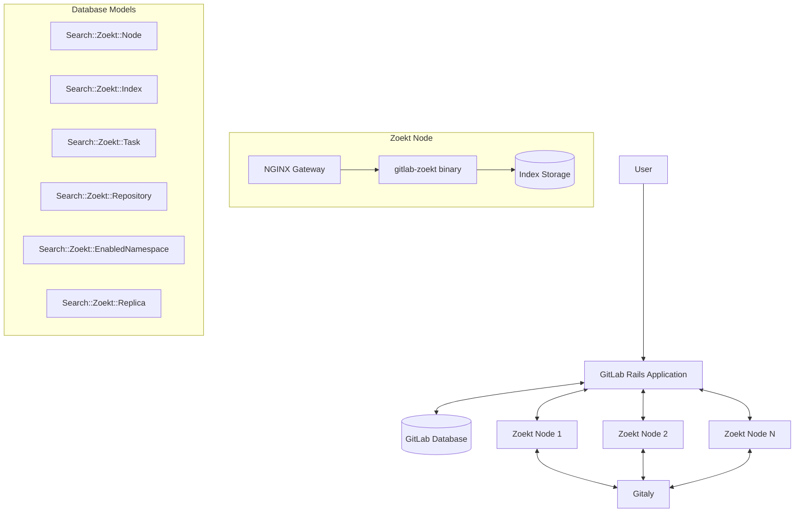
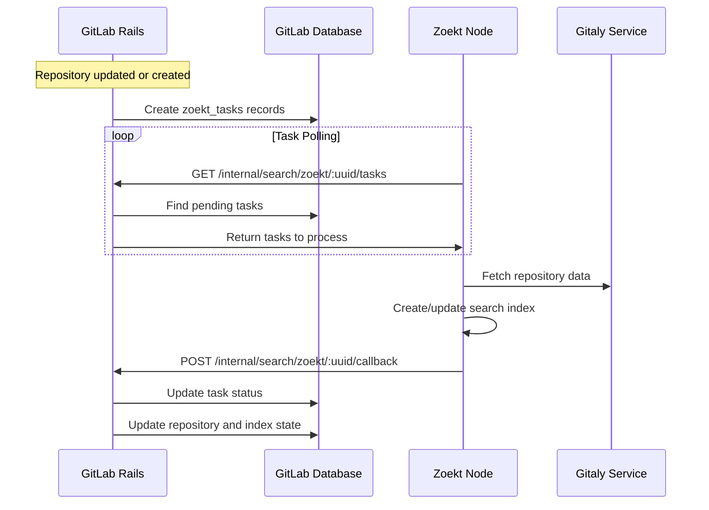
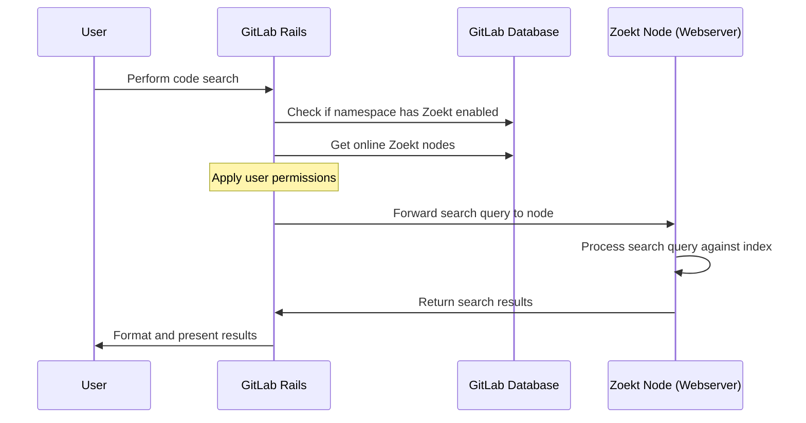
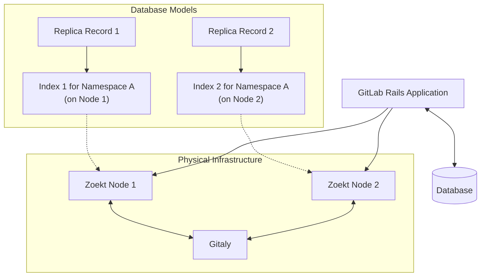
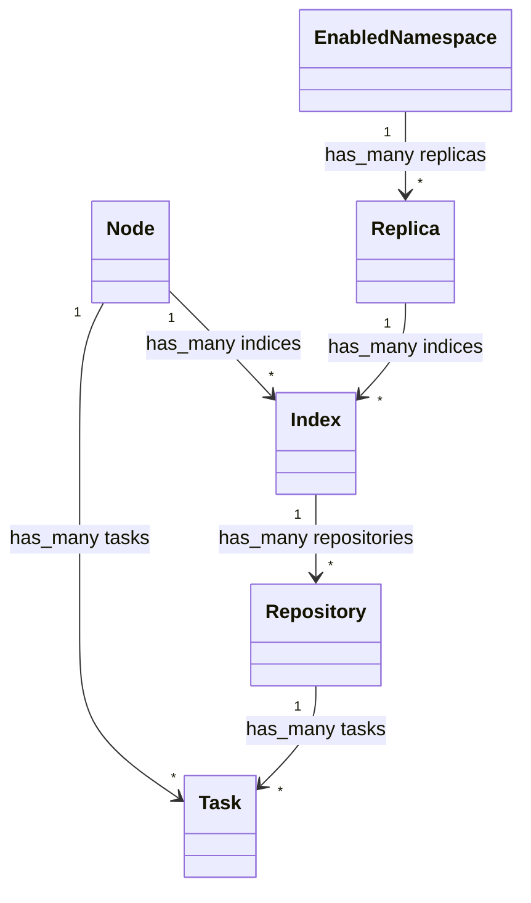
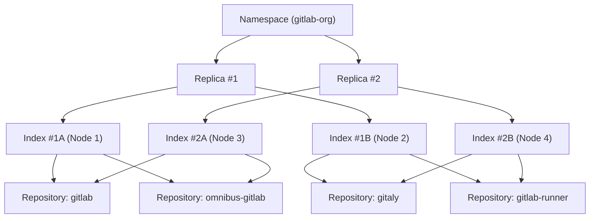




## 概要

私たちは GitLab に追加のコード検索機能を実装しました。この機能は [Zoekt](https://github.com/sourcegraph/zoekt) をバックエンドとして使用しています。Zoekt はコード検索専用に設計されたオープンソースの検索エンジンです。Zoekt は GitLab から API として使用され、実装の詳細として位置づけられています。一方、GitLab のユーザーインターフェースは Zoekt の機能によって実現される新しい機能で強化されています。

この統合は、既存の Elasticsearch ベースの検索に比べて大幅な改善を提供します：

1. **完全一致モード**：検索クエリに正確に一致する結果を返し、偽陽性を排除します
1. **正規表現モード**：強力なコード検索のために正規表現パターンとブール式をサポートします
1. **複数行マッチ**：検索結果で同じファイルから複数のマッチする行を表示します
1. **自己登録アーキテクチャ**：検索インフラのシンプルなスケーリングと管理を可能にします

## 動機

GitLab のコード検索機能は歴史的に Elasticsearch をバックエンドとして使用してきました。Elasticsearch は他のタイプの検索（Issue、マージリクエスト、コメントなど）には有用であることが証明されていますが、ユーザーがマッチを正確（偽陽性なし）かつ柔軟（[部分文字列マッチ](https://gitlab.com/gitlab-org/gitlab/-/issues/325234)や[正規表現](https://gitlab.com/gitlab-org/gitlab/-/issues/4175)のような機能をサポート）であることを期待するコード検索には理想的ではありません。

[オプションを調査した](https://gitlab.com/groups/gitlab-org/-/epics/7404)後、[Zoekt](https://github.com/sourcegraph/zoekt) がコード検索に最も適したよくメンテナンスされたオープンソース技術であると判断しました。私たちの調査によると、Zoekt の基本的なアーキテクチャは、ゼロから構築する場合に実装するものと一致しています。

私たちの[ベンチマーク](https://gitlab.com/gitlab-org/gitlab/-/issues/370832#note_1183611955)によると、Zoekt はスケール面でも実用的であり、GitLab.com への統合は成功裏に展開されています。

### ゴール

この統合の主なゴールは、コード検索に対して高い要望のある改善を次のとおり実装することでした：

1. [アドバンスドサーチでの完全一致（部分文字列マッチ）コード検索](https://gitlab.com/gitlab-org/gitlab/-/issues/325234)
1. [アドバンスドグローバルサーチでの正規表現サポート](https://gitlab.com/gitlab-org/gitlab/-/issues/4175)
1. [同じファイルでの複数行マッチのサポート](https://gitlab.com/gitlab-org/gitlab/-/issues/668)

ロールアウトは、この技術への投資が多くなりすぎる前に必要に応じて方向転換できるよう、スケーリングやインフラコストの問題をできるだけ早く発見・解決するように設計されました。

### 非ゴール

以下は初期のゴールではありませんでしたが、将来このソリューションを基に構築できる可能性があります：

1. リポジトリ全体の高速な正規表現スキャンを活用してセキュリティスキャン機能を改善する
1. 検索インフラコストの削減（さらなる最適化によって可能になる場合があります）
1. ユーザーが見つけることに関心があるものを予測する AI/ML 機能
1. 包括的なコードインテリジェンスとナビゲーション機能（より構造化されたデータが必要）

## 提案

[Zoekt 統合の初期実装](https://gitlab.com/gitlab-org/gitlab/-/merge_requests/105049)が作成され、Zoekt を Elasticsearch コード検索のドロップイン置換として使用する実現可能性を示しました。このデザインドキュメントでは、実装の詳細と GitLab.com および自己管理インスタンス向けにソリューションをスケールするための手順について概説します。

## 設計と実装の詳細

### ユーザーエクスペリエンス

ユーザーが Zoekt が有効なグループまたはプロジェクトでアドバンスドサーチを実行すると、UI で 2 つの検索モードを切り替えられるようになりました：

- **完全一致モード**：クエリに完全に一致する結果を返します（デフォルトモード）
- **正規表現モード**：正規表現パターンとブール式をサポートします

ユーザーは UI のトグルを使用して好みの検索モードを選択できます。検索構文は次のような修飾子を使用した高度なフィルタリングをサポートしています：

- `file:`：ファイル名でフィルタリング
- `lang:`：プログラミング言語でフィルタリング
- `sym:`：シンボル（メソッド、クラスなど）内を検索
- その他の[構文オプション](https://docs.gitlab.com/user/search/exact_code_search/#syntax)

新しい UI のスクリーンショットを以下に示します：


### 主要コンポーネント

#### 統合バイナリ：`gitlab-zoekt`

Zoekt にはインデックス化と検索のための独自のバイナリがあります。最初はそれらのいくつかを使用し、時間の経過とともに独自のバイナリを構築し始めました。その後、インデックス化と検索の両方のための単一バイナリに方向転換しました。この統合バイナリを `gitlab-zoekt` と呼び、以前の個別バイナリ（`gitlab-zoekt-indexer` と `gitlab-zoekt-webserver`）を置き換えます。これは Go コードベースで、バイナリを直接使用するのではなく、Zoekt コードベースのパブリックモジュールをライブラリとして使用します。この統合バイナリは 2 つの異なるモードで動作できます：

- **インデクサーモード**：リポジトリのインデックス化を担当します
- **ウェブサーバーモード**：検索リクエストの処理を担当します

統合バイナリを持つことで、Zoekt インフラのデプロイ、運用、保守が簡素化されます。このアプローチの主な利点は次のとおりです：

1. **デプロイの簡素化**：ビルド、デプロイ、保守が必要なバイナリは 1 つだけです
1. **一貫したコードベース**：インデクサーとウェブサーバー間の共有コードが 1 か所で保守されます
1. **運用の柔軟性**：同じバイナリが設定に基づいて異なるモードで動作できます
1. **テストモード**：統合バイナリはテスト目的で両方のサービスを同時に実行できます

#### データベースモデル

Zoekt は分散データベース（Elasticsearch のような）やデータベースサービス（Postgres のような）ではなく、ディスク上のインデックスファイルと相互作用する Go モジュール（とバイナリ）のセットです。インデックスファイルの作成と検索をサポートしています。その上に高レベルの分散、クラスタ化、レプリケートされた検索エンジンを構築する必要があったため、Zoekt プロセスとインデックスのライフサイクルをすべて管理する場所が必要でした。このライフサイクルデータを Rails に保存し、Zoekt プロセスが次に何をすべきかを把握するために定期的に Rails の状態をポーリングするようにしました。

GitLab は Zoekt を管理するためにいくつかのデータベースモデルを使用しています：

- **[`Search::Zoekt::EnabledNamespace`](https://gitlab.com/gitlab-org/gitlab/-/blob/master/db/docs/zoekt_enabled_namespaces.yml)**：Zoekt が有効なトップレベルの名前空間を追跡します
- **[`Search::Zoekt::Node`](https://gitlab.com/gitlab-org/gitlab/-/blob/master/db/docs/zoekt_nodes.yml)**：Zoekt サーバーノードをその容量、ステータス、設定に関する情報とともに表します
- **[`Search::Zoekt::Replica`](https://gitlab.com/gitlab-org/gitlab/-/blob/master/db/docs/zoekt_replicas.yml)**：高可用性のためのレプリカ関係を管理します
- **[`Search::Zoekt::Index`](https://gitlab.com/gitlab-org/gitlab/-/blob/master/db/docs/zoekt_indices.yml)**：ストレージ割り当てとウォーターマークレベルを含む、トップレベル名前空間のインデックス状態を管理します
- **[`Search::Zoekt::Repository`](https://gitlab.com/gitlab-org/gitlab/-/blob/master/db/docs/zoekt_repositories.yml)**：Zoekt 内のプロジェクトリポジトリをインデックス状態とともに表します
- **[`Search::Zoekt::Task`](https://gitlab.com/gitlab-org/gitlab/-/blob/master/db/docs/zoekt_tasks.yml)**：Zoekt ノードが処理する必要のあるインデックス化タスク（index、force_index、delete）を追跡します

### アーキテクチャの概要



Zoekt 統合は、いくつかの主要なコンポーネントが連携して動作します：

1. **GitLab Rails アプリケーション**：インデックス化が必要なリポジトリを管理し、Zoekt ノードと調整します
1. **Zoekt ノード**：`gitlab-zoekt` バイナリを実行してリポジトリのインデックス化と検索を処理します
1. **Gitaly**：インデックス化のために Zoekt に Git リポジトリへのアクセスを提供します
1. **データベース**：ノード、インデックス、タスク、リポジトリに関するメタデータを保存します

### インデックス化フロー



インデックス化プロセスは以下の手順に従います：

1. リポジトリが作成または更新されると、GitLab Rails アプリケーションが `zoekt_tasks` レコードを作成します
1. Zoekt ノード（インデクサーモードで動作）は内部 API を通じて定期的にタスクをプルします
1. Zoekt ノードは Gitaly からリポジトリデータを取得し、検索インデックスを作成することでタスクを処理します
1. Zoekt ノードはタスクステータスを更新するために GitLab にコールバック通知を送信します
1. GitLab は適切なデータベースレコード（`zoekt_task`、`zoekt_repository`、`zoekt_index`）を更新します

`zoekt_task` は 3 つの異なる種類があります：

- `index_repo`：インクリメンタルインデックス化（最後にインデックス化された SHA からデフォルトブランチの最新 SHA まで）
- `force_index_repo` または強制インデックス化：リポジトリの完全な再インデックス化（既存のインデックスファイルを削除してすべてを再インデックス化）
- `delete_repo`：既存のインデックス化されたファイルの削除をスケジュールします

競合状態を避けるために、任意の時点で 1 つのプロジェクトに対して 1 つのインデックス化操作のみが行われるようにロックメカニズムがあります。

### 検索フロー



検索プロセスは以下の手順に従います：

1. ユーザーが GitLab UI で検索を実行します
1. GitLab はユーザーの設定と有効な名前空間に基づいて、検索に Zoekt を使用すべきかを判断します
1. Zoekt が適切な場合、GitLab はウェブサーバーモードで動作する Zoekt ノードに検索を転送します
1. Zoekt は検索を処理し結果を返します
1. GitLab は結果をフォーマットしてユーザーに表示します

### 通信フロー

GitLab と Zoekt ノード間の通信は、すべて適切な認証メカニズムで保護された双方向 API 呼び出しを通じて行われます。

#### 認証アーキテクチャ

Zoekt 統合はすべての通信チャネルに対して包括的な JWT ベースの認証システムを実装しています：

1. **インデクサー → Rails の認証（JWT）**：Zoekt インデクサーは `Gitlab-Shell-Api-Request` ヘッダーを通じて GitLab Shell シークレットで署名された JWT トークンを使用して GitLab Rails に認証します（2025 年 4 月実装）
2. **Rails → ウェブサーバーの認証（JWT）**：GitLab Rails は `Gitlab-Zoekt-Api-Request` ヘッダーを通じて GitLab Shell シークレットで署名された JWT トークンを使用して Zoekt ウェブサーバーに認証します（[2025 年 7 月 31 日](https://gitlab.com/gitlab-org/cloud-native/charts/gitlab-zoekt/-/merge_requests/122)に以前の Basic Auth アプローチを置き換えて強制）

この統合 JWT 認証アプローチにより、GitLab の既存のセキュリティパターンとの互換性を維持しながら、すべての方向でのセキュアな通信を確保します。JWT 認証は [gitlab-zoekt チャート v3.0.0](https://gitlab.com/gitlab-org/cloud-native/charts/gitlab-zoekt/-/merge_requests/122)（2025 年 7 月）で [gitlab-org&17500](https://gitlab.com/groups/gitlab-org/-/epics/17500) の一部として必須となり、すべての認証チャネルにわたってトークンの有効期限とより良いセキュリティと一貫性を提供します。

#### タスク取得 API

Zoekt ノードは定期的に GitLab の内部 API を呼び出して以下を行います：

- GitLab への自己登録（ノードの UUID、URL、ディスクスペースなどのノード情報を提供）
- 処理が必要なタスクの取得
- ステータスとメトリクスの更新

```http
GET /internal/search/zoekt/:uuid/tasks
```

この API は JWT 認証で保護されており、以下のとおりです：

- JWT トークンは GitLab Shell シークレットを使用して Zoekt インデクサーが生成します
- トークンは `Gitlab-Shell-Api-Request` ヘッダーに含まれます
- GitLab Rails は同じ Shell シークレットを使用してトークンを検証します

この認証メカニズムにより、認可された Zoekt ノードのみが GitLab にタスクを登録および取得できます。

#### コールバック API

タスクを処理した後、Zoekt ノードは GitLab のコールバック API を呼び出して以下を行います：

- タスクステータスの更新（成功/失敗）
- 追加情報の提供（例：リポジトリサイズ）
- エラーや問題の報告

```http
POST /internal/search/zoekt/:uuid/callback
```

この API もタスク取得 API と同じメカニズムの JWT 認証を使用し、セキュアな双方向通信を確保します。

この非同期コールバックアーキテクチャは、インデックス化操作に Sidekiq ジョブを使用していた以前の設計からの大きな改善です。ブロッキング Sidekiq ジョブの代わりにコールバックを使用することで、システムはいくつかの重要な利点を得ます：

1. **Sidekiq 負荷の削減**：インデックス化操作はもはや Sidekiq ワーカーをブロックせず、他の重要な GitLab タスクのために空けます
1. **より良いスケーラビリティ**：同時インデックス化操作の数は、Sidekiq ワーカーの可用性ではなく Zoekt ノードの容量によってのみ制限されます
1. **改善された信頼性**：インデックス化中にノードがダウンしても、Sidekiq ジョブが不完全な状態のままになることはありません
1. **より効率的なリソース使用**：長時間実行のインデックス化タスクが貴重な Sidekiq リソースを消費しません
1. **関心の分離**：Zoekt ノードは独立してインデックス化を処理し、完了時のみ報告します

このアプローチにより、GitLab は軽量な調整役を維持し、計算集中的な作業は特化した Zoekt ノードが処理するため、システム全体のパフォーマンスと応答性が向上します。

#### 検索 API

GitLab は Zoekt ウェブサーバー API を呼び出して以下を行います：

- 検索クエリの実行
- 検索結果の取得
- ユーザー権限に基づくフィルタリングの適用

```http
GET /api/search
```

この通信は `Gitlab-Zoekt-Api-Request` ヘッダーを使用した JWT 認証で保護されており、GitLab の認証パターンと整合したセキュアで一貫した認証を提供します。検索リクエストの JWT 認証は 2025 年 7 月に必須となりました。

### Zoekt インフラストラクチャ

各 Zoekt ノードは、インデクサーモードとウェブサーバーモードの両方で同時に動作できる単一の `gitlab-zoekt` バイナリを実行します。ノードは高速な検索のために永続ストレージに `.zoekt` インデックスファイルを保存します。

典型的なデプロイには以下が含まれます：

- インデックス化と検索リクエストの両方を処理する `gitlab-zoekt` バイナリ
- シンボル抽出のための Universal CTags
- ルーティングと認証のためのゲートウェイコンポーネント

#### ゲートウェイアーキテクチャ

Kubernetes/Helm デプロイでは、Zoekt インフラストラクチャは GitLab Rails と Zoekt ウェブサーバー間の通信を処理するためにマルチティアゲートウェイアーキテクチャを使用します：

```text
Rails → Zoekt External Gateway → Zoekt Internal Gateway → Zoekt Webserver
```

ゲートウェイコンポーネントはそれぞれ異なる目的を果たします：

1. **外部ゲートウェイ（`zoekt-external-gateway`）**：デプロイメント Pod の一部であり、GitLab Rails からの検索操作のエントリポイントを提供します。このゲートウェイはリクエストをプロキシし、オプションで TLS ターミネーションを提供できます。

2. **内部ゲートウェイ（`zoekt-internal-gateway`）**：StatefulSet の一部であり、外部ゲートウェイとウェブサーバーインスタンス間の追加のルーティングレイヤーを提供します。このゲートウェイは StatefulSet 内の複数のウェブサーバーインスタンスにリクエストを分散するのに役立ちます。

3. **ウェブサーバー（`zoekt-webserver`）**：インデックスファイルに対して検索クエリを処理し、JWT 認証を処理する実際の Zoekt 検索サービスです。

この 3 層アーキテクチャは以下の利点を提供します：

- **ロードバランシング**：複数のウェブサーバーインスタンスにリクエストを分散できます
- **TLS ターミネーション**：ゲートウェイレベルでのオプションの TLS サポート
- **運用の柔軟性**：ゲートウェイはウェブサーバーインスタンスとは独立してスケールできます
- **ネットワーク分離**：レイヤードアーキテクチャによる追加のネットワークセキュリティ

ゲートウェイアーキテクチャの参考リンク：

- [外部ゲートウェイデプロイメント](https://gitlab.com/gitlab-org/cloud-native/charts/gitlab-zoekt/-/blob/main/templates/deployment.yaml)
- [内部ゲートウェイ StatefulSet](https://gitlab.com/gitlab-org/cloud-native/charts/gitlab-zoekt/-/blob/main/templates/stateful_sets.yaml)
- [ウェブサーバー StatefulSet](https://gitlab.com/gitlab-org/cloud-native/charts/gitlab-zoekt/-/blob/main/templates/stateful_sets.yaml)

### スケーリングと高可用性

#### 自己登録ノードアーキテクチャ

Zoekt は GitLab Runner に着想を得た自己登録ノードアーキテクチャを実装しています：

1. Zoekt ノードはアドレス、名前、ステータスを提供することで GitLab に自己登録します
2. GitLab はノードのステータス、容量、割り当てを含むノードのレジストリを維持します
3. GitLab は内部的にシャード割り当てを管理し、名前空間を特定のノードに割り当てます
4. 設定可能な期間チェックインしないノードは自動的に削除されます

このアーキテクチャにより、システムは自己設定可能になり、スケーリングが容易になります。

GitLab Runner と異なり、Zoekt ノードはインフラレベルで管理される共有シークレットで認証し、ユーザーが登録することはできません。そのため、自己登録はユーザー向けの機能というよりも、オペレーターの利便性のためのものです。

#### シャーディング戦略

1. グループ/名前空間はインデックス化と検索のために特定の Zoekt ノードに割り当てられます
1. GitLab はノードの容量と負荷に基づいて内部的にシャード割り当てを管理します
1. 新しいノードが追加されると、自動的に新しいワークロードを引き受けられます
1. ノードがオフラインになると、その作業を他のノードに再割り当てできます

#### レプリケーション戦略



レプリケーション戦略は、ノード間の実際のデータ同期ではなく、データベースレコードレベルで機能します：

1. **独立したインデックス化**：各 Zoekt ノードは Gitaly から直接データを取得することで独立してリポジトリをインデックス化します
1. **複数のレプリカレコード**：高可用性のために、GitLab は単一の名前空間に対して複数の `Search::Zoekt::Replica` レコードを作成できます
1. **分散インデックス**：各レプリカレコードは異なる物理 Zoekt ノードに割り当てられる場合があるインデックスレコードに関連付けられています
1. **高速インデックス化**：インデックス化は効率的です（`gitlab-org/gitlab` のような大規模なリポジトリで約 10 秒）。複数の独立したインデックスを維持することが実用的です
1. **複雑な同期なし**：このアプローチはノード間の複雑なインデックスファイルの同期を排除します
1. **検索負荷分散**：GitLab は関連する名前空間のインデックスを持つどのノードにも検索リクエストをルーティングできます

現在、GitLab は名前空間ごとに通常 1 つのレプリカレコードを作成しますが、システムは将来的に名前空間ごとに設定可能な数のレプリカをサポートするように設計されています。このアプローチは以下の利点を提供します：

- **水平スケーラビリティ**：より多くの名前空間を処理したりレプリケーションを増やすためにノードを追加します
- **高可用性**：1 つのノードが失敗した場合、レプリカインデックスを持つ他のノードに検索をルーティングできます
- **シンプルな運用**：維持またはトラブルシューティングが必要な複雑なレプリケーションメカニズムがありません
- **独立したスケーリング**：より多くのノードを追加することで、検索とインデックス化の容量を独立してスケールできます

この設計は、高可用性に必要な冗長性を提供しながら、運用のシンプルさと信頼性を優先します。

Zoekt データベースは情報源ではない（Gitaly からリポジトリを単に同期しているだけ）ため、特定のレプリカを「プライマリ」または「リーダー」として割り当てることを心配する必要はありません。代わりに、レプリカが Gitaly からデータを独立して同期し、インデックスを更新するたびに新しい情報源を取得することを想定しています。

### デプロイオプション

#### Kubernetes/Helm

GitLab は Kubernetes デプロイ向けに Helm チャート（[`gitlab-zoekt`](https://gitlab.com/gitlab-org/cloud-native/charts/gitlab-zoekt)）を提供しており、以下の機能があります：

- インデックスストレージのための永続ボリュームを持つ StatefulSet で Zoekt をデプロイします
- 設定可能なリソース割り当て、スケーリング、ネットワークオプション
- 自動ノード登録とサービスディスカバリー
- ロードバランシングと認証のためのゲートウェイコンポーネント
- Rails → ウェブサーバー通信のための NGINX を通じた設定可能な Basic 認証

`gitlab-zoekt` Helm チャートは本番環境でのスケーラビリティが高いことが証明されています。GitLab.com では、このデプロイが 36 TiB を超えるデータを処理しており、エンタープライズスケールでの運用能力を示しています。チャートの設計により、成長するコード検索ニーズに対応するためのパフォーマンスと信頼性を維持しながら、水平および垂直スケーリングの両方が可能です。

#### Docker/コンテナ

コンテナは [CNG リポジトリ](https://gitlab.com/gitlab-org/build/CNG/-/tree/master/gitlab-zoekt)からビルドされており、以下が含まれます：

- 統合された `gitlab-zoekt` バイナリ
- シンボル抽出のための Universal CTags
- 異なる操作モード用の設定可能な環境変数

### データベーススキーマ

主要なデータベーステーブルには以下が含まれます：

- `zoekt_nodes`：Zoekt サーバーノードに関する情報
- `zoekt_indices`：名前空間のインデックス状態を追跡します
- `zoekt_repositories`：GitLab プロジェクトを Zoekt インデックスにマッピングします
- `zoekt_tasks`：処理されるインデックス化タスクのキュー
- `zoekt_enabled_namespaces`：どの名前空間が Zoekt を使用するかの設定
- `zoekt_replicas`：高可用性のためのレプリカ関係を管理します

#### データベースモデルの関係

以下の図はデータベースモデル間の関係を示しています：



複数のレプリカとインデックスを持つ名前空間のデータベース構造の例を示します：



この例では：

- 名前空間（`gitlab-org`）は `EnabledNamespace` レコードを通じて Zoekt が有効になっています
- この名前空間に 2 つのレプリカレコードが作成されています
- 各レプリカは異なる物理ノードに割り当てられたインデックスレコードに関連付けられています
- 各インデックスには名前空間内の複数のプロジェクトのリポジトリが含まれています
- タスクは各リポジトリについて作成され、それぞれのノードでのインデックス状態を追跡します

この構造により、名前空間、インデックス、ノード、リポジトリ間の関係を明確に整理しながら、高可用性と負荷分散を実現します。

### gRPC を使用したフェデレーション検索

GitLab 18.0（2025 年 5 月）で [gRPC ベースのフェデレーション検索機能](https://gitlab.com/gitlab-org/gitlab/-/issues/500087)が実装され、複数の Zoekt ノードにわたる検索パフォーマンスが向上しました。この機能は以前の HTTP ベースの検索プロキシをより効率的な gRPC ストリーミング実装に置き換えました。

gRPC フェデレーション検索にはいくつかの利点があります：

1. **より効率的な通信**：gRPC はトランスポートに HTTP/2 を使用し、HTTP/1.1 よりも優れたパフォーマンスを提供します
1. **Zoekt ノード間のストリーミング**：結果が見つかるにつれて Zoekt ノード間でストリーミングされ、調整ノードが十分なマッチを収集したときに他のノードへの結果リクエストを停止できます
1. **レイテンシの削減**：多くのリポジトリにわたる検索に対して、より速い応答時間を実現：
   - 複数のノードにわたる並行検索
   - 十分な結果が収集されたら早期終了
   - HTTP/2 による効率的なバイナリプロトコル
   - 完全な結果セットを待つのではなく、到着した結果を処理
1. **より良いリソース管理**：検索処理の制限に対してより細かい制御が可能になり、以前の JSON アプローチで過剰な結果（例：10 ノード × 5,000 件 = 50,000 件）をロードする必要がなくなります

この実装は Zoekt ノード間で結果をストリーミングしますが、最終的な結果は Rails に返される前に調整 Zoekt ノードによって収集されることに注意することが重要です。現在の実装は Rails に結果をストリーミングしません。代わりに、パフォーマンスの利点は、より効率的なノード間通信と、すべてのリポジトリを網羅的に検索するのではなく、十分な結果が見つかったら検索を停止できる能力から来ています。

### 設定オプション

GitLab Zoekt 統合は以下を通じて設定できます：

1. **GitLab 管理者設定**：インデックス化と検索の有効化/無効化、同時インデックス化タスクの設定、自動削除設定の構成
1. **ユーザー設定**：個々のユーザーに対する完全コード検索の有効化/無効化
1. **Zoekt ノード設定**：リソース割り当て、ストレージ設定、ネットワーク設定
1. **フィーチャーフラグ**：統合の特定の機能や動作の制御

### ロールアウト戦略

ロールアウト戦略は以下の手順に従っています：

- [x] `gitlab-org` グループへの初期提供
- [x] 監視とパフォーマンスの改善
- [x] 高いコード検索ニーズを持つ選択された顧客への展開
- [x] スケーラビリティのためのシャーディングとレプリケーションの実装
- [x] より多くのライセンスグループへの段階的なロールアウト
- [x] シャードの自動バランシングの実装
- [x] より広いロールアウトのためのコストとパフォーマンスの評価
- [x] 継続的なパフォーマンス改善
- [x] GitLab.com のライセンスグループの大部分への提供
- [x] GitLab.com のすべてのライセンスグループへの一般提供

自己管理インスタンスの場合、管理者は必要なコンポーネントをインストールし、管理者エリアで機能を有効化することで Zoekt を有効化できます。

### 監視とメンテナンス

Zoekt 統合の健全性とパフォーマンスを監視するために、GitLab は以下を提供します：

1. **管理 UI**：インデックス化ステータス、ノードの健全性、ストレージ利用率を表示します
1. **Rake タスク**：インデックス化ステータスを確認するためのツール。例えば `gitlab:zoekt:info`
1. **自動管理**：オフラインノードの自動削除、ウォーターマークレベルの管理、インデックスの再配布の機能
1. **ログ**：インデックス化操作、検索クエリ、エラーの詳細なログ
1. **メトリクス**：インデックス化と検索操作のパフォーマンスメトリクス

### ウォーターマーク管理

Zoekt 統合は、ノードレベルとインデックスレベルの両方で動作する高度なウォーターマーク管理システムを実装しており、リソース枯渇を防ぎながら効率的なストレージ利用を確保します。

#### ノードレベルのウォーターマーク

各 Zoekt ノードには使用されているディスクスペースの割合に基づくウォーターマークしきい値があります：

1. **低ウォーターマーク（60%）**：このしきい値を超えると、GitLab は高いレベルへの到達を避けるための予防措置を開始します
1. **高ウォーターマーク（75%）**：ストレージへの圧力を示し、再バランシングアクションを優先します
1. **クリティカルウォーターマーク（85%）**：ノードのオーバーロードを防ぐために新しいインデックス化操作を一時停止しながら削除を実行する場合があります

これらのノードレベルのウォーターマークは、全体的なノードの健全性監視と、タスク割り当ておよびインデックス再配置に関する意思決定に使用されます。

#### インデックスレベルのウォーターマーク

ノードレベルのウォーターマークに加えて、ノード内の各インデックスは使用ストレージと予約ストレージの比率に基づく独自のウォーターマークレベルを持ちます：

1. **理想的なストレージ利用率（60%）**：最適な動作のためのターゲットレベル
1. **低ウォーターマーク（70%）**：潜在的な再バランシングまたは予約ストレージ割り当ての増加の評価をトリガーします
1. **高ウォーターマーク（75%）**：インデックスが予想以上のストレージを消費しており、利用可能であれば追加のストレージ割り当てを促す場合があります
1. **クリティカルウォーターマーク（80%）**：この特定のインデックスに対して削除プロセスをトリガーするか、ストレージが利用可能であれば予約ストレージ割り当てを大幅に増加させる場合があります

各インデックスには現在の状態を反映する `watermark_level` 列挙状態があります：

- `healthy`：期待されるパラメーター内で動作しています
- `overprovisioned`：理想的なストレージパーセンテージ未満を使用しています（必要以上の予約スペースがあります）
- `low_watermark_exceeded`：低ウォーターマークしきい値を超えました
- `high_watermark_exceeded`：高ウォーターマークしきい値を超えました
- `critical_watermark_exceeded`：クリティカルウォーターマークしきい値を超えました

これらのウォーターマークレベルは、ストレージ割り当て調整の方法に直接影響を与えます。`ready` 状態のインデックスは、ノードストレージが利用可能な場合により高いウォーターマークにヒットすると予約ストレージを増加させ、オーバープロビジョニング時に予約を減少させることができます。

#### ストレージ予約メカニズム

システムは以下のようなストレージ予約メカニズムを使用します：

1. 各インデックスはその割り当てを表す `reserved_storage_bytes` 値を維持します
1. ノードはその合計 `usable_storage_bytes` とすべてのインデックス予約の合計を追跡します
1. インデックスがより多くのストレージを必要とする場合、ノードの未使用ストレージから追加バイトを要求しようとします
1. `ready` 状態のインデックスは必要に応じて予約を増加および減少させることができます
1. 初期化状態のインデックスは完全にインデックス化されるまで予約を増加させることしかできません

この予約システムは、実際のニーズに基づく柔軟な割り当てを許容しながらストレージの過剰コミットを防ぎます。ノードがクリティカルウォーターマークに近づくと、スペースを回収するためにインデックスが削除対象としてマークされる場合があります。

ノードレベルとインデックスレベルのウォーターマークの組み合わせにより、ノードとインデックスレベルの両方でリソース枯渇を防ぎながら効率的なリソース利用を確保する包括的なストレージ管理アプローチを提供します。

## 結論

Zoekt 統合により、完全一致と正規表現の検索モードを提供することで GitLab のコード検索機能が大幅に改善されます。アーキテクチャは、ノードの自己登録、自動シャーディング、レプリケーションによる高可用性などの機能により、スケーラブルで自己管理型の耐障害性を持つように設計されています。

統合バイナリアプローチによりデプロイと保守が簡素化され、GitLab と Zoekt ノード間の双方向通信により効率的なタスク配布とステータス追跡が可能になります。

現在の開発の取り組みは、gRPC ベースのフェデレーション検索による検索パフォーマンスの向上と、数万のプロジェクトを超える名前空間をサポートするための全体的なシステムスケーラビリティの改善に焦点を当てています。
