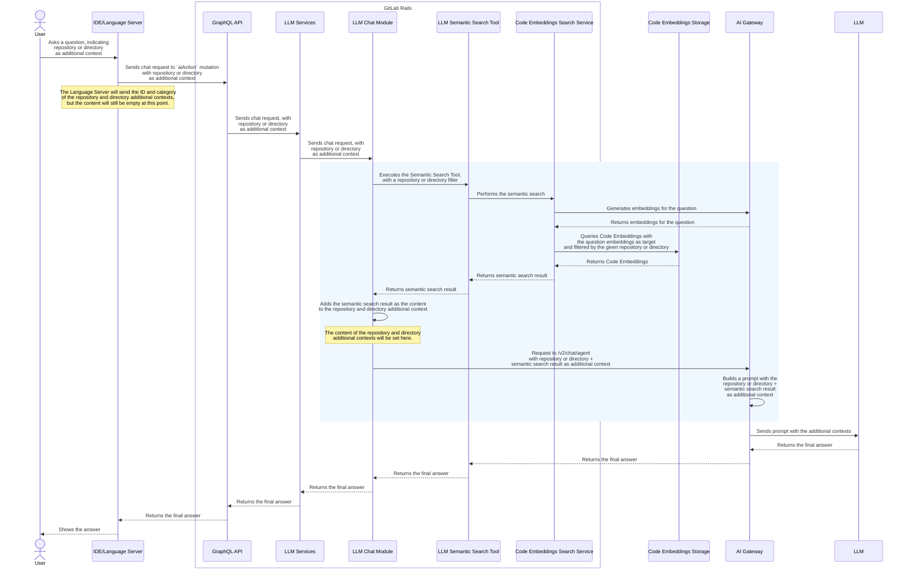
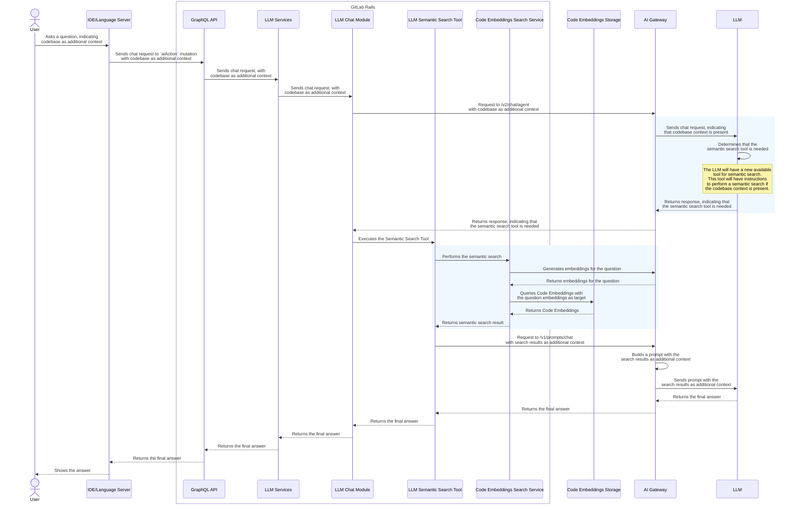
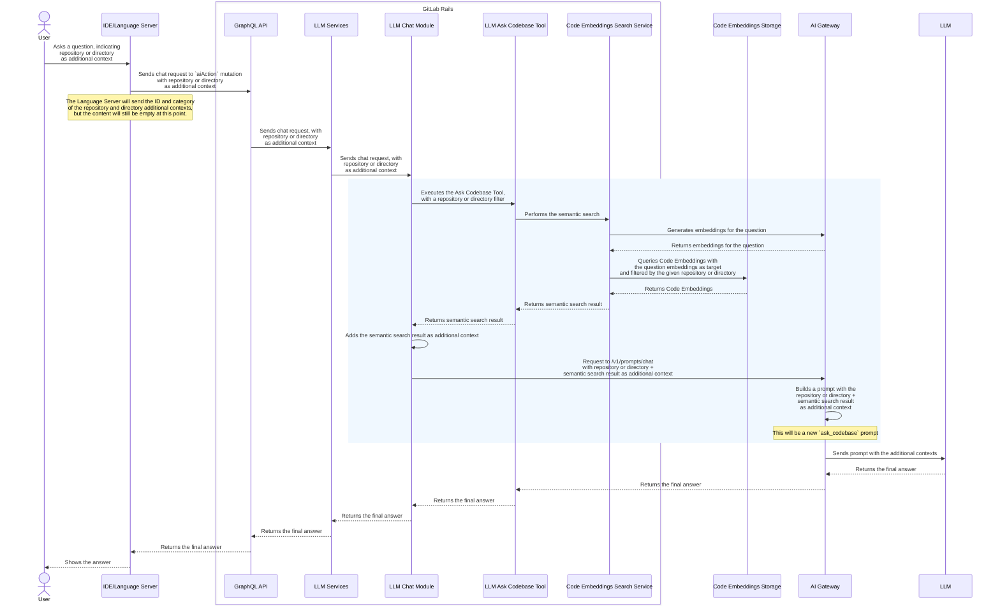

<!--

The canonical place for the latest set of instructions (and the likely source
of this file) is
[content/handbook/engineering/architecture/design-documents/_template.md](https://gitlab.com/gitlab-com/content-sites/handbook/-/blob/main/content/handbook/engineering/architecture/design-documents/_template.md).

Document statuses you can use:

- "proposed"
- "accepted"
- "ongoing"
- "implemented"
- "postponed"
- "rejected"

-->

<!-- Design Documents often contain forward-looking statements -->
<!-- vale gitlab.FutureTense = NO -->

<!-- This renders the design document header on the detail page, so don't remove it-->


<!--
Don't add a h1 headline. It'll be added automatically from the title front matter attribute.

For long pages, consider creating a table of contents.
-->

## 概要

私たちは **[Duo Chat](https://docs.gitlab.com/user/gitlab_duo_chat/) リクエスト**への**追加コンテキスト**として**コードベース**を含める機能を導入しています。これはリポジトリ全体または リポジトリ内のサブディレクトリを指します。

これを実現するために、コードベースを**コードエンベディング**と呼ばれるベクトルエンベディングとしてインデックス化します。

ユーザーが Duo Chat で質問すると、システムはコードエンベディングに対してセマンティック検索を実行してリポジトリから関連するコンテキストを取得し、それを大規模言語モデルで処理して有用なレスポンスを生成します。

この新機能は、[**Duo Pro** または **Duo Enterprise**](https://docs.gitlab.com/subscriptions/subscription-add-ons/) アドオンを持つ GitLab **Premium** または **Ultimate** ユーザーが利用できます。

**エピック：** この機能の作業は[このエピック](https://gitlab.com/groups/gitlab-org/-/epics/16910)で追跡されています。

## 動機

現在、私たちはお客様がリポジトリとコードベースを理解するための支援が十分ではありません。競合他社はより広い視野をサポートしており、ユーザーはリポジトリ全体について質問したり、複数のフォルダ、複数のファイル、コードの一部にコンテキストをスコープしたりできます。この機能的なギャップはお客様からよく言及されており、こちらはこのスペースにおける[最近の調査まとめ](https://docs.google.com/presentation/d/1oyuqOCzR4wzWa6Llo-EwwHdsTxMetd17X9bPYf-YMHA/edit#slide=id.g32a4294fe40_0_77)です。[LLM は私たちが提供するコンテキストと同等の性能しか発揮できない](https://nmn.gl/blog/ai-understand-senior-developer)ため、この分野での競合との同等性を達成することが重要です。

このイニシアチブは、自然言語クエリを通じてユーザーがコードベース全体と対話できるようにすることで、GitLab の [Duo Chat](https://docs.gitlab.com/user/gitlab_duo_chat/) 提供における重要な機能的ギャップを埋めることを目指しています。この機能により、ユーザーはリポジトリの理解、ナビゲーション、変更計画をより効果的に行えるようになります。これは競合製品ですでに提供されている機能です。

### ゴール

主なゴールは、[Duo Chat](https://docs.gitlab.com/user/gitlab_duo_chat/) への追加コンテキストとしてコードベースを追加することです。このイニシアチブでは、これはリポジトリとディレクトリにスコープされています。その後、リポジトリまたはディレクトリに対してセマンティック検索が行われ、その結果が AI モデルに送信される Chat プロンプトを強化するために使用されます。

セマンティック検索をサポートするために、コードエンベディングの作成がこの作業の初期スコープに含まれています。デフォルトブランチのインデックス化は作業の第 1 フェーズで行われ、フィーチャーブランチは第 2 フェーズでインデックス化されます。

[Duo が有効](https://docs.gitlab.com/user/get_started/getting_started_gitlab_duo/)なプロジェクトまたは名前空間に対してのみエンベディングを生成します。

### 非ゴール

以下はこのイニシアチブのスコープ外ですが、理論的にはその上に構築できます：

- エージェンティック Duo Chat への追加コンテキストとしてのコードベース。
- Duo Chat スラッシュコマンドへの追加コンテキストとしてのコードベース。
- コードサジェスションへの追加コンテキストとしてのコードベース。
- ローカルで変更されたファイルのベクトルエンベディングとしてのインデックス化とクエリのサポート。
- Duo Chat への追加コンテキストとしてのコードベースのナレッジグラフ表現。

_上記のトピックに関する提案された計画については、[次のステップと将来への備え](#next-steps-and-future-proofing)を参照してください。_

## 提案

**コードベースをチャットコンテキストとして**サポートするために、以下が必要です：

1. **コードエンベディング**を導入する
    - これはコードベース内のファイルのベクトル表現です。
    - コードベースをベクトルエンベディングとしてインデックス化するパイプラインを含みます
    - エンベディングに対してセマンティック検索を実行する機能を提供します
    - 2 つのフェーズで開発されます：
        - フェーズ 1：メインブランチでのコードエンベディングのサポート
        - フェーズ 2：フィーチャーブランチでのコードエンベディングのサポート

1. **[Duo Chat](https://docs.gitlab.com/user/gitlab_duo_chat/)** を更新して**追加コンテキストとしてのコードベース**をサポートする。
    - Chat で質問する際、ユーザーは以下を追加コンテキストとして含めるオプションを持ちます：
        - _repository_ - プロジェクトのコードベース全体を指します
        - _directory_ - _repository_ の「サブセット」であり、プロジェクト内のサブフォルダを指します
    - _repository_ が追加コンテキストとして選択された場合：
        - リポジトリ内のファイルの**コードエンベディング**表現に対してセマンティック検索が行われます。検索結果はその後、AI モデルに送信される Chat プロンプトを強化するために使用されます。
    - _directory_ が追加コンテキストとして選択された場合：
        - ディレクトリ内のファイルの**コードエンベディング**表現に対してセマンティック検索が行われます。検索結果はその後、AI モデルに送信される Chat プロンプトを強化するために使用されます。
        - 追加の考慮事項：ディレクトリにファイルが少ない場合、ファイルの内容が AI モデルに送信される Chat プロンプトを強化するための追加コンテキストとして直接含まれます。

## 設計と実装の詳細

### コンポーネント

このイニシアチブは以下のコンポーネントを導入または更新します：

#### コードエンベディング

_このコンポーネントの詳細な設計については、**[コードエンベディングブループリント](./code_embeddings.md)**を参照してください。_

これはコードベース内のファイルのベクトル表現です。ブランチに変更がプッシュされたときにエンベディングを生成するインデックス化パイプラインを導入します。また、これらのエンベディングを検索する機能も導入します。

**コードエンベディングのインデックス化**

- 変更は [GitLab Elasticsearch Indexer](https://gitlab.com/gitlab-org/gitlab-elasticsearch-indexer) と [GitLab Rails](https://gitlab.com/gitlab-org/gitlab) の両方で行われます。
- Rails では、[AI Context Abstraction Layer](../ai_context_abstraction_layer/) を使用します。
- エンベディングを生成する前にコードファイルを論理チャンクに解析するための新しい**コードパーサー**ライブラリを使用します。
  - コードパーサーは異なるプロジェクトで使用できるように独自のリポジトリに置かれます。
  - 詳細な設計と実装については、[Chunking 設計ドキュメント](./chunking.md)を参照してください。

**コードエンベディングの検索**

- 変更は [GitLab Rails](https://gitlab.com/gitlab-org/gitlab) で行われます
- エンベディングの検索を実行するために [AI Context Abstraction Layer](../ai_context_abstraction_layer/) を使用します。

#### Duo Chat

**[Duo Chat](https://docs.gitlab.com/user/gitlab_duo_chat/)** は GitLab の既存の AI 機能です。

現在の Duo Chat のワークフローとアーキテクチャの詳細については、以下のドキュメントを参照してください：

- [Chat プロンプトの構築方法](https://docs.gitlab.com/development/ai_features/duo_chat/#how-a-chat-prompt-is-constructed)
- [GraphQL API（`aiAction`）フロー](https://docs.gitlab.com/development/ai_features/#graphql-api)
- [Duo Chat プロセスフロー](https://gitlab.com/gitlab-org/modelops/applied-ml/code-suggestions/ai-assist/-/blob/main/docs/duo_chat.md)
- [Duo Chat ツール](https://gitlab.com/gitlab-com/content-sites/handbook/-/blob/main/content/handbook/engineering/architecture/design-documents/prompts_migration/_index.md#duo-chat-tools)

このイニシアチブでは、[GitLab Language Server](https://gitlab.com/gitlab-org/editor-extensions/gitlab-lsp)、[GitLab Rails](https://gitlab.com/gitlab-org/gitlab)、および [GitLab AI Gateway](https://gitlab.com/gitlab-org/modelops/applied-ml/code-suggestions/ai-assist/) の変更を導入します。詳細な実装については、以下の [Duo Chat へのコードベースのコンテキストとしての追加](#adding-the-codebase-as-context-on-duo-chat)セクションを参照してください。

### Duo Chat へのコードベースのコンテキストとしての追加

以下の図は、コードベース（リポジトリまたはディレクトリ）のセマンティック検索結果を追加コンテキストとして含めるワークフローを示しています。青色でハイライトされた領域が新しい変更を導入する場所です。



#### 追加コンテキストカテゴリ

1 つの追加コンテキストカテゴリを追加します：`repository`。ディレクトリが指定された場合は、`metadata` にディレクトリの相対パスを指定した `repository` 追加コンテキストとして扱われます。

#### ユニットプリミティブ

このイニシアチブの一部として以下のユニットプリミティブを追加します：

**コンテキストの包含**

- `include_repository_context` - Language Server と AIGW の両方で使用されます

**ツール**

- `codebase_search` - Rails で使用されます。[セマンティック検索ツール](#duo-semantic-search-tool)のために使用されます

**エンベディング生成**

- `generate_embeddings_codebase` - エンベディング生成エンドポイント（[`/v1/proxy/vertex-ai`](https://gitlab.com/gitlab-org/modelops/applied-ml/code-suggestions/ai-assist/-/blob/main/ai_gateway/api/v1/proxy/vertex_ai.py#L31)）に使用されるユニットプリミティブ

#### コードエンベディング検索サービス

これは**コードエンベディング**への呼び出しを処理するサービスクラスです。これは [AI Context Abstraction Layer](../ai_context_abstraction_layer/) を使用します。これがどのように行われるかの詳細については、[コードエンベディングブループリント](./code_embeddings.md)の**検索**セクションを参照してください。

#### Duo セマンティック検索ツール

これはこのイニシアチブで導入される新しい [Duo Chat ツール](https://docs.gitlab.com/development/ai_features/duo_chat/#adding-a-new-tool)です。

[スラッシュコマンドツール](https://gitlab.com/gitlab-org/gitlab/-/blob/30817374f2feecdaedbd3a0efaad93feaed5e0a0/ee/lib/gitlab/llm/completions/chat.rb#L120)と同様に、ツールが必要かどうかを LLM が推論する必要はありません。このツールは `repository` 追加コンテキストが存在する限り呼び出されます。

Rails では、Chat の質問のマッチするエンベディングを取得するために**コードエンベディング検索サービス**を呼び出す LLM ツールクラスを導入します。この新しい**セマンティック検索ツール**は LLM Chat モジュールから呼び出され、検索結果は `repository` 追加コンテキストの_コンテンツ_として含まれます。Chat リクエストは新しい追加コンテキストとともに AIGW に送信されます。

#### API 変更 - Duo Chat 利用可能な機能

Language Server は [GraphQL クエリ `{currentUser { duoChatAvailableFeatures } }`](https://docs.gitlab.com/api/graphql/reference/#currentuser) を呼び出して利用可能な Duo Chat 機能のリストを取得します。

このイニシアチブの一部として、`include_repository_context` ユニットプリミティブをこの機能リストに追加します。

#### API 変更 - Chat リクエスト

[Duo Chat で使用される GraphQL ミューテーション（`aiAction`）](https://docs.gitlab.com/development/ai_features/#graphql-api) はすでに [`chat` 入力](https://docs.gitlab.com/development/ai_features/#graphql-api)のパラメーターとして `additionalContext` を受け付けています。

[`repository` 追加コンテキストカテゴリ](#additional-context-category)を使用すると、`aiAction` ミューテーションへの `chat` 入力は次のようになります：

**`repository` を追加コンテキストとして使用する場合**

```graphql
mutation newChatMessage {
  aiAction(
    input: {
      chat: {
        content: "the user question"
        additionalContext: [{
          category: "repository",
          id: "the-project-id",
          content: "", # should be empty
          metadata: {
            directory: "some/dir" # this is optional, specified when the user selects directory as an additional context
            branch: "some-branch" # including the branch is a second phase iteration
          }
        }]
      }
    }
  ) {
    requestId
  }
}
```

#### Duo Chat 変更 - フロントエンド

[UI デザインを参照してください](https://gitlab.com/gitlab-org/gitlab/-/issues/523960)。

## 評価

コードベースのコンテキスト強化は、エンベディングの粒度や使用するエンベディングモデルなど、さまざまな要因によって異なる結果が出る可能性があります。この機能の MVC イテレーションを超えて、さまざまなエンベディングモデル、チャンキングの粒度、その他のエンベディングへのアプローチの有効性を評価すべきです。

### 評価のための考えられるアプローチ

| アプローチ | 説明 |
| -------- | ----------- |
| **サイズベースのチャンキング** | 固定サイズまたはトークン数でファイルを分割します |
| **Tree-sitter チャンキング** | AST を使用してコード構造を解析し、意味的に意味のあるチャンクを作成します |
| **ファイル全体のエンベディング** | ファイルコンテンツ全体（BLOB コンテンツ）のエンベディングを生成します |
| **異なるエンベディングモデル** | コード向けに構築された専用モデルと汎用テキストモデルを使用します |

## 次のステップと将来への備え

### エージェンティック Chat アーキテクチャへの移植の提案された手順

[エージェンティック Chat アーキテクチャ](https://gitlab.com/groups/gitlab-org/-/epics/17182)を導入したら、**AI Gateway 上の Duo ワークフローサービス**または **Language Server 上の Duo ワークフローエグゼキューター**のどちらかがベクトルエンベディングをクエリする必要があります。

これをサポートするために、**[コードエンベディング検索サービス](#code-embeddings-search-service)**の上に**Duo ワークフローサービス**または**Duo ワークフローエグゼキューター**のどちらかから呼び出される API を導入します。

### Duo Chat スラッシュコマンドへの追加コンテキストとしてのコードベース

スラッシュコマンドには `/refactor`、`/fix`、`/test` が含まれます。

スラッシュコマンドは**[セマンティック検索ツール](#duo-semantic-search-tool)**を使用するか、**[コードエンベディング検索サービス](#code-embeddings-search-service)**を直接呼び出してコードエンベディングを検索することができます。

あるいは、エージェンティック Chat でのみスラッシュコマンドへの追加コンテキストとしてコードベースをサポートすることもできます。

### コードサジェスションへの追加コンテキストとしてのコードベース

コード補完またはコード生成は**[コードエンベディング検索サービス](#code-embeddings-search-service)**を使用でき、これはコードエンベディングの検索に必要なすべてのロジックを抽象化します。

### ローカルファイルインデックス化のサポートの提案された手順

TBA

### ナレッジグラフとしてのコードベースのインデックス化

TBA

## 代替ソリューション

### LLM がコードベースセマンティック検索の必要性を推論できるようにする

このソリューションでは、AIGW 上のコードベースセマンティック検索のツール定義を導入します。このツールは LLM に提供され、LLM は質問に基づいてツールが必要かどうかを推論します。

このソリューションを採用しない理由は以下のとおりです：

- コードベース検索ツールが必要かどうかを LLM が推論する必要はありません。_repository_ または _directory_ の追加コンテキストが含まれている場合は、すぐにコードベース検索を実行できます。
- MVC の提案とプロダクトの要件は、コードベースセマンティック検索が必要かどうかをユーザーが明示的に決定できるべきというものです。このソリューションでは、ユーザーが _repository_ または _directory_ を追加コンテキストとして指定できますが、コードベース検索が実行されるかどうかの最終決定は LLM に委ねられます。
- このソリューションは Rails と AIGW の間で追加のラウンドトリップが必要となり、レイテンシが高くなります。

**ツール定義の PoC：** [MR: POC: コードベース検索ツール](https://gitlab.com/gitlab-org/modelops/applied-ml/code-suggestions/ai-assist/-/merge_requests/2415)。

**ワークフロー図：**



### 「コードベースに聞く」ツールとプロンプトを導入する

このソリューションでは、「コードベースに聞く」ツールを導入します：

- Rails では、`repository` 追加コンテキストがある場合に LLM Chat モジュールがツールが必要であることを判断します
- 「コードベースに聞く」ツールはセマンティック検索結果を取得するために「コードベースエンベディング検索サービス」を使用します
- 「コードベースに聞く」ツールは `/v1/prompts/chat` エンドポイントへのリクエストを送信します
- AIGW では、`/v1/prompts/chat` エンドポイントを通じて利用可能な `ask_codebase` の新しいプロンプトがあります
- ワークフローは本質的にスラッシュコマンドツールのワークフローと同様です



### `repository` と `directory` に異なるカテゴリとユニットプリミティブを使用する

リポジトリとディレクトリの追加コンテキストに単一の `repository` カテゴリを使用する代わりに、`repository` と `directory` のカテゴリを使用します。

注：カテゴリはユニットプリミティブと 1 対 1 のマッピングを持っており、概念的には「コードベースを含める」コンテキストに対して 1 つのユニットプリミティブしか持つべきではないため、このオプションを採用しないことに決めました。

`aiAction` ミューテーションへの `chat` 入力は次のようになります：

**`repository` を追加コンテキストとして使用する場合**

```graphql
mutation newChatMessage {
  aiAction(
    input: {
      chat: {
        content: "the user question"
        additionalContext: [{
          category: "repository",
          id: "the-project-id",
          content: "", // should be empty
          metadata: {'branch': 'some-branch'} // including the branch is a second phase iteration
        }]
      }
    }
  ) {
    requestId
  }
}
```

**`directory` を追加コンテキストとして使用する場合**

```graphql
mutation newChatMessage {
  aiAction(
    input: {
      chat: {
        content: "the user question"
        additionalContext: [{
          category: "directory",
          id: "file:///home/user/workspace/src/dir",
          content: "", // should be empty
          metadata: {
            'relativePath': 'src/dir',
            'branch': 'some-branch' // including the branch is a second phase iteration
          }
        }]
      }
    }
  ) {
    requestId
  }
}
```
