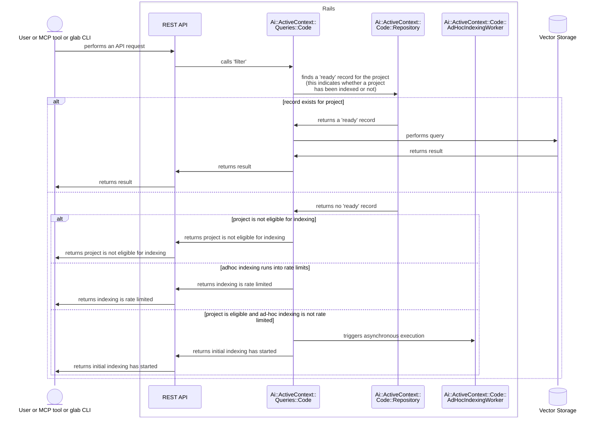

<!--

The canonical place for the latest set of instructions (and the likely source
of this file) is
[content/handbook/engineering/architecture/design-documents/_template.md](https://gitlab.com/gitlab-com/content-sites/handbook/-/blob/main/content/handbook/engineering/architecture/design-documents/_template.md).

Document statuses you can use:

- "proposed"
- "accepted"
- "ongoing"
- "implemented"
- "postponed"
- "rejected"

-->

<!-- Design Documents often contain forward-looking statements -->
<!-- vale gitlab.FutureTense = NO -->

<!-- This renders the design document header on the detail page, so don't remove it-->


## 概要

アドホックインデックス化は、まだインデックス化されていないプロジェクトでユーザーが Semantic Code Search を実行しようとしたときに、初回インデックス化を自動的に開始する遅延読み込みメカニズムです。

### メリット

1. **ストレージを大幅に削減**：アクティブなプロジェクトだけをインデックス化し、ストレージを 39～118 TB から管理可能な規模に削減します
1. **コスト効率**：Elasticsearch クラスターを大幅に小さくできます
1. **スケーラビリティ**：一度にすべてを管理するよりも、段階的な成長を容易に管理できます

### トレードオフ

1. **初回アクセス時のレイテンシ**：エンベディングが生成されるため、プロジェクトでの最初の Semantic Code Search は遅くなります

## 実行フロー

1. ユーザーまたは AI エージェントが、インデックス化されていないプロジェクトで Semantic Code Search を試みます。これはさまざまなツール（MCP または `glab`）から実行でき、最終的に [Semantic Code Search REST API](semantic_code_search.md#semantic-code-search-on-the-rest-api)に到達します。
1. Semantic Code Search REST API が [`Ai::ActiveContext::Queries::Code` クラス](./semantic_code_search.md#using-the-activecontext-query)で検索を実行します
1. プロジェクトがまだインデックス化されていないものの、インデックス化の対象である場合、`Ai::ActiveContext::Queries::Code` が `Ai::ActiveContext::Code::AdHocIndexingWorker` を開始します。これにより、非同期で実行されるアドホックインデックス化ジョブがキューに追加されます。
1. `Ai::ActiveContext::Queries::Code` が `initial indexing has been started, try again in a few minutes` というメッセージを返します
1. Semantic Code Search REST API が呼び出し元のユーザーまたはツールにメッセージを返します。
1. 数分後にユーザーまたは AI エージェントがそのプロジェクトで検索を実行すると、Semantic Code Search ツールまたは REST API が関連する検索結果を返します。

### `Ai::ActiveContext::Code::AdHocIndexingWorker`

実行時に、`AdHocIndexingWorker` は `RepositoryIndexWorker.perform_async` を呼び出します。そこから、指定されたプロジェクトの初回インデックス化が始まります。

初回インデックス化と関連する状態管理の詳細については、[インデックス状態の管理](code_embeddings.md#index-state-management)を参照してください。

### レート制限

単一の名前空間から大量のインデックス化リクエストが送られてシステムに過負荷がかかるのを防ぐため、アドホックインデックス化には名前空間ごとのレート制限があります。

- キー：`semantic_code_search_ad_hoc_indexing`
- スコープ：ルート名前空間（名前空間内のすべてのプロジェクトで共有）
- 制限：1 時間あたり 10 リクエスト。初回インデックス化はプロジェクトごとに 1 回だけ実行すればよいため、低いレート制限になっています。

### シーケンス図

