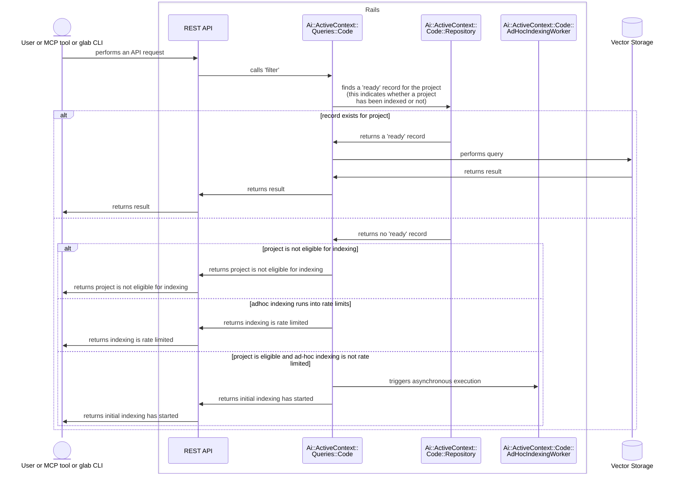

<!--

The canonical place for the latest set of instructions (and the likely source
of this file) is
[content/handbook/engineering/architecture/design-documents/_template.md](https://gitlab.com/gitlab-com/content-sites/handbook/-/blob/main/content/handbook/engineering/architecture/design-documents/_template.md).

Document statuses you can use:

- "proposed"
- "accepted"
- "ongoing"
- "implemented"
- "postponed"
- "rejected"

-->

<!-- Design Documents often contain forward-looking statements -->
<!-- vale gitlab.FutureTense = NO -->

<!-- This renders the design document header on the detail page, so don't remove it-->


## 概要

Ad-hoc indexing は lazy-loading の仕組みであり、まだインデックス化されていないプロジェクトでユーザーが Semantic Code Search を実行しようとしたときに、初期インデックス化を自動的にトリガーします。

### メリット

1. **ストレージの大幅削減**：アクティブなプロジェクトだけがインデックス化され、ストレージを 39 〜 118 TB から管理可能な水準まで削減します
1. **コスト効率**：Elasticsearch クラスターを大幅に小さくできます
1. **スケーラビリティ**：一度にすべてを管理するのではなく、段階的な成長を管理しやすくなります

### トレードオフ

1. **初回アクセスのレイテンシ**：プロジェクトで最初に実行する Semantic Code Search は、エンベディングが生成されるため遅くなります

## 実行フロー

1. ユーザーまたは AI エージェントが、インデックス化されていないプロジェクトで Semantic Code Search を試みます。これは、最終的に [Semantic Code Search REST API](semantic_code_search.md#semantic-code-search-on-the-rest-api)に流れるさまざまなツール（MCP または `glab`）を通じて実行できます。
1. Semantic Code Search REST API は、[`Ai::ActiveContext::Queries::Code` クラス](./semantic_code_search.md#using-the-activecontext-query)に対して検索を呼び出します
1. プロジェクトがまだインデックス化されていないものの、インデックス化の対象である場合、`Ai::ActiveContext::Queries::Code` は `Ai::ActiveContext::Code::AdHocIndexingWorker` をトリガーします。これにより、非同期で実行される ad-hoc indexing ジョブがキューに入ります。
1. `Ai::ActiveContext::Queries::Code` は、`initial indexing has been started, try again in a few minutes` を示すメッセージを返します
1. Semantic Code Search REST API は、呼び出し元のユーザーまたはツールにメッセージを返します。
1. 数分後、ユーザーまたは AI エージェントがそのプロジェクトで検索を実行すると、Semantic Code Search ツールまたは REST API が関連する検索結果を返します。

### `Ai::ActiveContext::Code::AdHocIndexingWorker`

perform 時に、`AdHocIndexingWorker` は `RepositoryIndexWorker.perform_async` を呼び出します。そこから、指定されたプロジェクトの初期インデックス化が開始されます。

初期インデックス化と関連する状態管理の詳細については、[Index state management](code_embeddings.md#index-state-management)を参照してください。

### レート制限

Ad-hoc indexing は、単一の namespace がインデックス化リクエストでシステムを圧倒しないように、namespace ごとにレート制限されます。

- キー: `semantic_code_search_ad_hoc_indexing`
- スコープ: ルート namespace（namespace 内のすべてのプロジェクトで共有）
- 制限: 1 時間あたり 10 リクエスト。初期インデックス化はプロジェクトごとに 1 回だけ行えばよいため、これは低いレート制限です。

### シーケンス図

