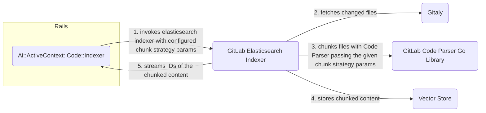

## 概要

コードファイルが Semantic Code Search 用にインデックス化されるとき、エンベディングの前に小さなチャンクへ分割されます。
これは検索品質とパフォーマンスの両方に影響する重要なコンポーネントであり、次の要因によって左右されます。

- **エンベディングモデルの制限** - エンベディングモデルには最大トークン数の制限があります（たとえば 2048 トークン）
- **検索関連性** - 小さなチャンクは、より精度の高い検索結果を提供します
- **ベクトルストアの効率** - 少数の大きなベクトルを保存するより、多数の小さなベクトルを保存する方が効率的です
- **メモリ管理** - 大きなファイルをチャンク単位で処理することで、メモリ過負荷を避けられます

## チャンク戦略とチャンクサイズ

**チャンク戦略**は、コードコンテンツをどのように分割するかを決定するために使用されるアルゴリズムです（たとえば、バイト単位、セマンティック境界単位）。
**チャンクサイズ**は、各チャンクの最大サイズを指します。

- バイト単位
  - コード構造やセマンティクスを考慮せずに、コードを固定サイズのバイトチャンクに分割します。
  - チャンクサイズは、チャンクあたりの最大バイト数を指します
- PreBERT tokenization 単位
  - BERT ベースのエンベディングモデル向けに最適化されたセマンティック境界を使用し、コード構造を尊重してコードを分割します。
  - チャンクサイズは、チャンクあたりの最大トークン数を指します

## チャンク化の実装とフロー

チャンク化は、[**GitLab Code Parser**](https://gitlab.com/gitlab-org/rust/gitlab-code-parser)に実装されています。
これは、FFI（Foreign Function Interface）を通じて[Go ライブラリ](https://gitlab.com/gitlab-org/rust/gitlab-code-parser/-/tree/main/bindings/go)を公開する Rust アプリケーションです。

[**GitLab Elasticsearch Indexer**](https://gitlab.com/gitlab-org/gitlab-elasticsearch-indexer)は、Code Parser ライブラリを使用してコードコンテンツをチャンク化し、`chunk_strategy` と `chunk_strategy_size` のパラメータを受け取ります。

Rails では、`Ai::ActiveContext::Code::Indexer` が **GitLab Elasticsearch Indexer** を呼び出す際に、構成済みのチャンク戦略パラメータを渡します。

**図**



## 設定

チャンク化戦略の設定は、`Ai::ActiveContext::Collection` レコードの `options` に永続化されます。例:

```ruby
Ai::ActiveContext::Collections::Code.collection_record.options
=> {"chunk_strategy"=>'code_pre_bert', "chunk_strategy_size"=>256}
```

これは、エンベディングモデルを初めて設定するときに指定できます。

チャンク化戦略が一度も設定されていない場合は、デフォルト値の
`chunk_strategy='code_bytes'` と `chunk_strategy_size=1000` にフォールバックします。

## 制限事項

チャンク化戦略は、エンベディングモデルを初めて設定した後は変更できません。変更すると、すべてのコンテンツの完全な再インデックス化が必要になるためです。

## 今後の拡張

自動再インデックス化を伴うチャンク化戦略の変更をサポートします。
