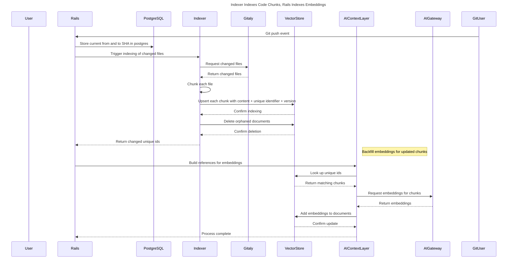
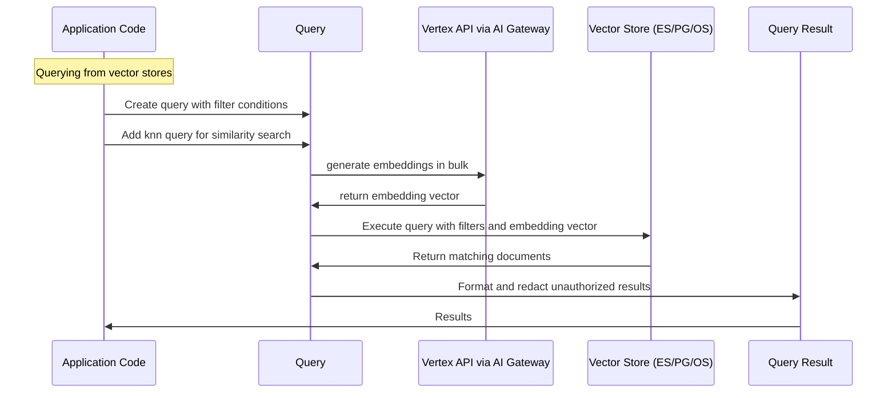
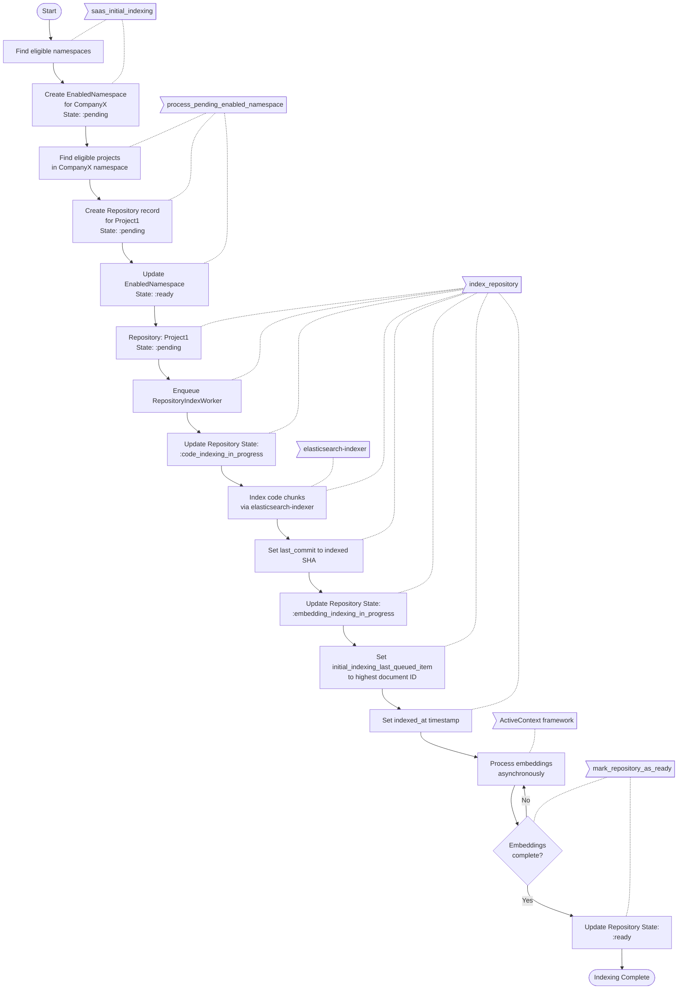
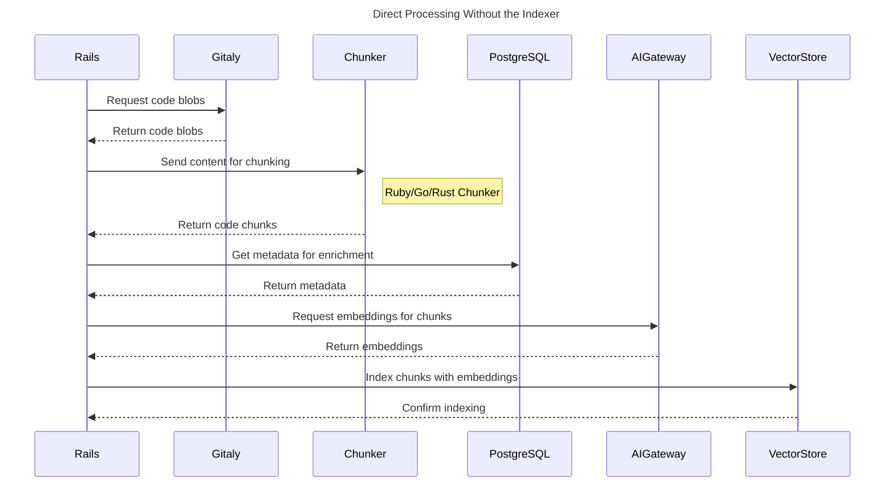
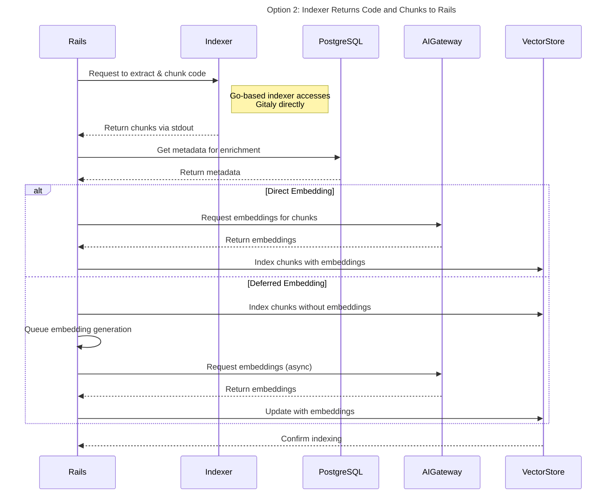

## コードエンベディング

### コードエンベディングのインデックス化に利用可能なツール

#### GitLab Active Context Gem

Elasticsearch、OpenSearch、PostgreSQL（PGVector 使用）などのベクトルストアとのインターフェースを提供する Ruby Gem で、ベクトルの保存とクエリを行います。

主要コンポーネント：

- **アダプターレイヤー**：異なるストレージバックエンドへの統一されたインターフェースを提供します。
- **コレクション管理**：ドキュメントのコレクションの作成と管理を処理します。
- **参照システム**：異なる種類のオブジェクトをシリアライズしてインデックス化する方法を定義します。
- **キュー管理**：インデックス化操作の非同期処理を管理します。
- **マイグレーションシステム**：スキーマ変更の管理のためのデータベースマイグレーションに類似しています。
- **エンベディングサポート**：ベクトル検索機能のためのエンベディング生成と統合します。

#### GitLab Elasticsearch Indexer

GitLab のために Git リポジトリを Elasticsearch にインデックス化する Go アプリケーションです。

主要コンポーネント：

- **インデクサーモジュール**：異なるコンテンツタイプのコアインデックス化機能を処理します。
- **Git 統合**：リポジトリコンテンツへのアクセスに Gitaly を使用します。
- **Elasticsearch クライアント**：Elasticsearch への接続を管理し、ドキュメントの送信を処理します。

### 提案：チャンクのインデックス化に Go インデクサーを使用し、エンベディングのインデックス化に Rails を使用する

Go インデクサーでインデックス化とチャンキングを行い、チャンクを直接ベクトルストレージに保存します。

インデクサーはコードファイルを効率的に処理してチャンク化し、Rails は別途エンベディングの生成と保存を処理します。

**プロセスフロー：**

- Git プッシュイベントが Rails を通じてインデクサーを呼び出します。
- インデクサーは Gitaly を呼び出して変更されたファイルを取得します。
- 設定されたチャンカーを使用してコンテンツをチャンク化することで各ファイルを処理します。
- 存在しない場合は各チャンクを作成します
  - Postgres：`INSERT into chunks (...) ON CONFLICT DO UPDATE`
  - Elasticsearch/OpenSearch：`doc_as_upsert: true, detect_noop: true`
- 孤立したチャンクを削除します
  - Postgres：`DELETE from chunks where filename = ? AND id NOT IN (?)`
- アップサートされたユニーク ID を Rails に返します
- AI 抽象化レイヤーが各ユニーク ID のエンベディング参照を追跡します。
- バッチでキューから参照が取得されます。
- ドキュメントが存在するか確認し、コンテンツを取得するためにベクトルストアに対してバルクルックアップが行われます。
- エンベディングがバルクで生成され、ベクトルストアにアップサートされます。



## 設計と実装の詳細

### 主要な実装ノート

- エンベディングの重複排除は参照の追跡によって管理されます。参照が 1 時間キューにある場合、複数回変更されているか削除されている可能性がありますが、最終状態のみを気にします
- ファイル名とチャンクコンテンツのハッシュ化されたバージョンが各ドキュメントのユニーク識別子として使用されます。
- インデクサーは完全なリポジトリをインデックス化するオプション（例：`--force` オプション）で呼び出すことができ、初期インデックス化、チャンカーが変更されたときなどに呼び出せます。通常モードは変更されたファイルのみを処理します。
- エンベディング生成はプロセスの最も時間のかかる部分であり、現在のモデルでは約 250 エンベディング/分のスループットです。
- データは Duo Pro または Duo Enterprise アドオンを持つ名前空間に制限されます。
- 注：この実装はフィーチャーブランチをサポートしていません。

### インデクサーで必要な変更

- コードチャンクのインデックス化のためのモードをインデクサーに追加する
- インデクサーがチャンカーを呼び出せるようにする
- インデクサーに postgres クライアントを追加する（Elasticsearch/OpenSearch クライアントは存在）し、Rails からクライアントを選択する
- 各アダプター（Elasticsearch、OpenSearch、Postgres）のインデックス化のための変換を実装する

### スキーマ

| フィールド名 | 型 | 説明 |
|------------|------|-------------|
| id | keyword | hash("#{project_id}:#{path}:#{content}") |
| project_id | bigint | プロジェクトでフィルタリング |
| path | keyword | ファイル名を含む相対パス |
| type | smallint | 完全な BLOB コンテンツかチャンカーから抽出されたノードかを示す列挙型。例：`file\|class\|function\|imports\|constant` |
| content | text | コードコンテンツ |
| name | text | チャンクの名前、例：`ModuleName::ClassName::method_name` |
| source | keyword | `"#{blob.id}:#{offset}:#{length}"` でフルファイルの再構築やチャンクの順序の復元に使用できます |
| language | keyword | コンテンツの言語 |
| embeddings_v1 | vector | コンテンツのエンベディング |

以下のフィールドは検討されましたが初期スキーマには追加されませんでした。新しいフィールドの追加は AI 抽象化レイヤーのマイグレーションを使用して行うことができ、バックフィルはマイグレーションを使用するか完全な再インデックス化によって行うことができます。

- `archived`（`boolean`）：グループレベルの検索でアーカイブされたプロジェクトをフィルタリング
- `branches`（`keyword[]`）：デフォルト以外のブランチをサポート
- `extension`（`keyword`）：拡張子でフィルタリングしやすくするためのファイルの拡張子
- `repository_access_level`（`smallint`）：グループレベルの検索のための権限
- `traversal_ids`（`keyword`）：効率的なグループレベルの検索
- `visibility_level`（`smallint`）：グループレベルの検索のための権限

### 複数ブランチをサポートするためのオプション

デフォルトでは、GitLab コード検索はデフォルトブランチのみのインデックス化と検索をサポートしています。複数ブランチのサポートにはストレージ、インデックス化戦略、クエリの複雑さに関する追加の考慮事項が必要です。

#### オプション 1：ブランチの差分のみをインデックス化する

デフォルトブランチと他のブランチの差分（diff）のみをインデックス化します。ファイルがブランチで変更された場合、ブランチのメタデータとともにそのバージョンをインデックス化します。

#### オプション 2：ブランチビットマップアプローチ

各ファイルのブランチメンバーシップを表すビットマップを保存します。ブランチの順序付きリストを維持し（例：master、branch1、branch2、branch3）、ビットマップでファイルの存在を表します（例：master と branch1 にあるファイル = 1100、branch2 で変更されたファイル = 0010）。

#### オプション 3：ツリー構造のトラバーサル

検索操作中にトラバースできる git リポジトリの階層を表すツリーベースの構造を実装します。これは実際のバージョン管理モデルを反映しますが、より洗練された実装が必要です。

#### メリットとデメリット

| オプション | メリット | デメリット |
|--------|------|------|
| **オプション 1：ブランチの差分のみをインデックス化する** | • 必要なストレージスペースが少ない<br>• シンプルな実装プロセス<br>• より速い初期インデックス化 | • 検索結果に重複したファイルが含まれる可能性がある（デフォルトブランチとブランチバージョンから）<br>• 結果の重複排除/選択ロジックが必要<br>• ブランチ固有の結果のブースティングは Elasticsearch の方が PostgreSQL より容易 |
| **オプション 2：ブランチビットマップアプローチ** | • ブランチメンバーシップの効率的な表現<br>• 重複した結果なし | • Elasticsearch/PostgreSQL でのビットマップ操作のパフォーマンスへの影響が不明<br>• ブランチが変更されたときすべてのファイルのメタデータの再インデックス化が必要（ただしエンベディングは不要）<br>• ブランチ数が増えるとビットマップサイズが大きくなる<br>• より複雑な実装 |
| **オプション 3：ツリー構造のトラバーサル** | • git モデルの最も正確な表現<br>• 複雑なクエリに対してより柔軟<br>• ブランチの階層とマージをより適切に処理できる可能性がある| • 最も複雑な実装<br>• 現在明確な実装パスが定義されていない |

### 提案：インデックス化されたチャンクに対する検索

フィルターとエンベディングを含むクエリが構築され、実行されると、ベクトルストアが実行できるクエリに変換されて結果が返されます。



**クエリの例：**

2 つのプロジェクトにわたってクエリを実行し、指定されたエンベディング（質問によって生成）に最も近い 5 つの結果を取得する：

```ruby
target_embedding = ::ActiveContext::Embeddings.generate_embeddings('the question')
query = ActiveContext::Query.filter(project_id: [1, 2]).knn(target: 'embeddings_v1', vector: target_embedding, limit: 5)
result = Ai::Context::Collections::Blobs.search(user: current_user, query: query)
```

これにより、最も近いマッチするブロブ*チャンク*が返されます。

クエリに AND と OR フィルターを追加する：

```ruby
query = ActiveContext::Query
  .and(
    ActiveContext::Query.filter(project_id: 1),
    ActiveContext::Query.filter(branch_name: 'master'),
    ActiveContext::Query.or(
      ActiveContext::Query.filter(language: 'ruby'),
      ActiveContext::Query.filter(extension: 'rb')
    )
  )
  .knn(target: 'embeddings_v1', vector: target_embedding, limit: 5)
```

### インデックス状態の管理

#### 概要

この設計提案では、コードエンベディングのためにインデックス化された名前空間とプロジェクトの状態を追跡するシステムについて概説します。

プロセスは SaaS と SM/Dedicated で異なります：

- SaaS：Duo ライセンスはルート名前空間レベルで適用されます。`duo_features_enabled` が false でない限り、名前空間内のサブグループとプロジェクトは Duo が有効になっています。
- SM：Duo ライセンスはインスタンスレベルで適用されます。インスタンスにライセンスがあれば、`duo_features_enabled` が false でない限り、すべてのグループとプロジェクトで Duo が有効になっています。

#### データベーススキーマ

`Ai::ActiveContext::Code::EnabledNamespace` テーブルは、Duo と GitLab のライセンスおよび有効化された機能に基づいてインデックス化すべき名前空間を追跡します。

`Ai::ActiveContext::Code::Repository` テーブルは、有効化された名前空間内のプロジェクトのインデックス化状態を追跡します。

#### プロセスフロー

システムは 1 分ごとにクーロンワーカー `Ai::ActiveContext::Code::SchedulingWorker` から呼び出される `SchedulingService` を使用し、定義された間隔でイベントを発行します。各イベントにはそのイベントを処理する対応するワーカーがあります。

#### タスクのスケジューリング

##### `saas_initial_indexing`

- **スコープ**：gitlab.com でのみ実行されます
- **対象基準**：
  - アクティブな非トライアルの Duo Core、Duo Pro、または Duo Enterprise ライセンスを持つ名前空間
  - 有効期限が切れていない有料ホスト型 GitLab サブスクリプションを持つ名前空間
  - 既存の `EnabledNamespace` レコードのない名前空間
  - `duo_features_enabled` AND `experiment_features_enabled` を持つ名前空間
- **アクション**：対象となる名前空間の `:pending` 状態の `EnabledNamespace` レコードを作成します

##### `process_pending_enabled_namespace`

- `:pending` 状態の最初の `EnabledNamespace` レコードを見つけます
- 以下のプロジェクトに対して `:pending` 状態の `Repository` レコードを作成します：
  - `EnabledNamespace` の名前空間に属するプロジェクト
  - `duo_features_enabled` を持つプロジェクト
  - 既存の `Repository` レコードのないプロジェクト
- すべてのレコードが正常に作成された場合、`EnabledNamespace` レコードを `:ready` としてマークします

##### `index_repository`

- 一度に 50 件の保留中の Repository レコードに対して `RepositoryIndexWorker` ジョブをエンキューします
- **`RepositoryIndexWorker` プロセス**：
  1. 初期インデックス化を処理するためにリポジトリの `IndexingService` を実行します
  2. 状態を `:code_indexing_in_progress` に設定します
  3. チャンクモードで `elasticsearch-indexer` を呼び出します：
     - Gitaly からファイルを見つけます
     - ファイルをチャンク化します
     - チャンクをインデックス化します
     - 成功した ID を返します
  4. `last_commit` をインデックス化された `to_sha` に設定します
  5. 状態を `:embedding_indexing_in_progress` に設定します
  6. 正常にインデックス化されたドキュメントのエンベディング参照をエンキューします
  7. `initial_indexing_last_queued_item` をインデックス化されたドキュメントの最高 ID に設定します
  8. `indexed_at` を現在時刻に設定します
  9. このプロセス中に失敗が発生した場合、リポジトリを `:failed` としてマークし `last_error` を設定します

##### エンベディング生成

- ActiveContext フレームワークはエンキューされた参照をバッチで非同期に処理します
- インデックス化されたドキュメントにエンベディングを生成して設定します

##### `mark_repository_as_ready`

- `:embedding_indexing_in_progress` 状態の `Repository` レコードを見つけます
- `initial_indexing_last_queued_item` レコードが現在インデックス化中のすべてのエンベディングモデルフィールドをベクトルストアに設定しているかを確認します
- エンベディングが完了したらリポジトリを `:ready` としてマークします

#### 1 つのプロジェクトを持つ名前空間のフロー例



#### 実装ノート

- システムはリポジトリ状態を追跡するためにステートマシンパターンを採用しています。
- すべてのタスクは長いクエリとメモリ負荷を軽減するためにバッチで処理されます
- `RepositoryIndexWorker` はインデクサーのタイムアウトよりも長いロックメカニズムを実装して、一度に 1 つの処理を確保します
- システム全体は現在 `active` な接続に紐付いています（一度に 1 つのアクティブな接続のみが許可されています）
- インデックス化中に失敗が発生した場合、リポジトリは `:failed` としてマークされ、エラーが `last_error` に記録されます

## 代替ソリューション

### Rails でインデックス化とチャンキングを行う

Rails から Gitaly を呼び出してコードブロブを取得し、Ruby/Go/Rust の専用チャンカーを使用してコンテンツを分割し、PostgreSQL でデータを強化し、AI ゲートウェイを通じてエンベディングを生成し、結果のベクトルをベクトルストアにインデックス化します。



### Go インデクサーでインデックス化とチャンキングを行い、チャンクを Rails に返す

Go ベースのインデクサーを使用してコードを抽出およびチャンク化し、stdout を通じて結果を Rails に送り返します。Rails はその後、PostgreSQL でデータを強化し、ベクトルストアにインデックス化します。エンベディングはインデックス化の前に同じプロセスで生成（直接）するか、別のプロセスで生成（遅延）します。



### ソリューションのメリットとデメリット

| オプション | メリット | デメリット |
|--------|------|------|
| **オプション 1：Go インデクサーでインデックス化とチャンキングを行い、チャンクを直接ベクトルストレージに保存する** | • より高性能なコードのインデックス化<br>• 関心の分離：コードとエンベディングのインデックス化は別々<br>• 急速に変化するファイルに対する優れた重複排除処理 | • すべてのベクトルストアのクライアントとアダプターを実装するには多くの労力が必要<br>• インデクサーがステートフルになる<br>• インデックス化のボトルネックはエンベディング生成側にまだ存在する |
| **オプション 2：Rails でインデックス化とチャンキングを行う** | • すべてのエンジニアに親しみやすい Ruby 技術<br>• より速い実装タイムライン<br> | • コードブロブの取得が遅い（Go ソリューションより最大 50 倍遅い）<br>• Gitaly からブロブを取得するサービスを構築する必要がある<br>|
| **オプション 3：Go インデクサーでインデックス化とチャンキングを行い、チャンクを Rails に返す** | • Gitaly からコードを取得する際の大幅なパフォーマンス向上<br>• 型安全性<br>• すべての自己管理インストールでバイナリが利用可能 | • 開発に Go の専門知識が必要<br>• チーム間の共有バイナリのオーナーシップ<br> |

#### 共通の実装アプローチ

すべてのオプション共通：

- AI 抽象化レイヤーを使用する
- Sidekiq ワーカーを使用して参照を処理する
- 失敗した参照を再試行のために再エンキューする
