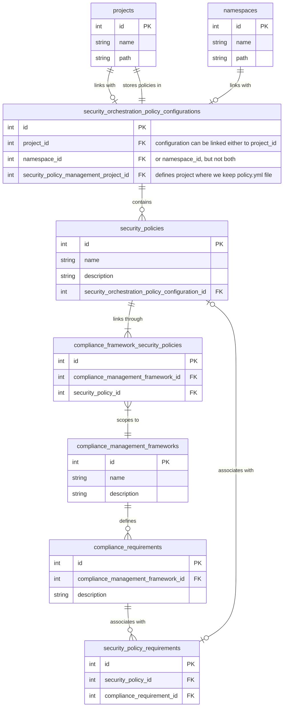

## コンテキスト

このドキュメントはコンプライアンスフレームワークとセキュリティポリシーの完全な関係を説明します。

- セキュリティポリシープロジェクトはプロジェクトまたは名前空間のどちらかにリンクできます（`security_orchestration_policy_configurations` テーブルのレコードが作成され、選択されたセキュリティポリシープロジェクトに関する情報を保存するために `security_policy_management_project_id` が使用されます）
- ポリシーはセキュリティポリシープロジェクトの `policy.yml` ファイルで定義され、`security_policies` テーブルでも表現されます
- 単一のポリシーは複数のコンプライアンスフレームワークにスコープを設定できます（`compliance_framework_security_policies` 結合テーブルを通じて）が、ポリシーを非スコープのままにしたり、選択されたグループまたはプロジェクトにスコープを設定したりすることもできます。ポリシーが非スコープの場合、関連するセキュリティポリシープロジェクトにリンクされたすべてのプロジェクト/名前空間に影響します。
  - セキュリティポリシーのスコープに関する詳細はこちらのドキュメントを参照してください https://docs.gitlab.com/ee/user/application_security/policies/#scope
- 特定のコンプライアンスフレームワークに対して、多くの要件を定義できます（`compliance_requirements` テーブルで表現）
- 単一の要件は複数のセキュリティポリシーに関連付けることができ（`security_policy_requirements` 結合テーブルを通じて）、単一のセキュリティポリシーも複数の要件に関連付けることができます。要件とセキュリティポリシーのリンクにより、ユーザーは選択したセキュリティポリシーを選択した要件の施行メカニズムとして使用できます

## エンティティ関係図

