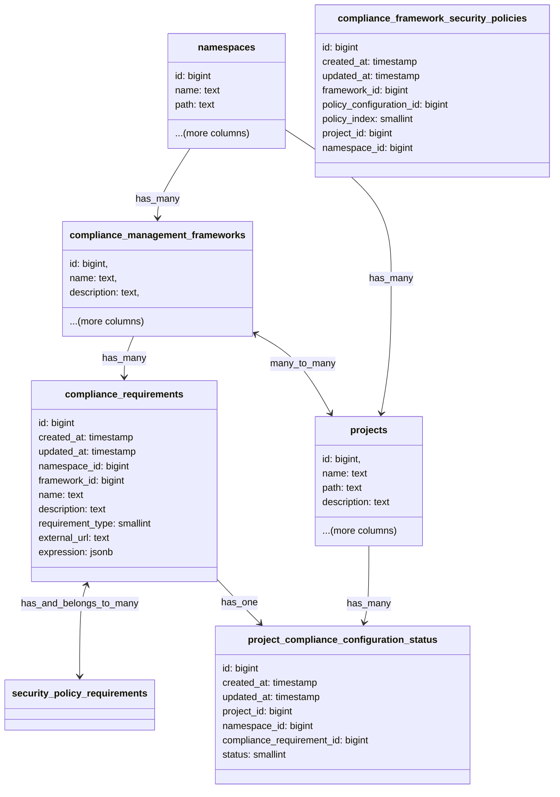

## コンテキスト

ユーザーが GitLab がサポートする（または将来サポートする）コントロールの網羅的なリストだけに依存する必要がなく、
独自の要件を作成できるようにしたいと考えています。また、プロジェクトが標準に準拠しているかどうかに影響する
外部サービスを持つユーザーもいます。

## アプローチ

ユーザーが要件に応じて独自にコントロールを作成できるようにするために、以下の種類の要件が必要です:

1. [内部要件](#internal-requirements): 利用可能なすべてのプロジェクト設定で論理式を作成できるようにする。
1. [外部要件](#external-requirements): HTTP サーバーなどの外部サービスに依存する要件を作成できるようにする。

### 内部要件 {#internal-requirements}

利用可能なすべてのプロジェクト設定で論理式を作成できるようにします。これらの式はプロジェクトを評価する
コントロールとなります。`requirement_type` として 'internal' を使用して、構造化された JSON として
`compliance_requirements` テーブルに保存します。

例として: `'merge_method' = 'merge commit' AND ('project_name' LIKE "%-team" OR 'compliance_framework' != 'SOC2')` という式を考えます。
この式は以下の構造の JSON としてデータベースに保存されます:

```json
{
  "operator": "AND",
  "conditions": [
    {
      "field": "merge_method",
      "operator": "=",
      "value": "merge commit"
    },
    {
      "operator": "OR",
      "conditions": [
        {
          "field": "project_name",
          "operator": "LIKE",
          "value": "%-team"
        },
        {
          "field": "compliance_framework",
          "operator": "!=",
          "value": "SOC2"
        }
      ]
    }
  ]
}
```

また、`merge_method = 'merge commit'` のような単純な式も保存できます。これは以下の JSON としてデータベースに保存されます:

```json
{
  "operator": "=",
  "field": "merge_method",
  "value": "merge commit"
}
```

入力を検証するためのスキーマバリデーターを作成し、`compliance_requirements` データベーステーブルの
`expression` jsonb カラムにこれを保存します。

フロントエンドには、フィールド、演算子、値を選択するためのドロップダウンを持つ UI を作成します。
これにより、ユーザーが自分で複雑な JSON 式を記述する必要がなくなります。

上記の JSON はエバリュエーターを使用して解析され、式が true または false に評価されます。基本的なエバリュエーター
クラスは次のようになります:

```ruby
module ComplianceManagement
  module ComplianceRequirement
    class QueryEvaluator
      def initialize(query, project)
        @query = query
        @project = project
      end

      def evaluate
        evaluate_node(@query)
      end

      private

      def evaluate_node(node)
        if node['operator']
          evaluate_operator_node(node)
        else
          evaluate_condition(node)
        end
      end

      def evaluate_operator_node(node)
        operator = node['operator'].upcase
        conditions = node['conditions']

        # Handle the case of a single condition
        if conditions.nil? || conditions.empty?
          return evaluate_condition(node)
        end

        results = conditions.map { |condition| evaluate_node(condition) }

        case operator
        when 'AND'
          results.all?
        when 'OR'
          results.any?
        else
          raise "Unknown operator: #{operator}"
        end
      end

      def evaluate_condition(condition)
        field_value = get_field_value(condition['field'])

        case condition['operator']
        when '='
          field_value == condition['value']
        when '!='
          field_value != condition['value']
        when 'LIKE'
          field_value.to_s.match?(like_to_regex(condition['value']))
        else
          raise "Unknown condition operator: #{condition['operator']}"
        end
      end

      def get_field_value(field)
        case field
        when 'merge_method'
          @project.merge_method.to_s
        when 'project_name'
          @project.name
        when 'compliance_framework'
          frameworks = @project.compliance_management_frameworks
          frameworks ? frameworks.map(&:name) : []
        else
          raise "Unknown field: #{field}"
        end
      end

      def like_to_regex(pattern)
        regex_pattern = Regexp.escape(pattern).gsub('%', '.*')
        Regexp.new("^#{regex_pattern}$", Regexp::IGNORECASE)
      end
    end
  end
end
```

上記のエバリュエーターを保存された JSON 式に対して使用できます:

```ruby
simple_query = {
  "operator" => "=",
  "field" => "merge_method",
  "value" => "merge"
}

complex_query = {
  "operator" => "AND",
  "conditions" => [
    {
       "field" => "merge_method",
       "operator" => "=",
       "value" => "merge"
    },
    {
       "operator" => "OR",
       "conditions" => [
         {
           "field" => "project_name",
           "operator" => "LIKE",
           "value" => "%-team"
         },
         {
           "field" => "compliance_framework",
           "operator" => "!=",
           "value" => "SOC2"
         }
       ]
     }
  ]
}

evaluator = ComplianceManagement::ComplianceRequirement::QueryEvaluator.new(complex_query, project)
result = evaluator.evaluate # Returns true or false

evaluator = ComplianceManagement::ComplianceRequirement::QueryEvaluator.new(simple_query, project)
result = evaluator.evaluate # Returns true or false
```

また、GitLab クエリ言語（GLQL）の使用も[検討しました](https://gitlab.com/groups/gitlab-org/-/work_items/14939#note_2096055093)が、
まだ十分に成熟しておらず、機能開発の速度を優先するために上記のアプローチで進め、後で GLQL と統合することにしました。

### 外部要件 {#external-requirements}

`requirement_type` として 'external' を使用して、ユーザーの外部サービスの外部 HTTP/HTTPS URL を
`compliance_requirements` テーブルに保存します。

これらの外部サービスに最新のプロジェクト設定を POST し、レスポンスとしてブール値のステータスを期待します。
また、外部要件のステータスを更新するために使用できる POST API を作成することもできます。これは
[外部ステータスチェックのステータス設定](https://docs.gitlab.com/ee/api/status_checks.html#set-status-of-an-external-status-check)と同様です。

## ワークフロー



既存のテーブル `compliance_checks` を削除し、上記のスキーマで既存のテーブル `compliance_requirements` を
更新します。`requirement_type` カラムには 'internal' または 'external' の有効な値を設定できます。

`expression` と `external_url` カラムは相互に排他的で、`requirement_type` に応じてどちらか一方のカラムが
null でなくなります。予期しない状況で複数のカラムに値が設定されている場合は、指定された requirement type に
関連付けられたカラムのみを優先します。例えば: ある行で `external_url` と `expression` の両方に値があるが、
`requirement_type` カラムの値が 'internal' であれば、`external_url` カラムに保存された値を無視し、
この行を内部要件として扱います。

要件の結果を保存するために新しいテーブル `project_compliance_configuration_status` を作成します。
現在の実装とは異なり、コンプライアンス要件が設定されているプロジェクトの結果のみを保存します。

以下の更新があった場合に、プロジェクトのすべての要件の結果をトリガーして再評価します:

1. プロジェクト設定への更新
1. プロジェクトにカスケードされるグループ設定への更新
1. コンプライアンス管理フレームワーク、ラベル、トピックなどのプロジェクトの関連付けへの更新
1. そのプロジェクトに関連付けられたコンプライアンス要件への更新

これは `compliance_requirements` と `project_compliance_configuration_status` データベーステーブル間の
リレーションシップが必要であることを意味します。

要件のステータスに変更があるたびに監査イベントを作成します。これにより、指定されたプロジェクトに対する
その要件の過去の変更を記録し、ステータス変更につながったユーザーとアクションの特定にも役立ちます。

指定された名前空間の `project_compliance_configuration_status` テーブルの行をクエリし、
コンプライアンスダッシュボードに結果を表示します。

## 制約

1. プロジェクトが持てるコンプライアンスフレームワークの最大数を制限する必要があります。最初は 20 に設定し、
必要に応じて後で増やすことができます。
1. フレームワークが持てるコンプライアンス要件の最大数を制限する必要があります。最初は 50 に設定し、
必要に応じて後で増やすことができます。
1. 式が持てるフィールドの最大数を制限する必要があります。最初は 5 に設定し、必要に応じて後で増やすことができます。
1. 式の作成に使用できるプロジェクト設定と関連付けのアローリストを作成する必要があります。
1. 上記の制限がなければ、ユーザーがシステムを悪用してクエリタイムアウトやユーザーエクスペリエンスの低下を
引き起こすことが非常に容易になります。

## 決定

内部コンプライアンス要件の式を `text` カラムとして保存し、`compliance_checks` テーブルを削除して
`compliance_requirements` のみを使用することにしました。これにより冗長性を削減し、
`project_compliance_configuration_status` テーブルに存在する行を遵守ダッシュボードに容易に表示できます。
