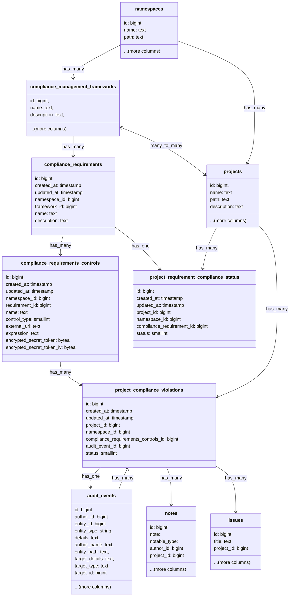

## コンテキスト

遵守レポートは設定されたフレームワークと要件/コントロールに対するプロジェクトの現在の状態を示しますが、
その状態の履歴は表示されません。最も重要なのは、プロジェクトが遵守していなかった時期や、
要件/コントロールへの違反が発生した時期が表示されないことです。

## アプローチ

違反エンジンは設定チェックエンジンと同様に機能します。監査イベントが作成されるたびに、
そのイベントが設定されたコンプライアンスコントロールに違反しないかどうかをシステムが確認します。

例えば、マージリクエストがマージされると `merge_request_merged` という監査イベントが作成され、
その後違反エンジンが実行されて違反がないか確認します。例えば: プロジェクトに「すべてのマージリクエストに
2 人の承認者が必要」というコントロールが定義されており、マージリクエストの承認者が 2 人未満であれば、
そのイベントから違反が作成されます。

GitLab が定義したすべてのコントロールには、トリガーポイントとして監査イベントタイプが設定されます。
新しいパラメーターを含めるように監査イベントタイプの yml ファイルを更新し、関連付けられているコントロールを
示します。1 つの監査イベントが複数のコントロールに関連付けられることがあります。例えば MR がマージされる場合などです。

以下は新しいパラメーターを含む監査イベントタイプ yml ファイルの例です:

```yml
---
name: merge_request_merged
description: A merge request is merged
introduced_by_issue: https://gitlab.com/gitlab-org/gitlab/-/issues/442279
introduced_by_mr: https://gitlab.com/gitlab-org/gitlab/-/merge_requests/164846
feature_category: compliance_management
milestone: '17.5'
saved_to_database: true
streamed: true
scope: [Project]
compliance_requirement_controls: [minimum_approvals_required_2, merge_request_prevent_committers_approval, merge_request_prevent_author_approval]
```

`vulnerabilities_slo_days_over_threshold`、`review_and_archive_stale_repos` などの監査イベントに
直接紐付けられないコントロールもいくつかあります。これらのコントロールについては、
`FrameworkEvaluationSchedulerWorker` に依存します。このワーカーがこれらのコントロールを評価して
ステータスが失敗であることが判明した場合、失敗したコントロールの監査イベントを作成し、
それが最終的に違反レコードを作成します。

[デザイン](https://gitlab.com/gitlab-org/gitlab/-/issues/463865/designs/Future-details-fix-available.png)によると、
違反はワークアイテムといくつかの類似点を持っています。例えば、コメントの追加機能や "detected"、"resolved" などの
状態があります。違反を新しいワークアイテムタイプとして追加することを検討しましたが、'Plan:Product Planning'
グループとの議論の結果、以下の理由から新しいワークアイテムタイプを作成せず、違反用の別のデータベーステーブルを
作成することにしました:

1. 違反はシステムによって自動的に生成されるため、大量のレコードが作成される可能性があり、
それらすべてを現在の単一の `issues` テーブルであるワークアイテムとして保存することは現実的ではありません。
2. すべてのワークアイテムを保存する `issues` テーブルは 300 GB を超えて成長しており、
[大規模データベーステーブルに典型的なパフォーマンス上の制限](https://docs.gitlab.com/development/database/large_tables_limitations/)に
直面しています。そのサイズのため、新しいインデックスやカラムの追加は禁止されています。すべての機能開発はこれらの
制約の範囲内で行う必要があります。
3. 違反はワークアイテムといくつかの類似点しかなく、ユーザーの割り当て、マイルストーンの追加、ラベルなどの
すべての機能を必要としませんでした。

また、コンプライアンス違反を無期限に保存しないというデータ保持ポリシーも設けます。違反を保存する期間は
まだ確定していませんが、無期限には保存しません。

## 設計の詳細


