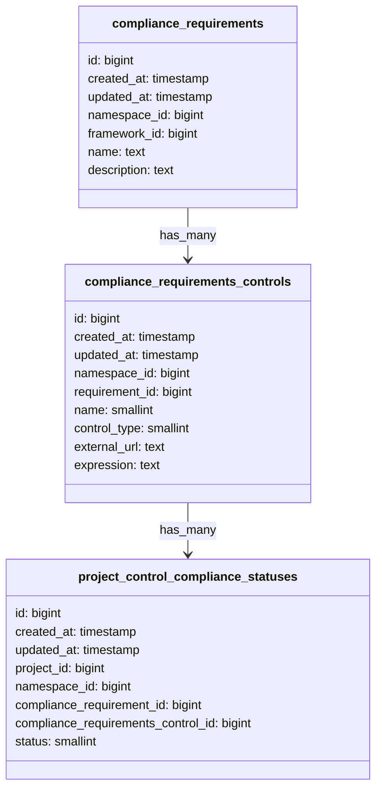

## コンテキスト

[以前に概説したように](./003_custom_controls.md)、`compliance_requirements` テーブル内に JSON として
コントロール式を保存することにしました。前の ADR では AND、OR などの論理演算子を許可して複雑なネストした
式を作成することが決定されましたが、現在の顧客および競合他社のリサーチの結果、ネストした式を許可する
必要はなく、要件内の各コントロールは AND で結合されるべきであることが分かりました。つまり、コントロールが
失敗するとコンプライアンス要件は失敗します。

前のアプローチでは、個々のコントロールのステータスを別々に評価・保存することにも課題がありましたが、
ダッシュボードでは各コントロールのステータスを別々に表示する計画です。

## 決定

`compliance_requirements` テーブル内に JSON として式を保存する代わりに、`compliance_requirements_controls`
という名前の別のデータベーステーブルを作成することにしました。この新しいデータベーステーブルの導入に伴い、
既存の `compliance_requirements` テーブルも少し更新する必要がありました。



`compliance_requirements_controls` テーブルの `expression` カラムを検証するためのスキーマバリデーターを
作成します。このカラムには以下の形式の単純な式が含まれます:

```json
{
  "operator": "=",
  "field": "minimum_approvals_required",
  "value": "2"
}
```

`name` フィールドは enum で、サポートするコントロールに対応する enum を保存します。これらのコントロールは
[こちら](https://gitlab.com/gitlab-org/gitlab/-/blob/602bdfba04acfae05b293cd5cb8afc10283acb01/ee/app/validators/json_schemas/compliance_requirement_expression.json#L51-56)で定義されています。

`control_type` カラムには 'internal' または 'external' の有効な値を設定できます。

`compliance_requirements_controls` テーブルには `requirement_id` と `name` に対してユニーク制約を設けます。
これにより、要件が同じ名前のコントロールを複数持てないことが保証されます。例えば、要件は
'minimum_approvals_required' コントロールの行を 2 つ持つことはできません。

`project_control_compliance_statuses` テーブルにも `compliance_requirements_control_id` と `project_id` に
対してユニーク制約を設けます。これにより、このテーブルの各行がプロジェクトに対する特定のコントロールの
コンプライアンスステータスを示すことが保証されます。

コンプライアンス要件が持てるコンプライアンスコントロールの最大数を 5 に制限し、必要に応じて後で増やします。

結果は `project_control_compliance_statuses` テーブルに保存されますが、ステータスは要件レベルではなく
プロジェクトごとのコントロールレベルになります。

[外部要件](./003_custom_controls.md#external-requirements)の計画は、内部要件への上記の変更によっても
変わりません。

1. 式が持てるフィールドの最大数を制限する必要があります。最初は 5 に設定し、必要に応じて後で増やすことができます。
1. 式の作成に使用できるプロジェクト設定と関連付けのアローリストを作成する必要があります。
1. 上記の制限がなければ、ユーザーがシステムを悪用してクエリタイムアウトやユーザーエクスペリエンスの低下を
   引き起こすことが非常に容易になります。
