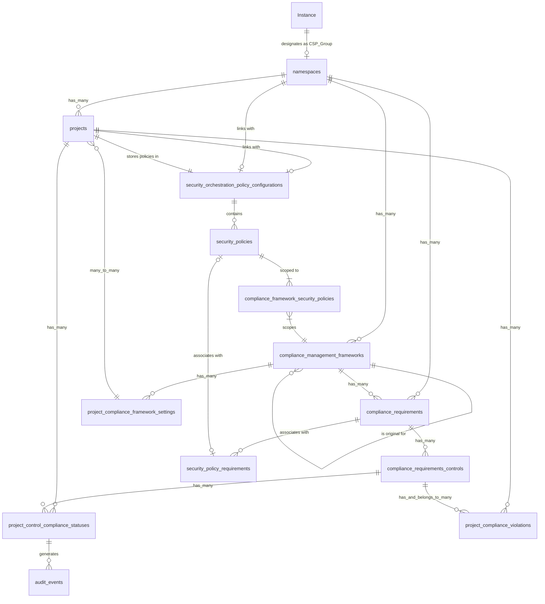

<div class="my-3 border-l-4 border-blue-500 bg-blue-50 px-4 py-3 rounded-r text-sm text-blue-800">
このページには今後予定されている製品・機能・機能性に関する情報が含まれています。ここに示す情報は参考目的のみです。購入・計画の決定にこの情報を使用しないでください。製品・機能・機能性の開発、リリース、タイミングは変更または延期される可能性があり、GitLab Inc. の独自の判断に委ねられています。
</div>

<div class="overflow-x-auto my-4">
<table class="w-full text-sm border-collapse">
<thead>
<tr class="bg-gray-100 text-left">
<th class="px-3 py-2 border border-gray-300">Status</th>
<th class="px-3 py-2 border border-gray-300">Authors</th>
<th class="px-3 py-2 border border-gray-300">Coach</th>
<th class="px-3 py-2 border border-gray-300">DRIs</th>
<th class="px-3 py-2 border border-gray-300">Owning Stage</th>
<th class="px-3 py-2 border border-gray-300">Created</th>
</tr>
</thead>
<tbody>
<tr>
<td class="px-3 py-2 border border-gray-300"><span class="inline-block rounded px-2 py-0.5 text-xs font-medium bg-gray-100 text-gray-700">ongoing</span></td>
<td class="px-3 py-2 border border-gray-300"><a href="https://gitlab.com/nrosandich" class="text-blue-600 hover:underline">@nrosandich</a>, <a href="https://gitlab.com/alan" class="text-blue-600 hover:underline">@alan</a></td>
<td class="px-3 py-2 border border-gray-300"><a href="https://gitlab.com/darbyfrey" class="text-blue-600 hover:underline">@darbyfrey</a></td>
<td class="px-3 py-2 border border-gray-300"></td>
<td class="px-3 py-2 border border-gray-300"><span class="inline-block rounded px-2 py-0.5 text-xs font-medium bg-gray-100 text-gray-700">~govern::compliance</span></td>
<td class="px-3 py-2 border border-gray-300">2025-04-02</td>
</tr>
</tbody>
</table>
</div>


## はじめに

コンプライアンスフレームワークとセキュリティポリシーは現在グループレベルで管理されており、複数のグループにまたがって一貫したコンプライアンスおよびセキュリティ要件を適用する必要がある組織にとって課題が生じています。このドキュメントでは、指定された Compliance and Security Policy (CSP) グループアプローチを使用してインスタンスレベルのコンプライアンスおよびポリシー管理機能を実装する提案アーキテクチャについて概説し、組織がインスタンス全体にコンプライアンスフレームワークとセキュリティポリシーを一元管理および一貫して適用できるようにします。

製品要件については [Instance Level Compliance and Policy Management](https://gitlab.com/groups/gitlab-org/-/epics/15864) エピックを参照してください。

## 提案

私たちは、インスタンスレベルでのコンプライアンスフレームワークとセキュリティポリシーの中央機関として、トップレベルグループを指定することを提案します。この CSP グループには、一元管理されたフレームワークとポリシーが含まれ、インスタンス全体の他のグループに適用されます。トップレベルグループのオーナーはこれらのフレームワークをプロジェクトに適用できますが変更はできず、コンプライアンスとセキュリティ要件の一貫した適用が保証されます。

## 目標

- 一か所から複数のトップレベルグループにわたってコンプライアンスフレームワークとセキュリティポリシーを適用できるようにする。
- コンプライアンスおよびセキュリティの担当者が組織のプロジェクト全体に共通要件を施行できるようにする。
- コンプライアンスとセキュリティ管理の職務分離を改善し、CSP グループの指定および管理できるユーザーを Admin ユーザーのみに付与するなど、適切な権限管理を可能にする。
- グループをまたいだセキュリティポリシープロジェクト (SPP) のリンクを管理する要件を削除し、集中化された SPP への一元化により、コンプライアンスとポリシー管理のユーザー体験を簡素化する。
- グループ間で一貫したコンプライアンスフレームワークを維持するための複雑なスクリプトの必要性を低減する。
- トップレベルグループが自グループ内でポリシーを管理しながら、全トップレベルグループへの一元化されたポリシーの施行も可能にする。
- Organization レベルのスコーピングが利用可能になった際に容易に進化できる設計を作成する。

## 対象外

- 既存のグループレベルのコンプライアンスフレームワークまたはセキュリティポリシー機能の置き換え。
- このフェーズでの Organization レベル管理の構築（ただし将来の互換性を考慮した設計を目指す）。
- 新しいコンプライアンスフレームワークタイプやセキュリティポリシータイプの作成。
- 基盤となるポリシー評価エンジンの変更。

## 用語集

- **CSP グループ**: Compliance and Security Policy グループ - コンプライアンスとセキュリティポリシーを一元管理するための昇格された権限を持つ、指定されたトップレベルグループ。
- **フレームワークスコープポリシー**: 特定のコンプライアンスフレームワークを対象とするセキュリティポリシー。
- **インスタンスレベル**: GitLab インスタンス全体に適用される機能。

## 設計概要

### 基本アプローチ

1. インスタンス管理者がトップレベルグループを CSP グループとして指定します。
2. CSP グループ管理者がコンプライアンスフレームワークとセキュリティポリシーを作成します。
3. コンプライアンスフレームワークはインスタンス内の他のすべてのトップレベルグループに自動的に適用されます。
4. セキュリティポリシーはコンプライアンスフレームワークにスコープされます。
5. 任意のグループ内のプロジェクトが CSP グループのフレームワークを使用できます。
6. CSP グループからのフレームワークが関連付けられたプロジェクトがパイプラインを実行すると、関連するポリシーが施行されます。

### エンティティ関係図



## データモデル

### テーブル

**security_policy_settings**

```sql
ALTER TABLE security_policy_settings
ADD COLUMN csp_namespace_id BIGINT REFERENCES namespaces(id);
```

### 変更テーブル

**compliance_framework_security_policies**

```sql
ALTER TABLE compliance_framework_security_policies
ADD COLUMN is_from_csp_group BOOLEAN NOT NULL DEFAULT FALSE;
```

## コアワークフロー

### CSP グループの指定

1. インスタンス管理者が `管理エリア > 設定 > セキュリティとコンプライアンス` に移動します。
2. 管理者が CSP グループとして指定するトップレベルグループを選択します。
3. システムが `security_policy_settings` テーブルにエントリを作成します。
4. UI が CSP グループの特別なインジケーターを表示するように更新されます。
5. CSP グループ指定の作成、変更、削除を追跡するインスタンス監査イベントを生成します。

### コンプライアンスフレームワークの作成

1. CSP グループ管理者が CSP グループ内にコンプライアンスフレームワークを作成します。
2. システムがこのフレームワークを他のすべてのトップレベルグループに自動的に関連付けます。

### セキュリティポリシー管理

1. CSP グループ管理者がポリシープロジェクト (`.gitlab/security-policies/policy.yml`) にセキュリティポリシーを作成します
2. 管理者がポリシーを特定のコンプライアンスフレームワークにスコープします
3. システムが `is_from_csp_group = true` として `compliance_framework_security_policies` にエントリを作成します

CSP グループアプローチは、スキャン実行ポリシー、マージリクエスト承認ポリシー、脆弱性管理ポリシーを含むすべてのセキュリティポリシータイプをサポートします。各ポリシータイプは同じスコーピングメカニズムに従いますが、異なる設定パラメーターと施行動作を持ちます。以下は異なるポリシータイプの例です：

#### スキャン実行ポリシーの例

```yaml
scan_execution_policy:
  name: Block vulnerable dependencies
  description: Vulnerability scanning for dependencies
  enabled: true
  rules:
  - type: pipeline
    branches:
    - release/*
  actions:
  - scan: sast
  policy_scope:
    csp_compliance_frameworks: # CSP compliance framework
      - id: 1
```

#### マージリクエスト承認ポリシーの例

```yaml
merge_request_approval_policy:
  name: Security approval for production code changes
  description: Require security team approval for changes to production code
  enabled: true
  rules:
  - type: merge_request
    branches:
    - main
    - production/*
  approvals_required: 1
  user_approvers:
    - security-team
  policy_scope:
    csp_compliance_frameworks: # CSP compliance framework
      - id: 1
      - id: 3
```

#### 脆弱性管理ポリシーの例

```yaml
vulnerability_management_policy:
  name: Critical vulnerability remediation policy
  description: Sets timelines for addressing critical vulnerabilities
  enabled: true
  rules:
  - type: vulnerability
    severity: critical
  actions:
  - issue_creation:
      due_date: 7 # days
      assignee: vulnerability_author
  policy_scope:
    csp_compliance_frameworks: # CSP compliance framework
      - id: 2
```

各ポリシータイプは施行のための固有のワークフローに従います：

- スキャン実行ポリシーは CI/CD パイプライン実行中に施行されます
- マージリクエスト承認ポリシーはマージリクエストの作成および更新時に施行されます
- 脆弱性管理ポリシーは脆弱性が検出されたときにトリガーされます

### プロジェクトコンプライアンスフレームワーク割り当て

1. グループオーナーが CSP フレームワークをプロジェクトに割り当てることができます。
2. グループオーナーが新規プロジェクトのデフォルトとして CSP フレームワークを設定できます。
3. システムがフレームワークを参照する `project_compliance_framework_settings` にエントリを作成します。

### CI/CD パイプラインでのポリシー施行

1. プロジェクトパイプラインが実行されると、システムが割り当てられたコンプライアンスフレームワークを確認します。
2. システムがフレームワークにスコープされたすべてのセキュリティポリシーを取得します。
3. ポリシーがプロジェクトのパイプラインに対して施行されます。

### CSP グループ変更管理

#### CSP グループ指定の変更

1. インスタンス管理者が `管理エリア > 設定 > セキュリティとコンプライアンス` に移動します。
2. 管理者が新しい CSP グループとして指定する別のトップレベルグループを選択します。
3. システムが影響情報を含む確認ダイアログを表示します。
4. 確認後：
   a. システムが `security_policy_settings` テーブルのエントリを更新します。
   b. 古い CSP グループからの以前のフレームワークは表示されなくなり適用されなくなります。
   c. 古い CSP グループからのすべての以前のフレームワークはプロジェクトに表示されなくなります。
   d. 古い CSP グループにリンクされたすべてのセキュリティポリシーのリンクが解除されます。
   e. 新しい CSP グループからの新しいフレームワークがすべてのトップレベルグループに表示されます。
   f. システムが CSP グループの変更を追跡する監査イベントを生成します。
5. UI インジケーターが新しい CSP グループを反映するよう更新されます。

#### CSP グループ指定の削除

1. インスタンス管理者が `管理エリア > 設定 > セキュリティとコンプライアンス` に移動します。
2. 管理者が「CSP グループ指定を削除」を選択します。
3. システムが影響情報を含む確認ダイアログを表示します。
4. 確認後：
   a. システムが `security_policy_settings` テーブルからエントリを削除します。
   b. 古い CSP グループからのすべての以前のフレームワークはプロジェクトに表示されなくなります。
   c. 古い CSP グループにリンクされたすべてのセキュリティポリシーのリンクが解除されます。
   d. システムが CSP グループの削除を追跡する監査イベントを生成します。
5. CSP グループがないことを反映して UI インジケーターが削除されます。

### コンプライアンスフレームワーク変更管理

#### CSP グループのコンプライアンスフレームワークの変更

1. CSP グループ管理者が CSP グループ内のコンプライアンスフレームワークを編集します。
2. システムが更新の監査イベントを生成します。
3. 更新されたフレームワークの変更が各トップレベルグループに自動的に反映されます。
4. UI が全グループにわたって更新されたフレームワーク情報を表示するよう更新されます。

#### CSP グループのコンプライアンスフレームワークの削除

1. CSP グループ管理者が CSP グループ内のコンプライアンスフレームワークを削除します。
2. システムが影響情報を含む確認ダイアログを表示します。
3. 確認後：
   a. システムがデータベース内でフレームワークを削除済みとしてマークします。
   b. システムが各削除の監査イベントを生成します。
   c. 削除されたフレームワークはプロジェクトに表示されなくなります。

#### CSP グループのフレームワークの関連付け

CSP グループで作成されたすべてのフレームワークは、他のすべてのトップレベルグループに自動的に関連付けられるため、特定のトップレベルグループのフレームワークを取得する際には、そのグループ自身のフレームワークと CSP グループのすべてのフレームワークが返されます。これにより、プロジェクト設定が CSP グループへの各関連付けを反映するよう更新されることが保証されます。

### セキュリティポリシー変更管理

#### CSP グループのセキュリティポリシーの変更

1. CSP グループ管理者がポリシープロジェクト内のセキュリティポリシーを編集します。
1. システムがポリシー yaml を更新します。
1. 変更はそのポリシーに関連付けられたフレームワークを使用しているすべてのプロジェクトに直ちに反映されます。
1. ポリシー施行が元のフレームワークを参照するため、ミラーリングされたフレームワークに対して何も操作は必要ありません。
1. システムがポリシー変更を追跡する監査イベントを生成します。

#### CSP グループのセキュリティポリシーの削除

1. CSP グループ管理者がポリシープロジェクトからセキュリティポリシーを削除します。
1. システムがポリシー設定を更新します。
1. ポリシーはすべてのプロジェクトから直ちに施行から削除されます。
1. システムがポリシー削除を追跡する監査イベントを生成します。

### トップレベルグループ管理

#### 新しいトップレベルグループの追加

1. ユーザーが新しいトップレベルグループを作成します。
2. グループオーナーは任意のフレームワークをプロジェクトに直ちに割り当てることができます。

#### トップレベルグループの削除

1. ユーザーがトップレベルグループを削除します。
2. システムが標準のグループ削除操作を実行します。
3. 標準のグループ削除を超えた特別な処理は必要ありません。

## API 設計

### GraphQL 拡張

```graphql
type Query {
  instanceCspGroup: Namespace
  complianceManagementFrameworks(
    namespaceId: ID!,
  ): [ComplianceManagementFramework!]!
}

type Mutation {
  designateInstanceCspGroup(namespaceId: ID!): Namespace
  removeCspGroupDesignation: Boolean
  createCspComplianceFramework(input: FrameworkInput!): ComplianceManagementFramework
  updateCspComplianceFramework(id: ID!, input: FrameworkInput!): ComplianceManagementFramework
  deleteCspComplianceFramework(id: ID!): Boolean
  scopePolicyToFramework(policyId: ID!, frameworkId: ID!): ComplianceFrameworkSecurityPolicy
  assignFrameworkToProject(projectId: ID!, frameworkId: ID!): ProjectComplianceFrameworkSetting
  setDefaultGroupFramework(namespaceId: ID!, frameworkId: ID!): Namespace
}

type ComplianceManagementFramework {
  scopedPolicies: [SecurityPolicy!]!
}

extend type Namespace {
  cspFrameworks: [ComplianceManagementFramework!]!
  defaultFramework: ComplianceManagementFramework
  isCspGroup: Boolean!
}

extend type Project {
  assignedFrameworks: [ComplianceManagementFramework!]!
}
```

## 認可モデル

### 権限構造

#### CSP グループ関連の権限

- `manage_instance_csp_group`: CSP グループの指定/指定解除（インスタンス管理者のみ）。
- `manage_csp_compliance_frameworks`: CSP グループ内のフレームワーク作成/編集（CSP グループ管理者）。
- `manage_csp_security_policies`: CSP グループ内のポリシー作成/編集（CSP グループ管理者）。
- `scope_csp_policies_to_frameworks`: ポリシーとフレームワークの関連付け（CSP グループ管理者）。

#### グループ関連の権限

- `assign_csp_frameworks`: CSP グループのフレームワークをプロジェクトに割り当て（グループオーナー/メンテナー）。
- `set_default_csp_frameworks`: グループのデフォルトフレームワークを設定（グループオーナー）。

### 権限マトリックス

| ロール | CSP 指定 | CSP フレームワーク管理 | CSP ポリシー管理 | CSP フレームワーク割り当て | デフォルトフレームワーク設定 |
|------|---------------|----------------------|---------------------|----------------------------|------------------------|
| インスタンス管理者 | ✅ | ✅ | ✅ | ✅ | ✅ |
| CSP グループ管理者 | ❌ | ✅ | ✅ | ✅ | ✅ |
| CSP グループメンテナー | ❌ | ✅ | ✅ | ✅ | ✅ |
| グループオーナー | ❌ | ❌ | ❌ | ✅ | ✅ |
| グループメンテナー | ❌ | ❌ | ❌ | ❌ | ❌ |
| 開発者 | ❌ | ❌ | ❌ | ❌ | ❌ |

## ユーザーインターフェース

### CSP グループ管理 UI

- CSP グループ指定付きのインスタンス設定 > コンプライアンスページ。
- グループリストでの CSP グループの視覚的インジケーター。
- CSP グループのロールを示す CSP グループページの特別なヘッダー。

### CSP フレームワーク管理 UI

- CSP グループでの拡張されたコンプライアンスフレームワーク UI。
- フレームワーク作成/編集フォーム。

### CSP ポリシー管理 UI

- CSP のポリシーエディター
- CSP のセキュリティポリシープロジェクト

### グループポリシー UI（セキュア > ポリシー）

- グループユーザーは CSP 経由で施行されるものを含め、グループに適用されたポリシーを表示できます

### プロジェクトポリシー UI（セキュア > ポリシー）

- プロジェクトユーザーは CSP 経由で施行されるものを含め、プロジェクトに適用されたポリシーを表示できます

### グループフレームワーク UI

- 利用可能な CSP フレームワークのリスト。
- プロジェクトのフレームワーク割り当て UI。
- グループのデフォルトフレームワーク設定。
- フレームワークが CSP グループからのものであることを示す視覚的インジケーター（読み取り専用）。

### プロジェクトコンプライアンス UI

- 割り当てられたフレームワークの表示。
- フレームワーク割り当てセレクター。
- 適用されたポリシーを表示するパイプライン統合。

## 技術的実装

### モデルと関連付け

これらのモデルはコンプライアンスフレームワークミラーリングシステムの構造を定義します。

#### ComplianceManagementFramework

- このモデルはコンプライアンスフレームワークを表し、組織が従うべきセキュリティポリシー、要件、ルールのセットで構成されます。
- 名前空間（グループ）に属するコンプライアンスフレームワークを定義します。
- 以下との関係を確立します：
  - CSP グループのフレームワーク
  - コンプライアンスフレームワークセキュリティポリシー（セキュリティポリシーの適用用）
  - セキュリティポリシー（`compliance_framework_security_policies` 経由）。
- スコープを定義します：
  - `csp_frameworks`: CSP フレームワークとして指定されたフレームワークをフィルタリングします。
  - `frameworks_from_csp`: CSP グループからのフレームワークをフィルタリングします。
  - `frameworks`: CSP グループからではないフレームワークをフィルタリングします。

### サービス

#### CSP::PolicyResolverService

- 特定のプロジェクトに適用されるポリシーを解決して返す方法を提供します。
- 特定のプロジェクトのポリシーを取得し、構造化されたレスポンスとして返します。

### バックグラウンドジョブ

これらは、フレームワークのミラーリングとクリーンアップを処理するためにバックグラウンドで実行される非同期ワーカーです。

#### CSP::SyncDeletedFrameworksJob

- CSP コンプライアンスフレームワークが削除または CSP グループの割り当てが解除された際に、古いフレームワーク設定が残るのを防ぎます。
- `framework_id` が削除されたフレームワークに一致するフレームワーク設定を検索します。
- これらの孤立したフレームワーク設定を削除します。

### コントローラー

コントローラーは CSP グループ設定を管理するための API エンドポイントを公開します。

#### API::V4::Instance::CspGroupController

- ソースコンプライアンスフレームワークを保持する CSP グループを取得および更新する API を提供します。
- 認証と認可
  - ユーザー認証が必要です。
  - 管理者のみが CSP グループを更新できることを保証します。
- Show アクション
  - CSP グループの名前空間 ID を取得して返します。
- Update アクション
  - InstanceSettings の CSP グループ名前空間を更新します。
  - 成功レスポンスを返します。

## 決定事項

- [001: フレームワークのミラーリング](decisions/001_mirroring_frameworks.md)

## 将来の考慮事項

### Organization エンティティの統合

ユニオンアプローチは Organization レベルの実装への明確な移行パスを提供します：

- インスタンスレベルの指定を Organization エンティティに置き換え
- CSP フレームワークシステムを組織間で機能するよう変換
- 同じ権限モデルを Organization レベルで維持

### 拡張機能

- 特定プロジェクトの除外リクエスト。
- 詳細なコンプライアンスレポート。
- フレームワークのバージョン管理と履歴。
- 強化されたポリシーテンプレート。
- コンプライアンス違反の自動修正。
- インスタンス全体の可視性のためのコンプライアンスダッシュボード。
