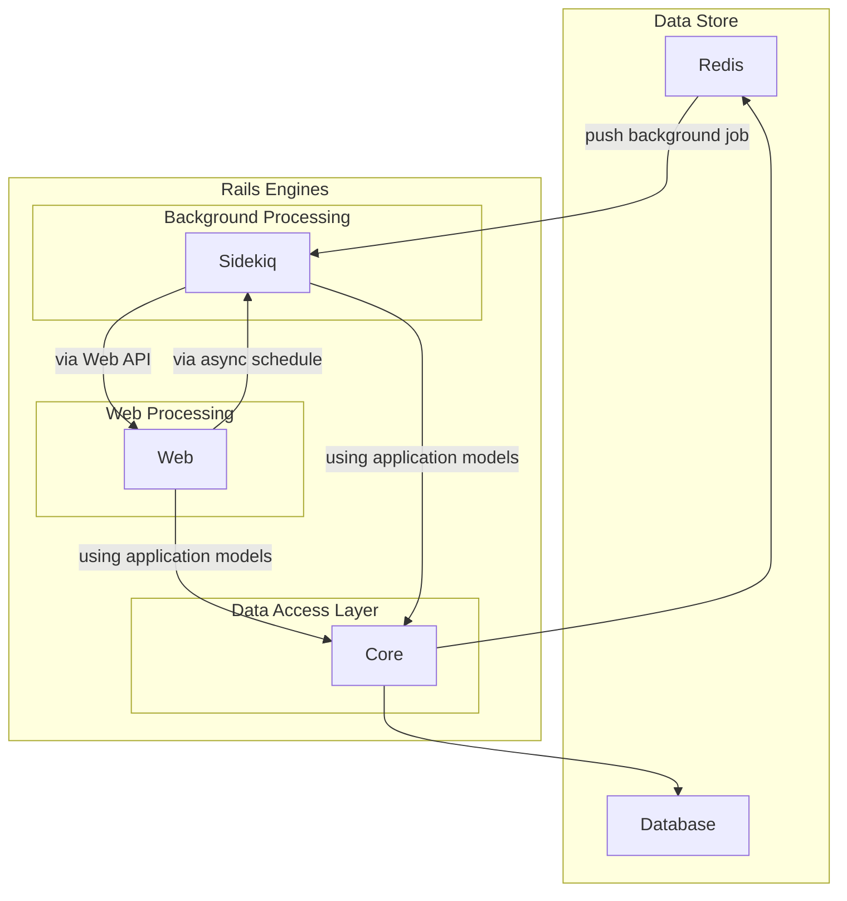
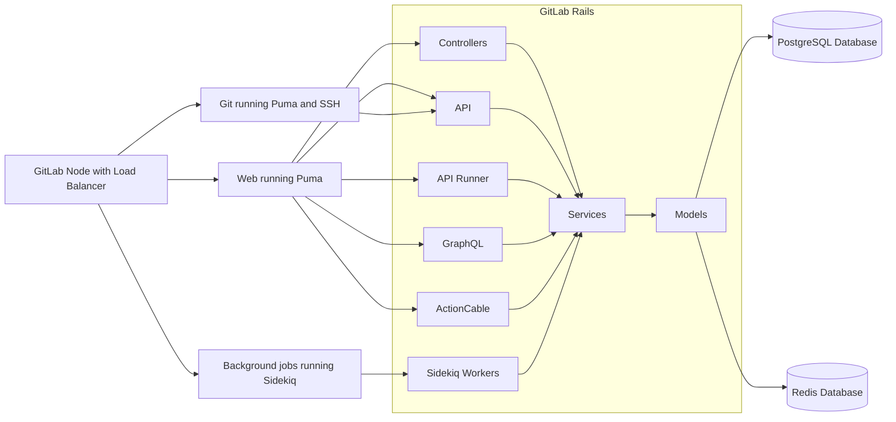
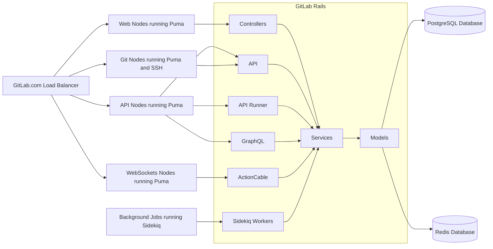




NOTE:
このアーキテクチャ設計ドキュメントは [GitLab Modular Monolith](https://docs.gitlab.com/ee/architecture/blueprints/modular_monolith/) に取って代わられました。
<!-- TODO: change to new design doc URL -->

単一コードベースの主要なリスクの一つはアプリケーション全体の無限の成長です。追加されるコードが増えるほど、アプリケーションの実行に必要なリソースが増加するだけでなく、アプリケーションの結合度が高まり複雑性が爆発的に増大します。

## エグゼクティブサマリー

このブループリントでは、アプリケーションのコードベースを削減・改善する手段として **アプリケーションレイヤー** を導入する影響について議論します。提案されたソリューションのポジティブおよびネガティブな結果を議論し、GitLab.com と小規模なインストールへの影響を見積もることを試みます。

**アプリケーションレイヤー** は、個々の機能を縦割りではなく、GitLab を実際にどのように実行するかというパターンに従って、GitLab Rails のコードベースを横方向に分割しようとするものです。これは、単一の機能が多くの異なる方法で実行される必要があるという考え（例えば CI は Web インターフェースを持ち、API を使用し、バックグラウンド処理を実行する）に基づいており、結合度のために特定の機能（CI など）をアプリケーションの残りから簡単に分離実行することができないという問題を解決しようとしています。

提案自体は機能のいくつかの側面を切り離すことができます。これらの側面は、大部分のコアを共有しながら、残りのスタックとは別に実行されるコンポーネントとして扱えます。このモデルは外部ツール（Runners API、Packages API、Feature Flags Unleash API）向けの API インターフェースを提供し、将来的にアプリケーションをより高いレジリエンスとより容易なスケールで提供できるようにすることができます。

実際の分割は [Rails Engines](https://guides.rubyonrails.org/engines.html) を使用して単一リポジトリ内に個別の gem を実装することでテストされました。[Rails Engines](https://guides.rubyonrails.org/engines.html) により、依存関係を持つ個々のコンポーネントを適切に記述し、多くの Rails Engines で構成されるアプリケーションを実行することができました。

このブループリントは GitLab の成功の重要な側面すべて、すなわち単一のモノリシックコードベース（[単一データストア](/handbook/product/categories/gitlab-the-product/single-application/#single-data-store)）を維持しつつ、アプリケーションのモデリングを改善してコードベースをよりコンポーザブルにすることを目指しています。

## モノリスの課題（現状）

今日、モノリスの使用は多くの場面で困難を証明しています。明確な境界を持たない単一の大きなモノリシックコードベースは、以下のような多くの問題と非効率を引き起こします：

- 深い結合はアプリケーションの長期的な開発を困難にし、インターフェースベースのアーキテクチャを構築する代わりにスパゲッティ実装につながります
- コードベースの部分間の深い結合はテストをより困難にします。アプリケーションの小さな部分だけをテストするために、通常はどの部分が影響を受けるかを確実に把握するためにテストスイート全体を実行する必要があります。これはある程度ヒューリスティックを構築することで改善できますが、エラーが発生しやすく常に正確に維持することが難しいです
- アプリケーションの一部のみを実行するためにすべてのコンポーネントを常にロードする必要があります
- 特定のコンテキストでほとんど使用されないアプリケーションの部分をロードするため、リソース使用量が増加します
- 高いメモリ使用量は GC サイクルの時間を増加させることでアプリケーション全体を遅くし、リクエスト処理の待ち時間が著しく長くなったり CPU のキャッシュ使用効率が悪化します
- 大幅に多くのファイルをロードして解析する必要があるため、アプリケーションの起動時間が増加します
- 起動時間が長くなるとアプリケーションやテストの実行に時間がかかり、開発が遅くなり、イテレーション数が減少します

## コンポーザブルなコードベースの次元

一般的に、コードベースのモデリングには二つの方法を考えることができます：

- **垂直方向** の境界コンテキスト（アプリケーションのドメインを表す各コンテキスト、例：CI に関連するすべての機能は特定のコンテキストに含まれる）
- **水平方向** のアプリケーションレイヤー: Sidekiq、GraphQL、REST API、Web コントローラー、DB と直接インターフェースするすべてのドメインモデルとサービス

このブループリントは明示的に**水平方向**の分割と**アプリケーションレイヤー**について説明します。

## 境界コンテキストの現状（**垂直方向**の分割）

境界コンテキストは数年にわたって何度も広く議論されてきたトピックです。多数の Issue に反映されています：

- [Create new models / classes in a module / namespace](https://gitlab.com/gitlab-org/gitlab/-/issues/212156)
- [Make teams to be maintainers of their code](https://gitlab.com/gitlab-org/gitlab/-/issues/25872)
- [Use nested structure to organize CI classes](https://gitlab.com/gitlab-org/gitlab/-/issues/209745)
- [WIP: Make it simple to build and use "Decoupled Services"](https://gitlab.com/gitlab-org/gitlab/-/issues/31121)

私たちは部分的に**境界コンテキスト**のアイデアを実行しています：

- 各チームが自分たちの名前空間を所有し、その名前空間をコードベース内の `module` として定義します
- 各チームが自分たちのテストを所有し、名前空間が明確な境界を定義します
- 名前空間を使用することで、個々のコントリビューターやレビュアーは特定のコンテキストについて助けを求めるドメインエキスパートを知ることができます

モジュール名前空間はチームの境界に沿ってコードベースをモデリングするために今日積極的に使用されています。現在最も多く使用されている名前空間は `Ci::` と `Packages::` です。これらはグループが所有するコードを明確に定義された構造に含めるための良い方法を提供します。

しかし、**境界コンテキスト**は開発に役立つ一方で、上述の目標には役立ちません。これは純粋にコードの論理的な分割です。深い結合を防ぐことはできません。CI パイプラインのバックグラウンド処理と Runner API インターフェース間の循環依存（そして実際によく起こります）を作成することは依然として可能です。API は Sidekiq ワーカーを呼び出し、Sidekiq はエンドポイントパスを作成するために API を使用することができます。

**境界コンテキスト** は、コードベース全体が単一のパッケージとしてロードされ実行されるため、何が何に依存しているかをコードベースがより賢く知ることを可能にしません。

境界コンテキストのデメリットに対する追加の考慮事項：

- 部族的知識と重複コードにつながる可能性があります
- 深い結合は反復して最小限の変更を行うことを困難にする可能性があります
- 変更は垂直分割のために隔離することが困難な連鎖効果を持つ可能性があります

## アプリケーションレイヤー（**水平方向**の分割）

開発とレビュープロセスを支援する名前空間分離の形での**境界コンテキスト**を引き続き活用しながら、**アプリケーションレイヤー**は異なる機能部分間に明確な分離を作成する手段を提供できます。

私たちの主要コードベース（Ruby on Rails で実行する GitLab である `GitLab Rails`）は多くの暗黙的な**アプリケーションレイヤー**で構成されています。各レイヤー間に明確な境界がないため、深い結合が生じています。

**アプリケーションレイヤー** のコンセプトは、個々の機能（CI や Packages など）の観点からではなく、アプリケーションをどのように実行するかという観点からアプリケーションを見ます。GitLab アプリケーションは今日、以下のアプリケーションレイヤーに分解できます。このリストは網羅的ではありませんが、単一のモノリシックコードベースの異なる部分の一般的なリストを示しています：

- Web コントローラー: Web インターフェースを訪れるユーザーからの Web リクエストを処理します
- Web API: 自動化されたツールからの API コール、場合によっては Web インターフェースを訪れるユーザーからも
- Web Runners API: Runner からの API コール、Runner が新しいジョブを取得したりトレースログを更新することを可能にします
- Web GraphQL: 柔軟な API インターフェースを提供し、Web フロントエンドが必要なデータのみを取得して計算とデータ転送量を削減できるようにします
- Web ActionCable: Web インターフェースを訪れるユーザーにリアルタイム機能を有効にするための双方向接続を提供します
- Web Feature Flags Unleash Backend: GitLab API を使用する Unleash 互換サーバーを提供します
- Web Packages API: パッケージツール（Debian、Maven、コンテナレジストリプロキシなど）と互換性のある REST API を提供します
- Git ノード: `SSH` または `HTTPS` 経由で `git pull/push` を認可するために必要なすべてのコード
- Sidekiq: バックグラウンドジョブを実行します
- サービス/モデル/DB: データベース構造、データ検証、ビジネスロジック、および他のコンポーネントと共有する必要があるポリシーモデルを維持するために必要なすべてのコード

実際の GitLab Rails の分割がどのように見えるかを説明するおそらく最良の方法は、衛星モデルです。すべての衛星コンポーネント間で共有される単一のコアがあります。その設計は、衛星コンポーネントが互いに通信する方法を制限することを意味します。単一のモノリシックアプリケーションでは、ほとんどの場合アプリケーションはコードで通信します。衛星モデルでは、通信はコンポーネントの外部で実行される必要があります。これはデータベース、Redis、または明確に定義された公開された API を介して行うことができます。



### オンプレミスインストールのアプリケーションレイヤー

オンプレミスインストールはかなり小規模で、通常は GitLab Rails を以下の二つの主な構成で実行します：



### GitLab.com のアプリケーションレイヤー

その規模のために、GitLab.com はより多くの注意が必要です。これは異なる機能部分のリソースを適切に管理し SLA を提供するために必要です。以下のチャートは GitLab.com アプリケーションレイヤーの簡略化されたビューを提供します。Object Storage や Gitaly ノードなどのすべてのコンポーネントを含んでいませんが、GitLab Rails の依存関係と今日の GitLab.com での設定を示しています：



### レイヤーの依存関係

オンプレミスと GitLab.com での GitLab の実行方法の違いは GitLab Rails の主な分割線を示しています：

- Web: すべての API、すべてのコントローラー、すべての GraphQL と ActionCable 機能を含む
- Sidekiq: すべてのバックグラウンド処理ジョブを含む
- Core: Web と Sidekiq の間で共有する必要があるすべてのデータベース、モデル、サービスを含む

これらの各トップレベルアプリケーションレイヤーは、すべての関連する依存関係を持つコードベースの一部にのみ依存します：

- すべての場合において、基盤となるデータベース構造とアプリケーションモデルが必要です
- 場合によっては、依存するサービスが必要です
- アプリケーションの共通ライブラリの一部のみが必要です
- 要求された機能をサポートする gem が必要です
- 個々のレイヤーは別のシブリングレイヤー（緊密な結合）を使用すべきではなく、データを共有するために API、Redis、または DB を介して接続すべきです（疎結合）

## 提案

メモリチームグループは、**アプリケーションレイヤー** の導入の影響を理解するための概念実証フェーズを実施しました。複雑さ、影響、およびこの提案を実行するために必要なイテレーションを理解するためにこれを行いました。

ここでの提案はこのブループリントの影響の評価として扱うべきであり、実装される最終的なソリューションではありません。定義された PoC はマージされるべきものではなく、将来の作業の基礎として機能します。

### Rails Engines を使用した PoC

私たちは Rails Engines を使用して Web アプリケーションレイヤーをモデリングすることを決定しました。Web Engine にはコントローラー、API、GraphQL が含まれています。これにより、すべての依存関係を持つ Web ノードを実行しながら、これらのコンポーネントがロードされない Sidekiq への影響を測定することができました。

すべての作業は以下のマージリクエストに記載されています：

- [Provide mechanism to load GraphQL with all dependencies only when needed](https://gitlab.com/gitlab-org/gitlab/-/issues/288044)
- [Draft: PoC - Move GraphQL to the WebEngine](https://gitlab.com/gitlab-org/gitlab/-/merge_requests/50180)
- [Draft: PoC - Move Controllers and Grape API:API to the WebEngine](https://gitlab.com/gitlab-org/gitlab/-/merge_requests/53720)
- [Draft: PoC - Move only Grape API:API to the WebEngine](https://gitlab.com/gitlab-org/gitlab/-/merge_requests/53982)
- [Measure performance impact for proposed `web_engine`](https://gitlab.com/gitlab-org/gitlab/-/issues/300548)

何を行ったか：

- [Rails Engines](https://guides.rubyonrails.org/engines.html) を使用しました
- 上記の MR に見られる変更の 99% はファイルをそのまま移動することでした
- すべての GraphQL コードとスペックを `engines/web_engine/` にそのまま移動しました
- すべての API とコントローラーのコードとスペックを `engines/web_engine` に移動しました
- CI を `engines/web_engine/` をスタックの自己完結型コンポーネントとしてテストするよう適応しました
- Web ノード（Puma Web サーバー）を実行する際に `gem web_engine` をロードするよう GitLab を設定しました
- バックグラウンド処理ノード（Sidekiq）を実行する際に `web_engine` のロードを無効にしました

#### 提案されたソリューションの実装詳細

1. 各アプリケーションレイヤー用の新しい Rails Engine を導入します。

    `engines` フォルダーを作成し、将来導入するさまざまなアプリケーションレイヤーのために異なる engines を含めることができます。

    上記の PoC では、`engines/web_engine` フォルダーにある新しい Web アプリケーションレイヤーを導入しました。

1. すべてのコードとスペックを `engines/web_engine/` に移動します

    - すべての GraphQL コードとスペックをファイル自体を変更せずに `engines/web_engine/` に移動しました
    - すべての Grape API とコントローラーのコードをファイル自体を変更せずに `engines/web_engine/` に移動しました

1. gems を `engines/web_engine/` に移動します

    - すべての GraphQL gems を実際の `web_engine` Gemfile に移動しました
    - Grape API gem を実際の `web_engine` Gemfile に移動しました

    ```ruby
    Gem::Specification.new do |spec|
      spec.add_dependency 'apollo_upload_server'
      spec.add_dependency 'graphql'
      spec.add_dependency 'graphiql-rails'

      spec.add_dependency 'graphql-docs'
      spec.add_dependency 'grape'
    end
    ```

1. ルートを `engines/web_engine/config/routes.rb` ファイルに移動します

    - GraphQL ルートを `web_engine` ルートに移動しました。
    - API ルートを `web_engine` ルートに移動しました。
    - コントローラーのルートのほとんどを `web_engine` ルートに移動しました。

    ```ruby
    Rails.application.routes.draw do
      post '/api/graphql', to: 'graphql#execute'
      mount GraphiQL::Rails::Engine, at: '/-/graphql-explorer', graphql_path:
      Gitlab::Utils.append_path(Gitlab.config.gitlab.relative_url_root, '/api/graphql')

      draw :api

      #...
    end
    ```

1. イニシャライザーを `engines/web_engine/config/initializers` フォルダーに移動します

    - `graphql.rb` イニシャライザーを `web_engine` イニシャライザーフォルダーに移動しました
    - `grape_patch.rb` と `graphe_validators` を `web_engine` イニシャライザーフォルダーに移動しました

1. GitLab アプリケーションを WebEngine と接続します

    GitLab Gemfile.rb で、`web_engine` を engines グループに追加します

    ```ruby
    # Gemfile
    group :engines, :test do
      gem 'web_engine', path: 'engines/web_engine'
    end
    ```

    gem が :engines グループ内にあるため、デフォルトでは自動的に require されません。

1. Engine をロードするタイミングを GitLab に設定します。

   GitLab `config/engines.rb` で、`Gitlab::Runtime` に依存して engines をロードしたい場合を設定できます

   ```ruby
   # config/engines.rb
   # Load only in case we are running web_server or rails console
   if Gitlab::Runtime.puma? || Gitlab::Runtime.console?
     require 'web_engine'
   end
   ```

1. Engine を設定します

   私たちの Engine は `Rails::Engine` クラスを継承します。これにより、この gem が Rails に指定されたパスに Engine があることを通知し、モデル、メーラー、コントローラー、ビューのロードパスに Engine の app ディレクトリを追加するなど、アプリケーション内で Engine を正しくマウントするタスクを実行します。
   `lib/web_engine/engine.rb` のファイルは、機能的には標準の Rails アプリケーションの `config/application.rb` ファイルと同じです。このように engines はすべての railties とアプリケーションで共有される設定を含む設定オブジェクトにアクセスできます。
   さらに、各 engine は `autoload_paths`、`eager_load_paths`、`autoload_once_paths` 設定にアクセスでき、それらは engine にスコープされています。

   ```ruby
   module WebEngine
     class Engine < ::Rails::Engine
       config.eager_load_paths.push(*%W[#{config.root}/lib
                                        #{config.root}/app/graphql/resolvers/concerns
                                        #{config.root}/app/graphql/mutations/concerns
                                        #{config.root}/app/graphql/types/concerns])

       if Gitlab.ee?
         ee_paths = config.eager_load_paths.each_with_object([]) do |path, memo|
           ee_path = config.root
                       .join('ee', Pathname.new(path).relative_path_from(config.root))
           memo << ee_path.to_s
         end
         # Eager load should load CE first
         config.eager_load_paths.push(*ee_paths)
       end
     end
   end
   ```

1. テスト

   CI を `engines/web_engine/` をスタックの自己完結型コンポーネントとしてテストするよう適応しました。

   - `spec` ファイルをそのまま `engines/web_engine/spec` フォルダーに移動しました
   - `ee/spec` ファイルをそのまま `engines/web_engine/ee/spec` フォルダーに移動しました
   - メインアプリケーションからのスペックを環境変数 `TEST_WEB_ENGINE` で制御します
   - `TEST_WEB_ENGINE` 環境変数を使用して `engines/web_engine/spec` テストを個別に実行する新しい CI ジョブを追加しました。
   - `TEST_WEB_ENGINE` 環境変数を使用して `engines/web_engine/ee/spec` テストを個別に実行する新しい CI ジョブを追加しました。
   - すべてのホワイトボックスフロントエンドテストを `TEST_WEB_ENGINE=true` で実行しています

#### 結果

これらの変更を導入した効果：

- RSS の節約
- 61.06 MB (7.76%) - GraphQL なしの Sidekiq
- 100.11 MB (12.73%) - GraphQL と API なしの Sidekiq
- 208.83 MB (26.56%) - GraphQL、API、コントローラーなしの Sidekiq
- Web ノード（Puma 実行）のサイズは変更前と同じでした

GraphQL、API、コントローラーなしの単一 Sidekiq クラスターの `start-up` イベントでの節約

- 264.13 MB RSS (28.69%) を節約しました
- 264.09 MB USS (29.36%) を節約しました
- 起動時間が 45.31 秒から 21.80 秒に短縮されました。23.51 秒速くなりました (51.89%)
- 805,772 個少ないライブオブジェクト、4,587,535 個少ないアロケートされたオブジェクト、2,866 個少ないアロケートされたページ、ヒープ外のオブジェクトのアロケートされたスペースが 3.65 MB 少なくなりました
- 2,326 個少ないコードファイルをロードしました (15.64%)
- 単一の完全な GC サイクルの時間が 0.80 秒から 0.70 秒に短縮されました (12.64%)

Puma single では予想通りほとんど差異が見られませんでした。

詳細は [Issue](https://gitlab.com/gitlab-org/gitlab/-/issues/300548#note_516323444) に記載されています。

#### GitLab.com への影響

GitLab.com 規模での実行結果を見積もると、現在：

- 個々の GC サイクルは [Web では約 130 ms](https://dashboards.gitlab.net/goto/oSdFY_-NR?orgId=1)、[Sidekiq では約 200 ms](https://dashboards.gitlab.net/goto/6a2dY_aHg?orgId=1) かかります
- 平均して [毎秒約 2 回の GC サイクル](https://dashboards.gitlab.net/goto/CRMcY_aNR?orgId=1)、または [Sidekiq では毎秒 0.12 サイクル](https://dashboards.gitlab.net/goto/nUe5L_aHR?orgId=1)
- これは [Web では毎秒約 9.5 vCPU](https://dashboards.gitlab.net/goto/ZXQpYlaHR?orgId=1)、[Sidekiq では毎秒約 8 vCPU](https://dashboards.gitlab.net/goto/neKhLlaHR?orgId=1) を GC だけに費やしていることになります
- Sidekiq は [平均 2.1 GB](https://dashboards.gitlab.net/goto/UFWTLlaHR?orgId=1)、または GitLab.com で [合計 550 GB](https://dashboards.gitlab.net/goto/l1b0Y_aNg?orgId=1) のメモリを使用しています

`web_engine` の導入で考えられる最大節約量を見積もります：

- GC サイクル時間を 20% 削減、200 ms から 160 ms へ
- 毎秒の GC サイクル数は同じになりますが、GC サイクル時間の削減により 8 vCPU の代わりに約 6 vCPU を使用するようになります
- 最良のケースでは Sidekiq だけで GitLab.com のメモリを最大 137 GB 節約することが見込まれます

このモデルは `sidekiq_engine` を導入するために拡張でき、Web ノードに同様のメリット（ユーザーへの目に見える影響のためより重要）を提供します。

#### 成果

これらの変更を導入することでいくつかのメリットを達成しました。

メリット：

- 大幅に低いメモリ使用量
- Sidekiq のアプリケーションロード時間が大幅に短縮
- GC サイクルが大幅に短縮されることによる Sidekiq サービスの応答性の大幅な改善
- アプリケーションの一部のテストが大幅に容易になり、例えば `web_engines/` の変更はこのアプリケーションレイヤーのテストのみを再実行する必要があります
- コードベースのモノリシックアーキテクチャを維持しつつ、データベースとアプリケーションモデルを共有します
- インフラ側からの大幅な節約
- アプリケーションのフットプリントを削減することで制限された環境でも快適に実行できます

デメリット：

- Sidekiq の場合と同様に、GraphQL サブスクリプションの実装がより困難になります。サブスクリプションを渡す別の方法が必要です
- `api_v4` パスは Sidekiq で使用されるサービスで使用される場合があります（例：`api_v4_projects_path`）
- `url_helpers` パスは Sidekiq で使用される可能性があるモデルとサービスで使用されています（例：`Gitlab::Routing.url_helpers.project_pipelines_path` は [ExpirePipelineCacheService](https://gitlab.com/gitlab-org/gitlab/-/blob/master/app/services/ci/expire_pipeline_cache_service.rb#L20) で [ExpirePipelineCacheWorker](https://gitlab.com/gitlab-org/gitlab/-/blob/master/app/workers/expire_pipeline_cache_worker.rb#L18) によって使用されています）

#### 例：GraphQL

[Draft: PoC - Move GraphQL to the WebEngine](https://gitlab.com/gitlab-org/gitlab/-/merge_requests/50180)

- 上記の MR で見られる [99% の変更](https://gitlab.com/gitlab-org/gitlab/-/merge_requests/50180/diffs?commit_id=49c9881c6696eb620dccac71532a3173f5702ea8) はファイルをそのまま移動することです。
- クロスな依存関係の修正、スペック、`web_engine` の設定に関する[実際の作業](https://gitlab.com/gitlab-org/gitlab/-/merge_requests/50180/diffs?commit_id=1d9a9edfa29ea6638e7d8a6712ddf09f5be77a44)
- `engines/web_engine/` をスタックの自己完結型コンポーネントとしてテストするように CI を[適応しました](https://gitlab.com/gitlab-org/gitlab/-/merge_requests/50180/diffs?commit_id=d7f862cc209ce242000b2aec88ff7f4485acdd92)

今日、GraphQL のロードには多くの[依存関係](https://gitlab.com/gitlab-org/gitlab/-/issues/288044)が必要です：

> 14480 ファイルをロード/require していることも発見しました。[memory-team-2gb-week#9](https://gitlab.com/gitlab-org/memory-team/memory-team-2gb-week/-/issues/9#note_452530513)
> GitLab を起動すると、1274 ファイルが GraphQL に属します。Sidekiq が不要な場合に 1274 個のアプリケーションファイルと関連する GraphQL gems をロードしなければ、大量のメモリを節約できます。

GraphQL は特定のコンテキストでのみ実行する必要があります。ロードされるタイミングを制限できれば、アプリケーションのロード時間と必要なメモリを削減することで、アプリケーションの効率を効果的に改善できます。例えば、これはあらゆる規模のインストールに適用されます。

GraphQL と WebSockets の潜在的な課題は、ある時点で ActionCable サブスクリプションを使用して Sidekiq から GraphQL/API ペイロードをクライアントにプッシュしたい場合があることです。これはおそらく Redis を使用してデータを渡します。Sidekiq は Redis に情報を公開し、ActionCable ノードはその情報を接続されたクライアントに渡します。この作業方法は上記のモデルで可能ですが、GraphQL または API（HTTP エンドポイント経由）を使用して何を送信すべきかを計算する必要があります。

別の方法として、通知システムを使用し、`ActionCable` ノード（WebSocket を処理するもの）が常にパッスルーを実行する代わりに送信クエリに基づいてペイロードを生成する方法があります。`ActionCable` が特定のクライアントの接続を処理しているため、これは適用可能です。多くのクライアントが同じリソースを監視している場合に同じペイロードを再計算する必要があるというデメリットがある可能性があります。しかし、生成されたペイロードが監視クライアントの権限に依存する場合があるため（匿名のユーザーとプロジェクトのメンバーに対して異なるものを表示します）、このシステムの動作はセキュリティ目的のために依然として望まれる場合があります。

#### 例：API

[Draft: PoC - Move only Grape API:API to the WebEngine](https://gitlab.com/gitlab-org/gitlab/-/merge_requests/53982)

- [99% の変更](https://gitlab.com/gitlab-org/gitlab/-/merge_requests/53982/diffs?commit_id=c8b72249b6e8f875ed4c713f0668207377604043) は上記の MR で見られるように、ファイルをそのまま移動することです。
- クロスな依存関係の修正、スペック、イニシャライザー、gems、ルートの設定に関する[実際の作業](https://gitlab.com/gitlab-org/gitlab/-/merge_requests/53982/diffs?commit_id=00d9b54ba952c85ff4d158a18205c2fac13eaf8d)。

Grape::API は Web サーバーコンテキストでのみ実行する必要があるもう一つの例です。

Grape API の潜在的な課題：

- 現在、モデルには API::API の依存関係があります（例：[プロジェクトモデル](https://gitlab.com/gitlab-org/gitlab/-/blob/master/app/models/project.rb#L2019) の `API::Helpers::Version` 依存、または GeoNode モデルの [`geo_retrieve_url`](https://gitlab.com/gitlab-org/gitlab/-/blob/master/ee/app/models/geo_node.rb#L183) の API::API 依存）
- `api_v4` パスはヘルパー、プレゼンター、ビューで使用されています（例：[PackagesHelper](https://gitlab.com/gitlab-org/gitlab/-/blob/master/app/helpers/packages_helper.rb#L17) の `api_v4_projects_path`）

#### 例：コントローラー

[Draft: PoC - Move Controllers and Grape API:API to the WebEngine](https://gitlab.com/gitlab-org/gitlab/-/merge_requests/53720)

- [99% の変更](https://gitlab.com/gitlab-org/gitlab/-/merge_requests/53720/diffs?commit_id=17174495cf3263c8e69a0420092d9fa759170aa6) は上記の MR で見られるように、ファイルをそのまま移動することです。
- クロスな依存関係の修正、スペック、イニシャライザー、gems、ルートの設定に関する[実際の作業](https://gitlab.com/gitlab-org/gitlab/-/merge_requests/53720/diffs?commit_id=39cc4bb1e0ce47f66605d06eb1b0d6b89ba174e6)。

コントローラー、シリアライザー、一部のプレゼンター、一部の Grape:Entities も Web サーバーコンテキストでのみ実行する必要があるもの良い例です。

コントローラーの移動の潜在的な課題：

- `web_engine` がロードされている場合に `engines/web_engine/config/routes` と `engines/web_engine/ee/config/routes` をサポートするために `Gitlab::Patch::DrawRoute` を拡張する必要がありました。ここに潜在的な[解決策](https://gitlab.com/gitlab-org/gitlab/-/merge_requests/53720#note_506957398)があります。
- `Gitlab::Routing.url_helpers` パスは Sidekiq で使用される可能性があるモデルとサービスで使用されています（例：`Gitlab::Routing.url_helpers.project_pipelines_path` は [ExpirePipelineCacheService](https://gitlab.com/gitlab-org/gitlab/-/blob/master/app/services/ci/expire_pipeline_cache_service.rb#L20) で [ExpirePipelineCacheWorker](https://gitlab.com/gitlab-org/gitlab/-/blob/master/app/workers/expire_pipeline_cache_worker.rb#L18) によって使用されています）

### Packwerk

NOTE:
Packwerk は現在バグ修正のみを受け付けており、積極的に開発されていません。[詳細](https://github.com/Shopify/packwerk#note-packwerk-is-considered-to-be-feature-complete-for-shopifys-uses-we-are-currently-accepting-bug-fixes-only-and-it-is-not-being-actively-developed-please-fork-this-project-if-you-are-interested-in-adding-new-features)をご確認ください。

## 将来への影響

**アプリケーションレイヤー** とこの提案は現在 `web_engine` のみを定義しています。同じパターンに従って、将来的に GitLab Rails のメモリ使用量を大幅に削減し、保守性を大幅に改善するための追加エンジンを容易に導入できます。

これは、コアコードベースの一部である必要のない新しいインターフェース（追加のパッケージサービスのサポートなど）を導入するためのフレームワークになります。将来のアプリケーションのスケーリングを改善しながら、GitLab の単一コードベースとモノリシックアーキテクチャを維持できます。

今日の時点で、三つの**アプリケーションレイヤー**を定義することが合理的と思われます：

- `gitlab-core`: コア機能: DB 構造、モデル、サービス、共通ライブラリ。データアクセスレイヤーをモデリングし、初期は GitLab を実行するために必要なすべてのサービスをモデリングします。将来的により小さな側面に分割される可能性があります
- `gitlab-web`: Web サーバーコンテキストで実行するために必要なコントローラー/API/GraphQL/ActionCable 機能（`gitlab-core` に依存）
- `gitlab-sidekiq`: Sidekiq ワーカーを実行するために必要なバックグラウンドジョブ機能（`gitlab-core` に依存）

このモデルは今日、共有コアを持つサテライトとして最もよく説明されています。共有コアはデータアクセスレイヤーを定義し、サテライトはこのデータを提示および処理する方法を定義します。サテライトはコアとのみ通信できます。明確に定義されたインターフェース（API、GraphQL、または Sidekiq ジョブのスケジューリングのための Redis の形式）を使用しない限り、別のサテライトを直接ロードまたは通信することはできません。

エンジンの爆発的な増加を確保しないために、許可する `engines` の数を制限することが合理的です。初期提案は、最大 5 つのエンジンを作成することを許可します。

## Issue とマージリクエスト

- [Split application into functional parts to ensure that only needed code is loaded with all dependencies](https://gitlab.com/gitlab-org/gitlab/-/issues/290935)
- [Provide mechanism to load GraphQL with all dependencies only when needed](https://gitlab.com/gitlab-org/gitlab/-/issues/288044)
- [Draft: PoC - Move GraphQL to the WebEngine](https://gitlab.com/gitlab-org/gitlab/-/merge_requests/50180)
- [Draft: PoC - Move Controllers and Grape API:API to the WebEngine](https://gitlab.com/gitlab-org/gitlab/-/merge_requests/53720)
- [Draft: PoC - Move only Grape API:API to the WebEngine](https://gitlab.com/gitlab-org/gitlab/-/merge_requests/53982)
- [Measure performance impact for proposed `web_engine`](https://gitlab.com/gitlab-org/gitlab/-/issues/300548)
- [Create new models / classes within a module / namespace](https://gitlab.com/gitlab-org/gitlab/-/issues/212156)
- [Make teams to be maintainers of their code](https://gitlab.com/gitlab-org/gitlab/-/issues/25872)
- [Use nested structure to organize CI classes](https://gitlab.com/gitlab-org/gitlab/-/issues/209745)
- [WIP: Make it simple to build and use "Decoupled Services"](https://gitlab.com/gitlab-org/gitlab/-/issues/31121)
- [Rails takes awhile to boot, let's see if we can improve this](https://gitlab.com/gitlab-org/gitlab/-/issues/213992)
