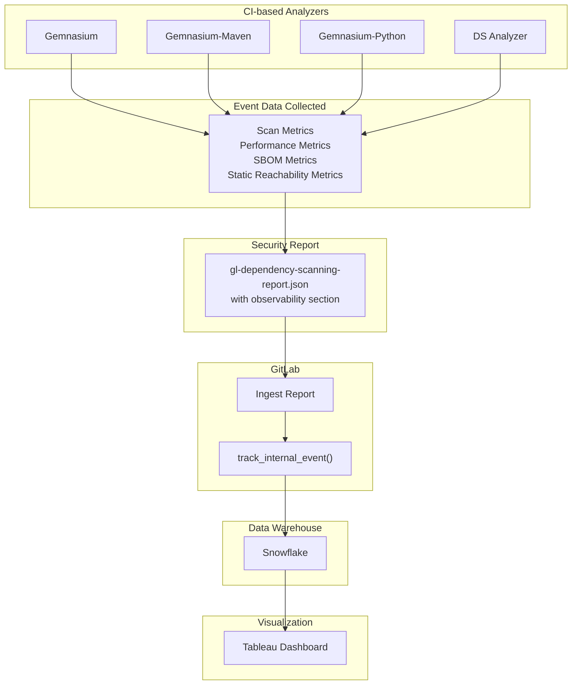




## サマリー

このドキュメントでは、GitLab のコンポジション分析 (CA) 機能エリアの包括的なエンドツーエンドのメトリクス収集を実装するためのアーキテクチャ設計を説明します。
目標は、顧客が CA ツールをどのように使用しているかについてより良いデータを収集し、異なるデプロイタイプ（GitLab.com、セルフマネージド、専用インスタンス）にわたって機能の採用を測定するための製品意思決定に役立てることです。

**エピック**: [Create end-to-end metrics for CA (#18116)](https://gitlab.com/groups/gitlab-org/-/work_items/18116)

## 動機

現在、GitLab にはコンポジション分析の使用に関する包括的なメトリクスがありません。
[レガシーメトリクス](https://10az.online.tableau.com/#/site/gitlab/views/PDSecureScanMetrics_17090087673440/SecureScanMetrics) は不完全または不正確な場合があります。
チームは以下についてより良い可視性が必要です：

- **採用の幅**: CA ツールを使用している人、組織、プロジェクトの数
- **機能の使用**: 使用されている具体的な機能（依存関係スキャン、コンテナスキャン、静的到達性分析など）
- **使用の強度**: スキャンはどのくらいの頻度で実行され、どれほどの脆弱性が発見され、どのようなアクションが取られるか
- **品質メトリクス**: スキャン成功率、エラーパターン、パフォーマンス特性
- **設定パターン**: ユーザーが CA アナライザーをどのように設定・カスタマイズしているか

このデータは以下のために不可欠です：

- 移行の進捗を測定する（例：Gemnasium から新しい DS アナライザーへ）
- 実際の使用パターンに基づいて機能開発を優先する
- さまざまなプロジェクトタイプにわたるパフォーマンス特性を理解する
- 機能の採用を追跡する（例：静的到達性分析の有効化）

## 目標

1. **包括的なデータ収集**: すべての CA アナライザー（依存関係スキャン、コンテナスキャン、OCS、CVS）にわたってメトリクスを収集する
2. **マルチデプロイのサポート**: GitLab.com、セルフマネージド、専用インスタンスからメトリクスを収集する
3. **詳細な洞察**: プロジェクト、名前空間、インスタンスレベルでデータを提供する
4. **パフォーマンストラッキング**: スキャン時間、リソース使用量、成功率を監視する
5. **機能採用**: どの機能と設定が使用されているかを追跡する
6. **段階的なアプローチ**: 依存関係スキャンから始めて段階的に構築する

## 提案

私たちはすべてのアナライザーイベントを定義するイベントレジストリプロジェクトを管理しています。
各アナライザーはイベントを収集し、それらを脆弱性レポートの observability セクションに含めます。
依存関係スキャンジョブが完了すると、GitLab は生成されたレポートを取り込み、イベントを Snowflake に格納します。
Tableau ダッシュボードは Snowflake データを照会して可視化を提供します。

ほとんどのデータは gitlab.com から来ることに注意してください。
セルフマネージドインスタンスは、ユーザーが GitLab へのテレメトリ送信を選択した場合にのみデータを提供します。



### 主要コンポーネント

#### 1. セキュリティレポート内の Observability データ

アナライザーは `observability` セクションのセキュリティレポート JSON に observability データを直接埋め込みます。これには以下が含まれます：

- **スキャンメタデータ**: 時間、アナライザーバージョン、発見された脆弱性の数
- **SBOM データ**: コンポーネント数、PURL タイプ、入力ファイルパス
- **静的到達性分析メトリクス**: カバレッジ、実行時間、in_use コンポーネント
- **パフォーマンスメトリクス**: 異なるフェーズの実行時間

以下は SBOM イベントの例です：

```json
{
  "event": "collect_ds_analyzer_scan_sbom_metrics_from_pipeline",
  "property": "scan_uuid",
  "label": "npm",
  "value": 150,
  "input_file_path": "yarn.lock"
}
```

#### 2. イベント取り込みパイプライン

パイプラインが完了すると、GitLab はスキャンイベントを以下を通じて処理します：

1. **ProcessScanEventsService** (`ee/app/services/security/process_scan_events_service.rb`)
   - セキュリティレポートから observability データを抽出します
   - `EVENT_NAME_ALLOW_LIST` に対してイベントを検証します
   - `track_internal_event()` を使用して内部イベントを追跡します

2. **イベントトラッキング**
   - イベントは Snowplow に送信されます（GitLab.com）
   - 各イベントには以下が含まれます：イベント名、プロパティ、ラベル、値、extra（JSON）フィールド
   - 重要なフィルタリング/結合データは property/label/value 列に格納されます
   - 追加データは extra フィールドに格納されます（クエリのパフォーマンスが低い）

#### 3. イベントレジストリ

集中化された Go パッケージがすべての CA アナライザーイベントを管理します：

- **プロジェクト**: [gitlab-org/security-products/analyzers/events](https://gitlab.com/gitlab-org/security-products/analyzers/events)
- **目的**: イベント定義の単一情報源
- **再利用性**: Gemnasium と DS アナライザー間で共有
- **保守性**: 集中化されたイベント定義は重複を削減します

## 設計上の決定

### 1. セキュリティレポート内の Observability データ vs 別アーティファクト

**決定**: 別のアーティファクトを作成する代わりにセキュリティレポートに observability データを直接埋め込む

**メリット**:

- 関連するデータを一か所にまとめて保持する
- 既存のセキュリティレポートインフラとイベントの定義、処理、Snowflake への格納方法を定義する取り込みロジックを活用する
- 管理・保存するアーティファクトが一つになる

**デメリット**:

- セキュリティレポートのサイズが若干増加する
- メトリクスをレポートに結合する
- アナライザーが失敗した際にデータを収集するために追加作業が必要

### 2. 複数イベント vs 単一モノリシックイベント

**決定**: すべてのデータを含む単一イベントではなく、異なるデータタイプ（スキャン、SBOM、SR、機能）に対して個別のイベントを作成する

**メリット**:

- イベントあたりのフィールドを削減し、Snowflake でのクエリ効率を向上させる。カスタムイベントフィールドの使用を避けるよう努めています
- 異なるイベントタイプの独立したスケーリングが可能
- 既存のイベントを変更せずに新しいイベントタイプを追加しやすい
- 関心の分離が改善される

**デメリット**:

- scan_uuid を使用してイベントを結合する必要がある
- スキャンごとに生成されるイベントが増える

### 3. イベントデータストレージ：高速列 vs JSON Extra フィールド

**決定**: 重要なフィルタリング/結合データを property/label/value 列に格納し、追加データを extra JSON フィールドに格納することをできる限り避ける

**高速列** すべてのイベントは三つのフィールドを含む基底イベントクラスに基づいています：

- `property`: CA は常にこのフィールドを scan_uuid に使用します（関連イベントの結合用）
- `label`: CA はアナライザーバージョン、PURL タイプなどのデータに使用します
- `value`: コンポーネント数、実行時間、脆弱性数

**Extra フィールド**: イベントには追加フィールドを含めることができ、jsonb 列に格納されます。これらの extra フィールドへのクエリは標準列へのクエリよりもリソース集約的です。

**メリット**:

- 重要なディメンションで高速フィルタリングと結合が可能
- スキーマ変更なしで追加のメトリクスに柔軟に対応

**デメリット**:

- 何をどこに格納するかの慎重な計画が必要

### 4. 集中化されたイベントレジストリ vs 分散イベント定義

**決定**: すべての CA アナライザーイベントに対して集中化された Go パッケージを作成する

**パッケージ**: [gitlab-org/security-products/analyzers/events](https://gitlab.com/gitlab-org/security-products/analyzers/events)

**メリット**:

- イベント定義の単一情報源
- 利用可能なイベントの発見が容易
- アナライザー間の重複を削減
- AST グループ間での再利用を促進する可能性がある
- イベントのバージョン管理と変更を簡素化する

**デメリット**:

- 複雑さが増す：変更には 2 つのプロジェクト（イベントレジストリ + アナライザー）の更新が必要
- プロジェクト間に依存関係が追加される

### 5. Gemnasium フレーバーの区別

**決定**: イベント名に 3 つの Gemnasium フレーバーを直接区別する。これにより、データがどの Gemnasium フレーバーに関するものかを示すための別のフィールドが不要になります—情報はイベント名自体にエンコードされています。

**フレーバー**:

- `gemnasium`
- `gemnasium-maven`
- `gemnasium-python`

**実装**: フレーバー情報をイベント名に格納する

**メリット**:

- イベントストレージを最適化する

**デメリット**:

- 複数のアナライザーバリアントの追跡が必要

## 将来の作業

将来の作業には以下が含まれます：

- **失敗イベントのトラッキング**: スキャンが失敗した場合でも脆弱性レポートを生成するようにアナライザーを修正する必要があります。これにより失敗メトリクスを収集でき、さらに重要なことに、ユーザーに表示できる警告とエラーをキャプチャするシステムを構築できます。この機能はプロジェクト全体でスキャンの健全性を監視する組織管理者にとって特に価値があります。

- **イベントカバレッジの拡大**: コンテナスキャンと Operational Container Scanning に同様のイベントトラッキングを実装する。
