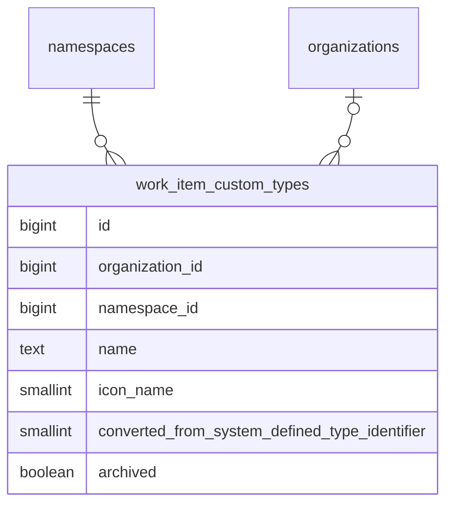

<!-- Design Documents often contain forward-looking statements -->
<!-- vale gitlab.FutureTense = NO -->

<!-- This renders the design document header on the detail page, so don't remove it-->



## 概要 {#summary}

このドキュメントは、GitLab のワークアイテムに対して[設定可能なワークアイテムタイプ](https://gitlab.com/groups/gitlab-org/-/epics/9365)を実装するための私たちのアプローチを概説します。

これにより、Premium および Ultimate の顧客は、システム定義のワークアイテムタイプをカスタマイズしたり、自分たちのプランニングワークフローに合わせて新しいワークアイテムタイプを作成したりできるようになります。

トップダウンの制御と自律的なチームという顧客の要件のバランスを取るため、ユーザーがワークアイテムタイプとその階層制限をカスタマイズできるのは、可能な限り最上位のレベルのみとしています。そして組織が許可すれば、子孫の名前空間やプロジェクトが、使いたくないタイプを無効にすることで、タイプをさらにカスタマイズできます。

タイプごとのウィジェットカスタマイズは、後続のイテレーションで予定されています。初回リリースでは、カスタムタイプはシステム定義の `issue` タイプと同じウィジェットセットを使用します。

## 用語集 {#glossary}

このドキュメント全体で使用される語彙のリファレンスです。最初に読むときは、[Customizing work item types](#customizing-work-item-types) まで読み飛ばしてください。用語は各セクションでの初出時にここへリンクされています。

### System-defined type

GitLab に同梱される組み込みのワークアイテムタイプ（`issue`、`incident`、`task`、`epic`、`ticket` など）。1 〜 9 の範囲の ID を持つ [`ActiveRecord::FixedItemsModel`](https://docs.gitlab.com/development/fixed_items_model/) オブジェクトとしてインメモリに保存され、すべての名前空間で共有されます。システム定義タイプは削除できませんが、カスタマイズはできます。converted type を参照してください。

### Custom type

`work_item_custom_types` に保存される、ユーザーが作成したワークアイテムタイプです。カスタムタイプは、まったく新しいもの（例: "Bug Report"、"Feature Request"）にすることも、システム定義タイプをカスタマイズして作成することもできます。カスタムタイプの ID は、システム定義の ID と重ならないように 1001 から始まります。

### Converted type

システム定義タイプをカスタマイズして作成されたカスタムタイプです。例えば "Issue" を "Feature" にリネームすると、converted type が作成されます。`converted_from_system_defined_type_identifier` カラムには、元のシステム定義タイプの識別子が保存されます。converted type は、ソースタイプの特別な機能マッピング（Service Desk、incident management）を継承し、元のタイプの Global ID フォーマットを保持します。これらは、カスタマイズと下位互換性の間を橋渡しするアーキテクチャ上の存在です。

### Delegation source

カスタムタイプが振る舞いを継承するシステム定義タイプ（ウィジェット、階層制限、ベースタイプの述語、設定フラグ）です。converted type の場合、これは `converted_from_system_defined_type_identifier` で識別されるシステム定義タイプです。新しいカスタムタイプの場合、デフォルトで `issue` になります。カスタムタイプごとのウィジェットおよび階層のカスタマイズは、後続のイテレーションで予定されています。それまでは、delegation がデフォルトを提供します。

### Provider

`WorkItems::TypesFramework::Provider` クラスです。特定の名前空間におけるタイプの存在と利用可能性に関する唯一の権威です。ワークアイテムタイプを解決する必要があるコードはすべて Provider を経由し、Provider はシステム定義タイプとカスタムタイプを、リクエストごとのインデックス付きキャッシュにマージします。

### NamespacedType

Provider のキャッシュ内でタイプをラップして名前空間を認識できるようにする、軽量な `SimpleDelegator` のサブクラスです。共有された `FixedItemsModel` のシングルトンを変更することなく、名前空間ごとの状態（`enabled`、`is_a_group`、`tasks_on_boards`）を保持します。アイデンティティメソッドは保持されるため、このラッパーは等価性チェックに対して透過的なままです。

### SIWAR

Sparse Inheritance with Ancestor Resolution。名前空間階層に沿って名前空間ごとの設定（特に可視性）を「最も近い祖先が勝つ」セマンティクスで解決するために用いられるパターンです。継承されたデフォルトから逸脱する名前空間だけが行を必要とするため、スパース（疎）です。

## Customizing work item types

私たちは、可能な限り最上位のレベルでワークアイテムタイプの設定を許可します。これにより、顧客は自分が所有するすべてのグループとプロジェクトに対してタイプを設定できます。
これは、SaaS インスタンスではルート名前空間レベル、self-managed インスタンスでは[組織レベル](https://docs.gitlab.com/user/organization/)になります。

[System-defined types](#system-defined-type) は、`ActiveRecord::FixedItemsModel` オブジェクトとしてインメモリに保存され、すべてのグループとプロジェクトで共有されます。カスタマイズは PostgreSQL データベースに保存され、`organization_id` または `namespace_id` でシャーディングされます。



`work_item_custom_types` テーブルは、システム定義タイプの ID（1 〜 9）との衝突を避けるために、1001 から始まる ID シーケンスを使用します。チェック制約が `id >= 1001` を強制します。`organization_id` と `namespace_id` のカラムは相互排他的です（ちょうど一方が非 null でなければなりません）。親の名前空間または組織ごとに、カスタムタイプは 40 個までという上限があります。

### Scope of MVC1 customization

このフレームワークは、任意の[システム定義タイプ](#system-defined-type)をリネームしたりアイコンを変更したりできるように設計されていますが、MVC1 では UI が公開するものを意図的に絞り込んでいます。

- **Issue** はリネームでき、アイコンを変更できます。
- **新しい[カスタムタイプ](#custom-type)** を作成できます。それらは常に Issue を[delegation source](#delegation-source)として使用し、そのウィジェットセットと階層制限を継承します。
- **その他のすべてのシステム定義タイプ**（`epic`、`incident`、`task`、`ticket`、`test_case`、`requirement`、`objective`、`key_result`）はロックされています。それらはリネーム、アーカイブ、その他のカスタマイズができません。
- **ウィジェットのカスタマイズ、階層のカスタマイズ、設定フラグのオーバーライド** は MVC1 のスコープ外であり、[イテレーションの epic](https://gitlab.com/groups/gitlab-org/-/epics/9365) で追跡されています。

その他のシステム定義タイプに対する制限は、フレームワークの制約ではなく、フロントエンドの制約です。UI のいくつかの箇所では、リストビュー、詳細ビュー、作成フローにおいて、これらのタイプを依然としてシステム定義の名前で参照しています。それらの画面がタイプ名に依存せずデータ駆動になるよう刷新されるまでは、リネームすると UI に不整合が生じます。これらの画面が移行されるにつれて、追加のタイプに対してカスタマイズを解放していくことを意図しています。

### Customizing a system-defined type

ユーザーが[システム定義タイプ](#system-defined-type)をカスタマイズすると（現在は Issue のリネームまたはアイコンの変更。[Scope of MVC1 customization](#scope-of-mvc1-customization) を参照）、新しい `work_item_custom_types` レコードを作成し、元のシステム定義 ID を `converted_from_system_defined_type_identifier` カラムに保存します。ワークアイテム自体は変更されません。それらの `work_item_type_id` は引き続きシステム定義 ID を指します。例えば、既存のすべての Issue は `work_item_type_id = 1` を保持し、新しく作成されるすべての Issue も `work_item_type_id = 1` で書き込まれます。カスタマイズは、データマイグレーションではなくルックアップによって反映されます。[Provider](#provider) は、システム定義 ID が出現するあらゆる場所で、それを[converted type](#converted-type)に解決します。[カスタムステータスと同様に](../work_items_custom_status/#converting-system-defined-lifecycles-and-statuses-to-custom-ones)、これは変更が即時かつ低コストであることを意味します。

カスタムレコードの PK ではなくシステム定義 ID を保存することは、アーキテクチャ上の要石です。カスタマイズのたびにすべての既存ワークアイテムの `work_item_type_id` を書き換えることは、`issues` テーブルの規模では実現不可能であり、またクエリを高速に保つ単一カラムストレージモデルも壊してしまいます。完全な根拠については [Storing a work item's type](#storing-a-work-items-type) を参照してください。

この変換は、API の利用者に対して透過的です。Global ID は引き続き `gid://gitlab/WorkItems::Type/<system-defined identifier>` のフォーマットを使用し、GraphQL タイプは変わらず、私たちの API はカスタマイズされたシステム定義タイプを渡す際にこのフォーマットの Global ID を受け付けます。外部から見える唯一の変化は、タイプの名前とアイコンです。システム定義タイプがいったんカスタマイズされると、たとえ元の名前にリネームし直しても、それは[converted type](#converted-type)のままです。「変換を取り消す」操作は存在しません。

converted type は、元のシステム定義タイプを覆うデコレーターとして機能します。これは、[delegation source](#delegation-source) パターンを通じて、ウィジェット、階層制限、設定フラグ、ベースタイプの述語を元のタイプに委譲します。特別な機能の振る舞い（`ticket` の Service Desk、`incident` の incident management）は、この委譲チェーンを通じて保持されます。アプリケーションが「これは Service Desk を処理するタイプか?」と尋ねると、そのタイプの `base_type` を要求し、それが delegation source を通じてシステム定義タイプに委譲し、`:ticket` を返します。次に、システム定義タイプの設定フラグ（`service_desk: true`、`incident_management: true`）が、そのタイプをその機能に指定されたものとして識別します。`converted_from_system_defined_type_identifier` カラムは、この委譲チェーンを正しく解決させる連結点であり、機能コードが直接読み取るものではありません。

ワークアイテムのタイプを取得するとき、[Provider](#provider) は変換を適用します。名前空間やプロジェクトの利用可能なタイプを一覧表示するとき、Provider はすべてのシステム定義タイプとカスタムタイプを取得し、マッピングされたカスタムタイプのレコードを持つシステム定義タイプを除外します。

### Creating a new work item type

新しい[カスタムタイプ](#custom-type)は、`converted_from_system_defined_type_identifier` の値が null である `work_item_custom_types` レコードで表現されます。

すべてのタイプ — [システム定義](#system-defined-type)、[converted](#converted-type)、新しいカスタム — は、同じ Global ID フォーマット `gid://gitlab/WorkItems::Type/<id>` を使用します。`SystemDefined::Type#to_global_id` と `Custom::Type#to_global_id` はどちらも、`model_name: 'WorkItems::Type'` で明示的に GID を構築します。互いに素な ID 空間（システム定義は 1 〜 9、カスタムは 1001 以上）が衝突を防ぎます。

初回のイテレーションでは、新しいタイプはシステム定義の `issue` タイプのように振る舞います。それらはプロジェクトレベルでのみ許可され、そのウィジェットと階層制限は `issue` のものと一致します。新しいカスタムタイプのグループレベルでの利用可能化は、後続のイテレーションで予定されています。タイプごとのウィジェットカスタマイズも、後続のイテレーションで予定されています。

### Archiving a work item type

[カスタムタイプ](#custom-type)は、履歴データを保持するために、削除ではなくアーカイブできます。タイプがアーカイブされると:

- `work_item_custom_types` の `archived` ブールカラムでマークされます
- タイプ作成フローに表示されなくなります
- そのタイプの既存のワークアイテムは保持され、引き続きアクセス可能です
- タイプはアーカイブ解除して、再び利用可能にできます

これは[カスタムフィールドのアーカイブ](../work_items_custom_fields/#archiving-custom-fields)と同じパターンに従います。

#### Type name uniqueness

混乱を防ぎ、明確なユーザー体験を確保するために、タイプ名は、名前空間または組織内で[カスタム](#custom-type)タイプと未変換の[システム定義タイプ](#system-defined-type)の両方にわたって一意でなければなりません。これは以下を意味します。

- カスタムタイプは、カスタマイズされていないシステム定義タイプと同じ名前を持つことはできません
- カスタムタイプは、別のカスタムタイプと同じ名前を持つことはできません
- システム定義タイプがカスタマイズされた場合（例: "Task" から "Pizza" にリネーム）、元のシステム定義タイプはその名前では利用できなくなるため、"Task" という名前で新しいカスタムタイプを作成できます
- ユーザーが[converted type](#converted-type)を元の名前にリネームし直し、その元の名前がその間に使われていなかった場合、そのカスタムタイプ名は再び使用可能になります。例: "Pizza" を "Task" にリネームし直すと、"Pizza" がタイプ名として使用可能になります

### Storing a work item's type

私たちは、ワークアイテム上にタイプを保存するために[単一カラムのアプローチ](https://gitlab.com/gitlab-org/gitlab/-/issues/580065)を使用します。既存の `issues.work_item_type_id` カラムが、すべてのタイプのタイプ ID を保存します。

- **[システム定義タイプ](#system-defined-type):** システム定義 ID（1 〜 9）が直接保存されます。
- **[Converted types](#converted-type):** `converted_from_system_defined_type_identifier` の値、つまり元のシステム定義 ID が保存されます。これは、既存のワークアイテムがデータマイグレーションなしに自動的にカスタマイズを取り込めるようにするキーです。
- **新しい[カスタムタイプ](#custom-type):** カスタムタイプ自身の ID（1001 以上）が保存されます。

これは `HasType#persistable_type_id` メソッドによって処理され、タイプの性質に基づいて書き込むべき正しい ID を決定します。

単一カラムは、2 つの意味を同時に担います。1 〜 9 の範囲の値はシステム定義タイプまたは converted type を識別し、1001 以上の範囲の値は新しいカスタムタイプを識別します。互いに素な ID 範囲により、識別用カラムなしでこれが曖昧さなく成り立ちます。[Provider](#provider) は、保存された ID をその名前空間にとって正しいタイプオブジェクトに変える解決レイヤーです。

単一カラムのアプローチは、[トレードオフを調査した](https://gitlab.com/gitlab-org/gitlab/-/issues/580065)上で、代替案（相互排他制約付きのデュアルカラム、カスタムタイプ用の負の ID、3 カラムのアプローチ）よりも選ばれました。決め手となった要因は以下のとおりです。

- **カスタマイズ時に `issues` を書き換えない。** converted type は、保存された ID をシステム定義 ID のまま保持するため、タイプのカスタマイズはどのワークアイテム行にも触れません。`issues` テーブルの規模では、これは即時の操作と不可能な操作との違いになります。
- **インデックスの密度とクエリ速度。** 単一の整数カラムにより、`work_item_type_id` の既存インデックスを完全に利用可能なまま保てます。「このプロジェクト内のすべての ticket」のようなクエリは、名前空間ごとのカスタムレコードに広がるのではなく、単一の整数マッチのままです。
- **トラフィックの多い `issues` テーブルへのスキーマ変更がない。** `issues` へのカラム追加は、パフォーマンスと運用上の理由から積極的に避けられており、デュアルカラム設計はバックフィルと新しいインデックスも必要とします。単一カラムのアプローチはその両方を回避します。
- **Cells との互換性。** システム定義タイプは、バッキングテーブルを持たない `FixedItemsModel` オブジェクトとしてインメモリに存在します。参照すべき行が存在しないため、システム定義 ID に対して `issues.work_item_type_id` からタイプテーブルへの外部キーは存在できません。単一カラムのアプローチは、これと戦うのではなく受け入れます。

単一カラムの欠点は、`work_item_type_id` に外部キー制約がないことです。これが許容できる理由は 2 つあります。

- **システム定義 ID にはテーブルがない。** 設計に関係なく、1 〜 9 の範囲に対して標準的な FK は不可能です。
- **カスタム ID は `work_item_custom_types` に存在する。** 1001 以上の範囲のみを対象とする部分的な FK は可能ですが、整合性の保証が値空間の半分しかカバーしないため、大した利益なしに非対称性を加えるだけです。

カスタムタイプ ID の参照整合性は、代わりにデータベーストリガー（[!223997](https://gitlab.com/gitlab-org/gitlab/-/merge_requests/223997)）によって強制されます。これは、トラフィックの多い `issues` テーブルに制約の仕組みを持ち込むことなく、外部キーの関連部分を模倣します。

- `work_item_custom_types` のトリガーが、まだ `issues` 行から参照されているあらゆる行の削除をブロックします。カスケードはなく、削除はそのまま失敗します。実際には、これはサポートされているライフサイクル操作である[アーカイブ](#archiving-a-work-item-type)と組み合わされます。そのままの削除は、使用されていないタイプ用に予約されています。
- `issues`（および `work_item_type_id` を保存するその他のテーブル）のトリガーが、挿入時と更新時に値を検証します。存在しないカスタムタイプ ID を持つ行は、書き込み時に拒否されます。

元の FK は、この移行の一環として[削除](https://gitlab.com/gitlab-org/gitlab/-/issues/588587)されました。アプリケーション層の解決は引き続き [Provider](#provider) を通じて行われ、これがあらゆるタイプ ID に対する唯一の解決パスです。現在の名前空間に存在しないタイプを要求されると、Provider は `nil` を返します。これは「このカスタムタイプは別の名前空間に属している」という通常のパスであり、宙ぶらりんの参照を示すものではありません。

## Provider pattern

[Provider](#provider) は、特定の名前空間におけるタイプの存在と利用可能性に関する唯一の権威です。ワークアイテムタイプを解決する必要があるコードはすべて、タイプモデルを直接クエリするのではなく、これを経由します。

### How it works

CE Provider は、すべてのパブリックメソッドを 2 つのプライベートメソッド `resolve_by_id` と `resolve_all` に委譲します。これにより、EE 層には単一のオーバーライドポイントのペアが与えられます。

EE Provider はこれら 2 つのメソッドをオーバーライドし、[システム定義](#system-defined-type)と[カスタムタイプ](#custom-type)の両方から構築された、リクエストごとのインデックス付きキャッシュ経由でルーティングします。キャッシュ内の各タイプは、`FixedItemsModel` のシングルトン（リクエストをまたいで安定した `object_id` を持つ共有 Ruby オブジェクト）を変更することなく `enabled` 属性を保持する [`NamespacedType`](#namespacedtype) デリゲーターでラップされます。

```ruby
provider = WorkItems::TypesFramework::Provider.new(namespace)
provider.find_by_id(1)         # Returns Issue (or its converted custom type)
provider.find_by_id(1001)      # Returns custom type with ID 1001
provider.all_ordered_by_name   # All available types for the namespace
provider.find_by_base_type(:incident)  # Returns the type designated for incidents
```

### Cache structure

インデックス付きキャッシュは、タイプ ID をキーとするハッシュで、`SafeRequestStore`（リクエストごと、スレッドごと）に保存されます。システム定義タイプがカスタムタイプに変換されると、converted type がキャッシュ内でシステム定義タイプを置き換え、システム定義 ID と自身の AR 主キーの両方の下にインデックス付けされます。この二重インデックス付けにより、ラウンドトリップの安全性が確保されます。タイプを解決し、`.id` を読み取り、それを `find_by_id` に渡し直すコードは、同じオブジェクトを得られます。

### NamespacedType delegator

[`NamespacedType`](#namespacedtype) は、タイプをラップして名前空間を認識できるようにします。これは独自の振る舞いを追加するのではなく、特定の名前空間のコンテキストでのみ意味を持つ状態でラップ対象のタイプを補強します。アイデンティティメソッド（`class`、`is_a?`、`instance_of?`、`kind_of?`）は、ラップ対象タイプのクラスとして報告するようにオーバーライドされるため、このラッパーは `FixedItemsModel` の等価性チェックに対して透過的なままです。

ラッパーが保持する名前空間固有の状態は、コードベースの他の部分が「このタイプはこの名前空間ではどう見えるか?」に答えるために必要なすべてをカバーします。

- `enabled` — このタイプが、この特定の名前空間での使用のために有効になっているかどうか
- `is_a_group` — 現在の名前空間がグループかどうか（グループ専用タイプのようなタイプレベルの振る舞いに影響します）
- `tasks_on_boards` — その名前空間で tasks-on-boards 機能が有効かどうか
- `enabled_by_default_for_new_namespaces?` — `SafeRequestStore` に裏打ちされた遅延述語。タイプ管理 UI でのみ使用され、Provider のホットパスを安価に保つためにキャッシュ構築時ではなくオンデマンドで解決されます

利用可能性（availability）と有効化（enablement）の区別が、重要なメンタルモデルです。

- `available` = タイプが名前空間階層に存在する（キャッシュ内にある）
- `enabled` = タイプが、この特定の名前空間での使用のために有効になっている

タイプは、利用可能だが無効ということがあり得ます。例えば、`Task` は階層に存在するが、特定のプロジェクトでは無効になっている、といった具合です。無効なタイプも `find_by_id` によって返されますが（既存のアイテムは正しくレンダリングされます）、作成フローはそれらを拒否します。

初回リリースでは、`enabled` はすべてのタイプに対してデフォルトで `true` です。[Visibility controls](#visibility-controls) が、実際の永続化からこれを埋めます。

### nil namespace handling

Provider は、`nil` の名前空間で構築されることが頻繁にあります（インポート、メトリクス、Issue のスコープ）。EE の `feature_available?` メソッドは、名前空間が `nil` のとき `false` を返し、これにより Provider はシステム定義タイプのみを返す CE の実装にフォールスルーします。組織の名前空間も同様に可視性の解決をショートサーキットします。可視性マップは組織の名前空間に対して `{}` を返すため、すべてのタイプはデフォルトで `enabled: true` になります。

## Delegation source

[カスタムタイプ](#custom-type)は、その振る舞いを[delegation source](#delegation-source) — ウィジェット、階層制限、設定フラグ、ベースタイプの述語を決定する[システム定義タイプ](#system-defined-type) — に委譲します。

- **[Converted types](#converted-type):** delegation source は、`converted_from_system_defined_type_identifier` で識別される元のシステム定義タイプです。
- **新しいカスタムタイプ:** delegation source はデフォルトで `issue` システム定義タイプになります。

これは以下を意味します。

- `custom_type.widgets` は、その delegation source からウィジェットのリストを返します
- `custom_type.issue?` は、新しいカスタムタイプに対して `true` を返します（Issue に委譲）
- `custom_type.incident?` は、Incident から変換されたタイプに対して `true` を返します
- 階層制限は、delegation source の制限と一致します

カスタムタイプごとのウィジェットおよび階層のカスタマイズは、後続のイテレーションで予定されています。delegation source パターンが基盤を提供します。カスタマイズが実装されると、ウィジェットと階層のオーバーライドが、委譲されたデフォルトの上に重なります。

## Visibility controls

タイプの可視性は、[SIWAR](#siwar) パターンを使って名前空間ごとに制御されます。これをサポートするために 3 つのテーブルがあります。

- `work_item_type_visibilities` — 名前空間ごと、タイプごとの明示的な可視性オーバーライド。スパース: デフォルトから逸脱する名前空間だけがレコードを必要とします。
- `work_item_type_visibility_defaults` — 新しい子名前空間が作成されたときに適用されるデフォルト。
- `work_item_settings` — 組織またはルート名前空間ごとの機能設定。`customizable_type_visibility` ブール値を含み、これは可視性管理を有効にするユーザー制御のトグルです。

### Enabling visibility management

可視性管理はオプトインです。デフォルトでは `customizable_type_visibility` は `false` であり、これはすべてのタイプがどこでも有効であることを意味します。[Provider](#provider) は可視性の解決を完全にショートサーキットし、可視性テーブルにどんな行が存在しても、すべてのタイプに対して `enabled: true` を返します。可視性コントロールを使用するには、管理者がまず `workItemSettingsUpdate` ミューテーションを通じて、組織またはルート名前空間で `customizable_type_visibility` 設定を有効にする必要があります。そうして初めて、可視性テーブルが有効になります。

この 2 ステップのモデルは、タイプレベルのトグルが既存の名前空間に静かに影響を与えるのではなく、顧客が意図的に可視性コントロールを採用できることを意味します。

### Resolution semantics

解決クエリは、「最も近い祖先が勝つ」セマンティクスで PostgreSQL の `traversal_ids` を使用します。名前空間階層内で最も具体的なオーバーライドが優先されます。`propagate: true` を持つ行は、より近い祖先がオーバーライドするまで、すべての子孫に適用されます。Provider はキャッシュ構築時にこのクエリを実行し、その結果から [`NamespacedType.enabled`](#namespacedtype) を設定します。

### Visibility actions

3 つの独立した可視性アクションが利用可能です。

| Action | Effect | Storage |
|---|---|---|
| Control this namespace only | この名前空間のタイプ可視性を切り替えます | `work_item_type_visibilities` の単一行 |
| Propagate to all existing children | すべての子孫名前空間にオーバーライドを書き込みます（競合する子孫の行をクリアします） | `propagate: true` を持つ単一行 |
| Set defaults for new children | 将来の子名前空間のデフォルトを設定します | `work_item_type_visibility_defaults` の単一行 |

`workItemAvailabilityToggle` ミューテーションは、特定のタイプを特定の名前空間で有効または無効にし、その scope 引数を通じてこれらのアクションを公開します。

### Default visibility for new namespaces

各タイプには、新しい子名前空間が作成されたときに適用されるデフォルトの可視性があります。デフォルトは、`workItemTypeCreate` および `workItemTypeUpdate` ミューテーションの `enabledByDefaultForNewNamespaces` 入力を通じてタイプの作成または更新時に設定され、組織またはルート名前空間にスコープされて `work_item_type_visibility_defaults` に保存されます。

新しいグループまたはプロジェクトが作成されると、シーディングサービスが組織/ルートのデフォルトを読み取り、それぞれを [SIWAR](#siwar) がその新しい名前空間に対して現在解決する内容と比較します。可視性の行は、両者が一致しない場合にのみ書き込まれます。伝播する祖先が既に望ましい状態を生み出している場合、行は不要です。これにより、可視性テーブルがスパースに保たれ、冗長な書き込みが回避されます。

初回リリースでは、デフォルトを組織またはルート名前空間のみにスコープします。任意の名前空間レベルでデフォルトを設定すること（サブグループが自身の将来の子のためにデフォルトを定義できるようにする）は、`workItemAvailabilityToggle` の `NEW_CHILDREN` スコープを通じて、後続のイテレーションで予定されています。

### Import and export interaction

インポート（CSV、Direct Transfer、ファイルベース）は、`validate_work_item_type_id` の `importing?` 免除を通じて、モデルレベルのタイプ検証を意図的にバイパスします。この免除がなければ、元のタイプがターゲットの名前空間で無効になっているレコード — あるいは名前ではマッチするがそこでは無効になっているレコード — は保存に失敗し、ドロップされてしまいます。それはインポートの契約に反します。インポートはベストエフォートでレコードを着地させるべきであり、静かにドロップすべきではありません。

インポートのパスは、可視性を意識したフォールバックチェーンを使用します。matched-by-name → matched-and-enabled-in-target → デフォルトの issue タイプ。モデル検証は、同期的なユーザー起点の書き込み（UI、GraphQL、REST、Service Desk、クイックアクション）に対する強制ポイントのままです。インポートは、設計上の明示的な例外です。

## Creating work items of custom types

あらゆるタイプ — [システム定義](#system-defined-type)、[converted](#converted-type)、新しい[カスタム](#custom-type) — のワークアイテムの作成は、同じ作成パスを経由します。[Provider](#provider) が解決ポイントです。タイプがその名前空間に存在し利用可能かどうかを判定し、作成フローの残りの部分は解決されたタイプを一様に扱います。

概念的なモデルには、2 つの異なる認可レイヤーがあります。

- **Type availability** — このタイプはこの名前空間に存在し、使用可能か? これは Provider の仕事であり、フィーチャーフラグのゲーティング、ライセンスのゲーティング、名前空間の可視性をカバーします。タイプが利用可能でない場合、作成ロジックが実行される前にリクエストは拒否されます。
- **Creation permission** — ユーザーはこの名前空間でワークアイテムを作成する権限を持っているか? これは標準の `:create_work_item` ポリシーチェックであり、タイプとは独立しています。

歴史的にベースタイプの述語に依拠していた権限チェック（例: 「このユーザーは incident を作成することを許可されているか?」）は、それらが依然として意味を持つシステム定義タイプと converted type に対して引き続き適用されます。新しいカスタムタイプは、独自のベースタイプ権限を持ちません。それらは Issue に委譲し、新しいカスタムタイプのワークアイテムの作成は、標準の「create work item」権限によってゲートされます。

## Permissions

| Permission | Scope | Role (SaaS) | Role (Self-Managed) | Purpose |
|---|---|---|---|---|
| `create_work_item_type` | Root group, organization | Maintainer+ | Admin, or organization Owner | 新しいカスタムタイプを作成する |
| `update_work_item_type` | Root group, organization | Maintainer+ | Admin, or organization Owner | タイプを更新または変換する |
| `update_work_item_type_visibility` | Root group, subgroup, project | Maintainer+ | Maintainer+ | 名前空間のタイプ可視性を切り替える |
| `configure_work_item_type` | Subgroup, project | Maintainer+ | Maintainer+ | サブグループおよびプロジェクトレベルでワークアイテムタイプ設定 UI にアクセスする。現在は delegation source から継承されているウィジェットのカスタマイズや階層のカスタマイズといった、将来のタイプごとの設定のためのエントリポイントとして予約されています。 |

`WorkItems::TypesFramework::Custom::TypePolicy` は、認可を親の名前空間または組織に委譲し、ライセンスされた機能をチェックします。

## Licensing and downgrades

設定可能なワークアイテムタイプは、Premium および Ultimate の顧客向けに、ライセンスされた機能（`configurable_work_item_types`）として利用できます。

ライセンスのダウングレード時:

- すべてのカスタムタイプと設定は読み取り可能なまま残ります
- ミューテーション（タイプの作成、更新、変換）はブロックされます
- データの破壊やタイプのマッピングはありません
- カスタムタイプの既存のワークアイテムは引き続き機能します
- 再アップグレードすると、データマイグレーションなしで全機能が復元されます

これは[フレームワーク全体のライセンス原則](../work_items_framework_vision/#licensing-and-downgrade-strategy)に従います。ダウングレード時に既存の設定とデータをそのまま保ちつつ、ミューテーションは許可しません。

## Frontend architecture

フロントエンドの実装には以下が含まれます。

- ワークアイテムタイプを管理するための、ルートグループ、サブグループ、プロジェクト、admin の各レベルでの **Settings ページ**
- 作成、編集、アーカイブのアクションを持つ **タイプリストビュー**。上限を示すアクティブなタイプのカウンターも含まれます
- 名前空間管理者がどのタイプを利用可能にするかを制御できる、サブグループとプロジェクト向けの **有効/無効トグルビュー**
- 新しいタイプを定義したり、既存のタイプをカスタマイズしたりするための **作成/編集フォーム**

フロントエンドは、framework vision で説明されている[設定プロバイダーパターン](../work_items_framework_vision/#1-configuration-over-type-checks)を使用し、名前空間ごとにタイプ設定を取得して Apollo にキャッシュします。API レスポンスが、どのタイプが利用可能でどのアクションが可能かを駆動します。タイプの利用可能性についてハードコードされた前提はありません。

## Configurations and type checks

アプリケーション全体でのハードコードされたタイプチェックを減らしつつ、タイプの振る舞いに関する明確さを維持するために、
私たちはタイプ設定にアクセスするための一元化されたインターフェースを備えた、設定ベースのアプローチを使用します。

設定は、タイプがどう振る舞いレンダリングされるかを制御するブールフラグ（または後のイテレーションでは値ベースの属性）です。
複数のタイプが同じ設定を共有できます。

### Configuration interface

**Backend:**

```ruby
# Checking configurations
type.configured_for?(:use_legacy_view)  # => true/false
type.configured_for?(:group_level)      # => true/false
type.configured_for?(:available_in_create_flow)  # => true/false

# Future: value-based configurations
type.configuration(:required_widgets)  # => [:title, :description]
```

**Frontend:** 設定は GraphQL を通じて公開され、フロントエンドのクライアントに渡されます。
フロントエンドはタイプチェックを行わず、代わりに設定フラグをクエリして振る舞いを決定すべきです。

### Special type handling

Service Desk と Incident Management の機能は、特定のワークアイテムタイプ（`ticket` と `incident`）に結びついています。
私たちはこれらを以下を通じて扱います。

1. 素早いチェックのための設定フラグ:

   ```ruby
   type.configured_for?(:service_desk)         # Is this the service desk type?
   type.configured_for?(:incident_management)  # Is this the incident type?
   ```

2. ルックアップのためのタイププロバイダー

   ```ruby
   # Finding the designated type for a feature
   # (concrete class name might be subject to change).
   WorkItems::TypesFramework::Provider.new(namespace).service_desk_type
   WorkItems::TypesFramework::Provider.new(namespace).incident_type
   ```

### Required widgets

`ticket` や `incident` のようなタイプには、それらに関連する機能（Service Desk、Incident Management）に必要な必須ウィジェットがあります。
これらの必須ウィジェットは、システム定義タイプ定義の一部として定義され、
`converted_from_system_defined_type_identifier` を通じて converted カスタムタイプに継承されます。

## Implementation Details

実装は、タイプ関連の機能を整理し、関心の明確な分離を提供するために、`WorkItems::TypesFramework` 名前空間を使用します。
これは、ステータス関連の機能をすべてまとめた `WorkItems::Statuses` 名前空間で確立したパターンを継続するものです。
詳細には、これは以下を意味します。

1. `FixedItemsModel` を使用するシステム定義クラスは、`WorkItems::TypesFramework::SystemDefined` 名前空間を使用します。
1. カスタムタイプ関連の概念のためのモデルとクラスは、`WorkItems::TypesFramework::Custom` 名前空間を使用します。

### Frontend metadata provider pattern

フロントエンドは、メタデータプロバイダーの Vue コンポーネントに、ワークアイテムタイプ設定を取得する別のクエリを追加します。このパターンにより、ユーザーが異なる名前空間のアイテム間を移動する際にも、タイプ設定が常に利用可能で最新の状態に保たれることが保証されます。

#### How it works

設定は、名前空間の fullpath ごとに一度取得され、Apollo にキャッシュされます。これは以下を意味します。

1. SPA が最初にマウントされると、現在の名前空間パス（グループまたはプロジェクト）のタイプ設定を取得します
2. ユーザーが同じ名前空間内のアイテムに移動するとき、キャッシュされた設定が再利用されます
3. 異なる名前空間のアイテムに移動するとき、fullpath が更新され、その名前空間パスの新しい設定の取得が強制されます
4. 各名前空間パスは独自のキャッシュエントリを持ち、SPA が複数の名前空間の設定を同時に維持できるようにします
5. コンポーネントが設定にアクセスしたいとき、現在のワークアイテムタイプをユーティリティメソッドに渡し、適切な名前空間に対する適切なタイプ設定を返します

#### Use cases

このパターンは、いくつかのナビゲーションシナリオを扱います。

- **同じ名前空間内のナビゲーション**: 同じプロジェクト/グループ内のアイテムをクリックすると、キャッシュされた設定が再利用されます
- **プロジェクトをまたぐナビゲーション**: 異なるプロジェクトのアイテムに移動するとき、そのプロジェクトのパスの新しい設定が取得されます
- **グループをまたぐナビゲーション**: 異なるグループやルート名前空間のアイテム間を移動するとき、適切な設定が取得されキャッシュされます
- **コンテキストに応じたビューの変化**: epic（グループコンテキスト）を表示してから issue（プロジェクトコンテキスト）を選択すると、設定が新しいコンテキストを反映するように更新されます

## Work Item Settings sections configurations

これはフロントエンド固有の設定であり、GitLab 自身のフロントエンド実装と UI レイアウトの決定に非常に固有であるため、API で公開する意味がありません。

### 1. Settings configuration factory

`ee/app/assets/javascripts/work_items/constants.js` の `getSettingsConfig(context)` ファクトリ関数は、
呼び出し元のコンテキストに合わせた設定オブジェクトを生成します。4 つのコンテキスト文字列のいずれかを受け付けます:
`'root'`、`'subgroup'`、`'project'`、または `'admin'`（デフォルトは `'root'`）。

この関数は、設定を 2 つの層で構築します。

1. **ベースデフォルト** — 関数内の `DEFAULT_SETTINGS_CONFIG` オブジェクトが、
   ブールの可視性フラグ、権限、レイアウトの完全なセットを定義します:

   | Property | Type | Purpose |
   |---|---|---|
   | `showWorkItemTypesSettings` | `boolean` | 設定可能なタイプのセクションを表示します。 |
   | `showEnabledWorkItemTypesSettings` | `boolean` | 有効なタイプのセクションを表示します。 |
   | `showCustomFieldsSettings` | `boolean` | カスタムフィールドのセクションを表示します。 |
   | `showCustomStatusSettings` | `boolean` | カスタムステータスのセクションを表示します。 |
   | `workItemTypeSettingsPermissions` | `string[]` | 設定可能なタイプに適用される権限（例: `['edit', 'create', 'archive']`）。 |

2. **コンテキスト固有のテキスト** — 2 つのルックアップマップ（`configurableTypesSubtexts` と
   `enabledTypesSubtexts`）が、説明文字列をコンテキストでキー付けします。ファクトリは、
   マッチした文字列を返されるオブジェクトに `configurableTypesSubtext` と
   `enabledTypesSubtext` としてマージします。

利用者はファクトリを呼び出し、必要なフラグをオーバーライドします。

```js
// Admin — disable sections not yet supported
const config = {
  ...getSettingsConfig('admin'),
  showEnabledWorkItemTypesSettings: false,
  showCustomFieldsSettings: false,
  showCustomStatusSettings: false,
};

// Subgroup — only the enabled types section
const config = {
  ...getSettingsConfig('subgroup'),
  showWorkItemTypesSettings: false,
  showEnabledWorkItemTypesSettings: true,
  showCustomFieldsSettings: false,
  showCustomStatusSettings: false,
};
```

#### Scalability pattern for new config options

新しい設定セクションや設定プロパティを追加するには:

1. `getSettingsConfig` 内の `DEFAULT_SETTINGS_CONFIG` に新しいブールフラグ
   （例: `showMyNewSettings`）を追加します。
2. 新しいセクションがコンテキスト固有のテキストを必要とする場合、コンテキスト文字列でキー付けされた
   新しいルックアップマップ（例: `myNewSettingsSubtexts`）を追加し、その結果を
   返されるオブジェクトにマージします。
3. 既に `getSettingsConfig(context)` をスプレッドしている各利用者は、
   新しいデフォルトを自動的に継承します。利用者は、自身の
   コンテキストがデフォルト以外の値を必要とする場合にのみ、フラグをオーバーライドすればよいです。
4. `WorkItemSettingsHome` で、新しいフラグを使った `v-if` ガードを追加して、
   対応するコンポーネントを条件付きでレンダリングします。

このアプローチにより、ファクトリをデフォルトの唯一の情報源として保ちつつ、
各エントリポイントが個々のセクションをオプトインまたはオプトアウトできるようにします。新しいコンテキスト
（例: `'organization'`）は、各ルックアップマップに新しいエントリを追加するだけで済みます。

### 2. Enabled work item types section

`EnabledConfigurableTypesSettings` コンポーネント
（`ee/groups/settings/work_items/configurable_types/enabled_configurable_types_settings.vue`）
は、`SettingsBlock` 内でレンダリングされ、特定の名前空間で現在アクティブな
ワークアイテムタイプを表示します。

- 可視性は、設定の `showEnabledWorkItemTypesSettings` によって制御されます。
- 説明テキストは `config.enabledTypesSubtext` から来るため、
  現在のコンテキストを自動的に反映します。
- このコンポーネントは、自身の Apollo クエリを持つ
  `WorkItemTypesListEnabledDisabledView` にレンダリングを委譲します。

---

## Context-Specific Behavior Matrix

| Context | Configurable Types Section | Enabled Types Section | Custom Fields | Custom Status |
|---|---|---|---|---|
| **Admin** | 表示 | 非表示 | 非表示 | 非表示 |
| **Root Group** | 表示 | 表示 | 表示 | 表示 |
| **Subgroup** | 非表示 | 表示 | 非表示 | 非表示 |
| **Project** | 非表示 | 表示 | 非表示 | 非表示 |

---

## Component Hierarchy

```text
WorkItemSettingsHome
├── ConfigurableTypesSettings          (if showWorkItemTypesSettings)
│   └── WorkItemTypesList              (always renders list/crud view)
├── EnabledConfigurableTypesSettings   (if showEnabledWorkItemTypesSettings)
│   └── WorkItemTypesListEnabledDisabledView  (self-fetching)
├── CustomStatusSettings               (if showCustomStatusSettings)
└── CustomFieldsList                   (if showCustomFieldsSettings)
```

## Iterations

MVC1 は GitLab 19.0 で出荷されました。何が出荷され、将来のイテレーションで何が計画されているかの完全な内訳については、[トップレベルの epic](https://gitlab.com/groups/gitlab-org/-/epics/9365) とそのサブ epic を参照してください。

1. [ワークアイテムタイプのウィジェットカスタマイズ](https://gitlab.com/groups/gitlab-org/-/epics/20075)
2. [グループ内でのカスタマイズ可能なタイプと設定可能な階層](https://gitlab.com/groups/gitlab-org/-/epics/20076)
3. [タイプの拡張設定オプション（ポリシー）](https://gitlab.com/groups/gitlab-org/-/epics/20077)

## License and tier considerations

カスタムワークアイテムタイプは Premium 以上の機能です。ライセンスされた機能は `configurable_work_item_types` という名前です。
顧客がカスタムタイプをサポートしないティアにダウングレードすると、私たちは以下の戦略を適用します。

### Downgrade behavior

ダウングレード時、私たちはすべての既存の設定とデータをそのまま保ちつつ、ミューテーションは許可しません。

- 既存のカスタムタイプとその設定は、読み取りのためにアクセス可能なまま残ります
- 新しいカスタムタイプの作成はブロックされます
- 既存のカスタムタイプの変更はブロックされます
- リレーションシップと階層はそのまま残りますが、現在のライセンス能力を超えて変更することはできません
- リネームされたシステム定義タイプは、そのカスタム名を保持し、それ以上変更できません

このアプローチは、破壊的なアクションとデータ損失を回避しつつ、ダウングレードされたティアの機能低下を明確に伝えるものであり、
ステータスとカスタムフィールド機能のダウングレード動作と一致しています。

### Custom type limits

Premium ティアでは、トップレベルの名前空間または組織ごとに、カスタムおよびシステム定義のワークアイテムタイプ全体にわたって、アクティブなワークアイテムタイプは `40` 個までという上限が強制されます。

### Future tier differentiation

将来のイテレーションでは、階層の深さの上限など、Premium と Ultimate のティア間に追加の制限を導入する可能性があります。これらは同じ戦略に従います。既存の設定とリレーションシップは保ちつつ、現在のライセンス能力を超える新しい使用と変更を制限します。

## Work item type states and settings UI

### Work item type states

1. Enabled - あらゆるワークアイテムタイプのデフォルト
1. Locked - リネーム、無効化、削除ができないシステムタイプ。
1. Archived - 削除の代替。最適なワークフローはタイプを削除して新しいタイプに移行することでしたが、それが不可能だったため、この「Archive」タイプを追加しました
   1. フィルターで利用可能であるべきではない（ルートレベルでのみ発生するため、カスケード設定に依存しない）
   1. リネームとアイコン編集は許可されない
1. Disabled
   1. 無効になっているプロジェクト/グループでは、フィルターで利用可能であるべきではない（親から継承している場合は同じ権限を継続する）
   1. 作成は許可されるべきではない
   1. リネームとアイコン編集は許可される

### Work item type sections

ワークアイテム設定ページには、別々のセクションがあります。

1. "Work item types" - ここでタイプがグローバルに定義、作成、管理されます。
2. "Enabled work item types" - これは純粋にローカルな設定で、利用可能性を切り替えることができます。

コンテキストと要件に応じて、ワークアイテム設定ページ上の上記両セクションについて、別々の組み合わせがあります。

## Decision registry

1. [SaaS インスタンスではルート名前空間レベルで、self-managed インスタンスでは組織レベルでタイプを設定する](https://gitlab.com/groups/gitlab-org/-/epics/7897#note_2795232631)。

   私たちはまだ GitLab.com 上のすべての顧客を個別の組織に移す準備ができていないため、当面はルート名前空間レベルでタイプを設定する必要があります。一方、self-managed インスタンスは
   常に単一の組織を持つため、組織レベルで設定できます。

   Self-managed の顧客は通常、自分たちのインスタンス上で複数のルート名前空間にまたがって作業するため、より高いレベルで設定できるようにして、
   タイプとワークフローを標準化できるようにしたいと考えています。

1. システム定義タイプは、クラスター全体のテーブルを避け、Cells とシャーディングの作業のブロックを解除するために、[`ActiveRecord::FixedItemsModel` オブジェクトとしてインメモリに](https://gitlab.com/gitlab-org/gitlab/-/issues/519894)保存されます。
1. Service Desk や incident management のような特別な機能は、[システム定義タイプに 1:1 でマッピング](https://gitlab.com/groups/gitlab-org/-/epics/7897#note_2857326975)されます。
1. 破壊的な変更を避けるため、私たちは[システム定義タイプの既存の Global ID フォーマットを維持](https://gitlab.com/gitlab-org/gitlab/-/issues/579238)します。システム定義タイプがカスタマイズされた場合でも、同じフォーマットが保持されます。
1. [タイプの振る舞いには、別個の capability 概念ではなく、設定ベースのアプローチを使用する](https://gitlab.com/gitlab-com/content-sites/handbook/-/merge_requests/17119#ai-summary-of-the-discussion-in-slack-for-the-record)。

   私たちは「capabilities」（排他的なタイプのアイデンティティ）と「configurations」（振る舞いのフラグ）の両方を導入することを検討しましたが、統一された設定アプローチを選びました。排他的な処理を必要とする特別なタイプが 2 つだけなので、当面は単一の概念のほうが理解しやすく維持しやすいです。

1. [私たちは `WorkItems::TypesFramework` 名前空間を使用します](https://gitlab.com/gitlab-org/gitlab/-/merge_requests/212636#note_2948286714)。
1. [ライセンスのダウングレード時には、既存の設定とデータを保ちつつ、ミューテーションは許可しません](https://gitlab.com/gitlab-org/gitlab/-/issues/579231)。
1. 私たちは、ワークアイテムタイプ名を完全に複数形化することを避けるため、ワークアイテムタイプ名の複数形を保存することは進めません。"Issues"、"Epics"、"Stories" の代わりに、タイプ名は単数形のままにすべきであり、そのタイプの複数のアイテムを参照する際は、複数性はコンテナレベルで処理されます: "work items of type: [Name]" または "items"。
1. Ticket は、メール経由または `/convert_to_ticket user@example.com` クイックアクションを使ってのみ作成できます。
   1. "Ticket" は作成のための利用可能なタイプのリストから削除されます。
   1. "Create new ticket" は子アイテムセクションから削除されます。
1. 私たちは、ヘッダーアクションメニューで "New related TYPE_NAME" の代わりに "New related item" を使用します。
1. ユーザーは、ticket を他の任意のアイテムタイプに関連付けることができます
1. [名前空間パスごとにワークアイテムタイプ設定を取得し、Apollo にキャッシュする](https://gitlab.com/groups/gitlab-org/-/epics/20061#note_3020401416)。

   このパターンの仕組みとその利点の詳細については、[Frontend metadata provider pattern](#frontend-metadata-provider-pattern) セクションを参照してください。

1. [ワークアイテムタイプ間のすべてのリンク制限を削除する](https://gitlab.com/gitlab-org/gitlab/-/issues/581932#note_3019673313)。

   あらゆるワークアイテムタイプが、"Blocked by / Blocks" や "Related to" のようなリレーションシップで、他の任意のタイプにリンクできるべきです。この決定はリンクされたアイテムにのみ適用され、子アイテム（階層）には適用されません。

1. [私たちは、カスタムワークアイテムタイプを既存のシステム定義タイプに委譲し](https://gitlab.com/gitlab-org/gitlab/-/issues/581932#note_2959381705)、
ユーザーが実際に将来のイテレーションでこれらの機能をカスタマイズするまで、カスタムウィジェットの定義と階層制限テーブルの作成を延期します。

1. 設定可能なワークアイテムタイプは Premium 以上の機能であるため、すべてのワークアイテムタイプ設定コードは `ee/` に存在すべきです。

   CE ユーザーは、タイプ、ウィジェット、階層をカスタマイズできることは決してありません。トップレベルのワークアイテムタイプ GraphQL クエリと関連する設定コードは、安全に EE のコードベースに置くことができます。`namespaceWorkItemTypes` クエリは、すべてのワークアイテムリスト機能を処理し、CE にとって適切です。現在 CE にあるがタイプ設定にのみ使用される再利用可能なコンポーネントは、EE への移行を検討すべきです。

1. [タイプ名は、カスタムおよび未変換のシステム定義タイプにわたって一意でなければなりません](https://gitlab.com/gitlab-org/gitlab/-/merge_requests/218464#note_3022168638)。

1. [システム定義タイプとカスタムワークアイテムタイプを ID 範囲で分離する](https://gitlab.com/gitlab-org/gitlab/-/merge_requests/223117)。

   システム定義のワークアイテムタイプは ID 1 〜 1000 を使用し、カスタムワークアイテムタイプは ID 1001 以上を使用します。2 つのカテゴリ間で重複が生じないように、`work_item_custom_types` テーブルには 1001 から始まる新しいシーケンスを設けます。

1. すべての利用可能なワークアイテムタイプは、すべてのレベル（組織レベル/トップレベルグループ、サブグループレベル、プロジェクトレベル）で表示されます

1. Epic は、現在グループレベルでのみ利用可能であるため、プロジェクトでは無効であることを説明するツールチップとともに、プロジェクトレベルでワークアイテムタイプとして表示されます。注: これは将来のイテレーションで変更される可能性があります。

1. ワークアイテムタイプの作成/編集は、組織レベル/トップレベルグループでのみ行えます。

1. "Work item types" セクションに加えて、私たちは別個の "Enabled work item types" セクションを設けます。[これはトップレベルグループにも表示されます](https://gitlab.com/gitlab-org/gitlab/-/issues/585643#note_3080703281)

1. サブグループとプロジェクトには、"Enabled work item types" セクションのみがあります。

1. アーカイブされたタイプは、組織レベル/トップレベルグループでは分割ボタンビューとして表示されますが、プロジェクトおよびサブグループレベルでは表示されません。

1. [カスタムワークアイテムタイプは、GID モデルクラスとして `WorkItems::Type` を使用します](https://gitlab.com/gitlab-org/gitlab/-/merge_requests/224790#note_3125745798)。

   converted およびシステム定義タイプと同様に、新しいカスタムタイプについても、私たちはレガシーの `WorkItems::Type` クラスを使って Global ID を構築します。これは、システム定義タイプとカスタムタイプの両方が `gid://gitlab/WorkItems::Type/<id>` のフォーマットの Global ID を生成することを意味します。

   - これにより GraphQL API のサーフェスが一様に保たれます。クライアントはシステム定義タイプとカスタムタイプの GID を区別する必要が決してありません。
   - `Custom::Type` は内部的な実装の詳細であり、パブリック API の概念ではありません。
   - `WorkItems::TypesFramework::Provider` は、両方のタイプの種類を一様に解決するために意図されたクラスです。今 `WorkItems::Type` を GID モデルとして使うことは、将来のリファクタリングが既存の API 契約を壊さないことを意味します。

   [`WorkItems::Type` GID を一様に使うことについての議論](https://gitlab.com/gitlab-org/gitlab/-/merge_requests/223304#note_3092047469)も参照してください。

1. [カスタムタイプ間でのワークアイテムの無制限の変換を許可する](https://gitlab.com/gitlab-org/gitlab/-/work_items/595002#note_3210323887)。

   現在の MVC では、カスタムタイプの任意のワークアイテムを、制限なしに他の任意のカスタムタイプに変換できます。すべてのカスタムタイプはシステム定義の `issue` タイプと同じウィジェットセットと振る舞いを共有するため、それらの間でワークアイテムを変換しても、データ損失のリスクなしにすべてのウィジェットとデータが保持されます。`issue` への変換を既にサポートしているあらゆるワークアイテムタイプは、`supportedConversionTypes` で、すべてのカスタムタイプも有効な変換ターゲットとしてリストすべきです。この決定は、ウィジェットのカスタマイズや階層のカスタマイズがカスタムタイプ間に差異をもたらす可能性がある将来のイテレーションで再検討されるかもしれません。

   [実装の詳細に関する議論](https://gitlab.com/gitlab-org/gitlab/-/merge_requests/227980#note_3201204553)も参照してください。

1. [ワークアイテムダッシュボードは、組織が存在する場合にのみ Type フィルターを表示し、そうでなければ Type フィルターは表示されません。](https://gitlab.com/gitlab-org/gitlab/-/merge_requests/233252#note_3290323376)

1. [BuildService は、完全な `NamespacedType#enabled?` 述語を呼び出すのではなく、`enabled && !archived?` をインライン化します](https://gitlab.com/gitlab-org/gitlab/-/merge_requests/235382)。後者の `visible_in_context?` チェックは UI のゲーティングには正しいものの、コンテキストのゲーティングが既に上流で行われている（ポリシーチェック、Provider のフィルタリング、ベータのフィーチャーフラグ）作成、クローン、移動のフローには過度に厳しいためです。

## Resources

1. [この取り組みのトップレベルの epic](https://gitlab.com/groups/gitlab-org/-/epics/9365)
1. [GitLab 19.0 リリースノート — Configure work item types](https://docs.gitlab.com/releases/19/gitlab-19-0-released/#configure-work-item-types)
1. [ユーザードキュメント — Configurable work item types](https://docs.gitlab.com/user/work_items/configurable_work_item_types/)
1. [create/edit work item type](https://gitlab.com/gitlab-org/gitlab/-/issues/580932) のデザイン（クローズ済み）
1. [work item type detail view](https://gitlab.com/gitlab-org/gitlab/-/issues/580940) のデザイン
1. [work item types list view](https://gitlab.com/gitlab-org/gitlab/-/issues/580929) のデザイン（クローズ済み）
1. [設定可能なワークアイテムタイプの POC](https://gitlab.com/gitlab-org/gitlab/-/issues/580260)（クローズ済み）
1. [調査: タイプストレージのアプローチ](https://gitlab.com/gitlab-org/gitlab/-/issues/580065)（クローズ済み）
1. [Work Items Framework Engineering Vision](../work_items_framework_vision/) — アーキテクチャの原則と技術的方向性
1. [Configurable Work Item Statuses](../work_items_custom_status/) — FixedItemsModel パターンとシステム定義エンティティの慣習

## Team

このドキュメントに関連するすべての MR で現在のチームをメンションし、全員が最新の状態を把握できるようにしてください。全員に変更を承認してもらうことは期待していません。

```text
@gweaver @acroitor @nickleonard @gitlab-org/plan-stage/project-management-group/engineers
```
