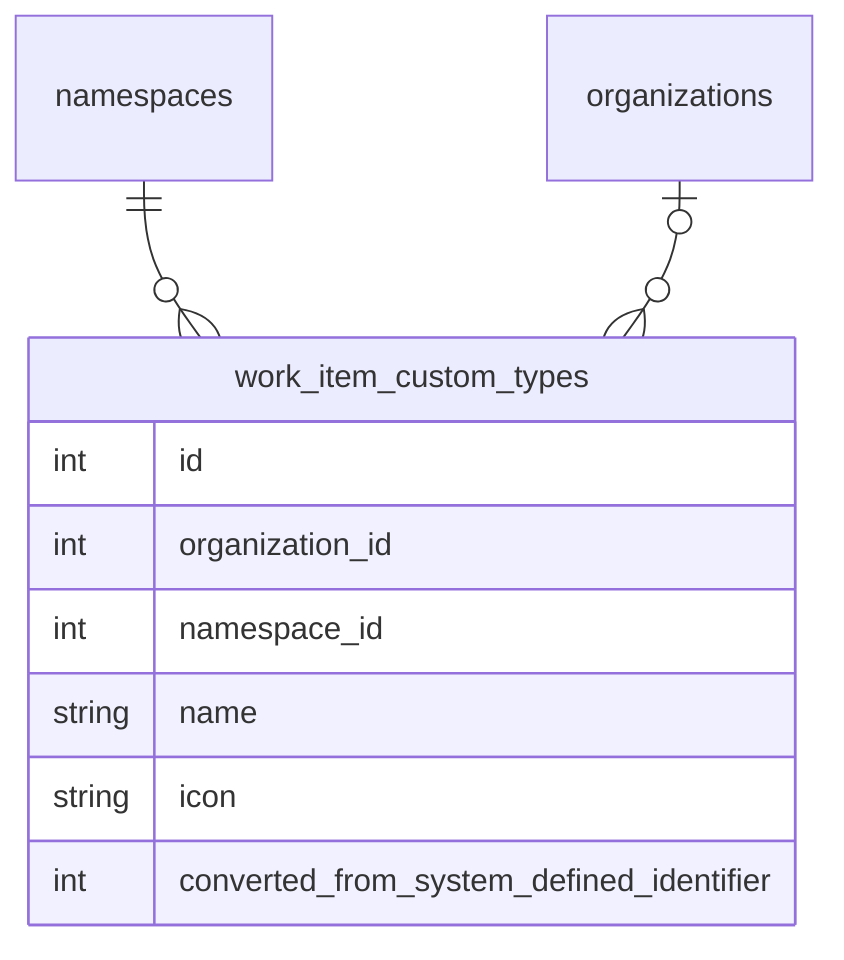

<!-- Design Documents often contain forward-looking statements -->
<!-- vale gitlab.FutureTense = NO -->

<!-- This renders the design document header on the detail page, so don't remove it-->


<div class="my-3 border-l-4 border-blue-500 bg-blue-50 px-4 py-3 rounded-r text-sm text-blue-800">
このページには今後予定されている製品・機能・機能性に関する情報が含まれています。ここに示す情報は参考目的のみです。購入・計画の決定にこの情報を使用しないでください。製品・機能・機能性の開発、リリース、タイミングは変更または延期される可能性があり、GitLab Inc. の独自の判断に委ねられています。
</div>

<div class="overflow-x-auto my-4">
<table class="w-full text-sm border-collapse">
<thead>
<tr class="bg-gray-100 text-left">
<th class="px-3 py-2 border border-gray-300">Status</th>
<th class="px-3 py-2 border border-gray-300">Authors</th>
<th class="px-3 py-2 border border-gray-300">Coach</th>
<th class="px-3 py-2 border border-gray-300">DRIs</th>
<th class="px-3 py-2 border border-gray-300">Owning Stage</th>
<th class="px-3 py-2 border border-gray-300">Created</th>
</tr>
</thead>
<tbody>
<tr>
<td class="px-3 py-2 border border-gray-300"><span class="inline-block rounded px-2 py-0.5 text-xs font-medium bg-gray-100 text-gray-700">ongoing</span></td>
<td class="px-3 py-2 border border-gray-300"><a href="https://gitlab.com/engwan" class="text-blue-600 hover:underline">@engwan</a></td>
<td class="px-3 py-2 border border-gray-300"></td>
<td class="px-3 py-2 border border-gray-300"><a href="https://gitlab.com/acroitor" class="text-blue-600 hover:underline">@acroitor</a>, <a href="https://gitlab.com/gweaver" class="text-blue-600 hover:underline">@gweaver</a></td>
<td class="px-3 py-2 border border-gray-300"><span class="inline-block rounded px-2 py-0.5 text-xs font-medium bg-gray-100 text-gray-700">~devops::plan</span></td>
<td class="px-3 py-2 border border-gray-300">2025-10-28</td>
</tr>
</tbody>
</table>
</div>


## サマリー

このドキュメントでは、GitLab のワークアイテムに対する[設定可能なワークアイテムタイプ](https://gitlab.com/groups/gitlab-org/-/epics/9365)を実装するためのアプローチを概説します。

これにより、Premium および Ultimate の顧客は、システム定義のワークアイテムタイプをカスタマイズし、計画ワークフローに合わせた新しいワークアイテムタイプを作成できます。これらのタイプで使用可能なウィジェットとフィールドもカスタマイズ可能です。

トップダウン制御と自律チームの顧客要件のバランスを取るために、ユーザーは可能な限り高いレベルでのみワークアイテムタイプとその階層制限をカスタマイズできます。そして組織によって許可されている場合、子孫の名前空間またはプロジェクトは、使用したくないタイプを無効にしたり、タイプで使用可能なウィジェットとフィールドを変更したりすることで、タイプをさらにカスタマイズできます。

## ワークアイテムタイプのカスタマイズ

可能な限り高いレベルでワークアイテムタイプの設定を許可します。これにより、顧客は所有するすべてのグループとプロジェクトのタイプを設定できます。これは SaaS インスタンスのルート名前空間レベルと、セルフマネージドインスタンスの[組織レベル](https://docs.gitlab.com/user/organization/)になります。

システム定義のタイプはメモリ内に格納され、すべてのグループとプロジェクト間で共有されます。一方、カスタマイズは `organization_id` と `namespace_id` でシャーディングされた PostgreSQL データベースに格納されます。



### システム定義タイプのカスタマイズ

ユーザーがシステム定義タイプをカスタマイズする場合、新しい `work_item_custom_types` レコードを作成し、`converted_from_system_defined_identifier` 列にシステム定義 ID を格納します。[カスタムステータスと同様に](../work_items_custom_status/#converting-system-defined-lifecycles-and-statuses-to-custom-ones)、これにより既存のすべてのワークアイテムへのカスタマイズが即時に反映されます。

この変換はユーザーから抽象化されており、顧客の自動化を壊さないように `gid://gitlab/WorkItems::Type/<system defined identifier>` 形式でグローバル ID を引き続き返します。私たちの API は、カスタマイズされたシステム定義タイプを渡す際にもこの形式のグローバル ID を受け付けます。

ワークアイテムのタイプと階層制限を取得する場合、これらの変換を考慮する必要があります。タイプでリストをフィルタリングする場合も同様です。

名前空間またはプロジェクトで使用可能なタイプをリストする場合も、これらを考慮する必要があります。システム定義とカスタムタイプのすべてを取得し、マッピングされたカスタムタイプレコードを持つシステム定義タイプを除外する必要があります。

`converted_from_system_defined_identifier` 列は、特定のシステム定義タイプで使用可能な特別な機能をマッピングするためにも使用されます。例えば、Service Desk は `ticket` タイプのワークアイテムを作成します。`ticket` がカスタマイズされると、Service Desk は `converted_from_system_defined_identifier` がシステム定義の `ticket` 識別子と等しいカスタムタイプに基づいてワークアイテムを作成します。

### 新しいワークアイテムタイプの作成

新しいカスタムワークアイテムタイプは、`converted_from_system_defined_identifier` 値が null の `work_item_custom_types` レコードで表されます。これらのカスタムタイプのグローバル ID は `gid://gitlab/WorkItems::Custom::Type/<id>` 形式です。

最初のイテレーションでは、新しいタイプはシステム定義の `issue` タイプと同様に動作します。プロジェクトレベルでのみ許可され、そのウィジェットと階層制限は `issue` タイプと同じになります。

#### タイプ名の一意性

混乱を防ぎ、明確なユーザー体験を保証するために、タイプ名は名前空間または組織内のカスタムタイプと変換されていないシステム定義タイプの両方にわたって一意でなければなりません。つまり：

- カスタムタイプはカスタマイズされていないシステム定義タイプと同じ名前を持つことができません
- カスタムタイプは別のカスタムタイプと同じ名前を持つことができません
- システム定義タイプがカスタマイズされている場合（例：「Task」から「Pizza」に名前変更）、元のシステム定義タイプはその名前でもはや使用できないため、「Task」という名前の新しいカスタムタイプを作成できます
- 変換されたタイプを元の名前に戻した場合、その元の名前がその間に別のタイプに使用されていなければ、カスタムタイプ名は再び使用可能になります。例：「Pizza」を「Task」に戻すと、「Pizza」は再びタイプの名前として使用可能になります

### ワークアイテムのタイプの格納

カスタムタイプでは、ワークアイテムはシステム定義タイプまたはカスタムタイプのいずれかを持つことができます。ID の衝突と外部キー制約のため、既存の `issues.work_item_type_id` 列に両方を格納することはできません。

これは、一方の値のみが null でないという制約を持つ二つの列（`work_item_type_id`、`custom_type_id`）が必要になることを意味します。

## 設定とタイプチェック

タイプの動作に関するハードコードされたチェックをアプリケーション全体で削減しながら、タイプの動作についての明確さを維持するために、タイプ設定にアクセスするための集中インターフェースを持つ設定ベースのアプローチを使用します。

設定はタイプの動作とレンダリングを制御するブール型フラグ（または後のイテレーションでは値ベースの属性）です。複数のタイプが同じ設定を共有できます。

### 設定インターフェース

**バックエンド:**

```ruby
# Checking configurations
type.configured_for?(:use_legacy_view)  # => true/false
type.configured_for?(:group_level)      # => true/false
type.configured_for?(:available_in_create_flow)  # => true/false

# Future: value-based configurations
type.configuration(:required_widgets)  # => [:title, :description]
```

**フロントエンド:** 設定は GraphQL で公開されフロントエンドクライアントに渡されます。フロントエンドはタイプチェックを実行せず、設定フラグを照会して動作を決定するべきです。

### 特別なタイプ処理

Service Desk とインシデント管理機能は特定のワークアイテムタイプ（`ticket` と `incident`）に紐付けられています。これらは以下を通じて処理します：

1. 高速チェックのための設定フラグ:

   ```ruby
   type.configured_for?(:service_desk)         # Is this the service desk type?
   type.configured_for?(:incident_management)  # Is this the incident type?
   ```

2. ルックアップ用のタイププロバイダー

   ```ruby
   # Finding the designated type for a feature
   # (concrete class name might be subject to change).
   WorkItems::TypesFramework::Provider.new(namespace).service_desk_type
   WorkItems::TypesFramework::Provider.new(namespace).incident_type
   ```

### 必須ウィジェット

`ticket` や `incident` などのタイプには、関連する機能（Service Desk、インシデント管理）に必要な必須ウィジェットがあります。これらの必須ウィジェットはシステム定義タイプの定義の一部として定義され、`converted_from_system_defined_identifier` を介して変換されたカスタムタイプに継承されます。

## 実装の詳細

実装では `WorkItems::TypesFramework` 名前空間を使用してタイプ関連の機能を整理し、関心の明確な分離を提供します。これは `WorkItems::Statuses` 名前空間でステータス関連の機能をすべてグループ化したパターンを継続します。具体的には：

1. `FixedItemsModel` を使用するシステム定義クラスは `WorkItems::TypesFramework::SystemDefined` 名前空間を使用します。
1. カスタムタイプ関連の概念のモデルとクラスは `WorkItems::TypesFramework::Custom` 名前空間を使用します。

### フロントエンドメタデータプロバイダーパターン

フロントエンドは、ワークアイテムタイプの設定を取得する別のクエリをメタデータプロバイダー Vue コンポーネントに追加します。このパターンにより、ユーザーが異なる名前空間のアイテム間を移動する際にタイプ設定が常に利用可能で最新の状態になることが保証されます。

#### 動作方法

設定は名前空間の fullpath ごとに一度取得され、Apollo にキャッシュされます。つまり：

1. SPA が最初にマウントされると、現在の名前空間パス（グループまたはプロジェクト）のタイプ設定を取得します
2. ユーザーが同じ名前空間内のアイテムをナビゲートすると、キャッシュされた設定が再利用されます
3. 別の名前空間のアイテムにナビゲートすると、fullpath が更新され、その名前空間パスの新しい設定が強制的に取得されます
4. 各名前空間パスは独自のキャッシュエントリを持ち、SPA が複数の名前空間の設定を同時に維持できます
5. コンポーネントが設定にアクセスしたい場合、現在のワークアイテムタイプをユーティリティメソッドに渡し、適切な名前空間の適切なタイプ設定を返します

#### ユースケース

このパターンはいくつかのナビゲーションシナリオを処理します：

- **同じ名前空間のナビゲーション**: 同じプロジェクト/グループ内のアイテムをクリックすると、キャッシュされた設定が再利用されます
- **クロスプロジェクトのナビゲーション**: 異なるプロジェクトのアイテムにナビゲートすると、そのプロジェクトパスの新しい設定が取得されます
- **クロスグループのナビゲーション**: 異なるグループやルート名前空間のアイテム間をナビゲートすると、適切な設定が取得されキャッシュされます
- **コンテキストビューの変更**: エピック（グループコンテキスト）を表示してから Issue（プロジェクトコンテキスト）を選択すると、設定が新しいコンテキストを反映するよう更新されます

## ワークアイテム設定セクションの設定

これはフロントエンド固有の設定であり、GitLab 自身のフロントエンド実装と UI レイアウトの決定に非常に固有であるため、API で公開することは意味がありません。

### 1. 設定ファクトリー

`ee/app/assets/javascripts/work_items/constants.js` の `getSettingsConfig(context)` ファクトリー関数は、呼び出し元のコンテキストに合わせた設定オブジェクトを生成します。`'root'`、`'subgroup'`、`'project'`、または `'admin'`（デフォルトは `'root'`）の四つのコンテキスト文字列のいずれかを受け付けます。

この関数は二層で設定を構築します：

1. **ベースデフォルト** — 関数内の `DEFAULT_SETTINGS_CONFIG` オブジェクトがブール型可視性フラグ、権限、レイアウトの完全セットを定義します：

   | プロパティ | タイプ | 目的 |
   |---|---|---|
   | `showWorkItemTypesSettings` | `boolean` | 設定可能なタイプセクションを表示する。 |
   | `showEnabledWorkItemTypesSettings` | `boolean` | 有効なタイプセクションを表示する。 |
   | `showCustomFieldsSettings` | `boolean` | カスタムフィールドセクションを表示する。 |
   | `showCustomStatusSettings` | `boolean` | カスタムステータスセクションを表示する。 |
   | `workItemTypeSettingsPermissions` | `string[]` | 設定可能なタイプに適用される権限（例：`['edit', 'create', 'archive']`）。 |

2. **コンテキスト固有のテキスト** — 二つのルックアップマップ（`configurableTypesSubtexts` と `enabledTypesSubtexts`）がコンテキストによって記述文字列をキー設定します。ファクトリーは一致する文字列を `configurableTypesSubtext` と `enabledTypesSubtext` として返されるオブジェクトにマージします。

コンシューマーはファクトリーを呼び出し、必要なフラグをオーバーライドします：

```js
// Admin — disable sections not yet supported
const config = {
  ...getSettingsConfig('admin'),
  showEnabledWorkItemTypesSettings: false,
  showCustomFieldsSettings: false,
  showCustomStatusSettings: false,
};

// Subgroup — only the enabled types section
const config = {
  ...getSettingsConfig('subgroup'),
  showWorkItemTypesSettings: false,
  showEnabledWorkItemTypesSettings: true,
  showCustomFieldsSettings: false,
  showCustomStatusSettings: false,
};
```

#### 新しい設定オプションのスケーラビリティパターン

新しい設定セクションや設定プロパティを追加するには：

1. `getSettingsConfig` 内の `DEFAULT_SETTINGS_CONFIG` に新しいブール型フラグ（例：`showMyNewSettings`）を追加します。
2. 新しいセクションにコンテキスト固有のテキストが必要な場合、コンテキスト文字列でキー設定された新しいルックアップマップ（例：`myNewSettingsSubtexts`）を追加し、結果を返されるオブジェクトにマージします。
3. すでに `getSettingsConfig(context)` をスプレッドしている各コンシューマーは自動的に新しいデフォルトを継承します。コンシューマーはそのコンテキストがデフォルト以外の値を必要とする場合にのみフラグをオーバーライドする必要があります。
4. `WorkItemSettingsHome` で、新しいフラグを使用する `v-if` ガードを追加して対応するコンポーネントを条件付きでレンダリングします。

このアプローチにより、ファクトリーがデフォルトの単一情報源として機能しながら、各エントリーポイントが個々のセクションをオプトイン/オプトアウトできます。新しいコンテキスト（例：`'organization'`）は各ルックアップマップへの新しいエントリーのみが必要です。

### 2. 有効なワークアイテムタイプセクション

`EnabledConfigurableTypesSettings` コンポーネント（`ee/groups/settings/work_items/configurable_types/enabled_configurable_types_settings.vue`）は `SettingsBlock` 内でレンダリングされ、特定の名前空間で現在アクティブなワークアイテムタイプを表示します。

- 可視性は設定の `showEnabledWorkItemTypesSettings` によって制御されます。
- 説明テキストは `config.enabledTypesSubtext` から来るため、現在のコンテキストを自動的に反映します。
- コンポーネントは `WorkItemTypesListEnabledDisabledView` にレンダリングを委任し、それが独自の Apollo クエリを持ちます。

---

## コンテキスト固有の動作マトリックス

| コンテキスト | 設定可能なタイプセクション | 有効なタイプセクション | カスタムフィールド | カスタムステータス |
|---|---|---|---|---|
| **管理者** | 表示 | 非表示 | 非表示 | 非表示 |
| **ルートグループ** | 表示 | 表示 | 表示 | 表示 |
| **サブグループ** | 非表示 | 表示 | 非表示 | 非表示 |
| **プロジェクト** | 非表示 | 表示 | 非表示 | 非表示 |

---

## コンポーネント階層

```text
WorkItemSettingsHome
├── ConfigurableTypesSettings          (if showWorkItemTypesSettings)
│   └── WorkItemTypesList              (always renders list/crud view)
├── EnabledConfigurableTypesSettings   (if showEnabledWorkItemTypesSettings)
│   └── WorkItemTypesListEnabledDisabledView  (self-fetching)
├── CustomStatusSettings               (if showCustomStatusSettings)
└── CustomFieldsList                   (if showCustomFieldsSettings)
```

## 実装とリリース計画

以下のリリースを特定しました。ここでは必須要件のみをリストします。すべての添付サブエピックと Issue のリストについてはエピックを参照してください。

### ベータ版

ベータ版（デモしたいもの）

1. システム定義タイプ
2. Service Desk の Issue をチケットに移行する
3. 少なくともプロジェクトレベルで「あらゆる種類のタイプ」を消費できるように BE と FE の両方を準備しながら、タイプチェックを最小限に削減する
4. 管理者設定（組織は今のところ編集をサポートしていない）および/またはトップグループレベルの管理セクション（ユーザーができること）
   1. タイプのリスト表示
   2. プロジェクトワークアイテムタイプの名前変更
   3. 新しいプロジェクトレベルのワークアイテムタイプの作成
5. 新しいタイプはアイコンを持ち、ウィジェットと階層に関して Issue と同様に動作することができます。ユーザーはトップレベルグループでカスタムフィールドとステータスライフサイクルに新しいタイプを関連付けることができます。

### GA（MVC1）

GA（出荷したいもの）

1. 任意の階層レベルでタイプを有効/無効にするカスケード設定を追加する
2. トップレベルでグループ/プロジェクトの可視性をロックする設定を追加する

### 残りのイテレーション

完全性のために GA/MVC1 の後に続く残りのイテレーション/フェーズを以下に示します。これらは必ずしも互いに依存しないため、順序は変更される可能性があります：

1. [ワークアイテムタイプのウィジェットカスタマイズ](https://gitlab.com/groups/gitlab-org/-/epics/20075)
2. [グループ内のカスタマイズ可能なタイプと設定可能な階層](https://gitlab.com/groups/gitlab-org/-/epics/20076)
3. [タイプの拡張設定オプション（ポリシー）](https://gitlab.com/groups/gitlab-org/-/epics/20077)

### タイムライン

目標日程は実装のブロッカーに応じて変更される可能性がある[内部 Wiki ページ](https://gitlab.com/groups/gitlab-org/plan-stage/-/wikis/Plan-Stage-Roadmap/Configurable-Work-Item-Types#target-dates)にリンクされています。

## ライセンスとティアの考慮事項

カスタムワークアイテムタイプは Premium 以上の機能です。ライセンス機能は `configurable_work_item_types` と呼ばれます。顧客がカスタムタイプをサポートしないティアにダウングレードした場合、以下の戦略を適用します：

### ダウングレードの動作

ダウングレード時、既存のすべての設定とデータはそのまま保持しますが、ミューテーションは禁止します：

- 既存のカスタムタイプとその設定は読み取り用に引き続きアクセス可能
- 新しいカスタムタイプの作成はブロックされます
- 既存のカスタムタイプの変更はブロックされます
- 関係と階層はそのままですが、現在のライセンス機能を超えた変更はできません
- 名前変更されたシステム定義タイプはカスタム名を保持し、それ以上変更できません

このアプローチはデータの破壊的アクションとデータ損失を回避し、ダウングレードされたティアの機能が削減されていることを明確に伝えます。これはステータスとカスタムフィールド機能のダウングレード動作と一致しています。

### カスタムタイプの制限

Premium ティアでは、トップレベルの名前空間または組織ごとに、カスタムとシステム定義のワークアイテムタイプ合わせて `40` 個のアクティブなワークアイテムタイプ制限が施行されます。

### 将来のティア差別化

将来のイテレーションでは、階層の深さ制限など、Premium と Ultimate ティア間の追加制限を導入することがあります。これらは同じ戦略に従います：既存の設定と関係を保持しますが、現在のライセンス機能を超えた新しい使用と変更を制限します。

## 権限

以下の権限チェックは、ライセンス機能 `configurable_work_item_types` とユーザーが指定されたアクションを実行する認可の両方を確認します。ほとんどの場合、少なくともメンテナー以上のロールが必要です。

- `create_work_item_type`
- `update_work_item_type`
- `configure_work_item_type`

### ワークアイテムタイプの状態

1. 有効 - 任意のワークアイテムタイプのデフォルト
1. ロック済み - 名前変更、無効化、削除ができないシステムタイプ。
1. アーカイブ済み - 削除の代替。最適なワークフローはタイプを削除して新しいタイプに移行することでしたが、それが不可能だったため、この「アーカイブ」タイプを追加しました
   1. フィルターで使用できないようにします（ルートレベルでのみ発生するため、カスケード設定には依存しません）
   1. 名前変更と編集アイコンは許可されません
1. 無効
   1. 無効になっているプロジェクト/グループのフィルターで使用できないようにします（親から継承する場合は同じ権限を継続します）
   1. 作成できないようにします
   1. 名前変更と編集アイコンは許可されます

### ワークアイテムタイプセクション

ワークアイテム設定ページに別々のセクションがあります

1. 「ワークアイテムタイプ」 - タイプが定義、作成、グローバル管理される場所。
2. 「有効なワークアイテムタイプ」 - これは純粋にローカル設定で、可用性を切り替えることができます

コンテキストと要件に応じて、ワークアイテム設定ページで上記の両セクションに対して別々の組み合わせがあります。

## フィーチャーフラグ

MVC1 では、ルートグループをアクターとして `work_item_configurable_types` フィーチャーフラグを使用します。

テスト目的のため、フィーチャーフラグは Plan Stage のテストグループ [gl-demo-premium-plan-stage](https://gitlab.com/gl-demo-premium-plan-stage) と [gl-demo-ultimate-plan-stage](https://gitlab.com/gl-demo-ultimate-plan-stage) の本番環境で有効になっています。

## 決定レジストリ

1. [SaaS インスタンスのルート名前空間レベル、セルフマネージドインスタンスの組織レベルでタイプを設定する](https://gitlab.com/groups/gitlab-org/-/epics/7897#note_2795232631)。

   私たちはまだすべての顧客を GitLab.com の別々の組織に移行する準備ができていないため、現時点ではルート名前空間レベルでタイプを設定する必要があります。一方、セルフマネージドインスタンスは常に単一の組織を持つため、組織レベルで設定できます。

   セルフマネージドの顧客は通常、インスタンス上の複数のルート名前空間にわたって作業するため、タイプとワークフローを標準化できるよう、より高いレベルで設定できることを望んでいます。

1. システム定義タイプは、Cells とシャーディング作業のためのクラスター全体のテーブルを回避し、それらをアンブロックするために、[`ActiveRecord::FixedItemsModel` オブジェクトとしてメモリ内に格納されます](https://gitlab.com/gitlab-org/gitlab/-/issues/519894)。
1. Service Desk やインシデント管理などの特別な機能は、[システム定義タイプに 1:1 でマッピングされます](https://gitlab.com/groups/gitlab-org/-/epics/7897#note_2857326975)。
1. 破壊的変更を避けるために、[システム定義タイプの既存のグローバル ID 形式を維持します](https://gitlab.com/gitlab-org/gitlab/-/issues/579238)。システム定義タイプがカスタマイズされた場合でも、同じ形式が保持されます。
1. [別のケイパビリティの概念ではなく、タイプの動作に設定ベースのアプローチを使用する](https://gitlab.com/gitlab-com/content-sites/handbook/-/merge_requests/17119#ai-summary-of-the-discussion-in-slack-for-the-record)。

   「ケイパビリティ」（排他的なタイプのアイデンティティ）と「設定」（動作フラグ）の両方の導入を検討しましたが、統一された設定アプローチを選択しました。排他的な処理を必要とする特別なタイプが二つだけであるため、単一のコンセプトが今のところよりシンプルで理解・維持しやすいです。

1. [`WorkItems::TypesFramework` 名前空間を使用します](https://gitlab.com/gitlab-org/gitlab/-/merge_requests/212636#note_2948286714)。
1. [ライセンスのダウングレード時は、既存の設定とデータを保持しますがミューテーションを禁止します](https://gitlab.com/gitlab-org/gitlab/-/issues/579231)。
1. ワークアイテムタイプの名前の複数形を保存/格納することを進めません。ワークアイテムタイプ名の複数形化を完全に回避するためです。「Issues」「Epics」「Stories」の代わりに、タイプ名は単数形のままにし、そのタイプの複数のアイテムを参照する場合、複数形はコンテナレベルで処理されます：「work items of type: [Name]」または「items」。
1. チケットはメールまたは `/convert_to_ticket user@example.com` クイックアクションを使用してのみ作成できます。
   1. 「Ticket」は作成可能なタイプのリストから削除されます。
   1. 子アイテムセクションから「新しいチケットを作成」が削除されます。
1. ヘッダーアクションメニューでは「新しい TYPE_NAME を関連付ける」の代わりに「新しい関連アイテム」を使用します。
1. ユーザーはチケットを他の任意のアイテムタイプに関連付けることができます
1. [名前空間パスごとにワークアイテムタイプの設定を取得し、Apollo にキャッシュする](https://gitlab.com/groups/gitlab-org/-/epics/20061#note_3020401416)。

   このパターンの動作とメリットの詳細については、[フロントエンドメタデータプロバイダーパターン](#frontend-metadata-provider-pattern)セクションを参照してください。

1. [ワークアイテムタイプ間のすべてのリンク制限を削除する](https://gitlab.com/gitlab-org/gitlab/-/issues/581932#note_3019673313)。

   任意のワークアイテムタイプは「Blocked by / Blocks」や「Related to」などの関係で他の任意のタイプにリンクできるようにします。この決定はリンクされたアイテムにのみ適用され、子アイテム（階層）には適用されません。

1. [カスタムワークアイテムタイプを既存のシステム定義タイプに委任します](https://gitlab.com/gitlab-org/gitlab/-/issues/581932#note_2959381705)。
カスタムウィジェットの定義と階層制限テーブルの作成は、ユーザーが将来のイテレーションでこれらの機能を実際にカスタマイズするまで延期します。

1. すべてのワークアイテムタイプの設定コードは、設定可能なワークアイテムタイプが Premium 以上の機能であるため、`ee/` に存在する必要があります。

   CE ユーザーはタイプ、ウィジェット、または階層をカスタマイズすることはできません。トップレベルのワークアイテムタイプ GraphQL クエリと関連する設定コードは EE コードベースに安全に存在できます。`namespaceWorkItemTypes` クエリはすべてのワークアイテムリスト機能を処理し、CE に適しています。現在 CE にあるが、タイプ設定にのみ使用される再利用可能なコンポーネントは、EE への移行を評価する必要があります。

1. [カスタムタイプと変換されていないシステム定義タイプ間でタイプ名は一意でなければなりません](https://gitlab.com/gitlab-org/gitlab/-/merge_requests/218464#note_3022168638)。

1. [ID 範囲によってシステム定義とカスタムワークアイテムタイプを分離する](https://gitlab.com/gitlab-org/gitlab/-/merge_requests/223117)。

   システム定義のワークアイテムタイプは ID 1〜1000 を使用し、カスタムワークアイテムタイプは ID 1001 以上を使用します。`work_item_custom_types` テーブルの 2 カテゴリ間の重複を防ぐために 1001 から始まる新しいシーケンスを使用します。

1. 利用可能なすべてのワークアイテムタイプは、組織レベル/トップレベルグループ、サブグループレベル、プロジェクトレベルのすべてのレベルで表示されます

1. エピックはプロジェクトレベルでワークアイテムタイプとして表示されますが、エピックは現在グループレベルでのみ利用可能であることを示す説明ツールチップが表示されます。注：これは将来のイテレーションで変更される可能性があります。

1. ワークアイテムタイプの作成/編集は組織レベル/トップレベルグループでのみ可能です。

1. 「ワークアイテムタイプ」セクションに加えて、[トップレベルグループでも表示される](https://gitlab.com/gitlab-org/gitlab/-/issues/585643#note_3080703281)別のセクション「有効なワークアイテムタイプ」を追加します

1. サブグループとプロジェクトは「有効なワークアイテムタイプ」セクションのみを持ちます。

1. アーカイブされたタイプは組織レベル/トップレベルグループでは分割ボタンビューとして表示されますが、プロジェクトとサブグループレベルでは表示されません。

1. [カスタムワークアイテムタイプは GID モデルクラスとして `WorkItems::Type` を使用します](https://gitlab.com/gitlab-org/gitlab/-/merge_requests/224790#note_3125745798)。

   変換されたタイプやシステム定義タイプと同様に、新しいカスタムタイプでもレガシーの `WorkItems::Type` クラスを使用してグローバル ID を構築します。これは、システム定義タイプとカスタムタイプの両方が `gid://gitlab/WorkItems::Type/<id>` 形式のグローバル ID を生成することを意味します。

   - GraphQL API サーフェスを均一に保ちます — クライアントはシステム定義タイプとカスタムタイプの GID を区別する必要がありません。
   - `Custom::Type` は内部実装の詳細であり、公開 API のコンセプトではありません。
   - `WorkItems::TypesFramework::Provider` は両方のタイプを均一に解決するための意図されたクラスです。現在 GID モデルとして `WorkItems::Type` を使用することは、将来のリファクタリングが既存の API 契約を破らないことを意味します。

   [GID を均一に使用する `WorkItems::Type` についての議論](https://gitlab.com/gitlab-org/gitlab/-/merge_requests/223304#note_3092047469)も参照してください。

1. [カスタムタイプ間のワークアイテムの無制限の変換を許可する](https://gitlab.com/gitlab-org/gitlab/-/work_items/595002#note_3210323887)。

   現在の MVC では、カスタムタイプの任意のワークアイテムを制限なしに他の任意のカスタムタイプに変換できます。すべてのカスタムタイプはシステム定義の `issue` タイプと同じウィジェットセットと動作を共有するため、それらの間でワークアイテムを変換すると、データ損失のリスクなしにすべてのウィジェットとデータが保持されます。すでに `issue` への変換をサポートしている任意のワークアイテムタイプは、`supportedConversionTypes` にすべてのカスタムタイプも有効な変換ターゲットとしてリストする必要があります。この決定は、ウィジェットカスタマイズや階層カスタマイズによってカスタムタイプ間の違いが生じる可能性がある将来のイテレーションで再検討される可能性があります。

   [実装の詳細についての議論](https://gitlab.com/gitlab-org/gitlab/-/merge_requests/227980#note_3201204553)も参照してください。

## リソース

1. [このイニシアチブのトップレベルエピック](https://gitlab.com/groups/gitlab-org/-/epics/9365)
1. [ワークアイテムタイプの作成/編集](https://gitlab.com/gitlab-org/gitlab/-/issues/580932)のデザイン
1. [ワークアイテムタイプの詳細ビュー](https://gitlab.com/gitlab-org/gitlab/-/issues/580940)のデザイン
1. [ワークアイテムタイプのリストビュー](https://gitlab.com/gitlab-org/gitlab/-/issues/580929)のデザイン
1. [設定可能なワークアイテムタイプの POC](https://gitlab.com/gitlab-org/gitlab/-/issues/580260)

## チーム

全員に更新情報を提供するために、このドキュメントに関連するすべての MR で現在のチームをメンションしてください。全員が変更を承認することを期待しているわけではありません。

```text
@gweaver @acroitor @nickleonard @gitlab-org/plan-stage/project-management-group/engineers
```
