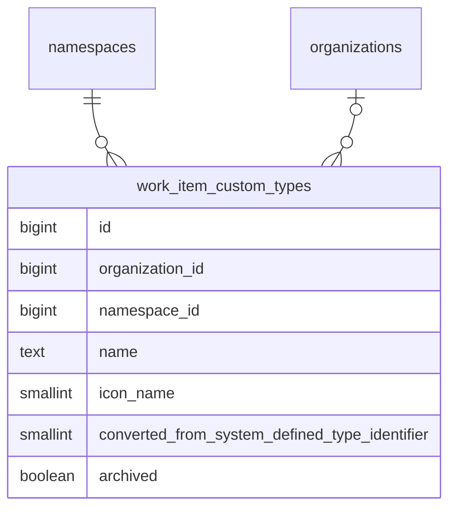

<!-- Design Documents often contain forward-looking statements -->
<!-- vale gitlab.FutureTense = NO -->

<!-- This renders the design document header on the detail page, so don't remove it-->



## サマリー

このドキュメントは、GitLab のワークアイテムに対する[設定可能なワークアイテムタイプ](https://gitlab.com/groups/gitlab-org/-/epics/9365)を実装するための私たちのアプローチを概説します。

これにより、Premium と Ultimate の顧客は、システム定義のワークアイテムタイプをカスタマイズし、自分たちの計画ワークフローに合わせて新しいワークアイテムタイプを作成できます。

トップダウンの制御を求める顧客要件と自律的なチームのバランスを取るため、ユーザーは可能な限り最も高いレベルでのみワークアイテムタイプとその階層制限をカスタマイズできます。そして organization が許可していれば、子孫の namespace または project は、使いたくないタイプを無効化することで、タイプをさらにカスタマイズできます。

タイプごとのウィジェットのカスタマイズは、後続のイテレーションで計画されています。最初のリリースでは、カスタムタイプはシステム定義の `issue` タイプと同じウィジェットセットを使用します。

## 用語集

このドキュメント全体で使われる語彙のリファレンスです。最初に読む際は[ワークアイテムタイプのカスタマイズ](#customizing-work-item-types)まで飛ばしてください。各セクションで初出時に用語はここにリンクされています。

### システム定義タイプ（System-defined type） {#system-defined-type}

GitLab に同梱される組み込みのワークアイテムタイプ（`issue`、`incident`、`task`、`epic`、`ticket` など）。1〜9 の範囲の ID を持つ [`ActiveRecord::FixedItemsModel`](https://docs.gitlab.com/development/fixed_items_model/) オブジェクトとしてインメモリに保存され、すべての namespace で共有されます。システム定義タイプは削除できませんが、カスタマイズはできます。変換済みタイプを参照してください。

### カスタムタイプ（Custom type） {#custom-type}

`work_item_custom_types` に保存されるユーザー作成のワークアイテムタイプ。カスタムタイプは完全に新規（例: 「Bug Report」「Feature Request」）でも、システム定義タイプをカスタマイズして作成したものでもかまいません。カスタムタイプの ID は、システム定義の ID と重ならないように 1001 から始まります。

### 変換済みタイプ（Converted type） {#converted-type}

システム定義タイプをカスタマイズして作成されたカスタムタイプ。例えば、「Issue」を「Feature」に改名すると変換済みタイプが作成されます。`converted_from_system_defined_type_identifier` カラムが、元のシステム定義タイプの識別子を保存します。変換済みタイプは、ソースタイプの特別な機能マッピング（Service Desk、incident management）を継承し、元のタイプの Global ID 形式を保持します。これらは、カスタマイズと後方互換性の間のアーキテクチャ上の橋渡しです。

### 委譲ソース（Delegation source） {#delegation-source}

カスタムタイプが動作（ウィジェット、階層制限、ベースタイプの述語、設定フラグ）を継承するシステム定義タイプ。変換済みタイプの場合、これは `converted_from_system_defined_type_identifier` によって識別されるシステム定義タイプです。新規のカスタムタイプの場合、これはデフォルトで `issue` になります。カスタムタイプごとのウィジェットと階層のカスタマイズは後続のイテレーションで計画されており、それまでは委譲がデフォルトを提供します。

### Provider

`WorkItems::TypesFramework::Provider` クラス。指定された namespace に対するタイプの存在と可用性についての唯一の権威です。ワークアイテムタイプを解決する必要があるすべてのコードは Provider を経由し、Provider はシステム定義タイプとカスタムタイプをリクエストごとのインデックス付きキャッシュにマージします。

### NamespacedType

Provider のキャッシュ内でタイプをラップして namespace を認識できるようにする、軽量な `SimpleDelegator` のサブクラス。共有された `FixedItemsModel` シングルトンを変異させずに、namespace ごとの状態（`enabled`、`is_a_group`、`tasks_on_boards`）を保持します。アイデンティティメソッドは保持されるため、ラッパーは等価性チェックに対して透過的なままです。

### SIWAR

Sparse Inheritance with Ancestor Resolution（祖先解決を伴う疎な継承）。namespace 階層に沿って「最も近い祖先が勝つ」というセマンティクスで namespace ごとの設定（特に可視性）を解決するために使われるパターン。継承されたデフォルトから逸脱する namespace のみが行を必要とするため、疎（sparse）です。

## ワークアイテムタイプのカスタマイズ {#customizing-work-item-types}

私たちは、可能な限り最も高いレベルでワークアイテムタイプの設定を許可します。これにより、顧客は所有するすべてのグループと project に対してタイプを設定できます。
これは、SaaS インスタンスではルート namespace レベル、Self-Managed インスタンスでは [organization レベル](https://docs.gitlab.com/user/organization/)になります。

[システム定義タイプ](#system-defined-type)は `ActiveRecord::FixedItemsModel` オブジェクトとしてインメモリに保存され、すべてのグループと project で共有されます。カスタマイズは PostgreSQL データベースに保存され、`organization_id` または `namespace_id` でシャーディングされます。



`work_item_custom_types` テーブルは、システム定義タイプの ID（1〜9）との衝突を避けるため、1001 から始まる ID シーケンスを使用します。チェック制約が `id >= 1001` を強制します。`organization_id` と `namespace_id` カラムは相互排他的です（厳密に一方が非 null でなければなりません）。親 namespace または organization ごとに 40 個のカスタムタイプという制限があります。

### MVC1 カスタマイズのスコープ {#scope-of-mvc1-customization}

このフレームワークは、任意の[システム定義タイプ](#system-defined-type)を改名しアイコンを変更できるよう設計されていますが、MVC1 は UI が公開するものを意図的に狭めています。

- **Issue** は改名とアイコンの変更ができます。
- **新しい[カスタムタイプ](#custom-type)**を作成できます。これらは常に Issue を[委譲ソース](#delegation-source)として使用し、そのウィジェットセットと階層制限を継承します。
- **その他すべてのシステム定義タイプ**（`epic`、`incident`、`task`、`ticket`、`test_case`、`requirement`、`objective`、`key_result`）はロックされています。改名、アーカイブ、その他のカスタマイズはできません。
- **ウィジェットのカスタマイズ、階層のカスタマイズ、設定フラグのオーバーライド**は MVC1 のスコープ外であり、[イテレーションエピック](https://gitlab.com/groups/gitlab-org/-/epics/9365)で追跡されています。

その他のシステム定義タイプに対する制限は、フレームワークの制限ではなくフロントエンドの制約です。UI のいくつかの箇所が、リストビュー、詳細ビュー、作成フローで、これらのタイプをそのシステム定義名でまだ参照しています。これらの面がタイプ名に依存せずデータ駆動になるよう刷新されるまで、改名は一貫性のない UI を生み出します。意図は、それらの面が移行されるにつれて追加のタイプのカスタマイズを解放することです。

### システム定義タイプのカスタマイズ

ユーザーが[システム定義タイプ](#system-defined-type)をカスタマイズするとき（現在は Issue の改名またはアイコンの変更 — [MVC1 カスタマイズのスコープ](#scope-of-mvc1-customization)を参照）、新しい `work_item_custom_types` レコードを作成し、元のシステム定義 ID を `converted_from_system_defined_type_identifier` カラムに保存します。ワークアイテム自体は触れられません。それらの `work_item_type_id` は引き続きシステム定義 ID を指します。例えば、既存のすべての issue は `work_item_type_id = 1` を保持し、新しく作成されるすべての issue も `work_item_type_id = 1` で書き込まれます。カスタマイズはデータ移行ではなくルックアップを通じて有効になります。[Provider](#provider) は、システム定義 ID が現れるあらゆる場所でそれを[変換済みタイプ](#converted-type)に解決します。[カスタムステータスと同様に](../work_items_custom_status/#converting-system-defined-lifecycles-and-statuses-to-custom-ones)、これは変更が即時かつ低コストであることを意味します。

カスタムレコードの PK ではなくシステム定義 ID を保存することが、アーキテクチャの要石です。カスタマイズのたびにすべての既存ワークアイテムの `work_item_type_id` を書き換えることは、`issues` テーブルの規模では実現不可能であり、クエリを高速に保つ単一カラムのストレージモデルも壊してしまいます。完全な根拠については[ワークアイテムのタイプの保存](#storing-a-work-items-type)を参照してください。

この変換は API コンシューマーに対して透過的です。Global ID は引き続き `gid://gitlab/WorkItems::Type/<system-defined identifier>` の形式を使用し、GraphQL タイプは変更されず、私たちの API はカスタマイズされたシステム定義タイプを渡す際にこの形式の Global ID を受け付けます。外部から見える唯一の変更は、タイプの名前とアイコンです。システム定義タイプが一度カスタマイズされると、元の名前に改名し戻されても[変換済みタイプ](#converted-type)のままです。「変換を取り消す」操作はありません。

変換済みタイプは、元のシステム定義タイプに対するデコレーターとして機能します。[委譲ソース](#delegation-source)パターンを介して、ウィジェット、階層制限、設定フラグ、ベースタイプの述語を元のタイプに委譲します。特別な機能の動作（`ticket` の Service Desk、`incident` の incident management）は、この委譲チェーンを通じて保持されます。アプリケーションが「これは Service Desk を扱うタイプか？」と尋ねると、タイプの `base_type` を要求し、それが委譲ソースを介してシステム定義タイプに委譲され `:ticket` を返します。システム定義タイプの設定フラグ（`service_desk: true`、`incident_management: true`）が、そのタイプをその機能に指定されたものとして識別します。`converted_from_system_defined_type_identifier` カラムは、この委譲チェーンを正しく解決させる連結であり、機能コードが直接読むものではありません。

ワークアイテムのタイプを取得するとき、[Provider](#provider) は変換を適用します。namespace または project で利用可能なタイプを一覧表示するとき、Provider はすべてのシステム定義タイプと[カスタムタイプ](#custom-type)を取得し、マッピングされたカスタムタイプレコードを持つシステム定義タイプを除外します。

### 新しいワークアイテムタイプの作成

新しい[カスタムタイプ](#custom-type)は、`converted_from_system_defined_type_identifier` 値が null である `work_item_custom_types` レコードで表されます。

すべてのタイプ — [システム定義](#system-defined-type)、[変換済み](#converted-type)、新規カスタム — は同じ Global ID 形式 `gid://gitlab/WorkItems::Type/<id>` を使用します。`SystemDefined::Type#to_global_id` と `Custom::Type#to_global_id` の両方が、`model_name: 'WorkItems::Type'` を指定して明示的に GID を構築します。互いに素な ID 空間（システム定義は 1〜9、カスタムは 1001 以上）が衝突を防ぎます。

最初のイテレーションでは、新しいタイプはシステム定義の `issue` タイプのように振る舞います。project レベルでのみ許可され、そのウィジェットと階層制限は `issue` のものと一致します。新規カスタムタイプのグループレベルでの可用性は、後続のイテレーションで計画されています。タイプごとのウィジェットのカスタマイズも後続のイテレーションで計画されています。

### ワークアイテムタイプのアーカイブ {#archiving-a-work-item-type}

[カスタムタイプ](#custom-type)は、履歴データを保持するため、削除ではなくアーカイブできます。タイプがアーカイブされると:

- `work_item_custom_types` の `archived` boolean カラムでマークされます
- タイプ作成フローに表示されなくなります
- そのタイプの既存のワークアイテムは保持され、引き続きアクセス可能なままです
- タイプをアーカイブ解除して再び利用可能にできます

これは[カスタムフィールドのアーカイブ](../work_items_custom_fields/#archiving-custom-fields)と同じパターンに従います。

#### タイプ名の一意性

混乱を防ぎ明確なユーザー体験を保証するため、タイプ名は namespace または organization 内で[カスタム](#custom-type)タイプと変換されていない[システム定義タイプ](#system-defined-type)の両方にわたって一意でなければなりません。これは次を意味します。

- カスタムタイプは、カスタマイズされていないシステム定義タイプと同じ名前を持てません
- カスタムタイプは、別のカスタムタイプと同じ名前を持てません
- システム定義タイプがカスタマイズされた場合（例: 「Task」から「Pizza」に改名）、元のシステム定義タイプはその名前で利用できなくなるため、「Task」という名前で新しいカスタムタイプを作成できます
- ユーザーが[変換済みタイプ](#converted-type)を元の名前に改名し戻した場合、その間にその元の名前が取られていなければ、そのカスタムタイプ名は再び取得可能になります。例: 「Pizza」を「Task」に改名し戻すと、「Pizza」がタイプの名前として利用可能になります

### ワークアイテムのタイプの保存 {#storing-a-work-items-type}

私たちは[単一カラムのアプローチ](https://gitlab.com/gitlab-org/gitlab/-/issues/580065)を使ってワークアイテムにタイプを保存します。既存の `issues.work_item_type_id` カラムが、すべてのタイプのタイプ ID を保存します。

- **[システム定義タイプ](#system-defined-type):** システム定義 ID（1〜9）が直接保存されます。
- **[変換済みタイプ](#converted-type):** `converted_from_system_defined_type_identifier` 値 — 元のシステム定義 ID — が保存されます。これは、既存のワークアイテムがデータ移行なしに自動的にカスタマイズを取り込めるようにするキーです。
- **新規[カスタムタイプ](#custom-type):** カスタムタイプ自身の ID（1001 以上）が保存されます。

これは `HasType#persistable_type_id` メソッドによって処理され、タイプの性質に基づいて書き込む正しい ID を決定します。

単一のカラムが同時に 2 つの意味を持ちます。1〜9 の範囲の値はシステム定義タイプまたは変換済みタイプを識別し、1001 以上の範囲の値は新規カスタムタイプを識別します。互いに素な ID 範囲により、判別用のカラムなしにこれが曖昧になりません。[Provider](#provider) は、保存された ID を namespace に対する正しいタイプオブジェクトに変換する解決レイヤーです。

単一カラムのアプローチは、[トレードオフを調査](https://gitlab.com/gitlab-org/gitlab/-/issues/580065)した後に、代替案（相互排他制約を伴う二重カラム、カスタムタイプ用の負の ID、三カラムのアプローチ）よりも選ばれました。決め手となった要因は次のとおりです。

- **カスタマイズ時に `issues` を書き換えない。** 変換済みタイプは保存された ID をシステム定義 ID として保持するため、タイプのカスタマイズはワークアイテムの行に一切触れません。`issues` テーブルの規模では、これは即時の操作と不可能な操作の違いです。
- **インデックスの密度とクエリ速度。** 単一の整数カラムは、`work_item_type_id` 上の既存のインデックスを完全に利用可能なまま保ちます。「この project のすべての ticket」のようなクエリは、namespace ごとのカスタムレコードに展開するのではなく、単一の整数マッチのままです。
- **高トラフィックな `issues` テーブルでのスキーマ変更なし。** `issues` へのカラム追加は、パフォーマンスと運用上の理由から積極的に避けられており、二重カラム設計はバックフィルと新しいインデックスも必要とします。単一カラムのアプローチは両方を回避します。
- **Cells との互換性。** システム定義タイプは、バックテーブルを持たない `FixedItemsModel` オブジェクトとしてインメモリに存在します。`issues.work_item_type_id` からタイプテーブルへの外部キーは、参照する行がないため、システム定義 ID には存在できません。単一カラムのアプローチは、これに抗うのではなく受け入れます。

単一カラムの欠点は、`work_item_type_id` 上の外部キー制約がないことです。2 つの理由でこれは許容できます。

- **システム定義 ID にはテーブルがない。** 標準的な FK は、設計にかかわらず 1〜9 の範囲には不可能です。
- **カスタム ID は `work_item_custom_types` に存在する。** 1001 以上の範囲のみを対象とする部分的な FK は可能ですが、整合性の保証が値空間の半分しかカバーしないため、大きな利点なしに非対称性を加えるだけです。

カスタムタイプ ID の参照整合性は、代わりにデータベーストリガー（[!223997](https://gitlab.com/gitlab-org/gitlab/-/merge_requests/223997)）によって強制され、高トラフィックな `issues` テーブルに制約の配管を加えることなく、外部キーの関連部分を模倣します。

- `work_item_custom_types` 上のトリガーが、`issues` の行からまだ参照されている行の削除をブロックします。カスケードはありません。削除はそのまま失敗します。実際には、これはサポートされるライフサイクル操作である[アーカイブ](#archiving-a-work-item-type)と組み合わされます。そのままの削除は未使用のタイプ用に予約されています。
- `issues`（および `work_item_type_id` を保存する他のテーブル）上のトリガーが、insert と update 時に値を検証します。存在しないカスタムタイプ ID を持つ行は書き込み時に拒否されます。

元の FK はこの移行の一部として[削除されました](https://gitlab.com/gitlab-org/gitlab/-/issues/588587)。アプリケーション層の解決は引き続き [Provider](#provider) を通じて行われ、これがあらゆるタイプ ID の唯一の解決パスです。現在の namespace に存在しないタイプを要求されると、Provider は `nil` を返します。これは「このカスタムタイプは別の namespace に属する」という通常のパスであり、ぶら下がり参照を示すものではありません。

## Provider パターン

[Provider](#provider) は、指定された namespace に対するタイプの存在と可用性についての唯一の権威です。ワークアイテムタイプを解決する必要があるすべてのコードは、タイプモデルを直接クエリするのではなく、これを経由します。

### 仕組み

CE Provider は、すべてのパブリックメソッドを 2 つのプライベートメソッド `resolve_by_id` と `resolve_all` に委譲します。これにより、EE 層に単一のオーバーライドポイントのペアが与えられます。

EE Provider はこの 2 つのメソッドをオーバーライドし、[システム定義](#system-defined-type)タイプと[カスタムタイプ](#custom-type)の両方から構築されたリクエストごとのインデックス付きキャッシュを経由するようにルーティングします。キャッシュ内の各タイプは [`NamespacedType`](#namespacedtype) デリゲーターでラップされ、`FixedItemsModel` シングルトン（リクエスト間で安定した `object_id` を持つ共有 Ruby オブジェクト）を変異させずに `enabled` 属性を保持します。

```ruby
provider = WorkItems::TypesFramework::Provider.new(namespace)
provider.find_by_id(1)         # Returns Issue (or its converted custom type)
provider.find_by_id(1001)      # Returns custom type with ID 1001
provider.all_ordered_by_name   # All available types for the namespace
provider.find_by_base_type(:incident)  # Returns the type designated for incidents
```

### キャッシュの構造

インデックス付きキャッシュは、タイプ ID をキーとし `SafeRequestStore`（リクエストごと、スレッドごと）に保存されるハッシュです。システム定義タイプがカスタムタイプに変換された場合、変換済みタイプがキャッシュ内のシステム定義タイプを置き換え、システム定義 ID と自身の AR 主キーの両方でインデックス付けされます。この二重インデックスにより、ラウンドトリップの安全性が保証されます。タイプを解決し、`.id` を読み取り、それを `find_by_id` に渡し戻すコードが、同じオブジェクトを得られます。

### NamespacedType デリゲーター

[`NamespacedType`](#namespacedtype) は、タイプをラップして namespace を認識できるようにします。それ自身の動作を追加するのではなく、特定の namespace のコンテキストでのみ意味を持つ状態でラップされたタイプを豊かにします。アイデンティティメソッド（`class`、`is_a?`、`instance_of?`、`kind_of?`）はオーバーライドされ、ラップされたタイプのクラスとして報告するため、ラッパーは `FixedItemsModel` の等価性チェックに対して透過的なままです。

ラッパーが保持する namespace 固有の状態は、コードベースの残りの部分が「このタイプはこの namespace でどう見えるか？」に答えるために必要なすべてをカバーします。

- `enabled` — このタイプがこの特定の namespace で使用するために有効になっているか
- `is_a_group` — 現在の namespace がグループかどうか（グループ専用タイプのようなタイプレベルの動作に影響）
- `tasks_on_boards` — その namespace で tasks-on-boards 機能がアクティブかどうか
- `enabled_by_default_for_new_namespaces?` — `SafeRequestStore` に裏打ちされた遅延述語で、タイプ管理 UI でのみ使用されます。Provider のホットパスを安価に保つため、キャッシュ構築時ではなくオンデマンドで解決されます

可用性（availability）と有効化（enablement）の区別が、鍵となるメンタルモデルです。

- `available` = タイプが namespace 階層に存在する（キャッシュにある）
- `enabled` = タイプがこの特定の namespace で使用するために有効になっている

タイプは利用可能だが無効である場合があります。例えば、`Task` は階層に存在するが特定の project では無効になっている、という具合です。無効なタイプも `find_by_id` で返されますが（既存のアイテムは正しくレンダリングされます）、作成フローはそれらを拒否します。

最初のリリースでは、`enabled` はすべてのタイプでデフォルトで `true` です。[可視性コントロール](#visibility-controls)が実際の永続化からそれを populate します。

### nil namespace の処理

Provider は頻繁に `nil` namespace で構築されます（インポート、メトリクス、Issue のスコープ）。EE の `feature_available?` メソッドは namespace が `nil` のとき `false` を返し、これにより Provider はシステム定義タイプのみを返す CE 実装にフォールスルーします。organization namespace も同様に可視性解決をショートサーキットします。可視性マップは organization namespace に対して `{}` を返すため、すべてのタイプはデフォルトで `enabled: true` になります。

## 委譲ソース

[カスタムタイプ](#custom-type)は、その動作を[委譲ソース](#delegation-source) — ウィジェット、階層制限、設定フラグ、ベースタイプの述語を決定する[システム定義タイプ](#system-defined-type) — に委譲します。

- **[変換済みタイプ](#converted-type):** 委譲ソースは、`converted_from_system_defined_type_identifier` によって識別される元のシステム定義タイプです。
- **新規カスタムタイプ:** 委譲ソースはデフォルトで `issue` システム定義タイプになります。

これは次を意味します。

- `custom_type.widgets` は、その委譲ソースからウィジェットリストを返します
- `custom_type.issue?` は、新規カスタムタイプに対して `true` を返します（Issue に委譲）
- `custom_type.incident?` は、Incident から変換されたタイプに対して `true` を返します
- 階層制限は委譲ソースの制限と一致します

カスタムタイプごとのウィジェットと階層のカスタマイズは、後続のイテレーションで計画されています。委譲ソースパターンが基盤を提供します。カスタマイズが実装されると、ウィジェットと階層のオーバーライドが委譲されたデフォルトの上に重なります。

## 可視性コントロール {#visibility-controls}

タイプの可視性は、[SIWAR](#siwar) パターンを使って namespace ごとに制御されます。これを 3 つのテーブルがサポートします。

- `work_item_type_visibilities` — namespace ごと、タイプごとの明示的な可視性オーバーライド。疎（sparse）: デフォルトから逸脱する namespace のみがレコードを必要とします。
- `work_item_type_visibility_defaults` — 新しい子 namespace が作成されたときに適用されるデフォルト。
- `work_item_settings` — organization またはルート namespace ごとの機能設定。可視性管理を有効にするユーザー制御のトグルである `customizable_type_visibility` boolean を含みます。

### 可視性管理の有効化

可視性管理はオプトインです。デフォルトでは `customizable_type_visibility` は `false` であり、これはすべてのタイプがどこでも有効であることを意味します。[Provider](#provider) は可視性解決を完全にショートサーキットし、可視性テーブルに存在する可能性のある行にかかわらず、すべてのタイプに対して `enabled: true` を返します。可視性コントロールを使うには、管理者がまず `workItemSettingsUpdate` ミューテーションを介して organization またはルート namespace で `customizable_type_visibility` 設定を有効にする必要があります。そうして初めて可視性テーブルが効力を持ちます。

この 2 段階のモデルは、顧客がタイプレベルのトグルに既存の namespace を黙って影響させるのではなく、意図的に可視性コントロールを採用できることを意味します。

### 解決のセマンティクス

解決クエリは、「最も近い祖先が勝つ」というセマンティクスで PostgreSQL の `traversal_ids` を使用します。namespace 階層内で最も具体的なオーバーライドが優先されます。`propagate: true` を持つ行は、より近い祖先がオーバーライドするまですべての子孫に適用されます。Provider はキャッシュ構築中にこのクエリを実行し、その結果から [`NamespacedType.enabled`](#namespacedtype) を設定します。

### 可視性アクション

3 つの独立した可視性アクションが利用できます。

| アクション | 効果 | ストレージ |
|---|---|---|
| この namespace のみを制御 | この namespace のタイプ可視性を切り替える | `work_item_type_visibilities` の単一行 |
| 既存のすべての子に伝播 | すべての子孫 namespace にオーバーライドを書き込む（競合する子孫の行をクリア） | `propagate: true` を持つ単一行 |
| 新しい子のデフォルトを設定 | 将来の子 namespace のデフォルトを設定 | `work_item_type_visibility_defaults` の単一行 |

`workItemAvailabilityToggle` ミューテーションは、指定された namespace に対して特定のタイプを有効または無効にし、その scope 引数を通じてこれらのアクションを公開します。

### 新しい namespace のデフォルト可視性

各タイプには、新しい子 namespace が作成されたときに適用されるデフォルト可視性があります。デフォルトは、`workItemTypeCreate` と `workItemTypeUpdate` ミューテーションの `enabledByDefaultForNewNamespaces` 入力を介してタイプの作成または更新時に設定され、organization またはルート namespace にスコープされて `work_item_type_visibility_defaults` に保存されます。

新しいグループまたは project が作成されると、シーディングサービスが org/root のデフォルトを読み取り、それぞれを [SIWAR](#siwar) が新しい namespace に対して現在解決するものと比較します。可視性の行は、2 つが食い違う場合にのみ書き込まれます。伝播する祖先がすでに望ましい状態を生成していれば、行は不要です。これにより可視性テーブルが疎に保たれ、冗長な書き込みが避けられます。

最初のリリースでは、デフォルトを organization またはルート namespace のみにスコープします。任意の namespace レベルでデフォルトを設定すること（サブグループが自身の将来の子のデフォルトを定義できるように）は、`workItemAvailabilityToggle` の `NEW_CHILDREN` scope を介して後続のイテレーションで計画されています。

### インポートとエクスポートの相互作用

インポート（CSV、Direct Transfer、ファイルベース）は、`validate_work_item_type_id` 上の `importing?` 免除を介して、モデルレベルのタイプ検証を意図的にバイパスします。この免除がなければ、元のタイプがターゲット namespace で無効になっているレコード — または名前ではマッチするがそこで無効になっているレコード — は保存に失敗してドロップされてしまいます。それはインポートの契約に反します。インポートはレコードをベストエフォートで着地させるべきであり、黙ってドロップすべきではありません。

インポートのパスは、可視性を認識するフォールバックチェーンを使用します。名前でマッチ → ターゲットでマッチかつ有効 → デフォルトの issue タイプ。モデル検証は、同期的なユーザー起点の書き込み（UI、GraphQL、REST、Service Desk、クイックアクション）の強制ポイントのまま残ります。インポートは設計上の明示的な例外です。

## カスタムタイプのワークアイテムの作成

任意のタイプ — [システム定義](#system-defined-type)、[変換済み](#converted-type)、新規[カスタム](#custom-type) — のワークアイテムを作成するには、同じ作成パスを通ります。[Provider](#provider) が解決ポイントです。タイプが存在し namespace で利用可能かどうかを判断し、作成フローの残りは解決されたタイプを一様に扱います。

概念モデルには 2 つの異なる認可レイヤーがあります。

- **タイプの可用性** — このタイプは存在し、この namespace で使用可能か？ これは Provider の仕事であり、フィーチャーフラグのゲーティング、ライセンスのゲーティング、namespace の可視性をカバーします。タイプが利用できない場合、作成ロジックが実行される前にリクエストが拒否されます。
- **作成権限** — ユーザーはこの namespace でワークアイテムを作成する権限を持っているか？ これは標準の `:create_work_item` ポリシーチェックであり、タイプとは独立しています。

歴史的にベースタイプの述語をキーにしていた権限チェック（例: 「このユーザーは incident を作成することを許可されているか？」）は、それが依然として意味を持つシステム定義タイプと変換済みタイプには引き続き適用されます。新規カスタムタイプは自身のベースタイプ権限を持たず、Issue に委譲します。新規カスタムタイプのワークアイテムの作成は、標準の「ワークアイテムの作成」権限でゲートされます。

## 権限

| 権限 | スコープ | ロール（SaaS） | ロール（Self-Managed） | 目的 |
|---|---|---|---|---|
| `create_work_item_type` | ルートグループ、organization | メンテナー以上 | 管理者、または organization のオーナー | 新しいカスタムタイプの作成 |
| `update_work_item_type` | ルートグループ、organization | メンテナー以上 | 管理者、または organization のオーナー | タイプの更新または変換 |
| `update_work_item_type_visibility` | ルートグループ、サブグループ、project | メンテナー以上 | メンテナー以上 | namespace のタイプ可視性の切り替え |
| `configure_work_item_type` | サブグループ、project | メンテナー以上 | メンテナー以上 | サブグループと project レベルでワークアイテムタイプ設定 UI にアクセス。ウィジェットのカスタマイズや階層のカスタマイズ（現在は委譲ソースから継承される）など、将来のタイプごとの設定のエントリーポイントとして予約されています。 |

`WorkItems::TypesFramework::Custom::TypePolicy` は、認可を親 namespace または organization に委譲し、ライセンスされた機能をチェックします。

## ライセンスとダウングレード

設定可能なワークアイテムタイプは、Premium と Ultimate の顧客向けにライセンスされた機能（`configurable_work_item_types`）として利用できます。

ライセンスのダウングレード時:

- すべてのカスタムタイプと設定は引き続き読み取り可能なまま残ります
- ミューテーション（タイプの作成、更新、変換）はブロックされます
- データの破壊やタイプのマッピングはありません
- カスタムタイプの既存のワークアイテムは引き続き機能します
- 再アップグレードすると、データ移行なしに完全な機能が復元されます

これは[フレームワーク全体のライセンスの原則](../work_items_framework_vision/#licensing-and-downgrade-strategy)に従います。ダウングレード時に既存の設定とデータを無傷に保ちつつ、ミューテーションを禁止します。

## フロントエンドアーキテクチャ

フロントエンドの実装には次が含まれます。

- ワークアイテムタイプを管理するための、ルートグループ、サブグループ、project、管理者レベルの**設定ページ**
- 作成、編集、アーカイブのアクションを持つ**タイプ一覧ビュー**、および制限を示すアクティブなタイプのカウンター
- namespace の管理者がどのタイプを利用可能にするかを制御できる、サブグループと project 向けの**有効/無効トグルビュー**
- 新しいタイプの定義や既存タイプのカスタマイズのための**作成/編集フォーム**

フロントエンドは、フレームワークビジョンで説明されている[設定プロバイダーパターン](../work_items_framework_vision/#1-configuration-over-type-checks)を使用し、namespace ごとにタイプ設定をフェッチして Apollo にキャッシュします。API レスポンスが、どのタイプが利用可能でどのアクションが可能かを駆動します。タイプの可用性についてのハードコードされた前提はありません。

## 設定とタイプチェック

アプリケーション全体でハードコードされたタイプチェックを減らしつつ、タイプの動作についての明確さを維持するため、
私たちはタイプ設定にアクセスするための一元化されたインターフェースを持つ設定ベースのアプローチを使用します。

設定は boolean フラグ（または後のイテレーションでは値ベースの属性）であり、
タイプがどう振る舞いレンダリングされるかを制御します。複数のタイプが同じ設定を共有できます。

### 設定インターフェース

**バックエンド:**

```ruby
# Checking configurations
type.configured_for?(:use_legacy_view)  # => true/false
type.configured_for?(:group_level)      # => true/false
type.configured_for?(:available_in_create_flow)  # => true/false

# Future: value-based configurations
type.configuration(:required_widgets)  # => [:title, :description]
```

**フロントエンド:** 設定は GraphQL を介して公開され、フロントエンドのクライアントに渡されます。
フロントエンドはタイプチェックを実行すべきではなく、代わりに設定フラグをクエリして動作を決定すべきです。

### 特別なタイプの処理

Service Desk と Incident Management の機能は、特定のワークアイテムタイプ（`ticket` と `incident`）に紐づいています。
これらを次のように処理します。

1. クイックチェックのための設定フラグ:

   ```ruby
   type.configured_for?(:service_desk)         # Is this the service desk type?
   type.configured_for?(:incident_management)  # Is this the incident type?
   ```

2. ルックアップのためのタイププロバイダー

   ```ruby
   # Finding the designated type for a feature
   # (concrete class name might be subject to change).
   WorkItems::TypesFramework::Provider.new(namespace).service_desk_type
   WorkItems::TypesFramework::Provider.new(namespace).incident_type
   ```

### 必須ウィジェット

`ticket` や `incident` のようなタイプは、関連する機能（Service Desk、Incident Management）に必要な必須ウィジェットを持っています。
これらの必須ウィジェットはシステム定義タイプ定義の一部として定義され、
`converted_from_system_defined_type_identifier` を介して変換済みカスタムタイプに継承されます。

## 実装の詳細

実装は `WorkItems::TypesFramework` namespace を使ってタイプ関連の機能を整理し、明確な関心の分離を提供します。
これは、ステータス関連のすべての機能をグループ化した `WorkItems::Statuses` namespace で確立したパターンを継続するものです。
詳細には、これは次を意味します。

1. `FixedItemsModel` を使うシステム定義クラスは `WorkItems::TypesFramework::SystemDefined` namespace を使用します。
1. カスタムタイプ関連の概念のモデルとクラスは `WorkItems::TypesFramework::Custom` namespace を使用します。

### フロントエンドのメタデータプロバイダーパターン {#frontend-metadata-provider-pattern}

フロントエンドは、メタデータプロバイダーの vue コンポーネントに、ワークアイテムタイプ設定をフェッチする別のクエリを追加します。このパターンは、ユーザーが異なる namespace のアイテム間を移動する際に、タイプ設定が常に利用可能で最新であることを保証します。

#### 仕組み

設定は namespace の fullpath ごとに一度フェッチされ、Apollo にキャッシュされます。これは次を意味します。

1. SPA が最初にマウントされると、現在の namespace パス（グループまたは project）のタイプ設定をフェッチします
2. ユーザーが同じ namespace 内のアイテムに移動すると、キャッシュされた設定が再利用されます
3. 異なる namespace のアイテムに移動すると、fullpath が更新され、その namespace パスの新しい設定のフェッチが強制されます
4. 各 namespace パスが独自のキャッシュエントリを持つため、SPA は複数の namespace の設定を同時に維持できます
5. コンポーネントが設定にアクセスしたいとき、現在のワークアイテムタイプをユーティリティメソッドに渡し、正しい namespace に対する正しいタイプ設定を返します。

#### ユースケース

このパターンはいくつかのナビゲーションシナリオを処理します。

- **同じ namespace 内のナビゲーション**: 同じ project/グループ内のアイテムをクリックすると、キャッシュされた設定が再利用されます
- **project 間のナビゲーション**: 異なる project のアイテムに移動すると、その project のパスの新しい設定がフェッチされます
- **グループ間のナビゲーション**: 異なるグループまたはルート namespace のアイテム間を移動すると、適切な設定がフェッチされキャッシュされます
- **コンテキストに応じたビューの変更**: epic（グループのコンテキスト）を表示し、その後 issue（project のコンテキスト）を選択すると、設定が更新されて新しいコンテキストを反映します

## ワークアイテム設定セクションの設定

これはフロントエンド固有の設定であり、GitLab 自身のフロントエンド実装と UI レイアウトの決定に非常に固有なため、API で公開する意味がありません。

### 1. 設定構成ファクトリ

`ee/app/assets/javascripts/work_items/constants.js` 内の
`getSettingsConfig(context)` ファクトリ関数は、
呼び出し元のコンテキストに合わせた設定オブジェクトを生成します。
これは 4 つのコンテキスト文字列のいずれかを受け取ります:
`'root'`、`'subgroup'`、`'project'`、または `'admin'`（デフォルトは `'root'`）。

この関数は設定を 2 つの層で構築します。

1. **ベースのデフォルト** — 関数内の `DEFAULT_SETTINGS_CONFIG` オブジェクトが、
   boolean の可視性フラグ、権限、レイアウトの完全なセットを定義します。

   | プロパティ | 型 | 目的 |
   |---|---|---|
   | `showWorkItemTypesSettings` | `boolean` | 設定可能なタイプセクションを表示する。 |
   | `showEnabledWorkItemTypesSettings` | `boolean` | 有効なタイプセクションを表示する。 |
   | `showCustomFieldsSettings` | `boolean` | カスタムフィールドセクションを表示する。 |
   | `showCustomStatusSettings` | `boolean` | カスタムステータスセクションを表示する。 |
   | `workItemTypeSettingsPermissions` | `string[]` | 設定可能なタイプに適用される権限（例: `['edit', 'create', 'archive']`）。 |

2. **コンテキスト固有のテキスト** — 2 つのルックアップマップ（`configurableTypesSubtexts` と
   `enabledTypesSubtexts`）が、説明的な文字列をコンテキストごとにキー付けします。ファクトリは
   マッチする文字列を、`configurableTypesSubtext` と `enabledTypesSubtext` として
   返されるオブジェクトにマージします。

コンシューマーはファクトリを呼び出し、その後必要なフラグをオーバーライドします。

```js
// Admin — disable sections not yet supported
const config = {
  ...getSettingsConfig('admin'),
  showEnabledWorkItemTypesSettings: false,
  showCustomFieldsSettings: false,
  showCustomStatusSettings: false,
};

// Subgroup — only the enabled types section
const config = {
  ...getSettingsConfig('subgroup'),
  showWorkItemTypesSettings: false,
  showEnabledWorkItemTypesSettings: true,
  showCustomFieldsSettings: false,
  showCustomStatusSettings: false,
};
```

#### 新しい設定オプションのためのスケーラビリティパターン

新しい設定セクションや設定プロパティを追加するには:

1. `getSettingsConfig` 内の `DEFAULT_SETTINGS_CONFIG` に新しい boolean フラグ
   （例: `showMyNewSettings`）を追加します。
2. 新しいセクションがコンテキスト固有のテキストを必要とする場合、コンテキスト文字列でキー付けされた
   新しいルックアップマップ（例: `myNewSettingsSubtexts`）を追加し、その結果を
   返されるオブジェクトにマージします。
3. すでに `getSettingsConfig(context)` を展開している各コンシューマーは、
   新しいデフォルトを自動的に継承します。コンシューマーは、自身のコンテキストが
   非デフォルトの値を必要とする場合にのみフラグをオーバーライドすればよいです。
4. `WorkItemSettingsHome` で、新しいフラグを使った `v-if` ガードを追加して、
   対応するコンポーネントを条件付きでレンダリングします。

このアプローチは、ファクトリをデフォルトの唯一の信頼できる情報源として保ちつつ、
各エントリーポイントが個々のセクションをオプトインまたはオプトアウトできるようにします。新しいコンテキスト
（例: `'organization'`）には、各ルックアップマップに新しいエントリを追加するだけで済みます。

### 2. 有効なワークアイテムタイプセクション

`EnabledConfigurableTypesSettings` コンポーネント
（`ee/groups/settings/work_items/configurable_types/enabled_configurable_types_settings.vue`）は、
`SettingsBlock` 内でレンダリングされ、指定された namespace で現在アクティブな
ワークアイテムタイプを表示します。

- 可視性は設定の `showEnabledWorkItemTypesSettings` によって制御されます。
- 説明テキストは `config.enabledTypesSubtext` から来るため、
  現在のコンテキストを自動的に反映します。
- コンポーネントは、自身の Apollo クエリを所有する
  `WorkItemTypesListEnabledDisabledView` にレンダリングを委譲します。

---

## コンテキスト固有の動作マトリクス

| コンテキスト | 設定可能なタイプセクション | 有効なタイプセクション | カスタムフィールド | カスタムステータス |
|---|---|---|---|---|
| **Admin** | 表示 | 非表示 | 非表示 | 非表示 |
| **ルートグループ** | 表示 | 表示 | 表示 | 表示 |
| **サブグループ** | 非表示 | 表示 | 非表示 | 非表示 |
| **Project** | 非表示 | 表示 | 非表示 | 非表示 |

---

## コンポーネント階層

```text
WorkItemSettingsHome
├── ConfigurableTypesSettings          (if showWorkItemTypesSettings)
│   └── WorkItemTypesList              (always renders list/crud view)
├── EnabledConfigurableTypesSettings   (if showEnabledWorkItemTypesSettings)
│   └── WorkItemTypesListEnabledDisabledView  (self-fetching)
├── CustomStatusSettings               (if showCustomStatusSettings)
└── CustomFieldsList                   (if showCustomFieldsSettings)
```

## イテレーション

MVC1 は GitLab 19.0 でリリースされました。リリースされた内容と将来のイテレーションで計画されている内容の完全な内訳については、[トップレベルのエピック](https://gitlab.com/groups/gitlab-org/-/epics/9365)とそのサブエピックを参照してください。

1. [ワークアイテムタイプのウィジェットのカスタマイズ](https://gitlab.com/groups/gitlab-org/-/epics/20075)
2. [グループ内のカスタマイズ可能なタイプと設定可能な階層](https://gitlab.com/groups/gitlab-org/-/epics/20076)
3. [タイプの拡張された設定オプション（ポリシー）](https://gitlab.com/groups/gitlab-org/-/epics/20077)

## ライセンスとティアの考慮事項

カスタムワークアイテムタイプは Premium 以上の機能です。ライセンスされた機能の名前は `configurable_work_item_types` です。
顧客がカスタムタイプをサポートしないティアにダウングレードした場合、次の戦略を適用します。

### ダウングレード時の動作

ダウングレード時には、すべての既存の設定とデータを無傷に保ちつつ、ミューテーションを禁止します。

- 既存のカスタムタイプとその設定は引き続き読み取り可能なままアクセスできます
- 新しいカスタムタイプの作成はブロックされます
- 既存のカスタムタイプの変更はブロックされます
- 関係性と階層は無傷のまま残りますが、現在のライセンス機能を超えて変更することはできません
- 改名されたシステム定義タイプはカスタム名を保持し、それ以上変更できません

このアプローチは、破壊的なアクションとデータ損失を回避しつつ、
ダウングレードされたティアの低下した機能を明確に伝え、ステータスとカスタムフィールド機能のダウングレード動作と一致しています。

### カスタムタイプの制限

Premium ティアでは、トップレベルの namespace または organization ごとに、カスタムとシステム定義のワークアイテムタイプ全体にわたって `40` 個のアクティブなワークアイテムタイプ制限が強制されます。

### 将来のティア差別化

将来のイテレーションでは、階層の深さ制限など、Premium と Ultimate のティア間に追加の制限を導入する可能性があります。これらは同じ戦略に従います。既存の設定と関係性を保ちつつ、現在のライセンス機能を超える新しい使用と変更を制限します。

## ワークアイテムタイプの状態と設定 UI

### ワークアイテムタイプの状態

1. 有効 - 任意のワークアイテムタイプのデフォルト
1. ロック済み - 改名、無効化、削除ができないシステムタイプ。
1. アーカイブ済み - 削除の代替。最適なワークフローはタイプを削除して新しいタイプに移行することでしたが、それが不可能だったため、この「アーカイブ」タイプを追加しました
   1. フィルターで利用できないようにすべき（ルートレベルでのみ発生するため、カスケード設定には依存しない）
   1. 改名と編集アイコンは許可しない
1. 無効
   1. 無効になっている project/グループのフィルターで利用できないようにすべき（親から継承している場合は同じ権限を継続）
   1. 作成を許可しないようにすべき
   1. 改名と編集アイコンは許可する

### ワークアイテムタイプのセクション

ワークアイテム設定ページには別々のセクションがあります。

1. 「Work item types」 - タイプがグローバルに定義、作成、管理される場所です。
2. 「Enabled work item types」 - これは純粋にローカルの設定で、可用性を切り替えられます。

コンテキストと要件に応じて、ワークアイテム設定ページ上の上記両セクションについて別々の組み合わせがあります。

## 決定レジストリ

1. [SaaS インスタンスではルート namespace レベルで、Self-Managed インスタンスでは organization レベルでタイプを設定する](https://gitlab.com/groups/gitlab-org/-/epics/7897#note_2795232631)。

   GitLab.com 上ですべての顧客を別々の organization に移す準備ができていないため、今のところルート namespace レベルでタイプを設定する必要があります。一方、Self-Managed インスタンスは
   常に単一の organization を持つため、organization レベルで設定できます。

   Self-Managed の顧客は通常、自分のインスタンス上で複数のルート namespace にまたがって作業するため、より高いレベルで設定できるようにして、
   タイプとワークフローを標準化できるようにしたいと考えています。

1. システム定義タイプは、クラスター全体のテーブルを避け Cells とシャーディングの作業のブロックを解除するため、[`ActiveRecord::FixedItemsModel` オブジェクトとしてインメモリに保存されます](https://gitlab.com/gitlab-org/gitlab/-/issues/519894)。
1. Service Desk や incident management のような特別な機能は、[システム定義タイプに 1:1 でマッピングされます](https://gitlab.com/groups/gitlab-org/-/epics/7897#note_2857326975)。
1. 破壊的変更を避けるため、[システム定義タイプの既存の Global ID 形式を維持します](https://gitlab.com/gitlab-org/gitlab/-/issues/579238)。システム定義タイプがカスタマイズされても同じ形式が保持されます。
1. [別個の capability の概念ではなく、タイプの動作には設定ベースのアプローチを使用します](https://gitlab.com/gitlab-com/content-sites/handbook/-/merge_requests/17119#ai-summary-of-the-discussion-in-slack-for-the-record)。

   私たちは「capabilities」（排他的なタイプのアイデンティティ）と「configurations」（動作フラグ）の両方を導入することを検討しましたが、統一された設定アプローチを選びました。排他的な処理を必要とする特別なタイプが 2 つしかないため、単一の概念の方が今のところ理解とメンテナンスがよりシンプルです。

1. [私たちは `WorkItems::TypesFramework` namespace を使用します](https://gitlab.com/gitlab-org/gitlab/-/merge_requests/212636#note_2948286714)。
1. [ライセンスのダウングレード時には、既存の設定とデータを保ちつつミューテーションを禁止します](https://gitlab.com/gitlab-org/gitlab/-/issues/579231)。
1. ワークアイテムタイプ名の複数形化を完全に避けるため、ワークアイテムタイプ名の複数形を保存することはしません。「Issues」「Epics」「Stories」ではなく、タイプ名は単数のままにすべきであり、そのタイプの複数のアイテムを指すときは、複数性はコンテナレベルで処理します:「work items of type: [Name]」または「items」。
1. Ticket は、メールまたは `/convert_to_ticket user@example.com` クイックアクションを使ってのみ作成できます。
   1. 作成のために利用可能なタイプのリストから「Ticket」が削除されます。
   1. 子アイテムセクションから「Create new ticket」が削除されます。
1. ヘッダーアクションメニューでは「New related TYPE_NAME」の代わりに「New related item」を使用します。
1. ユーザーは ticket を他の任意のアイテムタイプに関連付けできます
1. [namespace パスごとにワークアイテムタイプ設定をフェッチし、Apollo にキャッシュします](https://gitlab.com/groups/gitlab-org/-/epics/20061#note_3020401416)。

   このパターンの仕組みとその利点の詳細については、[フロントエンドのメタデータプロバイダーパターン](#frontend-metadata-provider-pattern)セクションを参照してください。

1. [ワークアイテムタイプ間のすべてのリンク制限を削除します](https://gitlab.com/gitlab-org/gitlab/-/issues/581932#note_3019673313)。

   任意のワークアイテムタイプは、「Blocked by / Blocks」や「Related to」のような関係性で他の任意のタイプにリンクできるべきです。この決定はリンクされたアイテムのみに適用され、子アイテム（階層）には適用されません。

1. [カスタムワークアイテムタイプを既存のシステム定義タイプに委譲し](https://gitlab.com/gitlab-org/gitlab/-/issues/581932#note_2959381705)、
ユーザーが将来のイテレーションでこれらの機能を実際にカスタマイズするまで、カスタムウィジェット定義と階層制限テーブルの作成を延期します。

1. 設定可能なワークアイテムタイプは Premium 以上の機能であるため、すべてのワークアイテムタイプ設定コードは `ee/` に存在すべきです。

   CE ユーザーはタイプ、ウィジェット、階層をカスタマイズできることは決してありません。トップレベルのワークアイテムタイプ GraphQL クエリと関連する設定コードは、安全に EE コードベースに置けます。`namespaceWorkItemTypes` クエリはすべてのワークアイテムリスト機能を処理し、CE に適しています。現在 CE にあるがタイプ設定にのみ使われる再利用可能なコンポーネントは、EE への移行を検討すべきです。

1. [タイプ名は、カスタムタイプと変換されていないシステム定義タイプ全体にわたって一意でなければなりません](https://gitlab.com/gitlab-org/gitlab/-/merge_requests/218464#note_3022168638)。

1. [システム定義とカスタムのワークアイテムタイプを ID 範囲で分離します](https://gitlab.com/gitlab-org/gitlab/-/merge_requests/223117)。

   システム定義のワークアイテムタイプは ID 1〜1000 を使用し、カスタムのワークアイテムタイプは ID 1001 以上を使用します。`work_item_custom_types` テーブルには 1001 から始まる新しいシーケンスがあり、
   2 つのカテゴリ間の重複を防ぎます。

1. すべての利用可能なワークアイテムタイプは、すべてのレベル、すなわち organization レベル/トップレベルグループ、サブグループレベル、project レベルで表示されます

1. Epic は project レベルでワークアイテムタイプとして表示され、project では無効である旨の説明ツールチップが付きます。Epic は現在グループレベルでのみ利用可能なためです。注: これは将来のイテレーションで変更される可能性があります。

1. ワークアイテムタイプの作成/編集は、organization レベル/トップレベルグループでのみ可能です。

1. 「Work item types」セクションに加えて、別個の「Enabled work item types」セクションを持ち、[これはトップレベルグループにも表示されます](https://gitlab.com/gitlab-org/gitlab/-/issues/585643#note_3080703281)

1. サブグループと project は「Enabled work item types」セクションのみを持ちます。

1. アーカイブ済みタイプは、organization レベル/トップレベルグループでは分割ボタンビューとして表示されますが、project とサブグループレベルでは表示されません。

1. [カスタムワークアイテムタイプは GID のモデルクラスとして `WorkItems::Type` を使用します](https://gitlab.com/gitlab-org/gitlab/-/merge_requests/224790#note_3125745798)。

   変換済みおよびシステム定義タイプと同様に、新規カスタムタイプについても、レガシーの `WorkItems::Type` クラスを使って Global ID を構築します。これは、システム定義タイプとカスタムタイプの両方が `gid://gitlab/WorkItems::Type/<id>` の形式で Global ID を生成することを意味します。

   - GraphQL API の面を一様に保ちます。クライアントはシステム定義タイプとカスタムタイプの GID を区別する必要が決してありません。
   - `Custom::Type` はパブリック API の概念ではなく、内部の実装の詳細です。
   - `WorkItems::TypesFramework::Provider` が両方のタイプの種類を一様に解決するための意図されたクラスです。GID モデルとして今 `WorkItems::Type` を使うことは、将来のリファクタリングが既存の API 契約を壊さないことを意味します。

   [`WorkItems::Type` GID を一様に使うことについての議論](https://gitlab.com/gitlab-org/gitlab/-/merge_requests/223304#note_3092047469)も参照してください。

1. [カスタムタイプ間のワークアイテムの無制限の変換を許可します](https://gitlab.com/gitlab-org/gitlab/-/work_items/595002#note_3210323887)。

   現在の MVC では、カスタムタイプの任意のワークアイテムを、制限なく他の任意のカスタムタイプに変換できます。すべてのカスタムタイプはシステム定義の `issue` タイプと同じウィジェットセットと動作を共有するため、それらの間でワークアイテムを変換しても、すべてのウィジェットとデータが保持され、データ損失のリスクはありません。すでに `issue` への変換をサポートする任意のワークアイテムタイプは、`supportedConversionTypes` においてすべてのカスタムタイプを有効な変換ターゲットとして列挙すべきです。この決定は、ウィジェットのカスタマイズや階層のカスタマイズがカスタムタイプ間に差異を導入する可能性がある将来のイテレーションで再検討される可能性があります。

   [実装の詳細についての議論](https://gitlab.com/gitlab-org/gitlab/-/merge_requests/227980#note_3201204553)も参照してください。

1. [ワークアイテムダッシュボードは、organization が存在する場合にのみ Type フィルターを表示し、そうでなければ Type フィルターは表示しません。](https://gitlab.com/gitlab-org/gitlab/-/merge_requests/233252#note_3290323376)

1. [BuildService は、完全な `NamespacedType#enabled?` 述語を呼び出すのではなく `enabled && !archived?` をインライン化します](https://gitlab.com/gitlab-org/gitlab/-/merge_requests/235382)。後者の `visible_in_context?` チェックは UI のゲーティングには正しいものの、コンテキストのゲーティングがすでに上流で行われる作成、クローン、移動のフロー（ポリシーチェック、Provider のフィルタリング、beta フィーチャーフラグ）には強すぎるためです。

## リソース

1. [このイニシアチブのトップレベルエピック](https://gitlab.com/groups/gitlab-org/-/epics/9365)
1. [GitLab 19.0 リリースノート — Configure work item types](https://docs.gitlab.com/releases/19/gitlab-19-0-released/#configure-work-item-types)
1. [ユーザードキュメント — Configurable work item types](https://docs.gitlab.com/user/work_items/configurable_work_item_types/)
1. [ワークアイテムタイプの作成/編集](https://gitlab.com/gitlab-org/gitlab/-/issues/580932)のデザイン（クローズ済み）
1. [ワークアイテムタイプ詳細ビュー](https://gitlab.com/gitlab-org/gitlab/-/issues/580940)のデザイン
1. [ワークアイテムタイプ一覧ビュー](https://gitlab.com/gitlab-org/gitlab/-/issues/580929)のデザイン（クローズ済み）
1. [設定可能なワークアイテムタイプの POC](https://gitlab.com/gitlab-org/gitlab/-/issues/580260)（クローズ済み）
1. [調査: タイプのストレージアプローチ](https://gitlab.com/gitlab-org/gitlab/-/issues/580065)（クローズ済み）
1. [Work Items Framework Engineering Vision](../work_items_framework_vision/) — アーキテクチャの原則と技術的方向性
1. [Configurable Work Item Statuses](../work_items_custom_status/) — FixedItemsModel パターンとシステム定義エンティティの規約

## チーム

全員に最新情報を共有するため、このドキュメントに関連するすべての MR で現在のチームをメンションしてください。全員が変更を承認することは期待していません。

```text
@gweaver @acroitor @nickleonard @gitlab-org/plan-stage/project-management-group/engineers
```
