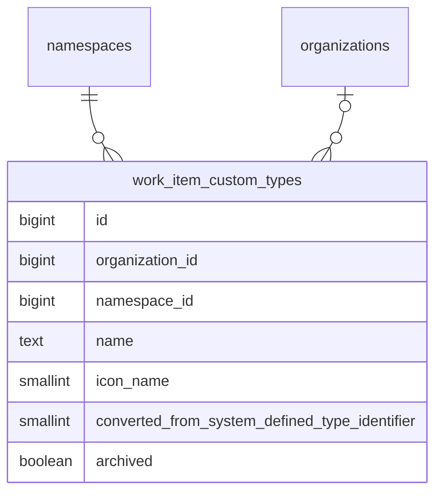

<!-- Design Documents often contain forward-looking statements -->
<!-- vale gitlab.FutureTense = NO -->

<!-- This renders the design document header on the detail page, so don't remove it-->



## Summary

このドキュメントは、GitLab のワークアイテムに対して [設定可能なワークアイテムタイプ](https://gitlab.com/groups/gitlab-org/-/epics/9365) を実装するための私たちのアプローチを概説します。

これにより、Premium および Ultimate のお客様は、システム定義のワークアイテムタイプをカスタマイズし、自分たちのプランニングワークフローに合わせて新しいワークアイテムタイプを作成できます。

トップダウンの制御を求めるお客様の要件と、自律的なチームのバランスを取るため、ユーザーがワークアイテムタイプおよびその階層制約をカスタマイズできるのは、可能な限り最上位のレベルでのみとしています。また、組織が許可している場合は、子孫の名前空間やプロジェクトが、使いたくないタイプを無効化することで、タイプをさらにカスタマイズできます。

タイプごとのウィジェットのカスタマイズは、フォローアップのイテレーションで予定しています。初回リリースでは、カスタムタイプはシステム定義の `issue` タイプと同じウィジェットセットを使用します。

## Glossary

このドキュメント全体で使用される用語のリファレンスです。初回読了時は [ワークアイテムタイプのカスタマイズ](#customizing-work-item-types) まで読み飛ばしてください。各用語は、各セクションでの初出時にここへリンクされています。

### System-defined type

GitLab に同梱される組み込みのワークアイテムタイプ（`issue`、`incident`、`task`、`epic`、`ticket` など）。1〜9 の範囲の ID を持つ [`ActiveRecord::FixedItemsModel`](https://docs.gitlab.com/development/fixed_items_model/) オブジェクトとしてインメモリに格納され、すべての名前空間で共有されます。システム定義タイプは削除できませんが、カスタマイズはできます。converted type を参照してください。

### Custom type

`work_item_custom_types` に格納される、ユーザーが作成したワークアイテムタイプ。カスタムタイプは、完全に新しいもの（例: 「Bug Report」「Feature Request」）であることも、システム定義タイプをカスタマイズして作成されることもあります。カスタムタイプの ID は、システム定義 ID と重複しないように 1001 から始まります。

### Converted type

システム定義タイプをカスタマイズして作成されたカスタムタイプ。たとえば「Issue」を「Feature」にリネームすると、converted type が作成されます。`converted_from_system_defined_type_identifier` カラムには、元のシステム定義タイプの識別子が格納されます。Converted type は、ソースタイプの特殊な機能マッピング（Service Desk、incident management）を継承し、元のタイプの Global ID 形式を保持します。これらは、カスタマイズと後方互換性をつなぐアーキテクチャ上の架け橋です。

### Delegation source

カスタムタイプが動作（ウィジェット、階層制約、ベースタイプ述語、設定フラグ）を継承する元となるシステム定義タイプ。Converted type の場合、これは `converted_from_system_defined_type_identifier` で識別されるシステム定義タイプです。新しいカスタムタイプの場合、デフォルトでは `issue` になります。カスタムタイプごとのウィジェットおよび階層のカスタマイズは、フォローアップのイテレーションで予定されています。それまでは、delegation がデフォルトを提供します。

### Provider

`WorkItems::TypesFramework::Provider` クラス。指定された名前空間に対するタイプの存在と利用可能性に関する唯一の権限です。ワークアイテムタイプを解決する必要があるすべてのコードは Provider を経由し、Provider はシステム定義タイプとカスタムタイプを、リクエストごとのインデックス付きキャッシュにマージします。

### NamespacedType

Provider のキャッシュ内でタイプをラップして名前空間を意識させる、軽量な `SimpleDelegator` のサブクラス。共有された `FixedItemsModel` のシングルトンをミューテートすることなく、名前空間ごとの状態（`enabled`、`is_a_group`、`tasks_on_boards`）を保持します。アイデンティティメソッドは保持されるため、ラッパーは等価性チェックに対して透過的なままです。

### SIWAR

Sparse Inheritance with Ancestor Resolution（祖先解決を伴うスパース継承）。名前空間階層に沿って、「最も近い祖先が優先される」セマンティクスで名前空間ごとの設定（特に可視性）を解決するために使用されるパターン。継承されたデフォルトから逸脱する名前空間のみが行を必要とするため、スパースです。

## Customizing work item types

私たちは、可能な限り最上位のレベルでワークアイテムタイプの設定を許可します。これにより、お客様は自分が所有するすべてのグループとプロジェクトに対してタイプを設定できます。これは、SaaS インスタンスの場合はルート名前空間レベル、self-managed インスタンスの場合は [組織レベル](https://docs.gitlab.com/user/organization/) になります。

[システム定義タイプ](#system-defined-type) は `ActiveRecord::FixedItemsModel` オブジェクトとしてインメモリに格納され、すべてのグループとプロジェクトで共有されます。カスタマイズは PostgreSQL データベースに格納され、`organization_id` または `namespace_id` でシャーディングされます。



`work_item_custom_types` テーブルは、システム定義タイプの ID（1〜9）との衝突を避けるため、1001 から始まる ID シーケンスを使用します。チェック制約により `id >= 1001` が強制されます。`organization_id` カラムと `namespace_id` カラムは相互排他的です（ちょうど一方だけが非 null でなければなりません）。親の名前空間または組織あたり、カスタムタイプは 40 個までという制限があります。

### Scope of MVC1 customization

このフレームワークは、任意の [システム定義タイプ](#system-defined-type) をリネームしたりアイコンを変更したりできるように設計されていますが、MVC1 では UI が公開する範囲を意図的に絞り込んでいます。

- **Issue** はリネームおよびアイコンの変更ができます。
- **新しい [カスタムタイプ](#custom-type)** を作成できます。これらは常に Issue を [delegation source](#delegation-source) として使用し、そのウィジェットセットと階層制約を継承します。
- **その他すべてのシステム定義タイプ**（`epic`、`incident`、`task`、`ticket`、`test_case`、`requirement`、`objective`、`key_result`）はロックされています。リネーム、アーカイブ、その他のカスタマイズはできません。
- **ウィジェットのカスタマイズ、階層のカスタマイズ、設定フラグのオーバーライド** は MVC1 のスコープ外であり、[イテレーションエピック](https://gitlab.com/groups/gitlab-org/-/epics/9365) で追跡されています。

その他のシステム定義タイプに対する制限は、フレームワークの制限ではなくフロントエンドの制約です。UI のいくつかの箇所では、リストビュー、詳細ビュー、作成フローにおいて、これらのタイプをいまだにシステム定義の名前で参照しています。これらの画面がタイプ名に依存せずデータ駆動になるよう改修されるまでは、リネームすると UI に不整合が生じます。これらの画面が移行されるにつれて、追加のタイプのカスタマイズをアンロックしていく意図です。

### Customizing a system-defined type

ユーザーが [システム定義タイプ](#system-defined-type) をカスタマイズする（現在は Issue のリネームまたはアイコンの変更。[Scope of MVC1 customization](#scope-of-mvc1-customization) を参照）と、新しい `work_item_custom_types` レコードが作成され、元のシステム定義 ID が `converted_from_system_defined_type_identifier` カラムに格納されます。ワークアイテム自体は変更されません。その `work_item_type_id` は引き続きシステム定義 ID を指し続けます。たとえば、既存のすべての Issue は `work_item_type_id = 1` を保持し、新しく作成されるすべての Issue も `work_item_type_id = 1` で書き込まれます。カスタマイズはデータマイグレーションではなくルックアップを通じて有効になります。すなわち [Provider](#provider) が、システム定義 ID が現れるあらゆる箇所で、それを [converted type](#converted-type) に解決します。[カスタムステータスと同様に](../work_items_custom_status/#converting-system-defined-lifecycles-and-statuses-to-custom-ones)、これは変更が即座かつ低コストで反映されることを意味します。

カスタムレコードの PK ではなくシステム定義 ID を格納することが、アーキテクチャ上の要石です。カスタマイズのたびに既存のすべてのワークアイテムの `work_item_type_id` を書き換えることは、`issues` テーブルの規模では実現不可能であり、またクエリを高速に保つ単一カラムストレージモデルも壊してしまいます。完全な根拠については [ワークアイテムのタイプの格納](#storing-a-work-items-type) を参照してください。

この変換は API のコンシューマーに対して透過的です。Global ID は引き続き `gid://gitlab/WorkItems::Type/<system-defined identifier>` の形式を使用し、GraphQL タイプは変更されず、私たちの API は、カスタマイズされたシステム定義タイプを渡す際にこの形式の Global ID を受け付けます。外部から見える唯一の変更は、タイプの名前とアイコンです。システム定義タイプは一度カスタマイズされると、元の名前にリネームし直されても [converted type](#converted-type) のままです。「un-convert（変換解除）」の操作はありません。

Converted type は、元のシステム定義タイプに対するデコレーターとして機能します。[delegation source](#delegation-source) パターンを介して、ウィジェット、階層制約、設定フラグ、ベースタイプ述語を元のタイプに委譲します。特殊な機能の動作（`ticket` の Service Desk、`incident` の incident management）は、この委譲チェーンを通じて保持されます。アプリケーションが「これは Service Desk を扱うタイプか?」と尋ねると、タイプの `base_type` を要求し、それが delegation source を介してシステム定義タイプに委譲され、`:ticket` を返します。次に、システム定義タイプ上の設定フラグ（`service_desk: true`、`incident_management: true`）が、そのタイプをその機能に指定されたものとして識別します。`converted_from_system_defined_type_identifier` カラムは、この委譲チェーンを正しく解決させる連結であり、機能コードが直接読み取るものではありません。

ワークアイテムのタイプを取得するとき、[Provider](#provider) が変換を適用します。名前空間やプロジェクトで利用可能なタイプを一覧表示するとき、Provider はすべてのシステム定義タイプとカスタムタイプを取得し、その後、マッピングされたカスタムタイプレコードを持つシステム定義タイプを除外します。

### Creating a new work item type

新しい [カスタムタイプ](#custom-type) は、`converted_from_system_defined_type_identifier` の値が null である `work_item_custom_types` レコードで表されます。

すべてのタイプ（[システム定義](#system-defined-type)、[converted](#converted-type)、新しいカスタム）は、同じ Global ID 形式 `gid://gitlab/WorkItems::Type/<id>` を使用します。`SystemDefined::Type#to_global_id` と `Custom::Type#to_global_id` はどちらも、明示的に `model_name: 'WorkItems::Type'` で GID を構築します。互いに素な ID 空間（システム定義は 1〜9、カスタムは 1001 以上）により、衝突を防止します。

初回のイテレーションでは、新しいタイプはシステム定義の `issue` タイプのように振る舞います。プロジェクトレベルでのみ許可され、そのウィジェットと階層制約は `issue` のものと一致します。新しいカスタムタイプのグループレベルでの利用可能性は、フォローアップのイテレーションで予定されています。タイプごとのウィジェットのカスタマイズも、フォローアップのイテレーションで予定されています。

### Archiving a work item type

[カスタムタイプ](#custom-type) は、履歴データを保持するために、削除ではなくアーカイブできます。タイプがアーカイブされると:

- `work_item_custom_types` の `archived` ブール値カラムでマークされます
- タイプ作成フローに表示されなくなります
- そのタイプの既存のワークアイテムは保持され、引き続きアクセス可能です
- タイプはアーカイブ解除して、再び利用可能にできます

これは [カスタムフィールドのアーカイブ](../work_items_custom_fields/#archiving-custom-fields) と同じパターンに従います。

#### Type name uniqueness

混乱を防ぎ、明確なユーザーエクスペリエンスを保証するため、タイプ名は、名前空間または組織内の [カスタム](#custom-type) タイプおよび変換されていない [システム定義タイプ](#system-defined-type) の両方にわたって一意でなければなりません。これは次を意味します:

- カスタムタイプは、カスタマイズされていないシステム定義タイプと同じ名前を持つことはできません
- カスタムタイプは、別のカスタムタイプと同じ名前を持つことはできません
- システム定義タイプがカスタマイズされた場合（例: 「Task」から「Pizza」へのリネーム）、元のシステム定義タイプがその名前で利用できなくなるため、「Task」という名前で新しいカスタムタイプを作成できます
- ユーザーが [converted type](#converted-type) を元の名前にリネームし直した場合、その間に元の名前が使われていなければ、そのカスタムタイプ名は再び使用可能になります。例: 「Pizza」を「Task」にリネームし直すと、「Pizza」がタイプの名前として使用可能になります

### Storing a work item's type

ワークアイテムにタイプを格納するために、私たちは [単一カラムのアプローチ](https://gitlab.com/gitlab-org/gitlab/-/issues/580065) を使用します。既存の `issues.work_item_type_id` カラムが、すべてのタイプについてタイプ ID を格納します:

- **[システム定義タイプ](#system-defined-type):** システム定義 ID（1〜9）が直接格納されます。
- **[Converted type](#converted-type):** `converted_from_system_defined_type_identifier` の値（元のシステム定義 ID）が格納されます。これは、既存のワークアイテムがデータマイグレーションなしでカスタマイズを自動的に取り込むことを可能にするキーです。
- **新しい [カスタムタイプ](#custom-type):** カスタムタイプ自身の ID（1001 以上）が格納されます。

これは `HasType#persistable_type_id` メソッドによって処理され、タイプの性質に基づいて書き込むべき正しい ID を決定します。

この単一カラムは、2 つの意味を同時に担います。すなわち、1〜9 の範囲の値はシステム定義タイプまたは converted type を識別し、1001 以上の範囲の値は新しいカスタムタイプを識別します。互いに素な ID 範囲により、判別用のカラムなしでこれが曖昧さなく成立します。[Provider](#provider) は、格納された ID を名前空間に対する正しいタイプオブジェクトに変換する解決レイヤーです。

単一カラムのアプローチは、[トレードオフを調査](https://gitlab.com/gitlab-org/gitlab/-/issues/580065) した後、代替案（相互排他制約を伴う二重カラム、カスタムタイプ用の負の ID、三カラムのアプローチ）よりも選択されました。決め手となった要因:

- **カスタマイズ時に `issues` の書き換えが不要。** Converted type は格納された ID をシステム定義 ID として保持するため、タイプをカスタマイズしてもワークアイテムの行には一切触れません。`issues` テーブルの規模では、これは即座の操作と不可能な操作との違いになります。
- **インデックス密度とクエリ速度。** 単一の整数カラムにより、`work_item_type_id` 上の既存のインデックスを完全に使用可能なまま保てます。「このプロジェクト内のすべての ticket」のようなクエリは、名前空間ごとのカスタムレコードへ展開するのではなく、単一の整数マッチのままです。
- **トラフィックの多い `issues` テーブルへのスキーマ変更が不要。** `issues` にカラムを追加することは、パフォーマンスおよび運用上の理由から積極的に避けられており、二重カラム設計ではバックフィルと新しいインデックスも必要になります。単一カラムのアプローチはその両方を回避します。
- **Cells との互換性。** システム定義タイプは、バッキングテーブルを持たない `FixedItemsModel` オブジェクトとしてインメモリに存在します。参照すべき行が存在しないため、`issues.work_item_type_id` からタイプテーブルへの外部キーは、システム定義 ID については存在し得ません。単一カラムのアプローチは、これに抗うのではなく受け入れています。

単一カラムの欠点は、`work_item_type_id` に外部キー制約がないことです。2 つの理由から、これは許容できます:

- **システム定義 ID にはテーブルがない。** 設計にかかわらず、1〜9 の範囲に標準的な FK は不可能です。
- **カスタム ID は `work_item_custom_types` に存在する。** 1001 以上の範囲のみを対象とする部分的な FK は可能ですが、整合性の保証が値空間の半分しかカバーしないため、大したメリットなしに非対称性を追加することになります。

カスタムタイプ ID の参照整合性は、代わりにデータベーストリガー（[!223997](https://gitlab.com/gitlab-org/gitlab/-/merge_requests/223997)）によって強制されます。これは、トラフィックの多い `issues` テーブルに制約の仕組みを設けることなく、外部キーの関連部分を模倣します:

- `work_item_custom_types` 上のトリガーは、`issues` の行からまだ参照されている行の削除をブロックします。カスケードはなく、削除はそのまま失敗します。実際には、これはサポートされるライフサイクル操作である [アーカイブ](#archiving-a-work-item-type) と組み合わされます。直接の削除は、使用されていないタイプに限定されます。
- `issues`（および `work_item_type_id` を格納するその他のテーブル）上のトリガーは、挿入時および更新時に値を検証します。存在しないカスタムタイプ ID を持つ行は、書き込み時に拒否されます。

元の FK は、この移行の一環として [削除](https://gitlab.com/gitlab-org/gitlab/-/issues/588587) されました。アプリケーションレイヤーでの解決は、依然として [Provider](#provider) を通じて行われます。これは、任意のタイプ ID に対する唯一の解決パスです。現在の名前空間に存在しないタイプを要求されると、Provider は `nil` を返します。これは「このカスタムタイプは別の名前空間に属する」場合の通常のパスであり、ダングリング参照を示すものではありません。

## Provider pattern

[Provider](#provider) は、指定された名前空間に対するタイプの存在と利用可能性に関する唯一の権限です。ワークアイテムタイプを解決する必要があるすべてのコードは、タイプモデルを直接クエリするのではなく、これを経由します。

### How it works

CE の Provider は、すべてのパブリックメソッドを `resolve_by_id` と `resolve_all` という 2 つのプライベートメソッドに委譲します。これにより、EE レイヤーには 1 組のオーバーライドポイントが与えられます。

EE の Provider はこれら 2 つのメソッドをオーバーライドし、[システム定義](#system-defined-type) タイプと [カスタムタイプ](#custom-type) の両方から構築された、リクエストごとのインデックス付きキャッシュを経由するようにルーティングします。キャッシュ内の各タイプは [`NamespacedType`](#namespacedtype) デリゲーターでラップされ、`FixedItemsModel` のシングルトン（リクエストをまたいで安定した `object_id` を持つ共有 Ruby オブジェクト）をミューテートすることなく `enabled` 属性を保持します。

```ruby
provider = WorkItems::TypesFramework::Provider.new(namespace)
provider.find_by_id(1)         # Returns Issue (or its converted custom type)
provider.find_by_id(1001)      # Returns custom type with ID 1001
provider.all_ordered_by_name   # All available types for the namespace
provider.find_by_base_type(:incident)  # Returns the type designated for incidents
```

### Cache structure

インデックス付きキャッシュは、タイプ ID をキーとするハッシュで、`SafeRequestStore`（リクエストごと、スレッドごと）に格納されます。システム定義タイプがカスタムタイプに変換されている場合、converted type がキャッシュ内でシステム定義タイプを置き換え、システム定義 ID と自身の AR 主キーの両方でインデックス付けされます。この二重インデックス付けにより、ラウンドトリップの安全性が保証されます。すなわち、タイプを解決し、`.id` を読み取り、それを `find_by_id` に渡し戻すコードは、同じオブジェクトを取得します。

### NamespacedType delegator

[`NamespacedType`](#namespacedtype) は、タイプをラップして名前空間を意識させます。それ自身の動作を追加するのではなく、特定の名前空間のコンテキストでのみ意味をなす状態でラップされたタイプを強化します。アイデンティティメソッド（`class`、`is_a?`、`instance_of?`、`kind_of?`）は、ラップされたタイプのクラスとして報告するようにオーバーライドされるため、ラッパーは `FixedItemsModel` の等価性チェックに対して透過的なままです。

ラッパーが保持する名前空間固有の状態は、コードベースの残りの部分が「このタイプはこの名前空間でどのように見えるか?」に答えるために必要なものすべてをカバーします:

- `enabled` — このタイプが、この特定の名前空間で使用するために有効になっているかどうか
- `is_a_group` — 現在の名前空間がグループかどうか（グループ専用タイプなど、タイプレベルの動作に影響します）
- `tasks_on_boards` — その名前空間で tasks-on-boards 機能がアクティブかどうか
- `enabled_by_default_for_new_namespaces?` — `SafeRequestStore` に裏付けられた遅延述語で、タイプ管理 UI でのみ使用されます。Provider のホットパスを低コストに保つため、キャッシュ構築時ではなくオンデマンドで解決されます

利用可能性と有効化の区別が、重要なメンタルモデルです:

- `available` = タイプが名前空間階層に存在する（キャッシュ内にある）
- `enabled` = タイプが、この特定の名前空間で使用するために有効になっている

タイプは、利用可能だが無効化されている、という状態になり得ます。たとえば、`Task` は階層には存在するが、特定のプロジェクトでは無効化されている、ということがあります。無効化されたタイプも引き続き `find_by_id` によって返されます（既存のアイテムは正しくレンダリングされます）が、作成フローはそれらを拒否します。

初回リリースでは、`enabled` はすべてのタイプでデフォルト `true` です。[Visibility controls](#visibility-controls) が、実際の永続化からこれを設定します。

### nil namespace handling

Provider は、`nil` 名前空間で構築されることが頻繁にあります（インポート、メトリクス、Issue 上のスコープ）。EE の `feature_available?` メソッドは、名前空間が `nil` のときに `false` を返し、これにより Provider はシステム定義タイプのみを返す CE の実装にフォールスルーします。組織の名前空間も同様に可視性の解決をショートサーキットします。可視性マップは組織の名前空間に対して `{}` を返すため、すべてのタイプはデフォルトで `enabled: true` になります。

## Delegation source

[カスタムタイプ](#custom-type) は、その動作を [delegation source](#delegation-source)（ウィジェット、階層制約、設定フラグ、ベースタイプ述語を決定する [システム定義タイプ](#system-defined-type)）に委譲します:

- **[Converted type](#converted-type):** delegation source は、`converted_from_system_defined_type_identifier` で識別される元のシステム定義タイプです。
- **新しいカスタムタイプ:** delegation source はデフォルトで `issue` システム定義タイプになります。

これは次を意味します:

- `custom_type.widgets` は、その delegation source のウィジェットリストを返します
- `custom_type.issue?` は、新しいカスタムタイプに対して `true` を返します（Issue に委譲します）
- `custom_type.incident?` は、Incident から変換されたタイプに対して `true` を返します
- 階層制約は、delegation source の制約と一致します

カスタムタイプごとのウィジェットおよび階層のカスタマイズは、フォローアップのイテレーションで予定されています。delegation source パターンが基盤を提供します。すなわち、カスタマイズが実装されると、ウィジェットと階層のオーバーライドが、委譲されたデフォルトの上に重ねられます。

## Visibility controls

タイプの可視性は、[SIWAR](#siwar) パターンを使用して名前空間ごとに制御されます。これを 3 つのテーブルがサポートします:

- `work_item_type_visibilities` — 名前空間ごと、タイプごとの明示的な可視性オーバーライド。スパース: デフォルトから逸脱する名前空間のみがレコードを必要とします。
- `work_item_type_visibility_defaults` — 新しい子の名前空間が作成されたときに適用されるデフォルト。
- `work_item_settings` — 組織またはルート名前空間ごとの機能設定。可視性管理を有効にするユーザー制御のトグルである `customizable_type_visibility` ブール値を含みます。

### Enabling visibility management

可視性管理はオプトインです。デフォルトでは `customizable_type_visibility` は `false` であり、これはすべてのタイプがどこでも有効であることを意味します。[Provider](#provider) は可視性の解決を完全にショートサーキットし、可視性テーブルに存在し得るどの行にもかかわらず、すべてのタイプに対して `enabled: true` を返します。可視性制御を使用するには、管理者がまず `workItemSettingsUpdate` ミューテーションを介して、組織またはルート名前空間で `customizable_type_visibility` 設定を有効にする必要があります。その後にのみ、可視性テーブルが有効になります。

この 2 段階のモデルにより、お客様はタイプレベルのトグルが既存の名前空間に密かに影響を及ぼすのではなく、意図的に可視性制御を採用できます。

### Resolution semantics

解決クエリは、「最も近い祖先が優先される」セマンティクスで PostgreSQL の `traversal_ids` を使用します。すなわち、名前空間階層内で最も具体的なオーバーライドが優先されます。`propagate: true` の行は、より近い祖先がオーバーライドするまで、すべての子孫に適用されます。Provider は、キャッシュ構築時にこのクエリを実行し、その結果から [`NamespacedType.enabled`](#namespacedtype) を設定します。

### Visibility actions

3 つの独立した可視性アクションが利用可能です:

| Action | Effect | Storage |
|---|---|---|
| この名前空間のみを制御 | この名前空間に対するタイプの可視性を切り替えます | `work_item_type_visibilities` 内の単一の行 |
| 既存のすべての子に伝播 | すべての子孫の名前空間に対してオーバーライドを書き込みます（競合する子孫の行をクリアします） | `propagate: true` の単一の行 |
| 新しい子のデフォルトを設定 | 将来の子の名前空間のデフォルトを設定します | `work_item_type_visibility_defaults` 内の単一の行 |

`workItemAvailabilityToggle` ミューテーションは、指定された名前空間に対して特定のタイプを有効または無効にし、その scope 引数を通じてこれらのアクションを公開します。

### Default visibility for new namespaces

各タイプには、新しい子の名前空間が作成されたときに適用されるデフォルトの可視性があります。デフォルトは、`workItemTypeCreate` および `workItemTypeUpdate` ミューテーションの `enabledByDefaultForNewNamespaces` 入力を介して、タイプの作成時または更新時に設定され、組織またはルート名前空間にスコープされて `work_item_type_visibility_defaults` に格納されます。

新しいグループまたはプロジェクトが作成されると、シーディングサービスが組織/ルートのデフォルトを読み取り、それぞれを、現在 [SIWAR](#siwar) が新しい名前空間に対して解決する内容と比較します。可視性の行は、両者が一致しない箇所にのみ書き込まれます。伝播する祖先がすでに望ましい状態を生成している場合、行は不要です。これにより可視性テーブルがスパースに保たれ、冗長な書き込みを回避します。

初回リリースでは、デフォルトを組織またはルート名前空間のみにスコープします。任意の名前空間レベルでデフォルトを設定する（サブグループが自身の将来の子のデフォルトを定義できるようにする）ことは、`workItemAvailabilityToggle` 上の `NEW_CHILDREN` スコープを介して、フォローアップのイテレーションで予定されています。

### Import and export interaction

インポート（CSV、Direct Transfer、ファイルベース）は、`validate_work_item_type_id` 上の `importing?` 例外を介して、モデルレベルのタイプ検証を意図的にバイパスします。この例外がなければ、元のタイプがターゲットの名前空間で無効化されているレコード、あるいは名前でタイプが一致するがそこでは無効化されているレコードは、保存に失敗してドロップされてしまいます。それはインポートの契約に反します。すなわち、インポートはベストエフォートでレコードを取り込むべきであり、密かにドロップすべきではありません。

インポートパスは、可視性を意識したフォールバックチェーンを使用します。すなわち、名前で一致 → ターゲットで一致かつ有効 → デフォルトの issue タイプ、です。モデル検証は、同期的なユーザー起点の書き込み（UI、GraphQL、REST、Service Desk、クイックアクション）に対する強制ポイントのままです。インポートは、設計上の明示的な例外です。

## Creating work items of custom types

任意のタイプ（[システム定義](#system-defined-type)、[converted](#converted-type)、新しい [カスタム](#custom-type)）のワークアイテムの作成は、同じ作成パスを経由します。[Provider](#provider) が解決ポイントです。すなわち、Provider はタイプが存在し、その名前空間で利用可能かどうかを判定し、作成フローの残りの部分は解決されたタイプを一律に扱います。

概念モデルには、2 つの異なる認可レイヤーがあります:

- **タイプの利用可能性** — このタイプは存在し、この名前空間で使用可能か? これは Provider の仕事であり、フィーチャーフラグによるゲーティング、ライセンスによるゲーティング、名前空間の可視性をカバーします。タイプが利用できない場合、作成ロジックが実行される前にリクエストは拒否されます。
- **作成権限** — ユーザーはこの名前空間でワークアイテムを作成する権限を持っているか? これは標準の `:create_work_item` ポリシーチェックであり、タイプとは独立しています。

歴史的にベースタイプ述語をキーとしていた権限チェック（たとえば「このユーザーは incident を作成できるか?」）は、依然として意味をなすシステム定義タイプおよび converted type に対して引き続き適用されます。新しいカスタムタイプは独自のベースタイプ権限を持ちません。これらは Issue に委譲し、新しいカスタムタイプのワークアイテムの作成は、標準の「ワークアイテム作成」権限によってゲートされます。

## Permissions

| Permission | Scope | Role (SaaS) | Role (Self-Managed) | Purpose |
|---|---|---|---|---|
| `create_work_item_type` | Root group, organization | Maintainer+ | Admin, or organization Owner | 新しいカスタムタイプを作成する |
| `update_work_item_type` | Root group, organization | Maintainer+ | Admin, or organization Owner | タイプを更新または変換する |
| `update_work_item_type_visibility` | Root group, subgroup, project | Maintainer+ | Maintainer+ | 名前空間に対するタイプの可視性を切り替える |
| `configure_work_item_type` | Subgroup, project | Maintainer+ | Maintainer+ | サブグループおよびプロジェクトレベルでワークアイテムタイプ設定 UI にアクセスする。ウィジェットのカスタマイズや階層のカスタマイズなど、将来のタイプごとの設定（現在は delegation source から継承されています）のエントリーポイントとして予約されています。 |

`WorkItems::TypesFramework::Custom::TypePolicy` は、認可を親の名前空間または組織に委譲し、ライセンスされた機能をチェックします。

## Licensing and downgrades

設定可能なワークアイテムタイプは、Premium および Ultimate のお客様向けにライセンスされた機能（`configurable_work_item_types`）として利用可能です。

ライセンスのダウングレード時:

- すべてのカスタムタイプと設定は引き続き読み取り可能です
- ミューテーション（タイプの作成、更新、変換）はブロックされます
- データの破棄やタイプマッピングはありません
- カスタムタイプの既存のワークアイテムは引き続き機能します
- 再アップグレードすると、データマイグレーションなしで完全な機能が復元されます

これは [フレームワーク全体のライセンス原則](../work_items_framework_vision/#licensing-and-downgrade-strategy) に従います。すなわち、ダウングレード時に既存の設定とデータを損なわないまま保ちつつ、ミューテーションを禁止します。

## Frontend architecture

フロントエンドの実装には次が含まれます:

- ワークアイテムタイプを管理するための、ルートグループ、サブグループ、プロジェクト、管理者の各レベルの **設定ページ**
- 作成、編集、アーカイブのアクション、および制限を示すアクティブタイプカウンターを備えた **タイプリストビュー**
- 名前空間の管理者がどのタイプを利用可能にするかを制御できる、サブグループおよびプロジェクト向けの **有効化/無効化トグルビュー**
- 新しいタイプを定義したり、既存のタイプをカスタマイズしたりするための **作成/編集フォーム**

フロントエンドは、フレームワークビジョンで説明されている [設定プロバイダーパターン](../work_items_framework_vision/#1-configuration-over-type-checks) を使用し、名前空間ごとにタイプ設定を取得して Apollo にキャッシュします。API レスポンスが、どのタイプが利用可能で、どのアクションが可能かを駆動します。タイプの利用可能性についてハードコードされた前提はありません。

## Configurations and type checks

アプリケーション全体でハードコードされたタイプチェックを削減しつつ、タイプの動作についての明確さを維持するため、私たちはタイプ設定にアクセスするための集中インターフェイスを備えた、設定ベースのアプローチを使用します。

設定は、タイプがどのように振る舞い、レンダリングされるかを制御するブール値フラグ（後のイテレーションでは値ベースの属性）です。複数のタイプが同じ設定を共有できます。

### Configuration interface

**Backend:**

```ruby
# Checking configurations
type.configured_for?(:use_legacy_view)  # => true/false
type.configured_for?(:group_level)      # => true/false
type.configured_for?(:available_in_create_flow)  # => true/false

# Future: value-based configurations
type.configuration(:required_widgets)  # => [:title, :description]
```

**Frontend:** 設定は GraphQL を介して公開され、フロントエンドクライアントに渡されます。フロントエンドはタイプチェックを実行すべきではなく、代わりに設定フラグをクエリして動作を決定すべきです。

### Special type handling

Service Desk と Incident Management の機能は、特定のワークアイテムタイプ（`ticket` と `incident`）に結び付けられています。私たちはこれらを次のように扱います:

1. 簡易チェック用の設定フラグ:

   ```ruby
   type.configured_for?(:service_desk)         # Is this the service desk type?
   type.configured_for?(:incident_management)  # Is this the incident type?
   ```

2. ルックアップ用のタイププロバイダー

   ```ruby
   # Finding the designated type for a feature
   # (concrete class name might be subject to change).
   WorkItems::TypesFramework::Provider.new(namespace).service_desk_type
   WorkItems::TypesFramework::Provider.new(namespace).incident_type
   ```

### Required widgets

`ticket` や `incident` のようなタイプには、関連する機能（Service Desk、Incident Management）に必要な必須ウィジェットがあります。これらの必須ウィジェットはシステム定義タイプ定義の一部として定義され、`converted_from_system_defined_type_identifier` を介して、変換されたカスタムタイプに継承されます。

## Implementation Details

実装では、タイプ関連の機能を整理し、関心の明確な分離を提供するために、`WorkItems::TypesFramework` 名前空間を使用します。これは、ステータス関連のすべての機能をグループ化した `WorkItems::Statuses` 名前空間で確立したパターンを継続するものです。詳細には、これは次を意味します:

1. `FixedItemsModel` を使用するシステム定義クラスは、`WorkItems::TypesFramework::SystemDefined` 名前空間を使用します。
1. カスタムタイプ関連の概念のためのモデルおよびクラスは、`WorkItems::TypesFramework::Custom` 名前空間を使用します。

### Frontend metadata provider pattern

フロントエンドは、メタデータプロバイダーの Vue コンポーネントに、ワークアイテムタイプ設定を取得する別のクエリを追加します。このパターンにより、ユーザーが異なる名前空間のアイテム間を移動する際に、タイプ設定が常に利用可能で最新の状態に保たれます。

#### How it works

設定は名前空間のフルパスごとに 1 回取得され、Apollo にキャッシュされます。これは次を意味します:

1. SPA が最初にマウントされると、現在の名前空間パス（グループまたはプロジェクト）のタイプ設定を取得します
2. ユーザーが同じ名前空間内のアイテムへ移動すると、キャッシュされた設定が再利用されます
3. 異なる名前空間のアイテムへ移動すると、フルパスが更新され、その名前空間パスに対して新しい設定の取得が強制されます
4. 各名前空間パスは独自のキャッシュエントリを持つため、SPA は複数の名前空間の設定を同時に維持できます
5. コンポーネントが設定にアクセスしたいとき、現在のワークアイテムタイプをユーティリティメソッドに渡し、適切な名前空間に対する適切なタイプ設定を返します。

#### Use cases

このパターンは、いくつかのナビゲーションシナリオを処理します:

- **同一名前空間ナビゲーション**: 同じプロジェクト/グループ内のアイテムをクリックすると、キャッシュされた設定が再利用されます
- **クロスプロジェクトナビゲーション**: 異なるプロジェクトのアイテムへ移動すると、そのプロジェクトのパスに対して新しい設定が取得されます
- **クロスグループナビゲーション**: 異なるグループまたはルート名前空間のアイテム間を移動すると、適切な設定が取得されてキャッシュされます
- **コンテキストごとのビュー変更**: エピック（グループコンテキスト）を表示してから Issue（プロジェクトコンテキスト）を選択すると、設定が新しいコンテキストを反映するように更新されます

## Work Item Settings sections configurations

これはフロントエンド固有の設定であり、GitLab 独自のフロントエンド実装と UI レイアウトの決定に非常に固有なものであるため、API で公開する意味がありません。

### 1. Settings configuration factory

`ee/app/assets/javascripts/work_items/constants.js` 内の `getSettingsConfig(context)` ファクトリ関数は、呼び出し元のコンテキストに合わせた設定オブジェクトを生成します。これは、`'root'`、`'subgroup'`、`'project'`、`'admin'`（デフォルトは `'root'`）の 4 つのコンテキスト文字列のうちの 1 つを受け付けます。

この関数は、設定を 2 つのレイヤーで構築します:

1. **ベースのデフォルト** — 関数内の `DEFAULT_SETTINGS_CONFIG` オブジェクトが、ブール値の可視性フラグ、権限、レイアウトの完全なセットを定義します:

   | Property | Type | Purpose |
   |---|---|---|
   | `showWorkItemTypesSettings` | `boolean` | 設定可能なタイプのセクションを表示します。 |
   | `showEnabledWorkItemTypesSettings` | `boolean` | 有効化されたタイプのセクションを表示します。 |
   | `showCustomFieldsSettings` | `boolean` | カスタムフィールドのセクションを表示します。 |
   | `showCustomStatusSettings` | `boolean` | カスタムステータスのセクションを表示します。 |
   | `workItemTypeSettingsPermissions` | `string[]` | 設定可能なタイプに適用される権限（例: `['edit', 'create', 'archive']`）。 |

2. **コンテキスト固有のテキスト** — 2 つのルックアップマップ（`configurableTypesSubtexts` と `enabledTypesSubtexts`）が、コンテキストごとに説明文字列をキー付けします。ファクトリは、一致する文字列を `configurableTypesSubtext` および `enabledTypesSubtext` として返却オブジェクトにマージします。

コンシューマーはファクトリを呼び出し、その後に必要なフラグをオーバーライドします:

```js
// Admin — disable sections not yet supported
const config = {
  ...getSettingsConfig('admin'),
  showEnabledWorkItemTypesSettings: false,
  showCustomFieldsSettings: false,
  showCustomStatusSettings: false,
};

// Subgroup — only the enabled types section
const config = {
  ...getSettingsConfig('subgroup'),
  showWorkItemTypesSettings: false,
  showEnabledWorkItemTypesSettings: true,
  showCustomFieldsSettings: false,
  showCustomStatusSettings: false,
};
```

#### Scalability pattern for new config options

新しい設定セクションまたは設定プロパティを追加するには:

1. `getSettingsConfig` 内の `DEFAULT_SETTINGS_CONFIG` に、新しいブール値フラグ（例: `showMyNewSettings`）を追加します。
2. 新しいセクションがコンテキスト固有のテキストを必要とする場合、コンテキスト文字列でキー付けされた新しいルックアップマップ（例: `myNewSettingsSubtexts`）を追加し、その結果を返却オブジェクトにマージします。
3. すでに `getSettingsConfig(context)` をスプレッドしている各コンシューマーは、新しいデフォルトを自動的に継承します。コンシューマーは、自身のコンテキストがデフォルト以外の値を必要とする場合にのみ、フラグをオーバーライドする必要があります。
4. `WorkItemSettingsHome` で、新しいフラグを使用した `v-if` ガードを追加し、対応するコンポーネントを条件付きでレンダリングします。

このアプローチにより、ファクトリをデフォルトの唯一の情報源として保ちつつ、各エントリーポイントが個々のセクションをオプトインまたはオプトアウトできるようになります。新しいコンテキスト（例: `'organization'`）には、各ルックアップマップに新しいエントリを追加するだけで済みます。

### 2. Enabled work item types section

`EnabledConfigurableTypesSettings` コンポーネント（`ee/groups/settings/work_items/configurable_types/enabled_configurable_types_settings.vue`）は `SettingsBlock` 内にレンダリングされ、指定された名前空間で現在アクティブなワークアイテムタイプを表示します。

- 可視性は、設定内の `showEnabledWorkItemTypesSettings` によって制御されます。
- 説明テキストは `config.enabledTypesSubtext` に由来するため、現在のコンテキストを自動的に反映します。
- コンポーネントは、独自の Apollo クエリを所有する `WorkItemTypesListEnabledDisabledView` にレンダリングを委譲します。

---

## Context-Specific Behavior Matrix

| Context | Configurable Types Section | Enabled Types Section | Custom Fields | Custom Status |
|---|---|---|---|---|
| **Admin** | 表示 | 非表示 | 非表示 | 非表示 |
| **Root Group** | 表示 | 表示 | 表示 | 表示 |
| **Subgroup** | 非表示 | 表示 | 非表示 | 非表示 |
| **Project** | 非表示 | 表示 | 非表示 | 非表示 |

---

## Component Hierarchy

```text
WorkItemSettingsHome
├── ConfigurableTypesSettings          (if showWorkItemTypesSettings)
│   └── WorkItemTypesList              (always renders list/crud view)
├── EnabledConfigurableTypesSettings   (if showEnabledWorkItemTypesSettings)
│   └── WorkItemTypesListEnabledDisabledView  (self-fetching)
├── CustomStatusSettings               (if showCustomStatusSettings)
└── CustomFieldsList                   (if showCustomFieldsSettings)
```

## Iterations

MVC1 は GitLab 19.0 で出荷されました。何が出荷され、将来のイテレーションで何が予定されているかの完全な内訳については、[トップレベルのエピック](https://gitlab.com/groups/gitlab-org/-/epics/9365) とそのサブエピックを参照してください:

1. [ワークアイテムタイプのウィジェットカスタマイズ](https://gitlab.com/groups/gitlab-org/-/epics/20075)
2. [グループ内のカスタマイズ可能なタイプと設定可能な階層](https://gitlab.com/groups/gitlab-org/-/epics/20076)
3. [タイプの拡張設定オプション（ポリシー）](https://gitlab.com/groups/gitlab-org/-/epics/20077)

## License and tier considerations

カスタムワークアイテムタイプは Premium 以上の機能です。ライセンスされた機能の名前は `configurable_work_item_types` です。お客様がカスタムタイプをサポートしないティアにダウングレードすると、私たちは次の戦略を適用します:

### Downgrade behavior

ダウングレード時、私たちは既存のすべての設定とデータを損なわないまま保ちつつ、ミューテーションを禁止します:

- 既存のカスタムタイプとその設定は、読み取りのために引き続きアクセス可能です
- 新しいカスタムタイプの作成はブロックされます
- 既存のカスタムタイプの変更はブロックされます
- 関係と階層は損なわれないまま保たれますが、現在のライセンス能力を超えて変更することはできません
- リネームされたシステム定義タイプはカスタム名を保持し、それ以上変更することはできません

このアプローチは、破壊的なアクションとデータ損失を回避する一方で、ダウングレードされたティアの機能低下を明確に伝えるものであり、ステータスおよびカスタムフィールド機能のダウングレード動作と一致しています。

### Custom type limits

`40` というアクティブなワークアイテムタイプの制限は、Premium ティアにおいて、トップレベルの名前空間または組織ごとに、カスタムおよびシステム定義のワークアイテムタイプ全体にわたって強制されます。

### Future tier differentiation

将来のイテレーションでは、階層の深さの制限など、Premium と Ultimate のティア間に追加の制限を導入する可能性があります。これらは同じ戦略に従います。すなわち、既存の設定と関係を保ちつつ、現在のライセンス能力を超える新規の使用と変更を制限します。

## Work item type states and settings UI

### Work item type states

1. Enabled - 任意のワークアイテムタイプのデフォルト
1. Locked - リネーム、無効化、削除ができないシステムタイプ。
1. Archived - 削除の代替。最適なワークフローはタイプを削除して新しいタイプへ移行することでしたが、それが不可能だったため、この「Archive」タイプを追加しました
   1. フィルターで利用可能にすべきではない（ルートレベルでのみ発生するため、カスケード設定には依存しない）
   1. リネームおよびアイコン編集は許可しない
1. Disabled
   1. 無効化されているプロジェクト/グループのフィルターで利用可能にすべきではない（親から継承している場合は同じ権限を継続する）
   1. 作成を許可すべきではない
   1. リネームおよびアイコン編集は許可する

### Work item type sections

私たちは、ワークアイテム設定ページに別々のセクションを持っています

1. 「Work item types」 - タイプがグローバルに定義、作成、管理される場所です。
2. 「Enabled work item types」 - 純粋にローカルな設定であり、利用可能性を切り替えられます。

コンテキストと要件に応じて、ワークアイテム設定ページの上記両方のセクションについて別々の組み合わせを持ちます。

## Decision registry

1. [SaaS インスタンスではルート名前空間レベルで、self-managed インスタンスでは組織レベルでタイプを設定する](https://gitlab.com/groups/gitlab-org/-/epics/7897#note_2795232631)。

   私たちは GitLab.com 上のすべてのお客様を個別の組織へ移行する準備がまだできていないため、当面はルート名前空間レベルでタイプを設定する必要があります。一方、self-managed インスタンスは常に単一の組織を持つため、組織レベルで設定できます。

   self-managed のお客様は通常、自分たちのインスタンス上で複数のルート名前空間にまたがって作業するため、タイプとワークフローを標準化できるよう、より高いレベルで設定できるようにしたいと考えています。

1. システム定義タイプは、クラスター全体のテーブルを回避し、Cells とシャーディングの作業のブロックを解除するため、[`ActiveRecord::FixedItemsModel` オブジェクトとしてインメモリに](https://gitlab.com/gitlab-org/gitlab/-/issues/519894) 格納されます。
1. Service Desk や incident management のような特殊な機能は、[システム定義タイプに 1:1 でマッピング](https://gitlab.com/groups/gitlab-org/-/epics/7897#note_2857326975) されます。
1. 破壊的変更を避けるため、私たちは [システム定義タイプの既存の Global ID 形式を保持](https://gitlab.com/gitlab-org/gitlab/-/issues/579238) します。システム定義タイプがカスタマイズされた場合でも、同じ形式が保持されます。
1. [タイプの動作には、別個のケイパビリティの概念ではなく、設定ベースのアプローチを使用する](https://gitlab.com/gitlab-com/content-sites/handbook/-/merge_requests/17119#ai-summary-of-the-discussion-in-slack-for-the-record)。

   私たちは「capabilities（排他的なタイプアイデンティティ）」と「configurations（動作フラグ）」の両方を導入することを検討しましたが、統一された設定アプローチを選択しました。排他的な扱いを必要とする特殊なタイプが 2 つしかないため、当面は単一の概念のほうが理解と保守が容易です。

1. [`WorkItems::TypesFramework` 名前空間を使用する](https://gitlab.com/gitlab-org/gitlab/-/merge_requests/212636#note_2948286714)。
1. [ライセンスのダウングレード時、既存の設定とデータを保ちつつ、ミューテーションを禁止する](https://gitlab.com/gitlab-org/gitlab/-/issues/579231)。
1. 私たちは、ワークアイテムタイプ名の複数形化を完全に避けるため、ワークアイテムタイプ名の複数形を保存/格納する方向には進みません。「Issues」「Epics」「Stories」ではなく、タイプ名は単数形のままとし、そのタイプの複数のアイテムを参照するときは、複数性はコンテナレベルで扱います。すなわち「work items of type: [Name]」または「items」とします。
1. Ticket はメール経由、または `/convert_to_ticket user@example.com` クイックアクションを使用してのみ作成できます。
   1. 「Ticket」は作成用の利用可能なタイプのリストから削除されます。
   1. 「Create new ticket」は子アイテムセクションから削除されます。
1. ヘッダーのアクションメニューでは、「New related TYPE_NAME」ではなく「New related item」を使用します。
1. ユーザーは、ticket を他の任意のアイテムタイプに関連付けられます
1. [ワークアイテムタイプ設定を名前空間パスごとに取得し、Apollo にキャッシュする](https://gitlab.com/groups/gitlab-org/-/epics/20061#note_3020401416)。

   このパターンの仕組みとその利点の詳細については、[Frontend metadata provider pattern](#frontend-metadata-provider-pattern) セクションを参照してください。

1. [ワークアイテムタイプ間のすべてのリンク制限を削除する](https://gitlab.com/gitlab-org/gitlab/-/issues/581932#note_3019673313)。

   任意のワークアイテムタイプは、「Blocked by / Blocks」や「Related to」のような関係で、他の任意のタイプにリンクできるべきです。この決定はリンクされたアイテムにのみ適用され、子アイテム（階層）には適用されません。

1. [カスタムワークアイテムタイプを既存のシステム定義タイプに委譲し](https://gitlab.com/gitlab-org/gitlab/-/issues/581932#note_2959381705)、ユーザーが将来のイテレーションでこれらの機能を実際にカスタマイズするまで、カスタムウィジェット定義と階層制約テーブルの作成を延期します。

1. 設定可能なワークアイテムタイプは Premium 以上の機能であるため、すべてのワークアイテムタイプ設定コードは `ee/` に存在すべきです。

   CE ユーザーは、タイプ、ウィジェット、階層をカスタマイズできることは決してありません。トップレベルのワークアイテムタイプ GraphQL クエリと関連する設定コードは、安全に EE コードベースに存在できます。`namespaceWorkItemTypes` クエリはすべてのワークアイテムリスト機能を処理し、CE に適しています。現在 CE にあるがタイプ設定のためにのみ使用される再利用可能なコンポーネントは、EE への移行を検討すべきです。

1. [タイプ名は、カスタムおよび変換されていないシステム定義タイプにわたって一意でなければならない](https://gitlab.com/gitlab-org/gitlab/-/merge_requests/218464#note_3022168638)。

1. [システム定義タイプとカスタムワークアイテムタイプを ID 範囲で分離する](https://gitlab.com/gitlab-org/gitlab/-/merge_requests/223117)。

   システム定義ワークアイテムタイプは 1〜1000 の ID を使用し、カスタムワークアイテムタイプは 1001 以上の ID を使用します。両カテゴリ間の重複を防ぐため、`work_item_custom_types` テーブル用に 1001 から始まる新しいシーケンスを使用します。

1. 利用可能なすべてのワークアイテムタイプは、すべてのレベル、すなわち組織レベル/トップレベルグループ、サブグループレベル、プロジェクトレベルで表示されます

1. Epic はプロジェクトレベルでワークアイテムタイプとして表示され、プロジェクトでは無効化されている旨を説明するツールチップが付きます。これは、Epic が現在グループレベルでのみ利用可能なためです。注: これは将来のイテレーションで変更される可能性があります。

1. 私たちは、組織レベル/トップレベルグループでのみワークアイテムタイプを作成/編集できます。

1. 「Work item types」セクションに加えて、別個の「Enabled work item types」セクションを持ちます。[これはトップレベルグループでも表示されます](https://gitlab.com/gitlab-org/gitlab/-/issues/585643#note_3080703281)

1. サブグループとプロジェクトは、「Enabled work item types」セクションのみを持ちます。

1. アーカイブされたタイプは、組織レベル/トップレベルグループでスプリットボタンビューとして表示されますが、プロジェクトおよびサブグループレベルでは表示されません。

1. [カスタムワークアイテムタイプは `WorkItems::Type` を GID モデルクラスとして使用する](https://gitlab.com/gitlab-org/gitlab/-/merge_requests/224790#note_3125745798)。

   converted およびシステム定義タイプと同様に、新しいカスタムタイプについても、私たちはレガシーの `WorkItems::Type` クラスを使用して Global ID を構築します。これは、システム定義タイプとカスタムタイプの両方が `gid://gitlab/WorkItems::Type/<id>` の形式で Global ID を生成することを意味します。

   - これにより、GraphQL API の表面が統一されたまま保たれます。クライアントは、システム定義タイプとカスタムタイプの GID を区別する必要が決してありません。
   - `Custom::Type` は内部実装の詳細であり、パブリック API の概念ではありません。
   - `WorkItems::TypesFramework::Provider` は、両方のタイプ種別を一律に解決するための意図されたクラスです。今 `WorkItems::Type` を GID モデルとして使用しておくことで、将来のリファクタリングが既存の API 契約を壊さないようにします。

   [`WorkItems::Type` GID を一律に使用することに関する議論](https://gitlab.com/gitlab-org/gitlab/-/merge_requests/223304#note_3092047469) も参照してください。

1. [カスタムタイプ間でのワークアイテムの無制限の変換を許可する](https://gitlab.com/gitlab-org/gitlab/-/work_items/595002#note_3210323887)。

   現在の MVC では、カスタムタイプの任意のワークアイテムを、制限なく他の任意のカスタムタイプに変換できます。すべてのカスタムタイプはシステム定義の `issue` タイプと同じウィジェットセットおよび動作を共有するため、それらの間でワークアイテムを変換しても、データ損失のリスクなくすべてのウィジェットとデータが保持されます。すでに `issue` への変換をサポートしている任意のワークアイテムタイプは、`supportedConversionTypes` においてすべてのカスタムタイプも有効な変換先として列挙すべきです。この決定は、ウィジェットのカスタマイズや階層のカスタマイズによってカスタムタイプ間に違いが生じ得るようになる将来のイテレーションで、再検討される可能性があります。

   [実装の詳細に関する議論](https://gitlab.com/gitlab-org/gitlab/-/merge_requests/227980#note_3201204553) も参照してください。

1. [ワークアイテムダッシュボードは、組織が存在する場合にのみ Type フィルターを表示し、それ以外の場合は Type フィルターを表示しません。](https://gitlab.com/gitlab-org/gitlab/-/merge_requests/233252#note_3290323376)

1. [BuildService は、完全な `NamespacedType#enabled?` 述語を呼び出すのではなく、`enabled && !archived?` をインライン化します](https://gitlab.com/gitlab-org/gitlab/-/merge_requests/235382)。これは、後者の `visible_in_context?` チェックが UI のゲーティングには正しいものの、コンテキストのゲーティングがすでに上流（ポリシーチェック、Provider のフィルタリング、ベータ版のフィーチャーフラグ）で行われている作成、クローン、移動のフローには厳しすぎるためです。

## Resources

1. [このイニシアチブのトップレベルエピック](https://gitlab.com/groups/gitlab-org/-/epics/9365)
1. [GitLab 19.0 リリースノート — Configure work item types](https://docs.gitlab.com/releases/19/gitlab-19-0-released/#configure-work-item-types)
1. [ユーザードキュメント — Configurable work item types](https://docs.gitlab.com/user/work_items/configurable_work_item_types/)
1. [ワークアイテムタイプの作成/編集](https://gitlab.com/gitlab-org/gitlab/-/issues/580932) のデザイン（クローズ済み）
1. [ワークアイテムタイプ詳細ビュー](https://gitlab.com/gitlab-org/gitlab/-/issues/580940) のデザイン
1. [ワークアイテムタイプリストビュー](https://gitlab.com/gitlab-org/gitlab/-/issues/580929) のデザイン（クローズ済み）
1. [設定可能なワークアイテムタイプの POC](https://gitlab.com/gitlab-org/gitlab/-/issues/580260)（クローズ済み）
1. [調査: タイプストレージのアプローチ](https://gitlab.com/gitlab-org/gitlab/-/issues/580065)（クローズ済み）
1. [Work Items Framework Engineering Vision](../work_items_framework_vision/) — アーキテクチャの原則と技術的方向性
1. [Configurable Work Item Statuses](../work_items_custom_status/) — FixedItemsModel パターンとシステム定義エンティティの規約

## Team

全員に最新情報を共有し続けるため、このドキュメントに関連するすべての MR で現在のチームをメンションしてください。全員が変更を承認することは期待していません。

```text
@gweaver @acroitor @nickleonard @gitlab-org/plan-stage/project-management-group/engineers
```
