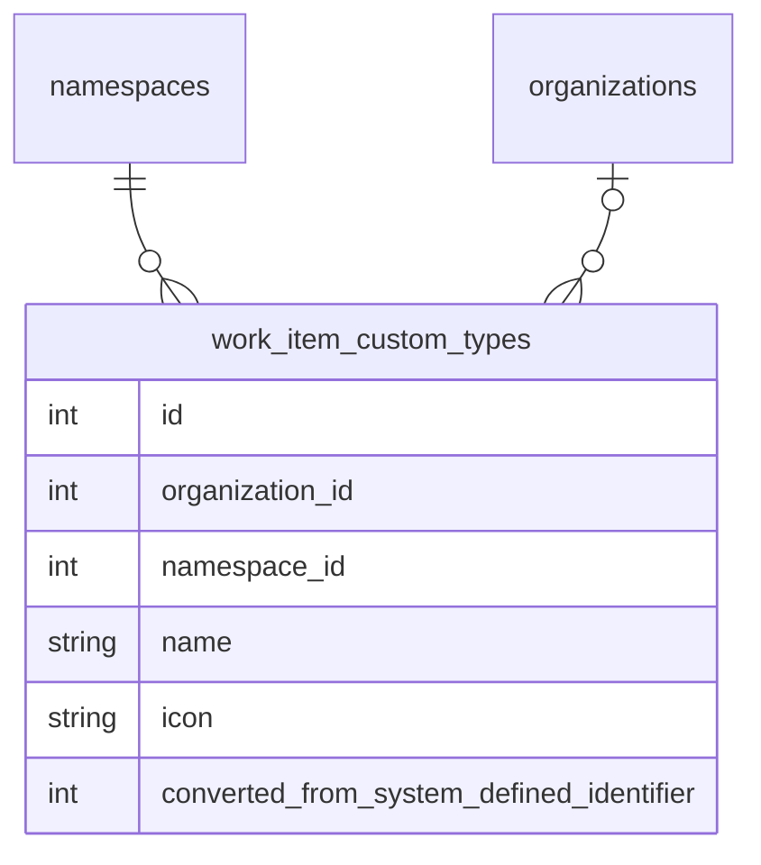

<!-- Design Documents often contain forward-looking statements -->
<!-- vale gitlab.FutureTense = NO -->

<!-- This renders the design document header on the detail page, so don't remove it-->



## サマリー

このドキュメントは、GitLab のワークアイテム向けに [設定可能なワークアイテムタイプ](https://gitlab.com/groups/gitlab-org/-/epics/9365) を実装するための私たちのアプローチを概説しています。

これにより、Premium および Ultimate の顧客は、システム定義のワークアイテムタイプをカスタマイズし、計画ワークフローに合わせて新しいワークアイテムタイプを作成できるようになります。これらのタイプで利用可能なウィジェットとフィールドもカスタマイズできます。

トップダウンの制御と自律的なチームの両方に対する顧客の要件のバランスを取るため、ユーザーは可能な限り最も高いレベルでのみ、ワークアイテムタイプとその階層制限をカスタマイズできるようになります。そして、組織によって許可されている場合、子孫の名前空間やプロジェクトは、使いたくないタイプを無効にしたり、タイプで利用可能なウィジェットとフィールドを変更したりすることで、タイプをさらにカスタマイズできます。

## ワークアイテムタイプのカスタマイズ

私たちは、可能な限り最も高いレベルでワークアイテムタイプの設定を許可します。これにより、顧客は自分が所有するすべてのグループとプロジェクトのタイプを設定できるようになります。これは、SaaS インスタンスのルート名前空間レベル、およびセルフマネージドインスタンスの [組織レベル](https://docs.gitlab.com/user/organization/) になります。

システム定義のタイプはメモリ内に格納され、すべてのグループとプロジェクト間で共有されますが、カスタマイズは PostgreSQL データベースに格納され、`organization_id` と `namespace_id` でシャーディングされます。



### システム定義のタイプのカスタマイズ

ユーザーがシステム定義のタイプをカスタマイズすると、新しい `work_item_custom_types` レコードを作成し、システム定義の ID を `converted_from_system_defined_identifier` 列に格納します。[カスタムステータスと同様](../work_items_custom_status/#converting-system-defined-lifecycles-and-statuses-to-custom-ones) に、これにより、すべての既存のワークアイテムに対してカスタマイズを即座に有効にできます。

この変換はユーザーから抽象化されており、顧客の自動化を破壊しないために、引き続き `gid://gitlab/WorkItems::Type/<system defined identifier>` の形式でグローバル ID を返します。API もまた、カスタマイズされたシステム定義のタイプを渡す場合、この形式のグローバル ID を受け入れます。

ワークアイテムのタイプと階層制限を取得するときは、これらの変換を考慮する必要があります。リストをワークアイテムタイプでフィルタリングするときも同様です。

名前空間またはプロジェクトで利用可能なタイプをリストするとき、これらも考慮する必要があります。すべてのシステム定義タイプとカスタムタイプを取得し、その後、マッピングされたカスタムタイプレコードを持つシステム定義タイプを除外する必要があります。

`converted_from_system_defined_identifier` 列はまた、特定のシステム定義タイプで利用可能な特別機能をマッピングするためにも使用されます。たとえば、Service Desk は `ticket` タイプのワークアイテムを作成します。`ticket` がカスタマイズされた場合、Service Desk はシステム定義の `ticket` 識別子と等しい `converted_from_system_defined_identifier` を持つカスタムタイプに基づいてワークアイテムを作成します。

### 新しいワークアイテムタイプの作成

新しいカスタムワークアイテムタイプは、`converted_from_system_defined_identifier` 値が null の `work_item_custom_types` レコードによって表されます。これらのカスタムタイプのグローバル ID は次の形式です: `gid://gitlab/WorkItems::Custom::Type/<id>`。

最初のイテレーションでは、新しいタイプはシステム定義の `issue` タイプと同様に動作します。これらはプロジェクトレベルでのみ許可され、ウィジェットと階層制限は `issue` タイプと同じになります。

#### タイプ名の一意性

混乱を防ぎ、明確なユーザー体験を確保するため、タイプ名は、名前空間または組織内のカスタムタイプおよび未変換のシステム定義タイプ全体で一意である必要があります。これは次のことを意味します:

- カスタムタイプは、カスタマイズされていないシステム定義タイプと同じ名前を持つことはできません
- カスタムタイプは、別のカスタムタイプと同じ名前を持つことはできません
- システム定義のタイプがカスタマイズされた場合 (たとえば、「Task」から「Pizza」に名前変更)、その元のシステム定義タイプはその名前で利用できなくなるため、「Task」という名前で新しいカスタムタイプを作成できます
- ユーザーが変換されたタイプを元の名前に戻し、その元の名前がその間に取られていなかった場合、そのカスタムタイプ名は再び取得可能になります。たとえば、「Pizza」を「Task」に戻すと、「Pizza」がタイプの名前として再び利用可能になります

### ワークアイテムのタイプを格納する

カスタムタイプでは、ワークアイテムはシステム定義のタイプまたはカスタムタイプを持つことができます。ID の衝突と外部キー制約のため、既存の `issues.work_item_type_id` 列に両方を格納できません。

これは、only one value is not null という制約を持つタイプ情報を格納するために 2 つの列 (`work_item_type_id`、`custom_type_id`) が必要であることを意味します。

## 設定とタイプチェック

アプリケーション全体のハードコードされたタイプチェックを減らしながら、タイプの動作についての明確さを維持するため、タイプ設定にアクセスするための一元化されたインターフェースを持つ設定ベースのアプローチを使用します。

設定は、タイプがどのように動作してレンダリングされるかを制御するブール値フラグ (または後のイテレーションでは値ベースの属性) です。複数のタイプが同じ設定を共有できます。

### 設定インターフェース

**バックエンド:**

```ruby
# Checking configurations
type.configured_for?(:use_legacy_view)  # => true/false
type.configured_for?(:group_level)      # => true/false
type.configured_for?(:available_in_create_flow)  # => true/false

# Future: value-based configurations
type.configuration(:required_widgets)  # => [:title, :description]
```

**フロントエンド:** 設定は GraphQL を介して公開され、フロントエンドクライアントに渡されます。フロントエンドはタイプチェックを実行すべきではなく、代わりに動作を判断するために設定フラグをクエリすべきです。

### 特殊なタイプの処理

Service Desk と Incident Management の機能性は、特定のワークアイテムタイプ (`ticket` と `incident`) に紐付いています。これらを次のように処理します:

1. クイックチェック用の設定フラグ:

   ```ruby
   type.configured_for?(:service_desk)         # Is this the service desk type?
   type.configured_for?(:incident_management)  # Is this the incident type?
   ```

2. ルックアップ用のタイププロバイダー

   ```ruby
   # Finding the designated type for a feature
   # (concrete class name might be subject to change).
   WorkItems::TypesFramework::Provider.new(namespace).service_desk_type
   WorkItems::TypesFramework::Provider.new(namespace).incident_type
   ```

### 必須ウィジェット

`ticket` や `incident` などのタイプには、それぞれに関連する機能 (Service Desk、Incident Management) に必要な必須ウィジェットがあります。これらの必須ウィジェットは、システム定義のタイプ定義の一部として定義され、`converted_from_system_defined_identifier` を介して変換されたカスタムタイプによって継承されます。

## 実装の詳細

実装では、タイプ関連の機能性を整理し、関心の明確な分離を提供するため、`WorkItems::TypesFramework` 名前空間を使用しています。これは、ステータス関連の機能性をすべてグループ化した `WorkItems::Statuses` 名前空間で確立したパターンを継続しています。具体的には次のことを意味します:

1. `FixedItemsModel` を使用するシステム定義のクラスは、`WorkItems::TypesFramework::SystemDefined` 名前空間を使用します。
1. カスタムタイプ関連の概念のモデルとクラスは、`WorkItems::TypesFramework::Custom` 名前空間を使用します。

### フロントエンドメタデータプロバイダーパターン {#frontend-metadata-provider-pattern}

フロントエンドは、メタデータプロバイダー vue コンポーネントに、ワークアイテムタイプ設定を取得する別のクエリを追加します。このパターンにより、ユーザーが異なる名前空間のアイテム間を移動するときも、タイプ設定が常に利用可能で最新であることが保証されます。

#### 仕組み

設定は、名前空間のフルパスごとに 1 回取得され、Apollo にキャッシュされます。これは次のことを意味します:

1. SPA が最初にマウントされるとき、現在の名前空間パス (グループまたはプロジェクト) のタイプ設定を取得します
2. ユーザーが同じ名前空間内のアイテムに移動するとき、キャッシュされた設定が再利用されます
3. 異なる名前空間のアイテムに移動するとき、フルパスが更新され、その名前空間パス用に新しい設定を取得することを強制します
4. 各名前空間パスに独自のキャッシュエントリがあり、SPA が複数の名前空間の設定を同時に維持できるようにします
5. コンポーネントが設定にアクセスしたい場合、現在のワークアイテムタイプをユーティリティメソッドに渡し、適切な名前空間の適切なタイプ設定を返します。

#### ユースケース

このパターンはいくつかのナビゲーションシナリオを処理します:

- **同じ名前空間内のナビゲーション**: 同じプロジェクト/グループ内のアイテムをクリックすると、キャッシュされた設定が再利用されます
- **プロジェクト間のナビゲーション**: 異なるプロジェクトのアイテムに移動するとき、そのプロジェクトのパス用に新しい設定が取得されます
- **グループ間のナビゲーション**: 異なるグループまたはルート名前空間のアイテム間を移動するとき、適切な設定が取得されてキャッシュされます
- **コンテキストビューの変更**: エピック (グループコンテキスト) を表示してから Issue (プロジェクトコンテキスト) を選択するとき、設定は新しいコンテキストを反映するように更新されます

## ワークアイテム設定セクションの設定

これは、GitLab 独自のフロントエンド実装と UI レイアウトの決定に非常に固有であるため、API で公開しても意味がない、フロントエンド固有の設定です。

### 1. 設定構成ファクトリ

`ee/app/assets/javascripts/work_items/constants.js` の `getSettingsConfig(context)` ファクトリ関数は、呼び出し元のコンテキストに合わせた設定オブジェクトを生成します。これは 4 つのコンテキスト文字列のうちの 1 つを受け入れます: `'root'`、`'subgroup'`、`'project'`、または `'admin'` (デフォルトは `'root'`)。

関数は 2 つのレイヤーで設定を構築します:

1. **ベースデフォルト** — 関数内の `DEFAULT_SETTINGS_CONFIG` オブジェクトが、ブール値の可視性フラグ、権限、レイアウトの完全なセットを定義します:

   | プロパティ | 型 | 目的 |
   |---|---|---|
   | `showWorkItemTypesSettings` | `boolean` | 設定可能なタイプセクションを表示。 |
   | `showEnabledWorkItemTypesSettings` | `boolean` | 有効なタイプセクションを表示。 |
   | `showCustomFieldsSettings` | `boolean` | カスタムフィールドセクションを表示。 |
   | `showCustomStatusSettings` | `boolean` | カスタムステータスセクションを表示。 |
   | `workItemTypeSettingsPermissions` | `string[]` | 設定可能なタイプに適用される権限 (たとえば、`['edit', 'create', 'archive']`)。 |

2. **コンテキスト固有のテキスト** — 2 つのルックアップマップ (`configurableTypesSubtexts` と `enabledTypesSubtexts`) が、コンテキストによって説明文字列をキー付けします。ファクトリは、マッチする文字列を `configurableTypesSubtext` と `enabledTypesSubtext` として返されたオブジェクトにマージします。

コンシューマはファクトリを呼び出し、必要なフラグをオーバーライドします:

```js
// Admin — disable sections not yet supported
const config = {
  ...getSettingsConfig('admin'),
  showEnabledWorkItemTypesSettings: false,
  showCustomFieldsSettings: false,
  showCustomStatusSettings: false,
};

// Subgroup — only the enabled types section
const config = {
  ...getSettingsConfig('subgroup'),
  showWorkItemTypesSettings: false,
  showEnabledWorkItemTypesSettings: true,
  showCustomFieldsSettings: false,
  showCustomStatusSettings: false,
};
```

#### 新しい設定オプションのスケーラビリティパターン

新しい設定セクションまたは設定プロパティを追加するには:

1. `getSettingsConfig` 内の `DEFAULT_SETTINGS_CONFIG` に新しいブール値フラグ (たとえば、`showMyNewSettings`) を追加します。
2. 新しいセクションにコンテキスト固有のテキストが必要な場合、コンテキスト文字列でキー付けされた新しいルックアップマップ (たとえば、`myNewSettingsSubtexts`) を追加し、結果を返されるオブジェクトにマージします。
3. すでに `getSettingsConfig(context)` を spread している各コンシューマは、新しいデフォルトを自動的に継承します。コンシューマは、コンテキストがデフォルト以外の値を必要とする場合にのみフラグをオーバーライドする必要があります。
4. `WorkItemSettingsHome` に、新しいフラグを使用する `v-if` ガードを追加して、対応するコンポーネントを条件付きでレンダリングします。

このアプローチは、ファクトリをデフォルトの単一情報源として保ちながら、各エントリーポイントが個々のセクションにオプトインまたはオプトアウトできるようにします。新しいコンテキスト (たとえば、`'organization'`) は、各ルックアップマップに新しいエントリを追加するだけで済みます。

### 2. 有効なワークアイテムタイプセクション

`EnabledConfigurableTypesSettings` コンポーネント (`ee/groups/settings/work_items/configurable_types/enabled_configurable_types_settings.vue`) は、`SettingsBlock` 内でレンダリングされ、特定の名前空間で現在アクティブなワークアイテムタイプを表示します。

- 可視性は、設定の `showEnabledWorkItemTypesSettings` によって制御されます。
- 説明テキストは `config.enabledTypesSubtext` から来るため、現在のコンテキストを自動的に反映します。
- コンポーネントは、独自の Apollo クエリを所有する `WorkItemTypesListEnabledDisabledView` にレンダリングを委譲します。

---

## コンテキスト固有の動作マトリックス

| コンテキスト | 設定可能なタイプセクション | 有効なタイプセクション | カスタムフィールド | カスタムステータス |
|---|---|---|---|---|
| **Admin** | 表示 | 非表示 | 非表示 | 非表示 |
| **Root Group** | 表示 | 表示 | 表示 | 表示 |
| **Subgroup** | 非表示 | 表示 | 非表示 | 非表示 |
| **Project** | 非表示 | 表示 | 非表示 | 非表示 |

---

## コンポーネント階層

```text
WorkItemSettingsHome
├── ConfigurableTypesSettings          (if showWorkItemTypesSettings)
│   └── WorkItemTypesList              (always renders list/crud view)
├── EnabledConfigurableTypesSettings   (if showEnabledWorkItemTypesSettings)
│   └── WorkItemTypesListEnabledDisabledView  (self-fetching)
├── CustomStatusSettings               (if showCustomStatusSettings)
└── CustomFieldsList                   (if showCustomFieldsSettings)
```

## 実装とリリース計画

これらのリリースを特定しています。ここではマストハブな要件のみをリストします。すべての関連サブエピックと Issue のリストについてはエピックを参照してください。

### Beta

Beta 向け (デモしたいもの)

1. システム定義のタイプ
2. Service Desk Issue を ticket に移行する
3. タイプチェックを最小限に削減し、少なくともプロジェクトレベルで「あらゆる種類のタイプ」を BE と FE の両方が使用できるようにする準備。
4. 管理セクション (管理設定 (組織は現時点では編集をサポートしない) および/またはトップグループレベル) で、ユーザーは以下を実行できます
   1. タイプをリスト
   2. プロジェクトワークアイテムタイプの名前を変更
   3. 新しいプロジェクトレベルのワークアイテムタイプを作成
5. 新しいタイプはアイコンを持つことができ、ウィジェットと階層の点で Issue と同様に動作します。ユーザーは新しいタイプをトップレベルグループのカスタムフィールドとステータスライフサイクルに関連付けることができます。

### GA (MVC1)

GA 向け (出荷したいもの)

1. 任意の階層レベルでタイプを有効/無効にするカスケード設定を追加
2. トップレベルでグループ/プロジェクトの可視性をロックする設定を追加

### 残りのイテレーション

GA/MVC1 後に続く残りのイテレーション/フェーズを完全性のために以下に示します。これらは必ずしも互いに依存するわけではないので、順序は変更可能です:

1. [ワークアイテムタイプのウィジェットカスタマイズ](https://gitlab.com/groups/gitlab-org/-/epics/20075)
2. [グループ内のカスタマイズ可能なタイプと設定可能な階層](https://gitlab.com/groups/gitlab-org/-/epics/20076)
3. [タイプの強化された設定オプション (ポリシー)](https://gitlab.com/groups/gitlab-org/-/epics/20077)

### タイムライン

ターゲット日は [内部 wiki ページ](https://gitlab.com/groups/gitlab-org/plan-stage/-/wikis/Plan-Stage-Roadmap/Configurable-Work-Item-Types#target-dates) でリンクされており、実装のブロッカーによって変更される場合があります。

## ライセンスとティアの考慮事項

カスタムワークアイテムタイプは Premium 以上の機能です。ライセンスされた機能の名前は `configurable_work_item_types` です。
顧客がカスタムタイプをサポートしないティアにダウングレードすると、次の戦略を適用します:

### ダウングレードの動作

ダウングレード時、すべての既存の設定とデータをそのまま保持しますが、変更を許可しません:

- 既存のカスタムタイプとその設定は読み取り用にアクセス可能なまま
- 新しいカスタムタイプの作成はブロック
- 既存のカスタムタイプの変更はブロック
- リレーションシップと階層はそのまま残るが、現在のライセンス機能を超えて変更できない
- 名前変更されたシステム定義タイプはそのカスタム名を保ち、それ以上変更できない

このアプローチは、破壊的なアクションとデータ損失を避け、ダウングレードされたティアの機能の削減を明確に伝えます。ステータスとカスタムフィールド機能のダウングレード動作と一致します。

### カスタムタイプの上限

Premium ティアでは、トップレベル名前空間または組織ごとに、カスタムおよびシステム定義のワークアイテムタイプ全体で `40` のアクティブなワークアイテムタイプ上限が強制されます。

### 将来のティア差別化

将来のイテレーションでは、Premium と Ultimate ティア間で追加の制限 (階層の深さの制限など) を導入する可能性があります。これらは同じ戦略に従います: 既存の設定とリレーションシップを保持しますが、現在のライセンス機能を超える新しい使用と変更を制限します。

## 権限

次の権限チェックは、ライセンスされた機能 `configurable_work_item_types` と、指定されたアクションを実行するためのユーザーの認可の両方を検証します。
ほとんどの場合、これは少なくとも maintainer+ ロールを必要とします。

- `create_work_item_type`
- `update_work_item_type`
- `configure_work_item_type`

### ワークアイテムタイプの状態

1. Enabled - すべてのワークアイテムタイプのデフォルト
1. Locked - 名前変更、無効化、または削除できないシステムタイプ。
1. Archived - 削除の代替。最適なワークフローはタイプを削除して新しいタイプに移行することでしたが、それが不可能であったため、この「Archive」タイプを追加しました
   1. フィルターで利用できないようにする (ルートレベルでのみ発生するため、カスケード設定には依存しない)
   1. 名前変更と編集アイコンは許可されない
1. Disabled
   1. 無効化されているプロジェクト/グループのフィルターで利用できないようにする (親から継承する場合は同じ権限を継続)
   1. 作成を許可しない
   1. 名前変更と編集アイコンを許可

### ワークアイテムタイプセクション

ワークアイテム設定ページに別個のセクションがあります

1. "Work item types" - これはタイプがグローバルに定義、作成、管理される場所です。
2. "Enabled work item types" - これは純粋にローカルな設定で、可用性を切り替えることができます。

コンテキストと要件に応じて、ワークアイテム設定ページの上記の両方のセクションに別個の組み合わせがあります。

## フィーチャーフラグ

MVC1 では、ルートグループをアクターとして設定したフィーチャーフラグ `work_item_configurable_types` を使用します。

テスト目的で、フィーチャーフラグは Plan Stage テストグループ [gl-demo-premium-plan-stage](https://gitlab.com/gl-demo-premium-plan-stage) および [gl-demo-ultimate-plan-stage](https://gitlab.com/gl-demo-ultimate-plan-stage) で本番有効化されています。

## 意思決定レジストリ

1. [SaaS インスタンスではルート名前空間レベルで、セルフマネージドインスタンスでは組織レベルでタイプを設定する](https://gitlab.com/groups/gitlab-org/-/epics/7897#note_2795232631)。

   私たちはまだ GitLab.com 上のすべての顧客を別個の組織に移動する準備ができていないため、当面はルート名前空間レベルでタイプを設定する必要があります。一方、セルフマネージドインスタンスは常に単一の組織を持つため、組織レベルで設定できます。

   セルフマネージド顧客は通常、インスタンス上の複数のルート名前空間にまたがって作業するため、より高いレベルで設定して、タイプとワークフローを標準化できるようにしたいと考えています。

1. システム定義のタイプは、[インメモリの `ActiveRecord::FixedItemsModel` オブジェクトとして格納されます](https://gitlab.com/gitlab-org/gitlab/-/issues/519894) クラスタ全体のテーブルを回避し、Cells とシャーディング作業のブロックを解除するため。
1. Service Desk とインシデント管理などの特殊機能は、[システム定義のタイプに 1:1 でマッピングされます](https://gitlab.com/groups/gitlab-org/-/epics/7897#note_2857326975)。
1. 破壊的変更を避けるため、[システム定義のタイプの既存の Global ID 形式を維持します](https://gitlab.com/gitlab-org/gitlab/-/issues/579238)。システム定義のタイプがカスタマイズされた場合でも、同じ形式が保持されます。
1. [タイプの動作には個別の capability 概念ではなく設定ベースのアプローチを使用](https://gitlab.com/gitlab-com/content-sites/handbook/-/merge_requests/17119#ai-summary-of-the-discussion-in-slack-for-the-record)。

   「capability」(排他的なタイプアイデンティティ) と「configuration」(動作フラグ) の両方を導入することを検討しましたが、統一された設定アプローチを選択しました。排他的な処理を必要とする特殊なタイプが 2 つしかないため、現時点では単一の概念の方が理解と維持がシンプルです。

1. [`WorkItems::TypesFramework` 名前空間を使用します](https://gitlab.com/gitlab-org/gitlab/-/merge_requests/212636#note_2948286714)。
1. [ライセンスダウングレード時に、既存の設定とデータを保持するが変更を許可しない](https://gitlab.com/gitlab-org/gitlab/-/issues/579231)。
1. ワークアイテムタイプ名のプルーラリゼーションを完全に避けるため、複数形の保存/格納を進めません。"Issues"、"Epics"、"Stories" の代わりに、タイプ名は単数形のままにすべきで、そのタイプの複数のアイテムを参照する際は、複数性はコンテナレベルで処理されます: 「タイプ [Name] のワークアイテム」または「アイテム」。
1. Ticket はメールまたは `/convert_to_ticket user@example.com` クイックアクションを使用してのみ作成できます。
   1. "Ticket" は作成可能なタイプのリストから削除されます。
   1. "Create new ticket" は子アイテムセクションから削除されます。
1. ヘッダーアクションメニューでは「New related TYPE_NAME」ではなく「New related item」を使用します
1. ユーザーは ticket を他の任意のアイテムタイプに関連付けることができます
1. [名前空間パスごとにワークアイテムタイプ設定を取得し、Apollo にキャッシュする](https://gitlab.com/groups/gitlab-org/-/epics/20061#note_3020401416)。

   このパターンの仕組みとその利点の詳細については、[Frontend metadata provider pattern](#frontend-metadata-provider-pattern) セクションを参照してください。

1. [ワークアイテムタイプ間のすべてのリンク制限を削除する](https://gitlab.com/gitlab-org/gitlab/-/issues/581932#note_3019673313)。

   任意のワークアイテムタイプは、「Blocked by / Blocks」や「Related to」などのリレーションシップで他の任意のタイプにリンクできるべきです。この決定はリンクされたアイテムにのみ適用され、子アイテム (階層) には適用されません。

1. [既存のシステム定義タイプにカスタムワークアイテムタイプを委譲します](https://gitlab.com/gitlab-org/gitlab/-/issues/581932#note_2959381705)。将来のイテレーションでユーザーが実際にこれらの機能をカスタマイズするまで、カスタムウィジェット定義と階層制限テーブルの作成を延期します。

1. 設定可能なワークアイテムタイプは Premium 以上の機能であるため、すべてのワークアイテムタイプ設定コードは `ee/` 内に存在すべきです。

   CE ユーザーはタイプ、ウィジェット、または階層をカスタマイズすることはできません。トップレベルのワークアイテムタイプ GraphQL クエリと関連設定コードは安全に EE コードベースに存在できます。`namespaceWorkItemTypes` クエリはすべてのワークアイテムリスト機能を処理し、CE に適しています。現在 CE にあるがタイプ設定にのみ使用されている再利用可能なコンポーネントは、EE への移行を検討すべきです。

1. [タイプ名はカスタムタイプおよび未変換のシステム定義タイプ全体で一意でなければならない](https://gitlab.com/gitlab-org/gitlab/-/merge_requests/218464#note_3022168638)。

1. [システム定義およびカスタムワークアイテムタイプを ID 範囲で分離する](https://gitlab.com/gitlab-org/gitlab/-/merge_requests/223117)。

   システム定義のワークアイテムタイプは ID 1-1000 を使用しますが、カスタムワークアイテムタイプは ID 1001 以上を使用し、`work_item_custom_types` テーブルの新しいシーケンスが 1001 から始まり、2 つのカテゴリ間の重複を防ぎます。

1. 利用可能なすべてのワークアイテムタイプは、組織レベル/トップレベルグループ、サブグループレベル、プロジェクトレベルのすべてのレベルで可視になります

1. Epic はプロジェクトレベルでワークアイテムタイプとして表示され、プロジェクトでは現在無効であることの説明ツールチップが付きます。Epic は現在グループレベルでのみ利用可能であるためです。注意: これは将来のイテレーションで変更される可能性があります。

1. 組織レベル/トップレベルグループでのみワークアイテムタイプを作成/編集できます。

1. 「Work item types」セクションに加えて、別個の「Enabled work item types」セクションがあり、これは [トップレベルグループでも可視になります](https://gitlab.com/gitlab-org/gitlab/-/issues/585643#note_3080703281)

1. サブグループとプロジェクトでは「Enabled work item types」セクションのみが提供されます。

1. アーカイブされたタイプは、組織レベル/トップレベルグループでスプリットボタンビューとして可視ですが、プロジェクトとサブグループレベルでは可視ではありません。

1. [カスタムワークアイテムタイプは GID モデルクラスとして `WorkItems::Type` を使用します](https://gitlab.com/gitlab-org/gitlab/-/merge_requests/224790#note_3125745798)。

   変換済みおよびシステム定義タイプと同様に、新しいカスタムタイプの場合、レガシーの `WorkItems::Type` クラスを使用して Global ID を構築します。これは、システム定義およびカスタムタイプの両方が `gid://gitlab/WorkItems::Type/<id>` 形式の Global ID を生成することを意味します。

   - GraphQL API サーフェスを統一して保ちます — クライアントはシステム定義およびカスタムタイプの GID を区別する必要がありません。
   - `Custom::Type` は内部実装の詳細であり、公開 API の概念ではありません。
   - `WorkItems::TypesFramework::Provider` は、両方のタイプ種類を統一的に解決することを意図したクラスです。今 `WorkItems::Type` を GID モデルとして使用することは、将来のリファクタリングが既存の API 契約を破壊しないことを意味します。

   [GID として `WorkItems::Type` を一律に使用することについての議論](https://gitlab.com/gitlab-org/gitlab/-/merge_requests/223304#note_3092047469) も参照してください。

1. [カスタムタイプ間でのワークアイテムの無制限な変換を許可します](https://gitlab.com/gitlab-org/gitlab/-/work_items/595002#note_3210323887)。

   現在の MVC では、カスタムタイプの任意のワークアイテムを、制限なしで他の任意のカスタムタイプに変換できます。すべてのカスタムタイプはシステム定義の `issue` タイプと同じウィジェットセットおよび動作を共有するため、それらの間でワークアイテムを変換しても、データ損失のリスクなしですべてのウィジェットとデータが保持されます。すでに `issue` への変換をサポートするワークアイテムタイプも、`supportedConversionTypes` で有効な変換先としてすべてのカスタムタイプをリストすべきです。この決定は、ウィジェットカスタマイズまたは階層カスタマイズによってカスタムタイプ間で違いが導入される可能性がある将来のイテレーションで再検討される可能性があります。

   [実装の詳細についての議論](https://gitlab.com/gitlab-org/gitlab/-/merge_requests/227980#note_3201204553) も参照してください。

1. [ワークアイテムダッシュボードでは、組織が存在する場合のみ Type フィルターが表示され、それ以外は Type フィルターは表示されません。](https://gitlab.com/gitlab-org/gitlab/-/merge_requests/233252#note_3290323376)

## リソース

1. [このイニシアチブのトップレベルエピック](https://gitlab.com/groups/gitlab-org/-/epics/9365)
1. [ワークアイテムタイプの作成/編集](https://gitlab.com/gitlab-org/gitlab/-/issues/580932) のデザイン
1. [ワークアイテムタイプ詳細ビュー](https://gitlab.com/gitlab-org/gitlab/-/issues/580940) のデザイン
1. [ワークアイテムタイプリストビュー](https://gitlab.com/gitlab-org/gitlab/-/issues/580929) のデザイン
1. [設定可能なワークアイテムタイプの POC](https://gitlab.com/gitlab-org/gitlab/-/issues/580260)

## チーム

このドキュメントに関連するすべての MR で現在のチームをメンションして、全員が最新の状態を保つようにしてください。全員が変更を承認することは期待されていません。

```text
@gweaver @acroitor @nickleonard @gitlab-org/plan-stage/project-management-group/engineers
```
