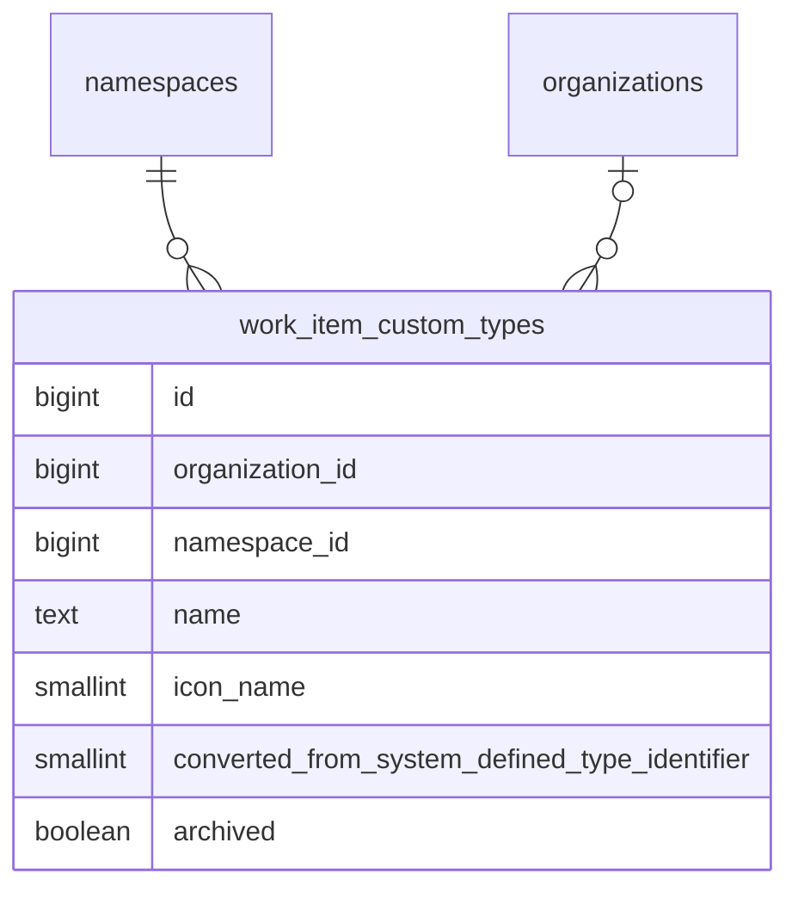

<!-- Design Documents often contain forward-looking statements -->
<!-- vale gitlab.FutureTense = NO -->

<!-- This renders the design document header on the detail page, so don't remove it-->



## 概要 {#summary}

このドキュメントは、GitLab のワークアイテム向けに [設定可能なワークアイテムタイプ](https://gitlab.com/groups/gitlab-org/-/epics/9365) を実装するための私たちのアプローチを概説しています。

これにより、Premium および Ultimate の顧客は、システム定義のワークアイテムタイプをカスタマイズし、計画ワークフローに合わせて新しいワークアイテムタイプを作成できるようになります。

トップダウンの管理と自律的なチームという顧客要件のバランスを取るため、ユーザーがワークアイテムタイプとその階層制限をカスタマイズできるのは、可能な限り最も高いレベルのみです。また、組織が許可している場合、子の名前空間やプロジェクトは、使用したくないタイプを無効化することでタイプをさらにカスタマイズできます。

タイプごとのウィジェットカスタマイズは後続のイテレーションで予定されています。初回リリースでは、カスタムタイプはシステム定義の `issue` タイプと同じウィジェットセットを使用します。

## 用語集 {#glossary}

このドキュメント全体で使われる語彙のリファレンスです。初回読了時は [ワークアイテムタイプのカスタマイズ](#customizing-work-item-types) まで読み飛ばしてください。各用語は、各セクションでの初出時にここへリンクされています。

### システム定義タイプ {#system-defined-type}

GitLab に同梱される組み込みのワークアイテムタイプ（`issue`、`incident`、`task`、`epic`、`ticket` など）。1〜9 の範囲の ID を持つ [`ActiveRecord::FixedItemsModel`](https://docs.gitlab.com/development/fixed_items_model/) オブジェクトとしてメモリ内に格納され、すべての名前空間で共有されます。システム定義タイプは削除できませんが、カスタマイズは可能です（converted type を参照）。

### カスタムタイプ {#custom-type}

`work_item_custom_types` に格納される、ユーザーが作成したワークアイテムタイプ。カスタムタイプは完全に新しいもの（例: 「Bug Report」「Feature Request」）でも、システム定義タイプをカスタマイズして作成したものでも構いません。カスタムタイプの ID は、システム定義の ID と重ならないように 1001 から始まります。

### converted type {#converted-type}

システム定義タイプをカスタマイズして作成されたカスタムタイプ。例えば「Issue」を「Feature」にリネームすると converted type が作成されます。`converted_from_system_defined_type_identifier` カラムには、元のシステム定義タイプの識別子が格納されます。converted type は、そのソースタイプの特殊な機能マッピング（Service Desk、incident management）を継承し、元のタイプのグローバル ID フォーマットを保持します。これらは、カスタマイズと後方互換性の間をつなぐアーキテクチャ上の橋渡しです。

### Delegation source {#delegation-source}

カスタムタイプが振る舞い（ウィジェット、階層制限、ベースタイプの述語、設定フラグ）を継承する元となるシステム定義タイプ。converted type の場合、これは `converted_from_system_defined_type_identifier` で識別されるシステム定義タイプです。新しいカスタムタイプの場合、これはデフォルトで `issue` になります。カスタムタイプごとのウィジェットおよび階層のカスタマイズは後続のイテレーションで予定されています。それまでは、委譲がデフォルトを提供します。

### Provider {#provider}

`WorkItems::TypesFramework::Provider` クラス。指定された名前空間におけるタイプの存在と可用性に関する唯一の権威です。ワークアイテムタイプを解決する必要があるすべてのコードは Provider を経由し、Provider はシステム定義タイプとカスタムタイプをリクエストごとのインデックス付きキャッシュにマージします。

### NamespacedType {#namespacedtype}

Provider のキャッシュ内でタイプをラップして名前空間対応にする、軽量な `SimpleDelegator` のサブクラス。共有された `FixedItemsModel` のシングルトンを変更することなく、名前空間ごとの状態（`enabled`、`is_a_group`、`tasks_on_boards`）を保持します。アイデンティティメソッドは保持されるため、ラッパーは等価性チェックに対して透過的なままです。

### SIWAR {#siwar}

祖先解決による疎な継承（Sparse Inheritance with Ancestor Resolution）。「最も近い祖先が優先される」セマンティクスで、名前空間階層に沿って名前空間ごとの設定（特に可視性）を解決するために使用されるパターン。継承されたデフォルトから逸脱する名前空間のみが行を必要とするため、Sparse（疎）です。

## ワークアイテムタイプのカスタマイズ {#customizing-work-item-types}

私たちは、可能な限り最も高いレベルでワークアイテムタイプの設定を許可します。これにより、顧客は自分が所有するすべてのグループおよびプロジェクトに対してタイプを設定できます。これは、SaaS インスタンスではルート名前空間レベル、self-managed インスタンスでは [組織レベル](https://docs.gitlab.com/user/organization/) になります。

[システム定義タイプ](#system-defined-type) は `ActiveRecord::FixedItemsModel` オブジェクトとしてメモリ内に格納され、すべてのグループおよびプロジェクトで共有されます。カスタマイズは PostgreSQL データベースに格納され、`organization_id` または `namespace_id` によってシャーディングされます。



`work_item_custom_types` テーブルは、システム定義タイプの ID（1〜9）との衝突を避けるため、1001 から始まる ID シーケンスを使用します。チェック制約により `id >= 1001` が強制されます。`organization_id` と `namespace_id` カラムは相互排他的です（ちょうど 1 つが非 null でなければなりません）。親の名前空間または組織あたり 40 個のカスタムタイプという上限があります。

### MVC1 カスタマイズのスコープ {#scope-of-mvc1-customization}

このフレームワークは、任意の [システム定義タイプ](#system-defined-type) をリネームしたりアイコンを変更したりできるように設計されていますが、MVC1 では UI が公開する範囲を意図的に狭めています。

- **Issue** はリネームでき、アイコンを変更できます。
- **新しい [カスタムタイプ](#custom-type)** を作成できます。これらは常に Issue を [delegation source](#delegation-source) として使用し、そのウィジェットセットと階層制限を継承します。
- **その他のすべてのシステム定義タイプ**（`epic`、`incident`、`task`、`ticket`、`test_case`、`requirement`、`objective`、`key_result`）はロックされています。これらはリネーム、アーカイブ、その他のカスタマイズができません。
- **ウィジェットカスタマイズ、階層カスタマイズ、設定フラグのオーバーライド** は MVC1 の対象外であり、[イテレーションエピック](https://gitlab.com/groups/gitlab-org/-/epics/9365) で追跡されています。

その他のシステム定義タイプに対する制限は、フレームワークの制限ではなくフロントエンドの制約です。UI のいくつかの箇所では、リストビュー、詳細ビュー、作成フローにおいて、これらのタイプを依然としてシステム定義の名前で参照しています。これらの画面がタイプ名に依存せずデータ駆動になるように刷新されるまで、リネームすると一貫性のない UI が生じてしまいます。意図としては、これらの画面が移行されるのに合わせて、追加のタイプのカスタマイズを解放していくことです。

### システム定義タイプのカスタマイズ {#customizing-a-system-defined-type}

ユーザーが [システム定義タイプ](#system-defined-type) をカスタマイズすると（現状では Issue のリネームまたはアイコンの変更です — [Scope of MVC1 customization](#scope-of-mvc1-customization) を参照）、新しい `work_item_custom_types` レコードを作成し、元のシステム定義の ID を `converted_from_system_defined_type_identifier` カラムに格納します。ワークアイテム自体には手を加えません。それらの `work_item_type_id` はシステム定義の ID を指し続けます。例えば、既存のすべての Issue は `work_item_type_id = 1` を保ち、新しく作成されるすべての Issue も `work_item_type_id = 1` で書き込まれます。カスタマイズはデータ移行ではなくルックアップを通じて有効になります。[Provider](#provider) は、システム定義の ID が出現する場所すべてで、それを [converted type](#converted-type) に解決します。[カスタムステータスと同様](../work_items_custom_status/#converting-system-defined-lifecycles-and-statuses-to-custom-ones) に、これは変更が即時かつ安価であることを意味します。

カスタムレコードの PK ではなくシステム定義の ID を格納することは、アーキテクチャ上の要石です。カスタマイズのたびに既存のすべてのワークアイテムの `work_item_type_id` を書き換えることは、`issues` テーブルの規模では実現不可能であり、クエリを高速に保つ単一カラムの格納モデルも壊してしまいます。完全な根拠については [ワークアイテムのタイプの格納](#storing-a-work-items-type) を参照してください。

この変換は API のコンシューマーに対して透過的です。グローバル ID は引き続き `gid://gitlab/WorkItems::Type/<system-defined identifier>` というフォーマットを使用し、GraphQL タイプは変更されず、私たちの API はカスタマイズされたシステム定義タイプを渡す際にこのフォーマットのグローバル ID を受け入れます。外部から見える唯一の変更は、タイプの名前とアイコンです。システム定義タイプは一度カスタマイズされると、たとえ元の名前にリネームし直されても [converted type](#converted-type) のままです。「変換を取り消す」操作はありません。

converted type は、元のシステム定義タイプに対するデコレーターとして機能します。[delegation source](#delegation-source) パターンを通じて、ウィジェット、階層制限、設定フラグ、ベースタイプの述語を元のタイプに委譲します。特殊な機能の振る舞い（`ticket` の Service Desk、`incident` の incident management）は、この委譲チェーンを通じて保持されます。アプリケーションが「これは Service Desk を処理するタイプか?」と尋ねると、そのタイプの `base_type` を要求し、それが delegation source を通じてシステム定義タイプに委譲され、`:ticket` を返します。すると、システム定義タイプ上の設定フラグ（`service_desk: true`、`incident_management: true`）が、そのタイプをその機能に指定されたものとして識別します。`converted_from_system_defined_type_identifier` カラムは、この委譲チェーンが正しく解決されるようにするためのリンクであり、機能コードが直接読み取るものではありません。

ワークアイテムのタイプを取得するとき、[Provider](#provider) は変換を適用します。名前空間やプロジェクトで利用可能なタイプを一覧表示するとき、Provider はすべてのシステム定義タイプとカスタムタイプを取得し、その後、マッピングされたカスタムタイプレコードを持つシステム定義タイプを除外します。

### 新しいワークアイテムタイプの作成 {#creating-a-new-work-item-type}

新しい [カスタムタイプ](#custom-type) は、`converted_from_system_defined_type_identifier` の値が null である `work_item_custom_types` レコードで表現されます。

すべてのタイプ（[システム定義](#system-defined-type)、[converted](#converted-type)、新しいカスタム）は、同じグローバル ID フォーマット `gid://gitlab/WorkItems::Type/<id>` を使用します。`SystemDefined::Type#to_global_id` と `Custom::Type#to_global_id` の両方が、`model_name: 'WorkItems::Type'` で明示的に GID を構築します。互いに素な ID 空間（システム定義は 1〜9、カスタムは 1001 以上）が衝突を防ぎます。

初回のイテレーションでは、新しいタイプはシステム定義の `issue` タイプのように振る舞います。これらはプロジェクトレベルでのみ許可され、ウィジェットと階層制限は `issue` のものと一致します。新しいカスタムタイプのグループレベルでの可用性は後続のイテレーションで予定されています。タイプごとのウィジェットカスタマイズも後続のイテレーションで予定されています。

### ワークアイテムタイプのアーカイブ {#archiving-a-work-item-type}

[カスタムタイプ](#custom-type) は、履歴データを保持するために削除ではなくアーカイブできます。タイプがアーカイブされると:

- `work_item_custom_types` の `archived` boolean カラムでマークされます
- タイプ作成フローに表示されなくなります
- そのタイプの既存のワークアイテムは保持され、引き続きアクセス可能です
- タイプをアーカイブ解除して再び利用可能にできます

これは [カスタムフィールドのアーカイブ](../work_items_custom_fields/#archiving-custom-fields) と同じパターンに従います。

#### タイプ名の一意性 {#type-name-uniqueness}

混乱を防ぎ、明確なユーザー体験を保証するため、タイプ名は名前空間または組織内で、[カスタム](#custom-type) タイプと変換されていない [システム定義タイプ](#system-defined-type) の両方をまたいで一意でなければなりません。これは次のことを意味します:

- カスタムタイプは、カスタマイズされていないシステム定義タイプと同じ名前を持てません
- カスタムタイプは、別のカスタムタイプと同じ名前を持てません
- システム定義タイプがカスタマイズされた場合（例: 「Task」から「Pizza」へのリネーム）、元のシステム定義タイプはその名前では利用できなくなるため、「Task」という名前で新しいカスタムタイプを作成できます
- ユーザーが [converted type](#converted-type) を元の名前にリネームし直した場合、その間に元の名前が取得されていなければ、そのカスタムタイプ名は再び取得可能になります。例えば「Pizza」を「Task」にリネームし直すと、「Pizza」がタイプ名として利用可能になります

### ワークアイテムのタイプの格納 {#storing-a-work-items-type}

私たちは、ワークアイテム上のタイプを格納するために [単一カラムアプローチ](https://gitlab.com/gitlab-org/gitlab/-/issues/580065) を使用します。既存の `issues.work_item_type_id` カラムが、すべてのタイプのタイプ ID を格納します:

- **[システム定義タイプ](#system-defined-type):** システム定義の ID（1〜9）が直接格納されます。
- **[converted type](#converted-type):** `converted_from_system_defined_type_identifier` の値、つまり元のシステム定義の ID が格納されます。これは、既存のワークアイテムがデータ移行なしで自動的にカスタマイズを取り込めるようにするためのキーです。
- **新しい [カスタムタイプ](#custom-type):** カスタムタイプ自身の ID（1001 以上）が格納されます。

これは `HasType#persistable_type_id` メソッドによって処理され、タイプの性質に基づいて書き込むべき正しい ID を決定します。

この単一カラムは、2 つの意味論的な意味を同時に持ちます。1〜9 の範囲の値はシステム定義または converted のタイプを識別し、1001 以上の範囲の値は新しいカスタムタイプを識別します。互いに素な ID 範囲により、判別用のカラムなしでこれが曖昧さなく成立します。[Provider](#provider) は、格納された ID を名前空間にとって正しいタイプオブジェクトに変換する解決レイヤーです。

単一カラムアプローチは、[トレードオフの調査](https://gitlab.com/gitlab-org/gitlab/-/issues/580065) の後、代替案（相互排他制約を持つ二重カラム、カスタムタイプ用の負の ID、三カラムアプローチ）よりも選ばれました。決め手となった要因:

- **カスタマイズ時に `issues` を書き換えない。** converted type は格納された ID をシステム定義の ID として保持するため、タイプのカスタマイズはどのワークアイテム行にも触れません。`issues` テーブルの規模では、これは即時の操作と不可能な操作との違いです。
- **インデックス密度とクエリ速度。** 単一の整数カラムにより、`work_item_type_id` の既存インデックスを完全に使い続けられます。「このプロジェクトのすべての ticket」のようなクエリは、名前空間ごとのカスタムレコードに展開されるのではなく、単一の整数マッチのままです。
- **トラフィックの多い `issues` テーブルへのスキーマ変更なし。** `issues` へのカラム追加はパフォーマンスと運用上の理由から積極的に避けられており、二重カラム設計ではバックフィルと新しいインデックスも必要になります。単一カラムアプローチは両方を回避します。
- **Cells 互換性。** システム定義タイプは、バッキングテーブルを持たない `FixedItemsModel` オブジェクトとしてメモリ内に存在します。参照すべき行が存在しないため、システム定義の ID に対して `issues.work_item_type_id` からタイプテーブルへの外部キーは存在できません。単一カラムアプローチは、これに抗うのではなく受け入れます。

単一カラムの欠点は、`work_item_type_id` に外部キー制約がないことです。2 つの理由でこれは許容できます:

- **システム定義の ID にはテーブルがない。** 設計に関わらず、1〜9 の範囲に標準的な FK は不可能です。
- **カスタムの ID は `work_item_custom_types` に存在する。** 1001 以上の範囲のみを対象とする部分的な FK は可能ですが、整合性の保証が値空間の半分しかカバーしないため、大きな利点なしに非対称性を加えるだけです。

カスタムタイプの ID の参照整合性は、その代わりにデータベーストリガー（[!223997](https://gitlab.com/gitlab-org/gitlab/-/merge_requests/223997)）によって強制されます。これは、トラフィックの多い `issues` テーブルに制約の仕組みを設けることなく、外部キーの関連部分を模倣します:

- `work_item_custom_types` 上のトリガーは、`issues` 行からまだ参照されている行の削除をブロックします。カスケードはありません — 削除は即座に失敗します。実際には、これはサポートされるライフサイクル操作である [アーカイブ](#archiving-a-work-item-type) と組み合わされます。完全な削除は未使用のタイプのために予約されています。
- `issues`（および `work_item_type_id` を格納する他のテーブル）上のトリガーは、挿入と更新時に値を検証します。存在しないカスタムタイプの ID を持つ行は、書き込み時に拒否されます。

元の FK は、この移行の一環として [削除](https://gitlab.com/gitlab-org/gitlab/-/issues/588587) されました。アプリケーション層での解決は引き続き [Provider](#provider) を通じて行われ、これがあらゆるタイプ ID の唯一の解決パスです。現在の名前空間に存在しないタイプを要求されると、Provider は `nil` を返します。これは「このカスタムタイプは別の名前空間に属している」という通常のパスであり、ダングリング参照の指標ではありません。

## Provider パターン {#provider-pattern}

[Provider](#provider) は、指定された名前空間におけるタイプの存在と可用性に関する唯一の権威です。ワークアイテムタイプを解決する必要があるすべてのコードは、タイプモデルを直接クエリするのではなく、Provider を経由します。

### 仕組み {#how-it-works}

CE Provider は、すべての public メソッドを 2 つの private メソッド `resolve_by_id` と `resolve_all` に委譲します。これにより、EE 層に単一のオーバーライドポイントのペアが提供されます。

EE Provider はこれら 2 つのメソッドをオーバーライドして、[システム定義](#system-defined-type) タイプと [カスタムタイプ](#custom-type) の両方から構築された、リクエストごとのインデックス付きキャッシュを経由するようにルーティングします。キャッシュ内の各タイプは、`FixedItemsModel` のシングルトン（リクエストをまたいで安定した `object_id` を持つ共有された Ruby オブジェクト）を変更することなく `enabled` 属性を保持する [`NamespacedType`](#namespacedtype) デリゲーターでラップされます。

```ruby
provider = WorkItems::TypesFramework::Provider.new(namespace)
provider.find_by_id(1)         # Returns Issue (or its converted custom type)
provider.find_by_id(1001)      # Returns custom type with ID 1001
provider.all_ordered_by_name   # All available types for the namespace
provider.find_by_base_type(:incident)  # Returns the type designated for incidents
```

### キャッシュ構造 {#cache-structure}

インデックス付きキャッシュは、タイプ ID をキーとするハッシュで、`SafeRequestStore`（リクエストごと、スレッドごと）に格納されます。システム定義タイプがカスタムタイプに変換されると、converted type がキャッシュ内のシステム定義タイプを置き換え、システム定義の ID とそれ自身の AR 主キーの両方でインデックス付けされます。この二重インデックス付けは、ラウンドトリップの安全性を保証します。タイプを解決し、`.id` を読み取り、それを `find_by_id` に渡し戻すコードは、同じオブジェクトを取得します。

### NamespacedType デリゲーター {#namespacedtype-delegator}

[`NamespacedType`](#namespacedtype) は、タイプをラップして名前空間対応にします。それ自身の振る舞いを追加するものではなく、特定の名前空間のコンテキストでのみ意味を持つ状態でラップされたタイプを拡充します。アイデンティティメソッド（`class`、`is_a?`、`instance_of?`、`kind_of?`）は、ラップされたタイプのクラスとして報告するようにオーバーライドされるため、ラッパーは `FixedItemsModel` の等価性チェックに対して透過的なままです。

ラッパーが保持する名前空間固有の状態は、コードベースの残りの部分が「このタイプはこの名前空間でどう見えるか?」に答えるために必要なすべてをカバーします:

- `enabled` — このタイプがこの特定の名前空間で使用するために有効になっているかどうか
- `is_a_group` — 現在の名前空間がグループかどうか（グループ専用タイプのようなタイプレベルの振る舞いに影響します）
- `tasks_on_boards` — その名前空間で tasks-on-boards 機能がアクティブかどうか
- `enabled_by_default_for_new_namespaces?` — `SafeRequestStore` に支えられた遅延述語。タイプ管理 UI でのみ使用され、Provider のホットパスを安価に保つため、キャッシュ構築時ではなくオンデマンドで解決されます

可用性（availability）と有効化（enablement）の区別が、鍵となるメンタルモデルです:

- `available` = タイプが名前空間階層に存在する（キャッシュ内にある）
- `enabled` = タイプがこの特定の名前空間で使用するために有効になっている

タイプは利用可能でありながら無効であることがあります。例えば、`Task` が階層内に存在しつつ、特定のプロジェクトで無効になっている場合があります。無効なタイプも `find_by_id` によって返されますが（既存のアイテムは正しくレンダリングされます）、作成フローはそれらを拒否します。

初回リリースでは、`enabled` はすべてのタイプに対してデフォルトで `true` です。[可視性コントロール](#visibility-controls) が、実際の永続化からこれを設定します。

### nil の名前空間の扱い {#nil-namespace-handling}

Provider は、`nil` の名前空間（インポート、メトリクス、Issue のスコープ）で頻繁に構築されます。EE の `feature_available?` メソッドは名前空間が `nil` のときに `false` を返し、これにより Provider はシステム定義タイプのみを返す CE 実装にフォールスルーします。組織の名前空間も同様に可視性解決をショートサーキットします — 可視性マップは組織の名前空間に対して `{}` を返すため、すべてのタイプはデフォルトで `enabled: true` になります。

## Delegation source {#delegation-source-1}

[カスタムタイプ](#custom-type) は、その振る舞いを [delegation source](#delegation-source)、つまりウィジェット、階層制限、設定フラグ、ベースタイプの述語を決定する [システム定義タイプ](#system-defined-type) に委譲します:

- **[converted type](#converted-type):** delegation source は、`converted_from_system_defined_type_identifier` で識別される元のシステム定義タイプです。
- **新しいカスタムタイプ:** delegation source はデフォルトで `issue` システム定義タイプになります。

これは次のことを意味します:

- `custom_type.widgets` は、その delegation source からのウィジェットリストを返します
- `custom_type.issue?` は、新しいカスタムタイプに対して `true` を返します（Issue に委譲します）
- `custom_type.incident?` は、Incident から変換されたタイプに対して `true` を返します
- 階層制限は delegation source の制限と一致します

カスタムタイプごとのウィジェットおよび階層のカスタマイズは後続のイテレーションで予定されています。delegation source パターンが基盤を提供します。カスタマイズが実装されると、ウィジェットと階層のオーバーライドが、委譲されたデフォルトの上に重なります。

## 可視性コントロール {#visibility-controls}

タイプの可視性は、[SIWAR](#siwar) パターンを使用して名前空間ごとに制御されます。これを 3 つのテーブルがサポートします:

- `work_item_type_visibilities` — 名前空間ごと、タイプごとの明示的な可視性オーバーライド。疎: デフォルトから逸脱する名前空間のみがレコードを必要とします。
- `work_item_type_visibility_defaults` — 新しい子の名前空間が作成されたときに適用されるデフォルト。
- `work_item_settings` — 組織またはルート名前空間ごとの機能設定。`customizable_type_visibility` boolean を含み、これは可視性管理を有効にするユーザー制御のトグルです。

### 可視性管理の有効化 {#enabling-visibility-management}

可視性管理はオプトインです。デフォルトでは `customizable_type_visibility` は `false` であり、これはすべてのタイプがどこでも有効であることを意味します — [Provider](#provider) は可視性解決を完全にショートサーキットし、可視性テーブルに存在しうるどの行に関わらず、すべてのタイプに対して `enabled: true` を返します。可視性コントロールを使用するには、管理者はまず `workItemSettingsUpdate` ミューテーションを通じて、組織またはルート名前空間で `customizable_type_visibility` 設定を有効にする必要があります。そうして初めて可視性テーブルが有効になります。

この二段階モデルは、顧客がタイプレベルのトグルに既存の名前空間を黙って影響させるのではなく、意図的に可視性コントロールを採用できることを意味します。

### 解決のセマンティクス {#resolution-semantics}

解決クエリは、「最も近い祖先が優先される」セマンティクスで PostgreSQL の `traversal_ids` を使用します。名前空間階層内の最も具体的なオーバーライドが優先されます。`propagate: true` を持つ行は、より近い祖先がオーバーライドするまで、すべての子に適用されます。Provider はキャッシュ構築中にこのクエリを実行し、その結果から [`NamespacedType.enabled`](#namespacedtype) を設定します。

### 可視性アクション {#visibility-actions}

3 つの独立した可視性アクションが利用可能です:

| Action | Effect | Storage |
|---|---|---|
| Control this namespace only | この名前空間のタイプ可視性を切り替える | `work_item_type_visibilities` の単一行 |
| Propagate to all existing children | すべての子の名前空間にオーバーライドを書き込む（競合する子の行をクリアする） | `propagate: true` を持つ単一行 |
| Set defaults for new children | 将来の子の名前空間のデフォルトを設定する | `work_item_type_visibility_defaults` の単一行 |

`workItemAvailabilityToggle` ミューテーションは、指定された名前空間に対して特定のタイプを有効または無効にし、そのスコープ引数を通じてこれらのアクションを公開します。

### 新しい名前空間のデフォルト可視性 {#default-visibility-for-new-namespaces}

各タイプには、新しい子の名前空間が作成されたときに適用されるデフォルトの可視性があります。デフォルトは、`workItemTypeCreate` および `workItemTypeUpdate` ミューテーションの `enabledByDefaultForNewNamespaces` 入力を通じてタイプの作成または更新時に設定され、組織またはルート名前空間にスコープされて `work_item_type_visibility_defaults` に格納されます。

新しいグループまたはプロジェクトが作成されると、シーディングサービスは組織/ルートのデフォルトを読み取り、各デフォルトを [SIWAR](#siwar) が新しい名前空間に対して現在解決するものと比較します。可視性の行は、両者が一致しない場合にのみ書き込まれます — 伝播する祖先がすでに望ましい状態を生み出している場合、行は不要です。これにより可視性テーブルは疎に保たれ、冗長な書き込みが回避されます。

初回リリースでは、デフォルトを組織またはルート名前空間のみにスコープします。任意の名前空間レベルでデフォルトを設定すること（サブグループが自身の将来の子に対してデフォルトを定義できるようにすること）は、`workItemAvailabilityToggle` の `NEW_CHILDREN` スコープを通じて後続のイテレーションで予定されています。

### インポートとエクスポートの相互作用 {#import-and-export-interaction}

インポート（CSV、Direct Transfer、ファイルベース）は、`validate_work_item_type_id` 上の `importing?` 例外を通じて、モデルレベルのタイプ検証を意図的にバイパスします。この例外がなければ、元のタイプがターゲットの名前空間で無効になっているレコード — または名前では一致するもののそこで無効になっているレコード — は保存に失敗し、ドロップされてしまいます。それはインポートの契約に反します。インポートはベストエフォートでレコードを着地させるべきであり、黙ってドロップすべきではありません。

インポートパスは、可視性を意識したフォールバックチェーンを使用します: 名前で一致 → ターゲットで一致かつ有効 → デフォルトの issue タイプ。モデル検証は、同期的なユーザー起点の書き込み（UI、GraphQL、REST、Service Desk、クイックアクション）の強制ポイントであり続けます。インポートは設計上の明示的な例外です。

## カスタムタイプのワークアイテムの作成 {#creating-work-items-of-custom-types}

任意のタイプ（[システム定義](#system-defined-type)、[converted](#converted-type)、新しい [カスタム](#custom-type)）のワークアイテムの作成は、同じ作成パスを経由します。[Provider](#provider) が解決ポイントです。それはタイプが名前空間に存在し利用可能かどうかを判断し、作成フローの残りの部分は解決されたタイプを一様に扱います。

概念モデルには 2 つの異なる認可レイヤーがあります:

- **タイプの可用性** — このタイプはこの名前空間に存在し、使用可能か? これは Provider の仕事であり、フィーチャーフラグのゲート、ライセンスのゲート、名前空間の可視性をカバーします。タイプが利用できない場合、作成ロジックが実行される前にリクエストは拒否されます。
- **作成の権限** — ユーザーはこの名前空間でワークアイテムを作成する権限を持っているか? これは標準の `:create_work_item` ポリシーチェックであり、タイプとは独立しています。

歴史的にベースタイプの述語をキーとしていた権限チェック（例: 「このユーザーは incident を作成することを許可されているか?」）は、それらが意味を持ち続けるシステム定義タイプおよび converted タイプに対しては引き続き適用されます。新しいカスタムタイプは独自のベースタイプ権限を持たず、Issue に委譲します。新しいカスタムタイプのワークアイテムの作成は、標準の「ワークアイテムを作成する」権限でゲートされます。

## 権限 {#permissions}

| Permission | Scope | Role (SaaS) | Role (Self-Managed) | Purpose |
|---|---|---|---|---|
| `create_work_item_type` | Root group, organization | Maintainer+ | Admin, or organization Owner | 新しいカスタムタイプを作成する |
| `update_work_item_type` | Root group, organization | Maintainer+ | Admin, or organization Owner | タイプを更新または変換する |
| `update_work_item_type_visibility` | Root group, subgroup, project | Maintainer+ | Maintainer+ | 名前空間のタイプ可視性を切り替える |
| `configure_work_item_type` | Subgroup, project | Maintainer+ | Maintainer+ | サブグループおよびプロジェクトレベルでワークアイテムタイプ設定 UI にアクセスする。現在は delegation source から継承されている、ウィジェットカスタマイズや階層カスタマイズといった将来のタイプごとの設定のエントリポイントとして予約されています。 |

`WorkItems::TypesFramework::Custom::TypePolicy` は、認可を親の名前空間または組織に委譲し、ライセンスされた機能をチェックします。

## ライセンスとダウングレード {#licensing-and-downgrades}

設定可能なワークアイテムタイプは、Premium および Ultimate の顧客向けのライセンスされた機能（`configurable_work_item_types`）として利用可能です。

ライセンスのダウングレード時:

- すべてのカスタムタイプと設定は読み取り可能なままです
- ミューテーションはブロックされます（タイプの作成、更新、変換）
- データの破棄やタイプのマッピングはありません
- カスタムタイプの既存のワークアイテムは引き続き機能します
- 再アップグレードすると、データ移行なしで完全な機能が復元されます

これは [フレームワーク全体のライセンス原則](../work_items_framework_vision/#licensing-and-downgrade-strategy) に従います: ダウングレード時に既存の設定とデータをそのまま保持しつつ、ミューテーションを禁止します。

## フロントエンドアーキテクチャ {#frontend-architecture}

フロントエンドの実装には以下が含まれます:

- ワークアイテムタイプを管理するための、ルートグループ、サブグループ、プロジェクト、管理者の各レベルの **設定ページ**
- 作成、編集、アーカイブのアクションと、上限を示すアクティブタイプカウンターを備えた **タイプリストビュー**
- サブグループおよびプロジェクト向けの **有効/無効トグルビュー**。名前空間管理者がどのタイプを利用可能にするかを制御できます
- 新しいタイプを定義したり既存のタイプをカスタマイズしたりするための **作成/編集フォーム**

フロントエンドは、フレームワークビジョンで説明されている [設定プロバイダーパターン](../work_items_framework_vision/#1-configuration-over-type-checks) を使用し、名前空間ごとにタイプ設定を取得して Apollo にキャッシュします。API レスポンスが、どのタイプが利用可能でどのアクションが可能かを駆動します — タイプの可用性に関するハードコードされた前提はありません。

## 設定とタイプチェック {#configurations-and-type-checks}

アプリケーション全体でハードコードされたタイプチェックを削減しつつ、タイプの振る舞いについての明確さを維持するため、私たちはタイプ設定にアクセスするための集中化されたインターフェースを備えた設定ベースのアプローチを使用します。

設定は、タイプがどう振る舞いレンダリングされるかを制御する boolean フラグ（または後続のイテレーションでは値ベースの属性）です。複数のタイプが同じ設定を共有できます。

### 設定インターフェース {#configuration-interface}

**Backend:**

```ruby
# Checking configurations
type.configured_for?(:use_legacy_view)  # => true/false
type.configured_for?(:group_level)      # => true/false
type.configured_for?(:available_in_create_flow)  # => true/false

# Future: value-based configurations
type.configuration(:required_widgets)  # => [:title, :description]
```

**Frontend:** 設定は GraphQL を通じて公開され、フロントエンドクライアントに渡されます。フロントエンドはタイプチェックを行うべきではなく、代わりに設定フラグをクエリして振る舞いを判断すべきです。

### 特殊タイプの扱い {#special-type-handling}

Service Desk と Incident Management の機能は、特定のワークアイテムタイプ（`ticket` と `incident`）に結びついています。私たちはこれらを次のように扱います:

1. 素早いチェックのための設定フラグ:

   ```ruby
   type.configured_for?(:service_desk)         # Is this the service desk type?
   type.configured_for?(:incident_management)  # Is this the incident type?
   ```

2. ルックアップのためのタイプ Provider

   ```ruby
   # Finding the designated type for a feature
   # (concrete class name might be subject to change).
   WorkItems::TypesFramework::Provider.new(namespace).service_desk_type
   WorkItems::TypesFramework::Provider.new(namespace).incident_type
   ```

### 必須ウィジェット {#required-widgets}

`ticket` や `incident` のようなタイプは、関連する機能（Service Desk、Incident Management）に必要な必須ウィジェットを持ちます。これらの必須ウィジェットはシステム定義タイプの定義の一部として定義され、`converted_from_system_defined_type_identifier` を通じて converted カスタムタイプに継承されます。

## 実装の詳細 {#implementation-details}

実装では、タイプ関連の機能を整理し関心の明確な分離を提供するために、`WorkItems::TypesFramework` 名前空間を使用します。これは、ステータス関連の機能をすべてグループ化した `WorkItems::Statuses` 名前空間で確立したパターンを継続します。詳細には次のことを意味します:

1. `FixedItemsModel` を使用するシステム定義クラスは、`WorkItems::TypesFramework::SystemDefined` 名前空間を使用します。
1. カスタムタイプ関連の概念のモデルとクラスは、`WorkItems::TypesFramework::Custom` 名前空間を使用します。

### フロントエンドメタデータプロバイダーパターン {#frontend-metadata-provider-pattern}

フロントエンドは、メタデータプロバイダーの Vue コンポーネントに、ワークアイテムタイプ設定を取得する別個のクエリを追加します。このパターンは、ユーザーが異なる名前空間のアイテム間を移動する際に、タイプ設定が常に利用可能で最新であることを保証します。

#### 仕組み {#how-it-works-1}

設定は名前空間のフルパスごとに 1 回取得され、Apollo にキャッシュされます。これは次のことを意味します:

1. SPA が最初にマウントされるとき、現在の名前空間パス（グループまたはプロジェクト）のタイプ設定を取得します
2. ユーザーが同じ名前空間内のアイテムに移動すると、キャッシュされた設定が再利用されます
3. 異なる名前空間のアイテムに移動すると、フルパスが更新され、その名前空間パスに対する新しい設定の取得が強制されます
4. 各名前空間パスは独自のキャッシュエントリを持ち、SPA が複数の名前空間の設定を同時に維持できるようにします
5. コンポーネントが設定にアクセスしたいとき、現在のワークアイテムタイプをユーティリティメソッドに渡し、正しい名前空間に対する正しいタイプ設定を返します。

#### ユースケース {#use-cases}

このパターンはいくつかのナビゲーションシナリオを処理します:

- **同じ名前空間のナビゲーション**: 同じプロジェクト/グループ内のアイテムをクリックすると、キャッシュされた設定が再利用されます
- **プロジェクト間のナビゲーション**: 異なるプロジェクトのアイテムに移動すると、そのプロジェクトのパスに対して新しい設定が取得されます
- **グループ間のナビゲーション**: 異なるグループまたはルート名前空間のアイテム間を移動すると、適切な設定が取得されキャッシュされます
- **コンテキスト依存のビュー変更**: エピック（グループコンテキスト）を表示した後に Issue（プロジェクトコンテキスト）を選択すると、設定が新しいコンテキストを反映するように更新されます

## ワークアイテム設定セクションの設定 {#work-item-settings-sections-configurations}

これはフロントエンド固有の設定であり、GitLab 自身のフロントエンド実装と UI レイアウトの決定に非常に固有であるため、API で公開する意味はありません。

### 1. 設定構成ファクトリ {#1-settings-configuration-factory}

`ee/app/assets/javascripts/work_items/constants.js` の `getSettingsConfig(context)` ファクトリ関数は、呼び出し元のコンテキストに合わせた設定オブジェクトを生成します。これは 4 つのコンテキスト文字列のいずれかを受け取ります: `'root'`、`'subgroup'`、`'project'`、`'admin'`（デフォルトは `'root'`）。

この関数は 2 つのレイヤーで設定を構築します:

1. **ベースデフォルト** — 関数内の `DEFAULT_SETTINGS_CONFIG` オブジェクトが、boolean の可視性フラグ、権限、レイアウトの完全なセットを定義します:

   | Property | Type | Purpose |
   |---|---|---|
   | `showWorkItemTypesSettings` | `boolean` | 設定可能なタイプセクションを表示する。 |
   | `showEnabledWorkItemTypesSettings` | `boolean` | 有効なタイプセクションを表示する。 |
   | `showCustomFieldsSettings` | `boolean` | カスタムフィールドセクションを表示する。 |
   | `showCustomStatusSettings` | `boolean` | カスタムステータスセクションを表示する。 |
   | `workItemTypeSettingsPermissions` | `string[]` | 設定可能なタイプに適用される権限（例: `['edit', 'create', 'archive']`）。 |

2. **コンテキスト固有のテキスト** — 2 つのルックアップマップ（`configurableTypesSubtexts` と `enabledTypesSubtexts`）が、説明的な文字列をコンテキストでキー付けします。ファクトリは、一致する文字列を返却オブジェクトに `configurableTypesSubtext` と `enabledTypesSubtext` としてマージします。

コンシューマーはファクトリを呼び出し、その後必要なフラグをオーバーライドします:

```js
// Admin — disable sections not yet supported
const config = {
  ...getSettingsConfig('admin'),
  showEnabledWorkItemTypesSettings: false,
  showCustomFieldsSettings: false,
  showCustomStatusSettings: false,
};

// Subgroup — only the enabled types section
const config = {
  ...getSettingsConfig('subgroup'),
  showWorkItemTypesSettings: false,
  showEnabledWorkItemTypesSettings: true,
  showCustomFieldsSettings: false,
  showCustomStatusSettings: false,
};
```

#### 新しい設定オプションのためのスケーラビリティパターン {#scalability-pattern-for-new-config-options}

新しい設定セクションまたは設定プロパティを追加するには:

1. `getSettingsConfig` 内の `DEFAULT_SETTINGS_CONFIG` に新しい boolean フラグ（例: `showMyNewSettings`）を追加します。
2. 新しいセクションがコンテキスト固有のテキストを必要とする場合、コンテキスト文字列でキー付けされた新しいルックアップマップ（例: `myNewSettingsSubtexts`）を追加し、その結果を返却オブジェクトにマージします。
3. すでに `getSettingsConfig(context)` をスプレッドしている各コンシューマーは、新しいデフォルトを自動的に継承します。コンシューマーは、自身のコンテキストがデフォルト以外の値を必要とする場合にのみフラグをオーバーライドすればよいです。
4. `WorkItemSettingsHome` で、新しいフラグを使った `v-if` ガードを追加して、対応するコンポーネントを条件付きでレンダリングします。

このアプローチは、ファクトリをデフォルトの唯一の情報源として保ちつつ、各エントリポイントが個々のセクションをオプトインまたはオプトアウトできるようにします。新しいコンテキスト（例: `'organization'`）には、各ルックアップマップへの新しいエントリのみが必要です。

### 2. 有効なワークアイテムタイプセクション {#2-enabled-work-item-types-section}

`EnabledConfigurableTypesSettings` コンポーネント（`ee/groups/settings/work_items/configurable_types/enabled_configurable_types_settings.vue`）は `SettingsBlock` 内にレンダリングされ、指定された名前空間で現在アクティブなワークアイテムタイプを表示します。

- 可視性は設定の `showEnabledWorkItemTypesSettings` によって制御されます。
- 説明テキストは `config.enabledTypesSubtext` から来るため、現在のコンテキストを自動的に反映します。
- このコンポーネントは、独自の Apollo クエリを持つ `WorkItemTypesListEnabledDisabledView` にレンダリングを委譲します。

---

## コンテキスト固有の動作マトリクス {#context-specific-behavior-matrix}

| Context | Configurable Types Section | Enabled Types Section | Custom Fields | Custom Status |
|---|---|---|---|---|
| **Admin** | Shown | Hidden | Hidden | Hidden |
| **Root Group** | Shown | Shown | Shown | Shown |
| **Subgroup** | Hidden | Shown | Hidden | Hidden |
| **Project** | Hidden | Shown | Hidden | Hidden |

---

## コンポーネント階層 {#component-hierarchy}

```text
WorkItemSettingsHome
├── ConfigurableTypesSettings          (if showWorkItemTypesSettings)
│   └── WorkItemTypesList              (always renders list/crud view)
├── EnabledConfigurableTypesSettings   (if showEnabledWorkItemTypesSettings)
│   └── WorkItemTypesListEnabledDisabledView  (self-fetching)
├── CustomStatusSettings               (if showCustomStatusSettings)
└── CustomFieldsList                   (if showCustomFieldsSettings)
```

## イテレーション {#iterations}

MVC1 は GitLab 19.0 で出荷されました。何が出荷され、将来のイテレーションで何が予定されているかの完全な内訳については、[トップレベルエピック](https://gitlab.com/groups/gitlab-org/-/epics/9365) とそのサブエピックを参照してください:

1. [ワークアイテムタイプのウィジェットカスタマイズ](https://gitlab.com/groups/gitlab-org/-/epics/20075)
2. [グループ内のカスタマイズ可能なタイプと設定可能な階層](https://gitlab.com/groups/gitlab-org/-/epics/20076)
3. [タイプの拡張設定オプション（ポリシー）](https://gitlab.com/groups/gitlab-org/-/epics/20077)

## ライセンスとティアに関する考慮事項 {#license-and-tier-considerations}

カスタムワークアイテムタイプは Premium 以上の機能です。ライセンスされた機能の名前は `configurable_work_item_types` です。顧客がカスタムタイプをサポートしないティアにダウングレードすると、私たちは次の戦略を適用します:

### ダウングレード動作 {#downgrade-behavior}

ダウングレード時、私たちはすべての既存の設定とデータをそのまま保持しつつ、ミューテーションを禁止します:

- 既存のカスタムタイプとその設定は読み取りのためにアクセス可能なままです
- 新しいカスタムタイプの作成はブロックされます
- 既存のカスタムタイプの変更はブロックされます
- リレーションシップと階層はそのまま保持されますが、現在のライセンス機能を超えて変更することはできません
- リネームされたシステム定義タイプはカスタム名を保持し、それ以上変更することはできません

このアプローチは、破壊的なアクションとデータ損失を回避しつつ、ダウングレードされたティアの機能の低下を明確に伝えるものであり、ステータスおよびカスタムフィールド機能のダウングレード動作と一致しています。

### カスタムタイプの上限 {#custom-type-limits}

`40` 個のアクティブなワークアイテムタイプという上限が、Premium ティアにおいてトップレベルの名前空間または組織ごとに、カスタムおよびシステム定義のワークアイテムタイプをまたいで強制されます。

### 将来のティア差別化 {#future-tier-differentiation}

将来のイテレーションでは、階層の深さ制限など、Premium と Ultimate のティア間に追加の制限を導入する可能性があります。これらは同じ戦略に従います: 既存の設定とリレーションシップを保持しつつ、現在のライセンス機能を超える新しい使用と変更を制限します。

## ワークアイテムタイプの状態と設定 UI {#work-item-type-states-and-settings-ui}

### ワークアイテムタイプの状態 {#work-item-type-states}

1. Enabled - 任意のワークアイテムタイプのデフォルト
1. Locked - リネーム、無効化、削除ができないシステムタイプ。
1. Archived - 削除の代替。最適なワークフローはタイプを削除して新しいタイプに移行することでしたが、それが不可能だったため、この「Archive」タイプを追加しました
   1. フィルターで利用可能にすべきではありません（ルートレベルでのみ発生するため、いかなるカスケード設定にも依存しません）
   1. リネームとアイコン編集は許可されません
1. Disabled
   1. 無効になっているプロジェクト/グループのフィルターで利用可能にすべきではありません（親から継承している場合は同じ権限を継続します）
   1. 作成を許可すべきではありません
   1. リネームとアイコン編集が許可されます

### ワークアイテムタイプのセクション {#work-item-type-sections}

ワークアイテム設定ページには別個のセクションがあります

1. 「Work item types」 - タイプがグローバルに定義、作成、管理される場所です。
2. 「Enabled work item types」 - これは純粋にローカルな設定であり、ここで可用性を切り替えられます。

コンテキストと要件に応じて、ワークアイテム設定ページの上記両セクションに対して別個の組み合わせがあります。

## 決定レジストリ {#decision-registry}

1. [SaaS インスタンスではルート名前空間レベル、self-managed インスタンスでは組織レベルでタイプを設定する](https://gitlab.com/groups/gitlab-org/-/epics/7897#note_2795232631)。

   私たちは GitLab.com 上のすべての顧客を別々の組織に移行する準備ができていないため、今のところルート名前空間レベルでタイプを設定する必要があります。一方、self-managed インスタンスは常に単一の組織を持つため、組織レベルで設定できます。

   self-managed の顧客は通常、自分のインスタンス上の複数のルート名前空間をまたいで作業するため、タイプとワークフローを標準化できるように、より高いレベルで設定できるようにしたいと考えています。

1. システム定義タイプは、クラスター全体のテーブルを避け、Cells とシャーディングの作業のブロックを解除するために、[`ActiveRecord::FixedItemsModel` オブジェクトとしてメモリ内に](https://gitlab.com/gitlab-org/gitlab/-/issues/519894) 格納されます。
1. Service Desk や incident management のような特殊な機能は、[システム定義タイプに 1:1 でマッピング](https://gitlab.com/groups/gitlab-org/-/epics/7897#note_2857326975) されます。
1. 破壊的変更を避けるため、私たちは [システム定義タイプの既存のグローバル ID フォーマットを保持](https://gitlab.com/gitlab-org/gitlab/-/issues/579238) します。システム定義タイプがカスタマイズされた場合でも、同じフォーマットが保持されます。
1. [別個の能力（capability）の概念の代わりに、タイプの振る舞いに設定ベースのアプローチを使用する](https://gitlab.com/gitlab-com/content-sites/handbook/-/merge_requests/17119#ai-summary-of-the-discussion-in-slack-for-the-record)。

   私たちは「capabilities」（排他的なタイプアイデンティティ）と「configurations」（振る舞いフラグ）の両方の導入を検討しましたが、統一された設定アプローチを選びました。排他的な処理を必要とする特殊タイプが 2 つしかないため、今のところ単一の概念のほうが理解と維持が簡単です。

1. [`WorkItems::TypesFramework` 名前空間を使用する](https://gitlab.com/gitlab-org/gitlab/-/merge_requests/212636#note_2948286714)。
1. [ライセンスのダウングレード時、既存の設定とデータを保持しつつミューテーションを禁止する](https://gitlab.com/gitlab-org/gitlab/-/issues/579231)。
1. 私たちは、ワークアイテムタイプ名を完全に複数形化することを避けるため、ワークアイテムタイプ名の複数形を保存/格納することは行いません。「Issues」「Epics」「Stories」ではなく、タイプ名は単数形のままであるべきであり、そのタイプの複数のアイテムを参照するときは、複数形はコンテナレベルで処理されます: 「work items of type: [Name]」または「items」。
1. ticket はメール経由または `/convert_to_ticket user@example.com` クイックアクションを使用してのみ作成できます。
   1. 「Ticket」は作成用の利用可能なタイプのリストから削除されます。
   1. 「Create new ticket」は子アイテムセクションから削除されます。
1. ヘッダーアクションメニューでは、「New related TYPE_NAME」の代わりに「New related item」を使用します。
1. ユーザーは ticket を他の任意のアイテムタイプに関連付けられます
1. [名前空間パスごとにワークアイテムタイプ設定を取得し、Apollo にキャッシュする](https://gitlab.com/groups/gitlab-org/-/epics/20061#note_3020401416)。

   このパターンの仕組みとその利点の詳細については、[Frontend metadata provider pattern](#frontend-metadata-provider-pattern) セクションを参照してください。

1. [ワークアイテムタイプ間のすべてのリンク制限を削除する](https://gitlab.com/gitlab-org/gitlab/-/issues/581932#note_3019673313)。

   任意のワークアイテムタイプは、「Blocked by / Blocks」や「Related to」のようなリレーションシップで、他の任意のタイプにリンクできるべきです。この決定はリンクされたアイテムにのみ適用され、子アイテム（階層）には適用されません。

1. [カスタムワークアイテムタイプを既存のシステム定義タイプに委譲する](https://gitlab.com/gitlab-org/gitlab/-/issues/581932#note_2959381705)。ユーザーが将来のイテレーションで実際にこれらの機能をカスタマイズするまで、カスタムウィジェットの定義と階層制限テーブルの作成を延期します。

1. 設定可能なワークアイテムタイプは Premium 以上の機能であるため、すべてのワークアイテムタイプ設定コードは `ee/` に存在すべきです。

   CE ユーザーがタイプ、ウィジェット、階層をカスタマイズできるようになることはありません。トップレベルのワークアイテムタイプ GraphQL クエリと関連する設定コードは、安全に EE コードベースに置けます。`namespaceWorkItemTypes` クエリはすべてのワークアイテムリスト機能を処理し、CE に適しています。現在 CE にあるがタイプ設定にのみ使用される再利用可能なコンポーネントは、EE への移行を検討すべきです。

1. [タイプ名は、カスタムおよび変換されていないシステム定義タイプをまたいで一意でなければならない](https://gitlab.com/gitlab-org/gitlab/-/merge_requests/218464#note_3022168638)。

1. [システム定義とカスタムのワークアイテムタイプを ID 範囲で分離する](https://gitlab.com/gitlab-org/gitlab/-/merge_requests/223117)。

   システム定義のワークアイテムタイプは ID 1〜1000 を使用し、カスタムのワークアイテムタイプは ID 1001 以上を使用します。`work_item_custom_types` テーブルには 1001 から始まる新しいシーケンスを設け、2 つのカテゴリ間の重複を防ぎます。

1. すべての利用可能なワークアイテムタイプは、すべてのレベル、すなわち組織レベル/トップレベルグループ、サブグループレベル、プロジェクトレベルで表示されます

1. Epics は現在グループレベルでのみ利用可能であるため、プロジェクトレベルではワークアイテムタイプとして、プロジェクトでは無効である旨の説明ツールチップ付きで表示されます。注意: これは将来のイテレーションで変更される可能性があります。

1. ワークアイテムタイプの作成/編集は、組織レベル/トップレベルグループでのみ行えます。

1. 「Work item types」セクションに加えて、別個の「Enabled work item types」セクションを設けます。[これはトップレベルグループでも表示されます](https://gitlab.com/gitlab-org/gitlab/-/issues/585643#note_3080703281)。

1. サブグループとプロジェクトには「Enabled work item types」セクションのみがあります。

1. アーカイブされたタイプは、組織レベル/トップレベルグループでは分割ボタンビューとして表示されますが、プロジェクトおよびサブグループレベルでは表示されません。

1. [カスタムワークアイテムタイプは GID モデルクラスとして `WorkItems::Type` を使用する](https://gitlab.com/gitlab-org/gitlab/-/merge_requests/224790#note_3125745798)。

   converted およびシステム定義のタイプと同様に、新しいカスタムタイプについても、レガシーの `WorkItems::Type` クラスを使ってグローバル ID を構築します。これは、システム定義タイプとカスタムタイプの両方が `gid://gitlab/WorkItems::Type/<id>` というフォーマットのグローバル ID を生成することを意味します。

   - これにより GraphQL API の表面が一様に保たれます — クライアントはシステム定義タイプとカスタムタイプの GID を区別する必要が一切ありません。
   - `Custom::Type` は内部的な実装の詳細であり、public API の概念ではありません。
   - `WorkItems::TypesFramework::Provider` は両方のタイプ種別を一様に解決するための意図されたクラスです。今 `WorkItems::Type` を GID モデルとして使用しておくことで、将来のリファクタリングが既存の API 契約を壊さないようにします。

   [`WorkItems::Type` GID を一様に使用することに関する議論](https://gitlab.com/gitlab-org/gitlab/-/merge_requests/223304#note_3092047469) も参照してください。

1. [カスタムタイプ間のワークアイテムの無制限の変換を許可する](https://gitlab.com/gitlab-org/gitlab/-/work_items/595002#note_3210323887)。

   現在の MVC では、カスタムタイプの任意のワークアイテムを、制限なく他の任意のカスタムタイプに変換できます。すべてのカスタムタイプはシステム定義の `issue` タイプと同じウィジェットセットと振る舞いを共有するため、それらの間でワークアイテムを変換しても、データ損失のリスクなしにすべてのウィジェットとデータが保持されます。すでに `issue` への変換をサポートしている任意のワークアイテムタイプは、`supportedConversionTypes` においてすべてのカスタムタイプも有効な変換ターゲットとして列挙すべきです。この決定は、ウィジェットカスタマイズや階層カスタマイズによってカスタムタイプ間に違いが生じうる将来のイテレーションで再検討される可能性があります。

   [実装の詳細に関する議論](https://gitlab.com/gitlab-org/gitlab/-/merge_requests/227980#note_3201204553) も参照してください。

1. [ワークアイテムダッシュボードは、組織が存在する場合にのみ Type フィルターを表示し、それ以外の場合は Type フィルターを表示しません。](https://gitlab.com/gitlab-org/gitlab/-/merge_requests/233252#note_3290323376)

1. [BuildService は、完全な `NamespacedType#enabled?` 述語を呼び出すのではなく `enabled && !archived?` をインライン化します](https://gitlab.com/gitlab-org/gitlab/-/merge_requests/235382)。後者の `visible_in_context?` チェックは UI のゲーティングには正しいものの、コンテキストのゲーティングがすでに上流（ポリシーチェック、Provider のフィルタリング、ベータフィーチャーフラグ）で行われている作成、クローン、移動のフローには過剰すぎるためです。

## リソース {#resources}

1. [このイニシアチブのトップレベルエピック](https://gitlab.com/groups/gitlab-org/-/epics/9365)
1. [GitLab 19.0 リリースノート — Configure work item types](https://docs.gitlab.com/releases/19/gitlab-19-0-released/#configure-work-item-types)
1. [ユーザードキュメント — Configurable work item types](https://docs.gitlab.com/user/work_items/configurable_work_item_types/)
1. [ワークアイテムタイプの作成/編集](https://gitlab.com/gitlab-org/gitlab/-/issues/580932) のデザイン（クローズ済み）
1. [ワークアイテムタイプ詳細ビュー](https://gitlab.com/gitlab-org/gitlab/-/issues/580940) のデザイン
1. [ワークアイテムタイプリストビュー](https://gitlab.com/gitlab-org/gitlab/-/issues/580929) のデザイン（クローズ済み）
1. [設定可能なワークアイテムタイプの POC](https://gitlab.com/gitlab-org/gitlab/-/issues/580260)（クローズ済み）
1. [調査: タイプ格納アプローチ](https://gitlab.com/gitlab-org/gitlab/-/issues/580065)（クローズ済み）
1. [Work Items Framework Engineering Vision](../work_items_framework_vision/) — アーキテクチャ原則と技術的方向性
1. [Configurable Work Item Statuses](../work_items_custom_status/) — FixedItemsModel パターンとシステム定義エンティティの規約

## チーム {#team}

全員に最新情報を共有するため、このドキュメントに関連するすべての MR で現在のチームをメンションしてください。全員が変更を承認することは期待していません。

```text
@gweaver @acroitor @nickleonard @gitlab-org/plan-stage/project-management-group/engineers
```
