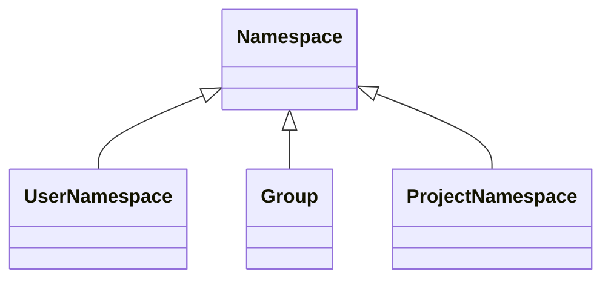

このページには今後予定されている製品・機能・機能性に関する情報が含まれています。ここに示す情報は参考目的のみです。購入・計画の決定にこの情報を使用しないでください。製品・機能・機能性の開発、リリース、タイミングは変更または延期される可能性があり、GitLab Inc. の独自の判断に委ねられています。

<table class="w-full text-sm border-collapse">
<thead>
<tr class="bg-gray-100 text-left">
<th class="px-3 py-2 border border-gray-300">Status</th>
<th class="px-3 py-2 border border-gray-300">Authors</th>
<th class="px-3 py-2 border border-gray-300">Coach</th>
<th class="px-3 py-2 border border-gray-300">DRIs</th>
<th class="px-3 py-2 border border-gray-300">Owning Stage</th>
<th class="px-3 py-2 border border-gray-300">Created</th>
</tr>
</thead>
<tbody>
<tr>
<td class="px-3 py-2 border border-gray-300">ongoing</td>
<td class="px-3 py-2 border border-gray-300"><a href="https://gitlab.com/alexpooley" class="text-blue-600 hover:underline">@alexpooley</a>, <a href="https://gitlab.com/ifarkas" class="text-blue-600 hover:underline">@ifarkas</a></td>
<td class="px-3 py-2 border border-gray-300"><a href="https://gitlab.com/grzesiek" class="text-blue-600 hover:underline">@grzesiek</a></td>
<td class="px-3 py-2 border border-gray-300"><a href="https://gitlab.com/m_gill" class="text-blue-600 hover:underline">@m_gill</a>, <a href="https://gitlab.com/mushakov" class="text-blue-600 hover:underline">@mushakov</a></td>
<td class="px-3 py-2 border border-gray-300">~devops::data stores</td>
<td class="px-3 py-2 border border-gray-300">2021-02-07</td>
</tr>
</tbody>
</table>

多くの機能がグループまたはプロジェクト内にのみ存在しています。グループとプロジェクトの機能の境界はかつては明確でした。しかし、グループにプロジェクトの機能を持たせたり、プロジェクトにグループの機能を持たせたりする需要が増しています。例えば、グループで Issue を持ちたい、プロジェクトでエピックを持ちたいといった要求があります。

[Simplify Groups & Projects Working Group](../../../../company/working-groups/simplify-groups-and-projects/) は、私たちのアーキテクチャがグループとプロジェクト間で機能を共有する上での大きな障害であると判断しました。

アーキテクチャの Issue: <https://gitlab.com/gitlab-org/architecture/tasks/-/issues/7>

## 課題

### 機能の重複

機能を別のレベルで利用可能にする必要がある場合、確立されたプロセスがありません。その結果、同じ機能の再実装が発生します。これらの実装は、それぞれが独立して存在するため、時間の経過とともに乖離していきます。このアプローチに関するさらにいくつかの問題：

- 機能はコンテナに結合されています。実際には、機能をコンテナから切り離すことは簡単ではありません。結合の程度は機能によって異なります。
- 機能の単純な重複は、より複雑で脆弱なコードベースにつながります。
- グループとプロジェクト間でソリューションを汎用化すると、システムのパフォーマンスが低下する可能性があります。
- 機能の範囲は多くのチームにまたがっており、これらの変更は開発の干渉を管理する必要があります。
- グループ/プロジェクト階層は自然な機能階層を作成します。機能が複数のコンテナにまたがって存在する場合、機能の階層が曖昧になります。
- 機能の重複は開発速度を遅くします。

大規模なアーキテクチャの変更の可能性があります。これらの変更は製品設計から独立している必要があり、顧客体験は一貫したままでなければなりません。

### パフォーマンス

リソースは複雑な方法でしかクエリできません。これにより、認可、エピック、その他多くの場所でパフォーマンスの問題が発生しました。例えば、ユーザーがアクセスできるプロジェクトをクエリするには、以下のソースを考慮する必要があります：

- 個人プロジェクト
- 直接のグループメンバーシップ
- 直接のプロジェクトメンバーシップ
- 継承されたグループメンバーシップ
- 継承されたプロジェクトメンバーシップ
- グループ共有
- グループ共有による継承されたメンバーシップ
- プロジェクト共有

グループ/プロジェクトメンバーシップ、グループ/プロジェクト共有も重複している機能の例です。

## 目標

現在、このブループリントはエンジニアリングの課題に厳密に関連しています。

- グループとプロジェクトのコンテナアーキテクチャを統合する。
- 機能をコンテナから切り離すためのソリューションセットを開発する。
- エンジニアリングの変更を製品の変更から切り離す。
- 他のチームに悪影響を与えることなくアーキテクチャの変更を行う戦略を開発する。
- 機能を他のレベルでも利用可能にするよう求めるリクエストへのソリューションを提供する。

## 提案

機能のコンテナとして既存の `Namespace` モデルを使用します。すでに `User`（個人名前空間）と `Group`（`Namespace` のサブクラス）に関連付けられた `Namespace` があります。`ProjectNamespace` を導入することで `Namespace` を `Projects` に関連付けることができるように、さらに拡張できます。各 `Project` はその `ProjectNamespace` によって所有される必要があり、この関係は既存の `Project` <-> `Group` / 個人名前空間の関係を置き換える必要があります。

個人名前空間の特定のモデルもなく、代わりに汎用の `Namespace` モデルを使用しています。これは混乱を招きますが、専用のサブクラス `UserNamespace` を作成することで修正できます。

結果として、`Namespace` 階層は以下のように移行します：

新しい機能は `Namespace` に実装する必要があります。同様に、機能を別のレベルで再実装する必要がある場合、それを `Namespace` に移動することで本質的にすべてのレベルで利用可能になります：

- 個人名前空間
- グループ
- プロジェクト

さまざまなトラバーサルクエリはすでに `Namespaces` で利用可能で、グループ階層をクエリします。`Projects` は階層内のリーフノードを表しますが、`ProjectNamespace` の導入により、これらのトラバーサルクエリを使用してプロジェクトを取得することもできます。

これにより、いくつかのコア機能のさらなる簡素化も可能になります：

- ルートはプロジェクトとグループ階層を混在させる代わりに、`Namespace` 階層に基づいて生成される必要があります。
- `GroupMembers` と `ProjectMembers` を区別する必要はありません。すべての `Members` は `Namespace` に関連付ける必要があります。これにより、クエリが簡素化され、ポリシーが重複しなくなる可能性があります。

より多くの機能が `Namespace` に移行するにつれて、`Project` モデルの役割は時間の経過とともに本質的にリポジトリ関連の機能のコンテナとなるように縮小されていきます。

## イテレーション

`Namespace` を機能のコンテナとして確立するために必要な作業は、[Consolidate Groups and Projects](https://gitlab.com/groups/gitlab-org/-/epics/6473) エピックで追跡されています。

### フェーズ 1 (完了)

- [フェーズ 1 エピック](https://gitlab.com/groups/gitlab-org/-/epics/6697)。
- **目標**:
  1. 各プロジェクトが `namespaces` テーブルに `type='Project'` の対応するレコードを受け取ることを確認する。
  1. ユーザー名前空間の場合、タイプが `NULL` から `User` に変更される。

プロジェクトとプロジェクト名前空間が同等であることを確認する必要があります：

- **プロジェクトの作成:** Rails コールバックを使用して、各プロジェクトに新しいプロジェクト名前空間が作成されることを確認する。プロジェクト名前空間レコードには、プロジェクトの `created_at`/`updated_at` 属性と等しい `created_at` と `updated_at` 属性が含まれる必要があります。
- **プロジェクトの更新:** Rails の `after_save` コールバックを使用して、プロジェクトとプロジェクト名前空間間でいくつかの属性が同期されることを確認する。詳細は [`project#after_save`](https://gitlab.com/gitlab-org/gitlab/blob/6d26634e864d7b748dda0e283eb2477362263bc3/app/models/project.rb#L101-L101) を参照してください。
- **プロジェクトの削除:** FK カスケード削除または Rails コールバックを使用して、`Project` または `ProjectNamespace` が削除された場合に対応する `ProjectNamespace` または `Project` も削除されることを確認する。
- **プロジェクトを別のグループに移転:** プロジェクトが移転されるとき、対応するプロジェクト名前空間も同じグループに移転されることを確認する。
- **グループの移転:** グループを移転する際に、そのすべてのサブプロジェクト（直接または子孫グループを通じた）が対応するプロジェクト名前空間とともに正しく移転されることを確認する。
- **プロジェクトのエクスポートまたはインポート**
  - **プロジェクトのエクスポート** は、このフェーズではプロジェクト名前空間ではなくプロジェクトのみをエクスポートし続けます。プロジェクト名前空間には、この時点でエクスポートする特定の情報が含まれていません。最終的には、プロジェクト名前空間もエクスポートしたいと考えています。
  - **プロジェクトのインポート** は新しいプロジェクトを作成するため、プロジェクト名前空間はプロジェクトモデルの Rails `after_save` コールバックを通じて作成されます。
- **グループのエクスポートまたはインポート:** `Group` をインポートまたはエクスポートする場合、プロジェクトはその操作に含まれません。その機能が `Project` がグループのインポートまたはエクスポート時に含まれるように変更された場合、ロジックには対応するプロジェクト名前空間をインポートまたはエクスポートに含める必要があります。

これらのポイントを確認した後、すべての `Project` に `ProjectNamespace` レコードを作成するデータベースマイグレーションを実行します。マイグレーション中に作成されたプロジェクト名前空間レコードは、マイグレーション実行時に `created_at` と `updated_at` 属性が設定される必要があります。プロジェクト名前空間の `created_at` と `updated_at` 属性は、対応するプロジェクトの `created_at` と `updated_at` 属性と一致しません。作成されたプロジェクト名前空間の監査を必要に応じて支援するために、異なる日付を使用したいと考えています。この作業が完了した後、[Backfill `ProjectNamespace` for every Project](https://gitlab.com/gitlab-org/gitlab/-/issues/337100) に記載されているようにデータを移行する必要があります。

### フェーズ 2 (完了)

- [フェーズ 2 エピック](https://gitlab.com/groups/gitlab-org/-/epics/6768)。
- **目標**: データベースレベルで他のエンティティに `ProjectNamespace` をリンクする。

このフェーズでは：

- 変更をエンジニアリングレベルで会社全体に伝える。チームがフェーズ 3 まで積極的に協力することを期待していないが、エンジニアに今後の変更を認識させたい。
- 回帰、競合、または重複作業を回避するための認識を高め、フェーズ 3 の前に対処できるようにする。

### フェーズ 3 (進行中)

- [フェーズ 3 エピック](https://gitlab.com/groups/gitlab-org/-/epics/6585)。

このフェーズでは、基本的な優先度の高いプロジェクト機能を `Project` から `ProjectNamespace`、または直接 `Namespace` に移行しています。このフェーズの一部として解決する問題：

- [メンバー/メンバーアクションの統合](https://gitlab.com/groups/gitlab-org/-/epics/8010) - UI と API レベルで。
- スター: 現在、プロジェクトのみにスターを付けることができます。これをグループレベルにも対応させたいと考えています。
- 共通アクション: 削除、移転、リストア。これはコントローラーレベルで統合し、下位に伝播できます。
- アーカイブは現在プロジェクトレベルでのみ機能します。これを「保留中の削除」のメカニズムと同様にグループレベルに対応させることができます。
- アバターの提供とアクション。

### フェーズ 4

- [フェーズ 4 エピック](https://gitlab.com/groups/gitlab-org/-/epics/8687)

このフェーズでは、追加の機能を `Project` から `ProjectNamespace`/`Namespace` に移行しています：

- コードの `Project` の使用を `ProjectNamespace` に置き換える。
- 名前空間と名前空間機能を公開するための API 変更。
  - `groups` の API を拡張するか、`namespaces` エンドポイントを導入して `groups` と `projects` エンドポイントを徐々に非推奨にするかを調査する。
- `Project` から `ProjectNamespace` または `Namespace` に移行する必要がある各機能を分解する。
  - 機能を `Project -> Namespace` に直接移行するのか、`Project -> ProjectNamespace -> Namespace` のルートをとるかを調査する。これは機能ごとに決定できます。
- [Project#namespace を ProjectNamespace を参照するように移行する](https://gitlab.com/groups/gitlab-org/-/epics/6581)。
- [Project と ProjectNamespace 間のルート統合](https://gitlab.com/gitlab-org/gitlab/-/issues/337103)。
- [ポリシーの統合](https://gitlab.com/groups/gitlab-org/-/epics/6689)。

### フェーズ 5

- [フェーズ 5 エピック](https://gitlab.com/groups/gitlab-org/-/epics/6944)

フェーズを通じてコードのクリーンアップを行うように努めるべきです。しかし、まだ開発中のものはすべてをクリーンアップできるわけではありません。例えば、すべてが機能していることを確認してから最後のタスクとしてデータベースの列を削除できます。このフェーズでは以下に焦点を当てます：

- コードのクリーンアップ
- データベースのクリーンアップ

## 機能の Namespaces への移行

最初のイテレーションは `Namespaces` の下に機能を格納するためのフレームワークを提供します。ステージグループは最終的に独自の機能と機能を `Namespaces` に移行する必要があります。これらの機能に予期しない方法で影響を与える可能性があります。したがって、UX の負債を最小限に抑え、製品の一貫性を維持するために、ステージグループは機能を `Namespaces` に移行する際に以下のいくつかの要素を考慮する必要があります：

1. **概念モデル**: これらの機能の現在と将来の状態の概念モデルは何ですか（[デザイナーのためのオブジェクトモデリング](https://hpadkisson.medium.com/object-modeling-for-designers-an-introduction-7871bdcf8baf)を参照）？これらは Pajamas に文書化する必要があります（例：[マージリクエスト](https://design.gitlab.com/objects/merge-request/)）。
1. **マージの競合**: プロジェクト、グループ、管理者レベル間にどのような不一致がありますか？どのように対処できますか？ラベルについてどのように合理化したかの例については、[この Issue](https://gitlab.com/gitlab-org/gitlab/-/issues/338820) を参照してください。
1. **継承と情報の流れ**: 情報は現在コンテナ階層でどのように継承されていますか？新しい[継承動作](https://gitlab.com/gitlab-org/gitlab/-/issues/343316)フレームワークに準拠した場合、これはどのように影響を受けますか？
1. **設定**: この機能の設定は現在どこにありますか？`Namespaces` によってこれらはどのような影響を受けますか？
1. **アクセス**: 誰がこの機能にアクセスでき、それは新しいコンテナ構造によって影響を受けますか？ロールやプライバシーに関する考慮事項はありますか？
1. **ティア**: プロジェクトとグループによって区別されるティア機能はありますか？
1. **ドキュメント**: ドキュメントの構造とコンテンツはこれらの変更によって影響を受けますか？
1. **ソリューションの提案**:
   - 大きく考える: この分析は機能の UX 全体を俯瞰して考える絶好の機会を提供します。新しい構造、継承、`Namespaces` によって提供される機能に基づいて、この機能をどのように lovable（愛されるもの）にできますか？Pajamas に準拠していない UI はありますか？
   - 小さく始める: 移行を支援するために行う必要がある製品の変更は何ですか？
   - 速く動く: これらのソリューションのアイデアを優先順位付けし、Issue に文書化し、実装のロードマップを作成する。

## 関連トピック

- [Organization 開発者ドキュメント](https://docs.gitlab.com/ee/development/organization/index.html)
- [Organization ユーザードキュメント](https://docs.gitlab.com/ee/user/organization/index.html)
