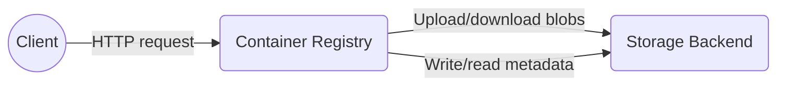
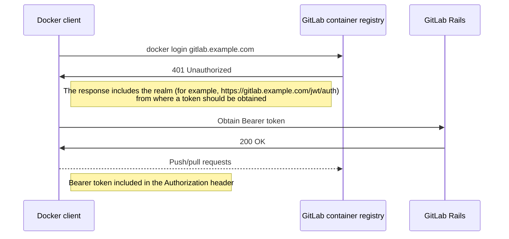
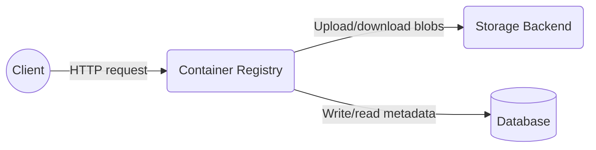

このページには今後予定されている製品・機能・機能性に関する情報が含まれています。ここに示す情報は参考目的のみです。購入・計画の決定にこの情報を使用しないでください。製品・機能・機能性の開発、リリース、タイミングは変更または延期される可能性があり、GitLab Inc. の独自の判断に委ねられています。

<table class="w-full text-sm border-collapse">
<thead>
<tr class="bg-gray-100 text-left">
<th class="px-3 py-2 border border-gray-300">Status</th>
<th class="px-3 py-2 border border-gray-300">Authors</th>
<th class="px-3 py-2 border border-gray-300">Coach</th>
<th class="px-3 py-2 border border-gray-300">DRIs</th>
<th class="px-3 py-2 border border-gray-300">Owning Stage</th>
<th class="px-3 py-2 border border-gray-300">Created</th>
</tr>
</thead>
<tbody>
<tr>
<td class="px-3 py-2 border border-gray-300">implemented</td>
<td class="px-3 py-2 border border-gray-300"><a href="https://gitlab.com/jdrpereira" class="text-blue-600 hover:underline">@jdrpereira</a></td>
<td class="px-3 py-2 border border-gray-300"><a href="https://gitlab.com/glopezfernandez" class="text-blue-600 hover:underline">@glopezfernandez</a></td>
<td class="px-3 py-2 border border-gray-300"><a href="https://gitlab.com/trizzi" class="text-blue-600 hover:underline">@trizzi</a>, <a href="https://gitlab.com/hswimelar" class="text-blue-600 hover:underline">@hswimelar</a></td>
<td class="px-3 py-2 border border-gray-300">~devops::package</td>
<td class="px-3 py-2 border border-gray-300">2020-09-29</td>
</tr>
</tbody>
</table>

## GitLab コンテナレジストリの利用状況

GitLab に統合された[コンテナレジストリ](https://gitlab.com/gitlab-org/container-registry)により、すべての GitLab プロジェクトは Docker イメージを格納する独自のスペースを持つことができます。レジストリを使用して、Docker クライアント、CI/CD、または GitLab API を使用してイメージのビルド、プッシュ、共有ができます。

GitLab.com では毎日、[150k〜200k のイメージがレジストリにプッシュ](https://app.periscopedata.com/app/gitlab/527857/Package-GitLab.com-Stage-Activity-Dashboard?widget=9620193&udv=0)され、約 [700k の API イベント](https://app.periscopedata.com/app/gitlab/527857/Package-GitLab.com-Stage-Activity-Dashboard?widget=7601761&udv=0)が生成されます。一部の顧客は他のレジストリベンダーを使用していますが、[インスタンスの 96% 以上](https://app.periscopedata.com/app/gitlab/527857/Package-GitLab.com-Stage-Activity-Dashboard?widget=9832282&udv=0)が GitLab コンテナレジストリを使用していることも注目に値します。

GitLab.com と GitLab の顧客にとって、コンテナレジストリはソフトウェアのビルドとデプロイに不可欠なコンポーネントです。

## 現在のアーキテクチャ

コンテナレジストリは単一の [Go](https://go.dev/) アプリケーションです。依存しているのは、イメージとメタデータが格納されているストレージバックエンドのみです。

クライアントアプリケーション（例：GitLab Rails や Docker CLI）は、[HTTP API](https://gitlab.com/gitlab-org/container-registry/-/blob/master/docs/spec/gitlab/api.md) を通じてコンテナレジストリと連携します。最も一般的な操作はレジストリへのイメージのプッシュとプルであり、特定の順序での一連の HTTP リクエストが必要です。これらの操作のリクエストフローは[リクエストフロー](https://gitlab.com/gitlab-org/container-registry/-/blob/master/docs/push-pull-request-flow.md)に詳述されています。

レジストリは複数の[ストレージバックエンド](https://gitlab.com/gitlab-org/container-registry/-/blob/master/docs/configuration.md#storage)をサポートしており、GitLab.com レジストリに使用されている Google Cloud Storage (GCS) も含まれます。ストレージバックエンドでは、イメージは blob として格納され、重複排除され、リポジトリ間で共有されます。これらは中央ストレージの場所へのアクセスを提供するために各リポジトリにリンク（シンボリックリンクのように）されます。

リポジトリの名前と階層、イメージマニフェスト、タグもストレージバックエンドに格納され、ネストされたフォルダーとファイルの構造で表されます。[この動画](https://www.youtube.com/watch?v=i5mbF2bgWoM&feature=youtu.be)でレジストリストレージ構造の実用的な概要が説明されています。

### クライアント

コンテナレジストリには、GitLab Rails アプリケーションと Docker クライアント/CLI の 2 つの主要なクライアントがあります。

#### Docker

Docker クライアント（`docker` CLI）は主に [login](https://docs.docker.com/reference/cli/docker/login/)、[push](https://docs.docker.com/reference/cli/docker/image/push/)、[pull](https://docs.docker.com/reference/cli/docker/image/pull/) コマンドを使用して GitLab コンテナレジストリと連携します。

##### ログインと認証

GitLab Rails は GitLab コンテナレジストリのデフォルトのトークンベース認証プロバイダーです。

認証されていない Docker クライアントから送信されたリクエストをレジストリが受信すると、`401 Unauthorized` で応答し、GitLab Rails API からトークンを取得するようクライアントに指示します。Docker クライアントは Bearer トークンをリクエストし、すべてのリクエストの `Authorization` ヘッダーに埋め込みます。提供されたトークンに基づいて、ユーザーがそれらのリクエストを実行する認証/認可があるかどうかを判断する責任はレジストリにあります。

詳細については、[Docker ドキュメント](https://distribution.github.io/distribution/spec/auth/token/)を参照してください。

##### プッシュとプル

プッシュとプルコマンドは、より正確にはマニフェストと blob であるイメージのアップロードとダウンロードに使用されます。プッシュ/プルフローは[ドキュメント](https://gitlab.com/gitlab-org/container-registry/-/blob/master/docs/push-pull-request-flow.md)に記載されています。

#### GitLab Rails

GitLab Rails は HTTP API を通じてレジストリと連携し、その Webhook 通知を受信します。

##### GitLab Rails からレジストリへ

レジストリへの単一エントリーポイントは [HTTP API](https://gitlab.com/gitlab-org/container-registry/-/blob/master/docs/spec/api.md) です。GitLab Rails は以下のすべての操作を実行するために API を呼び出します：

| 操作 | UI | バックグラウンド | 備考 |
| ---- | -- | -------------- | ---- |
| [API バージョン確認](https://gitlab.com/gitlab-org/container-registry/-/blob/master/docs/spec/api.md#api-version-check) | **{check-circle}** Yes | **{check-circle}** Yes | レジストリが Docker Distribution V2 API をサポートしていることを確認するとともに、GitLab Rails が GitLab コンテナレジストリとサードパーティのものと通信しているかを識別するためにグローバルに使用されます（前者でのみ利用可能な機能を切り替えるために使用）。 |
| [リポジトリタグのリスト](https://gitlab.com/gitlab-org/container-registry/-/blob/master/docs/spec/api.md#listing-image-tags) | **{check-circle}** Yes | **{check-circle}** Yes | UI でタグをリストおよび表示するために使用。バックグラウンドで[クリーンアップポリシー](../../../user/packages/container_registry/reduce_container_registry_storage.md#cleanup-policy)と [Geo レプリケーション](../../../administration/geo/replication/container_registry.md)のためにタグをリストするために使用。 |
| [マニフェストの存在確認](https://gitlab.com/gitlab-org/container-registry/-/blob/master/docs/spec/api.md#existing-manifests) | **{check-circle}** Yes | **{dotted-circle}** No | タグでマニフェストのダイジェストを取得するために使用。これはマニフェストをプルして UI でタグの詳細を表示するために使用されます。 |
| [マニフェストのプル](https://gitlab.com/gitlab-org/container-registry/-/blob/master/docs/spec/api.md#pulling-an-image-manifest) | **{check-circle}** Yes | **{dotted-circle}** No | タグの詳細 UI でイメージサイズとマニフェストダイジェストを表示するために使用。 |
| [blob のプル](https://gitlab.com/gitlab-org/container-registry/-/blob/master/docs/spec/api.md#pulling-a-layer) | **{check-circle}** Yes | **{dotted-circle}** No | タグの詳細 UI で設定ダイジェストと作成日を表示するために使用。 |
| [タグの削除](https://gitlab.com/gitlab-org/container-registry/-/blob/master/docs/spec/api.md#delete-tag) | **{check-circle}** Yes | **{check-circle}** Yes | UI からタグを削除し、バックグラウンド（クリーンアップポリシー）で使用。 |

有効な認証トークンが GitLab Rails で生成され、レジストリに送信する前にこれらすべてのリクエストに埋め込まれます。

##### レジストリから GitLab Rails へ

レジストリは、イメージのプッシュなどイベントが発生したときに外部アプリケーションに通知するために [Webhook 通知](https://distribution.github.io/distribution/about/notifications/)をサポートしています。

GitLab では、レジストリは現在、GitLab Rails API にイメージプッシュイベントの通知を配信するように[設定](https://gitlab.com/gitlab-org/container-registry/-/blob/master/docs/configuration.md#notifications)されています。これらの通知は現在、Snowplow メトリクスと Geo レプリケーションに使用されています。

### 課題

#### ガベージコレクション

コンテナレジストリはオフラインの*マーク*と*スウィープ*ガベージコレクション（GC）アルゴリズムに依存しています。実行するには、GC 実行全体の間、レジストリをシャットダウンするか読み取り専用にする必要があります。

*マーク*フェーズでは、レジストリはすべてのリポジトリを分析し、各リポジトリで参照/リンクされている設定、レイヤー、マニフェストのリストを作成します。その後、レジストリはすべての既存の設定、レイヤー、マニフェスト（集中的に格納されている）をリストし、どのリポジトリでも参照/リンクされていないもののリストを取得します。これが削除対象の blob のリストです。

*スウィープ*フェーズでは、*マーク*フェーズの出力を手元に、レジストリは削除対象として特定されたすべての blob をループし、ストレージバックエンドから一つずつ削除します。

巨大なレジストリにこれを行うと、複数時間/日かかる可能性があり、その間レジストリは読み取り専用モードのままでなければなりません。これは GitLab.com などの厳しい可用性要件を持つプラットフォームには実現不可能です。

この制限は、上流の [Docker Distribution ドキュメント](https://github.com/distribution/distribution/blob/749f6afb4572201e3c37325d0ffedb6f32be8950/ROADMAP.md#deletes)にも記載されています。

#### パフォーマンス

現在のアーキテクチャとリポジトリおよびイメージメタデータを格納するための（場合によってはリモートの）ストレージバックエンドへの依存性により、リポジトリやタグのリストアップなどの最も基本的な操作でさえ非常に遅くなる可能性があり、レジストリが大きくなるにつれてさらに悪化します。

例えば、どのリポジトリが存在するかを判断するには、レジストリはストレージバックエンドのすべてのフォルダーをウォークスルーしてリポジトリを特定する必要があります。すべての既存のフォルダーが訪問された後にのみ、レジストリはリポジトリのリストでクライアントに応答できます。リモートストレージバックエンド（GCS や S3 など）を使用している場合、パフォーマンスはさらに悪化します。訪問したフォルダーごとにコンテンツをリストして検査するために複数の HTTP リクエストが必要になるためです。

#### 一貫性

S3 などの一部のストレージバックエンドは[最終的一貫性](https://docs.aws.amazon.com/AmazonS3/latest/dev/Introduction.html#ConsistencyModel)しか提供できません。例えば、削除後に blob を読み取ると、短時間は成功する可能性があります。最終的一貫性はオンラインガベージコレクションと組み合わせた場合に問題になる可能性があります。削除された blob に対して API レベルの読み取りリクエストが短時間成功し続ける可能性があるためです。

#### インサイト

上述と同様の理由から、現在はレジストリからリポジトリが使用しているスペース、最もスペースを使用しているリポジトリ、より活発なリポジトリ、各イメージやタグの詳細なプッシュ/プルメトリクスなど、価値ある情報を抽出することは実現不可能です。これらのインサイトとメトリクスにアクセスできないことは、製品戦略に関する情報に基づいた意思決定を行う能力を大きく弱めます。

#### 追加機能

メタデータの制限により、[ページネーション](https://gitlab.com/gitlab-org/container-registry/-/issues/13#note_271769891)、HTTP API のフィルタリングとソート、[Docker と Helm チャートイメージを区別する](https://gitlab.com/gitlab-org/gitlab/-/issues/38047)機能などの価値ある機能を実装することは現在実現不可能です。

これらすべての制約のために、これらの基本的な制限をすべて克服するためのソリューションが整うまで[新しい機能の開発を凍結](https://gitlab.com/gitlab-org/container-registry/-/issues/44)することを決定しました。

## 新しいアーキテクチャ

上述のすべての課題を克服するために、ストレージバックエンドからレジストリメタデータ（blob、リポジトリのリスト、各リポジトリで参照/リンクされているマニフェスト/レイヤー）を [PostgreSQL データベース](#database)に移行する取り組みを始めました。

新しいアーキテクチャの究極の目標はオンラインガベージコレクション（[&2313](https://gitlab.com/groups/gitlab-org/-/epics/2313)）を可能にすることですが、データベースが整備されると、メタデータの制限によってブロックされていたすべての機能も実装できるようになります。既存の API のパフォーマンスも大幅に向上する見込みです。

データベースの導入はレジストリアーキテクチャに影響を与え、関与するコンポーネントが一つ増えます：

データベースが整備されると、レジストリはストレージバックエンドを使用してメタデータの書き込みと読み取りを行わなくなります。代わりに、メタデータは PostgreSQL データベースに格納・操作されます。ストレージバックエンドは blob のアップロードとダウンロードにのみ使用されます。

GitLab Rails や Docker クライアントを含むクライアントとレジストリの連携は、[現在のアーキテクチャ](#current-architecture)セクションに記載されているとおり変更されません。アーキテクチャの変更とデータベースは内部のみです。レジストリの HTTP API と Webhook 通知も変更されません。

### データベース

GitLab の [Go 標準とスタイルガイドライン](https://docs.gitlab.com/ee/development/go_guide/)に従い、ORM は使用せず、Go 標準ライブラリの [`database/sql`](https://pkg.go.dev/database/sql) パッケージ、PostgreSQL ドライバー（[`lib/pq`](https://pkg.go.dev/github.com/lib/pq)）、TCP 接続プール経由の生の SQL クエリのみを使用します。

レジストリデータベースの設計と開発は、GitLab の[データベースガイドライン](../../../development/database/index.md)に準拠します。Go アプリケーションであるため、データベースの移行の実行などをサポートするための必要なツールを開発する必要があります。

レジストリ CLI によって*オンライン*および[*ポストデプロイメント*](https://docs.gitlab.com/ee/development/database/post_deployment_migrations.html)マイグレーションの実行はすでにサポートされており、[ドキュメント](https://gitlab.com/gitlab-org/container-registry/-/blob/master/docs/database-migrations.md)に記載されています。

#### パーティショニング

レジストリデータベースは、より高いパフォーマンス（処理対象のデータ量を制限し並列実行を可能にする）、保守の容易さ（テーブルとインデックスを小さな単位に分割する）、高可用性（パーティションの独立性により）を実現するために最初からパーティショニングされます。最初からデータベースをパーティショニングすることで、必要に応じて後でシャーディングの実装も容易になります。

blob はリポジトリ間で共有されていますが、マニフェストとタグのメタデータはリポジトリによってスコープされています。これは API レベルでも見られ、すべての書き込みと読み取りリクエスト（[リポジトリのリスト](https://gitlab.com/gitlab-org/container-registry/-/blob/a113d0f0ab29b49cf88e173ee871893a9fc56a90/docs/spec/api.md#listing-repositories)を除く）はリポジトリによってスコープされており、その名前空間はリクエスト URI の一部です。このため、[アクセスパターンを特定した](https://gitlab.com/gitlab-org/gitlab/-/issues/234255)後、マニフェストとタグをリポジトリでパーティショニングし、blob をダイジェストでパーティショニングすることを決定しました。これにより、ルックアップは常にパーティションキーで実行され、最適なパフォーマンスが得られます。パーティション化されたスキーマの最初のバージョンは[マージリクエスト](https://gitlab.com/gitlab-com/www-gitlab-com/-/merge_requests/60918)に記録されました。

#### GitLab.com

スケール、パフォーマンス、分離の懸念から、GitLab.com ではレジストリデータベースは専用の個別の PostgreSQL クラスター上に置かれます。追加のコンテキストについては [#93](https://gitlab.com/gitlab-org/container-registry/-/issues/93) と [GitLab-com/gl-infra/reliability#10109](https://gitlab.com/gitlab-com/gl-infra/reliability/-/issues/10109) を参照してください。

以下の図はデータベースクラスターのアーキテクチャを示しています：

##### 予想されるレートとサイズ要件

GitLab.com データベースの[レート](https://gitlab.com/gitlab-org/container-registry/-/issues/94)と[サイズ](https://gitlab.com/gitlab-org/container-registry/-/issues/61#note_446609886)要件は `dev.gitlab.org` レジストリに基づいて推定されており、リンクされた Issue で確認できます。

#### セルフマネージドインスタンス

デフォルトでは、セルフマネージドインスタンスの場合、レジストリは GitLab データベースと同じ PostgreSQL インスタンス/クラスターに個別の論理データベースを持ちます。ただし、必要に応じてレジストリを別のインスタンス/クラスターを使用するように設定することも可能です。

#### PostgreSQL

[初期データベーススキーマ](https://gitlab.com/gitlab-org/gitlab/-/issues/207147)の議論の際、以下の主な理由から他のデータベースエンジンよりも PostgreSQL を選択することを決定しました：

- RDBMS の ACID 保証やパーティショニングを含む必要なすべての機能を提供している。
- すでに GitLab に使用されているため、管理するための必要な経験とツールが整っている。
- GitLab のためにすでに所持している同じ PostgreSQL インスタンスにレジストリデータベースをホストする可能性をセルフマネージドの顧客に提供したい。

##### バージョン 12

PostgreSQL は[バージョン 12](https://www.postgresql.org/docs/12/release-12.html#id-1.11.6.9.5) でパーティショニングに大幅な改善を加えました。特に注目すべき点：

- 外部キーがパーティション化テーブルを参照できるようになりました。これは一貫性と整合性を保証するだけでなく、データベースレベルでのカスケード削除を可能にするためにこのプロジェクトの必須要件です。
- 挿入、選択、更新のパフォーマンスが大幅に改善され、ロックが減少し、多数のパーティションでも一貫したパフォーマンスが得られます（[ベンチマーク](https://www.enterprisedb.com/blog/postgresql-12-partitioning-now-faster)）。
- 多数のパーティションを持つテーブルの計画アルゴリズムが大幅に改善され、テストによっては最大 10,000 倍の高速化が見られます（[ソース](https://aws.amazon.com/blogs/database/postgresql-12-a-deep-dive-into-some-new-functionality/)）。
- 既存のテーブルに新しいパーティションをアタッチする際にテーブル全体をロックする必要がなくなりました。
- バルクロード（`COPY`）は 1 行ずつ挿入する代わりにバルク挿入を使用するようになりました。

これらの機能とパフォーマンス改善を活用するには、最初から PostgreSQL 12 を使用する必要があります。GitLab 14.0 以降はセルフマネージドインスタンスに [PostgreSQL 12 が付属](https://docs.gitlab.com/ee/administration/package_information/postgresql_versions.html)しています。PostgreSQL 12 にアップグレードできない顧客には 2 つのオプションがあります：

- 管理者はレジストリ用に別の PostgreSQL 12 データベースを手動でプロビジョニングして設定できます。これにより、新しいレジストリとそのメタデータデータベースが提供する機能の恩恵を受けることができます。
- オンラインガベージコレクションが問題にならない場合や、個別のデータベースのプロビジョニングが不可能な場合は、データベースなしで現在のレジストリを引き続き使用できます。GitLab はセキュリティバックポートとバグ修正を含む現在のバージョンをサポートしています。

オンラインガベージコレクションのほかに、メタデータデータベースの利用可能性により、GitLab コンテナレジストリのリクエストされた多くの機能の実装がアンブロックされます。これらの機能は、メタデータデータベースによってバックアップされた新しいバージョンを使用するインスタンスでのみ利用可能です。

### 可用性

認証サービスと blob ストレージバックエンドのほかに、新しいアーキテクチャによりレジストリはもう一つの依存関係（データベース）を持ちます。レジストリはその依存関係と同程度しか信頼できないため、データベースのデプロイメントは高可用性で計画される必要があります。段階的な移行アプローチは、高可用性環境における実装とリソースの制約を特定し軽減するのに役立つはずです。

#### HTTP API

これはすべてのレジストリ HTTP API 操作のリストと、ストレージバックエンドと新しいデータベースへの依存関係を示しています。リクエストを処理する際に依存関係が利用できない場合、レジストリはエラーレスポンスを返します。

| 操作 | メソッド | パス | データベース必須 | ストレージ必須 | GitLab Rails が使用 * |
|------|---------|------|----------------|--------------|---------------------|
| [API バージョン確認](https://gitlab.com/gitlab-org/container-registry/-/blob/master/docs/spec/api.md#api-version-check) | `GET` | `/v2/` | **{dotted-circle}** No | **{dotted-circle}** No | **{check-circle}** Yes |
| [リポジトリのリスト](https://gitlab.com/gitlab-org/container-registry/-/blob/master/docs/spec/api.md#listing-repositories) | `GET` | `/v2/_catalog` | **{check-circle}** Yes | **{dotted-circle}** No | **{dotted-circle}** No |
| [リポジトリタグのリスト](https://gitlab.com/gitlab-org/container-registry/-/blob/master/docs/spec/api.md#listing-image-tags) | `GET` | `/v2/<name>/tags/list` | **{check-circle}** Yes | **{dotted-circle}** No | **{check-circle}** Yes |
| [タグの削除](https://gitlab.com/gitlab-org/container-registry/-/blob/master/docs/spec/api.md#delete-tag) | `DELETE` | `/v2/<name>/manifests/<reference>` | **{check-circle}** Yes | **{dotted-circle}** No | **{check-circle}** Yes |
| [マニフェストの存在確認](https://gitlab.com/gitlab-org/container-registry/-/blob/master/docs/spec/api.md#existing-manifests) | `HEAD` | `/v2/<name>/manifests/<reference>` | **{check-circle}** Yes | **{dotted-circle}** No | **{check-circle}** Yes |
| [マニフェストのプル](https://gitlab.com/gitlab-org/container-registry/-/blob/master/docs/spec/api.md#pulling-an-image-manifest) | `GET` | `/v2/<name>/manifests/<reference>` | **{check-circle}** Yes | **{dotted-circle}** No | **{check-circle}** Yes |
| [マニフェストのプッシュ](https://gitlab.com/gitlab-org/container-registry/-/blob/master/docs/spec/api.md#pushing-an-image-manifest) | `PUT` | `/v2/<name>/manifests/<reference>` | **{check-circle}** Yes | **{dotted-circle}** No | **{dotted-circle}** No |
| [マニフェストの削除](https://gitlab.com/gitlab-org/container-registry/-/blob/master/docs/spec/api.md#deleting-an-image) | `DELETE` | `/v2/<name>/manifests/<reference>` | **{check-circle}** Yes | **{dotted-circle}** No | **{dotted-circle}** No |
| [blob の存在確認](https://gitlab.com/gitlab-org/container-registry/-/blob/master/docs/spec/api.md#existing-layers) | `HEAD` | `/v2/<name>/blobs/<digest>` | **{check-circle}** Yes | **{dotted-circle}** No | **{dotted-circle}** No |
| [blob のプル](https://gitlab.com/gitlab-org/container-registry/-/blob/master/docs/spec/api.md#fetch-blob) | `GET` | `/v2/<name>/blobs/<digest>` | **{check-circle}** Yes | **{check-circle}** Yes | **{check-circle}** Yes |
| [blob の削除](https://gitlab.com/gitlab-org/container-registry/-/blob/master/docs/spec/api.md#delete-blob) | `DELETE` | `/v2/<name>/blobs/<digest>` | **{check-circle}** Yes | **{dotted-circle}** No | **{dotted-circle}** No |
| [blob アップロード開始](https://gitlab.com/gitlab-org/container-registry/-/blob/master/docs/spec/api.md#starting-an-upload) | `POST` | `/v2/<name>/blobs/uploads/` | **{check-circle}** Yes | **{check-circle}** Yes | **{dotted-circle}** No |
| [blob アップロード状態確認](https://gitlab.com/gitlab-org/container-registry/-/blob/master/docs/spec/api.md#get-blob-upload) | `GET` | `/v2/<name>/blobs/uploads/<uuid>` | **{check-circle}** Yes | **{check-circle}** Yes | **{dotted-circle}** No |
| [blob チャンクプッシュ](https://gitlab.com/gitlab-org/container-registry/-/blob/master/docs/spec/api.md#chunked-upload-1) | `PATCH` | `/v2/<name>/blobs/uploads/<uuid>` | **{check-circle}** Yes | **{check-circle}** Yes | **{dotted-circle}** No |
| [blob アップロード完了](https://gitlab.com/gitlab-org/container-registry/-/blob/master/docs/spec/api.md#put-blob-upload) | `PUT` | `/v2/<name>/blobs/uploads/<uuid>` | **{check-circle}** Yes | **{check-circle}** Yes | **{dotted-circle}** No |
| [blob アップロードキャンセル](https://gitlab.com/gitlab-org/container-registry/-/blob/master/docs/spec/api.md#canceling-an-upload) | `DELETE` | `/v2/<name>/blobs/uploads/<uuid>` | **{check-circle}** Yes | **{check-circle}** Yes | **{dotted-circle}** No |

`*` 理由と方法については[レジストリと Rails の連携リスト](#from-gitlab-rails-to-registry)を参照してください。

#### 障害シナリオ

データベースの追加により、考えられる障害シナリオ、そのような状況でレジストリがどのように動作することが期待されるか、レジストリの可用性と機能への影響を強調することが不可欠です。

##### データベースのフェイルオーバー

フェイルオーバーシナリオ中に発生する可能性がある、データベースへの接続を試みる際の接続拒否またはタイムアウトの場合、レジストリは壊れた接続を事前に破棄し、プールからすぐに新しい接続を開こうとします。

このシナリオでアプリケーションはパニックしません。すべてのリクエストに対して新しい接続を確立しようとします。失敗した場合、HTTP `503 Service Unavailable` エラーがクライアントに返され、エラーはログに記録されて Sentry に報告されます。リトライのサイクルはありません。レジストリはデータベースへのアクセスが必要な別のリクエストを受信した場合にのみ新しい接続を確立しようとします。

また、設定可能な間隔としきい値を持つ TCP ヘルスチェッカーを使用してデータベースサーバーの健全性を定期的にチェックするようにレジストリを設定することも可能です（[ドキュメント](https://gitlab.com/gitlab-org/container-registry/-/blob/master/docs/configuration.md#tcp)）。ヘルスチェックが失敗した場合、受信リクエストは HTTP `503 Service Unavailable` エラーで停止します。

データベースサーバーが再び利用可能になると、レジストリは次の受信リクエストで正常に再接続し、人間の介入なしに完全な API 機能を回復します。

予想されるレジストリの動作は、フェイルオーバーシナリオをシミュレートするためにレジストリとデータベースサーバーの間でプログラム可能な TCP プロキシを使用した統合テストでカバーされます。

##### 接続プールの飽和

特定のリクエストを処理するためにプールから接続を引き出せない場合、レジストリはタイムアウトし、クライアントに HTTP `500 Internal Server Error` エラーを返してエラーを Sentry に報告します。これらの問題は、プールが枯渇している理由を調査するための開発エスカレーションをトリガーする必要があります。事前設定されたプールサイズに対して負荷が多すぎるか、接続を長時間保持するトランザクションがある可能性があります。

Prometheus メトリクスは、アプリケーションがエラーを返し始める前に可能な飽和に対して対処するためのアラートを作成するために使用される必要があります。新しいレジストリノード上で GitLab.com レジストリを段階的に移行する際、限定的、段階的、制御された露出が行われます。このプロセス中、使用パターンを特定し、メトリクスを観察し、負荷が増加するにつれてインフラとアプリケーション設定の両方を適切に調整できます。必要に応じて、レート制限アルゴリズムを適用して影響を制限することができます。決定は過剰に制限的な措置や早期最適化を避けるために実際のデータに基づいて行われます。

予想されるレジストリの動作は、プールサイズを操作し API に対して複数の並行リクエストを生成してプールに圧力をかけ最終的にその容量を枯渇させる統合テストでカバーされます。

##### レイテンシー

確立された接続での過度のレイテンシーは、典型的な状況ではアプリケーションエラーやネットワークタイムアウトを引き起こさない場合があるため、検出とデバッグが困難ですが、通常はそれらの前兆です。

このため、HTTP API リクエストを処理するために使用されるデータベースクエリの時間はメトリクスを使用してインストルメント化される必要があります。これにより、異常な変動を検出し、過度のレイテンシーがタイムアウトやサービス不可用になる前に適宜アラームをトリガーできます。

予想されるレジストリの動作は、増加するレイテンシーシナリオをシミュレートするためにレジストリとデータベースサーバーの間でプログラム可能な TCP プロキシを使用した統合テストでカバーされます。

##### 問題のあるマイグレーション

異常なネットワークとシステムの状態のほかに、問題のあるマイグレーションとデータの障害もデータベースの可用性に影響を与え、結果的にレジストリの可用性に影響を与える可能性があります。

データベースマイグレーションは、GitLab Rails に使用されているものと同じ[開発のベストプラクティス](../../../development/database/index.md)に準拠しますが、Rails 固有のメソッドとツールは除きます。レジストリは ORM のない Go アプリケーションであり、マイグレーションは生の SQL ステートメントで表現されます。それにもかかわらず、すべての変更はデータベースチームのレビューと承認が必要です。

データベースマイグレーションは冪等性を持ち、必要に応じてガード節が使用されます。また、前方互換性を保証することも意図しています。クラスター環境では、レジストリバージョン `N` を実行しているノードは、データベーススキーマがバージョン `N`+1 の場合でも問題を引き起こさないようにする必要があります。

### 可観測性

システムに一つ以上のコンポーネントを追加することで、レジストリの動作とその依存関係に対する適切な可観測性を保証することがさらに重要になります。新しいメタデータデータベースによってバックアップされた新しいレジストリを展開する前に、必要なすべてのツールが整っていることを保証する必要があります。

この目的のために、[Sentry でのエラーレポート](https://gitlab.com/gitlab-com/gl-infra/reliability/-/issues/11297)、[改善された構造化ログ](https://gitlab.com/gitlab-com/gl-infra/reliability/-/issues/10933)、[改善された HTTP メトリクス](https://gitlab.com/gitlab-com/gl-infra/reliability/-/issues/10935)がすでに実装されリリースされています。この文書の作成時点では、GitLab.com の展開が進行中です。

さらに、Prometheus メトリクスは[データベース接続プールの詳細](https://gitlab.com/gitlab-org/container-registry/-/issues/238)で補完されます。これらは、既存の HTTP API、デプロイメント、ストレージメトリクスとともに、レジストリ Grafana ダッシュボードに追加されます。レジストリのデータベースクラスターにも[メトリクスとアラート](https://gitlab.com/gitlab-com/gl-infra/reliability/-/issues/11447)が設定されます。

これらのリソースは総合して、レジストリのパフォーマンスと動作に対する適切なレベルの洞察を提供するはずです。

### 新機能と破壊的変更

#### サードパーティのコンテナレジストリ

GitLab はデフォルトで GitLab コンテナレジストリとともに出荷されますが、[Docker Distribution V2 仕様](https://distribution.github.io/distribution/spec/api/)に準拠している限り、現在は [Open Container Initiative (OCI) Image Specification](https://github.com/opencontainers/image-spec/blob/main/spec.md) に取って代わられていますが、サードパーティのレジストリとも互換性があります。

これまで、新しい機能を追加する際にサードパーティのレジストリとの完全な互換性を維持しようとしてきました。例えば、12.8 では、基になるマニフェストを削除せずに単一のタグを削除するための新しい[タグ削除機能](https://gitlab.com/gitlab-org/gitlab/-/merge_requests/23325)を導入しましたが、この機能は Docker または OCI 仕様の一部ではないため、サードパーティのレジストリとの互換性を維持するために以前の動作をフォールバックオプションとして保持しています。

しかし、これは将来的に変わる可能性があります。オンラインガベージコレクションのほかに、[課題](#challenges)に記載されているように、メタデータデータベースは中期/長期的に GitLab コンテナレジストリのリクエストされた多くの機能の実装をアンブロックします。これらの機能のほとんどは GitLab コンテナレジストリを使用するインスタンスでのみ利用可能になります。Docker Distribution や OCI 仕様の一部ではなく、互換性のあるフォールバックオプションを提供することもできません。

このため、GitLab コンテナレジストリの使用が必要な機能は、サードパーティのレジストリが引き続きサポートされている限り、サードパーティのレジストリを使用している場合は無効になります。

#### GitLab Rails との変更の同期

現在、GitLab Rails と GitLab コンテナレジストリのリリースとデプロイメントは完全に独立しています。説明されたタグ削除機能を除いて、新しい API 機能や破壊的変更を導入していないためです。

レジストリは GitLab Rails の変更から独立したままになりますが、中期/長期的には、新しい機能や破壊的変更の実装は GitLab Rails の対応する変更を伴い、後者は特定の最小バージョンのレジストリに依存するようになります。

例えば、各リポジトリのサイズを追跡するために、メタデータデータベースを拡張してその情報を格納し、GitLab Rails が消費する HTTP API を拡張してそれを GitLab Rails に伝播させることができます。GitLab Rails では、この新しい情報はそのデータベースに格納され、UI/API レベルで新しい機能を提供するために処理されます。

このような変更は、GitLab Rails と GitLab コンテナレジストリのリリースとデプロイメント間の同期が必要であり、前者は後者の特定のバージョンに依存するためです。

##### フィーチャートグリング

特定のバージョンのレジストリに依存するすべての GitLab Rails 機能は、レジストリのベンダーとバージョンを検証することで保護される必要があります。

これはすでに、タグを新しいタグ削除機能（GitLab コンテナレジストリ v2.8.1+ でのみ利用可能）を使用して削除するか、古い方法で削除するかを決定するために行われています。この場合、GitLab Rails はレジストリのタグルートに `OPTIONS` リクエストを送信して、`DELETE` メソッドがサポートされているかどうかを確認します。

または、普遍的な長期的ソリューションとして、レジストリのベンダー、バージョン、サポートされている機能（最後の 2 つはベンダーが GitLab の場合のみ適用）を確認し、GitLab Rails データベースに持続させる必要があります。この情報は、機能を切り替えたり、可能であれば代替方法にフォールバックしたりするためにリアルタイムで使用できます。このアプローチの初期実装は [#204839](https://gitlab.com/gitlab-org/gitlab/-/issues/204839) の一部として導入されました。現在は、メトリクス目的でのみ使用されています。レジストリがホットスワップされる可能性があるセルフマネージドインスタンスでバージョン情報が最新の状態に保たれることを保証するためにさらなる改善が必要です。

##### リリースとデプロイメント

上述のように、フィーチャートグリングは非同期のリリースとデプロイメントに対する最後の防御線を提供し、新しい機能をサポートするレジストリバージョンがまだ利用可能でない場合でも GitLab Rails が機能し続けることを保証します。

しかし、GitLab Rails と GitLab コンテナレジストリのリリースとデプロイメントは、遅延を避けるために同期させる必要があります。GitLab Rails とは異なり、レジストリのリリースとデプロイメントは手動プロセスであるため、GitLab Rails の変更が対応するレジストリの変更の後にのみリリースされてデプロイされることをメンテナーが確認するために特別な注意が必要です。

このプロセスを強化するソリューションとして、GitLab Rails コードベースにファイルを追加し、必要なレジストリの最小バージョンを含めることができます。このファイルは、特定のバージョンのレジストリに依存するすべての変更ととともに更新される必要があります。GitLab Rails をリリースしてデプロイする際も考慮する必要があり、指定された最小必要なレジストリバージョンがデプロイされた後にのみパイプラインが進むことを確認します。

## イテレーション

1. メタデータデータベーススキーマの設計。
1. データベースを使用したメタデータ管理のサポートの追加。
1. 小規模、中規模、大規模なリポジトリの移行を容易にする計画とツールの設計。
1. オンラインガベージコレクションの実装。
1. GitLab.com のステージングと本番のデータベースクラスターの作成。
1. GitLab.com 向けの自動デプロイメントパイプラインの作成。
1. GitLab.com 向けの既存レジストリのデプロイメントと段階的な移行。
1. セルフマネージドインストールへのメタデータデータベースのサポートのロールアウト。

すべてのタスクの詳細リストおよび定期的な進捗状況の更新は、エピック [&2313](https://gitlab.com/groups/gitlab-org/-/epics/2313) にあります。

## 関連リンク

- [管理者がゼロダウンタイムでガベージコレクションを実行できるようにする](https://gitlab.com/groups/gitlab-org/-/epics/2313)
- [継続的なオンデマンドオンラインガベージコレクションの提案](https://gitlab.com/gitlab-org/container-registry/-/issues/199)
- [GitLab.com コンテナレジストリの段階的移行提案](https://gitlab.com/gitlab-org/container-registry/-/issues/191)
- [セルフサービスレジストリデプロイメントの作成](https://gitlab.com/groups/gitlab-com/gl-infra/-/epics/316)
- [コンテナレジストリ用データベースクラスター](https://gitlab.com/gitlab-com/gl-infra/reliability/-/issues/11154)
