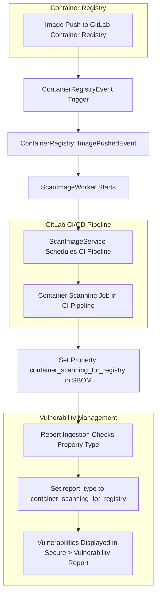

このページには今後予定されている製品・機能・機能性に関する情報が含まれています。ここに示す情報は参考目的のみです。購入・計画の決定にこの情報を使用しないでください。製品・機能・機能性の開発、リリース、タイミングは変更または延期される可能性があり、GitLab Inc. の独自の判断に委ねられています。

<table class="w-full text-sm border-collapse">
<thead>
<tr class="bg-gray-100 text-left">
<th class="px-3 py-2 border border-gray-300">Status</th>
<th class="px-3 py-2 border border-gray-300">Authors</th>
<th class="px-3 py-2 border border-gray-300">Coach</th>
<th class="px-3 py-2 border border-gray-300">DRIs</th>
<th class="px-3 py-2 border border-gray-300">Owning Stage</th>
<th class="px-3 py-2 border border-gray-300">Created</th>
</tr>
</thead>
<tbody>
<tr>
<td class="px-3 py-2 border border-gray-300">implemented</td>
<td class="px-3 py-2 border border-gray-300"><a href="https://gitlab.com/atiwari71" class="text-blue-600 hover:underline">@atiwari71</a></td>
<td class="px-3 py-2 border border-gray-300"></td>
<td class="px-3 py-2 border border-gray-300"></td>
<td class="px-3 py-2 border border-gray-300">~devops::secure</td>
<td class="px-3 py-2 border border-gray-300">2024-07-31</td>
</tr>
</tbody>
</table>

## サマリー

[レジストリ向けコンテナスキャン](https://docs.gitlab.com/ee/user/application_security/container_scanning/#container-scanning-for-registry)機能は、新しいイメージが [GitLab コンテナレジストリ](https://docs.gitlab.com/ee/user/packages/container_registry/)にプッシュされるたびに、コンテナスキャンジョブを自動的に実行できるようにします。この機能は、開発プロセスの早い段階でコンテナイメージの脆弱性を特定するのに役立ちます。

## 動機

コンテナスキャンはパイプラインの実行時に Docker イメージが作成されるときにスキャンします。イメージはその後 GitLab コンテナレジストリに保存され、本番環境に展開される安定したイメージとして他のパイプラインやデプロイメントプロセスで再利用できます。

コード変更がない場合でも、例えば未知の脆弱性が公開された場合など、セキュリティの状態はいつでも変わる可能性があります。

開発者とセキュリティチームは、GitLab コンテナレジストリに保存されているイメージの現在のセキュリティ状態を知る必要があります。アドバイザリデータベースが更新されると、既存のイメージに新しい脆弱性が適用されるタイミングを知る必要があります。同様に、新しいイメージがレジストリにプッシュされたときに新しい脆弱性が導入されるタイミングも知る必要があります。

## 目標

レジストリ向けコンテナスキャン機能の主な目標は、スキャンプロセスを自動化することでコンテナ化されたアプリケーションのセキュリティを向上させることです。これには以下が含まれます：

1. **検出プロセスの自動化**: GitLab コンテナレジストリにプッシュされたすべての新しいイメージが自動的に脆弱性スキャンされることを確保する。
2. **脆弱性の早期特定**: 脆弱性が導入されたらすぐに検出して報告する。
3. **コンテナスキャンの採用促進**: `.gitlab-ci.yml` 設定ファイルに CI ジョブを設定せずにコンテナスキャンを実行できるようにする。パイプラインを実行するためには動作するランナーが引き続き必要です。
4. **包括的なビューの提供**: 脆弱性レポートページの専用タブを通じてアクセス可能な脆弱性の詳細なビューを提供する。

## 設計と実装の詳細

### 動作方法

1. **トリガー**: 新しいイメージが GitLab コンテナレジストリにプッシュされると、コンテナスキャンジョブを含む CI パイプラインが自動的に作成されます。
2. **レポート生成**: このジョブによって生成されたレポートはレポートタイプ `container_scanning_for_registry` でマークされます。
3. **脆弱性レポート**: このジョブによって特定された脆弱性は `セキュア > 脆弱性レポート` ページの `コンテナレジストリの脆弱性` タブに表示されます。

### 実装の詳細

#### イベントトリガー

- **イベントクラス**: 新しいイメージがコンテナレジストリにプッシュされると、`ContainerRegistryEvent` クラスを使用してイベントが発火されます。
  - **ソースコード**: [ContainerRegistryEvent](https://gitlab.com/gitlab-org/gitlab/-/blob/415e8c1c144bd3b3fa42637ca93d3aa5fcc1f34d/lib/api/container_registry_event.rb#L5)

#### イメージプッシュイベント

- **条件**: イメージタグがサポートされているタグであり、必要な権限とライセンスが存在し、プロジェクトごとにスキャンされるイメージ数の 50 のレート制限を超えていない場合、`ContainerRegistry::ImagePushedEvent` という別のイベントを公開します。
  - **ソースコード**: [ImagePushedEvent](https://gitlab.com/gitlab-org/gitlab/-/blob/415e8c1c144bd3b3fa42637ca93d3aa5fcc1f34d/ee/lib/ee/gitlab/event_store.rb#L63)

#### CI パイプラインの作成

- **ワーカー**: `ImagePushedEvent` が `ScanImageWorker` をトリガーし、`ScanImageService` 経由で CI パイプラインをスケジュールします。
  - **ソースコード**: [ScanImageService](https://gitlab.com/gitlab-org/gitlab/-/blob/415e8c1c144bd3b3fa42637ca93d3aa5fcc1f34d/ee/app/services/app_sec/container_scanning/scan_image_service.rb#L28)

#### コンテナスキャンツールの設定

- **環境変数**: CI 環境変数 `REGISTRY_TRIGGERED: true` に基づいて、コンテナスキャンツールは SBOM（Software Bill of Materials）内の GitLab プロパティ名を `container_scanning_for_registry` に設定します。
  - **ソースコード**: [SBOM Converter](https://gitlab.com/gitlab-org/security-products/analyzers/container-scanning/-/blob/7257a06e4507c77ae50c4926e79142e2689e1fca/lib/gcs/sbom_converter.rb#L14)

#### レポートの取り込み

- **プロパティチェック**: レポートの取り込み中、システムはプロパティタイプを確認し、`sbom_occurrence.source_type` を `container_scanning_for_registry` に設定します。
  - **ソースコード**: [CycloneDX Properties Parser](https://gitlab.com/gitlab-org/gitlab/-/blob/415e8c1c144bd3b3fa42637ca93d3aa5fcc1f34d/lib/gitlab/ci/parsers/sbom/cyclonedx_properties.rb#L21)

#### 脆弱性の作成

- **レポートタイプ**: 脆弱性の作成中、`sbom_occurrence.source_type` に基づいて `vulnerability#report_type` が `container_scanning_for_registry` に設定されます。このレポートタイプフィルターはフロントエンドがこれらの脆弱性を他のタイプと区別するために使用します。
  - **ソースコード**: [ContainerScanning FindingBuilder](https://gitlab.com/gitlab-org/gitlab/-/blob/415e8c1c144bd3b3fa42637ca93d3aa5fcc1f34d/ee/lib/gitlab/vulnerability_scanning/container_scanning/finding_builder.rb#L21)

## アーキテクチャ図

この図は、イメージがレジストリにプッシュされた瞬間から、イベント処理と CI パイプラインを経て、脆弱性のレポートと表示までのフローをキャプチャしています。各ステップで関与するさまざまなクラスとサービスが強調表示され、アーキテクチャの明確な概要が提供されています。

### 図の概要

1. **イメージプッシュイベント**:
   - 新しいイメージが GitLab コンテナレジストリにプッシュされたとき。

2. **ContainerRegistryEvent トリガー**:
   - `ContainerRegistryEvent` クラスがイベントを発火させます。

3. **ContainerRegistry::ImagePushedEvent**:
   - イメージタグがサポートされていて権限が有効な場合、`ContainerRegistry::ImagePushedEvent` をトリガーします。

4. **ScanImageWorker**:
   - `ImagePushedEvent` が `ScanImageWorker` を開始します。

5. **ScanImageService**:
   - `ScanImageWorker` が `ScanImageService` 経由で CI パイプラインをスケジュールします。

6. **コンテナスキャンジョブ**:
   - CI パイプラインにコンテナスキャンジョブが含まれます。

7. **SBOM 設定**:
   - `REGISTRY_TRIGGERED: true` に基づいて、プロパティ `container_scanning_for_registry` を設定します。

8. **レポートの取り込み**:
   - 取り込み中に `report_type` を `container_scanning_for_registry` に設定します。

9. **脆弱性レポート**:
   - 脆弱性は **コンテナレジストリの脆弱性** タブの **セキュア > 脆弱性レポート** ページに表示されます。
