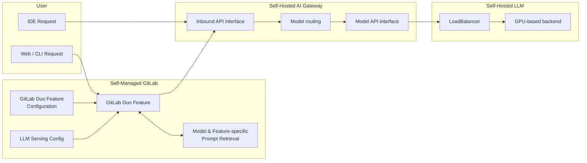

このページには今後予定されている製品・機能・機能性に関する情報が含まれています。ここに示す情報は参考目的のみです。購入・計画の決定にこの情報を使用しないでください。製品・機能・機能性の開発、リリース、タイミングは変更または延期される可能性があり、GitLab Inc. の独自の判断に委ねられています。

<table class="w-full text-sm border-collapse">
<thead>
<tr class="bg-gray-100 text-left">
<th class="px-3 py-2 border border-gray-300">Status</th>
<th class="px-3 py-2 border border-gray-300">Authors</th>
<th class="px-3 py-2 border border-gray-300">Coach</th>
<th class="px-3 py-2 border border-gray-300">DRIs</th>
<th class="px-3 py-2 border border-gray-300">Owning Stage</th>
<th class="px-3 py-2 border border-gray-300">Created</th>
</tr>
</thead>
<tbody>
<tr>
<td class="px-3 py-2 border border-gray-300">proposed</td>
<td class="px-3 py-2 border border-gray-300"><a href="https://gitlab.com/sean_carroll" class="text-blue-600 hover:underline">@sean_carroll</a>, <a href="https://gitlab.com/eduardobonet" class="text-blue-600 hover:underline">@eduardobonet</a></td>
<td class="px-3 py-2 border border-gray-300"><a href="https://gitlab.com/jessieay" class="text-blue-600 hover:underline">@jessieay</a></td>
<td class="px-3 py-2 border border-gray-300"><a href="https://gitlab.com/susie.bee" class="text-blue-600 hover:underline">@susie.bee</a>, <a href="https://gitlab.com/m_gill" class="text-blue-600 hover:underline">@m_gill</a></td>
<td class="px-3 py-2 border border-gray-300">~devops::ai-powered</td>
<td class="px-3 py-2 border border-gray-300">2024-03-29</td>
</tr>
</tbody>
</table>

このブループリントでは、GitLab Duo 機能のバックエンドとして、GitLab Dedicated および .com でデフォルトとして提供されている Vertex または Anthropic モデルの代替として、顧客による Mistral LLM のセルフデプロイメントのサポートを説明します。このイニシアチブはインターネット接続型およびエアギャップされた GitLab デプロイメントの両方をサポートします。

## 動機

セルフホスト LLM モデルにより、顧客は [GitLab Duo 機能](https://docs.gitlab.com/ee/user/ai_features.html)のためのエンタープライズホスト LLM バックエンドへのリクエストのエンドツーエンドの送信を管理し、すべてのリクエストを自社のエンタープライズネットワーク内に保持することができます。GitLab はデフォルトの LLM バックエンドとして GitLab の外部でホストされている Google Vertex と Anthropic を提供しています。GitLab Duo 機能の開発者は AI Gateway 経由で他の LLM の選択肢にアクセスできます。モデルとリージョンの情報の詳細については[こちら](https://gitlab.com/groups/gitlab-org/-/epics/13024#current-feature-outline)を参照してください。

### 目標

セルフマネージドモデルは、自身の LLM インフラを管理できる高度な顧客にサービスを提供します。GitLab はサポートされているモデルを LLM 機能に接続するオプションを提供します。モデル固有のプロンプトと GitLab Duo 機能のサポートはセルフホストモデル機能によって提供されます。

- LLM モデルの選択
- すべてのデータとリクエスト/レスポンスログを自社ドメイン内に保持する機能
- ユーザー向けの特定の GitLab Duo 機能を選択する機能
- .com AI Gateway への非依存性

### 対象外

カスタムモデルグループの目標であり、このブループリントの現在のイテレーションとの将来的な重複が明示的に対象外とされているその他の機能：

- ローカルモデル
- RAG
- ファインチューニング
- 現在サポートされているサードパーティモデル以外の、GitLab が管理するオープンソースモデルのホスティング。

## 提案

GitLab は顧客のインフラでホストされている特定の LLM をサポートします。顧客は AI Gateway をセルフホストし、事前定義されたリストから 1 つ以上の LLM をセルフホストします。顧客はその後、LLM 機能ごとに特定のモデルを設定します。各 GitLab Duo 機能に対して異なるモデルを選択できます。

この機能はインスタンスレベルでアクセス可能であり、GitLab セルフマネージドインスタンスでの使用を意図しています。

セルフホストモデルのデプロイメントは [GitLab Duo Enterprise アドオン](https://about.gitlab.com/pricing/)です。

## 設計と実装の詳細

### コンポーネントアーキテクチャ

#### 図の注記

- **ユーザーリクエスト**: GitLab Duo 機能は 3 つの可能な開始点のいずれかからアクセスされます（Web UI、IDE、または Git CLI）。IDE は AI Gateway と直接通信します。
- **LLM サービング設定**: 顧客がホストするモデルの存在と接続情報は GitLab Rails で宣言され、API 経由で AI Gateway に公開されます。
- **GitLab Duo 機能設定**: サポートされている各 GitLab Duo 機能について、ユーザーはサポートされているモデルを選択でき、関連するプロンプトが自動的にロードされます。
- **プロンプト取得**: GitLab Rails は使用されている GitLab Duo 機能とモデルに基づいて正しいプロンプトを選択して処理します
- **モデルルーティング**: AI Gateway はリクエストを正しい外部 AI エンドポイントにルーティングします。GitLab Duo 機能の現在のデフォルトは Vertex または Anthropic です。セルフマネージドモデルが使用される場合、AI Gateway は正しい顧客ホストモデルのエンドポイントにルーティングする必要があります。顧客ホストのモデルサーバーの詳細は `LLM Serving Config` であり、API コールとして GitLab Rails から取得されます。AI Gateway でキャッシュされる可能性があります。
- **モデル API インターフェース**: 各モデルサービングには独自のエンドポイントシグネチャがあります。AI Gateway は正しいシグネチャを使用して通信できる必要があります。OpenAI API 仕様などの一般的にサポートされているモデルサービング形式をサポートします。

### 設定

設定は GitLab インスタンスレベルで行われます。各 GitLab Duo 機能に対してオプションのドロップダウンリストが表示されます。以下のオプションが利用可能になります：

- セルフホストモデル 1
- セルフホストモデル n
- 機能非アクティブ

最初の実装では単一のセルフホストモデルがサポートされますが、これは GitLab が定義する多数のモデルに拡張されます。

### AI Gateway のデプロイメント

顧客は自社インフラに AI Gateway のローカルインスタンスをデプロイする必要があります。AI Gateway は以下を使用してインストールできます：

- [Docker](https://docs.gitlab.com/ee/administration/self_hosted_models/install_infrastructure.html#install-by-using-docker)
- [Helm Chart](https://docs.gitlab.com/ee/administration/self_hosted_models/install_infrastructure.html#install-by-using-the-ai-gateway-helm-chart)

AI Gateway コンテナはすべての GitLab リリースで [GitLab コンテナレジストリ](https://gitlab.com/gitlab-org/modelops/applied-ml/code-suggestions/ai-assist/container_registry/)と [DockerHub](https://hub.docker.com/repository/docker/gitlab/model-gateway/tags) に公開されます。

### プロンプトサポート

サポートされている各モデルとサポートされている GitLab Duo 機能について、プロンプトが GitLab によって開発・評価されます。プロンプトは [AI Gateway リポジトリ](https://gitlab.com/gitlab-org/modelops/applied-ml/code-suggestions/ai-assist/-/tree/main/ai_gateway)でホストされています。

### サポートされている LLM

サポートされている LLM のリストは[ドキュメント](https://docs.gitlab.com/ee/administration/self_hosted_models/supported_models_and_hardware_requirements.html#approved-llms)で確認できます。

#### RAG / Duo Chat ツール

Duo Chat で利用可能なツールのほとんどは、GitLab がホストする AI Gateway アーキテクチャと同様にセルフホストモデルに対して動作します。以下は例外です：

##### Duo ドキュメント検索

GitLab が管理する AI Gateway（`cloud.gitlab.com`）を通じて実行される Duo ドキュメント検索は [VertexAI Search](../gitlab_rag/) に依存しており、エアギャップされた顧客には利用できません。代替として、セルフホストのエアギャップされた顧客のスコープ内でのみ、GitLab ドキュメントのインデックスがセルフホスト AI Gateway 内に提供されています。

このインデックスは全文検索を可能にする SQLite データベースです。各 GitLab バージョンに対してインデックスが生成され、汎用パッケージレジストリに保存されます。顧客の GitLab バージョンと一致するインデックスがセルフホスト AI Gateway によってダウンロードされます。

ローカルインデックスの使用にはいくつかの制限があります：

- [BM25 検索](https://en.wikipedia.org/wiki/Okapi_BM25) はタイポがある場合にパフォーマンスが低下し、パフォーマンスはインデックスの構築方法にも依存します
- インデックス化されたトークンはコーパスのクリーニング方法（ステミング、トークン化、句読点）に依存するため、インデックスに適切にマッチするようにユーザークエリにも同じテキストクリーニングステップを適用する必要があります
- ローカル検索はすでに実装されている他のソリューションと乖離し、AI Gateway のセルフマネージドインスタンスと GitLab ホストインスタンスの間に分断を作ります

将来的には、このソリューションをセルフホスト Elasticsearch/OpenSearch の代替に置き換える予定ですが、現時点では[Elasticsearch が有効になっているセルフホスト顧客の割合は低い](https://gitlab.com/gitlab-org/gitlab/-/issues/438178#current-adoption)です。

詳細については、[概念実証](https://gitlab.com/gitlab-org/modelops/applied-ml/code-suggestions/ai-assist/-/merge_requests/974)を参照してください。

**インデックスの作成**

インデックスの作成と実装は[このエピック](https://gitlab.com/groups/gitlab-org/-/epics/14282)の一部として取り組まれています

**評価**

ローカル検索の評価は[このエピック](https://gitlab.com/gitlab-org/gitlab/-/issues/468666)の一部として取り組まれています。

#### LLM ホスティング

顧客が LLM ホスティングをセルフマネージドします。顧客が自身の [LLM](https://docs.gitlab.com/ee/administration/self_hosted_models/install_infrastructure.html) をホストする方法については限定的なドキュメントを提供しています。

#### GitLab Duo ライセンス管理

セルフマネージド GitLab Rails は、ローカル AI Gateway が検証できるトークンを自己発行します（.com と同じプロセス）。これによりクロスサービス通信が安全であることを保証します。[詳細](https://gitlab.com/gitlab-org/gitlab/-/issues/444216)

### システムアーキテクチャ

現時点では単一のシステムアーキテクチャのみがサポートされています。代替案の議論については対象外セクションを参照してください。

#### セルフホスト AI Gateway を持つセルフマネージド GitLab

このシステムアーキテクチャはインターネット接続型の GitLab と AI Gateway の両方をサポートし、エアギャップされた環境でも実行できます。顧客は自社インフラ内にセルフマネージド AI Gateway をインストールします。このようなインストールの長期的なビジョンは Runway を通じてですが、それが利用可能になるまでは Docker ベースのインストールがサポートされます。

セルフマネージド AI Gateway をデプロイするセルフマネージドの顧客は、現時点ではセルフホストモデルにのみアクセスできます。[Bring Your Own Key](https://gitlab.com/groups/gitlab-org/-/epics/12973) に関する将来の作業によってこれが変わる可能性があります。

### 開発環境

開発環境向けに完了した関連作業には以下が含まれます：

- [GDK に AI Gateway を含める](https://gitlab.com/gitlab-org/gitlab-development-kit/-/issues/2025)
- [セルフホストモデルの開発者セットアップ](https://gitlab.com/gitlab-org/gitlab/-/issues/452509)
- [集中型評価フレームワーク](https://gitlab.com/gitlab-org/modelops/ai-model-validation-and-research/ai-evaluation/prompt-library/-/tree/main)

### 対象外

- 専用または .com の顧客のためにサポートする可能性はありますが、これは現時点では対象外です。
- サポートされている LLM セクションにリストされているもの以外のモデルのサポート。
- 変更されたモデルのサポート。

#### 対象外のシステムアーキテクチャ

現時点ではこれらのシステムアーキテクチャをサポートする計画はありませんが、十分な顧客需要があれば変更される可能性があります。

##### .com AI Gateway を持つセルフマネージド GitLab

この対象外のアーキテクチャでは、セルフマネージドの顧客が引き続き .com でホストされている AI Gateway を使用しますが、セルフマネージドモデルを指定します。

##### .com AI Gateway を持つ .com GitLab

この対象外のアーキテクチャでは、.com の顧客がセルフマネージドモデルを指定します。このトポロジーは、特定のモデルによって特定の機能でより良い結果の品質が得られる場合や、顧客が自身のモデルサービングインフラを使用することでレスポンスのレイテンシーを改善できる場合に望まれる可能性があります。

##### GitLab Dedicated

Dedicated の顧客がセルフホスト AI Gateway とセルフホストモデルを使用するサポートは提供されません。GitLab Duo 機能を使用する Dedicated の顧客は .com AI Gateway 経由でアクセスできます。Dedicated の顧客向けのセルフマネージドモデルへの需要があれば、将来的に検討できます。
