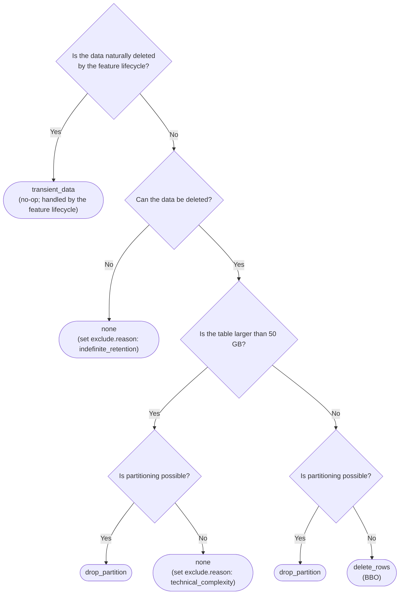



## 動機

[テーブルサイズの制限](../database_size_limits/_index.md)に向けた取り組みの一環として、データベースチームは、
他のチームがテーブルサイズを能動的に制限するために従うデータ保持ポリシーフレームワークを開発しています。

現在、GitLab.com における保持とデータライフサイクル管理は一貫していません。各チームがテーブルごとに解決しており、
保持期間を説明するための共通語彙も、適用方法に関する合意も、特定の判断を下した理由を
記録する一元的な場所もありません。その結果、テーブルの増大は事後対応的に発見され、修復作業は
毎回ゼロから設計されています。

このドキュメントでは、テーブルのデータライフサイクルを設定するための統一された宣言的フレームワークを提案します。これにより、
保持に関する判断を一度行い、テーブルの隣に記録し、ツールで適用できるようにします。

## 推奨フレームワーク

テーブルのデータライフサイクルを設定するための統一された宣言的フレームワークです。以下のフィールドは、
`db/docs/data_retention/<table_name>.yml` のトップレベルキーとして追加され、CI で検証されます。設定は
専用ファイルに置かれるため、フィールドをラッパーキーの下にネストする必要はありません。

対象となるすべてのテーブルに保持が能動的に適用されていることを検証する適用ツールを整備します。

### フィールド仕様

| フィールド                   | 説明                                                          | 値の型                                                     |
|-------------------------|----------------------------------------------------------------------|----------------------------------------------------------------|
| `exclude`               | 理由を指定してテーブルをデータ保持から除外する                | `reason` を持つオブジェクト：`indefinite_retention`、`technical_complexity`。未設定の場合は除外しない |
| `retention_window`      | 最初に作成されてからデータベースにデータを保持する期間 | 数値（日数）。`-1` は `exclude` が設定されている場合のみ                |
| `enforcement_strategy`  | システムで保持期間を適用する方法                  | `drop_partition`、`delete_rows`、`transient_data`。`none` は `exclude` が設定されている場合のみ |
| `enforcing`             | 保持ポリシーが能動的に適用されているかどうか                    | ブール値                                                        |
| `work_item`             | 判断の根拠と適用計画を記録する Issue またはエピック   | Issue またはエピックの参照                                        |
| `pause_mechanism`       | このテーブルで保持を無効にする方法                         | `none`、`application_setting`、`feature_flag`                  |
| `pause_mechanism::name` | アプリケーション設定またはフィーチャーフラグの名前                  | 文字列                                                         |

#### 除外

テーブルをデータ保持から除外します。デフォルトでは未設定であり、テーブルが保持の対象であることを意味します。テーブルを
除外するには、`exclude.reason` を少数の固定された値のいずれかに設定します。データベースチームの承認は不要です。
有効な理由を選択し、`work_item` に根拠を記録することで各チームが除外できます。CI は
`reason` が許可された値のいずれかであることを検証します。

**許可される理由：**

1. `indefinite_retention` — コンプライアンスや監査目的などでデータを無期限に保持する必要がある場合、または
  古くなって削除できる行が蓄積されないコアエンティティテーブル（`organizations` など）の場合。これは
  暫定措置です。最終的な目標は、無期限に保持するデータをホット OLTP データベースからコールドストレージへ移すことであるため、
  この理由を使用するテーブルは見直されることが期待されます。
1. `technical_complexity` — 50 GB のソフトリミットを超え、パーティション化できないテーブルで、`drop_partition`
  を実現できない場合。パーティション化を不可能にする具体的な技術的制約を `work_item` で説明しなければなりません。

削除が技術的に難しいというだけでは、それ自体は有効な除外理由に**なりません**。データを削除できるテーブルは、
たとえ手順が煩雑だったりエンジニアリング作業が必要だったりしても除外されません。`delete_rows`（BBO）を使用し、
理由を `work_item` に記録します。例外は `technical_complexity` で、パーティション化が不可能な大規模テーブル専用です。
その制約は `work_item` で説明する必要があります。

`exclude.reason` が設定されている場合、連動する 2 つのフィールドは固定されます：

1. `retention_window` は `-1` でなければなりません。
1. `enforcement_strategy` は `none` でなければなりません。

この連動は双方向です。`retention_window: -1` と `enforcement_strategy: none` が有効なのは、
`exclude.reason` が設定されている場合**のみ**です。それ以外の場合、両方のフィールドを
[決定木](#enforcement-strategy)に従った具体的な値に設定しなければなりません。これらのフィールドに対する CI 検証で、この連動を適用します。

#### 保持期間

最初に作成されてからデータベースにデータを保持する期間です。

**値の型：**数値（日数）。`-1` が有効なのは `exclude.reason` が設定されている場合のみです（[除外](#exclude)を参照）。
それ以外の場合、このフィールドには正の日数を設定しなければなりません。

#### 適用戦略

システムで保持期間を適用する方法です。

**指定可能な値：**

1. `drop_partition` — テーブルをパーティション化し、`retention_window` を過ぎたパーティションをドロップします。
1. `delete_rows`（BBO）— 削除後はデータを取得できません。
1. `transient_data` — ユーザーまたは機能のライフサイクルに関連付けられ、そのライフサイクルの一部としてすでに削除されるデータです。
1. `none` — テーブルは保持の対象外です。`exclude.reason` が設定されている場合のみ有効です（[除外](#exclude)を参照）。

除外の場合を除き、このフィールドは決定木に従って `drop_partition`、`delete_rows`、`transient_data` の
いずれかに設定しなければなりません。

##### 注意事項：データ復旧

データが復旧不能になる時点は戦略によって異なります：

1. `drop_partition` — 保持期間後にパーティションをデタッチし、猶予期間の間保持してから
  ドロップします（現在の `PartitionManager` ではデフォルトで 7 日。より短い値に設定可能）。デタッチされたパーティションが
  ドロップされるまでは、そこからデータを復旧できます。
1. `delete_rows` — ハードカットオフです。現在はソフトデリートシステムがないため、削除時に行は直ちに失われます。
1. `transient_data` — データ損失は、このフレームワークではなく、所有する機能のライフサイクルによって決まります。
1. `none` — データは失われず、テーブルは無期限に保持されます。

##### 行の削除を最後の手段とする理由

`DELETE` は書き込みであり、削除による保持期間の適用は、クリーンアップをデータ量に応じて増加する継続的な書き込みワークロードに変えます。
増大するテーブルで保持期間を維持するには、削除速度が挿入速度に追いつく必要があります。
つまり、挿入されたすべての行が最終的に削除されるため、テーブルには本来の約 2 倍の書き込み負荷がかかります。
このコストは、テーブルを通過するデータ量に比例して永続的に発生します：

1. **スループット。**保持期間を維持するには、削除速度が挿入速度と一致する必要があります。削除される各行自体が
  書き込みです。ヒープページをダーティにし、各インデックスにデッドエントリを残し、WAL を生成します。これらはすべて、
  後で autovacuum が読み取り、クリーンアップのために書き換えます。したがって、削除による保持の適用はテーブルの書き込み負荷を
  およそ 2 倍にし、削除が挿入に追いつけなければ保持期間は適用されません。
1. **接続。**各バッチはトランザクションの間、プールされた接続を保持します。高い挿入速度に追いつくには、
  多数のバッチを並列で実行する必要があります。
1. **I/O 負荷。**削除される各行はヒープページに書き込み、各インデックスにデッドエントリを残します。その後、autovacuum が
  それらを読み取り、書き換えます。
1. **レプリケーション負荷。**生成された WAL はすべてのレプリカと WAL アーカイブへ送信され、遅延が増加します。

`drop_partition` にもコストはありますが、一度限りです。既存の大規模テーブルをパーティション化された
テーブルに変換するのはコストの高いマイグレーションです（[大規模テーブル](#large-tables)を参照）。その後は、パーティションに
含まれていた行数に関係なく `DETACH PARTITION CONCURRENTLY` は低コストであり、最初からパーティション化されたテーブルでは
マイグレーションコストを完全に回避できます。したがって、`delete_rows` はデータ量に比例して継続的にコストを払い、`drop_partition` は一度だけ払います。
詳しくは PlanetScale の [The only scalable delete](https://planetscale.com/blog/the-only-scalable-delete)を参照してください。

`delete_rows` は、適切なパーティションキーがなく、列数とインデックスが少なく、トラフィックが少ないテーブルでは依然として妥当です。
理由を `work_item` に記録してください。

##### 大規模テーブル

GitLab.com のテーブルのハードリミットは 100 GB です。私たちは 50 GB をソフトリミットとして使用します。これは、
ハードリミットに達する前に既存のテーブルをパーティション化したり、サイズの占有量を継続的に減らす処置を実行したりする余地を残す
バッファです。この 50 GB のソフトリミットを超えるテーブルはパーティション化しなければなりません。このリミットを
超えるテーブルでパーティション化しない提案をする場合は、その根拠を `work_item` に記録する必要があります。これらのテーブルに
適用される制約については、[大規模テーブルの制限](https://docs.gitlab.com/development/database/large_tables_limitations/)を参照してください。

#### 適用中

保持ポリシーの適用が有効かどうかを定義します。

テーブル作成時に `enforcing` を `false` に設定して保持ポリシーを選択し、
保持ポリシーの適用が実際に整備された時点で `true` に切り替えることができます。この分離があるのは、ポリシーは
テーブル作成時に宣言されますが、適用の実装は後から導入されることが多いためです。

#### ワークアイテム

保持に関する判断の根拠と、テーブルに適用する実装計画の両方を記録する Issue またはエピックです。
`enforcing` フラグを有効にするには、このワークアイテムを指定する必要があります。
データベースチームは、このワークアイテムを使用して適用の進捗を追跡します。

#### 一時停止メカニズム

テーブルの保持の適用を無効化／一時停止する方法です。

**指定可能な値：**`none`、`application_setting`、`feature_flag`

#### 一時停止メカニズム::名前

指定されたテーブルの保持を有効または無効にするアプリケーション設定またはフィーチャーフラグの名前です。
単一の設定またはフラグを複数のテーブルで共有できます。たとえば、1 つの設定で CI ドメイン全体を対象にできます。

## GitLab.com のデフォルト

GitLab.com の標準要件に基づくデフォルトは次のとおりです。これらの値は参考情報にすぎません。
最適な意思決定を行うには、上記の決定木に従ってください。

| フィールド                | デフォルト                                                       |
|----------------------|---------------------------------------------------------------|
| 除外              | 未設定（テーブルは保持の対象）                         |
| 保持期間     | 1 か月                                                       |
| 適用戦略 | `drop_partition`                                            |
| 一時停止メカニズム      | `application_setting`（1 つの設定で複数のテーブルを対象にできる） |

## GitLab Self-Managed のオプション

すべての新規インスタンスで、データ保持はデフォルトで有効です。所有チームは、各ドメインでデータ保持を無効にする方法を
提供する責任があります。ドメイン全体を対象にするため、複数のテーブルで共有するアプリケーション設定やフィーチャーフラグを
作成できます。

## 適用ツール

### データ保持の適用チェック

`enforcing: false` のテーブル、または `enforcing: true` でありながら
`pause_mechanism`（アプリケーション設定またはフィーチャーフラグ）で一時停止されているテーブルに、一定期間にわたって
受信トラフィックがあったかどうかを確認するツールです。トラフィックがあった場合は、所有チームに通知し、保持の適用の進捗を
確認するよう依頼します。

保持ポリシーはテーブル作成時に入力されますが、実際の保持の適用は後の段階で実装される場合があるためです。
このチェックにより、ポリシーの宣言と適用の間のギャップを埋めます。

### テーブルサイズチェック

テーブルサイズを監視し、平均サイズが 50 GB のソフトリミットを超えるテーブルにフラグを立てるツールです。テーブルが
リミットを超えると、所有チームに Issue が作成されます。チームは保持を適用するか、100 GB のハードリミットに達する前に
テーブルをリミット未満へ戻すために必要な移行処置（パーティション化など）を計画して対応します。
