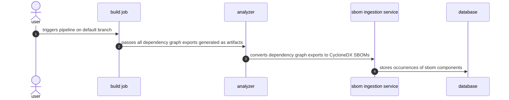

## コンテキスト

この ADR は、新しい Dependency Scanning アナライザーの初期ビジョンを記録するものです。[依存関係グラフエクスポート](https://docs.gitlab.com/ee/user/application_security/terminology/#dependency-graph-export)とロックファイルのみをサポートすることに焦点を当てていました。このアプローチは、プロジェクトをビルドして複数の言語ランタイムを管理する必要を排除することでアナライザーを簡素化したいという希望から生まれました。当初の提案は、依存関係アーティファクトを生成する責任を先行 CI ジョブを通じてユーザーに委任し、アナライザーがこれらのアーティファクトの解析と分析のみに集中できるようにするというものでした。

## 決定事項

> :warning: この決定の一部の側面は[後続の改訂](#subsequent-revisions)によって改訂されています。

[依存関係グラフエクスポート](https://docs.gitlab.com/ee/user/application_security/terminology/#dependency-graph-export)とロックファイルのみをサポートすることに焦点を当てた新しいアナライザーを作成します。例示プロジェクトを使用してエクスポートの生成方法を文書化し、生成されたアーティファクトをスキャンする依存関係スキャン CI/CD コンポーネントを提供します。

[エピック 8026](https://gitlab.com/groups/gitlab-org/-/epics/8026) での SBOM ベーススキャンへの変更により、この機能はすでに[廃止が予定](https://gitlab.com/groups/gitlab-org/-/epics/14146)されているため、Gemnasium アナライザーが行う脆弱性マッチングを移植しません。
新しいアナライザーは、コンテナの依存関係によって導入される攻撃対象領域を削減するため、スクラッチイメージに基づいて作成します。

### メリット

- 統合テストの簡素化。パッケージマネージャー、ランタイム、コンパイラーバージョンのさまざまな組み合わせに対してテストする必要がなくなります。
- コンテナスキャンの脆弱性を常にゼロにできます。これは、リアクションローテーションに対応するエンジニアの作業負荷を軽減することを意味します。
- 小さなイメージサイズ。CI ジョブの高速な起動、ネットワークトラフィックの削減。
- ライブラリが暗号ライブラリを使用しないため、FIPS コンプライアンスの簡素化。
- 開発パイプライン実行のための簡素化された権限により、コミュニティ貢献エクスペリエンスの向上。

### デメリット

- 特定のパッケージマネージャーでの依存関係スキャンを開始するための例とガイドを含む追加ドキュメントが必要。
- 新しいグラフエクスポートの命名規則の確立が必要。
- ユーザーはビルドジョブを指示として設定する必要があります。すぐに機能するわけではありません。

## 設計と実装の詳細

グラフエクスポートのみのアプローチは、大まかに次のように動作します。

### ビルドジョブ

依存関係グラフエクスポートがプロジェクトのリポジトリにチェックインされることを期待できないことに注意することが重要です。これは、`pipdeptree` や `pipenv graph` の依存関係グラフエクスポートのようにグラフエクスポートがロックファイルとしても機能しない場合に起こりやすいです。このような場合、ビルドジョブが依存関係グラフエクスポートを生成し、ジョブがこれらを[ジョブアーティファクト](https://docs.gitlab.com/ee/ci/jobs/job_artifacts.html)として保存することを期待します。

依存関係グラフエクスポートがロックファイルとして機能せず、正規の名前を持たない場合、検出するファイルについてユーザーとの契約を確立するために以下の命名規則を使用します。

| パターン | 説明
| ------- | -----------
| `**/go.graph` | `go mod graph > go.graph` で生成
| `**/pipenv.graph.json` | `pipenv graph --tree-json > pipenv` で生成

ビルドジョブは、依存関係スキャンアナライザーが実行されるステージより前のステージで実行する必要があります。アナライザーは `build` ステージの後に実行される `test` ステージで実行されるため、これはデフォルトで成立しています。

### アナライザー

ビルドジョブが完了し、アーティファクトが保存されると、[以降のジョブ](https://docs.gitlab.com/ee/ci/jobs/job_artifacts.html#prevent-a-job-from-fetching-artifacts)に引き渡されます（特に引き渡さないよう要求された場合を除く）。アナライザーはこれを利用して、ユーザーが文書化された命名パターンを使用してアーティファクトを引き渡すようビルドジョブを設定したことを期待します。その後、デフォルトでプロジェクトのリポジトリであるターゲットディレクトリ全体を検索し、サポートされているすべてのファイルを検出し、解析して、GitLab モノリスで実行されているサービスが利用できる CycloneDX SBOM に変換します。

### メリット

- プリインストールされたコンパイラー、ランタイム、システム依存関係が不要。
- 小さな攻撃対象領域。
- デフォルトでオフラインで実行可能。

### デメリット

- グラフエクスポートのドキュメントの品質にばらつきがあります。`npm` のようにロックファイルの各バージョンを文書化しているパッケージマネージャーもあれば、`pnpm` のようにそうでないものもあります。
- Java と Python のプロジェクトは、デフォルトではロックファイルにグラフ情報をキャプチャしないため、追加の設定が必要です。

## 代替ソリューション

### ロックファイルを必須とし、グラフ情報を追加する

依存関係グラフエクスポートの代替ソリューションの一つは、サポートされているすべてのロックファイルをデフォルトで依存関係グラフエクスポートにすることです。このシナリオでは、推移的な依存関係の関係と依存関係グループのメタデータでロックファイルを強化するために、パッケージマネージャーのメンテナーと直接協力します。例えば、親依存関係を含む新しいバージョンの `gradle.lockfile` を追加するために Gradle のメンテナーと協力できます。私たちの貢献は、ユーザーにとって必要なツールをすぐに利用できるようにすることで、GitLab の依存関係スキャン機能の使用開始ワークフローを全体的に改善するという付加的な利点をもたらします。

#### メリット

- 新しいファイル要件の確立が不要。
- ほとんどのケースですぐに動作します。パッケージマネージャーは通常、存在しない場合はロックファイルを生成します。

#### デメリット

- パッケージマネージャーは大規模なコードベースを持つ傾向があり、オンボーディング時間が増加します。
- ロックファイルにはドメインの専門知識が必要です。例えば、[pnpm の Issue 7685](https://github.com/pnpm/pnpm/issues/7685) では、対処しなければならない非常に具体的なコーナーケースの議論が見られます。
- プロジェクトメンテナーには、私たちと一致しない可能性がある独自の関心事があります。例えば、新機能よりも安定性とメンテナンスを優先することがあります。
- 古いバージョンのパッケージマネージャーやビルドツールは、新しい追加と互換性がないでしょう。

### サードパーティ CycloneDX ジェネレーターに依存する

このアプローチは、コンポジション分析の方向性を変え、サードパーティ CycloneDX ジェネレーターからユーザーが提供する `cyclonedx` CI レポートとのみインターフェースするようにします。

#### メリット

- CI/CD コンポーネントの統合テストが不要。
- アナライザーのメンテナンスが不要。

#### デメリット

- GitLab リリーススケジュールに縛られるため、マイルストーンの途中で新機能、機能強化、バグ修正をデプロイできません。
- CycloneDX レポートを生成できるサードパーティアナライザーが多数あります。それぞれのカスタム[メタデータプロパティ](https://cyclonedx.org/docs/1.5/json/#metadata_properties)と[コンポーネントプロパティ](https://cyclonedx.org/docs/1.5/json/#components_items_properties)すべてをサポートすることは困難です。
- サードパーティ SBOM ジェネレーターのコードベースの習得に時間が必要。
- ジェネレーターへの提案が却下される可能性があります。必要に応じてプロジェクトをフォークすることはできますが、それには独自の課題が伴います。
- `cyclondex_py` のように、状況によっては依存関係グラフが不完全な場合があります。

### パッケージマネージャープラグインでカスタム依存関係グラフエクスポートを生成する

パッケージマネージャーがパブリック API を公開している場合、選択した形式で依存関係グラフを生成するプラグインを作成できます。これは `gemansium-maven` の依存関係分析に使用されてきました。

#### メリット

- 出力形式を選択できる。
- バンドルされた `gemnasium-maven` プラグインを再利用できる。

#### デメリット

- すべてのパッケージマネージャーがサードパーティプラグインをサポートしているわけではありません。例えば、`pnpm` には文書化されたプラグインサポートがありません。
- Ruby または Go を使用しないプラグインには新しい言語の専門知識が必要で、プラグインメンテナーのプールが小さくなり、メンテナー一人当たりのレビュー負荷が増加します。
- プラグインプロジェクトのメンテナンス、改善、デプロイに追加のオーバーヘッドが必要。

## 後続の改訂 {#subsequent-revisions}

この初期アプローチは後に以下の ADR によって改訂されました：

- [ADR 002: SBOM Scan API を使用した脆弱性スキャン](./002_vulnerability_scanning.md) - CI パイプラインで即時のセキュリティフィードバックを提供するため、アナライザー内に脆弱性スキャン機能を再導入
- [ADR 003: 依存関係解決とマニフェストスキャン](./003_dependency_resolution_and_manifest_scanning.md) - 自動依存関係解決とマニフェスト解析フォールバックを通じてユーザーエクスペリエンスのギャップに対処し、大規模な依存関係スキャンを可能にする
