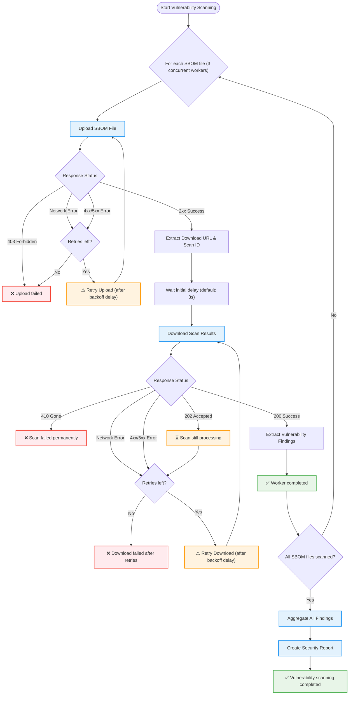

## コンテキスト

初期の Dependency Scanning アナライザー設計（[ADR 001: グラフエクスポートのみ](./001_graph_export_only.md)）は、意図的に脆弱性スキャン機能を除外していました。その根拠は、SBOM インジェストパイプラインを通じてバックエンドサービスに脆弱性分析を委任しながら、アナライザーを依存関係の検出と SBOM 生成のみに集中させるというものでした。

しかし、このアプローチには重大な制限がありました：

**ユーザーエクスペリエンスのギャップ**: ユーザーは、依存関係の検出だけでなく、CI パイプラインで完全なセキュリティ分析を提供することを依存関係スキャンアナライザーに期待していました。脆弱性分析を実行するために別のバックエンドプロセスを必要とすることで、依存関係の発見とセキュリティレポートの間に乖離が生じました。

**遅延フィードバック**: バックエンドで非同期に行われる脆弱性分析は、CI パイプラインの実行中にユーザーが即時のセキュリティフィードバックを受け取れないことを意味しました。

**機能パリティの懸念**: レガシーの Gemnasium アナライザーは CI パイプラインで即時の脆弱性検出を提供していました。この機能を削除することは、ユーザー向け機能の後退を意味しました。

統合依存関係スキャンエンジンの一部として開発された GitLab SBOM Vulnerability Scanner（[Dependency Scanning Engine](../../dependency_scanning_engine/index.md)）は、CI パイプラインコンテキスト内で活用できる、実証された保守可能な脆弱性検出アプローチを提供します。

## 決定事項

[Dependency Scanning Engine ADR 003: SBOM ベース CI パイプラインスキャン](../../dependency_scanning_engine/decisions/003_sbom_based_scans_for_ci_pipelines.md)に記載されている SBOM Scan API を統合することで、Dependency Scanning アナライザー内に脆弱性スキャン機能を再導入します。

このアプローチは、CI パイプライン内で即時のセキュリティフィードバックを提供しながら、統合された依存関係スキャンエンジンで確立された関心の分離を維持します。

## 実装の詳細

### アナライザーワークフロー

アナライザーは4段階のプロセスに従います：

1. **依存関係の検出**: ロックファイル、グラフファイル、またはマニフェストを解析してプロジェクトの依存関係を特定する
2. **SBOM 生成**: 検出された依存関係から CycloneDX SBOM ドキュメントを作成する
3. **脆弱性スキャン**: SBOM を SBOM Scan API にアップロードして脆弱性の発見事項を取得する
4. **レポート生成**: 発見事項を集約して依存関係スキャンのセキュリティレポートを生成する

### SBOM Scan API の統合

アナライザーは SBOM Scan API を通じて GitLab SBOM Vulnerability Scanner と統合します。SBOM Scan API のワークフロー、認証、レート制限、バックグラウンド処理に関する詳細な情報については、[Dependency Scanning Engine ADR 003: SBOM ベース CI パイプラインスキャン](../../dependency_scanning_engine/decisions/003_sbom_based_scans_for_ci_pipelines.md)を参照してください。

アナライザーは以下の責任を処理します：

- **ファイルのアップロード**: CI SBOM Scan API エンドポイントを通じて生成された SBOM ファイルをアップロードする
- **ポーリング**: スキャン完了状態について API をポーリングする
- **結果の取得**: スキャンが完了したら脆弱性の発見事項をダウンロードする
- **集約**: プロジェクトが複数の SBOM ドキュメントを生成する場合、複数の SBOM からの結果を結合する

### 並行処理

アナライザーは最大3つのワーカーゴルーチンを使用して SBOM ファイルを並行処理します。各ワーカーは独立して：

1. マルチパートフォームデータを使用して SBOM ファイルを API にアップロードする
2. レスポンスからダウンロード URL とスキャン ID を抽出する
3. 設定された初期遅延（`DS_API_SCAN_DOWNLOAD_DELAY`）を待機する
4. 指数バックオフでスキャン結果をポーリングする

この並行アプローチは、合理的な CI パイプライン所要時間を維持しながら、リソース管理とスキャン実行速度のバランスを取ります。

#### 脆弱性スキャンワークフロー

### アナライザーのエラー処理

アナライザーは SBOM Scan API の失敗に対する包括的なエラー処理を実装します：

**アップロードの失敗**：

- **一時的なエラー**（ネットワークタイムアウト、5xx エラー）: 指数バックオフでリトライ（3秒、3秒）
- **レート制限**（429 Too Many Requests）: 指数バックオフでリトライ
- **回復不可能なエラー**（403 Forbidden、その他の 4xx エラー）: リトライなしで即時失敗
- **機能フラグが無効**（特定メッセージの 403）: プロジェクトで機能フラグが無効であることを示す明確なエラーで失敗
- **ファイルエラー**: SBOM ファイルを開いたり読んだりできない場合は即時失敗

**ダウンロードの失敗**：

- **202 Accepted**（スキャンまだ処理中）: 指数バックオフでリトライ（5秒、10秒、15秒、30秒、60秒、その後最大30回の追加試行は60秒でキャップ）
- **410 Gone**（スキャンが永続的に失敗）: リトライなしで即時失敗
- **レート制限**（429 Too Many Requests）: API を圧倒するのを防ぐためリトライなしで即時失敗
- **一時的なエラー**（ネットワークタイムアウト、4xx/5xx エラー）: 指数バックオフでリトライ
- **無効なレスポンス**: 指数バックオフでリトライ

**拡張リトライ耐性**: ダウンロードのリトライは最初の5回の試行に指数バックオフを使用し、その後最大30回の追加試行は60秒間隔でキャップされます。これにより、バックエンド処理が遅いインスタンスでの長時間実行スキャンに対する耐性が提供されます。

**フェイルファスト動作**: いずれかの SBOM ファイルのスキャンが失敗した場合、脆弱性スキャン操作全体が失敗します。これにより、ユーザーが完全な結果を受け取るか、または全く受け取らないかのどちらかになり、部分的または一貫性のないセキュリティレポートを防ぎます。

### CI のみの実行と GitLab 最小バージョン要件

脆弱性スキャンは、両方の条件が満たされた場合にのみ実行されます：

1. `CI_SERVER_VERSION` 環境変数が設定されている（GitLab CI/CD の実行を示す）かつその値が最低 `18.5` である。
2. `DS_ENABLE_VULNERABILITY_SCAN` 機能フラグが有効になっている。

これにより、CI 変数が利用できないローカル開発環境、および SBOM Scan API が利用できない古いインスタンスで実行する場合の失敗を防ぎます。脆弱性スキャンがスキップされた場合、アナライザーは SBOM アーティファクトを生成しますが、セキュリティレポートは省略します。

### アドバイザリーデータベースの状態検証

アナライザーは、スキャン結果を処理する前に GitLab インスタンスでアドバイザリーデータベースが同期されていることを検証します。これにより、脆弱性検出が脆弱性を誤って検出しないこと（偽陰性のリスク）を保証します。

SBOM Scan API がアドバイザリーデータベースの状態情報を返す場合：

- **アドバイザリーDB が同期済み**: 処理は通常通り続行される
- **アドバイザリーDB が非同期**（strictモード有効、デフォルト）: GitLab インスタンスにアドバイザリーデータが欠けていることを示すエラーでスキャンが失敗する
- **アドバイザリーDB が非同期**（strictモード無効）: 警告をログに記録しながら処理が続行される

この検証は `DS_FF_STOP_SCAN_WHEN_NO_ADVISORY_DB_SYNC` 環境変数（strictモードを無効にするには `false` に設定）を介して無効にできます。

### 設定

アナライザーは以下の設定パラメーターを受け入れます：

- **`DS_ENABLE_VULNERABILITY_SCAN`**: 脆弱性スキャンを有効にする（デフォルト: true）
- **`DS_API_TIMEOUT`**: API リクエストのタイムアウト（秒）（最小: 5、最大: 300、デフォルト: 10）
- **`DS_API_SCAN_DOWNLOAD_DELAY`**: スキャン結果をダウンロードするまでの初期遅延（秒）（最小: 1、最大: 120、デフォルト: 3）
- **`DS_FF_STOP_SCAN_WHEN_NO_ADVISORY_DB_SYNC`**: アドバイザリーデータベースが同期されていない場合にスキャンを停止する（デフォルト: true）

CI 環境変数は GitLab CI/CD によって自動的に提供されます：

- **`CI_SERVER_VERSION`**: GitLab インスタンスのバージョン
- **`CI_API_V4_URL`**: GitLab インスタンスの API V4 URL
- **`CI_JOB_ID`**: 現在の CI ジョブ ID
- **`CI_JOB_TOKEN`**: CI ジョブ認証トークン

### セキュリティレポートの生成

すべての SBOM ファイルが正常にスキャンされた後、アナライザーは：

1. すべてのスキャン結果からの脆弱性の発見事項を集約する
2. 最初のスキャン結果からスキャナーの詳細を抽出する（すべてのスキャンで同一）
3. 以下を含む標準化された GitLab セキュリティレポートを作成する：
   - アナライザー情報（名前、バージョン、ベンダー）
   - スキャナー情報（バックエンド SBOM Vulnerability Scanner から）
   - スキャンタイミング情報（開始時刻と終了時刻）
   - 重大度でソートされた集約済み脆弱性の発見事項
4. レポートを `gl-dependency-scanning-report.json` アーティファクトとして出力する

### 限定提供中のグレースフルデグレード

限定提供期間中、アナライザーは機能が安定するまでの間 CI ジョブの失敗を防ぐため、特定の障害シナリオに対してグレースフルなエラー処理を実装します：

- **機能フラグが無効**: 警告をログに記録し、API ベースの脆弱性スキャンをスキップ。SBOM 分析はパイプライン完了後に続行される
- **レート制限超過**: 警告をログに記録し、API ベースの脆弱性スキャンをスキップ。SBOM 分析はパイプライン完了後に続行される
- **API 禁止（403）**: 警告をログに記録し、API ベースの脆弱性スキャンをスキップ。SBOM 分析はパイプライン完了後に続行される
- **その他のエラー**: エラー詳細とともに警告をログに記録し、API ベースの脆弱性スキャンをスキップ。SBOM 分析はパイプライン完了後に続行される

このアプローチにより、限定提供期間中の一時的な API の問題や機能フラグの状態によって CI ジョブが失敗しないことを保証しつつ、SBOM アーティファクトを提供し、バックエンドの SBOM 分析パイプラインを通じた脆弱性分析が継続できます。

## メリット

**完全なセキュリティ分析**: ユーザーは依存関係の検出だけでなく、CI パイプライン内で包括的な脆弱性検出を受け取ります。

**一貫した結果**: GitLab SBOM Vulnerability Scanner を活用することで、すべての GitLab スキャンコンテキストで同一の脆弱性検出が保証され、CI と継続的スキャン間の差異が解消されます。

**アナライザーの複雑さの削減**: 脆弱性検出ロジックを実装する代わりに、アナライザーは実証済みの GitLab SBOM Vulnerability Scanner に委任し、メンテナンス負担とセキュリティリスクを削減します。

**後方互換性**: アナライザーは実行している GitLab のバージョンを検出し、SBOM スキャン API が利用できない場合に不要なエラーを試みることを回避します。

## 課題

**API への依存**: アナライザーは SBOM Scan API が利用可能かつ応答していることに依存しています。API の障害またはパフォーマンスの低下は、アナライザーのパフォーマンスと脆弱性検出機能に直接影響します。

**フェイルファストのセマンティクス**: アナライザーはいずれかの SBOM ファイルのスキャンが失敗した場合、脆弱性スキャン操作全体を失敗させます。これにより結果の一貫性が保証されますが、単一の一時的な失敗でスキャン全体が失敗する大規模なプロジェクトのユーザーには不満が生じる可能性があります。将来のイテレーションでは、警告付きの部分的な成功モードを検討できるかもしれません。

**CI パイプラインの所要時間**: 脆弱性スキャンにより CI ジョブにレイテンシーが追加されます。ポーリング前の初期遅延（`DS_API_SCAN_DOWNLOAD_DELAY`）により、すべての実行に最小遅延が追加されます。

**設定の複雑さ**: 脆弱性スキャンには複数の環境変数と設定パラメーターが必要です。ほとんどは GitLab CI/CD によって自動的に提供されますが、ユーザーは自分の環境に合わせてタイムアウトと遅延パラメーターを調整する必要がある場合があります。

## 参考資料

- [セキュリティスキャン結果を Dependency Scanning CI ジョブに戻すエピック](https://gitlab.com/groups/gitlab-org/-/work_items/17150)
- [DS アナライザーに脆弱性スキャンを再導入する](https://gitlab.com/groups/gitlab-org/-/work_items/17150)
- [Dependency Scanning Engine](../../dependency_scanning_engine/index.md)
- [Dependency Scanning Engine ADR 001: GitLab SBOM Vulnerability Scanner](../../dependency_scanning_engine/decisions/001_gitlab_sbom_vulnerability_scanner.md)
- [Dependency Scanning Engine ADR 003: SBOM ベース CI パイプラインスキャン](../../dependency_scanning_engine/decisions/003_sbom_based_scans_for_ci_pipelines.md)
