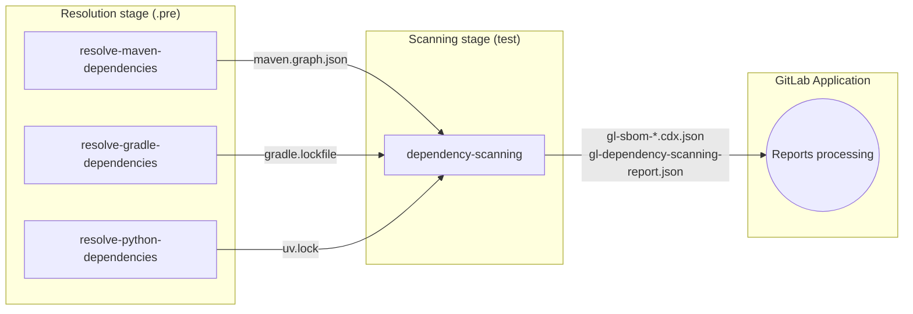
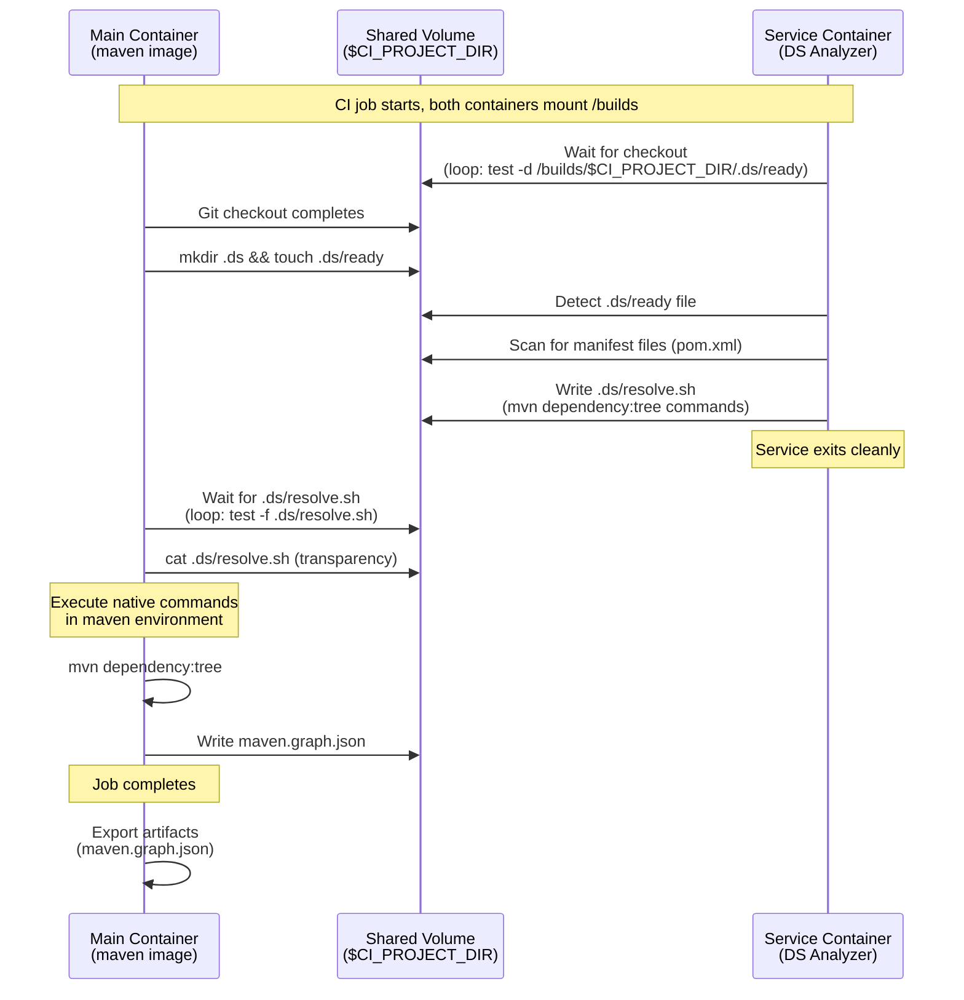

## コンテキスト

この ADR は、[ADR 001: グラフエクスポートのみ](./001_graph_export_only.md)で特定された制限に対処する Dependency Scanning アナライザーの改訂されたアプローチを記録します。初期のグラフエクスポートのみのアプローチでは、ユーザーが依存関係アーティファクトを生成するためにビルドジョブを手動で設定する必要があり、採用への摩擦が生じ、[スキャン実行ポリシー](https://docs.gitlab.com/ee/user/application_security/policies/scan_execution_policies.html)を通じた大規模な有効化を妨げていました。

GitLab の依存関係スキャンは、正確な依存関係検出と脆弱性分析のエントリポイントとしてロックファイルまたはグラフファイルに依存しています。ただし、プロジェクトの約50%は、これらのファイルを生成するために何らかの依存関係解決メカニズムを必要とします。
これらのファイルがリポジトリにコミットされているかどうかは、エコシステムとプロジェクトの慣行によって異なります。

この機能をサポートするレガシーの Gemnasium アナライザーとは異なり、元の Dependency Scanning アナライザーはこの責任をユーザーに委任し、先行 CI ジョブでロックファイル/グラフファイルを生成することを期待していました。このアプローチは柔軟性を提供しますが、いくつかの課題があります：

**ユーザーエクスペリエンスのギャップ**: 多くのユーザーは、手動の CI 設定なしに依存関係スキャンがすぐに機能することを期待しています。カスタムビルドジョブのセットアップ要件は採用への摩擦を生み出し、セキュリティスキャンへの参入障壁を高めます。

**大規模な有効化の制限**: [スキャン実行ポリシー](https://docs.gitlab.com/ee/user/application_security/policies/scan_execution_policies.html)はプロジェクト全体でセキュリティスキャンを強制します。しかし、この必要な依存関係解決ステップがなければ、既存のロックファイルがないプロジェクトやアドホックなカスタマイズなしでは依存関係スキャン分析の恩恵を受けられませんでした。

これらの課題に対処するため、Gemnasium と同様の依存関係解決機能を再導入する必要があります。ただし、レガシーアプローチは、別々のジョブで使用される専用の gemnasium イメージに言語ランタイムとパッケージマネージャーをバンドルすることで「ビルドサポート」を提供していました。このアプローチにはいくつかの重大なデメリットがありました：

- 多くのバージョンのランタイムとシステム依存関係による大きな攻撃対象領域
- 脆弱性管理とシステム依存関係の更新追跡に伴うメンテナンス負担
- エアギャップ環境に影響する大きなイメージサイズ
- エコシステムリリースに遅れるバージョンカバレッジ（例：Java 25 のサポートなし、3.14 が現行の Python 3.11 がデフォルト）
- カスタマイズの機会が少ない（バンドルされたランタイムとパッケージマネージャーのバージョンのみ利用可能）

Gemnasium の落とし穴を回避しながら、使いやすさと保守性のバランスを取るソリューションで自動依存関係解決を実現する方法を再考する必要があります。

## 決定事項

バニライメージでエコシステムネイティブツールを実行する*先行解決ジョブ*を使用して自動依存関係解決を実装します。DS アナライザーが CI/CD **[サービス](https://docs.gitlab.com/ci/services/)** として実行されます。
サービスコンテナーは、（マウントされた `CI_PROJECT_DIR` を使用して）互換性のあるマニフェストファイルを検出し、メインジョブのコンテナーがロックファイル/グラフファイルを生成するために実行する**ネイティブツールの指示を含んだカスタムスクリプト**を生成する責任を担います。
これらのファイルはジョブアーティファクトとしてエクスポートされ、同じパイプラインの後続ステージで実行される通常の `dependency-scanning` ジョブによって消費されます。
さらに、依存関係の最小情報を抽出するためのマニフェストファイルのパーサーを実装します。

これは「精度はダイヤル」という製品原則に従い、依存関係スキャンへのマルチティアアプローチを提供します：

1. **ロックファイル/グラフファイルが存在する**: DS アナライザーがそれを直接消費する（最高精度）
2. **自動依存関係解決**: 先行ジョブがネイティブツールを使用してロックファイル/グラフファイルを生成する
3. **マニフェスト解析フォールバック**: 解決が失敗した場合に依存関係マニフェストを直接スキャンする（最低精度、[エピック #20457](https://gitlab.com/groups/gitlab-org/-/epics/20457) で追跡）

## 実装の詳細

### ワークフローの概要



- サポートされている各エコシステムについて、オプションの**解決ジョブ**（例：`resolve-maven-dependencies`、`resolve-python-dependencies`、`resolve-gradle-dependencies`）を定義します。このジョブは：
  - 常に利用可能な `.pre` ステージで実行され、リポジトリに関連するマニフェストファイルが存在する場合にのみ実行される
  - エコシステムに適した**バニラビルドイメージ**（例：`maven:*`、`gradle:*`、`ghcr.io/astral-sh/uv:*`）を使用する
  - 関連するマニフェストファイルを検出し、依存関係解決のためのネイティブツールの指示を含んだカスタムスクリプトを生成するために **CI サービスとして DS アナライザーイメージ**を使用する
  - サービスから指示が提供されるのを待ち、独自の環境でネイティブツールを実行してロックファイル/グラフファイルを生成し、アーティファクトとしてエクスポートする

- 依存関係スキャン分析の*信頼できる唯一の情報源*として**単一の `dependency-scanning` ジョブ**を維持する：
  - 通常通り `test` ステージで実行される
  - コミット済みまたは動的に生成されたすべてのロックファイル/グラフファイル（および後でユーザーが提供する SBOM）を消費する
  - それ以外の場合はマニフェストファイルのスキャンにフォールバックする
  - すべての分析タスク（静的到達可能性、SBOM 生成、脆弱性スキャン、セキュリティレポート生成）を実行する
  - 最終的なセキュリティレポートと SBOM をレポートアーティファクトとして公開する

### DS アナライザーを使用したサービス生成スクリプトパターン

DS アナライザーは、「サービスモード」で実行できる新しい `detect-and-write-scripts` コマンドを実装します：



1. **プロジェクトのチェックアウトを待機する**: 共有マウントボリューム（`/builds`）での `CI_PROJECT_DIR` の可用性をポーリングする
2. **マニフェストファイルを検出する**: 既存のアナライザー検出ロジックを使用してプロジェクトタイプを特定し、関連する設定オプションを処理する
3. **解決スクリプトを生成する**: 適切なネイティブツールコマンドで `.ds/resolve.sh` を書き込む
4. **クリーンに終了する**: スクリプト生成後にサービスが完了する

ネイティブツールのコマンド実行は、メインジョブのスクリプトによって独自の環境で処理されます。

このパターンは以下を提供します：

- **集中化された検出ロジック**: DS アナライザーはプロジェクト構造の理解と検出のカスタマイズの唯一の情報源であり続ける
- **透明な実行**: ユーザーはデバッグのために生成されたスクリプト（`cat .ds/resolve.sh`）を検査できる
- **完全なカスタマイズ**: ユーザーは必要に応じて解決ジョブのスクリプト全体をオーバーライドできる

### テクノロジー固有の解決

スパイクの調査結果に基づき、単一ランタイムバージョンのネイティブツールに注力することで依存関係解決を簡素化します：

| テクノロジー | イメージ | 解決コマンド | 出力 |
|------------|-------|--------------------|--------|
| Maven | `maven:3.9-eclipse-temurin-21` | `mvn dependency:tree` | `maven.graph.json` |
| Gradle | `gradle:8.5-jdk21` | `gradle dependencies` | `gradle.lockfile` |
| Python | `ghcr.io/astral-sh/uv:python3.12-bookworm` | `uv` コマンド | `uv.lock` または `requirements.txt`（pip-compile 要件ファイル） |

**主要な簡素化**：

- **Maven**: 複数の Java バージョンをサポートする複雑さを避けるため、単一の Java バージョン（21 LTS）と組み込みの `mvn dependency:tree` コマンドを使用する
- **Python**: 単一の高速なリゾルバーで複数の Python プロジェクト形式（requirements.in、pyproject.toml、Pipfile）を処理する `uv` ツールを使用する
- **Gradle**: ネイティブの `gradle dependencies` コマンドを使用する
- **SBT**: 初期は自動依存関係解決のサポートなし。ユーザーは `dependencies-compile.dot` ファイル（`sbt dependencyDot`）を提供するか、マニフェスト解析フォールバックに依存する必要がある
- **Go**: 初期は自動依存関係解決のサポートなし。依存関係グラフデータを持ちたい場合は、`go.graph` ファイル（`go mod graph > go.graph`）を提供する必要がある

### ジョブオーケストレーション: ステージベースのアプローチ

解決ジョブは、`dependency-scanning` ジョブの前に完了して、生成されたロックファイル/グラフファイルをアーティファクトとして利用できるようにする必要があります。2つのオーケストレーションアプローチを評価しました：

1. **ステージベース**: `.pre` ステージの解決ジョブ、`test` ステージのスキャンジョブ
2. **`needs:optional`**: 両方のジョブが `test` ステージにあり、`needs:` 依存関係による順序付け

#### 決定事項: `.pre` ステージを使用する

以下の理由から、`.pre` を使用したステージベースのアプローチを選択しました：

**信頼性**: `.pre` ステージはユーザーがパイプラインステージをどのように設定しているかに関わらず、常に存在し常に最初に実行される予約済みのステージです。これにより、解決ジョブがスキャンジョブの後または並行して実行されるエッジケースを排除します。

**オープンなアーティファクトスコープ**: ステージベースのアーティファクト受け渡しは、すべての前のステージからのアーティファクトを後続ジョブに自動的に利用可能にします。これにより以下がサポートされます：

- カスタムビルドジョブからのユーザー提供のロックファイル
- 将来のサードパーティ SBOM インジェスト
- スキャンジョブを変更せずに新しい解決ジョブを追加する

**ポリシー互換性**: `.pre` ステージはスキャン実行ポリシー（SEP）とパイプライン実行ポリシー（PEP）でシームレスに動作します。`needs:optional` アプローチは、ポリシーがジョブ名にサフィックスを追加する場合（例：`maven-resolution` → `maven-resolution:policy-123456-0`）、`needs:` 参照が存在しないジョブを指すため壊れてしまいます。

**コアの CI/CD 変更が不要**: `needs:optional` アプローチはコア CI/CD 動作の変更が必要です。すべてのオプションジョブが存在しない場合、ジョブは現在 `needs: []` になりステージの順序を無視します。この動作の変更は高リスクで、すべての GitLab ユーザーに影響します。

### グレースフルな失敗処理

- 解決ジョブは `allow_failure: true` を使用してパイプラインのブロックを防ぐ
- `rules:exists` が誤検知を生成する場合（リポジトリに多すぎるファイルがある場合）、ジョブはアーティファクトなしで 0 を終了する
- `dependency-scanning` ジョブは利用可能なロックファイル/グラフファイルで処理を進める
- 解決が欠如している場合はマニフェスト解析にフォールバックする

### CI/CD テンプレート（簡略版）

```yaml
spec:
  inputs:
    # ... other inputs ...
    enable_dependency_resolution:
      type: string
      default: "maven,gradle,python"
      description: "Comma-separated list of technologies for automatic dependency resolution. Set to empty to disable all."

---

.resolve-dependencies-base:
  stage: ".pre"
  allow_failure: true
  script:
    # Signal that repo is checked out with proper permissions
    - mkdir -p .ds && chmod 777 .ds && touch .ds/ready && chmod 666 .ds/ready

    # Wait for resolve.sh and execute it
    - |
      TIMEOUT=60
      ELAPSED=0
      while [ ! -f .ds/resolve.sh ] && [ $ELAPSED -lt $TIMEOUT ]; do
        sleep 1
        ELAPSED=$((ELAPSED + 1))
      done

      if [ ! -f .ds/resolve.sh ]; then
        echo "ERROR: resolve.sh not found after $TIMEOUT seconds"
        exit 1
      fi

      cat .ds/resolve.sh
      sh .ds/resolve.sh

resolve-maven-dependencies:
  extends: .resolve-dependencies-base
  image: maven:3.9.9-eclipse-temurin-21
  services:
    - name: $DS_ANALYZER_IMAGE
      alias: ds-analyzer
      command: ["/analyzer", "detect-and-write-scripts", "--project-types", "maven"]
  artifacts:
    paths: ["**/maven.graph.json"]
  rules:
    - if: $[[ inputs.enable_dependency_resolution ]] !~ /maven/
      when: never
    - exists: ['**/pom.xml']

resolve-gradle-dependencies:
  extends: .resolve-dependencies-base
  image: gradle:8.5-jdk21
  services:
    - name: $DS_ANALYZER_IMAGE
      alias: ds-analyzer
      command: ["/analyzer", "detect-and-write-scripts", "--project-types", "gradle"]
  artifacts:
    paths: ['**/gradle.lockfile']
  rules:
    - if: $[[ inputs.enable_dependency_resolution ]] !~ /gradle/
      when: never
    - exists: ['**/build.gradle', '**/build.gradle.kts']

resolve-python-dependencies:
  extends: .resolve-dependencies-base
  image: ghcr.io/astral-sh/uv:python3.12-bookworm
  services:
    - name: $DS_ANALYZER_IMAGE
      alias: ds-analyzer
      command: ["/analyzer", "detect-and-write-scripts", "--project-types", "python"]
  artifacts:
    paths: ["**/uv.lock", "**/requirements.txt"]
  rules:
    - if: $[[ inputs.enable_dependency_resolution ]] !~ /python/
      when: never
    - exists: ['**/requirements.in', '**/pyproject.toml', '**/Pipfile']

dependency-scanning:
  image: $DS_ANALYZER_IMAGE
  stage: test
  script:
    - /analyzer run
  artifacts:
    paths:
      - gl-dependency-scanning-report.json
      - "**/gl-sbom-*.cdx.json"
    reports:
      dependency_scanning: gl-dependency-scanning-report.json
      cyclonedx: "**/gl-sbom-*.cdx.json"

```

## メリット

**Gemnasium の落とし穴を回避**: DS アナライザーイメージへの複数のランタイム/ビルドツールのバンドルなし（イメージサイズ、パッチ負担、エアギャップの摩擦を削減）。

**唯一の情報源**: 1つの `dependency-scanning` ジョブがすべての DS 分析を実行し、SBOM とセキュリティレポートを生成します。[Dependency Scanning Engine ADR003: SBOM ベース CI パイプラインスキャン](../../dependency_scanning_engine/decisions/003_sbom_based_scans_for_ci_pipelines.md)との一貫した設計です。

**最小メンテナンス負担**: 解決ジョブは（例：`maven:latest`、`python:3`）それぞれのコミュニティによってメンテナンスされるバニラパブリックイメージを使用し、GitLab のリリースサイクルによる遅延なくセキュリティアップデートを直接受け取れます。

**関心の明確な分離**: 解決ジョブはロックファイルまたはグラフファイルを生成し、DS ジョブはそれらを分析します。これにはすべてのサポートされているワークフローで一貫性があります。

**完全なカスタマイズ**: ユーザーは解決ジョブのスクリプト全体をオーバーライドするか、`enable_dependency_resolution` 入力を通じて特定のテクノロジーを無効にできます。

**モジュール式の拡張**: 追加のテクノロジーのカバレッジは、dependency-scanning ジョブや他の解決ジョブを変更せずに新しい解決ジョブを導入することで独立して追加できます。

**サードパーティ SBOM の準備完了**: `dependency-scanning` ジョブはカスタム SBOM 処理の明確な対象として機能し、将来の [SBOM インジェスト機能](https://gitlab.com/groups/gitlab-org/-/epics/14760)をサポートします。

**後方互換性**: ユーザーがすでに慣れ親しんでいる文書化されたフロー（ビルドジョブ → DS ジョブ）に一致しています。

**透明なデバッグ**: 解決スクリプトには正確なビルドコマンドが表示され、トラブルシューティングが簡単になります。

## 課題

**CI ジョブオーケストレーション**: 解決ジョブは `.pre` ステージで実行されるため、すべてのセキュリティスキャンステップが `test` ステージに表示されることを期待するユーザーには意外に感じられる可能性があります。また、高度な設定では `pre-build` ステージのキャッシュステップなど、ステージベースの最適化が既に設定されている場合、それが破壊される可能性があります。これは解決ジョブのステージをカスタマイズするオプションを提供することで緩和されます。

**サービス通信**: サービスとメインコンテナー間のファイルベースのハンドオフにはポーリングが必要で、ジョブの起動にわずかな遅延を追加します。代わりに明示的な HTTP 通信を検討できるかもしれません。

**限られたカバレッジ**: 主要なユースケースに焦点を当てることで、一部のプロジェクト設定は自動的にサポートされません。これらはデフォルトでマニフェスト解析にフォールバックし、ユーザーは必要に応じて解決ジョブをカスタマイズするか、別の手動ロックファイル生成ソリューションを提供できます。例えば、依存関係解決に使用するネイティブツールが少なくともバージョン `3.8` を必要とするのに対し、python `3.7` のような特定のランタイムバージョンを必要とするプロジェクト。

**CI/CD テンプレートのメンテナンス**: CI/CD テンプレートは依存関係解決が必要なサポートされている各テクノロジー（Maven、Gradle、Python）のジョブを明示的に定義するようになり、サポートされているパッケージマネージャーに対して非依存でなくなります。テクノロジーサポートの追加または更新にはテンプレートの変更が必要で、更新頻度とCI設定問題のリスクが増加します。モジュール設計はこれを緩和します。変更は他のジョブに影響を与えることなく個々の解決ジョブに分離されます。

### 検討された代替案（却下）

- **生成とスキャンの子パイプライン**: 子→親への公式なアーティファクト転送がなく、UX/レポートが断片化する。
- **DS アナライザーにビルドツールをバンドルする**: セキュリティ/メンテナンス負担が高く、イメージが大きくなる。
- **各ビルドツールのサイドカー「サービス」**: 条件付きとリソースの懸念；より多くのネットワーキングの複雑さ。
- **アナライザーがコンテナーをオーケストレーション（DinD/Podman）**: 複雑さが高く、特権ランナーの制約がある。
- **専用の外部サービス**: 長期的で重い；近期 GA に沿っていない。

詳細は[この内部スパイク](https://gitlab.com/gitlab-org/gitlab/-/work_items/582607)を参照してください。

## 参考資料

- [依存関係解決エピック](https://gitlab.com/groups/gitlab-org/-/work_items/20461)
- [マニフェストスキャンエピック](https://gitlab.com/groups/gitlab-org/-/work_items/20457)
- [Dependency Scanning Engine ADR003: SBOM ベース CI パイプラインスキャン](../../dependency_scanning_engine/decisions/003_sbom_based_scans_for_ci_pipelines.md)
