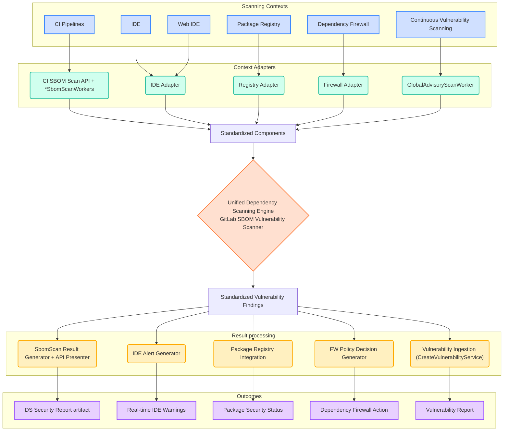

このページには今後予定されている製品・機能・機能性に関する情報が含まれています。ここに示す情報は参考目的のみです。購入・計画の決定にこの情報を使用しないでください。製品・機能・機能性の開発、リリース、タイミングは変更または延期される可能性があり、GitLab Inc. の独自の判断に委ねられています。

<table class="w-full text-sm border-collapse">
<thead>
<tr class="bg-gray-100 text-left">
<th class="px-3 py-2 border border-gray-300">Status</th>
<th class="px-3 py-2 border border-gray-300">Authors</th>
<th class="px-3 py-2 border border-gray-300">Coach</th>
<th class="px-3 py-2 border border-gray-300">DRIs</th>
<th class="px-3 py-2 border border-gray-300">Owning Stage</th>
<th class="px-3 py-2 border border-gray-300">Created</th>
</tr>
</thead>
<tbody>
<tr>
<td class="px-3 py-2 border border-gray-300">ongoing</td>
<td class="px-3 py-2 border border-gray-300"><a href="https://gitlab.com/gonzoyumo" class="text-blue-600 hover:underline">@gonzoyumo</a></td>
<td class="px-3 py-2 border border-gray-300"><a href="https://gitlab.com/mbenayoun" class="text-blue-600 hover:underline">@mbenayoun</a>, <a href="https://gitlab.com/theoretick" class="text-blue-600 hover:underline">@theoretick</a></td>
<td class="px-3 py-2 border border-gray-300"><a href="https://gitlab.com/nilieskou" class="text-blue-600 hover:underline">@nilieskou</a></td>
<td class="px-3 py-2 border border-gray-300">~devops::application security testing</td>
<td class="px-3 py-2 border border-gray-300">2025-08-26</td>
</tr>
</tbody>
</table>

## サマリー

GitLab の依存関係スキャンは複数のコンテキストにわたって断片化しており、それぞれが異なるスキャンエンジンを使用しており、脆弱性検出に一貫性がない可能性があります。スキャンの一貫性を確立し、実装の分岐をなくすために、すべての依存関係脆弱性検出の唯一の情報源として機能する、GitLab SBOM Vulnerability Scanner を基盤とした統合された Dependency Scanning エンジンを提案します。

## コンテキスト

### 現在の断片化とアーキテクチャの制限

GitLab の依存関係スキャンは、技術的な断片化とアーキテクチャ上の制約の両方に悩む、バラバラな実装を通じて機能しています：

**スキャン実装の断片化**：

- **CI パイプラインスキャン**: 独自の脆弱性検出ロジックを持つレガシーの Gemnasium アナライザーを使用
- **継続的脆弱性スキャン**: Rails バックエンドで GitLab SBOM Vulnerability Scanner を利用
- **将来のスキャンコンテキスト**: 各新機能（IDE 統合、パッケージレジストリスキャン、依存関係ファイアウォール）が独自のスキャンアプローチを開発するリスク

**原子的な分析の制限**: 現在のスキャン実装は、依存関係の検出と脆弱性分析を密結合させたモノリシックなアプローチを使用しています：

- **柔軟性のない統合**: Gemnasium のようなレガシーアナライザーは依存関係の発見とセキュリティ分析を単一のアトミック操作として実行し、異なるコンテキスト間でセキュリティロジックを再利用することを不可能にしています
- **コンテキスト固有の再実装**: 各スキャンコンテキストは依存関係の検出と脆弱性分析の両方を実装する必要があり、重複したセキュリティロジックと一貫性のない結果につながっています
- **外部ツール統合の障壁**: 依存関係の検出フェーズと分析フェーズの分離がないため、サードパーティの依存関係検出ツールは GitLab の脆弱性インテリジェンスを活用できません

これにより複数の重大な問題が発生しています：

- **一貫性のない脆弱性検出** - 異なるスキャンエンジンが異なるアドバイザリーソースと検出アルゴリズムを使用し、ユーザーの混乱を招き、セキュリティ機能への信頼を損なっています
- **重複した開発努力** - 各コンテキストが完全なスキャンソリューションを実装し、依存関係の検出とセキュリティ分析の両フェーズで繰り返し作業が発生しています
- **機能パリティの課題** - 機能が進化するにつれて複数のエンジン間で同等の機能を維持することがますます困難になっています
- **統合の複雑さ** - 外部ツールは GitLab の脆弱性インテリジェンスを活用しながら依存関係データを提供することが容易にできません

### 統合への動機

[継続的脆弱性スキャン](https://docs.gitlab.com/user/application_security/continuous_vulnerability_scanning/)は、最も高度で積極的にメンテナンスされたスキャンエンジンとして GitLab SBOM Vulnerability Scanner を導入しました。しかし、この機能は特定のワークフローに限定されており、他のコンテキストはレガシー実装を使い続けています。

私たちのロードマップには、一貫した脆弱性検出から大きな恩恵を受ける新しいコンテキストへの依存関係スキャンの拡張が含まれています：

- リアルタイムの開発者フィードバックのための IDE 統合
- クラウドベース開発環境のための Web IDE スキャン
- 包括的なサプライチェーンセキュリティのためのパッケージレジストリスキャン
- ポリシーベースのアクセス制御のための依存関係ファイアウォール

## 目標

- すべての GitLab スキャンコンテキストにわたって依存関係セキュリティ分析の唯一の情報源として機能する**統合された脆弱性検出**を確立する
- 依存関係の検出を脆弱性分析から分離することで**分解された依存関係分析を実装**し、異なるコンテキストがさまざまなメカニズムで依存関係を発見できるようにしながら、同一のセキュリティ分析ロジックを共有する
- 最も高機能で積極的にメンテナンスされ、機能が完全なスキャン実装を活用するために **GitLab SBOM Vulnerability Scanner を中心に統合する**
- 外部ツールが GitLab の包括的な脆弱性インテリジェンスを活用しながら依存関係データを提供できる**柔軟な統合パターンを可能にする**
- スキャンが GitLab エコシステム内のどこで実行されても**一貫したセキュリティ結果を確保し**、ユーザーの混乱を排除して信頼を構築する
- エアギャップ環境を含むすべての GitLab インストールタイプ（SaaS、セルフマネージド、専用）にわたる**ユニバーサルデプロイをサポートする**
- 共有された統合スキャンエンジンを使用しながら各スキャンワークフローが特化した処理パターンを実装できるようにすることで**コンテキスト最適化されたスケーリングを可能にする**

## 非目標

- 外部消費のための公開 API の定義 - 内部 GitLab サービス統合に焦点を当てる
- 別途処理が必要な独自の要件を持つコンテナースキャンワークフローの移行
- 既存の実装を即座に置き換える - これは段階的な移行の基盤を確立する
- GitLab のコアプラットフォーム機能外のスキャンコンテキストのサポート

## 提案

### 統合された依存関係スキャンアーキテクチャ

断片化と結合の制限の両方に、2つのコアアーキテクチャ原則を通じて対処する新しい依存関係スキャンアーキテクチャを GitLab のインフラ内に作成します：

#### 1. 分解された依存関係分析

**アーキテクチャの分離**: レガシーアナライザーのアトミックなアプローチとは異なり、私たちのアーキテクチャは依存関係の検出（どのコンポーネントが存在するか）を脆弱性分析（どのコンポーネントに脆弱性があるか）から分離します。これにより以下が可能になります：

- **柔軟な発見メカニズム**: 異なるコンテキストが CI 生成マニフェスト、IDE 統合、外部ツール、または SBOM インポートなどさまざまな方法で依存関係を発見できます
- **再利用可能なセキュリティロジック**: 複数のコンテキストが同一の依存関係スキャンエンジンを共有しながら、異なる手段で発見された同一コンポーネントに対して脆弱性分析を実行します
- **外部統合**: サードパーティの依存関係検出ツールが GitLab の包括的な脆弱性インテリジェンスを活用しながらコンポーネントデータを提供できます

**SBOM 統合ポイント**: Software Bill of Materials（SBOM）形式は、依存関係の発見とセキュリティ分析フェーズの間の標準化されたインターフェースを提供し、包括的なコンポーネントメタデータを維持しながらクリーンな分離を可能にします。

#### 2. 集中化された脆弱性検出エンジン

**単一のセキュリティソース**: すべての脆弱性分析は、統合エンジンとして GitLab SBOM Vulnerability Scanner を通じて流れ、依存関係がどのように発見されたか、またはどのスキャンコンテキストが分析を開始したかにかかわらず、同一のセキュリティ結果を保証します。

**特化した処理ワークフロー**: 各スキャンコンテキストは、共有された脆弱性検出ロジックを活用しながら、そのワークロードプロファイルに最適化された独自の処理パターン、バックグラウンドワーカーの設定、スケーリング戦略を実装します。

### アーキテクチャの概要

統合エンジンは、コアスキャンロジックをコンテキスト固有の懸念事項から分離するモジュラーアーキテクチャに従います：

### アーキテクチャの実装

統合エンジンは GitLab の既存の Rails インフラ内で動作し、実証済みのコンポーネントを活用します：

**Rails 統合**: コアスキャンエンジンは GitLab Rails アプリケーション内で実行され、エアギャップ環境を含むすべてのデプロイタイプ（SaaS、セルフマネージド、専用）での互換性を保証します。

**コンポーネントベースの入力処理**: コンテキストアダプターは、コンテキスト固有の処理要件とワークフローパターンに対応しながら、異なるスキャンコンテキストからの入力を標準化されたコンポーネント形式に正規化します。

**バックグラウンド処理**: 各スキャンコンテキストは、レイテンシー、並行性、エラー処理とリトライロジックのカスタマイズされた設定を提供しながら、その特定の非同期ワークロードプロファイルに最適化された専用の Sidekiq ワーカーを実装します。

**同期処理**: 将来、一部のスキャンコンテキストはリアルタイム分析を必要とする場合があります。Rails の直接統合により、依存関係ファイアウォールのポリシー決定などの即時フィードバックを必要とする小さなペイロードをサポートできます。

### コアコンポーネント

**統合スキャンエンジン**: GitLab SBOM Vulnerability Scanner は単一の脆弱性検出エンジンとして機能し、すべてのコンテキストで同一の結果を保証します。

**コンテキストアダプター**: 各スキャンコンテキストは、共有スキャンエンジンを活用するために入力を標準化されたコンポーネント形式に正規化しながら、そのワークロードプロファイルに最適化された独自の処理パターン、使用メータリング、制限、スケーリング戦略を実装します。

**結果プレゼンター**: 標準化された脆弱性の発見事項をコンテキストに適した形式に変換し、各スキャンワークフローがその特定の要件（セキュリティレポート、IDE アラート、ポリシー決定など）に従って結果を処理できるようにします。

### 決定事項

- [001: SBOM Vulnerability Scanner とパッケージメタデータデータベース](./decisions/001_gitlab_sbom_vulnerability_scanner.md)
- [002: 継続的脆弱性スキャンの実装](./decisions/002_continuous_vulnerablity_scanning.md)
- [003: SBOM ベース CI パイプラインスキャン](./decisions/003_sbom_based_scans_for_ci_pipelines.md)

## メリット

**脆弱性検出の一貫性**: すべての GitLab 依存関係スキャン機能は、統合スキャンエンジンを通じて同一コンポーネントに対して同一の結果を報告し、ユーザーの混乱を排除してセキュリティ機能への信頼を構築します。

**アーキテクチャの柔軟性**: 分解された分析により、異なるコンテキストがさまざまなメカニズム（CI 生成マニフェスト、IDE 統合、外部ツール）で依存関係を発見しながら、同一の脆弱性分析ロジックを共有でき、実装の複雑さを削減し革新的な統合パターンを可能にします。

**開発オーバーヘッドの削減**: 新しいスキャンコンテキストは、重複したセキュリティロジックの実装を排除しながら、その特定の依存関係発見方法に集中し、脆弱性検出を実証済みの集中エンジンに委任できます。

**外部統合機能**: SBOM ベースの分離は、GitLab の包括的な脆弱性インテリジェンスを活用しながらコンポーネントデータを提供するサードパーティの依存関係検出ツールのためのクリーンな統合ポイントを提供します。

**簡素化されたメンテナンス**: セキュリティの改善、脆弱性データベースの更新、検出ロジックの強化は、単一の統合エンジンを通じてすべてのスキャンコンテキストに同時に恩恵をもたらします。

**インフラの効率**: 追加のサービス依存関係や複雑なオーケストレーションを必要とせずに、すべての GitLab デプロイで利用可能な既存の Rails と Sidekiq インフラを活用します。

**ワークフロー最適化されたスケーリング**: 各スキャンコンテキストは特定の要件に最適化された処理パターンを実装できます。例えば、継続的脆弱性スキャンは複数のプロジェクトに対して単一のアドバイザリーをスキャンするように調整された専用の Sidekiq ワーカーを使用し、CI パイプラインコンテキストはマルチアドバイザリーながら単一プロジェクトのパフォーマンス制約に最適化されたワーカーを使用します。

## 課題

**共有リソース**: Rails ベースの実装は慎重なリソース管理と、スキャンワークロードがコアアプリケーションのパフォーマンスに影響しないよう、スケーラビリティ、使用量ベースのメータリングと制限を処理するための追加の考慮事項が必要です。これは CI ベースまたはユーザー所有のクラウドネイティブソリューションと比較した場合に特に当てはまります。

**パフォーマンスボトルネック**: 同じインフラを共有する複数のコンテキストは、スキャンワークフロー間のリソース競合を防ぐために慎重な調整が必要です。各コンテキストはパフォーマンス特性が異なりますが、最終的にはすべてが集中スキャンエンジンとその基盤となる PostgreSQL データベーステーブルに依存しています。

**単一障害点**: 集中コンポーネントとして、統合エンジンはあらゆるバグや障害がプラットフォーム全体のすべての依存スキャン機能に影響する重要なインフラになります。

**インフラ依存リスク**: 共有インフラに依存することで、依存関係スキャンはこれらのコアコンポーネントに影響するより広範なプラットフォームの問題に左右されやすくなります。データベースのパフォーマンス低下、Sidekiq キューのバックログ、または Rails アプリケーションの問題は、すべてのスキャンコンテキストに同時に直接影響し、スキャンサービスの可用性を維持するための強化された監視、アラート、回復手順が必要です。

**E2E テストの複雑さの増加**: 分解されたアーキテクチャは、歴史的なモノリシックスキャナーと比較してより複雑なエンドツーエンドテストを必要とします。完全な依存関係の検出と脆弱性スキャンフローのテストには、複数のコンポーネント（アナライザー、パイプライン、GitLab インスタンス、認証トークンなど）の調整が必要で、単一の統合スキャナーのテストよりも開発と検証のワークフローが複雑になります。

## 検討された代替ソリューション

### コンテキスト固有の実装の維持

**アプローチ**: 各コンテキストの個別スキャンエンジンの開発を継続する。

**メリット**: コンテキスト固有の最適化、単一障害点なし、チームの自律性。

**デメリット**: 脆弱性検出の不一致が持続し、メンテナンス努力が重複し、ユーザーの混乱を生み出す。

**決定事項**: 却下 - 対処しようとしているコア断片化の問題を解決しません。

### Runway を使用したサテライトサービス

**アプローチ**: Runway インフラを使用してマイクロサービスとして統合エンジンをデプロイする。

**メリット**: より良い分離、独立したスケーリング、クラウドネイティブアーキテクチャ。

**デメリット**: Runway はすべての GitLab デプロイタイプをサポートしておらず、追加のインフラの複雑さが必要で、ネットワーク依存関係が導入される。

**決定事項**: 現在のユニバーサルデプロイ要件に適していません。すべての GitLab 環境でクラウドネイティブソリューションが成熟する将来のフェーズで検討できます。

### スタンドアロンコンポーネント配布

**アプローチ**: GitLab SBOM Vulnerability Scanner を独立した gem/コンテナーとしてパッケージ化する。

**メリット**: Rails 依存関係を削減し、外部使用を可能にし、関心の分離を改善する。

**デメリット**: 依然としてパッケージメタデータDB へのアクセスが必要で、スキャンの一貫性を保証せず、脆弱性データアクセスを断片化する。

**決定事項**: 却下 - 一貫性の目標を解決せずに複雑さを増し、データベースの断片化が維持される。

## 実装フェーズ

### フェーズ 1: 継続的脆弱性スキャンによる基盤実装（完了）

- GitLab SBOM Vulnerability Scanner を実装する
- この新しいエンジンを使用して継続的脆弱性スキャンを提供する

### フェーズ 2: CI パイプライン統合（進行中）

- CI パイプラインのレガシー Gemnasium アナライザーを SBOM ベーススキャンに置き換える
- 脆弱性検出のリグレッションがないことを保証するための機能パリティ検証を実装する
- 後方互換性の機会と移行ツールを探索する

### フェーズ 3: コンテキスト拡張とエンジンの改善（計画中）

- 統合エンジンを新しいスキャンコンテキスト（依存関係ファイアウォール、IDE 統合、Web IDE、パッケージレジストリ）に拡張する
- 統合エンジンとその依存関係のユーザーエクスペリエンスと堅牢性を強化する
- 大量コンテキスト向けの非同期スキャンパターンを開発する

### フェーズ 4: クラウドネイティブ進化（将来）

- すべての GitLab インストールタイプでクラウドネイティブデプロイソリューションが成熟するにつれてサービス抽出を評価する
- 高度なオーケストレーション機能のない環境向けのフォールバックとして Rails ベースの実装を維持する可能性がある

## 参考資料

- [Dependency Scanning Analyzer](../dependency_scanning_analyzer/index.md)
- [SBOM を使用した依存関係スキャン](https://docs.gitlab.com/user/application_security/dependency_scanning/dependency_scanning_sbom/)
- [継続的脆弱性スキャン](https://docs.gitlab.com/user/application_security/continuous_vulnerability_scanning/)
