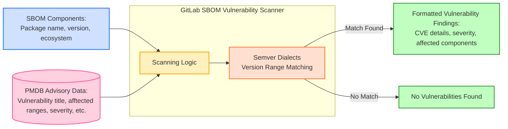

## コンテキスト

GitLab の依存関係スキャンは、従来の CI パイプラインを超えたスキャンワークフローを可能にするために根本的なアーキテクチャの転換を必要としていました。レガシーの Gemnasium アナライザーは CI ベースのスキャンには効果的でしたが、新興のセキュリティ要件に対して重大な制限を生み出していました：

**イベント駆動スキャン要件**: 継続的脆弱性スキャンのような新しいセキュリティワークフローは、ユーザーが開始した CI パイプラインの実行ではなく、外部イベント（セキュリティアドバイザリーの開示）に反応する必要がありました。Gemnasium アナライザーの CI 中心の設計では、このリアクティブなスキャンモデルをサポートできませんでした。

**ユニバーサルデプロイの制約**: GitLab は、一部の環境では利用できない可能性がある追加のインフラを必要とせずに、すべてのデプロイタイプ（SaaS、セルフマネージド、専用、エアギャップ）でただちに機能するスキャン機能を必要としていました。

**分解された分析要件**: 新しいセキュリティワークフローは、依存関係の検出をセキュリティ分析から分離する必要がありました。Gemnasium アナライザーのアトミックなアプローチは、依存関係の発見と脆弱性の検出を密結合させ、異なるコンテキスト間でセキュリティ分析ロジックを再利用したり、外部の依存関係検出ツールと統合したりすることを不可能にしていました。

2つの重要なアーキテクチャ上の決定が必要でした：

1. **スキャンエンジンアーキテクチャ**: 依存関係の検出をセキュリティ分析から分離し、異なる依存関係発見メカニズムとスキャンコンテキスト間での再利用を可能にする脆弱性スキャナーをどのように実装するか
2. **脆弱性データアクセス**: オフライン環境を含むすべての GitLab デプロイタイプにわたって、包括的で最新の脆弱性アドバイザリーデータをスキャナーに提供する方法

## 決定事項

脆弱性アドバイザリー情報のためにローカルに同期された**パッケージメタデータデータベース（PMDB）**データへのアクセスを持つ、Rails 統合コンポーネントとして **GitLab SBOM Vulnerability Scanner** を実装しました。

### GitLab SBOM Vulnerability Scanner

### 分解された分析アーキテクチャ

スキャナーは分解された依存関係分析を実装するステートレスな Rails サービスとして動作します：

**関心の分離**: 私たちの新しいアーキテクチャは依存関係の検出（どのコンポーネントが存在するか）をセキュリティ分析（どのコンポーネントに脆弱性があるか）から分離します。これにより、異なるコンテキストがさまざまなメカニズムで依存関係を発見しながら、スキャナーを通じて同一の脆弱性分析ロジックを共有できます。

**コンポーネントベースの処理**: 生の依存関係マニフェストではなく、SBOM 形式の標準化されたソフトウェアコンポーネントリストを受け入れ、依存関係の発見とセキュリティ分析フェーズの間のクリーンな統合ポイントを提供します。

**ステートレス操作**: 状態を維持したり結果の処理を規定したりせずに純粋な脆弱性検出を実行し、各スキャンコンテキストがその特定の要件に従って発見事項を処理できるようにします。

### セマンティックバージョン処理

セキュリティ分析を実行するために、スキャナーはさまざまなパッケージエコシステムにわたるバージョンマッチングを処理する必要があります。レガシーの Gemnasium アナライザーはネイティブのサブコマンドを使用しますが、このアプローチは GitLab Rails アプリケーションのコンテキストでは適していません。

これを達成するために、GitLab SBOM 脆弱性スキャナーには GitLab のカスタム[セマンティックバージョンライブラリ](https://gitlab.com/gitlab-org/ruby/gems/semver_dialects)が組み込まれています：

**エコシステム横断サポート**: 異なるパッケージマネージャーはさまざまなセマンティックバージョニングスキームを使用しており、正確な脆弱性マッチングのために特化した解析と比較ロジックが必要です。

**バージョン範囲マッチング**: 脆弱性アドバイザリーはエコシステム固有の記法を使用して影響を受けるバージョン範囲を指定することが多く、精密なバージョン比較アルゴリズムが必要です。

**カスタムダイアレクトサポート**: GitLab が開発したセマンティックバージョン処理により、特殊なバージョニングスキームをサポートしない可能性がある外部ライブラリに依存することなく、サポートされているすべてのパッケージエコシステムにわたって正確な脆弱性検出が保証されます。

### コアスキャンプロセス

技術的な実装は、分解されたアーキテクチャを活用する直接的なワークフローに従います：

### パッケージメタデータデータベース（PMDB）

PMDB は GitLab インスタンスに包括的なセキュリティインテリジェンスを提供する高度な外部サービスアーキテクチャとして動作します：

**外部サービスアーキテクチャ**: PMDB は GitLab の外部でスタンドアロンシステムとして実行され、Google Cloud Platform にデプロイされた複数の専門コンポーネントで構成されています：

- **データインジェストパイプライン**: 自動フィーダーが複数のソース（国家脆弱性データベース、GitLab アドバイザリーデータベース、Trivy DB、CISA KEV、FIRST.org EPSS）からデータを収集します
- **処理コンポーネント**: 専用プロセッサが安全な pub/sub メッセージングを通じてライセンスデータ、セキュリティアドバイザリー、CVE エンリッチメントを処理します
- **エクスポートシステム**: 時間ごとのエクスポートがすべての処理済みデータを GitLab インスタンスが消費するための公開 GCP ストレージバケットに集約します

**GitLab インスタンスの同期**: 各 GitLab インストールは PMDB データと同期されたローカルの PostgreSQL テーブルを維持します：

- **5分間同期サイクル**: 自動同期が5分ごとに公開 GCP バケットから更新されたデータを取得します
- **ローカルデータベースストレージ**: 脆弱性データ、ライセンス情報、CVE エンリッチメントがスキャナーの高速アクセスのためにローカルに保存されます
- **回復力ある操作**: ローカルストレージにより、外部の PMDB サービスが利用できなくなっても、スキャン操作が継続されます

**包括的なセキュリティインテリジェンス**: PMDB は基本的なアドバイザリーを超えた充実した脆弱性データを提供します：

- **マルチソースアドバイザリー**: GitLab アドバイザリーデータベース、Trivy DB、その他のキュレートされたソースから脆弱性を集約します
- **EPSS 統合**: エクスプロイト予測スコアリングシステムデータにより脆弱性リスクの優先順位付けが可能になります
- **KEV カタログ**: 重大な脅威の特定のための CISA からの既知のエクスプロイトされた脆弱性
- **CVE エンリッチメント**: 包括的な脆弱性評価のための追加コンテキストとメタデータ

**オフライン環境のサポート**: エアギャップされた GitLab インストールは、文書化された[オフライン同期手順](https://docs.gitlab.com/topics/offline/quick_start_guide/#enabling-the-package-metadata-database)を通じて PMDB データにアクセスでき、インターネット接続なしで脆弱性スキャンが可能です。

**スケーラブルなデータパイプライン**: 外部アーキテクチャは増大するセキュリティインテリジェンス要件をサポートします：

- **時間ごとのエクスポートサイクル**: 時間ごとのデータ集約がシステムパフォーマンスとのバランスを取りながら鮮度を確保します
- **モジュール式処理**: 異なるデータタイプの個別コンポーネントにより、独立したスケーリングとメンテナンスが可能です
- **将来の拡張性**: アーキテクチャは同じパイプラインを通じた追加のデータタイプをサポートします

## 参考資料

- [継続的脆弱性スキャンのドキュメント](https://docs.gitlab.com/user/application_security/continuous_vulnerability_scanning/)
- [パッケージメタデータデータベース設計](https://gitlab.com/gitlab-org/security-products/license-db/deployment/-/raw/main/docs/DESIGN.md)
