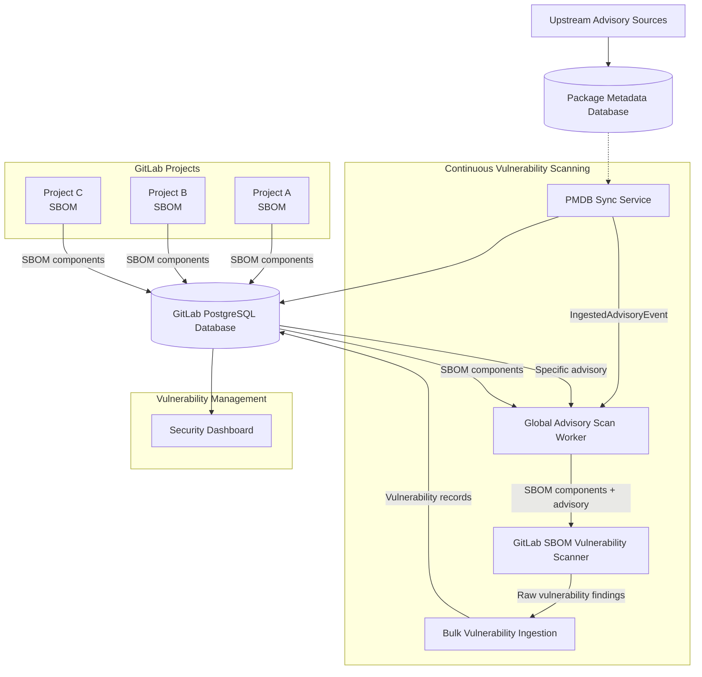

## コンテキスト

CI パイプラインにおける従来の依存関係スキャンは、ビルド時にのみ脆弱性を検出し、重大なセキュリティギャップを残していました。プロジェクトがデプロイされると、その依存関係で発見された新しい脆弱性は次のパイプライン実行まで気づかれません。このリアクティブなアプローチは、本番システムで新たに開示された脆弱性に組織が依然としてさらされていることを意味します。

GitLab は**依存関係の脆弱性の継続的な監視**のためのソリューションを必要としていました。このソリューションは以下を実現する必要がありました：

- コードの変更やパイプラインの実行を必要とせずに、既存のプロジェクトの依存関係における新しい脆弱性を検出する
- 数千のプロジェクトとリポジトリにわたってスケールする
- 既存の脆弱性管理ワークフローと統合する

## 決定事項

統合された GitLab SBOM Vulnerability Scanner の最初の本番ユースケースとして**継続的脆弱性スキャン（CVS）**を実装し、後続のすべての依存関係スキャンコンテキストのためのアーキテクチャ基盤を確立しました。

### コア設計原則

**アドバイザリー駆動スキャン**: プロジェクトを個別にスキャンする代わりに、CVS はセキュリティアドバイザリーの更新を監視し、各新しい脆弱性によって影響を受ける GitLab プロジェクトを特定します。

**SBOM ベースの検出**: プロジェクトは CVS が正確な依存関係マッチングのために脆弱性アドバイザリーと相互参照する Software Bill of Materials（SBOM）インベントリを維持します。

**バックグラウンド処理**: 非同期の Sidekiq ワーカーは、ユーザー向けの GitLab 操作に影響を与えないよう慎重なリソース管理でスキャン操作を処理します。

**インスタンス全体の効率**: 単一のアドバイザリー分析が、各プロジェクトを個別にスキャンするのではなく、GitLab インスタンス全体の影響を受けるすべてのプロジェクトを特定します。

## 実装の詳細

### アドバイザリー駆動ワークフロー

1. **PMDB 同期**: スケジュールされたワーカーが定期的な5分間の同期サイクル中に PMDB バケットから最新のアドバイザリーデータを確認して取得します。
2. **アドバイザリーインジェスト**: インジェストサービスが新しく同期されたアドバイザリーを GitLab インスタンスデータベースに保存し、処理が必要な各アドバイザリーに対して `PackageMetadata::IngestedAdvisoryEvent` を発行します。
3. **脆弱性分析**: `PackageMetadata::GlobalAdvisoryScanWorker` がこのイベントに反応し、`AdvisoryScanService` が GitLab SBOM Vulnerability Scanner を使用して、保存された SBOM データに対してマッチングすることで、この特定のアドバイザリーに対して潜在的に脆弱なすべてのプロジェクトを特定します。
4. **結果統合**: 確認された脆弱性は影響を受けるプロジェクトの GitLab 脆弱性管理システムに直接永続化されます。

### SBOM 統合

**コンポーネントインベントリ**: プロジェクトは、Dependency Scanning ジョブを使用した CI パイプラインの完了または互換性のあるサードパーティ SBOM ドキュメントを通じて更新された依存関係インベントリを表す SBOM データを維持します。

### スキャンの効率性

**インスタンス全体の分析**: 単一のアドバイザリー評価が、各プロジェクトをすべてのアドバイザリーに対して個別にスキャンするのではなく、影響を受けるすべてのプロジェクトを特定します。

**デルタ処理**: 新しいまたは更新されたアドバイザリーのみがスキャン活動をトリガーし、冗長な作業を回避します。

## メリット

**プロアクティブなセキュリティ**: コードの変更やパイプラインのトリガーを待つことなく、デプロイされたアプリケーションの脆弱性を検出します。

**スケーラブルなアーキテクチャ**: アドバイザリー駆動のアプローチが大量のプロジェクトとリポジトリにわたって効率的にスケールします。

**リソースの効率性**: 継続的なプロジェクトの再スキャンではなくアドバイザリーの更新に焦点を当てることで冗長なスキャンを回避します。

**統合の準備完了**: 他の依存関係スキャンコンテキストが再利用できるパターンとインフラを確立します。

**ユーザーエクスペリエンス**: 既存の GitLab セキュリティダッシュボードと通知システムを通じてタイムリーな脆弱性通知を提供します。

## 対処された課題

**スケールでのパフォーマンス**: アドバイザリー駆動の設計により、すべてのプロジェクトを継続的にスキャンすることで発生するパフォーマンス低下を防ぎます。

**データの鮮度**: バックグラウンド処理により、ユーザー向け操作に影響を与えることなく脆弱性データが最新の状態に保たれます。

**ストレージ要件**: SBOM ストレージによりデータベースのオーバーヘッドが増加しますが、プロジェクト全体の再スキャンなしに効率的な脆弱性マッチングが可能になります。

**ワーカーキュー管理**: 専用のワーカークラスにより、異なるスキャンフェーズの独立したスケーリングと監視が可能になります。

## 統合アーキテクチャとの統合

CVS は、スキャンコンテキストが統合された GitLab SBOM Vulnerability Scanner を活用する方法を示す基盤実装として機能します：

**共有スキャンロジック**: 他のコンテキストと同一の脆弱性検出アルゴリズムを使用し、一貫した結果を保証します。

**特化した処理**: スキャンの一貫性を維持しながら CVS 固有のワークフロー最適化を実装します。

**インフラパターン**: 他のコンテキストが再利用できる Sidekiq ワーカーパターンと SBOM 統合アプローチを確立します。

## 運用メトリクス

**アドバイザリー処理**: アドバイザリー同期頻度と処理レイテンシーを監視します。

## 参考資料

- [継続的脆弱性スキャンのドキュメント](https://docs.gitlab.com/user/application_security/continuous_vulnerability_scanning/)
- [パッケージメタデータデータベース設計](https://gitlab.com/gitlab-org/security-products/license-db/deployment/-/raw/main/docs/DESIGN.md)
- [ADR001: SBOM Vulnerability Scanner とパッケージメタデータデータベース](./001_gitlab_sbom_vulnerability_scanner.md)
