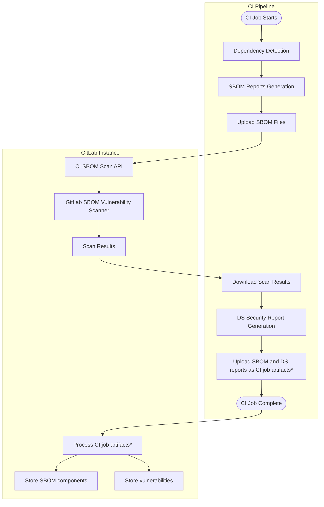
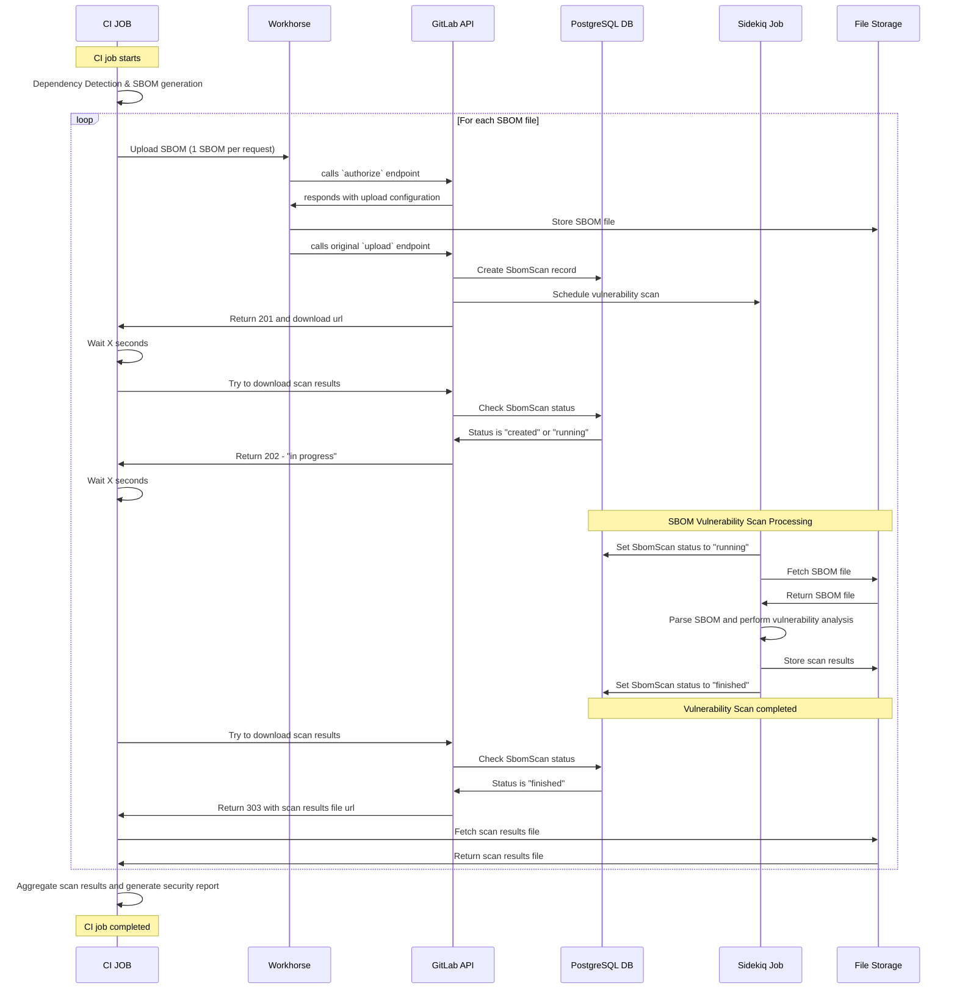

## コンテキスト

GitLab の CI パイプライン依存関係スキャンは、依存関係の検出と脆弱性分析を密結合させたモノリシックな依存関係スキャンを実装するレガシーの Gemnasium アナライザーを使用していました。

継続的脆弱性スキャンによる統合された GitLab SBOM Vulnerability Scanner の導入は分解された分析アーキテクチャの利点を示しましたが、CI パイプラインはこの統合されたアプローチから分離されたままでした。すべてのコンテキストにわたるスキャンの一貫性を確立するために、CI パイプラインの依存関係スキャンを統合されたアーキテクチャを活用するよう移行する必要がありました。

## 決定事項

2つのコアアーキテクチャ原則に従って、**SBOM ベース CI パイプラインスキャン**を実装します。

### 1. 分解された依存関係分析

- **依存関係の検出**は、CI ジョブの Dependency Scanning アナライザーによって専用のステップとしてローカルで実行されます。
- **脆弱性分析**はその後、Dependency Scanning アナライザーの個別の後続タスクとして実行され、潜在的な統合ポイントを提供します。実際の分析は GitLab SBOM Vulnerability Scanner に委任されます。

### 2. 集中化された脆弱性検出エンジン

実行中の CI ジョブから統合された GitLab SBOM Vulnerability Scanner エンジンを活用するために、アナライザークライアントが SBOM ドキュメントを送信してスキャン結果を取得できるよう、新しい[内部 REST API エンドポイント](#internal-api-usage)のセットが開発されます。

## 実装の詳細

### ワークフローの比較

**レガシー Gemnasium フロー**：

1. CI ジョブが Gemnasium アナライザーを実行する
2. アナライザーが依存関係を発見し、ローカルで脆弱性分析を実行する
3. アナライザーが発見事項と CycloneDX SBOM レポートを含む依存関係スキャンのセキュリティレポートを出力する
4. SBOM とセキュリティレポートが CI ジョブレポートアーティファクトとしてエクスポートされ、GitLab インスタンスにアップロードされる

**新しい SBOM ベースのフロー**：

1. CI ジョブが依存関係を発見してローカルで CycloneDX SBOM ドキュメントを生成する新しい Dependency Scanning アナライザーを実行する
2. アナライザーが SBOM ファイルを GitLab に非同期処理のためにアップロードする
3. GitLab が統合された GitLab SBOM 脆弱性スキャナーを通じて SBOM ファイルを処理する
4. アナライザーが完了をポーリングし、脆弱性の発見事項をダウンロードする
5. アナライザーが返された発見事項から依存関係スキャンのセキュリティレポートを生成する（複数の SBOM がスキャンされた場合は結果を集約する）
6. SBOM とセキュリティレポートが CI ジョブレポートアーティファクトとしてエクスポートされ、GitLab インスタンスにアップロードされる

**注意**: CI ジョブアーティファクトは CI ジョブ完了時に CI ランナーによって自動的にアップロードされますが、これらのレポートの処理はセキュリティレポートを生成するすべての CI ジョブが完了した場合にのみ発生します。

### SBOM Scan API と処理ワークフロー

#### 内部 API の使用 {#internal-api-usage}

この API は GitLab の公式 Dependency Scanning アナライザー専用に設計されており、公開のサードパーティ統合のためには文書化されていません。CI 環境の性質上、カスタムジョブからこれらのエンドポイントに技術的にアクセスすることは可能ですが、焦点は以下に置かれています：

- **使用追跡**: すべての API インタラクションが監視と分析のために特定のプロジェクトにログ記録されて帰属される
- **アプリケーション制限**: ソフトとハードの制限が正当な使用パターンを許可しながら乱用を防ぐ
- **公式サポート**: API の安定性について外部使用への保証なしに、公式のアナライザーワークフローのみがサポートされる

#### ワークフロー

**ファイルアップロードプロセス**: Dependency Scanning アナライザーは GitLab の標準ファイルアップロードメカニズムに従う専用の API エンドポイントを通じて生成された SBOM ファイルをアップロードし、追跡のための対応するデータベースレコードを作成します。API は GitLab インスタンスで有効な場合、ダイレクトアップロードと Workhorse アクセラレーションを使用してファイルストレージを処理します。

**データベース追跡**: アップロードされた各 SBOM は、スキャンステータス（created → running → finished）を追跡し、これらのファイルを処理状態に関連付ける一時的な `SbomScan` レコードを作成します。これらのレコードは現在2日間保持され、日次クリーンアップワーカーによって削除されます。

**非同期脆弱性分析**: バックグラウンドの Sidekiq ワーカーがストレージから SBOM ファイルを取得し、コンポーネントデータを解析し、統合された GitLab SBOM Vulnerability Scanner を使用して脆弱性分析を実行し、フォーマットされた結果をファイルストレージに保存します。

**結果の取得**: Dependency Scanning アナライザーはスキャン完了のために API をポーリングし、処理が完了すると結果ファイルへの直接ダウンロード URL を受け取ります。

### API 認証

**CI ジョブトークン認証**: SBOM Scan API は、CI ジョブアーティファクトのアップロードなどの他の CI 統合サービスと同じセキュリティモデルに従い、GitLab の標準 CI ジョブトークン認証メカニズムを使用します。

**トークンベースのアクセス制御**: CI ジョブは `CI_JOB_TOKEN` 環境変数を使用して API リクエストを認証し、以下を提供します：

- **プロジェクトスコープのアクセス**: トークンは特定のプロジェクトとパイプラインコンテキストに自動的にスコープされる
- **時間制限の有効性**: トークンは CI ジョブとともに期限切れになり、不正な再利用を防ぐ
- **権限の継承**: API アクセスは CI ジョブ開始者の同じユーザー権限に従う

**セキュリティ境界**: CI ジョブトークンにより以下が保証されます：

- アクティブな CI ジョブのみが脆弱性スキャンのために SBOM ファイルをアップロードできる
- スキャン結果は元の CI ジョブとプロジェクトのみがアクセスできる
- API の使用がレート制限と監査のために正しいプロジェクトに自動的に帰属される
- CI 統合のための追加の認証情報管理が不要

この認証アプローチは、脆弱性スキャン機能への安全なアクセスを可能にしながら、GitLab の既存の CI セキュリティモデルとの一貫性を維持します。

### レート制限の実装

**補完的なレート制限**: SBOM アップロードワークフローには、サービスの可用性を維持しながらリソース消費を管理するためのハードとソフトの両方のレート制限メカニズムが含まれています。

**プロジェクトスコープのレート制限**: レート制限はプロジェクトごとに適用され、個々のプロジェクトからの過剰な API とバックグラウンドワーカーの使用を防ぎながら、より広いユーザーベースの可用性を維持します。

#### ソフト制限の保護

`dependency_scanning_sbom_scan_api_throttling` アプリケーション制限を使用して、システムは異なる使用パターンを処理するために2つの専門的な Sidekiq ワーカーを使用します：

- **通常の使用 - しきい値未満**:
  - スキャンは高優先度ワーカー（`ProcessSbomScanWorker`）で処理される
  - `:high` 緊急度での高速処理（キュースケジューリング目標 < 10秒）
  - 標準 API レスポンス

- **高い使用 - しきい値超過**:
  - スキャンはスロットルされたワーカー（`ProcessSbomScanThrottledWorker`）にルーティングされる
  - より高い並行性制限を持つ低緊急度（`:low`）
  - API がスロットリングと処理時間の増加についてクライアントに通知するためにレスポンスボディに追加のプロパティ（`throttled` と `project_throttling_resets_in`）を返す
  - クライアントが処理時間の増加についての警告を表示する

- **サービス品質の維持**: 一部のプロジェクトが高い使用ニーズを持つ場合に他のユーザーに影響するリソース競合を防ぐ
- **可用性の維持**: 高い使用量のユーザーはグレースフルなパフォーマンス低下を通じてソフト制限を超えて機能を使用できる
- **透明なコミュニケーション**: ログ出力の警告を通じてスロットリングについて顧客に通知される

#### ハード制限の保護

ほとんどのケースをパフォーマンス低下を通じてグレースフルに処理するソフト制限メカニズムを許可しながら、システムはまた `dependency_scanning_sbom_scan_api_upload` と `dependency_scanning_sbom_scan_api_download` アプリケーション制限を使用して暴走的な使用を防ぎます。これらの制限はしきい値に達すると対応する API リクエストの処理を停止します。

### アナライザーの統合

**統合 SBOM 生成**: 新しい Dependency Scanning アナライザーには組み込みの SBOM 生成機能が含まれています。

**アップロード統合**: アナライザーは GitLab の CI SBOM Scan API を通じて生成された SBOM ファイルをアップロードし、ポーリングを通じて非同期処理を追跡します。リソース管理とスキャン実行速度のバランスを取るため、最大3つの並行リクエストが行われます。

**セキュリティレポート生成**: 完了したスキャンから脆弱性の発見事項をダウンロードした後、アナライザーは Dependency Scanning セキュリティレポートを生成します。

## 移行の利点

**脆弱性検出の一貫性**: CI パイプラインスキャンは同じコンポーネントに対して継続的脆弱性スキャンと同一の脆弱性結果を生成し、セキュリティの発見事項についてのユーザーの混乱を排除します。

**メンテナンスオーバーヘッドの削減**: 脆弱性データベースの更新、検出アルゴリズムの改善、セキュリティインテリジェンスの強化は、統合スキャナーを通じて CI と継続的スキャンの両方に自動的に恩恵をもたらします。

**強化された統合の柔軟性**: SBOM ベースのアプローチにより、GitLab のセキュリティインテリジェンスを維持しながら、外部の依存関係検出ツールとエンタープライズ SBOM ワークフローとの将来の統合が可能になります。

**リソース管理**: ソフトレート制限により、高い使用期間中の処理遅延についての透明なコミュニケーションを提供しながら、すべてのユーザーのサービス可用性が確保されます。

## 対処すべき移行の課題

**CI パフォーマンス要件**: 最適化されたバックグラウンドワーカーによる非同期処理は、さまざまなワークロードパターンにわたってスキャンの精度を維持しながら、脆弱性分析が合理的な時間枠内に完了することを確保する必要があります。

**リソーススケーリング**: ソフトレート制限を持つデュアルワーカーアーキテクチャは、典型的なユーザーのサービス低下なしに通常と高い使用パターンの両方を処理する必要があります。

**機能パリティの検証**: 移行中に脆弱性検出機能のリグレッションがないことを確保するために、Gemnasium と SBOM ベースの結果の包括的な比較が必要です。

**後方互換性**: 実装は同様のセキュリティレポート形式と CI/CD 統合パターンを維持し、既存のワークフローが引き続きサポートされることを保証します。ただし、実装の変動は異なるレベル（CI ジョブ設定、スキャナーカスタマイズなど）で破壊的な変更につながる可能性があります。

## 実装フェーズ

### フェーズ 2a: 並行運用

- 既存の Gemnasium アナライザーと並行して SBOM ベースのアナライザーをデプロイする
- `dependency_scanning_sbom_scan_api` 機能フラグの背後で制御されたロールアウトを有効にする
- 脆弱性検出の一貫性と処理パフォーマンスを監視する

### フェーズ 2b: 機能パリティの検証

- アプローチ間の脆弱性検出結果の包括的な比較
- アップロードと処理ワークフローのパフォーマンスベンチマーク
- さまざまな負荷パターン下でのレート制限の有効性の検証

### フェーズ 2c: デフォルトへの移行

- SBOM ベースのスキャンを新しいプロジェクトのデフォルトにする
- 既存のプロジェクトの移行ガイダンスとツールを提供する
- 移行期間中 Gemnasium アナライザーの可用性を維持する

### フェーズ 2d: レガシーの削除

- 残りのプロジェクトの統合されたスキャンアーキテクチャへの移行を完了する
- レガシーアナライザーとメンテナンスオーバーヘッドを削除する

## 参考資料

- [SBOM ベース依存関係スキャン移行ガイド](https://docs.gitlab.com/user/application_security/dependency_scanning/migration_guide_to_sbom_based_scans/)
- [CI パイプラインスキャン実装エピック](https://gitlab.com/groups/gitlab-org/-/epics/17150)
- [SBOM Scan API ワークフロー Issue](https://gitlab.com/gitlab-org/gitlab/-/issues/542831)
- [ソフトレート制限の実装](https://gitlab.com/gitlab-org/gitlab/-/merge_requests/204070)
- [ADR001: SBOM Vulnerability Scanner とパッケージメタデータデータベース](./001_gitlab_sbom_vulnerability_scanner.md)
- [ADR002: 継続的脆弱性スキャンの実装](./002_continuous_vulnerablity_scanning.md)
