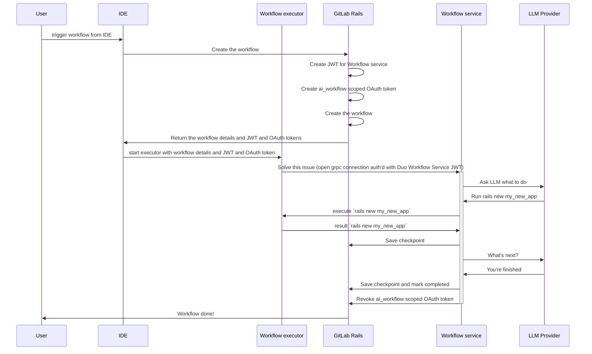
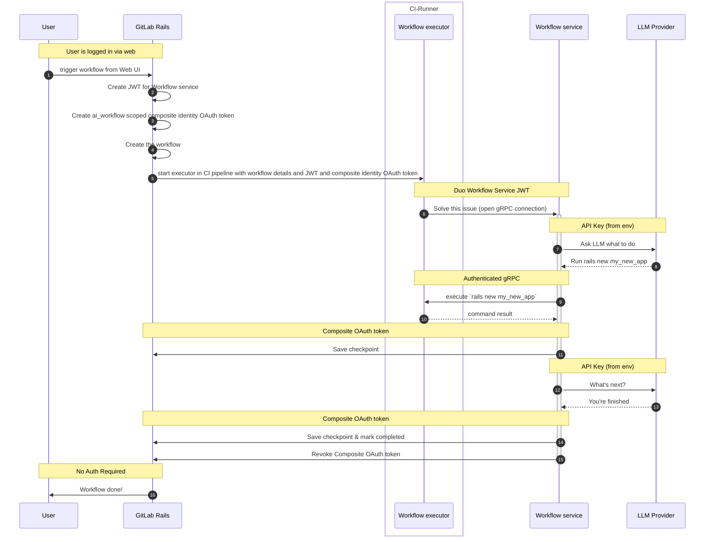
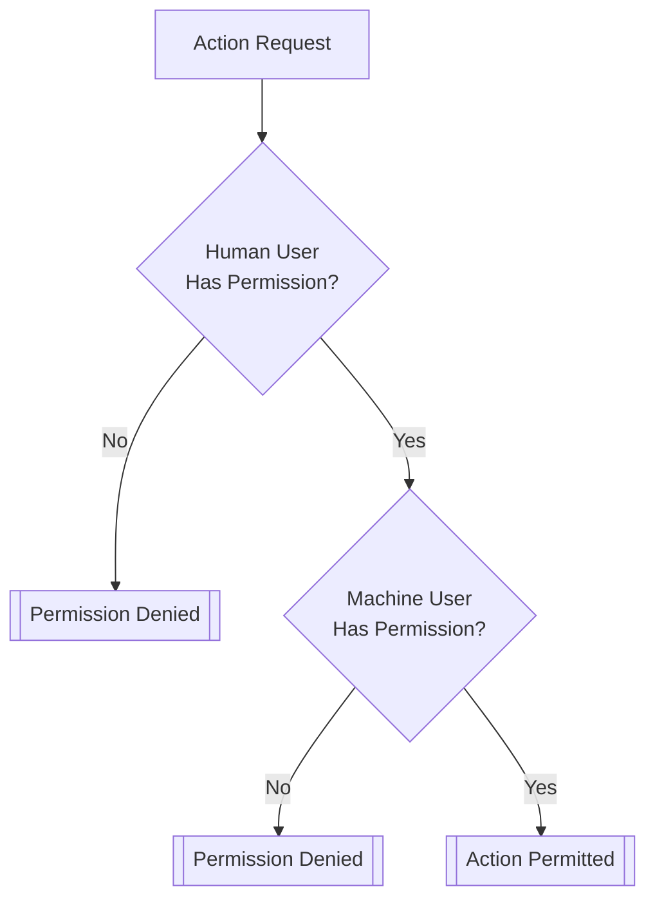
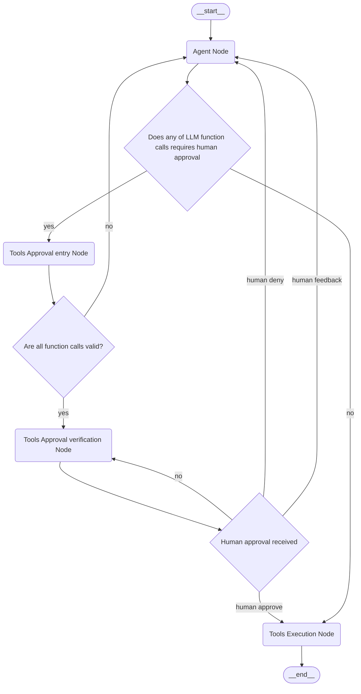
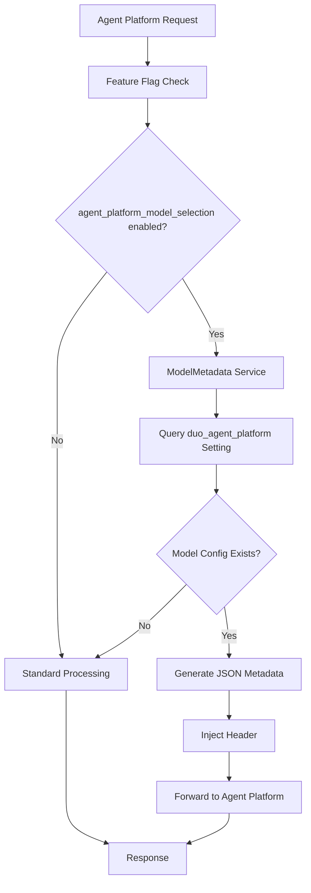
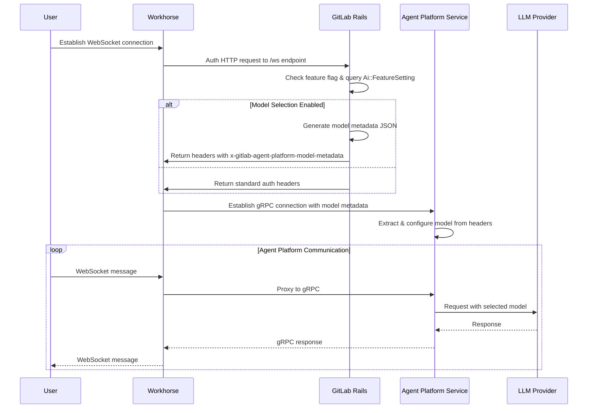



## 実行環境

### エグゼクティブサマリー

GitLab Duo Workflow をサポートする機能は、任意のコードを実行できる必要があり、これは実質的に「信頼できない」コードを意味します。つまり、これらのコードは私たちがデプロイする他のサービスのように実行することはできず、特に Workflow service や AI Gateway の内部で実行することはできません。

この問題に対処するため、Workflow の機能は次のいくつかのコンポーネントで構成されています。

1. Duo Workflow Service。これは私たちのインフラストラクチャ内で実行する Python サービスです。Workflow service は [LangGraph](https://github.com/langchain-ai/langgraph) 上に構築されており、コードの共有を可能にするため AI Gateway と共有リポジトリに存在します。
1. `gitlab-lsp` executor クライアント。これは長時間実行される gRPC 接続を介して Workflow service と通信し、任意のコマンドを実行します。これは私たちのエディタ拡張機能（VS Code など）で使用されるか、対話モードまたは非対話のヘッドレスモードで実行できるスタンドアロンバイナリとして別途ビルドされます。

最初のリリースでは、2 つの実行モードをサポートします。

1. ローカル executor: ユーザーの環境でコマンドを実行し、ファイルをローカルで編集します。編集中のファイルをライブで確認でき、対話的になります。ユーザーのコマンド承認などのコントロールは、ユーザーのワークステーション上で誤って有害なアクションを実行するリスクを軽減するために使用されます。
1. CI executor: Workflow のすべての非ローカルユースケース（例: issue/epic ベースのワークフロー）は GitLab UI または API によってトリガーされ、Workflow executor を実行するための CI パイプラインを作成します。

私たちのアーキテクチャは、Workflow の一部の機能がクラウドホストの Duo Workflow Service を使用して利用可能になるような、self-managed 向けの混合デプロイもサポートします。

### 技術的サマリー

#### コンポーネントの内訳

Duo Workflow は、多くの異なるコアコンポーネント上に構築されています。

1. Workflow UI。私たちは Duo Workflow に対して IDE と Web UI の両方の体験をサポートしています。これらのプラットフォーム間でのコードの再利用を最大化するため、ほとんどの基礎的な UI コンポーネントは [duo-ui](https://gitlab.com/gitlab-org/duo-ui) パッケージ内に構築されており、[duo-ui-next](https://gitlab.com/gitlab-org/duo-ui-next) パッケージへの移行が積極的に進められています。これらの共有パッケージには、ビジネスロジックを持たないプレゼンテーション用（「dumb」）の UI コンポーネントが含まれています。LSP（IDE 用）と Web UI は、これらの共有 UI コンポーネントを取り巻くプラットフォーム固有のビジネスロジックを処理する、別々のラッパーコンポーネントを保持しています。
1. Workflow service。これは gRPC API を持つ、私たちがデプロイする Python ベースのサービスです。これへの唯一のインターフェースは gRPC インターフェースであり、Workflow executor から呼び出されます。内部的には、LangGraph を使用してワークフローを実行します。LangGraph が選ばれた理由については、[この work item](https://gitlab.com/gitlab-org/gitlab/-/work_items/457958) を参照してください。Workflow service は永続化された状態を持ちませんが、実行中のワークフローの状態はメモリに保持され、GitLab 内で定期的にチェックポイントされます。Workflow service は [AI Gateway コードベースの一部](https://gitlab.com/gitlab-org/modelops/applied-ml/code-suggestions/ai-assist/-/tree/main/duo_workflow_service?ref_type=heads) ですが、AI Gateway とは別の独自のデプロイを持ちます。
1. [protocol buffers](https://gitlab.com/gitlab-org/modelops/applied-ml/code-suggestions/ai-assist/-/blob/main/contract/contract.proto)。これは `Executor <-> Workflow Service` と `GitLab Rails <-> Workflow Service` の間の契約を形成します。
1. [`gitlab-lsp` executor コード](https://gitlab.com/gitlab-org/editor-extensions/gitlab-lsp/-/blob/main/packages/lib_workflow_executor/src/executors/node/node_executor.ts)。これは Workflow service への gRPC 接続または GitLab Rails への WebSocket 接続を開き、指示されたアクションを実行することのみを担当します。

#### 主要な制約

以下はアーキテクチャの重要な制約です。

1. すべての状態管理は GitLab 内にあります。
1. Workflow service は定期的に GitLab 内に状態をチェックポイントします。
1. Workflow service のインメモリ状態はいつでもドロップ/喪失される可能性があるため、チェックポイントが唯一の確実な復帰ポイントになります。
1. ローカルの Workflow executor が接続を切断した場合、Workflow service は executor を待っている状況に遭遇するとすぐに状態をチェックポイントしてシャットダウンします。
1. 複数の Workflow service インスタンスが同じワークフロー上で実行されるのを避けるため、Workflow service は実行を開始する前に必ず GitLab とロックを取得しなければなりません。サスペンドするとロックを解放し、同様に、直近 60 秒間チェックポイントしていない場合はタイムアウト状態になります。GitLab はタイムアウトした Workflow service の実行からのチェックポイントを受け付けません。
1. Workflow service がワークフローを再開するたびに、新しい ID を取得します。この ID はチェックポイント時に送信されるため、GitLab はワークフローを実行しているゾンビサービスをドロップ/無視し、ゾンビサービスにシャットダウンを通知できます。
1. コードは、executor が隠し Git ref を GitLab インスタンスにプッシュすることでチェックポイントされます。これは他のチェックポイントと同じ頻度で行われます。
1. ローカル実行の場合、Workflow executor は Workflow service を呼び出すことで直接ワークフローを開始します。
1. ワークフローが UI からトリガーされた場合、Workflow executor は不要です。GitLab が Workflow service を直接呼び出せます。
1. プライベートデータにアクセスしたりデータを更新したりする、Workflow service から GitLab へのすべての API 呼び出しは、ワークフローを作成したユーザーに代わって認証されます。Workflow service は GitLab への特権アクセスを必要としないはずです。

### GitLab.com アーキテクチャ


1. 最初は、すべての入力を環境変数として、ローカルおよび CI パイプラインで実行することに焦点を当てます。
1. 状態は GitLab に保存されるため、Web UI および IDE 拡張機能を通じてアクセスできます。

#### ローカル（IDE）実行の場合



#### リモート（CI パイプライン）実行の場合



#### GitLab Web UI から（別の executor なしで）

Web UI を通じてエージェント型チャットを実行できるようにするため、私たちは[ワークフローを Workhorse の内部で実行する機能を実装しました](decisions/004_workhorse_as_a_duo_workflow_service_proxy.md)。
このアーキテクチャでは、Workhorse がリクエストを GitLab Rails インスタンスに転送するコンポーネントです。


このアーキテクチャは、ローカルファイルシステムが不要であれば、GitLab から限定的なエージェント型フローのセットを実行する可能性を開きます。

このアーキテクチャは最終的に、私たちの executor と Duo Workflow Service の間のすべての直接通信を置き換え、その結果、以下で説明する self-managed 向けに executor が GitLab インスタンスへのリクエストをプロキシする必要性を取り除くこともあります。

#### メッセージングサービスおよび GitLab ネイティブなサーフェスから

Duo Messaging Service により、ユーザーはさまざまなサーフェスから Duo を @メンションすることでワークフローをトリガーできます。これには外部のメッセージングプラットフォーム（Slack、Teams）だけでなく、issue やマージリクエストのコメントといった GitLab ネイティブなサーフェスも含まれます。これはリモートワークフローと同じ CI パイプライン実行パスを使用しますが、異なるトリガーメカニズムを使用します。

1. ユーザーがサーフェス上で Duo を @メンションします（例: Slack メッセージ、MR コメント）
2. サーフェスがイベントを GitLab Rails に送信します
3. サーフェス固有のアダプターが、すべてのポリシー決定（認可、サービスアカウント、フロー選択、プロジェクト）を解決し、それらをトリガーバンドルにパッケージ化します
4. 共有のベースアダプターがメカニズムを処理します。すなわち、コンポジットアイデンティティのリンク、SA プロジェクトメンバーシップ、コールバックコンテキストのエンリッチメントを行い、`ExecuteWorkflowService` に委譲して CI パイプラインを開始します
5. エージェントはコンポジットアイデンティティ（ユーザーとサービスアカウントの権限の積集合）で CI 内で実行されます
6. ワークフローが完了すると、`CallbackWorker`（EventStore 経由で `WorkloadFinishedEvent` をサブスクライブ）がアダプターを通じて結果を発信元のサーフェスに返します

アダプターパターンにより、共有のメカニズムや実行インフラストラクチャを変更することなく、ポリシー決定といくつかの配信メソッドを実装することで、新しいサーフェスを追加できます。

完全なアーキテクチャについては、[ADR 008: Duo Messaging Service](decisions/008_duo_messaging_service.md) を参照してください。

### Self-managed アーキテクチャ

#### ローカル Workflow service の場合

顧客が Workflow service をローカルで実行している場合、アーキテクチャは GitLab.com と非常に似たものになります。これにより、顧客は Workflow service で設定した任意のカスタムモデルを使用することもできます。


#### クラウド Workflow service の場合

self-managed の顧客が、すべての Workflow service コンポーネントを実行することなく Duo Workflow を試用し、迅速に採用できるようにするため、このアーキテクチャは混合デプロイモードをサポートします。この場合、クラウドの Duo Workflow Service は顧客の GitLab インスタンスにアクセスできないと想定しますが、ローカル executor（ユーザーのマシン上または CI runner 内）を使用して、GitLab とのすべてのやり取りをプロキシできます。


### Dedicated アーキテクチャ

self-managed モードと同様に、Dedicated の顧客はクラウド workflow service に接続できます。


## 文書化されたデータ分離モデル

このセクションでは、GitLab Duo Agent Platform のデプロイにおけるデータの隔離、ロギング、コンプライアンス要件、特に規制業界や Dedicated の顧客向けの要件について扱います。

### 他のテナントからのデータ隔離

#### データストレージ

GitLab AI Gateway と Duo Workflow Service は、独自の専用データストレージレイヤーを持ちません。マルチテナントデプロイでは、gateway はワークフロー状態とチェックポイントの永続化のために、GitLab Dedicated インスタンスの既存のストレージメカニズムに依存します。

Dedicated の顧客の場合、データは GitLab Dedicated の既存のテナント隔離境界を通じて隔離されます。LangGraph チェックポイントを含むワークフロー状態は、顧客の隔離されたデータベースと Git リポジトリのインフラストラクチャ内に保存されます。

#### データ転送

クライアントと GitLab Dedicated インスタンスの間で転送中のすべてのデータは暗号化されます。

**対話的セッションパス**（チャット、セッション管理）:

- **クライアントから [Workhorse](https://docs.gitlab.com/development/workhorse/) へ**: 安全な HTTPS/WebSocket 接続

- **Workhorse から [Duo Workflow Service](https://docs.gitlab.com/administration/duo_workflow/) へ**: [Cloud Connector](https://docs.gitlab.com/development/cloud_connector/) を通じてルーティングされる、TLS 暗号化を伴う安全な gRPC 接続

**フロー実行パス**（CI ジョブランタイム）:

- **GitLab インスタンスから Runner へ**: 標準の [CI/CD ジョブディスパッチ](https://docs.gitlab.com/runner/)

- **Runner から GitLab インスタンスへ**: すべての runner 通信は GitLab インスタンスを通じてトンネリングされて返されます。runner は Duo Workflow Service や AI Gateway に直接接続しません

- **デフォルトのコンテナイメージを使用するフロージョブ**は、プロキシベースのネットワークフィルタリングを伴う[サンドボックス](https://docs.gitlab.com/user/duo_agent_platform/environment_sandbox/)内で実行され、アウトバウンド接続を GitLab 所有のドメインに制限します。カスタムコンテナイメージは SRT サンドボックスをバイパスし、ネットワークアクセスに制限がありません。

**LLM プロバイダーとの通信**:

- [Duo Workflow Service](https://docs.gitlab.com/development/workhorse/ai_assisted_features_architecture/#key-components) はプロンプトを [AI Gateway](https://docs.gitlab.com/development/ai_gateway/) に送信し、AI Gateway がリクエストをサードパーティの LLM プロバイダーにルーティングします。
- プロンプトデータは、LLM プロバイダーに送信されると GitLab Dedicated のコンプライアンス境界を離れます。GitLab は、LLM プロバイダーが自身のインフラストラクチャ上でリクエストをどこで処理またはルーティングするかをコントロールできません。

### AI Gateway のロギング

#### ログの生成と保存

GitLab.com のデプロイでは、AI Gateway のログは Google Cloud Logs に出力され、一元的な可観測性のために ElasticSearch/Kibana に取り込まれます。ログにはステータスコード、エラー情報、パフォーマンスメトリクスが含まれます。詳細なロギング設定については、[AI Gateway runbook](https://runbooks.gitlab-static.net/ai-gateway/index.html) と [Duo Workflow Service runbook](https://runbooks.gitlab-static.net/duo-workflow-svc/index.html) を参照してください。

#### Dedicated 環境へのログ転送

AI Gateway によって生成されたログは、GitLab Dedicated の顧客環境に転送されません。GitLab.com と現在の Dedicated デプロイの両方で、AI Gateway はクラウドホストであるため、ログは GitLab のクラウドインフラストラクチャ内に残ります。Dedicated 上の将来のシングルテナント AI Gateway デプロイでは、ロギングは顧客のコンプライアンスおよび運用要件に従って設定されます。

監査やコンプライアンス目的でログアクセスを必要とする顧客は、GitLab Support と協力して、適切なログ転送またはアクセスメカニズムを確立してください。

### GitLab Dedicated コンプライアンス境界との整合

Duo Agent Platform は、GitLab Dedicated の既存のコンプライアンスおよび隔離モデルと統合します。

- **テナント隔離**: DAP データは、既存のデータベースおよびストレージ隔離を活用して、他の GitLab Dedicated データと同じレベルで隔離されます
- **コンプライアンススコープ**: Dedicated インスタンス内にデプロイされた DAP コンポーネント（Rails、Workhorse など）は、同じコンプライアンス認証と監査スコープの対象になります。ただし、[AI Gateway](https://docs.gitlab.com/development/ai_gateway/) は現在クラウドホストであり、Dedicated コンプライアンス境界の外側で動作します。
- **データレジデンシー**: ワークフロー状態と Git データは、顧客が設定したリージョン内に残ります。サードパーティの LLM プロバイダーに送信されるプロンプトデータは、リージョンの境界を離れます（上記の[データ転送](#data-transfer)を参照）。

具体的なコンプライアンス要件やデータレジデンシーに関する質問については、顧客は GitLab の Dedicated サポートチームおよびコンプライアンス文書に相談してください。

#### 復旧と可用性

**データの復旧**: AI Gateway と Duo Workflow Service は、独自の専用データストレージレイヤーを持ちません。[LangGraph](https://www.langchain.com/langgraph) チェックポイントを含むワークフロー状態は、顧客の GitLab Dedicated インスタンス（データベースと Git リポジトリ）内に永続化されます。このデータの復旧は、Dedicated インスタンスの既存の[バックアップとリストア](https://docs.gitlab.com/administration/backup_restore/)の態勢によって統制されます。顧客はインスタンスレベルの RTO/RPO 目標について、Dedicated アカウント/サポートチームに相談してください。

**サービスの可用性**: DAP は AI Gateway と Duo Workflow Service が利用可能であることを必要とします。いずれかのサービスが利用できない場合:

- 新しい [Flow](https://docs.gitlab.com/user/duo_agent_platform/flows/) の実行を開始できません
- 進行中のワークフロー[セッション](https://docs.gitlab.com/user/duo_agent_platform/sessions/)は、アクティブな実行ステップの状態喪失を伴って失敗する可能性があります
- [エージェント型](https://docs.gitlab.com/user/gitlab_duo_chat/agentic_chat/)および[クラシック Duo Chat](https://docs.gitlab.com/user/gitlab_duo_chat/) も影響を受けます（共有の AI Gateway 依存）

### CI パイプラインアーキテクチャ

CI パイプラインは、Workflow executor のホストランタイムオプションとして選ばれました。これは、信頼できない顧客のワークロードを、安定性、サポート、セキュリティ、不正防止、課金モデルとともに実行できる、今日私たちが利用できる唯一のインフラストラクチャだからです。

私たちは、ユーザーが Workflow をサポートするために特定の `.gitlab-ci.yml` を設定しなければならないようにはしたくありません。これを避けるため、[`Ci::Workload`](https://gitlab.com/gitlab-org/gitlab/-/blob/6682c3f76a0196455de3873466f254870383e9bc/app/services/ci/workloads/run_workload_service.rb) という抽象化を使用します。これは実質的に有効な `.gitlab-ci.yml` を構築し、このインメモリ定義でパイプラインを実行します。CI パイプラインの内部は、将来ホストランタイムを変更できる柔軟性を保つため、ワークフローのコードから意図的に抽象化されています。これは重要な設計上の決定です。なぜなら、パイプラインには長期的に不適切になりうるいくつかの制限があり、注意を怠ると、置き換えが困難なほど密結合になってしまうことが容易に起こりうるからです。

CI パイプラインはまた、プロジェクト内で実行されなければなりません。Workflow のユースケースの中には、パイプラインを実行する適切なプロジェクトがないものもあります（例: 新しいプロジェクトのブートストラップ）。これらのワークフローについては、私たちは次のようにします。

1. 最初は、ユーザーがデフォルトの Workflow プロジェクトを作成しておく必要があるようにします。空のプロジェクトで構わず、そこで自動的にパイプラインを実行します。
1. これがセットアップとして大きすぎると判明した場合、デフォルトの Workflow プロジェクトの作成を自動化します。
1. 時間とともに UX が悪い場合、ユーザーからプロジェクトの存在を完全に抽象化し、これを実装の詳細にすることもあります。プロジェクトは GitLab の中心的な部分であるため、これは GitLab に対してかなり広範な影響を与える変更になりうるので、最後の手段と見なされます。

短期的には初期の顧客向けに、既存の CI パイプラインのコンピュート時間に依存することがありますが、長期的には専用の runner をデプロイし、Workflow 固有の課金モデルを導入したいと考えています。

#### CI Runner とインフラストラクチャに関する考慮事項

1. 私たちの Workflow の展開は、CI runner 使用量の大幅な増加を伴う可能性があります。
1. Workflow は、CPU をほとんど使用しない、長時間実行される CI パイプラインの実行を伴う可能性が高いです。主に行うことは、長時間実行される gRPC 接続で LLM やユーザーと前後に通信することです。
1. ユーザーは CI runner の起動に対して非常に低いレイテンシーを期待します。
   1. ワークフローがトリガーされたときにパイプラインを開始する準備が整った、Docker イメージを実行する事前ロードされた VM を持つ方法があるかどうかを判断すべきです。
1. 私たちはおそらく、Workflow 専用の CI runner のセットを望むでしょう。これは、runner を顧客のサブセットに対して有効にするか、これらの runner を Workflow にのみ使用するために適切なジョブのラベリング/runner のマッチングを使用することを意味するかもしれません。
1. 既存の runner フリート上で一部の Workflow 機能を展開することは可能かもしれませんが、これらの runner を分離することに投資する十分なメリットがあると私たちは考えています。

### 状態のチェックポイント

Workflow service が動作するにつれて、Workflow 状態は GitLab-Rails に永続化されます。状態には 2 つのコンポーネントがあります。

1. Langgraph によって管理される State オブジェクト。これには、ユーザーとエージェントの間のすべてのプロンプト履歴と、LangGraph グラフによって作成されたその他のメタデータが含まれます。
1. エージェントがコードを書き込む作業ディレクトリ。
1. すべての状態にデータ保持期限を設けます。PostgreSQL のパーティショニングを使用して、一定時間後に古いワークフローデータをドロップし、一定時間後に古い Git ref もドロップします。

私たちは、GitLab 内の API を使用して LangGraph state オブジェクトを永続化し、この状態を進行に応じて PostgreSQL に保存します。この API は、POC <https://gitlab.com/gitlab-org/gitlab/-/merge_requests/153551> で実装されたように、`thread_ts` ですべてのチェックポイントを識別する、LangGraph に似た規約を使用します。

エージェントがこれまでに書いたコードを含む現在の作業ディレクトリについては、チェックポイントのために隠し Git ref を GitLab にプッシュすることで保存します。各チェックポイントには関連付けられた ref があり、チェックポイントの命名規約（または PostgreSQL に保存されたもの）により、状態チェックポイントに適した Git ref を識別できます。

Git に保存することには、アーティファクトを保存するための新しい API を構築する必要がなく、ユーザーがその SHA をチェックアウトするだけで簡単にコードにアクセスできるという利点があります。また、ワークフローが既存の大規模プロジェクトで作業している場合に、ストレージを大幅に節約できます。最終的にはコードの変更はいずれにせよ Git にプッシュされると予想されるため、これが最もシンプルなソリューションです。

一部のワークフローには既存のプロジェクトがありません（例: プロジェクトのブートストラップ）。それらのワークフローでも、何らかのプロジェクトからトリガーされる必要があります（CI パイプラインに関するセクションで説明したとおり）。したがって、ワークフロープロジェクトを、ワークフローによって生成されたコードのスナップショットを保存するための一時的なリポジトリとして使用できます。

一定のワークフロー有効期限が過ぎた後、時間とともに Git ref をクリーンアップすることも考慮すべきです。

### 認証

GitLab Duo Workflow には、いくつかの認証フローが必要です。

このセクションでは、認証を必要とする各接続を列挙し、認証メカニズムについて説明します。


#### トークンの種類と Time-To-Live (TTL)

Duo Workflow は認証に 2 つの主要なトークンタイプを使用します。

1. **GitLab OAuth トークン**（2 時間 TTL） - Workflow service から GitLab Rails API へのリクエストを認証するために使用されます。このトークンは、ワークフローデータの読み書き、チェックポイントの作成、その他の GitLab API 操作の実行へのアクセスを許可します。2 時間の TTL により、長時間実行されるワークフローに十分な時間を提供しつつ、トークンが定期的にローテーションされることが保証されます。

2. **Cloud Connector JWT**（1 時間 TTL） - gRPC を介した Workflow executor から Duo Workflow Service への接続を認証するために使用されます。この JWT はユーザースコープであり、暗号的に署名されています。1 時間の TTL は、サービス間通信に対してより短い有効期限の窓を提供し、トークンが漏洩した場合の攻撃対象領域を減らします。このトークンは Workflow service を通じた LLM API へのアクセスのみを許可し、ユーザーやプロジェクトのデータへのアクセスは提供しません。

**セキュリティに関する考慮事項:**

- 短い TTL（1～2 時間）は、トークンが漏洩した場合の攻撃の窓を大幅に減らします
- Cloud Connector JWT の限定されたスコープ（LLM API アクセスのみ）は、潜在的なデータ露出を最小化します
- OAuth トークンは必要に応じて取り消すことができ、追加のセキュリティコントロールを提供します

#### ローカル Workflow executor -> Workflow service

ワークフローが開始すると、Workflow executor は Workflow service に接続しなければなりません。

この接続を認証するには:

1. IDE は、GitLab エディタ拡張機能のセットアップ中にユーザーが生成した OAuth トークンまたはパーソナルアクセストークン（PAT）を使用します。
1. IDE はそのトークンを使用して、GitLab Rails API エンドポイントへのリクエストを認証します。
1. GitLab Rails API がこのリクエストを受信すると、インスタンススコープの JWT（CustomersDot から毎日同期）をロードし、Duo Workflow Service に問い合わせて、このインスタンストークンを前述のユーザースコープのトークン（同じく暗号的に署名）と交換します。
1. GitLab Rails はユーザースコープの JWT を IDE に返します。
1. IDE はこの JWT をローカルの Workflow executor コンポーネントに渡します。
1. Workflow executor はこの JWT を使用して、Workflow service の gRPC 接続を認証します。

このフローは、[IDE が AI Gateway に直接接続できるようにするトークンフロー](https://gitlab.com/groups/gitlab-org/-/epics/13252)を模倣しています。

#### CI Workflow executor -> Workflow service

ワークフローが CI runner によって実行される場合、Workflow executor は Workflow service に接続しなければなりません。

CI パイプラインは GitLab によって作成されるため、短期間のユーザースコープおよびシステムスコープの JWT を取得するために GitLab Rails API エンドポイントに問い合わせる必要はありません。代わりに、CI パイプラインの作成プロセスで、GitLab Rails は次のことを行います。

1. ユーザースコープの JWT を生成します。
1. JWT を CI パイプラインに環境変数（例: `DUO_WORKFLOW_TOKEN`）として注入します。
1. CI ジョブ内で実行される Workflow executor は、この環境変数の値を使用して、Workflow service の gRPC 接続を認証します。

#### Workflow service -> GitLab Rails API

すべての executor には、GitLab Rails へのすべての HTTP リクエストに使用される `ai_workflows` スコープの OAuth トークンが追加で渡されます。これは、Duo Workflow Service での認証に使用される JWT とは別です。executor はこのトークンと GitLab インスタンスのベース URL を Duo Workflow Service に渡し、GitLab Rails への直接呼び出しを可能にします。

Workflow service が GitLab Rails API へのリクエストを認証できる必要がある理由:

1. Workflow service は、ワークフロー状態を同期するために GitLab Rails に定期的にリクエストを行う必要があります。これは、Workflow service がこれらのリクエストを認証できなければならないことを意味します。
1. Workflow はコンテキストを収集するために、他の GitLab Rails API クエリを行う必要があるかもしれません。たとえば、「コードで issue を解決する」ワークフローは、issue の内容を取得するための API リクエストを必要とします。
1. ワークフローの最終状態は、GitLab プラットフォーム上の生成されたアーティファクト（例: Git コミットやプルリクエスト）の形を取ることがあります。このアーティファクトを生成するため、Workflow service は GitLab Rails への API リクエストを行えなければなりません。

Workflow service から GitLab Rails API へのリクエストを認証するために使用されるトークンの要件:

1. Workflow によって作成されたアーティファクトは、GitLab プラットフォーム上の AI 生成アクティビティについての透明性を維持するため、監査可能でなければなりません。
1. トークンのアクセスレベルは、Workflow を開始したユーザーのアクセスレベルと一致しなければなりません。これは権限昇格がないことを保証するためです。
1. `duo_features_enabled` が false に設定されているインスタンス/プロジェクト/グループに属するすべてのリソースについて、読み書きをブロックできる必要があります。
1. トークンは、エージェントが実行するのにかかる限り有効であるか、または Workflow service によって更新可能でなければなりません。ワークフローの実行には数時間かかることがあります。

Workflow executor が Workflow service への認証に使用する JWT は、このユースケースでも動作するように適応できる可能性がありますが、いくつかの問題があります。

1. API 認証のためにこの種のトークンを受け付けるよう GitLab Rails を更新する必要があります。
1. JWT は取り消せません。エージェントのアクセスを遮断する必要がある場合はどうするのでしょうか。
1. トークンローテーションを構築する必要があります。古い JWT がすでに期限切れの場合、Workflow service は新しいトークンを生成するための API リクエストをどのように認証するのでしょうか。

これらの理由から、このユースケースには OAuth がより優れたプロトコルです。OAuth トークンは:

1. 2 時間のみ有効です。
1. 取り消すことができます。
1. 組み込みのリフレッシュフローを持ちます。
1. サービス間でアクセスをフェデレートするための確立された認証パターンです。

##### Workflow service OAuth v1

OAuth を使用するため、私たちは次のことを行います。

1. `ai_workflows` という新しいトークンスコープを作成します（[関連 Issue](https://gitlab.com/gitlab-org/gitlab/-/issues/467160)）。
1. IDE が GitLab Rails から Workflow service User JWT をリクエストすると、`ai_workflows` スコープを持つ OAuth トークンも生成して返します。この OAuth トークンはユーザーに属します。
1. Workflow executor は、gRPC 接続が開かれるときに、その OAuth トークンと GitLab Rails インスタンスの `base_url` をメタデータとして Workflow service に送信します。
1. Workflow service は、Workflow のデータを読み書きするためのすべての GitLab Rails API リクエストに OAuth トークンを使用します。

##### Workflow service OAuth v2

2024 年 10 月 18 日時点で、OAuth v1 フローが Workflow に実装されています。

Workflow OAuth の次のイテレーション（v2）も、GitLab API へのリクエストを認証するために OAuth トークンを使用します。ただし、通常の OAuth トークンを使用する代わりに、コンポジット OAuth トークンを使用します。コンポジットトークンは新しい概念であり、OAuth に使用しているライブラリである [Doorkeeper に動的スコープを追加する](https://github.com/doorkeeper-gem/doorkeeper/pull/1739)ことが必要になります。

コンポジット OAuth トークンは[サービスアカウント](https://docs.gitlab.com/ee/user/profile/service_accounts.html)に属しますが、人間のユーザーに結びつけられます。その結果、Workflow の出力はマシンユーザーに帰属しますが、トークンのアクセスはマシンユーザーの権限と人間のユーザーの権限が許可するものの積集合になります。



これを実現するため、私たちは次のことを行います。

- Workflow AI エージェント用に、独自の固有のアイデンティティを持つサービスアカウントを作成します。
  - すべての GitLab インスタンス（GitLab.com を含む）について: インスタンスごとに 1 つのサービスアカウントを持ちます。
- `ai_workflows` と `user:*` スコープの両方を受け付ける新しい GitLab OAuth アプリケーションを生成します（後者のスコープは「動的スコープ」であり、これがコンポジットアイデンティティトークンを可能にします）。
- 新しい OAuth アプリケーションとサービスアカウントユーザー用に OAuth アクセストークンを生成します。
  - このシナリオでは、OAuth クライアントとサーバーは両方とも GitLab です。認証のリクエストは IDE または GitLab から来ます。IDE はすでにユーザー用のトークンを持っており、GitLab はそのトークンをサービスアカウントトークンと交換します。
  - GitLab がクライアントとサーバーの両方であるため、このフロー中にユーザーに OAuth 同意画面は表示されません。グループオーナーまたはインスタンス admin が Workflow サービスアカウントを設定することで Workflow を有効にします。これは実質的に、サードパーティアプリにサービスアカウントの使用を認可する同意画面で「Authorize」をクリックするのと同じことです。
- OAuth アクセストークンは、AI エージェントのアクセス権限を絞り込むため、`ai_workflows` スコープを持ちます。
- AI エージェント用に作成する OAuth アクセストークンは、人間のユーザースコープ（ユーザー ID を使用した `user:123`）を持ちます。

OAuth v2 の認証シーケンスは OAuth v1 と同一で、唯一の違いは生成される OAuth トークンが通常のユーザー OAuth トークンではなくコンポジットトークンであることです。

```mermaid
sequenceDiagram
    participant IDE
    participant LSP
    participant DWE as Workflow executor (local)
    participant DWS as Workflow service
    participant GR as GitLab Rails (.com or SM)
    participant LLMs

    IDE->>GR: API Request to return Workflow service User JWT (UJWT) and Service Account OAuth composite token with `ai_workflows` scope and dynamic user scope. Authenticated with: PAT or OAuth token used to authenticate GitLab Editor Extension.
    GR->>DWS: API request to generate UJWT. Authenticated with: Instance JWT (IJWT)
    IDE->>LSP: pass UJWT, OAuth token, and other metadata. Authenticated with: n/a, installed locally,
    LSP->>DWE: pass UJWT, OAuth token, and other metadata. Authenticated with: n/a, installed locally.
    DWE->>DWS: grpc connection. Pass OAuth token and other metadata to be used for API requests to GitLab Rails. Authenticted with: UJWT in header.
    DWS->>LLMs: Authenticated with: API keys from environment
    DWS->>GR: API requests to create the workflow, save checkpoints, and perform any other API requests required by the Workflow. Authenticate with: Service Account OAuth composite token with `ai_workflows` scope and dynamic user scope.
```



詳細については、[Issue 480577](https://gitlab.com/gitlab-org/gitlab/-/issues/480577) を参照してください。

##### Workflow service OAuth v3

`ai_workflows` スコープは、トークンの能力を狭く保つために追加されました。

`ai_workflows` の静的スコープアプローチには 2 つの主な問題があります。

- すべての Workflow が同じ API エンドポイントへのアクセスを必要とするわけではありません。すべての Workflow に同じスコープを使用することで、必要以上のアクセスを提供してしまっています。これは[最小権限の原則](https://en.wikipedia.org/wiki/Principle_of_least_privilege)に違反します。
- 各 GitLab API エンドポイントは、このスコープに対して手動で許可リストに登録しなければなりません（[例](https://gitlab.com/gitlab-org/gitlab/-/merge_requests/162671)）。これは、Workflow に新しい機能を提供するためにコード変更が必要になることを意味し、時間がかかります。また、スコープがまだ必要なエンドポイントに対して許可リストに登録されていない古い GitLab バージョンでは、新しい Workflow 機能が利用できない可能性があることも意味します。

これら両方の問題に対する解決策は、OAuth アクセストークンに動的スコープを提供することです。これは、`ai_workflows` やその他の静的トークンスコープに依存するのではなく、スコープ自体がトークンがアクセスできるエンドポイントを決定することを意味します。

高度なトークンスコープは、[パーソナルアクセストークン](https://gitlab.com/gitlab-org/gitlab/-/issues/368904)、[セキュアジョブトークン](https://gitlab.com/groups/gitlab-org/-/epics/15234)に追加されており、[ルータブルトークン](https://gitlab.com/gitlab-com/content-sites/handbook/-/merge_requests/7856)を可能にするものです。

動的トークンスコープは、コンポジットアイデンティティ（上記で説明した OAuth v2）をサポートするため、OAuth トークンにも追加されています。動的トークンスコープを使用してターゲットを絞った API アクセスを有効にする計画はまだ進行中です。このトピックに関する議論は [Issue 468370](https://gitlab.com/gitlab-org/gitlab/-/issues/468370) にあります。

### 検討した選択肢と長所/短所

#### 安全でない実行のみをローカル/CI パイプラインに委譲する

これが私たちが選んだ選択肢です。可能な限り多くの機能を私たちが運用するサービス内に保ちつつ、安全でない実行を、ローカルまたは CI パイプラインで実行できる Workflow executor に委譲しようとするものです。

**長所**:

1. インフラストラクチャを自分たちで運用することで、展開されるバージョンをよりコントロールできます。
1. ローカル使用のためにユーザーがインストールする必要のある依存関係が少なくなります。
1. self-managed の顧客が、新しい GitLab コンポーネントをデプロイすることなく Workflow を試せる、迅速なオンボーディング体験を提供します。

**短所**

1. 長時間実行のため、私たちが運用する他のサービスとは異なるスケーリング特性を持つ、新しいインフラストラクチャをデプロイして保守する必要があります。

#### ローカルで実行する

**長所**:

1. これにより、開発者はほとんどが作業しているローカル環境に留まることができます。
1. コンピュートはローカル開発者によって吸収されるため、分単位で課金されることを心配する必要がありません。
1. 特にエージェントが作業している間にユーザーがコードをレビュー/編集する必要がある場合に、ユーザー操作のレイテンシーが低くなります。

**短所**:

1. 隔離された開発環境を持っていない限り、コマンドがコンピュータへの完全なアクセス権を持つため、ローカルで実行するとリスクが高くなります。これは、ユーザーの確認なしにエージェントが実行できるコマンドを制限する UX によって緩和できます。
1. このアプローチは、ある程度のローカル開発者のセットアップを必要とし、ユーザーが Web UI から開始することを期待するタスク（例: issue/epic のプランニング）には適さないかもしれません。

#### CI パイプライン（CI runner 上）

POC と調査については <https://gitlab.com/gitlab-org/gitlab/-/issues/457959> を参照してください。

**長所**:

1. CI パイプラインは、信頼できないワークフローを実行できる、私たちが持つ唯一の事前設定済みインフラストラクチャです。
1. CI 分単位の確立された課金モデルがあります。

**短所**:

1. CI パイプラインは起動が遅く、これは、ユーザー入力を待ってタイムアウトしている間にパイプラインを再起動する必要がある場合、イテレーションと段階的な AI 開発が遅くなる可能性があることを意味します。
1. エージェントがユーザー入力を待っている間、CI 分が消費される必要があります。これにはおそらくタイムアウトメカニズムが必要であり、その結果、ユーザーが戻ってきて入力を与えると、新しいパイプラインを再起動する必要があります。
1. CI パイプラインはアクセスが困難な環境で実行されます（つまり SSH したり、ライブでイントロスペクトしたりできません）。そのため、目の前でライブで構築されているコードとユーザーが対話することが難しくなる可能性があります。
1. CI パイプラインには、実行するための何らかのプロジェクトが必要です。これはおそらく克服できないものですが、ワークフローパイプラインを実行するための「ワークフロープロジェクト」を自動的に作成することで、セットアッププロセスを簡素化できるかもしれません。
1. 非コードワークフロー（例: MR のレビュー）を実装する場合、隔離されたコンピュート環境は不要ですが、それでも顧客にコンピュート分を使用させることになります。X-Ray レポートのような他のケースで、これが良い体験ではないことを私たちは見てきました。

#### GitLab workspaces（リモート開発）

POC と調査については <https://gitlab.com/gitlab-org/gitlab/-/issues/458339> を参照してください。

**長所**:

1. エージェントがあなたの開発環境でローカルに作業し、あなたと対話でき、同じファイルをライブで見て編集することさえできるため、これは最も速いイテレーションサイクルを持ちます。
1. 顧客は自身のインフラストラクチャ上で実行でき、これにより効率的なリソース使用をコントロールできます。

**短所**:

1. 現在、私たちは顧客が自身のインフラストラクチャ（K8s クラスター）を持ち込むことのみをサポートしており、これは始めるための障壁が自身の K8s クラスターを持ち込むことであり、これはかなり大きな労力を意味します。
1. 顧客が自身の K8s クラスターを持ち込まなくて済むよう GitLab.com 上にインフラストラクチャを構築したい場合、これはセキュリティとインフラストラクチャの観点からかなり大きな労力になります。それは可能ですが、セキュリティ、不正使用、課金のすべての複雑さに対処するには、初期開発と継続的な保守の両方で多くのチームの関与が必要になります。

## セキュリティ

### 脅威モデリング

詳細かつ最新の脅威モデリングについては、https://gitlab.com/gitlab-com/gl-security/product-security/appsec/threat-models/-/blob/master/gitlab-org/AI%20features/Duo%20Workflow.md を参照してください。

### ローカル実行のセキュリティに関する考慮事項

ローカル実行は開発者にとって最も価値の高い機会を提供しますが、LLM のバグやミスがユーザーのローカル開発環境に重大な損害を与えたり、機密情報を漏洩させたりする可能性があるという最大のリスクも伴います。

リスクの例:

1. 正直だが重大なミスを犯す可能性のある AI。
1. ときに敵対的になる可能性のある AI。
1. LLM のレスポンスを提供する Duo Workflow Service が侵害される可能性があり、これによりこのツールのすべてのユーザーにシェルアクセスが許可されることになります。

### Workflow executor のサンドボックス化

ここでリスクを緩和する 1 つの提案は、Workflow executor が権限のない Docker コンテナ内でのみ実行できるような、何らかの形のサンドボックス化を使用することです。そのようなソリューションは次のことを行う必要があります。

1. ローカルの作業ディレクトリをコンテナにマウントし、ユーザーがホストで作業しているファイルを引き続き編集できるようにします。
1. ユーザーまたはエージェントがアプリケーションとテストを実行するために必要なすべての開発依存関係をインストールします。

上記の選択肢は、Dev Containers を利用することもあります。

### コマンドのユーザー確認

リスクを制限するもう 1 つの選択肢は、エージェントが実行するすべてのコマンドについて、コマンドを実行する前にユーザーに確認を求めることです。いずれにせよこれをオプションとして実装する可能性が高いですが、より大規模なワークフローの効率的な開発を望むことを考えると、タスクを終わらせるために多くのコマンドを実行する必要がある場合、ツールの効率を制限する可能性があります。

私たちはまた、ユーザー定義の許可リストに登録されたコマンドのセット（例: `ls` と `cat`）があり、ユーザーが確認する必要なくエージェントがプロジェクトを読み取って理解できるようにする、ハイブリッドアプローチも検討するかもしれません。ただし、このアプローチは、ユーザーが `rspec` のようなコマンドを許可リストに登録したい場合のすべてのニーズを解決するわけではないかもしれません。エージェントが spec ファイルに望むものを何でも入れられるため、これは実質的に依然として任意のコード実行を許可することになります。

## Workflow UI

Workflow UI は、少なくとも次の場所で利用可能である必要があります。

1. GitLab Rails Web UI 内
1. 私たちのエディタ拡張機能内

複数の UI が必要であること、また上記で説明したように Workflow executor 用に複数の実行環境を持つことが、次の決定につながりました。

### UI をどのようにパッケージ化するか

私たちは Duo Workflow に対して IDE と Web UI の両方の体験をサポートしています。プラットフォーム固有の柔軟性を維持しつつコードの再利用を最大化するため、私たちの UI アーキテクチャは関心の分離に従います。

**共有 UI コンポーネント**: ほとんどの基礎的な UI コンポーネントは [duo-ui](https://gitlab.com/gitlab-org/duo-ui) パッケージ（[duo-ui-next](https://gitlab.com/gitlab-org/duo-ui-next) へ移行中）に存在します。これらはビジネスロジックを含まないプレゼンテーション用（「dumb」）のコンポーネントであり、IDE と Web の両プラットフォームで簡単に再利用できます。

**プラットフォーム固有のラッパー**: LSP（IDE 用）と Web UI はそれぞれ、共有 UI コンポーネントを取り巻くプラットフォーム固有のビジネスロジック、データ取得、状態管理を処理する独自のラッパーコンポーネントを保持します。

IDE 統合については、私たちはすべてのエディタ拡張機能間での再利用を最大化するため、データアクセスの大部分を [GitLab Language Server](https://gitlab.com/gitlab-org/editor-extensions/gitlab-lsp) に組み込みます。私たちは、IDE でレンダリングされて LSP から提供される webview と、ネイティブの IDE UI 要素を組み合わせて使用します。ユーザー体験を著しく制限しない場合、LSP から提供される Web ページにインターフェースを構築し、それを Web ビューとして IDE でレンダリングすることを選びます。これは、すべてのエディタ拡張機能間での再利用を最大化するためです。

### Web UI はどのように現在の状態をライブで反映するか

Workflow service は定期的にその状態を GitLab Rails に保存します。UI は WebSocket を通じてリアルタイムの更新を受け取り、新しいデータが届くと自動的にリフレッシュします。

ユーザーが Workflow executor をローカルで実行している可能性があり、状態が発生する様子の一部を見ているかもしれないことを考えると、実行中のワークフロープロセスのインメモリ状態を単にライブレンダリングしたくなるのは理にかなっているかもしれません。レイテンシーの理由から意図的にこの選択肢を選ぶこともありますが、フロントエンドと Workflow executor を完全に分離して設計するよう注意する必要があります。なぜなら、それらは常に一緒に実行されるとは限らないからです。たとえばユーザーが GitLab CI で実行されるワークフローをローカルでトリガーすることもあれば、Web UI を使用して、ローカルで開始されたワークフローと対話し、再実行することもあります。

そのため、私たちは一般に UI と executor の間の直接的な対話を持たないことを好み、代わりにすべての通信は GitLab を経由して行われるべきです。これに対する例外はケースバイケースで検討されるかもしれませんが、説明した理由により、機能を簡単に変更して GitLab から消費できるようにするため、明確な API 境界が必要になります。

#### メッセージストリーミングアーキテクチャ

ペイロードサイズを減らすため、クライアントは理想的には、最新の変更のみを含む増分的なメッセージ更新を受け取り、それらをローカルで連結できるとよいでしょう。ただし、システムは、クライアント側の作業なしに完全な会話履歴をロードする能力を維持すべきです（例: リアルタイム更新を必要としない Sessions ページ）。これは、メッセージをロードする 2 つの異なる方法を維持することを意味します。1 つはストリーミング用に最適化されたもの、もう 1 つは set-and-forget な操作です。

### 状態

UI の状態は、UI の状態変化と API レスポンスの間の競合状態を避けて一貫性を保証するため、サーバーによって駆動されます。これにより、データとアクションを同期させることが簡素化されます。すべての可能なワークフロー状態は [WorflowStatusEnum](https://gitlab.com/gitlab-org/duo-workflow/duo-workflow-service/-/blob/main/duo_workflow_service/entities/state.py?ref_type=heads#L23) で確認できます。

主要なアーキテクチャパターンは、入力を必要とするユーザー操作はすべて `INPUT_REQUIRED` ステータスを通過することです。これは、ツールの承認、プランの確認、その他の対話的な決定のいずれであっても、ワークフローが実行を一時停止してユーザーのレスポンスを待つための一貫したメカニズムを提供します。

ローカルで実行される（IDE 実行）Flow については、アーキテクチャはワークフローを再開する前に `DuoWorkflowEvent` がキューに入れられることを期待します。このイベントは、ユーザーのレスポンスまたは入力を提供することで意思決定プロセスを導き、workflow service が適切に実行を続けるために必要なコンテキストを持つことを保証します。

対照的に、Duo Agentic Chat はこのパターンに従いませんが、これはほぼ間違いなく望ましいアプローチです。いずれは、Flow は Duo Chat と同様のパターンを使用するように移行されるべきです。

### チェックポイント

チェックポイントはサーバー側で構築され、特定のポイントから実行を再開する方法として機能します。これらは非常に LangGraph の内部的な詳細であり、クライアントに直接使用/公開されるべきではありません。これは、より速いイテレーションを可能にするため歴史的に無視されてきましたが、現在は rails 側から [GraphQL フィールド duo_messages をサポートしており](https://gitlab.com/gitlab-org/gitlab/-/work_items/535898)、これによりクライアントは API とクライアントの間の適切な契約とともにチェックポイントからのデータを消費できます。

Duo messages は次のことができます。

- リアルタイム更新のためにクライアントにストリーミングされる。
- 現在の状態を含む。
- `ui_chat_log` に追加された現在のメッセージを含む。

#### duo_messages の使用

`duo_messages` フィールドは、生のチェックポイントデータを解析することなくワークフローのチャット履歴にアクセスするための、クリーンで構造化された API を提供します。これは `duoWorkflowWorkflows`（完全な履歴の取得用）と `duoWorkflowEvents`（ストリーミング更新用）の両方で利用可能です。このフィールドは非推奨の `checkpoint` フィールドを置き換え、内部の LangGraph 状態から UI に関連するデータのみを公開することで、ペイロードサイズを大幅に削減します。

## Workflow エージェントのツール

Workflow の **エージェント** は、簡略化した見方では、**プロンプト** と **LLM** のペアです。
この定義によれば、エージェントだけでは外界と対話できず、これは自動化できる作業の範囲を大幅に制限します。この制限を克服するため、エージェントには **ツール** が装備されます。

ツールは、エージェントが [function calling](https://docs.anthropic.com/en/docs/build-with-claude/tool-use) LLM 機能を使用して呼び出せる関数です。
これらの関数は、エージェントに代わってさまざまなアクションを実行します。たとえば、エージェントには `ls` や `cat` のような bash コマンドを実行し、それらの bash コマンドの結果をエージェントに返すツール（関数）が装備されるかもしれません。

**エージェント** が利用できるツールセットの広さが、自動化できる作業の範囲を定義します。したがって、Workflow 機能を成功に導くには、広範で網羅的なツールセットを提供することが必要になります。

予見されるツールには次のものが含まれます。

1. Workflow executor を介して bash コマンドを実行するツール。
1. ファイルを操作する（読み書きを含む）ツール。
1. Git VCS を操作するツール。
1. [GitLab HTTP API](https://docs.gitlab.com/ee/api/api_resources.html) と統合するツール。

### ツールの権限と承認システム

エージェントにツールを装備することには、さまざまなリスク要因が伴います。たとえば、読み取りツールは誤って適用されると機密データとパブリックデータの境界を越える可能性があり、Duo Workflow Executor のホスト bash ターミナルと直接統合するツールは、エージェントがミスを犯したり悪意のあるアクションを実行するよう騙されたりすると、一連の深刻な結果を引き起こす可能性があります。
さまざまなツールのマイナスの影響を制限するため、ツール承認システムが実装され、ユーザーは任意のワークフロー実行に対して利用可能なツールのセットを制限したり、特定のツールが実行される前にエージェントにユーザー承認を求めることを強制したりできます。

ツール承認システムは、ツールのバケットに _agent privileges_ という名前が付けられた、バケットアプローチに基づいています。各バケットは、実装されたすべてのツールのサブセットを概説し、ユーザーは[次のセクション](#how-agent-tool-set-is-being-defined-for-each-workflow-run)で概説するプロセスに従って、それらを完全に利用可能にするか、条件付きで利用可能にできます。_Agent privileges_ は Duo Workflow Service 内の [`tools_registry`](https://gitlab.com/gitlab-org/modelops/applied-ml/code-suggestions/ai-assist/-/blob/5e242511c27d6d981dc29f3e1871882b00dcea8f/duo_workflow_service/components/tools_registry.py#L76) で定義され、GitLab Rails の [`Workflow`](https://gitlab.com/gitlab-org/gitlab/blob/13461f57b9f087055e23651eead75cdc716c1cbb/ee/app/models/ai/duo_workflows/workflow.rb#L41) モデルに反映されます。

#### 各ワークフロー実行に対してエージェントのツールセットがどのように定義されるか

1. エンジニアは、ワークフローの実装中に、モデルに付与される可能性のあるすべてのツールを列挙することで、エージェントのツールセットを定義します。
1. ワークフロー実行の作成時に、ワークフローの GitLab API [エンドポイント](https://gitlab.com/gitlab-org/gitlab/blob/467a527a7a78f45dddf547ebb86c63c6239f34f0/ee/lib/api/ai/duo_workflows/workflows.rb#L84)に `agent_privileges` を伴うリクエストが行われます。これは、ステップ 1 でエンジニアが定義したツールセットの完全な範囲を、ユーザーが付与した _agent privileges_ によって制約されるサブセットに制限します。さらに、その API リクエストには `pre_approved_agent_privileges` が含まれることがあり、これにより、エージェントは列挙されたバケットのツールを承認を求めることなく使用できます。

#### ツールの承認がどのように強制されるか

ツール承認の検証は、LLM 生成の function call を生成するエージェントのノードと、LLM の function call を実行する `ToolExecutor` ノードの間で行われます。
`ToolExecutor` ノードがトリガーされる前に、保留中のすべての function call が、[前のセクション](#how-agent-tool-set-is-being-defined-for-each-workflow-run)で概説したプロセスに従って `pre_approved_agent_privileges` で定義された許可リストと照合されます。

許可リストに含まれていない function call が少なくとも 1 つある場合、ツール承認サブグラフが呼び出されます。
ツール承認フローは下の図に示されています。



`Tools Approval verification Node` では、ユーザーの承認、拒否、またはエージェントに進路を修正するよう指示するフィードバックを待つため、ワークフロー実行が休止状態になります。ユーザーが承認を提供すると、私たちは executor を再起動してワークフローを再開します。

## Agent Platform のモデル選択

### 概要

Agent Platform は動的なモデル選択をサポートしており、GitLab インスタンスがインスタンスレベルで AI モデルを設定できます。この機能は、self-hosted モデルインフラストラクチャと AI Gateway のモデル選択ロジックを再利用し、GitLab ホストモデルと self-hosted の OpenAI 互換エンドポイントの両方をサポートします。モデルのメタデータはユーザーに公開されないため、self-hosted モデルの API キーのような機密データを安全に送信できます。

### アーキテクチャ

モデル選択機能は、3 つの主要なコンポーネントで構成されます。

1. **Rails Model Metadata Service**: インスタンスレベルの `Ai::FeatureSetting` からモデル設定を抽出します
2. **ヘッダー注入**: Workhorse を通じて `x-gitlab-agent-platform-model-metadata` ヘッダー経由でモデルメタデータを渡します
3. **Agent Platform Service の統合**: ヘッダーをインターセプトし、それに応じて LLM リクエストを設定します

このアーキテクチャにより、self-hosted モデルのメタデータ（API キーを含む）がユーザーに公開されないことが保証され、サービス間で機密の認証データを安全に送信できます。

#### Rails アーキテクチャ



#### エンドツーエンドのリクエストフロー



#### モデル設定

モデルは `Ai::FeatureSetting` レコードを通じてインスタンスレベルで設定されます。

##### GitLab ホストモデル

```json
{
  "model_provider": "anthropic",
  "model_name": "claude-3-7-sonnet-20250219"
}
```

##### Self-Hosted モデル

```json
{
  "model_provider": "self_hosted",
  "model_name": "custom-llama-7b",
  "api_endpoint": "https://internal-llm.company.com/v1",
  "api_key": "[ENCRYPTED]"
}
```

この機能は `agent_platform_model_selection` 開発フラグによって制御され、設定の保存には `duo_agent_platform` フィーチャー設定（ID: 16）を使用します。

## POC - デモ

1. [POC: issue を解決する（内部のみ）](https://www.youtube.com/watch?v=n1mpFirme4o)
1. [POC: Workspaces 内の Workflow（内部のみ）](https://youtu.be/x7AxYwiQayg)
1. [POC: Docker executor を使用した Autograph（内部のみ）](https://www.youtube.com/watch?v=V-Mw6TXOkKI)
1. [POC: タイムアウトと再起動を伴う CI パイプライン内の Workflow（内部のみ）](https://youtu.be/v8WWZuAGXMU)

## 開発ノート

**図ファイルに関する注**: 生の `dap-raw.excalidraw` ファイルは開発目的のみでリポジトリに含まれており、適切なドキュメントと見なすべきではありません。これは Excalidraw ホワイトボードでの直接編集を可能にするために保持されています。フォローアップで、個々の図はより見やすくしつつ編集可能性を維持するため、JSON が埋め込まれた PNG（`.excalidraw.png`）としてエクスポートされ、その後、生のファイルは削除できます。
