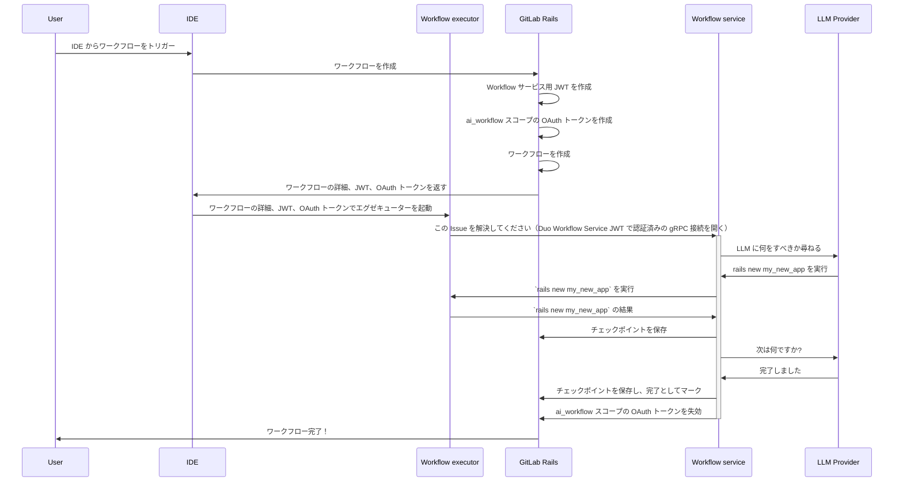
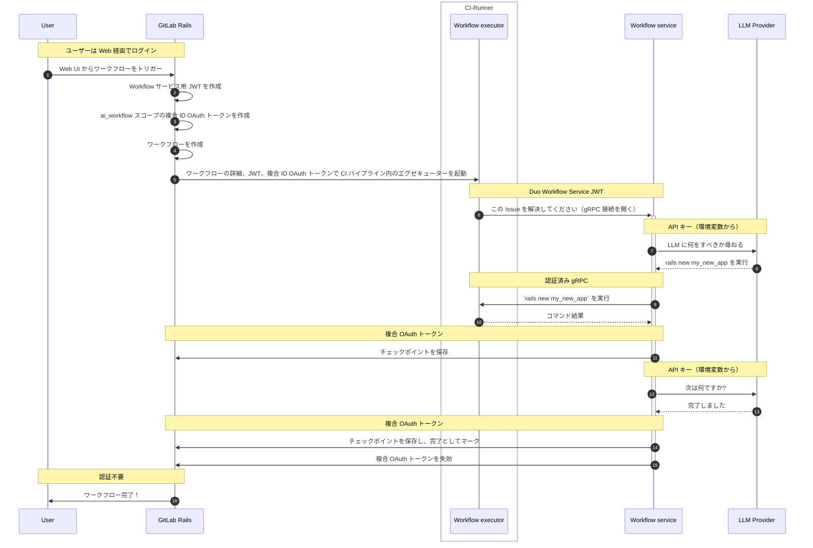
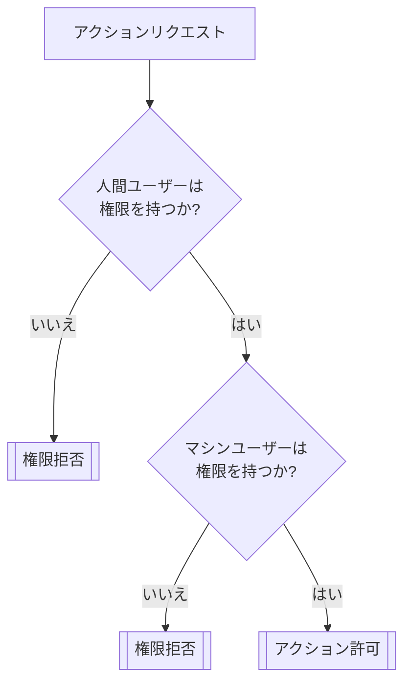
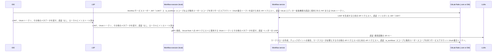
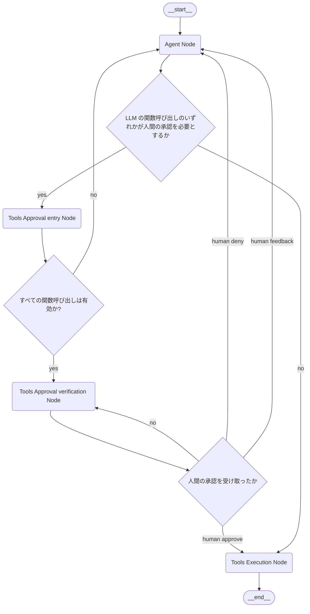
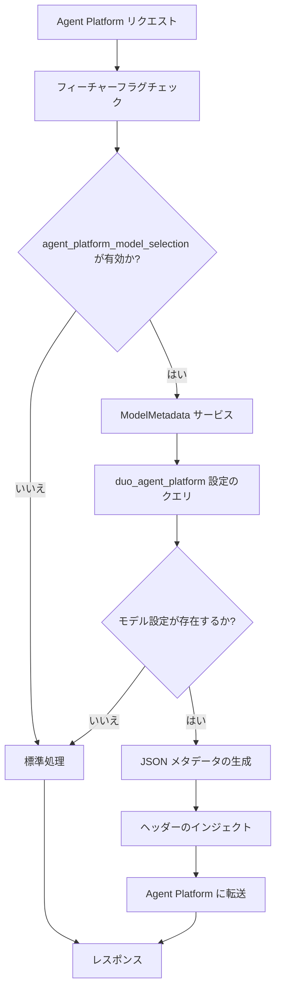
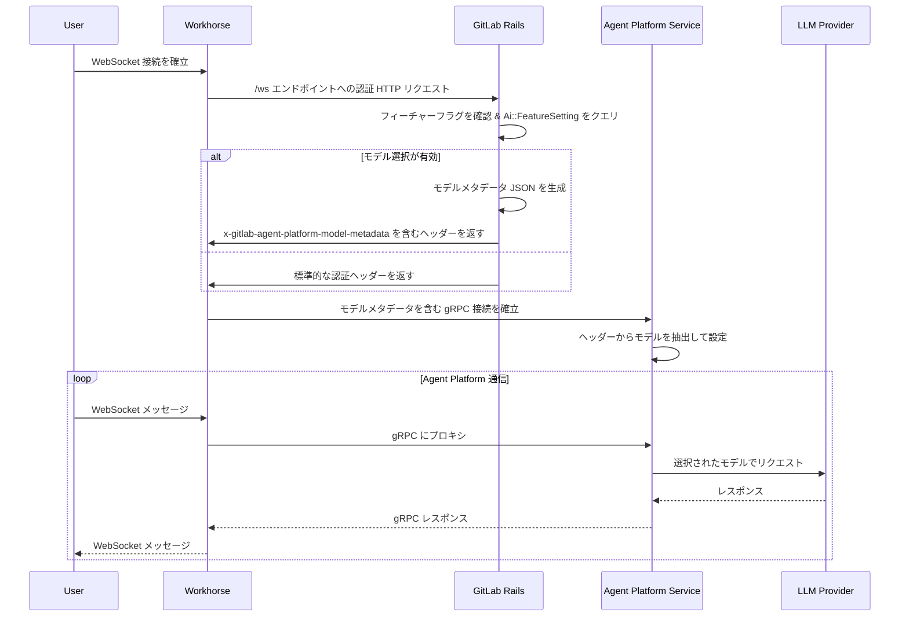

<div class="my-3 border-l-4 border-blue-500 bg-blue-50 px-4 py-3 rounded-r text-sm text-blue-800">
このページには今後予定されている製品・機能・機能性に関する情報が含まれています。ここに示す情報は参考目的のみです。購入・計画の決定にこの情報を使用しないでください。製品・機能・機能性の開発、リリース、タイミングは変更または延期される可能性があり、GitLab Inc. の独自の判断に委ねられています。
</div>

<div class="overflow-x-auto my-4">
<table class="w-full text-sm border-collapse">
<thead>
<tr class="bg-gray-100 text-left">
<th class="px-3 py-2 border border-gray-300">Status</th>
<th class="px-3 py-2 border border-gray-300">Authors</th>
<th class="px-3 py-2 border border-gray-300">Coach</th>
<th class="px-3 py-2 border border-gray-300">DRIs</th>
<th class="px-3 py-2 border border-gray-300">Owning Stage</th>
<th class="px-3 py-2 border border-gray-300">Created</th>
</tr>
</thead>
<tbody>
<tr>
<td class="px-3 py-2 border border-gray-300"><span class="inline-block rounded px-2 py-0.5 text-xs font-medium bg-gray-100 text-gray-700">ongoing</span></td>
<td class="px-3 py-2 border border-gray-300"><a href="https://gitlab.com/DylanGriffith" class="text-blue-600 hover:underline">@DylanGriffith</a>, <a href="https://gitlab.com/mikolaj_wawrzyniak" class="text-blue-600 hover:underline">@mikolaj_wawrzyniak</a></td>
<td class="px-3 py-2 border border-gray-300"></td>
<td class="px-3 py-2 border border-gray-300"></td>
<td class="px-3 py-2 border border-gray-300"><span class="inline-block rounded px-2 py-0.5 text-xs font-medium bg-gray-100 text-gray-700">~devops::create</span></td>
<td class="px-3 py-2 border border-gray-300">2024-05-17</td>
</tr>
</tbody>
</table>
</div>


## 実行環境

### エグゼクティブサマリー

GitLab Duo Workflow をサポートする機能は任意のコードを実行できる必要があり、これは事実上「信頼されていない」コードを意味します。このため、私たちが展開する他のサービスのように実行することはできず、具体的には Workflow サービスや AI Gateway 内で単純に実行することはできません。

この問題に対処するため、Workflow 機能はいくつかのコンポーネントで構成されています:

1. Duo Workflow Service は、私たちのインフラで実行する Python サービスです。Workflow サービスは [LangGraph](https://github.com/langchain-ai/langgraph) 上に構築されており、コード共有を可能にするために AI Gateway と共有リポジトリに存在しています。
1. `gitlab-lsp` エグゼキュータークライアントは、Workflow サービスへの長期間実行される gRPC 接続を介して通信し、任意のコマンドを実行します。これはエディター拡張機能（例: VS Code）で使用されるか、インタラクティブモードまたは非インタラクティブなヘッドレスモードで実行できるスタンドアロンバイナリとして個別にビルドされます。

最初のリリースでは、2つの実行モードをサポートします:

1. ローカルエグゼキューター: ユーザーの環境でコマンドを実行しファイルを編集します。ユーザーはリアルタイムで編集されるファイルを確認でき、インタラクティブです。ユーザーのワークステーションで誤って有害な操作を行うリスクを低減するために、ユーザーコマンドの承認などのコントロールが使用されます。
1. CI エグゼキューター: Workflow のすべての非ローカルユースケース（例: Issue/エピックベースのワークフロー）は GitLab UI または API によってトリガーされ、Workflow エグゼキューターを実行するために CI パイプラインを作成します。

私たちのアーキテクチャは、Workflow の一部の機能がクラウドホストの Duo Workflow Service を使用して利用可能になるように、セルフマネージドの混合デプロイメントもサポートします。

### 技術的サマリー

#### コンポーネントの内訳

Duo Workflow は多くの異なるコアコンポーネントで構成されています:

1. Workflow UI。Duo Workflow の IDE と Web UI の両方のエクスペリエンスをサポートしています。これらのプラットフォーム間でコードの再利用を最大化するため、ほとんどの基盤となる UI コンポーネントは [duo-ui](https://gitlab.com/gitlab-org/duo-ui) パッケージ内にビルドされており、[duo-ui-next](https://gitlab.com/gitlab-org/duo-ui-next) パッケージへの積極的な移行が進んでいます。これらの共有パッケージには、ビジネスロジックのないプレゼンテーション（「ダム」）UI コンポーネントが含まれています。LSP（IDE 用）と Web UI は、これらの共有 UI コンポーネント周りのプラットフォーム固有のビジネスロジックを処理する別個のラッパーコンポーネントを維持しています。
1. Workflow サービス。gRPC API を持つ Python ベースのサービスで、デプロイします。これへの唯一のインターフェースは、Workflow エグゼキューターから呼び出される gRPC インターフェースです。内部的には LangGraph を使用してワークフローを実行します。LangGraph が選ばれた理由については、[この Work Item](https://gitlab.com/gitlab-org/gitlab/-/work_items/457958) を参照してください。Workflow サービスは永続化された状態を持ちませんが、実行中のワークフローの状態はメモリに保持され、定期的に GitLab にチェックポイントされます。Workflow サービスは [AI Gateway コードベースの一部](https://gitlab.com/gitlab-org/modelops/applied-ml/code-suggestions/ai-assist/-/tree/main/duo_workflow_service?ref_type=heads)ですが、AI Gateway とは別のデプロイメントがあります。
1. `Executor <-> Workflow Service` および `GitLab Rails <-> Workflow Service` 間のコントラクトを形成する[プロトコルバッファ](https://gitlab.com/gitlab-org/modelops/applied-ml/code-suggestions/ai-assist/-/blob/main/contract/contract.proto)
1. [`gitlab-lsp` エグゼキューターコード](https://gitlab.com/gitlab-org/editor-extensions/gitlab-lsp/-/blob/main/packages/lib_workflow_executor/src/executors/node/node_executor.ts)。Workflow サービスへの gRPC 接続または GitLab Rails への WebSocket 接続を開き、指示されたアクションを実行する責任のみを持ちます。

#### 主要な制約

アーキテクチャの重要な制約を以下に示します:

1. すべての状態管理は GitLab 内にあります。
1. Workflow サービスは定期的に GitLab にその状態をチェックポイントします。
1. Workflow サービスのメモリ内状態はいつでも削除/失われる可能性があるため、チェックポイントが戻ることのできる唯一の保証されたポイントです。
1. ローカルの Workflow エグゼキューターが接続を切断した場合、Workflow サービスはエグゼキューターを待機している何かに遭遇するとすぐに状態をチェックポイントしてシャットダウンします。
1. 同じワークフローで複数の Workflow サービスインスタンスが実行されないように、Workflow サービスは実行を開始する前に必ず GitLab でロックを取得しなければなりません。サスペンド時にはロックを解放し、同様に最後の60秒以内にチェックポイントされていない場合はタイムアウト状態になります。GitLab はタイムアウトした Workflow サービスの実行からのチェックポイントを受け付けません。
1. Workflow サービスがワークフローを再開するたびに、新しい ID を取得します。この ID はチェックポイント時に送信されるため、GitLab はワークフローを実行しているゾンビサービスを削除/無視し、ゾンビサービスにシャットダウンするよう通知できます。
1. コードはエグゼキューターによって GitLab インスタンスへの非表示の Git 参照をプッシュすることでチェックポイントされます。これは他のチェックポイントと同じ頻度で行われます。
1. ローカル実行では、Workflow エグゼキューターが Workflow サービスを直接呼び出してワークフローを開始します。
1. UI からワークフローがトリガーされた場合、Workflow エグゼキューターは必要ありません。GitLab は Workflow サービスを直接呼び出すことができます。
1. Workflow サービスから GitLab へのすべての API 呼び出しで、プライベートデータへのアクセスやデータの更新を行うものは、ワークフローを作成したユーザーの代わりに認証されます。Workflow サービスは GitLab への特権アクセスを必要とすべきではありません。

### GitLab.com アーキテクチャ


1. 当初は、すべての入力を環境変数としてローカルおよび CI パイプラインでの実行に注力します。
1. Web UI や IDE 拡張機能からアクセスできるように、状態は GitLab に保存されます。

#### ローカル（IDE）実行の場合



#### リモート（CI パイプライン）実行の場合



#### GitLab Web UI から（独立したエグゼキューターなし）

エージェントチャットを Web UI から実行できるようにするために、[Workhorse 内でワークフローを実行する機能を実装しました](decisions/004_workhorse_as_a_duo_workflow_service_proxy.md)。このアーキテクチャでは、Workhorse が GitLab Rails インスタンスへのリクエストを転送するコンポーネントです。


このアーキテクチャにより、ローカルファイルシステムが不要な場合に、GitLab から限定的なエージェントフローを実行する可能性が開けます。

このアーキテクチャは、最終的に私たちのエグゼキューターと Duo Workflow Service 間のすべての直接通信を置き換え、以下に記載するようにセルフマネージドの GitLab インスタンスへのプロキシリクエストのためにエグゼキューターが必要なくなる可能性があります。

### セルフマネージドアーキテクチャ

#### ローカル Workflow サービスの場合

Workflow サービスをローカルで実行している顧客のアーキテクチャは GitLab.com と非常に似ています。また、Workflow サービスで設定したカスタムモデルを使用できます。


#### クラウド Workflow サービスの場合

セルフマネージドの顧客がすべての Workflow サービスコンポーネントを実行せずに Duo Workflow を試用・迅速に採用できるようにするため、このアーキテクチャは混合デプロイメントモードをサポートします。この場合、クラウドの Duo Workflow Service は顧客の GitLab インスタンスにアクセスできないと仮定しますが、GitLab とのすべてのインタラクションをプロキシするためにローカルエグゼキューター（ユーザーのマシンまたは CI ランナー内）を利用できます。


### Dedicated アーキテクチャ

セルフマネージドモードと同様に、Dedicated の顧客はクラウド Workflow サービスに接続できます。


## 文書化されたデータ分離モデル

このセクションでは、特に規制産業や Dedicated の顧客向けの GitLab Duo Agent Platform デプロイメントにおけるデータ分離、ログ記録、コンプライアンス要件を扱います。

### 他のテナントからのデータ分離

#### データストレージ

GitLab AI Gateway と Duo Workflow Service は独自の専用データストレージ層を持ちません。マルチテナントデプロイメントでは、ゲートウェイはワークフロー状態とチェックポイントを永続化するために GitLab Dedicated インスタンスの既存のストレージメカニズムに依存します。

Dedicated の顧客の場合、データは GitLab Dedicated の既存のテナント分離境界を通じて分離されます。LangGraph チェックポイントを含むワークフロー状態は、顧客の分離されたデータベースと Git リポジトリインフラストラクチャ内に保存されます。

#### データ転送

クライアントと GitLab Dedicated インスタンス間の転送中のすべてのデータは暗号化されます。

**インタラクティブセッションパス**（チャット、セッション管理）:

- **クライアントから [Workhorse](https://docs.gitlab.com/development/workhorse/) へ**: セキュアな HTTPS/WebSocket 接続

- **Workhorse から [Duo Workflow Service](https://docs.gitlab.com/administration/duo_workflow/) へ**: [Cloud Connector](https://docs.gitlab.com/development/cloud_connector/) を経由してルーティングされ、TLS 暗号化を使用したセキュアな gRPC 接続

**フロー実行パス**（CI ジョブランタイム）:

- **GitLab インスタンスからランナーへ**: 標準的な [CI/CD ジョブディスパッチ](https://docs.gitlab.com/runner/)

- **ランナーから GitLab インスタンスへ**: すべてのランナー通信は GitLab インスタンスを通じてトンネリングされます — ランナーは Duo Workflow Service または AI Gateway に直接接続しません

- **デフォルトのコンテナイメージを使用するフロージョブ**は、GitLab 所有ドメインへのアウトバウンド接続を制限するプロキシベースのネットワークフィルタリングを使用した[サンドボックス](https://docs.gitlab.com/user/duo_agent_platform/environment_sandbox/)内で実行されます。カスタムコンテナイメージは SRT サンドボックスをバイパスし、無制限のネットワークアクセスを持ちます。

**LLM プロバイダーとの通信**:

- [Duo Workflow Service](https://docs.gitlab.com/development/workhorse/ai_assisted_features_architecture/#key-components) はプロンプトを [AI Gateway](https://docs.gitlab.com/development/ai_gateway/) に送信し、AI Gateway はリクエストをサードパーティの LLM プロバイダーにルーティングします。
- プロンプトデータは LLM プロバイダーに送信されると GitLab Dedicated のコンプライアンス境界を離れます。GitLab は LLM プロバイダーがそのインフラストラクチャでリクエストをどこで処理またはルーティングするかを制御しません。

### AI Gateway のログ記録

#### ログの生成と保存

GitLab.com デプロイメントの場合、AI Gateway のログは Google Cloud Logs に出力され、集中的なオブザーバビリティのために ElasticSearch/Kibana に取り込まれます。ログにはステータスコード、エラー情報、パフォーマンスメトリクスが含まれます。詳細なログ設定については [AI Gateway ランブック](https://runbooks.gitlab-static.net/ai-gateway/index.html) と [Duo Workflow Service ランブック](https://runbooks.gitlab-static.net/duo-workflow-svc/index.html) を参照してください。

#### Dedicated 環境へのログ転送

AI Gateway によって生成されたログは GitLab Dedicated の顧客環境には転送されません。GitLab.com と現在の Dedicated デプロイメントの両方において、AI Gateway はクラウドホストであるため、ログは GitLab のクラウドインフラストラクチャ内に留まります。将来の Dedicated 上のシングルテナント AI Gateway デプロイメントでは、ログは顧客のコンプライアンスと運用要件に従って設定されます。

監査またはコンプライアンス目的でログアクセスが必要な顧客は、GitLab サポートと協力して適切なログ転送またはアクセスメカニズムを確立する必要があります。

### GitLab Dedicated のコンプライアンス境界との整合

Duo Agent Platform は GitLab Dedicated の既存のコンプライアンスと分離モデルと統合されています:

- **テナント分離**: DAP データは他の GitLab Dedicated データと同じレベルで分離され、既存のデータベースとストレージの分離を活用します
- **コンプライアンスの範囲**: Dedicated インスタンス内にデプロイされた DAP コンポーネント（Rails、Workhorse など）は同じコンプライアンス認証と監査範囲に該当します。ただし、[AI Gateway](https://docs.gitlab.com/development/ai_gateway/) は現在クラウドホストであり、Dedicated のコンプライアンス境界の外で動作します。
- **データレジデンシー**: ワークフロー状態と Git データは顧客が設定したリージョン内に留まります。サードパーティの LLM プロバイダーに送信されるプロンプトデータはリージョン境界を離れます（上記の[データ転送](#data-transfer)を参照）。

特定のコンプライアンス要件やデータレジデンシーに関する質問については、顧客は GitLab の Dedicated サポートチームとコンプライアンスドキュメントに相談する必要があります。

#### リカバリと可用性

**データリカバリ**: AI Gateway と Duo Workflow Service は独自の専用データストレージ層を持ちません。[LangGraph](https://www.langchain.com/langgraph) チェックポイントを含むワークフロー状態は、顧客の GitLab Dedicated インスタンス（データベースと Git リポジトリ）内に永続化されます。このデータのリカバリは Dedicated インスタンスの既存の[バックアップとリストア](https://docs.gitlab.com/administration/backup_restore/)の姿勢によって管理されます。顧客はインスタンスレベルの RTO/RPO 目標について Dedicated のアカウント/サポートチームに相談する必要があります。

**サービスの可用性**: DAP は AI Gateway と Duo Workflow Service が利用可能である必要があります。どちらかのサービスが利用不可の場合:

- 新しい [フロー](https://docs.gitlab.com/user/duo_agent_platform/flows/) の実行を開始できません
- 進行中のワークフロー [セッション](https://docs.gitlab.com/user/duo_agent_platform/sessions/) は、アクティブな実行ステップの状態が失われてエラーになる可能性があります
- [エージェント](https://docs.gitlab.com/user/gitlab_duo_chat/agentic_chat/)と[クラシック Duo Chat](https://docs.gitlab.com/user/gitlab_duo_chat/) も影響を受けます（共有 AI Gateway の依存）

### CI パイプラインアーキテクチャ

CI パイプラインは、Workflow エグゼキューターのホスト型ランタイムオプションとして選ばれました。なぜなら、安定性、サポート、セキュリティ、不正使用防止、課金モデルを持つ信頼されていない顧客のワークロードを実行するために現在利用可能な唯一のインフラストラクチャであるためです。

Workflow をサポートするために特定の `.gitlab-ci.yml` を設定する必要がないようにしたいです。これを避けるために、
[`Ci::Workload`](https://gitlab.com/gitlab-org/gitlab/-/blob/6682c3f76a0196455de3873466f254870383e9bc/app/services/ci/workloads/run_workload_service.rb)
抽象化を使用します。これにより有効な `.gitlab-ci.yml` が構築され、このインメモリ定義でパイプラインが実行されます。CI パイプラインの内部は、将来的にホスト型ランタイムを変更することに柔軟に対応できるよう、ワークフローコードから意図的に抽象化されています。これは重要な設計上の決定です。なぜならパイプラインには長期的に不適切になりうるいくつかの制限があり、注意しないと置き換えが難しいほど密結合になりやすいためです。

CI パイプラインはプロジェクト内で実行する必要もあります。パイプラインを実行するための適切なプロジェクトが存在しない Workflow のユースケースがいくつかあります（例: 新しいプロジェクトのブートストラッピング）。これらのワークフローでは:

1. 最初はデフォルトの Workflow プロジェクトを作成することをユーザーに求めます。空のプロジェクトで構いません。パイプラインはそこで自動的に実行されます。
1. これが設定の手間が多すぎる場合は、デフォルトの Workflow プロジェクトの作成を自動化します。
1. 長期的に UX が悪い場合、プロジェクトの存在をユーザーから完全に隠蔽し、実装の詳細にすることを検討するかもしれません。プロジェクトは GitLab の中心的な部分であるため、これは非常に広範な変更になりうるため、最終手段と考えます。

早期の顧客のために短期的には CI パイプラインの既存のコンピュートミニッツに依存するかもしれませんが、長期的には専用のランナーをデプロイし、Workflow に特有の課金モデルを導入したいと考えています。

#### CI ランナーとインフラストラクチャに関する考慮事項

1. Workflow のロールアウトにより、CI ランナーの使用量が大幅に増加する可能性があります。
1. Workflow は、非常に少ない CPU を使用する長時間実行 CI パイプラインの実行を含む可能性が高いです。LLM やユーザーとの通信が長期間の gRPC 接続で行われることが主な作業です。
1. ユーザーは CI ランナーの起動に非常に低いレイテンシを期待します。
   1. Docker イメージをプリロードされた VM を用意しておき、ワークフローがトリガーされたときにパイプラインをすぐに開始できるようにする方法があるか検討する必要があります。
1. Workflow 専用の CI ランナーセットが必要になる可能性があります。これは一部の顧客にのみランナーを有効にするか、適切なジョブラベル/ランナーマッチングを使用してこれらのランナーを Workflow にのみ使用することを意味するかもしれません。
1. 既存のランナーフリートの一部で Workflow 機能をロールアウトすることは可能かもしれませんが、これらのランナーを分離することに投資する十分なメリットがあると考えています。

### 状態のチェックポイント

Workflow サービスが動作する中で、Workflow の状態は GitLab Rails に永続化されます。状態には2つのコンポーネントがあります:

1. Langgraph によって管理される State オブジェクト。これにはユーザーとエージェント間のすべてのプロンプト履歴と、LangGraph グラフによって作成されたその他のメタデータが含まれます。
1. エージェントがコードを書いている作業ディレクトリ。
1. すべての状態にデータ保持制限があります。PostgreSQL パーティショニングを使用して古いワークフローデータを一定時間後に削除し、古い Git 参照も一定時間後に削除します。

GitLab の API を使用して LangGraph 状態オブジェクトを永続化し、この状態を進行に合わせて PostgreSQL に永続化します。API は POC <https://gitlab.com/gitlab-org/gitlab/-/merge_requests/153551> で実装されているように、`thread_ts` を使用してすべてのチェックポイントを識別する、LangGraph と同様の規則を使用します。

エージェントがこれまでに書いたコードを含む現在の作業ディレクトリについては、チェックポイントのために GitLab に非表示の Git 参照をプッシュすることで保存します。各チェックポイントには関連する参照があり、チェックポイントの命名規則（または PostgreSQL に保存された何か）により、状態チェックポイントに適切な Git 参照を特定できます。

Git に保存することで、アーティファクトを保存するための新しい API を構築する必要がなく、ユーザーがその SHA をチェックアウトするだけでコードに簡単にアクセスできるという利点があります。また、ワークフローが既存の大規模プロジェクトで作業している場合、ストレージを大幅に節約できます。最終的にコードの変更は Git にプッシュされることが期待されているため、これが最もシンプルな解決策です。

一部のワークフローには既存のプロジェクトがありません（例: プロジェクトのブートストラッピング）。これらのワークフローでも、何らかのプロジェクトからトリガーする必要があります（CI パイプラインのセクションで説明したように）。そのため、ワークフローが生成したコードのスナップショットを保存するための一時リポジトリとしてワークフロープロジェクトを使用できます。

また、一定のワークフロー有効期限後に Git 参照をクリーンアップすることも考慮する必要があります。

### 認証

GitLab Duo Workflow にはいくつかの認証フローが必要です。

このセクションでは、認証を必要とする各接続と認証メカニズムについて説明します。


#### トークンの種類と有効期間（TTL）

Duo Workflow は認証に2つの主要なトークンタイプを使用します:

1. **GitLab OAuth トークン**（TTL: 2時間）- Workflow サービスから GitLab Rails API へのリクエスト認証に使用されます。このトークンはワークフローデータの読み書き、チェックポイントの作成、その他の GitLab API 操作へのアクセスを付与します。2時間の TTL により、長時間実行のワークフローに十分な時間を提供しながら、トークンが定期的にローテーションされます。

2. **Cloud Connector JWT**（TTL: 1時間）- Workflow エグゼキューターから gRPC 経由で Duo Workflow Service への接続認証に使用されます。この JWT はユーザースコープで暗号的に署名されています。1時間の TTL はサービス間通信のより短い有効期限ウィンドウを提供し、トークンが漏洩した場合の攻撃対象領域を縮小します。このトークンは Workflow サービスを通じた LLM API へのアクセスのみを付与し、ユーザーやプロジェクトデータへのアクセスを提供しません。

**セキュリティ上の考慮事項:**

- 短い TTL（1〜2時間）により、トークンが漏洩した場合の攻撃ウィンドウが大幅に縮小されます
- Cloud Connector JWT の限定されたスコープ（LLM API アクセスのみ）により、潜在的なデータ露出が最小化されます
- OAuth トークンは必要に応じて失効させることができ、追加のセキュリティ制御を提供します

#### ローカル Workflow エグゼキューター → Workflow サービス

ワークフローが開始されると、Workflow エグゼキューターは Workflow サービスに接続する必要があります。

この接続を認証するために:

1. IDE は GitLab エディター拡張機能のセットアップ中にユーザーが生成した OAuth トークンまたは Personal Access Token（PAT）を使用します。
1. IDE はそのトークンを使用して GitLab Rails API エンドポイントへのリクエストを認証します。
1. GitLab Rails API がこのリクエストを受け取ると、インスタンススコープの JWT（CustomersDot から毎日同期）をロードし、Duo Workflow Service に接続してこのインスタンストークンを上述のユーザースコープのトークン（同様に暗号的に署名された）に交換します。
1. GitLab Rails はユーザースコープの JWT を IDE に返します。
1. IDE はこの JWT をローカル Workflow エグゼキューターコンポーネントに渡します。
1. Workflow エグゼキューターはこの JWT を使用して Workflow サービスの gRPC 接続を認証します。

このフローは [IDE が AI Gateway に直接接続できるようにするトークンフロー](https://gitlab.com/groups/gitlab-org/-/epics/13252)を模倣しています。

#### CI Workflow エグゼキューター → Workflow サービス

CI ランナーによってワークフローが実行される場合、Workflow エグゼキューターは Workflow サービスに接続する必要があります。

CI パイプラインは GitLab によって作成されるため、短期間のユーザーおよびシステムスコープの JWT を取得するために GitLab Rails API エンドポイントにクエリする必要はありません。代わりに、CI パイプラインを作成するプロセスで GitLab Rails は:

1. ユーザースコープの JWT を生成します。
1. CI パイプライン内の環境変数（例: `DUO_WORKFLOW_TOKEN`）として JWT を注入します。
1. CI ジョブ内で実行される Workflow エグゼキューターはこの環境変数の値を使用して Workflow サービスの gRPC 接続を認証します。

#### Workflow サービス → GitLab Rails API

すべてのエグゼキューターには、GitLab Rails へのすべての HTTP リクエストに使用される `ai_workflows` スコープの OAuth トークンが追加で渡されます。これは Duo Workflow Service との認証に使用される JWT とは別のものです。エグゼキューターはこのトークンと GitLab インスタンスのベース URL を Duo Workflow Service に渡し、GitLab Rails への直接呼び出しができるようにします。

Workflow サービスが GitLab Rails API へのリクエストを認証できなければならない理由:

1. Workflow サービスはワークフローの状態を同期するために定期的に GitLab Rails にリクエストを行う必要があります。これは Workflow サービスがこれらのリクエストを認証できなければならないことを意味します。
1. Workflow はコンテキストを収集するために他の GitLab Rails API クエリを行う必要があるかもしれません。例えば、「コードで Issue を解決する」ワークフローでは、Issue の内容を取得するための API リクエストが必要です。
1. ワークフローの最終状態は GitLab プラットフォーム上の生成されたアーティファクト（例: Git コミットやプルリクエスト）の形を取ることがあります。このアーティファクトを生成するために、Workflow サービスは GitLab Rails API にリクエストを行うことができなければなりません。

Workflow サービスから GitLab Rails API へのリクエストを認証するために使用するトークンの要件:

1. Workflow によって作成されたアーティファクトは、GitLab プラットフォームにおける AI 生成活動の透明性を維持するために監査可能でなければなりません。
1. 権限昇格がないことを確認するために、トークンのアクセスレベルはワークフローを開始したユーザーのアクセスレベルと一致しなければなりません。
1. `duo_features_enabled` が false に設定されているインスタンス/プロジェクト/グループに属するすべてのリソースの読み書きをブロックする能力を持たなければなりません。
1. トークンはエージェントの実行が完了するまで有効か、または Workflow サービスによって更新可能でなければなりません。ワークフローの実行には数時間かかる場合があります。

Workflow エグゼキューターが Workflow サービスへの認証に使用する JWT は、このユースケースにも対応できるよう潜在的に適応させることができますが、いくつかの問題があります:

1. GitLab Rails がこのタイプのトークンを API 認証として受け入れるよう更新する必要があります。
1. JWT は失効させられません。エージェントのアクセスを切断する必要がある場合はどうすればよいですか?
1. トークンのローテーションを構築する必要があります。古い JWT がすでに有効期限切れの場合、Workflow サービスはどのように新しいトークンを生成するための API リクエストを認証しますか?

これらの理由から、OAuth がこのユースケースにより適したプロトコルです。OAuth トークン:

1. 有効期間は2時間のみです。
1. 失効させることができます。
1. 組み込みのリフレッシュフローがあります。
1. サービス間でアクセスを連携するための確立された認証パターンです。

##### Workflow サービス OAuth v1

OAuth を使用するために:

1. `ai_workflows` という新しいトークンスコープを作成します（[関連 Issue](https://gitlab.com/gitlab-org/gitlab/-/issues/467160)）。
1. IDE が GitLab Rails から Workflow サービスユーザー JWT をリクエストするとき、`ai_workflows` スコープを持つ OAuth トークンも生成して返します。この OAuth トークンはユーザーのものです。
1. Workflow エグゼキューターは gRPC 接続を開く際に、その OAuth トークンと GitLab Rails インスタンスの `base_url` を Workflow サービスにメタデータとして送信します。
1. Workflow サービスは Workflow のデータの読み書きのための GitLab Rails API リクエストに OAuth トークンを使用します。

##### Workflow サービス OAuth v2

2024年10月18日時点で、Workflow の OAuth v1 フローが実装されています。

Workflow OAuth の次のイテレーション（v2）も GitLab API へのリクエスト認証に OAuth トークンを使用します。ただし、通常の OAuth トークンの代わりに複合 OAuth トークンを使用します。複合トークンは新しい概念であり、OAuth に使用するライブラリである Doorkeeper に[動的スコープを追加する](https://github.com/doorkeeper-gem/doorkeeper/pull/1739)必要があります。

複合 OAuth トークンは[サービスアカウント](https://docs.gitlab.com/ee/user/profile/service_accounts.html)に属しますが、人間のユーザーに紐付けられます。その結果、Workflow の出力はマシンユーザーに帰属しますが、トークンのアクセスはマシンユーザーの権限と人間のユーザーの権限の交差部分となります。



これを実現するために:

- ワークフロー AI エージェント用のサービスアカウントを独自のアイデンティティで作成します。
  - すべての GitLab インスタンス（GitLab.com を含む）: インスタンスごとに1つのサービスアカウントがあります。
- `ai_workflows` と `user:*` スコープの両方を受け入れる新しい GitLab OAuth アプリケーションを生成します（後者のスコープが「動的スコープ」であり、複合 ID トークンを可能にするものです）。
- 新しい OAuth アプリケーションとサービスアカウントユーザーの OAuth アクセストークンを生成します。
  - このシナリオでは、OAuth クライアントとサーバーはどちらも GitLab です。認証のリクエストは IDE または GitLab から来ます。IDE はすでにユーザーのトークンを持っており、GitLab はそのトークンをサービスアカウントトークンに交換します。
  - GitLab はクライアントとサーバーの両方であるため、このフロー中にユーザーに OAuth の同意画面は表示されません。グループオーナーまたはインスタンス管理者は、Workflow サービスアカウントを設定することで Workflow を有効にします。これは実質的に同意画面の「承認」をクリックすることと同じであり、サードパーティアプリがサービスアカウントを使用することを承認します。
- OAuth アクセストークンは AI エージェントのアクセス権限を絞り込むために `ai_workflows` スコープを持ちます。
- AI エージェント用に作成する OAuth アクセストークンは人間のユーザースコープ（ユーザー ID を使用した `user:123`）を持ちます。

OAuth v2 の認証シーケンスは OAuth v1 と同一であり、唯一の違いは生成される OAuth トークンが通常のユーザー OAuth トークンではなく複合トークンであることです:



詳細については [Issue 480577](https://gitlab.com/gitlab-org/gitlab/-/issues/480577) を参照してください。

##### Workflow サービス OAuth v3

`ai_workflows` スコープはトークンの機能を絞り込むために追加されました。

`ai_workflows` 静的スコープアプローチには2つの主な問題があります:

- すべての Workflow が同じ API エンドポイントへのアクセスを必要とするわけではありません。すべての Workflow に同じスコープを使用することで、必要以上のアクセスを提供しています。これは[最小権限の原則](https://en.wikipedia.org/wiki/Principle_of_least_privilege)に違反します。
- 各 GitLab API エンドポイントは、このスコープのために手動でホワイトリストに追加する必要があります。[例](https://gitlab.com/gitlab-org/gitlab/-/merge_requests/162671)。これは Workflow に新しい機能を提供するためにコードの変更が必要であり、時間がかかります。また、スコープがまだ必要なエンドポイントにホワイトリストされていない古い GitLab バージョンでは新しい Workflow 機能が利用できない可能性があります。

これらの問題の両方の解決策は、OAuth アクセストークンに動的スコープを提供することです。つまり、スコープ自体がどのエンドポイントにトークンがアクセスできるかを決定し、`ai_workflows` やその他の静的トークンスコープに依存しないようにすることです。

高度なトークンスコープは[Personal Access Token](https://gitlab.com/gitlab-org/gitlab/-/issues/368904)、[セキュアなジョブトークン](https://gitlab.com/groups/gitlab-org/-/epics/15234)に追加されており、[ルータブルトークン](https://gitlab.com/gitlab-com/content-sites/handbook/-/merge_requests/7856)を可能にするものです。

動的トークンスコープは、複合 ID をサポートするために OAuth トークンにも追加されています（上記の OAuth v2）。動的トークンスコープを使用したターゲット API アクセスを有効にするための計画はまだ進行中です。このトピックについての議論は [Issue 468370](https://gitlab.com/gitlab-org/gitlab/-/issues/468370) にあります。

### 検討したオプションと長所・短所

#### 安全でない実行のみをローカル/CI パイプラインに委譲する

これが選択したオプションです。可能な限り多くの機能を私たちが運用するサービスに維持しながら、安全でない実行をローカルまたは CI パイプラインで実行できる Workflow エグゼキューターに委譲しようとします。

**長所**:

1. インフラを自分たちで実行することで、ロールアウトされるバージョンの制御が向上します。
1. ローカル使用のためにユーザーがインストールする依存関係が少なくなります。
1. すべての新しい GitLab コンポーネントをデプロイせずに Workflow を試用するためのセルフマネージドの顧客にとって迅速なオンボーディング体験を提供します。

**短所**

1. 長期間実行に伴う異なるスケーリング特性を持つ新しいインフラのデプロイと保守が必要です。

#### ローカルで実行する

**長所**:

1. 開発者は自分たちが働くローカル環境に留まります。
1. コンピュートはローカル開発者が吸収するため、分単位で課金されることを心配する必要がありません。
1. エージェントが作業している間にユーザーがコードをレビュー/編集する必要があるような、ユーザーインタラクションのレイテンシが低くなります。

**短所**:

1. 孤立した開発環境がない限り、コマンドがコンピュータへのフルアクセスを持つため、ローカルで実行するリスクが高くなります。これは、ユーザーの確認なしにエージェントが実行できるコマンドを制限する UX によって軽減できます。
1. このアプローチにはローカル開発者のセットアップが必要であり、ユーザーが Web UI からキックオフすることを期待するタスク（例: Issue/エピックの計画）には適していない場合があります。

#### CI パイプライン（CI ランナー上）

POC と調査については <https://gitlab.com/gitlab-org/gitlab/-/issues/457959> を参照してください。

**長所**:

1. CI パイプラインは、信頼されていないワークフローを実行できる唯一の事前設定されたインフラです。
1. CI ミニッツに対して確立された課金モデルがあります。

**短所**:

1. CI パイプラインは起動が遅く、パイプラインがユーザー入力を待ってタイムアウトしながら再起動する必要がある場合、イテレーションとインクリメンタルな AI 開発が遅くなる可能性があります。
1. エージェントがユーザー入力を待っている間も CI ミニッツが消費される必要があります。これにはおそらくタイムアウトメカニズムが必要であり、ユーザーが戻ったときには入力を与えると新しいパイプラインを再起動する必要があります。
1. CI パイプラインはアクセスが困難な環境で実行されます（SSH できず、ライブでイントロスペクトできません）。そのため、目の前でライブにビルドされているコードとユーザーがインタラクトすることが難しくなります。
1. CI パイプラインは実行するためのプロジェクトが必要です。これは克服できないものではありませんが、ワークフローパイプラインを実行するための「ワークフロープロジェクト」を自動的に作成することでセットアッププロセスを簡略化できるかもしれません。
1. 非コードワークフロー（例: MR のレビュー）を実装する際、孤立したコンピュート環境は不要ですが、顧客に引き続きコンピュートミニッツを使用させることになります。X-Ray レポートなどの他のケースでこれが良い体験ではないことがわかっています。

#### GitLab ワークスペース（リモート開発）

POC と調査については <https://gitlab.com/gitlab-org/gitlab/-/issues/458339> を参照してください。

**長所**:

1. エージェントが開発環境でローカルに作業し、インタラクトでき、リアルタイムで同じファイルを確認・編集できるため、最速のイテレーションサイクルを持ちます。
1. 顧客は独自のインフラで実行でき、効率的なリソース使用の制御が可能です。

**短所**:

1. 現在は顧客が独自のインフラ（K8s クラスター）を持参することのみをサポートしており、これにより始めるためのハードルが独自の K8s クラスターの持参となり、これはかなりの努力が必要です。
1. 顧客が独自の K8s クラスターを持参する必要がないように GitLab.com 上にインフラを構築したい場合、セキュリティとインフラストラクチャの観点から非常に大きな取り組みになります。セキュリティ、不正使用、課金の複雑さをすべて処理するには、初期開発と継続的なメンテナンスの両方で多くのチームの関与が必要です。

## セキュリティ

### 脅威モデリング

詳細かつ最新の脅威モデリングは https://gitlab.com/gitlab-com/gl-security/product-security/appsec/threat-models/-/blob/master/gitlab-org/AI%20features/Duo%20Workflow.md を参照してください。

### ローカル実行のセキュリティ考慮事項

ローカル実行は開発者にとって最も価値のある機会ですが、LLM からのバグや誤りがユーザーのローカル開発環境に大きな損害を与えたり、機密情報を侵害するリスクも最も高くなります。

リスクの例:

1. 誠実だが重大な間違いを犯すことがある AI。
1. 時に敵対的になる可能性がある AI。
1. LLM レスポンスを提供する Duo Workflow Service が侵害されると、このツールのすべてのユーザーへのシェルアクセスが可能になります。

### Workflow エグゼキューターのサンドボックス化

リスクを軽減するための一つの提案は、Workflow エグゼキューターが非特権 Docker コンテナ内でのみ実行できるような何らかのサンドボックス化を使用することです。このような解決策は:

1. コンテナにローカル作業ディレクトリをマウントして、ホスト上でユーザーが作業しているファイルを引き続き編集できるようにします。
1. ユーザーまたはエージェントがアプリケーションとテストを実行するために必要なすべての開発依存関係をインストールします。

上記のオプションは Dev Containers を利用する場合もあります。

### コマンドに対するユーザー確認

リスクを制限するための別のオプションは、エージェントがコマンドを実行する前にユーザーにすべてのコマンドを確認させることです。これはおそらくオプションとして実装しますが、効率的な大規模ワークフローの開発への要望を考えると、タスクを完了するために多くのコマンドを実行する必要がある場合、ツールの効率性が制限される可能性があります。

また、ユーザー定義の許可リストコマンド（例: `ls` と `cat`）のセットがあり、エージェントがユーザーの確認なしにプロジェクトについて読み込んで学習できるようにするハイブリッドアプローチも検討できます。ただし、このアプローチはすべてのニーズを解決するわけではありません。例えば、ユーザーが `rspec` のようなコマンドを許可リストに追加したい場合、エージェントがスペックファイルに何でも入れることができるため、事実上任意のコード実行が可能になります。

## Workflow UI

Workflow UI は少なくとも以下の場所で利用できる必要があります:

1. GitLab Rails Web UI
1. エディター拡張機能

複数の UI が必要であり、上記のように Workflow エグゼキューターに複数の実行環境があるという事実が、以下の決定につながりました。

### UI のパッケージ化方法

Duo Workflow の IDE と Web UI の両方のエクスペリエンスをサポートします。コードの再利用を最大化しながらプラットフォーム固有の柔軟性を維持するために、UI アーキテクチャは関心の分離に従います:

**共有 UI コンポーネント**: ほとんどの基盤となる UI コンポーネントは
[duo-ui](https://gitlab.com/gitlab-org/duo-ui) パッケージ（[duo-ui-next](https://gitlab.com/gitlab-org/duo-ui-next) に移行中）にあります。これらはビジネスロジックのないプレゼンテーション（「ダム」）コンポーネントであり、IDE と Web の両方のプラットフォームで簡単に再利用できます。

**プラットフォーム固有のラッパー**: LSP（IDE 用）と Web UI はそれぞれ、共有 UI コンポーネントの周りのプラットフォーム固有のビジネスロジック、データフェッチ、状態管理を処理する独自のラッパーコンポーネントを維持しています。

IDE 統合のために、すべてのエディター拡張機能で最大限の再利用を実現するために、データアクセスのほとんどを
[GitLab Language Server](https://gitlab.com/gitlab-org/editor-extensions/gitlab-lsp)
に組み込みます。IDE 内にレンダリングされた webview と LSP によって提供されるもの、そして ネイティブ IDE UI 要素を組み合わせて使用します。ユーザー体験を著しく制限しない範囲で、LSP から提供され IDE 内の Web ビューとしてレンダリングされる Web ページにインターフェースを組み込むことを選択します。なぜなら、これにより すべてのエディター拡張機能での再利用が最大化されるためです。

### Web UI が現在の状態をリアルタイムでどのように反映するか

Workflow サービスは定期的にその状態を GitLab Rails に保存します。UI は WebSocket を通じてリアルタイムの更新を受信し、新しいデータが到着すると自動的に更新されます。

ユーザーが Workflow エグゼキューターをローカルで実行している可能性があり、リアルタイムで一部の状態を確認している場合、実行中のワークフロープロセスのインメモリ状態をライブレンダリングすることが合理的かもしれません。レイテンシの理由でこのオプションを意図的に選択するかもしれませんが、フロントエンドと Workflow エグゼキューターを完全に分離してアーキテクチャ化するように注意する必要があります。なぜなら、それらは常に一緒に実行されるわけではないためです。例えば、ユーザーは GitLab CI で実行するワークフローをローカルでトリガーするかもしれませんし、ローカルで開始されたワークフローと対話して再実行するために Web UI を使用するかもしれません。

したがって、UI とエグゼキューターの直接インタラクションは一般的に避けることを好み、代わりにすべての通信が GitLab 経由で行われるべきです。例外は場合によって検討されるかもしれませんが、説明した理由のために GitLab から消費するように機能を簡単に変更できるように明確な API 境界が必要です。

#### メッセージストリーミングアーキテクチャ

ペイロードサイズを削減するために、クライアントは理想的には最新の変更のみを含むインクリメンタルなメッセージ更新を受け取り、ローカルで連結することができます。ただし、システムはリアルタイム更新が不要なセッションページなど、クライアント側の作業なしに完全な会話履歴をロードする能力を保持する必要があります。これは、ストリーミングに最適化されたものとセットアンドフォーゲット操作としてのもの、2つの異なるメッセージのロード方法を維持することを意味します。

### 状態

UI の状態は、UI の状態変化と API レスポンス間の競合状態を避けて一貫性を確保するために、サーバーによって駆動されます。これによりデータとアクションの同期が簡略化されます。考えられるすべてのワークフロー状態は [WorflowStatusEnum](https://gitlab.com/gitlab-org/duo-workflow/duo-workflow-service/-/blob/main/duo_workflow_service/entities/state.py?ref_type=heads#L23) で確認できます。

重要なアーキテクチャのパターンとして、ユーザー入力を必要とするインタラクションは `INPUT_REQUIRED` ステータスを通過します。これにより、ツールの承認、計画の確認、その他のインタラクティブな決定のいずれであっても、ワークフローが実行を一時停止してユーザーの応答を待つための一貫したメカニズムが提供されます。

ローカルで実行されているフロー（IDE 実行）の場合、アーキテクチャはワークフローを再開する前に `DuoWorkflowEvent` がキューに追加されることを期待します。このイベントはユーザーの応答や入力を提供することで意思決定プロセスをガイドし、ワークフローサービスが適切に実行を継続するために必要なコンテキストを持つことを確実にします。

対照的に、Duo Agentic Chat はこのパターンに従っていませんが、確かにそれが望ましいアプローチです。時間をかけて、フローは Duo Chat と同様のパターンを使用するように移行する必要があります。

### チェックポイント

チェックポイントはサーバー側で構築され、特定のポイントから実行を再開する方法として機能します。これらは LangGraph の内部詳細であり、クライアントに直接使用/公開されるべきではありません。これは迅速なイテレーションを可能にするために歴史的に無視されてきましたが、現在は Rails 側から [GraphQL フィールド duo_messages をサポートしており](https://gitlab.com/gitlab-org/gitlab/-/work_items/535898)、クライアントが API とクライアント間の適切なコントラクトでチェックポイントからデータを消費できるようになっています。

Duo メッセージは:

- リアルタイム更新のためにクライアントにストリーミングできます。
- 現在の状態を含むことができます。
- `ui_chat_log` に追加された現在のメッセージを含むことができます。

#### duo_messages の使用

`duo_messages` フィールドは、生のチェックポイントデータを解析せずにワークフローのチャット履歴にアクセスするためのクリーンで構造化された API を提供します。これは `duoWorkflowWorkflows`（完全な履歴の取得用）と `duoWorkflowEvents`（ストリーミング更新用）の両方で利用可能です。このフィールドは非推奨の `checkpoint` フィールドを置き換え、内部 LangGraph 状態から UI に関連するデータのみを公開することでペイロードサイズを大幅に削減します。

## Workflow エージェントのツール

Workflow **エージェント**は、簡略化すると **プロンプト** と **LLM** のペアです。この定義では、エージェント自体は外部世界とインタラクトできず、自動化できる作業のスコープが大幅に制限されます。この制限を克服するために、エージェントは**ツール**を装備しています。

ツールはエージェントが [function calling](https://docs.anthropic.com/en/docs/build-with-claude/tool-use) LLM 機能を使用して呼び出すことができる関数です。これらの関数はエージェントの代わりにさまざまなアクションを実行します。例えば、エージェントは `ls` や `cat` などの bash コマンドを実行してその結果をエージェントに返すツール（関数）を装備することができます。

**エージェント**が利用できるツールセットの幅は、自動化できる作業のスコープを定義します。そのため、Workflow 機能を成功させるためには、広範で網羅的なツールセットを提供する必要があります。

想定されるツールには以下が含まれます:

1. Workflow エグゼキューターを介して bash コマンドを実行するツール。
1. ファイルを操作する（読み書きを含む）ツール。
1. Git VCS を操作するツール。
1. [GitLab HTTP API](https://docs.gitlab.com/ee/api/api_resources.html) と統合するツール。

### ツールの権限と承認システム

エージェントをツールで装備することには異なるリスク要因が伴います。例えば、読み取りツールは誤って適用された場合に機密データと公開データの境界を越える可能性があり、Duo Workflow Executor ホストの bash ターミナルと直接統合するツールは、エージェントが間違いを犯したり悪意のある操作を実行させられた場合に深刻な結果をもたらす可能性があります。異なるツールの悪影響を制限するために、ツール承認システムが実装されており、ユーザーが任意のワークフロー実行で利用可能なツールセットを制限し、特定のツールが実行される前にエージェントがユーザーの承認を求めることができます。

ツール承認システムはバケットアプローチに基づいており、ツールバケットは _エージェント権限_ と呼ばれます。各バケットはすべての実装されたツールのサブセットを示し、ユーザーは[次のセクション](#how-agent-tool-set-is-being-defined-for-each-workflow-run)で説明されたプロセスに従って、完全に利用可能または条件付きで利用可能にすることができます。_エージェント権限_ は Duo Workflow Service 内の [`tools_registry`](https://gitlab.com/gitlab-org/modelops/applied-ml/code-suggestions/ai-assist/-/blob/5e242511c27d6d981dc29f3e1871882b00dcea8f/duo_workflow_service/components/tools_registry.py#L76) で定義され、GitLab Rails の [`Workflow`](https://gitlab.com/gitlab-org/gitlab/blob/13461f57b9f087055e23651eead75cdc716c1cbb/ee/app/models/ai/duo_workflows/workflow.rb#L41) モデルに反映されます。

#### 各ワークフロー実行でのエージェントツールセットの定義方法

1. エンジニアは、ワークフロー実装中にモデルに付与できるすべての可能なツールをリストアップして、エージェントのツールセットを定義します。
1. ワークフロー実行の作成時に、ステップ1でエンジニアが定義した完全なツールセットをユーザーが付与した _エージェント権限_ によって制約されたサブセットに制限する `agent_privileges` を使用して、ワークフローの GitLab API [エンドポイント](https://gitlab.com/gitlab-org/gitlab/blob/467a527a7a78f45dddf547ebb86c63c6239f34f0/ee/lib/api/ai/duo_workflows/workflows.rb#L84) にリクエストが行われます。さらに、その API リクエストには `pre_approved_agent_privileges` が含まれる場合があり、エージェントが承認を求めずにリストされたバケットのツールを使用できるようになります。

#### ツール承認の実施方法

ツール承認の検証は、LLM が生成した関数呼び出しを生成するエージェントノードと、LLM の関数呼び出しを実行する `ToolExecutor` ノードの間で行われます。
`ToolExecutor` ノードがトリガーされる前に、すべての保留中の関数呼び出しは、[前のセクション](#how-agent-tool-set-is-being-defined-for-each-workflow-run)で説明されたプロセスに従って `pre_approved_agent_privileges` で定義された許可リストに対してレビューされます。

許可リストに含まれていない関数呼び出しが少なくとも1つある場合、ツール承認サブグラフが呼び出されます。
ツール承認フローは以下のダイアグラムに示されています:



`Tools Approval verification Node` において、ワークフロー実行はユーザーの承認、否定、またはエージェントに修正方法を指示するフィードバックを待つためにハイバネートされます。ユーザーが承認を提供した後、エグゼキューターを再起動してワークフローを再開します。

## Agent Platform モデル選択

### 概要

Agent Platform は動的なモデル選択をサポートしており、GitLab インスタンスがインスタンスレベルで AI モデルを設定できます。この機能はセルフホストモデルインフラストラクチャと AI Gateway のモデル選択ロジックを再利用し、GitLab ホストモデルとセルフホスト OpenAI 互換エンドポイントの両方をサポートします。モデルメタデータはユーザーに公開されないため、セルフホストモデルの API キーのような機密データを安全に送信できます。

### アーキテクチャ

モデル選択機能は3つの主要コンポーネントで構成されています:

1. **Rails モデルメタデータサービス**: インスタンスレベルの `Ai::FeatureSetting` からモデル設定を抽出
2. **ヘッダーインジェクション**: Workhorse を通じて `x-gitlab-agent-platform-model-metadata` ヘッダーでモデルメタデータを渡す
3. **Agent Platform サービス統合**: ヘッダーをインターセプトし、それに応じて LLM リクエストを設定

このアーキテクチャにより、セルフホストモデルのメタデータ（API キーを含む）がユーザーに公開されず、サービス間で機密認証データを安全に送信できます。

#### Rails アーキテクチャ



#### エンドツーエンドのリクエストフロー



#### モデル設定

モデルは `Ai::FeatureSetting` レコードを通じてインスタンスレベルで設定されます:

##### GitLab ホストモデル

```json
{
  "model_provider": "anthropic",
  "model_name": "claude-3-7-sonnet-20250219"
}
```

##### セルフホストモデル

```json
{
  "model_provider": "self_hosted",
  "model_name": "custom-llama-7b",
  "api_endpoint": "https://internal-llm.company.com/v1",
  "api_key": "[ENCRYPTED]"
}
```

この機能は `agent_platform_model_selection` 開発フラグによって制御され、設定ストレージに `duo_agent_platform` フィーチャー設定（ID: 16）を使用します。

## POC - デモ

1. [POC: Issue の解決（内部のみ）](https://www.youtube.com/watch?v=n1mpFirme4o)
1. [POC: Workspaces 内の Workflow（内部のみ）](https://youtu.be/x7AxYwiQayg)
1. [POC: Docker エグゼキューターを使用した Autograph（内部のみ）](https://www.youtube.com/watch?v=V-Mw6TXOkKI)
1. [POC: タイムアウトと再起動を含む CI パイプラインのワークフロー（内部のみ）](https://youtu.be/v8WWZuAGXMU)

## 開発ノート

**ダイアグラムファイルに関する注意**: 生の `dap-raw.excalidraw` ファイルは開発目的のみでリポジトリに含まれており、適切なドキュメントとして見なされるべきではありません。Excalidraw ホワイトボードで直接編集できるように保存されています。フォローアップとして、個々のダイアグラムは JSON 埋め込み PNG（`.excalidraw.png`）としてエクスポートされます。これにより、編集可能性を維持しながら閲覧性が向上し、その後は生のファイルを削除できます。
