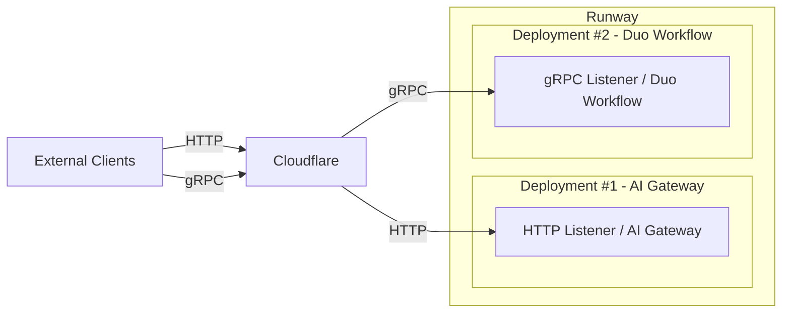
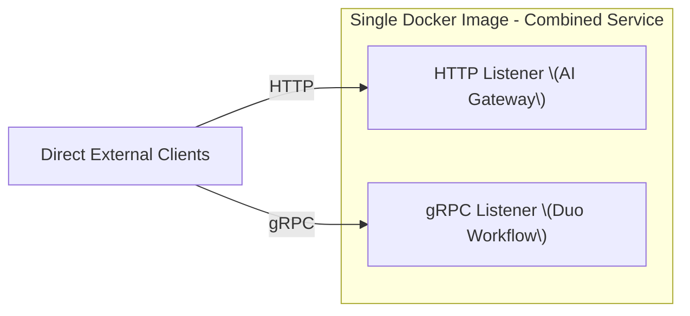

## コンテキスト

AI Gateway は HTTP 経由で LLM インタラクションを処理する Python ベースのサービスであり、主にプロキシ（認証、ルーティングなど）として機能します。Duo Workflow Service は gRPC 経由で多段階の LLM オーケストレーション（LangGraph を使用）を提供する別の Python ベースのサービスです。

歴史的に、Duo Workflow Service は既存のコードベースに統合せずに迅速なイテレーションを可能にするために（gRPC を使用して）個別に開発されました。しかし、この分離はデプロイメント（セルフホストモデルを使用する顧客に対して2つのサービスを管理する）、オブザーバビリティ（重複するログ/トレーシング）、メンテナンス（2つの依存関係セット）においてオーバーヘッドを生み出します。Duo Workflow を GA に向けて成熟させ、Chat を Duo Workflow バックエンドに移行したいため、Duo Workflow を AI Gateway にマージすることで複雑さを削減し、統一されたサービスを提供できます。

3つのオプションが検討されました:

1. **オプション 1**: サービスを別々に保持する。
2. **オプション 2**: 2つのリスナー（gRPC と HTTP）を持つ1つのサービスに統合する。
3. **オプション 3**: 単一のリスナーを持つ1つのサービスに統合する（例: WebSocket のみを使用）。

## 決定

**Duo Workflow Service と AI Gateway を2つのリスナーを使用した単一のリポジトリおよび Docker イメージに統合することを決定しました（オプション 2）。別途、WebSocket も採用します（オプション 3 - ADR-002 を参照）。** 1つのポートは既存の HTTP ベースの AI Gateway トラフィックを処理し、もう1つのポートは gRPC ベースの Duo Workflow トラフィックを処理します。コマンドラインフラグまたは環境変数で、どのトランスポート（または両方）をランタイムで有効にするかを切り替えられます。SaaS モデル（.com またはクラウド接続）を使用するユーザー向けには、引き続き2つのサービスと個別の Runway デプロイメントが存在します。セルフホストモデルの顧客は、独自のスケーリング要件に応じて、単一の統合サービスまたは2つのサービスのどちらかを実行する選択ができます。

オプション 3 は、マージの2つのサービスとは独立して議論・提供できるため、別の ADR レコード（ADR-002）に移動されました。

GitLab ホストモデルを使用する顧客（GitLab.com の顧客またはGitLab ホストモデルを使用するセルフマネージドの顧客）の場合:



セルフホストモデルを使用するセルフマネージドの顧客の場合:



**注意**: AI Gateway の[ドキュメント](https://docs.gitlab.com/install/install_ai_gateway/#set-up-docker-with-nginx-and-ssl)を更新して、AI Gateway のセルフホストデプロイメントのための証明書の管理方法を顧客に示す必要があります。

以下は nginx 設定の例です:

```nginx
upstream aigw_grpc_backend  { server gitlab-ai-gateway:5052; }

server {
    listen 50052 ssl http2; # gRPC over TLS
    server_name _;

    ssl_certificate      /etc/nginx/ssl/server.crt;
    ssl_certificate_key  /etc/nginx/ssl/server.key;
    ssl_verify_client    off;
    ssl_protocols        TLSv1.2 TLSv1.3;
    ssl_ciphers          HIGH:!aNULL:!MD5;
    ssl_prefer_server_ciphers on;
    ssl_session_cache    shared:SSL:10m;
    ssl_session_timeout  10m;

    location / {
        grpc_pass grpcs://aigw_grpc_backend;
        grpc_read_timeout    300s;
        grpc_connect_timeout 75s;
        grpc_set_header X-Real-IP        $remote_addr;
        grpc_set_header X-Forwarded-For  $proxy_add_x_forwarded_for;
        grpc_set_header X-Forwarded-Host $host;
    }
}
```

## 影響

- **長所**  
  - セルフホストデプロイメント向けの単一 Docker イメージにより、インストールと更新が簡略化されます。  
  - ログ、メトリクス、シークレット管理などのための統合コードベース。  
  - 既存の gRPC コンポーネントの書き直しを最小化し、フルな WebSocket マイグレーション（オプション 3）と比較して初期リファクタリング作業を削減します。
  - 異なるスケーリング特性があるため（例: Duo Workflow はワークフロー状態に多くのデータを保存するためメモリ集約的）、Runway の2つのデプロイメントを別々にスケールできます。

- **短所**  
  - 顧客のネットワーク設定で gRPC のサポートが引き続き必要です。一部のファイアウォールは HTTP/2 トラフィックをブロックする場合があります。  
  - ホスティングプラットフォーム（Runway）が2つのポート/プロトコルを管理する必要があり、複雑さが増す可能性があります。
  - 単一のコードベース内でも2つの独立したサーバーを維持することで、gRPC と HTTP の差異で重複した作業が発生する可能性があります。
  - 既存のコードベースを移行する際にまだ初期移行のオーバーヘッドがあります。
  - 2つのリポジトリをマージする際のレビュー/メンテナーシップの処理方法を決定する必要があります。100% の重複はなく、Duo Workflow は AI Gateway とは異なる技術（LangGraph/gRPC）を使用しています。

これらのデメリットにもかかわらず、オプション 2 はメンテナビリティ、複雑さ、短期的な開発作業の間で最良のバランスを実現します。
