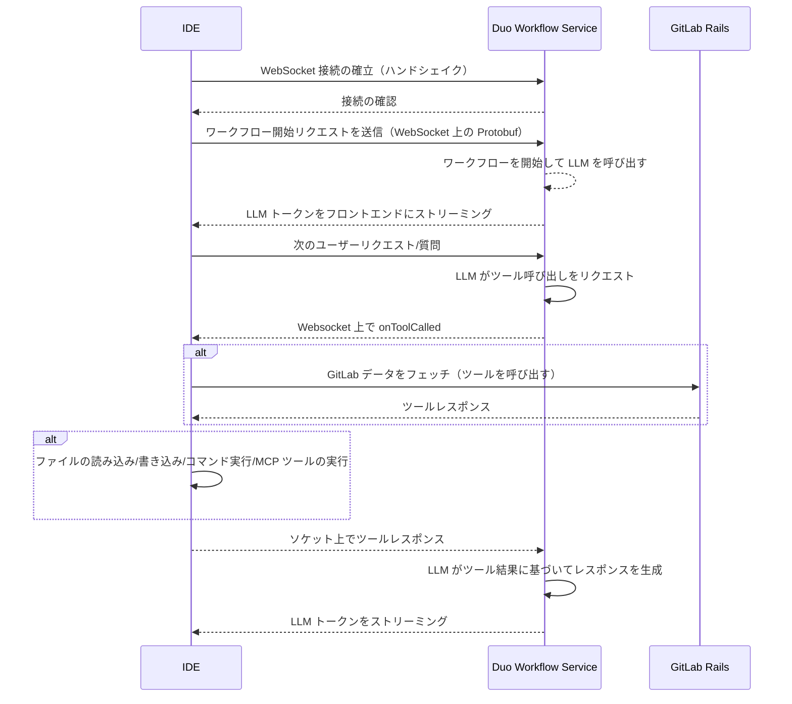
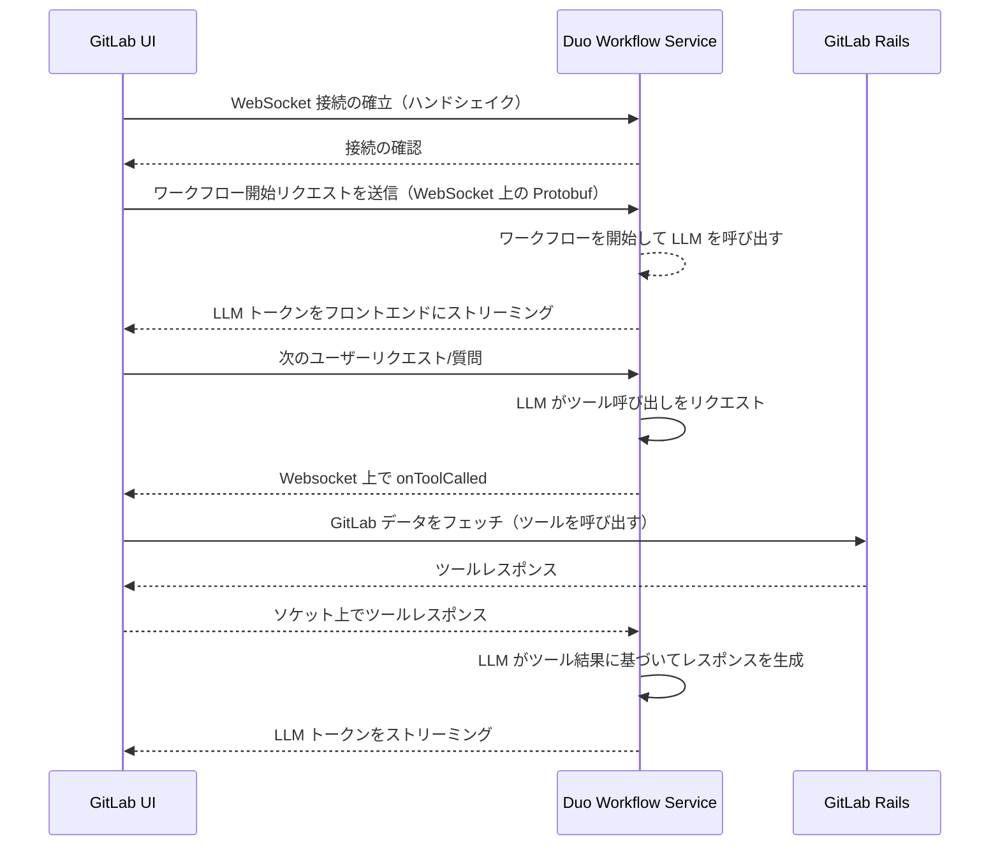

## コンテキスト

当初、Duo Workflow Service はストリーミングに HTTP/2 上の gRPC を使用していました。gRPC は効率的な双方向ストリーミングとコード生成を提供しますが、いくつかの課題が生じる可能性があります:

- エンタープライズの顧客は Netskope や Zscaler のようなセキュリティプラットフォームがデフォルトで HTTP/2 トラフィックをブロックするように設定されている可能性があるという直接的な経験があります。これにより Duo Workflow でのオンボーディングに摩擦が加わり、セキュリティチームが接続を許可するために関与する必要があります。
- [ブラウザはプロキシ層（gRPC-Web または Envoy）なしでは gRPC をネイティブに使用できません](https://grpc.io/blog/state-of-grpc-web/#feature-sets)。

顧客が **WebSocket**（HTTP/1.1 上）を使用できるようにすることで、これらの問題に対処し、すべてのコンポーネント（クライアント、サーバー、LSP エグゼキューター）でトランスポートを統一できます。また、必要に応じてブラウザからサービスへの直接ストリーミングを可能にし、リアルタイムフィードバックループを簡略化します。

**IDE インタラクション**:

**GitLab UI インタラクション（リモート実行なし）**:

## 決定

Duo Workflow のストリーミングとリクエスト/レスポンスインタラクションのために、gRPC の代替として **WebSocket を追加することを決定しました**。型の安全性を維持するために、適切な場合に WebSocket 上の Protobuf をシリアライゼーションに使用します。

WebSocket は以下の2つの採用例によって示されているように、AI ワークロードでスケールテスト済みです:

1. [Open AI Realtime API](https://platform.openai.com/docs/guides/realtime#connect-with-websockets)
2. [Gemini Live API](https://ai.google.dev/gemini-api/docs/live)

## 影響

- **長所**
  - WebSocket アップグレードを使用した標準 HTTP/1.1 上の単一ポートは、ファイアウォールフレンドリーである可能性が高いです。  
  - ブラウザは別のプロキシや gRPC-Web 実装なしに直接接続できます。  
  - フロントエンド、バックエンド、LSP エグゼキューターロジック全体でトランスポートが統一されます。

- **短所**
  - ストリーミングロジック、インターセプター、エラーハンドリングを含む既存の gRPC ベースのコードのリファクタリングが必要です。  
  - gRPC の組み込み機能（フロー制御、コード生成）は、WebSocket エコシステムで同等のライブラリで再作成または置き換える必要があります。  
  - 高負荷またはバイナリ集約ストリーミングシナリオでの gRPC との比較パフォーマンスは、追加のテストや最適化が必要になる場合があります。  

採用の容易さ、ネットワーク障害の削減、クライアント互換性の向上というメリットは、追加のリファクタリング作業を上回ります。
