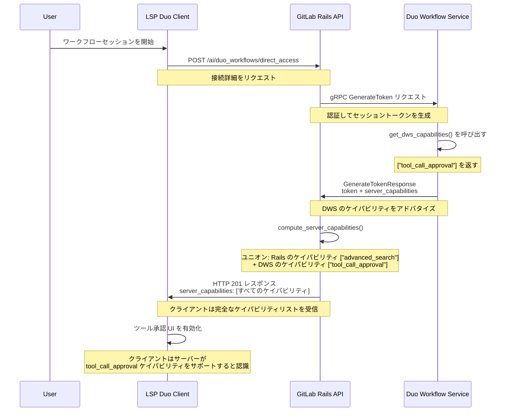
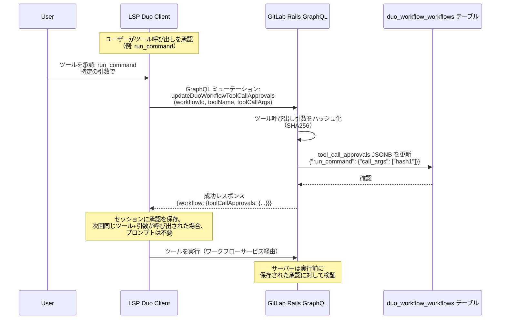



## 概要

ツール承認システムにより、GitLab Duo エージェントは以下を実現できます:

1. `/direct_access` エンドポイントを通じて**サーバーのケイパビリティを検出する**（システム 1）
2. ワークフローセッション内のツール呼び出し間で**ユーザーの承認を永続化する**（システム 2）

**システム 1（ケイパビリティネゴシエーション）**: DWS はサポートする機能（例: `"tool_call_approval"`）を protobuf 経由でアドバタイズします。Rails はこれを Rails が提供するケイパビリティ（例: `"advanced_search"`）とユニオンします。クライアントは完全なリストを受け取り、それに応じて UI を適応させます。

**システム 2（承認の永続化）**: クライアントはユーザーの承認決定を GraphQL ミューテーション経由で送信します。Rails はワークフローの JSONB カラムに承認済みのツール+引数の組み合わせの SHA256 ハッシュを保存します。これにより、セキュリティを損なうことなくセッション内の冗長な承認プロンプトを排除します。

ケイパビリティのアドバタイズと承認ストレージの両方で GitLab Rails を唯一の情報源として活用することで、このシステムはクロスクライアントの一貫性、集中的な監査、組織的な AI ガバナンスの長期ロードマップをサポートする「デフォルトセキュア」の姿勢を確保します。

### 目標

0. **機能検出を有効にする**: サーバーがどの機能をサポートしているかをクライアントが使用を試みる前に検出できるようにします。
1. **セキュリティポリシーの集中化**: ツール承認の権威あるストアとして GitLab Rails を確立します。
2. **AI ガバナンスを有効にする**: 組織レベルのツールポリシー、許可リスト/拒否リスト、コンプライアンス監査のためのアーキテクチャ基盤を提供します。
3. **ユーザー体験の最適化**: セキュリティ境界を損なうことなく、セッション内の冗長な承認プロンプトを排除します。

---

## 動機

AI エージェントがシンプルなチャットインターフェースから自律的なワークフローに移行するにつれて、信頼モデルもスケールする必要があります。技術的なスパイクはクライアントサイドストレージを検討しましたが、エンタープライズグレードのセキュリティと監視にはバックエンドを介したアプローチが必要です。

このシステムは2つの基本的な質問に答えます: (1) サーバーはツール承認ワークフローをサポートしているか？ (2) ユーザーはすでに何を承認したか？最初の質問は**ケイパビリティネゴシエーション**によって、2番目の質問は**承認の永続化**によって答えられます。

承認状態を GitLab バックエンドに移動することで、以下を解決します:

* **監査可能性**: 組織はコンプライアンスのために何が承認されたか、誰が承認したかの永続的な記録を必要とします。
* **一貫性**: ワークフローセッションはクラウドレベルのエンティティです。ユーザーが VS Code、JetBrains、または GitLab Web UI でインタラクトするかどうかに関わらず、セキュリティコンテキストは同一です。
* **スケーラビリティ**: このアーキテクチャにより将来のポリシーインジェクションが可能になり、組織ルール（例: 「プロジェクト X では常に `ls` を許可する」）をユーザーレベルの承認とマージできます。
* **拡張性**: このアーキテクチャは正規表現パターンとワイルドカード承認へのツール承認の拡張をサポートします。また、これはユーザーの自律（「yolo」）モードを有効にするための基本的なステップです。
* **機能検出**: クライアントはツール承認をサポートしない古いサーバーに接続する際に適切に機能を縮退できます。
* **プログレッシブエンハンスメント**: 古いクライアントを壊すことなく新しいケイパビリティを追加できます。

---

## アーキテクチャ

### アーキテクチャの概要

アーキテクチャは2つの補完的なシステムで構成されています:

1. **システム 1: ケイパビリティネゴシエーション**（機能検出）
   * **目的**: クライアントがサーバーのツール承認機能サポートを検出する
   * **エンドポイント**: `POST /api/v4/ai/duo_workflows/direct_access`
   * **フロー**: DWS がアドバタイズ → Rails がユニオン → クライアントが受信

2. **システム 2: 承認の永続化**（状態管理）
   * **目的**: クライアントが実際のユーザー承認決定を送信し、サーバーが保存する
   * **エンドポイント**: GraphQL ミューテーション `updateDuoWorkflowToolCallApprovals`
   * **ストレージ**: `duo_workflow_workflows.tool_call_approvals` JSONB カラム

**統合フロー**: クライアントが `/direct_access` を呼び出し、`server_capabilities: ["tool_call_approval", ...]` を受信します。`tool_call_approval` ケイパビリティが存在する場合、クライアントは承認 UI を有効にします。ユーザーがツールを承認すると、クライアントは GraphQL ミューテーションを送信します。Rails は承認ハッシュを保存します。サーバーは保存された承認に対して将来のツール呼び出しを検証します。

### システム 1: ケイパビリティネゴシエーション

### システム 2: 承認の永続化

### コンポーネント

#### GitLab Rails（デュアルロール）

**ケイパビリティネゴシエーション（システム 1）の場合:**

* DWS から gRPC `GenerateTokenResponse.server_capabilities` でケイパビリティのアドバタイズを受信します
* Rails のケイパビリティ（例: `advanced_search`）+ DWS のケイパビリティのユニオンを計算します
* `/direct_access` エンドポイントレスポンスに統合されたケイパビリティリストを返します
* オプションで GraphQL クエリのためにチェックポイントメタデータにケイパビリティを保存します

**承認の永続化（システム 2）の場合:**

* GraphQL ミューテーション `updateDuoWorkflowToolCallApprovals` を公開します
* ユーザーの承認決定を `duo_workflow_workflows.tool_call_approvals` JSONB カラムに保存します
* 保存前にツール呼び出し引数をハッシュ化します（SHA256）
* `UpdateToolCallApprovalsService` を使用して承認を検証します
* 保存された承認をクエリするための GraphQL タイプ `DuoWorkflows::WorkflowType.tool_call_approvals` を提供します

#### Duo Workflow Service

* `server_capabilities.py` の `get_dws_capabilities()` 関数でケイパビリティをアドバタイズします
* 現在アドバタイズするケイパビリティ: `["tool_call_approval"]`
* ワークフロー実行が開始される前のトークン生成時にケイパビリティが返されます
* 拡張可能: 新しいケイパビリティをリストに追加できます
* **注意**: DWS は Rails から取得した保存された承認に対してツールの実行を検証します

#### LSP クライアント（デュアルロール）

**ケイパビリティ検出（システム 1）の場合:**

* 接続詳細**および**サーバーのケイパビリティを取得するために `/direct_access` を呼び出します
* 事前に完全なケイパビリティリストを受信します
* アドバタイズされたケイパビリティに基づいて UI 機能を有効/無効にします
* `tool_call_approval` ケイパビリティが存在する場合 → 承認 UI を表示します

**承認送信（システム 2）の場合:**

* ユーザーがツール呼び出しを承認すると、GraphQL ミューテーションを送信します
* ミューテーションに含まれるもの: `workflowId`、`toolName`、`toolCallArgs`（生の JSON）
* 承認が保存されたことの確認を受け取ります
* 同じセッション内で以前に承認されたツール+引数の組み合わせの承認プロンプトをスキップできます

#### AI Gateway

* Rails と DWS 間のセキュアな gRPC 通信を促進します
* ケイパビリティ固有の追加ロジックなし（透過的なパススルー）
* `server_capabilities` フィールドの protobuf シリアライゼーション/デシリアライゼーションを処理します

#### データベース（Postgres）

* `duo_workflow_workflows.tool_call_approvals` JSONB カラムが承認ハッシュを保存します
* `duo_tool_call_approvals.json` JSON スキーマによってスキーマが検証されます
* データ構造: `{"tool_name": {"call_args": ["sha256_hash", ...]}}`
* スキーマによって 64KB のサイズ制限が適用されます

---

## ケイパビリティタイプ

ケイパビリティは機能サポートをアドバタイズする文字列です。クライアントは機能を有効にする前に特定のケイパビリティを確認します。

### 現在のケイパビリティ

| ケイパビリティ | ソース | 意味 |
|------------|--------|---------|
| `tool_call_approval` | DWS | サーバーはツールを実行する前にユーザーの承認を必要とします。クライアントは承認 UI を表示する必要があります。 |
| `advanced_search` | Rails | Elasticsearch が有効です。エージェントは高度な検索機能を使用できます。 |

---

## 設計上の決定

### システム 1: ケイパビリティネゴシエーションの決定

1. **ケイパビリティファーストアーキテクチャ**
   * **決定**: サーバーがサポートするものをアドバタイズし、クライアントがそれに応じて動作を適応させます
   * **根拠**: 適切な機能縮退を可能にします。ツール承認をサポートしない古い DWS インスタンスはケイパビリティをアドバタイズしません。クライアントはこれを検出し、承認ワークフローをスキップするか異なる UI を表示できます。

2. **ケイパビリティのユニオン**
   * **決定**: Rails は独自のケイパビリティと DWS のケイパビリティを結合します（ユニオン操作）
   * **根拠**: Rails と DWS の両方が独立した機能を持つ可能性があります。Rails は `advanced_search`（Elasticsearch）を知っています。DWS は `tool_call_approval` を知っています。クライアントは両方を知る必要があります。

3. **Protobuf コントラクトの拡張**
   * **決定**: `GenerateTokenResponse` に `repeated string server_capabilities` を追加します
   * **根拠**: ケイパビリティはトークン生成時に確立され、セッションの有効期間中変更不可になります。Protobuf は強い型付けとクロスランゲージサポートを提供します。

4. **Direct Access エンドポイント**
   * **決定**: WebSocket ハンドシェイク経由ではなく、`/direct_access` POST レスポンスでケイパビリティを返します
   * **根拠**: ステートフルな WebSocket ネゴシエーションを排除することでアーキテクチャを簡略化します。クライアントは単一の HTTP リクエストですべての接続情報とケイパビリティを取得します。

### システム 2: 承認の永続化の決定

1. **承認送信に GraphQL を使用**
   * **決定**: REST API の代わりに GraphQL ミューテーション `updateDuoWorkflowToolCallApprovals` を使用します
   * **根拠**: GraphQL は強い型付け、スキーマ検証、フィールドレベルの権限を提供します。クライアントは `workflow.toolCallApprovals` をクエリして保存された内容を確認できます。他のワークフローミューテーションと一貫性があります。

2. **ハッシュストレージ（SHA256）**
   * **決定**: 生の引数ではなくツール呼び出し引数の SHA256 ハッシュを保存します
   * **根拠**:
     * セキュリティ: パスワードやトークンなどの機密データのプレーンテキスト保存を防ぎます
     * サイズ制御: ハッシュは固定長（64文字）であり、JSONB カラムの増大を制限します
     * 比較: ハッシュにより完全な引数ペイロードを保存せずに完全一致の検出が可能です

3. **ワークフローテーブルの JSONB カラム**
   * **決定**: `duo_workflow_workflows.tool_call_approvals` JSONB カラムに承認を保存します
   * **根拠**:
     * セッションスコープ: 承認はワークフローのライフサイクルに紐付けられます（ワークフロー削除時に自動的にクリーンアップ）
     * 柔軟なスキーマ: JSONB はスキーママイグレーションなしにネストされた構造を可能にします
     * 効率的なクエリ: Postgres JSONB インデックスにより高速な検索が可能です
     * JSON スキーマによって適用される 64KB 制限が不正使用を防ぎます

4. **ワークフローステータス: `tool_call_approval_required`**
   * **決定**: 承認待ち状態のための専用ワークフローステータスを追加します
   * **根拠**: ユーザーが承認するまでワークフローが実行を一時停止できます。明確なステートマシン: `running` → `tool_call_approval_required` → `running`（承認後）。非同期承認パターンをサポートします。

---

**JSON スキーマの検証:**

完全なスキーマについては `app/validators/json_schemas/duo_tool_call_approvals.json` を参照してください。主な制約:

* ツール名は `^[a-zA-Z0-9_]+$` に一致しなければなりません
* ハッシュは正確に 64 の16進数文字でなければなりません（SHA256）
* ワークフローあたりのツールタイプの最大数は 100 です

---

## セキュリティ & ガバナンスモデル

| 戦略 | 実装 |
| :--- | :--- |
| **改ざん耐性** | 承認は GitLab Postgres DB に保存され、エージェント自身のツール実行によって変更することはできません。 |
| **監査証跡** | 状態が Rails に保存されるため、すべての承認イベントをコンプライアンスとセキュリティレビューのためにログに記録できます。 |
| **ガバナンスフック** | Rails が実行前に承認リクエストをインターセプトし、組織レベルのブロックリストを適用することを可能にします。 |
| **機能検出** | クライアントは前提なしにケイパビリティを検出します。ケイパビリティがない = 機能が利用できません。 |
| **ケイパビリティ許可リスト** | 明示的にアドバタイズされたケイパビリティのみが利用可能です。サーバーがリストを制御します。 |
| **不変のセッションケイパビリティ** | トークン生成時に確立されたケイパビリティはワークフロー実行中に変更できません。 |
| **クロスクライアントの一貫性** | 同じ DWS/Rails インスタンスに接続するすべてのクライアントは同一のケイパビリティを確認します。 |

---

### 後方互換性

* Rails はフィールドにアクセスする前に `respond_to?(:server_capabilities)` を確認します
* DWS がケイパビリティをサポートしていない場合（古いバージョン）、Rails は空の配列として扱います
* クライアントは空のケイパビリティリストを受け取り → 高度な機能が利用できないと仮定します

---

## 結論

ツール承認システムは、**2つの補完的なシステム**を通じて Duo Workflow のためのスケーラブルで安全かつユーザーフレンドリーな基盤を提供します:

1. **ケイパビリティネゴシエーション（システム 1）** により、クライアントはサーバーがどの機能をサポートしているかを検出でき、新しいケイパビリティが追加されるにつれて適切な機能縮退とプログレッシブエンハンスメントが可能になります。

2. **承認の永続化（システム 2）** は、GitLab バックエンドに承認状態を集中させることで、セッション内の冗長な承認プロンプトを排除します。

システム 1 はシステム 2 の前提条件です: クライアントは承認 UI を表示し承認決定を送信する必要があることを知る前に、まず `tool_call_approval` ケイパビリティを検出しなければなりません。

ケイパビリティのアドバタイズと承認ストレージの両方を GitLab Rails に集中させることで、クライアントサイドの前提の脆弱性を排除し、エンタープライズレベルの AI ガバナンス、クロスクライアントの一貫性、包括的な監査のために必要なフックを提供します。

このアーキテクチャは、組織レベルのポリシー、セッションをまたぐ永続的な承認、パターンベースの承認、完全な自律実行モードを含む将来の拡張の基盤となります。
