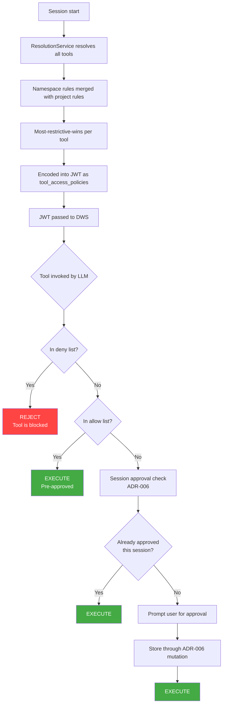
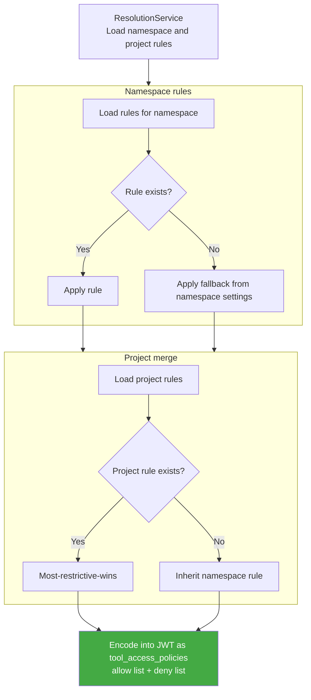



## エグゼクティブサマリー

この文書は、GitLab の AI ツールルールエンジンのアーキテクチャを定義します。これは、[ADR-006: Tool Approval System](006_tool_approval.md) で確立されたセッションレベルのツール承認システムの上に位置する、永続化された階層的なポリシーレイヤーです。

**ADR-006 (実装済み)** が答えるのは: *「このユーザーは、このセッションで、この正確なツール + 引数の組み合わせをすでに承認しているか?」* SHA256 でハッシュ化された承認をワークフローの JSONB カラムに保存し、単一のセッションにスコープされます。

**この文書 (007)** が答えるのは: *「このツールはそもそも許可されているのか、そして人間の確認が必要か?」* ポリシーが Organization/Group から Project や User のスコープまで階層的にカスケードする、セッションをまたいで存続する永続化された `ai_tool_rules` テーブルを導入します。

このシステムは 2 つの関心事を直交する軸として扱います:

- **軸 1 — アクセス制御** (`web_access` / `local_access`): ツールがそもそも許可されているか、そして人間の確認が必要かを決定します。値は `allow`、`ask`、または `deny` です。任意の祖先レベルでの `deny` は、すべての子孫に対してそのツールを完全にブロックし、上書きできません。
- **軸 2 — サーフェス**: ルールはサーフェス (`web` または `local`) ごとに適用され、Web ベースと IDE ベースの呼び出しに対して異なるポリシーを許可します。

| シグナル | カスケード方向 | 上書き可能? |
| :--- | :--- | :--- |
| `deny` | トップダウン | 不可 |
| `ask` | トップダウン | 不可 |
| `allow` | 継承されない | 明示的なルールが必要 |

---

## 1. 問題の記述

- **現状:** 2 つのシステムが導入されています。ADR-006 はセッションスコープの承認永続性を提供し、一度ユーザーがツール + 引数の組み合わせを承認すると、そのワークフローセッション中は再プロンプトされません。[MR !230300](https://gitlab.com/gitlab-org/gitlab/-/merge_requests/230300) は Instance/Group/Subgroup/Project レベルでカスケードする 3 状態のフィーチャートグル (`default_on`/`default_off`/`never_on`) を追加し、管理者にツール承認がアクティブかどうかについての粗粒度のコントロールを与えます。しかし、どちらのシステムもツールごとのポリシー、ユーザーレベルの事前承認、またはアクセス制御 (特定のツールを完全にブロックする) をサポートしていません。
- **望ましい状態:** ポリシーが Organization/Group レベルから Project と個々の User の両方へ階層的にカスケードする、永続化されたツールごとのルールエンジン。これは MR !230300 のフィーチャーレベルトグル (プライマリスイッチを制御する) と ADR-006 のセッション承認 (セッション内キャッシュを提供する) の上に構築され、ツールごとの粒度とサーフェス対応のガバナンスモデルを追加します。
- **コア目的:** ツールガバナンスの基礎的なエントリポイントとして機能する堅牢な GraphQL エンドポイントのセットを確立すること。このインフラは最終的に Enterprise スケールでの拡張ガバナンスとコンプライアンス要件をサポートします。

---

## 2. 既存システムとの統合

このシステムは既存のツール承認インフラを置き換えるのではなく、合成します。3 つのレイヤーが異なる抽象レベルで動作します:

| レイヤー | システム | 役割 | 永続性 | スコープ |
| :--- | :--- | :--- | :--- | :--- |
| **フィーチャートグル** | カスケードする `tool_approval_for_session` 設定 ([MR !230300](https://gitlab.com/gitlab-org/gitlab/-/merge_requests/230300)) | プライマリスイッチ: このスコープでツール承認システムはアクティブか? | 永続化 (`cascading_attr` 経由の設定テーブル) | Instance/Group/Subgroup/Project |
| **ツールごとのガバナンス** | **007 (この文書)** — ガバナンスルール | ポリシーシーリング: *この特定のツール* は許可されているか? 承認が必要か? | 永続化 (専用 DB テーブル) | Org/Group/Project/User 階層 |
| **セッションキャッシュ** | **006** — セッション承認 | ランタイムキャッシュ: ユーザーはこのセッションでこのツール + 引数をすでに承認しているか? | セッションスコープ (ワークフロー JSONB) | 単一ワークフローセッション |

### 2.1 フィーチャーレベルトグル (既存)

カスケードする `tool_approval_for_session` 設定は、Instance/Group/Subgroup/Project レベルで 3 状態のフィーチャートグルを提供します:

| 状態 | 意味 | カスケード動作 |
| :--- | :--- | :--- |
| `default_on` | ツール承認がアクティブ — ツールはデフォルトで承認を要求 | 子孫が上書き可能 |
| `default_off` | ツール承認が非アクティブ — ツールはデフォルトで自由に実行 | 子孫が上書き可能 |
| `never_on` | ツール承認がロックオフ — どの子孫も承認要件を無効化できない | 上書き不可 (`cascading_attr` ロックを使用) |

この設定は GitLab の既存の `cascading_attr` インフラを使用し、ガバナンスシステム全体の **プライマリスイッチ** として動作します。`default_off` の場合でも、ツールごとのガバナンスルール (この文書) が存在すれば適用されます — フィーチャートグルが制御するのは、ツールごとのルールがマッチしない場合の *デフォルト動作* であり、ルールエンジンが参照されるかどうかではありません。

### 2.2 合成されたランタイムフロー

ワークフローセッションが開始すると、Rails は `ResolutionService` を通じてすべてのツールガバナンス決定を事前に解決します。解決された allow/deny リストは署名付き JWT に `tool_access_policies` としてエンコードされ、セッションの期間中 DWS に渡されます。DWS はツールを LLM に提示する前に JWT から allow/deny リストを読みます。



**主要な合成ルール:**

1. ガバナンス解決はセッション開始時に一度実行され、deny ルールはセッションが始まる前に評価されます。拒否されたツールは決して LLM に到達しません。
1. `deny` ルールはすべての子孫に対してツールを完全にブロックし、上書きできません。
1. `ask` ルールは呼び出し時に ADR-006 のセッション承認フローを通じて人間の確認を要求します。
1. `allow` ルールはツールを事前承認し、確認は不要です。
1. ルールが存在しない場合のフォールバックは、ネームスペースの `tool_approval_for_session` 設定によって決定されます。
1. グループレベルでの単一のルールは、そのグループ内のすべてのプロジェクトにカスケードします。組織全体のポリシーには、最上位のグループルールで十分です。プロジェクトごとのルールは上書きであり、一般的なケースではありません。

### 2.3 セッション承認と引数マッチング

ADR-006 はセッション承認をツール + 引数の組み合わせの SHA256 ハッシュとして保存します。これは設計上、完全一致のメカニズムです — 「ユーザーは *まさにこの* 呼び出しを承認したか?」に答えます。SHA256 ハッシュは本質的に glob/regex パターンマッチングと互換性がありません。

v1 では、これは衝突しません: ガバナンスルール (この文書) とセッション承認 (ADR-006) はどちらも完全一致を使用します。v2 でガバナンスルールに glob/regex マッチングが導入されると、セッション承認レイヤーは独自の進化を必要とします — おそらくハッシュベースのルックアップからパターン対応の比較へ移行します。その変更は ADR-006 のストレージモデルにスコープされ、ここで定義されるガバナンスルール API には影響しません。

### 2.4 機能ネゴシエーション

ADR-006 の機能ネゴシエーション (`/direct_access` を通じた `tool_call_approval`) は変更されません。ガバナンスルールシステムはネゴシエートする新しい機能を追加しません — 既存の承認フローの前のサーバーサイドの事前チェックとして動作します。`tool_call_approval` 機能は引き続きカスケードする `tool_approval_for_session` 設定に基づいてフィルタリングされます。

---

## 3. ガバナンスロジック

このシステムはサーフェス対応の 3 状態モデル: `allow`、`ask`、`deny` で動作します。ルールはサーフェスごと (`web_access`、`local_access`) に保存され、Web ベースと IDE ベースの呼び出しに対して異なるポリシーを許可します。

### 3.1 強制の階層

解決はネームスペースとプロジェクト階層にわたって most-restrictive-wins (最も制限的なものが優先) で適用されます:

- 任意の祖先レベルでの `deny` は、すべての子孫に対してツールを即座にブロックします。上書きできません。
- プロジェクトルールはネームスペースルールに対してエスカレートする (より厳しくする) ことしかできず、ネームスペースポリシーを緩めることはできません。
- ルールが存在しない場合、フォールバックはネームスペースの `tool_approval_for_session_availability` 設定によって決定されます: `default_off` は `allow` にフォールバックし、`default_on` は `ask` にフォールバックします。



### 3.2 権限ティアと UI 状態

UI はサーフェスごとに各ツールの現在の状態を反映します。

#### アクセス命令 (ハードカスケード)

任意の祖先レベルで `deny` ルールが存在すると、ツールはすべての子孫に対して完全にブロックされます。

- **動作:** ツールはアクセス不可。ローカルでの上書きは不可能。
- **UI 状態:** トグルは **Locked/Disabled** で *「Blocked by [Group Name]」* とラベル付けされる。

#### 承認必要

ルールが `ask` に設定されている場合、ツールが実行される前に人間の確認が必要です。

- **動作:** ツールは利用可能だが、各呼び出しで承認が必要 (ADR-006 のセッションキャッシュに従う)。
- **UI 状態:** トグルは **Ask** を表示し、祖先スコープで設定されている場合はロックされる場合がある。

#### 自動承認

ルールが `allow` に設定されている場合、ツールは確認なしに実行されます。

- **動作:** ツールはセッションに対して事前承認される。
- **UI 状態:** トグルは **Allow** を表示する。

### 3.3 解決マトリクス

| ネームスペースルール | プロジェクトルール | 有効なルール |
| :--- | :--- | :--- |
| `deny` | 任意 | `deny` |
| `ask` | `deny` | `deny` |
| `ask` | `allow` | `ask` (プロジェクトは緩められない) |
| `ask` | `ask` | `ask` |
| `allow` | `deny` | `deny` |
| `allow` | `ask` | `ask` |
| `allow` | `allow` | `allow` |
| なし | `deny` | `deny` |
| なし | `ask` | `ask` |
| なし | `allow` | `allow` |
| なし | なし | ネームスペース設定からのフォールバック |

---

## 4. API 設計と統合

### 4.1 GraphQL ミューテーション

```graphql
mutation UpdateAiToolRule($input: UpdateAiToolRuleInput!) {
  updateAiToolRule(input: $input) {
    toolRule {
      id
      name
      webAccess
      localAccess
      actionType
      category
      source
    }
    errors
  }
}
```

**UpdateAiToolRule**
ネームスペースオーナーが特定のツールに対するガバナンスルールを定義または更新できるようにします。`fullPath` (ネームスペース)、オプションの `projectPath` (プロジェクトスコープのルール用)、`toolId`、`webAccess`、`localAccess` を受け付けます。ツール名は書き込み時にレジストリに対して検証されます。プロジェクトスコープのルールはネームスペースルールよりも厳しくすることしかできず、緩めることは許可されません。

### 4.2 GraphQL クエリ

```graphql
query {
  aiToolRules(fullPath: "my-group", projectPath: "my-group/my-project") {
    nodes {
      id
      name
      webAccess
      localAccess
      actionType
      category
      source
    }
  }
}
```

**aiToolRules**
レジストリ内のすべてのツールに対するマージされた有効なルールを返し、ネームスペースとプロジェクトルールにわたって most-restrictive-wins を適用します。`projectPath` が提供されると、プロジェクトレベルのルールがネームスペースルールの上にマージされます。明示的なルールのないツールに対してはフォールバック値が返され、ネームスペースの `tool_approval_for_session_availability` 設定から導出されます。オプションのフィルター引数 `search`、`actionType`、`category`、`source`、およびそれらの否定版をサポートします。

### 4.3 認可モデル

- **ネームスペースルール:** Owner ロールが必要 (読み + 書き)。
- **プロジェクトルール:** 親ネームスペースのオーナーが必要。プロジェクトレベルのルールはエスカレートしかできないため、ネームスペースポリシーを緩めることはありません。
- **ユーザールール:** GA 後に延期。v2 文書を参照。

---

## 5. データモデル

### 5.1 データベーススキーマ

```ruby
create_table :ai_tool_rules do |t|
  t.references :namespace, null: false, foreign_key: { on_delete: :cascade }
  t.references :project, null: true, foreign_key: { on_delete: :cascade }
  t.string :tool_name, null: false
  t.integer :web_access, limit: 2      # 0: allow, 1: ask, 2: deny
  t.integer :local_access, limit: 2    # 0: allow, 1: ask, 2: deny
  t.string :tool_source
  t.jsonb :tool_arguments
  t.timestamps_with_timezone

  t.check_constraint "(web_access IS NOT NULL OR local_access IS NOT NULL)",
    name: "chk_ai_tool_rules_has_permission"
end

add_index :ai_tool_rules,
  [:namespace_id, :project_id, :tool_name],
  unique: true,
  nulls_not_distinct: true,
  name: "idx_ai_tool_rules_ns_proj_tool_unique"

add_index :ai_tool_rules, :project_id,
  name: "index_ai_tool_rules_on_project_id"
```

**namespace_id は常に必須です。** `project_id` は `namespace_id` のピア代替ではなく、追加のスコーピング制約です。プロジェクトルールはネームスペースルールを特定のプロジェクトにさらに下方へスコープしたものであり、ネームスペースの代わりにプロジェクトが所有するルールではありません。これによりより強力なデータ整合性 (両方のカラムに外部キー) が得られ、ポリモーフィックアソシエーションパターンを避けられます。

**`NULLS NOT DISTINCT`** は複合一意インデックスで `NULL` の `project_id` 値を一意性のために等しいものとして扱い、ツールごとにネームスペースレベルのルールが最大 1 つ、ツールごと・プロジェクトごとにプロジェクトレベルのルールが最大 1 つであることを保証します。

**ON DELETE CASCADE:** ネームスペースまたはプロジェクトが削除されると、関連するすべてのガバナンスルールは自動的に削除されます。

### 5.2 スキーマ構造

- **namespace_id**: 常に非 null。すべてのルールのルートオーナー。
- **project_id**: nullable。存在する場合、ルールをネームスペース内の特定のプロジェクトにスコープする。
- **web_access**: SmallInt enum。Web およびアンビエントサーフェスに対する権限。`0` = allow、`1` = ask、`2` = deny。
- **local_access**: SmallInt enum。ローカル/IDE サーフェスに対する権限。`web_access` と同じ値。
- **tool_name**: 書き込み時にツールレジストリに対して検証される文字列識別子。
- **tool_source**: 文字列。組み込みツールには `gitlab`、外部 MCP ツールには `mcp`。
- **tool_arguments**: JSONB。将来の引数レベルマッチング用に予約。現在、解決では未使用。

---

## 6. パフォーマンス

**事前解決:** ガバナンス決定は呼び出しごとではなくセッション開始時に一度解決されます。解決された allow/deny リストは署名付き JWT にエンコードされ DWS に渡され、呼び出しごとのレイテンシを排除し、決定キャッシングや Redis pub/sub 無効化の必要性を取り除きます。ルール変更は次のセッションの開始時に有効になります。

**クエリ効率:** 解決は 2 つのクエリ、ネームスペースルール用に 1 つとプロジェクトルール用に 1 つを実行し、メモリ内でそれらをマージします。現在のツールレジストリとルールテーブルの規模では、これは効率的です。より深いグループ階層やより大きなルールセットの場合、GitLab の `traversal_ids` (ネームスペースのマテリアライズドパス) を使用してすべてのルールを単一のクエリで取得できます。この最適化は、本番データが必要であることを示すまで延期されます。

**監査証跡:** ツールルールが作成または更新されると監査イベントが発行され、コンプライアンスチームにポリシー変更の証跡を提供します。ツール呼び出し監査イベントは ADR-006 によって処理されます。

---

## 7. セキュリティと整合性

- **JWT 署名:** ガバナンス決定は署名付き JWT にエンコードされます。DWS は allow/deny リストを読む前に JWT 署名を検証し、転送中のなりすましや改ざんを防ぎます。
- **フェイルクローズドポリシー:** 解決失敗時、システムは `DEFAULT_PRIVILEGES`、利用可能なすべての権限グループ (`READ_WRITE_FILES`、`READ_ONLY_GITLAB`、`READ_WRITE_GITLAB`、`RUN_COMMANDS`、`USE_GIT`、`RUN_MCP_TOOLS`) の事前定義されたセットにフォールバックします。これはすべてのツールへのアクセスを許可しますが事前承認はなく、すべてのツール呼び出しは ADR-006 のセッション承認フローを通じてユーザーの確認を要求します。これはアクセスについてはフェイルオープン、自律性についてはフェイルクローズドです。ツールは利用可能ですが、どれも自動承認されません。
- **拒否されたツールのフィルタリング:** 拒否されたツールは、DWS が LLM にツールを提示する前にツールセットから取り除かれます。モデルは使えないツールを決して見ず、ハルシネーションリスクを減らし、モデルがブロックされたツールを呼び出そうとすることを防ぎます。

---

## 8. v2 とその先

延期された機能とその理由は [AI Governance v2: Deferred Capabilities](007_ai_governance_v2.md) で追跡されています。
