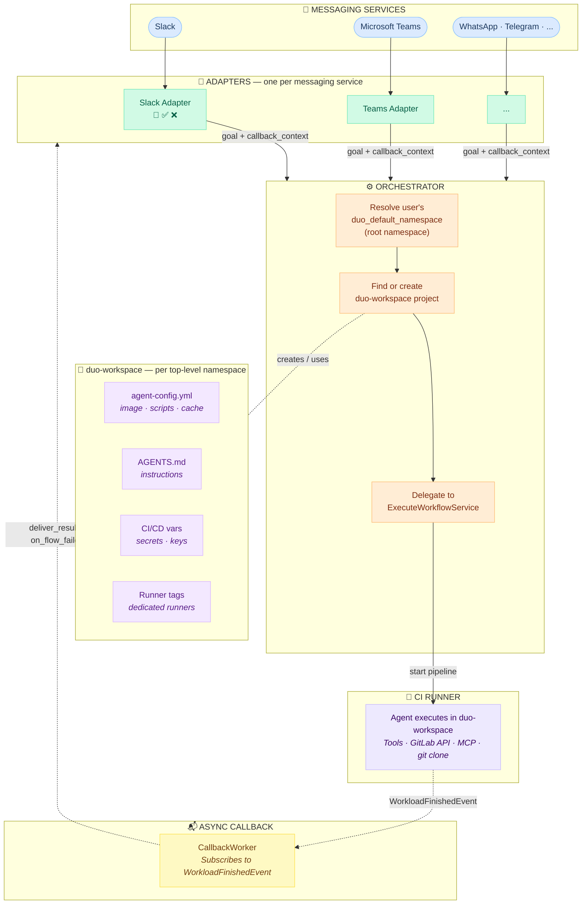
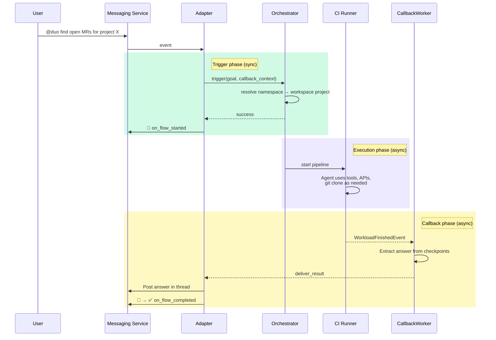
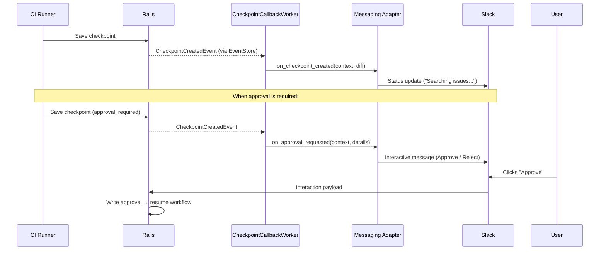

## コンテキスト

私たちはユーザーが外部のメッセージングサービス（まずは Slack、次に Microsoft Teams、WhatsApp、Telegram など）から Duo と対話できるようにしたいと考えています。ユーザーは Duo を @メンションし、タスクを与えると、Duo がそれを非同期で処理し、結果を返信します。

メッセージングに固有の課題が 2 つあります。

1. CI パイプラインにはプロジェクトが必要ですが、メッセージングサービスにはプロジェクトのコンテキストがありません
2. 複数のメッセージングプラットフォームを、オーケストレーションロジックを重複させることなくサポートする必要があります

### 検討された代替案

5 つのアプローチを調査しました。

1. **CI ジョブ（Flows API）** — 既存の Flows インフラ経由で CI パイプラインをトリガーします。実績があり、ADR 004 に準拠しており、Workhorse や DWS の変更は不要です。エージェントが git clone、テスト実行、ツールインストール、フル開発タスクを実行できる本物の実行環境を提供する唯一のアプローチです。デメリット: CI 起動レイテンシ（空プロジェクトで約 10 秒）。パイプラインにプロジェクトが必要 — ワークスペースプロジェクトを自動作成することで解決。

2. **WebSocket ブロッキング** — Sidekiq ワーカーが Workhorse に WebSocket を開き、ワークフロー全体の間接続を維持します。シンプルで、ストリーミングに対応しています。デメリット: リクエストごとに最大 5 分間 Sidekiq スレッドをブロックするため、Sidekiq プロセスごとのスループットが約 50 の同時ワークフローに制限されます。実行環境なし — エージェントはファイルシステム、git、コマンド実行能力を持たない Workhorse 内で動作します。エージェントが読み取り専用の API 操作に限定され、開発タスクへのパスがありません。

3. **WebSocket ファイア・アンド・フォーゲット** — Sidekiq が WebSocket を開き、スタートリクエストを送信後すぐに切断します。**ブロック済み**: プロトタイピングで、クライアントが切断すると Workhorse がワークフローを終了すること（クリーンな切断では `StopWorkflow` を送信し、異常な切断では gRPC を切断）が判明しました。ヘッドレス/デタッチモードを追加するには Workhorse の変更が必要です。選択肢 2 と同様の実行環境の制限があります。

4. **ダイレクト gRPC** — Sidekiq が DWS への gRPC 双方向ストリームを直接開きます。低レイテンシでタイプセーフです。**ADR 004 に違反します**（DWS への 2 番目のパスを導入します）。Ruby で HTTP アクションプロキシを再実装する必要があります。コードベースに Sidekiq からの gRPC 双方向ストリームのパターンが確立されていません。同様に実行環境の制限があります — ファイルシステムやツールが利用できません。

5. **Workhorse ヘッドレス HTTP** — HTTP POST 経由でワークフロートリガーを受け付け、gRPC ストリームを内部で管理する新しい Workhorse エンドポイントです。**チーム横断の Workhorse 変更**（約 50〜100 行の Go コード）と変更されたランナーライフサイクルが必要です。選択肢 2〜4 と同様の実行環境の制限 — 追加のアーキテクチャなしでは開発タスクへのパスがありません。

## 決定

マルチプラットフォームサポートのための**アダプターパターン**と、CI コンテキストを提供するための**名前空間ごとのワークスペースプロジェクト**を使用した **Flows API（CI ジョブ）**アプローチを採用します。

### アーキテクチャ



**実線矢印** = 同期呼び出し &nbsp;&nbsp; **破線矢印** = 非同期イベント

### リクエストフロー



### 主要な設計上の選択

**Flows API を通じたエージェントフロー（`ExecuteWorkflowService` への委譲）。** オーケストレーターは、既存の Flows API を使用してワークスペースプロジェクトでエージェントフローをトリガーします。権限処理、トークン生成、ワークフロー開始ロジックの重複を避けるため、既存のトリガーパスが使用しているのと同じ `ExecuteWorkflowService` に委譲します。メッセージングサービスはスレッドのコンテキストをゴールとして渡します。初期段階では、Duo Developer を動かしているものと同じ `developer/v1` フローを使用し、エージェントに初日からフルの能力（ツール、GitLab API、MCP、git）を提供します。

**`duo-workspace` 自動作成プロジェクト。** トップレベルの名前空間ごとにプライベートで空のプロジェクトが CI パイプラインのコンテキストを提供します。これが内部 MVC の進む方向です。正確なプロジェクト名（`duo-workspace`）は最終決定ではなく、フォローアップでイテレーションできます。ワークスペースプロジェクトはユーザーの `duo_default_namespace` の**ルート名前空間**に作成されます — たとえば、ユーザーのデフォルト名前空間が `gitlab-org/editor-extensions` の場合、ワークスペースプロジェクトは `gitlab-org/editor-extensions/duo-workspace` ではなく `gitlab-org/duo-workspace` に作成されます。これにより、ネストされた名前空間全体にプロジェクトが増殖するのを避け、トップレベルグループごとに 1 つのワークスペースプロジェクトを維持します。

ワークスペースプロジェクトは、管理者が名前空間に対して `developer/v1` フローを有効にしたとき（管理者権限を使用）に作成され、堅牢性のためにトリガー時のフォールバックとして find-or-create があります。通常のユーザーは `create_projects` アクセス権を持っていない可能性があるため、権限の問題を回避します。このリリース前にすでに `developer/v1` が有効になっている既存の名前空間には、バックフィルマイグレーションが必要です（フォローアップ）。

チームはワークスペースプロジェクトを（Docker イメージ、AGENTS.md、スキル、CI 変数、ランナータグを）既存のプロジェクト機能を使用してカスタマイズします。Security Policy Projects と同じパターンに従います。

**`duo_default_namespace` による名前空間解決。** 新しい設定なし — 既存のユーザー設定を再利用します。このプリファレンスのルート名前空間が、ワークスペースプロジェクト解決のためのトップレベルグループを決定します。

**`developer/v1` が有効である必要があります。** オーケストレーターは、ユーザーの名前空間に対して `developer/v1` の基盤フローが有効になっているかを事前に検証します。有効でない場合、メッセージングは `:flow_not_enabled` エラーを返し、ユーザーに管理者に有効化を依頼するよう促します。この早期チェックにより、下流の混乱する障害（例: 「Could not resolve service account」）を回避し、各アダプターが適切なユーザー向けメッセージを作成できます。

**アダプターパターン。** 各メッセージングプラットフォームはライフサイクルフック（`deliver_result`、`deliver_error`、`on_flow_started`、`on_flow_completed`、`on_flow_failed`）を持つアダプターを実装します。オーケストレーター、ワークスペースプロジェクト、コールバックインフラは共有されます。

**EventStore コールバック。** `CallbackWorker` は `WorkloadFinishedEvent` にサブスクライブし、ワークフローレコード（JSONB カラム）の `messaging_callback_context` を確認して、アダプターを通じて結果を配信します。GraphQL なし、ポーリングなし。コールバックコンテキストにはアダプター固有の配信情報が含まれます。たとえば Slack の場合は以下のようになります。

```json
{
  "adapter": "slack",
  "team_id": "T0123ABC",
  "channel_id": "C0123ABC",
  "thread_ts": "1234567890.123456",
  "message_ts": "1234567890.123456",
  "user_id": "U0123ABC"
}
```

**`developer/v1` カタログサービスアカウントの再利用。** メッセージングは `developer/v1` のトリガーメカニズムであり、別のフローではありません。サービスアカウントの ID はトリガーソースではなく、実行されるフローを反映します。オーケストレーターは、管理者が名前空間の Developer フローを有効にしたときに作成された既存の SA を解決します。別のメッセージング SA は作成されません。`developer/v1` が有効でない場合、SA は存在せず、メッセージングは明確なエラーを返します。SA は `composite_identity_enforced: true` を使用します — Duo Developer や他のエージェントプラットフォームフローが使用している同じセキュリティモデルです。有効な権限は、トリガーするユーザーとサービスアカウントのアクセス権の積集合です。

### ストリーミングと人間による承認へのパス

このアーキテクチャは、コアデザインを変更することなく、リアルタイムの進捗表示とインタラクティブな機能に拡張できます。



新しい `CheckpointCallbackWorker` は `WorkflowCheckpointCreatedEvent` にサブスクライブします — チェックポイントイベントは特性が異なる（高頻度、異なるリトライセマンティクス）ため、`CallbackWorker` とは別になっています。各ステップはイベント駆動です。永続的な接続は必要ありません。承認状態はワークフローレコードに永続化され、フローを停止して再起動できます。

### アダプターインターフェース

v1 アダプターは 2 つの必須メソッドのみ必要です。他のすべてのフックは、対応するインフラが構築されたときに追加される基底クラスの no-op デフォルトを持つオプションです。

| メソッド | 目的 | 呼び出し元 | 必須? |
|---|---|---|---|
| `deliver_result` | 最終的な回答を投稿 | `CallbackWorker` | Yes |
| `deliver_error` | エラーメッセージを投稿 | `CallbackWorker` | Yes |
| `on_flow_started` | 作業開始を通知（例: 👀） | トリガーサービス | Optional |
| `on_flow_completed` | 作業完了を通知（例: ✅） | `CallbackWorker` | Optional |
| `on_flow_failed` | 失敗を通知（例: ❌ + エラー） | 両方 | Optional |
| `on_checkpoint_created` | 中間進捗の更新 | `CheckpointCallbackWorker` | Optional（将来） |
| `on_approval_requested` | 承認プロンプトを投稿 | `CheckpointCallbackWorker` | Optional（将来） |

### 責任分担: フロー前チェック vs アダプターライフサイクル

プラットフォーム固有のプリフライトチェック（認証、認可、フィーチャーフラグ、ライセンス検証）は、エントリポイントサービス（例: Slack の `AppMentionedService`）に残ります。これらは Duo が関与する前に行われ、プラットフォーム固有のレスポンス（例: リンクされていない Slack ユーザーのための OAuth 認可リンク）を必要とする場合があります。

アダプターはフローライフサイクルのみを処理します: `on_flow_started`、`on_flow_completed`、`on_flow_failed`、`deliver_result`、`deliver_error`。これにより、アダプターの実装が認証ロジックではなく配信メカニズムに集中できます。

### 起動時間

| ステップ | 現在（大規模プロジェクト） | duo-workspace を使用した場合 |
|---|---|---|
| Git clone | 数秒〜数分 | ほぼ即時（空のリポジトリ） |
| Docker イメージ | デフォルト、毎回プル | `agent-config.yml` でカスタム、キャッシュ済み |
| `duo-cli` インストール | 毎回 `npm install`（約 15 秒） | カスタムイメージに事前組み込み |

プロトタイピングにより、空のワークスペースプロジェクトでエンドツーエンドのレスポンス時間が 10 秒未満であることが示されました。これは非同期メッセージングには許容範囲内です。チームはワークスペースプロジェクトをカスタマイズする（キャッシュされたイメージ、専用ランナー、事前インストールされたツール）ことでさらに最適化できます。

## メリット

- 実績のある CI/Flows インフラ — 新しい実行ランタイムは不要
- Workhorse や DWS の変更は不要
- ADR 004 に準拠
- すべての CI の改善がメッセージングに無償で恩恵をもたらす
- アダプターパターンによりプラットフォーム固有の懸念事項を明確に分離
- ワークスペースプロジェクトは自然なカスタマイズサーフェス（イメージ、スキル、シークレット）
- ストリーミングと人間による承認が同じアーキテクチャを追加的に拡張する
  （新しい EventStore サブスクリプション、新しいアダプターフック — コアの変更なし）

## デメリット

- CI 起動レイテンシ（空プロジェクトで約 10 秒）は直接サービス呼び出しより遅いが、非同期メッセージングには許容範囲内
- プロジェクトとサービスアカウントの自動作成により、名前空間に暗黙的なリソースが追加される
- アダプターフックは異なるコールサイト（トリガーサービス vs コールバックワーカー）から呼び出される — 新しいアダプター作成者のための明確なドキュメントが必要

## 実装

- [Issue](https://gitlab.com/gitlab-org/gitlab/-/work_items/590434)

### フィーチャーフラグ

フロー全体は
[`slack_duo_agent`](https://gitlab.com/gitlab-org/gitlab/-/work_items/592185)
フィーチャーフラグ（ユーザーごと）によってゲートされており、すでに `AppMentionedService` をゲートしています。
