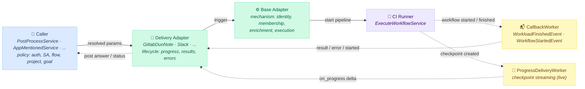
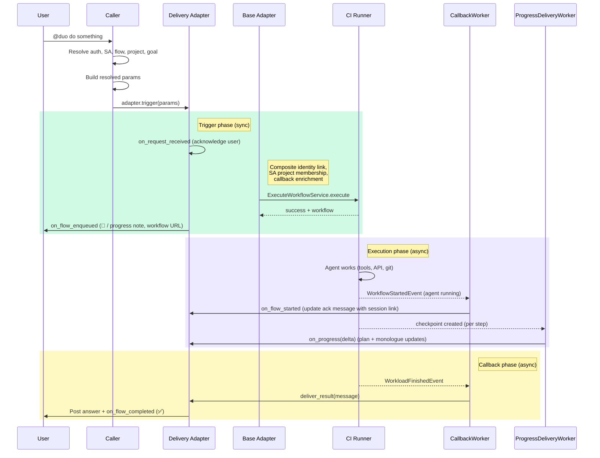
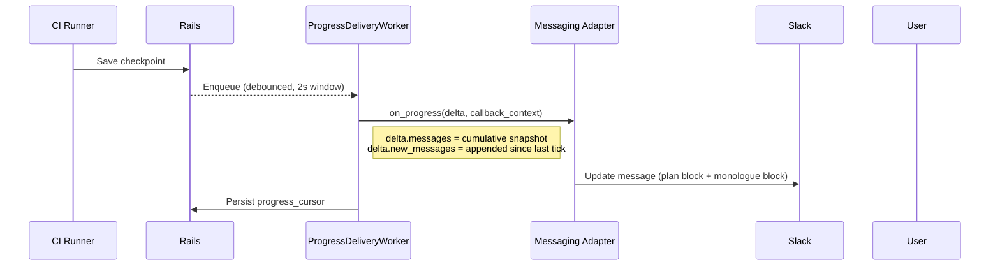
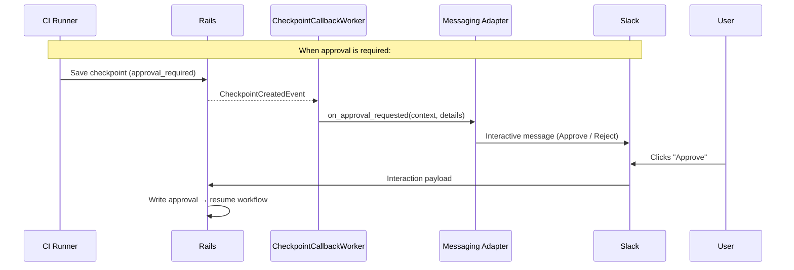

## コンテキスト

私たちは、ユーザーがさまざまなサーフェスから Duo とやり取りできるようにしたいと考えています。外部のメッセージングサービス（Slack、Microsoft Teams、WhatsApp、Telegram）に加え、Issue やマージリクエストのコメントといった GitLab ネイティブなサーフェスも含みます。ユーザーが Duo を @メンションしてタスクを与えると、Duo はそれを非同期に処理し、結果を投稿して返します。

主な動機は外部メッセージングプラットフォームですが、同じアダプターパターンは自然に GitLab のノートベースのインタラクション（例: MR や Issue で Duo サービスアカウントを @メンションする）にも拡張されます。マージリクエストのコメントは概念的にはメッセージングの一形態であり、このアーキテクチャはそれらを一様に扱います。

これらのインタラクションには 2 つの固有の課題があります:

1. CI パイプラインにはプロジェクトが必要だが、一部のサーフェス（例: Slack）にはプロジェクトのコンテキストがない
2. オーケストレーションロジックを重複させずに複数のサーフェスをサポートする必要がある

### 検討した代替案

5 つのアプローチを調査しました:

1. **CI ジョブ（Flows API）** — 既存の Flows インフラを通じて CI パイプラインをトリガーします。実績があり、ADR 004 に準拠しており、Workhorse や DWS の変更を必要としません。実際の実行環境を提供する唯一のアプローチです。エージェントは git clone、テストの実行、ツールのインストール、完全な開発タスクを行えます。欠点: CI の起動レイテンシ（空のプロジェクトで約 10 秒）。パイプラインにはプロジェクトが必要ですが、プロジェクトのコンテキストが存在しない場合にワークスペースプロジェクトを自動作成することで解決します。サーフェスがすでにプロジェクトを提供している場合（例: MR 上の GitLab ノート）は、ワークスペースプロジェクトは不要です。

2. **WebSocket ブロッキング** — Sidekiq ワーカーが Workhorse への WebSocket を開き、ワークフローの全期間を通じてそれを開いたままにします。シンプルで、ストリーミングをサポートします。欠点: リクエストごとに最大 5 分間 Sidekiq スレッドをブロックし、スループットを Sidekiq プロセスあたり約 50 の同時ワークフローに制限します。実行環境がありません。エージェントは Workhorse 内で実行され、ファイルシステム、git、コマンド実行の能力がありません。エージェントを読み取り専用の API インタラクションに制限し、開発タスクへの道がありません。

3. **WebSocket fire-and-forget** — Sidekiq が WebSocket を開き、開始リクエストを送信し、すぐに切断します。**ブロック**: プロトタイピングにより、クライアントが切断すると Workhorse がワークフローを終了させることが判明しました（正常なクローズ時には `StopWorkflow` を送信し、異常なクローズ時には gRPC を破棄します）。ヘッドレス/デタッチドモードを追加するために Workhorse の変更が必要になります。オプション 2 と同じ実行環境の制限があります。

4. **直接 gRPC** — Sidekiq が DWS への gRPC 双方向ストリームを直接開きます。低レイテンシで型安全です。**ADR 004 に違反**します（DWS への 2 つ目の経路を導入するため）。HTTP アクションのプロキシを Ruby で再実装する必要があります。コードベースには Sidekiq から gRPC 双方向ストリーミングを行う確立されたパターンがありません。同じ実行環境の制限があります。ファイルシステムやツールが利用できません。

5. **Workhorse ヘッドレス HTTP** — HTTP POST 経由でワークフロートリガーを受け付け、内部で gRPC ストリームを管理する新しい Workhorse エンドポイントです。**チームをまたぐ Workhorse の変更が必要**（Go コード約 50〜100 行）で、ランナーのライフサイクルを変更する必要があります。オプション 2〜4 と同じ実行環境の制限があります。追加のアーキテクチャなしには開発タスクへの道がありません。

## 決定

マルチサーフェスサポートのための**アダプターパターン**と、プロジェクトのコンテキストを欠くサーフェスのためのフォールバックとしての **namespace ごとのワークスペースプロジェクト**を用いて、**Flows API（CI ジョブ）**アプローチを使用します。

### アーキテクチャ



**実線の矢印** = 同期呼び出し &nbsp;&nbsp; **破線の矢印** = 非同期イベント

### リクエストフロー



### 主要な設計選択

**Caller がポリシーを所有し、アダプターが配信を所有し、ベースアダプターがメカニズムを所有する。**
このアーキテクチャは 3 つの関心事を分離します:

- **Caller**（例: `@mention` トリガー向けの `PostProcessService`、Slack 向けの `AppMentionedService`）は、すべてのポリシー判断を所有します。認可、サービスアカウントの選択、フローの選択、バージョンの選択、プロジェクトの選択、ゴールの構築です。Caller はすべてを解決し、アダプターを関与させる前に、型付けされた解決済み入力を構築します。
- **配信アダプター**（例: `GitlabDuoNote`、`Slack`）は、ユーザー向けのライフサイクルを所有します。リクエストの確認応答、進捗の表示、結果やエラーの配信、非同期復元のためのコールバック状態の永続化です。アダプターはトリガーソースではなく**配信チャネル**によって構成されます。`GitlabDuoNote` アダプターは、`@mention`、`@GitLabDuo`、将来のウェブフックのいずれによってトリガーされたかにかかわらず、ノートスレッド経由で配信するあらゆるフローを処理します。
- **共有ベースアダプター**は、どの Caller やアダプターも個別に行うべきではない、セキュリティ上重要なメカニズムを処理します。コンポジットアイデンティティのリンク、SA プロジェクトメンバーシップ、コールバックコンテキストのエンリッチメント、リソースの変換、`ExecuteWorkflowService` 経由のワークフロー実行です。

これは、異なる Caller が根本的に異なる認証モデル（例: Slack はワークスペースインストール + namespace マッピング、GitLab ノートは `:trigger_ai_flow` ポリシー、`@GitLabDuo` は MR レベルのアビリティを使用）を持ちつつ、チャネルが同じ場合は同じ配信アダプターを再利用できることを意味します。

**フローの参照とバージョンは Caller によって制御される。** 各 Caller は、どのフローをトリガーするか（例: `developer/v1`）を指定し、オプションでバージョンを固定します。Caller は、フローのバージョニングに標準の解決経路を使用することも、バージョンを独立してオーバーライドすることもできます。これにより、同じインフラが異なるバージョン戦略を持つ複数のエージェントフローをサポートできます。

**`project:` は Caller によって制御される — ワークスペースプロジェクトはフォールバック。** Caller がプロジェクトを持っている場合（例: MR 上の GitLab ノートは `note.project` を提供する）、そのプロジェクトが直接使用されます。`duo-workspace` の自動作成プロジェクトは、プロジェクトのコンテキストを持たない Caller（例: Slack の `AppMentionedService`）のためにのみ機能します。

**`duo-workspace` 自動作成プロジェクト（プロジェクトのないサーフェス向け）。** トップレベル namespace ごとのプライベートで空のプロジェクトは、プロジェクトが利用できない場合に CI パイプラインのコンテキストを提供します。ワークスペースプロジェクトは、ユーザーの `duo_default_namespace` の**ルート namespace** に作成されます。たとえば、ユーザーのデフォルト namespace が `gitlab-org/editor-extensions` の場合、ワークスペースプロジェクトは `gitlab-org/duo-workspace` に作成されます。これにより、トップレベルグループごとに 1 つのワークスペースプロジェクトが維持され、ネストされた namespace 全体でプロジェクトが増殖するのを防ぎます。正確なプロジェクト名（`duo-workspace`）は最終的なものではなく、イテレーションで変更できます。

ワークスペースプロジェクトは、管理者が namespace のフローを有効にしたとき（管理者権限を使用）に作成され、堅牢性のためにトリガー時に find-or-create のフォールバックを行います。チームは、既存のプロジェクト機能を使用してワークスペースプロジェクト（Docker イメージ、AGENTS.md、スキル、CI 変数、ランナータグ）をカスタマイズします。Security Policy Project と同じパターンに従います。

**コンポジットアイデンティティは既存の認証ドメインのプリミティブを使用する。** コンポジットアイデンティティのリンクは、並行するリンカーモジュールを導入する代わりに、認証ドメインに委譲します。SA は `composite_identity_enforced: true` を使用します。これは Duo Developer や他のエージェントプラットフォームフローで使用されているのと同じセキュリティモデルです。実効的な権限は、トリガーしたユーザーとサービスアカウントのアクセスの積集合です。

**段階的なレジリエンス。** ライフサイクルフックは重要度によって分類されます。ユーザー向けの確認応答は成功する必要があり、そうでなければトリガーは短絡します。ベストエフォートのフック（進捗更新、完了シグナル）は失敗に対して耐性があります。セキュリティ上重要なステップとワークフロー実行は明示的に失敗します。

**EventStore コールバック。** `CallbackWorker` は、`WorkloadFinishedEvent`（最終結果の配信）と `WorkflowStartedEvent`（エージェントが `:running` に遷移したときに `on_flow_started` を実行）の両方をサブスクライブします。ワークフローレコード（JSONB カラム）の `messaging_callback_context` をチェックし、アダプターを通じて結果を配信します。GraphQL もポーリングも不要です。ベースアダプターは、アダプターが提供したコールバックコンテキストを、永続化する前にオーケストレーションのメタデータ（アダプターキー、サービスアカウント ID、フロー参照、バージョン）でエンリッチします。これにより、非同期経路ではアダプターとサービスアカウントを再解決せずに解決できます。例:

```json
{
  "adapter": "slack",
  "team_id": "T0123ABC",
  "channel_id": "C0123ABC",
  "thread_ts": "1234567890.123456",
  "status_ts": "1234567890.654321",
  "session_url": "https://gitlab.com/-/duo_workflows/123",
  "progress_cursor": 42,
  "service_account_id": 12345,
  "flow_reference": "developer/v1"
}
```

**`progress_cursor`** は、各配信の成功後に `ProgressDeliveryWorker` が書き込み、次の tick で差分を計算するために読み取ります。これにより、各配信は新しいチェックポイントだけを処理し、リトライ時も冪等になります。

### チェックポイントストリーミング

チェックポイントストリーミングは `ProgressDeliveryWorker` と `on_progress` アダプターフックを通じて**実装済み**です。これは将来の作業ではありません。



`ProgressDeliveryWorker` はワークフローごとにデバウンスされます（2 秒のウィンドウ、衝突時に `reschedule_once` を伴う `until_executed` の重複排除）。そのため、チェックポイントのバーストは 1 回の配信にまとめられます。アダプターは `self.supports_live_progress?` から `true` を返すことでオプトインします。オプトインしないアダプターには `ProgressDeliveryWorker` がスケジュールされません。

`delta` オブジェクトは、同一時点の 2 つのビューを持ちます:

1. `delta.messages` — 完全な累積スナップショット。メッセージ全体を書き換える Slack のような置換型サーフェスは、今回の変更が無関係なエントリであっても、現在の状態（例: アクティブな TODO リスト）を維持するためにこれからレンダリングします。
1. `delta.new_messages` — 前回の配信以降に追加されたエントリのみ。追記/ストリーム型のサーフェスはこれを使用します。

### 人間による承認への道

人間による承認は、新しい EventStore サブスクリプションと新しい `on_approval_requested` アダプターフックを通じて、コアを変更せずに同じアーキテクチャを加法的に拡張します。これはまだ実装されていません。



承認状態はワークフローレコードに永続化され、フローを停止して再開できます。

### アダプターインターフェース

アダプターの `trigger` メソッドは、Caller から完全に解決された入力（ユーザー、サービスアカウント、フロー、バージョン、プロジェクト、ゴール）を受け取ります。アダプターはポリシーを解決しません。配信のみを行います。

**配信（必須）:**

| メソッド | 目的 |
|---|---|
| `build_callback_context` | 非同期配信のためのアダプター固有のコンテキストを構築する（例: ノート/ディスカッション ID、Slack のチャネル/スレッド ID） |
| `deliver_result(callback_context:, message:)` | 最終的な回答をサーフェスに投稿する |
| `deliver_error(callback_context:, error:)` | エラーメッセージをサーフェスに投稿する |

**ライフサイクルフック（オプションのオーバーライド）:**

| メソッド | いつ | 注記 |
|---|---|---|
| `on_request_received` | 同期、`build_callback_context` の前。成功しない場合、トリガーは中止される | トリガー前の確認応答（例: 👀 リアクションの追加、進捗メッセージの投稿） |
| `on_flow_enqueued(callback_context:, workflow:)` | 同期、CI の送信成功後 | 作業がキューに入ったことを通知する（例: ワークフロー URL の永続化、開始システムノートの投稿）。コンテナはまだ実行されていない |
| `on_flow_started(callback_context:, workflow:)` | 非同期、`WorkflowStartedEvent` により駆動 | エージェントが `:running` に遷移済み。冪等でなければならない（少なくとも 1 回の配信） |
| `on_flow_completed(callback_context:, workflow:)` | 非同期、`deliver_result` の後 | 作業完了を通知する（例: ✅ リアクション） |
| `on_flow_failed(callback_context:, error:, workflow:)` | 非同期または同期 | 失敗を通知する。`workflow: nil` はワークフローが存在する前の同期的な失敗 |
| `on_progress(delta:, callback_context:)` | 非同期、チェックポイントごと（デバウンス） | ライブ進捗の更新。`supports_live_progress?` が `true` を返す場合は**必須** |
| `on_approval_requested` | 非同期（将来） | 承認プロンプトを投稿する |

**クラスレベルのインターフェース:**

| メソッド | 目的 |
|---|---|
| `self.adapter_key` | レジストリ検索とコールバックコンテキストの永続化に使用する一意な文字列キー |
| `self.from_callback_context(ctx)` | ファクトリー: 非同期配信のために永続化されたコールバックコンテキストからアダプターを再構築する |
| `self.supports_live_progress?` | `true` を返すと、`ProgressDeliveryWorker` のチェックポイントストリーミングにオプトインする。オプトインするアダプターは `on_progress` を実装する**必要がある** |

**非同期復元:** 各アダプターは、レジストリ検索用の一意なキーを宣言し、永続化されたコールバックコンテキストから自身を再構築するためのファクトリーメソッドを実装します。`AdapterRegistry` はアダプターキーをクラスにマッピングし、`CallbackWorker` と `ProgressDeliveryWorker` は配信時に正しいアダプタークラスを解決するために使用します。

ベースクラスは、確認応答、コールバックコンテキストの構築、コンポジットアイデンティティのリンク、SA プロジェクトメンバーシップ、コールバックコンテキストのエンリッチメント、ワークフロー実行をオーケストレーションするテンプレートメソッドを提供します。Caller はポリシーを解決して入力を構築し、アダプターは配信を実装し、ベースクラスは共有のメカニズムを処理します。

**`trigger` と `with_lifecycle_hooks`:** `Base#trigger` は完全なエントリポイントです。コンポジットアイデンティティをリンクし、SA メンバーシップを確保してから、`with_lifecycle_hooks` を呼び出します。`with_lifecycle_hooks` は、実行を自ら処理する呼び出し元（例: アダプターの外部で実行をプロビジョニングする `@GitLabDuo` ノートフロー）のための純粋なライフサイクルオーケストレーターです。どちらのパスも、同じ `on_request_received → build_callback_context → yield → on_flow_enqueued` のシーケンスを共有します。

### 責務の分担

| 関心事 | 所有者 |
|---------|-------|
| 認可 | Caller（サーフェス固有のポリシー） |
| サービスアカウントの選択 | Caller |
| フローとバージョンの選択 | Caller |
| プロジェクトの選択 | Caller |
| ゴールの構築 | Caller |
| アダプター向けの解決済み入力の構築 | Caller |
| プリフライトチェック（例: Slack OAuth リンク、ライセンス） | Caller（アダプターが関与する前） |
| コールバックコンテキスト（チャネル/スレッド ID） | 配信アダプター |
| ユーザー向けライフサイクル（進捗、結果、エラー） | 配信アダプター |
| コールバックコンテキストからの非同期復元 | 配信アダプター |
| ライブ進捗へのオプトイン（`supports_live_progress?`） | 配信アダプター |
| コンポジットアイデンティティのリンク | ベースアダプター（メカニズム） |
| SA プロジェクトメンバーシップ | ベースアダプター（メカニズム） |
| コールバックコンテキストのエンリッチメント（アダプターキー、SA ID、フロー参照） | ベースアダプター（メカニズム） |
| リソースの変換（Issue → `issue_id`、MR → `merge_request_id`） | ベースアダプター（メカニズム） |
| ワークフロー実行（`ExecuteWorkflowService`） | ベースアダプター（メカニズム） |
| チェックポイントからの最終結果の抽出 | `CallbackWorker` |
| チェックポイントストリーミングとカーソル管理 | `ProgressDeliveryWorker` |

この 3 層の分割（Caller、配信アダプター、ベースアダプター）は、既存のチャネルに新しいトリガーソースを追加する（例: GitLab ノート上の `@GitLabDuo`）には Caller 側の解決コードを新しく書くだけで済み、既存の配信アダプターは変更なしで再利用されることを意味します。新しいチャネルを追加する（例: Microsoft Teams）には新しい配信アダプターが必要ですが、ベースアダプターや既存の Caller の変更は不要です。

### 起動時間

| ステップ | 現状（大規模プロジェクト） | duo-workspace を使用 |
|---|---|---|
| Git clone | 数秒〜数分 | ほぼ即時（空のリポジトリ） |
| Docker イメージ | デフォルト、毎回プル | `agent-config.yml` 経由のカスタム、キャッシュ済み |
| `duo-cli` のインストール | 実行ごとに `npm install`（約 15 秒） | カスタムイメージに事前焼き込み |

プロトタイピングでは、空のワークスペースプロジェクトでエンドツーエンドの応答時間が 10 秒未満であることが示されました。これは非同期メッセージングには許容範囲です。チームは、ワークスペースプロジェクトをカスタマイズすること（キャッシュされたイメージ、専用ランナー、事前インストールされたツール）でさらに最適化します。

## メリット

- 実績のある CI/Flows インフラ — 新しい実行ランタイムが不要
- Workhorse や DWS の変更が不要
- ADR 004 に準拠
- すべての CI の改善が無償でメッセージングに恩恵をもたらす
- アダプターパターンがサーフェスのポリシーと共有メカニズムをクリーンに分離する
- 同じアーキテクチャが外部メッセージングと GitLab ネイティブなサーフェスの両方を処理する
- ワークスペースプロジェクトは自然なカスタマイズのサーフェス（イメージ、スキル、シークレット）
- 型付けされたアダプターのコントラクトが不足しているフィールドを早期に検出する
- チェックポイントストリーミングは稼働中であり、同じアーキテクチャを加法的に拡張する

## デメリット

- CI の起動レイテンシ（空のプロジェクトで約 10 秒）は直接のサービス呼び出しよりも遅いが、非同期メッセージングには許容範囲
- プロジェクトとサービスアカウントの自動作成が namespace に暗黙的なリソースを追加する
- アダプターメソッドが 2 つのコンテキストで実行される — 同期（完全な状態）と非同期（コールバックコンテキストのみ） — 新しいアダプターの作成者向けに明確なドキュメントが必要
- 各新しいトリガーソースは、呼び出し元で独自の解決ロジック（認証、SA、フロー、プロジェクト）を実装する必要があるが、これは通常、新しいクラスではなく単純なコード

## 実装

- [Issue](https://gitlab.com/gitlab-org/gitlab/-/work_items/590434)

### フィーチャーフラグ

フロー全体は
[`slack_duo_agent`](https://gitlab.com/gitlab-org/gitlab/-/work_items/592185)
フィーチャーフラグ（ユーザーごと）でゲートされており、これはすでに `AppMentionedService` をゲートしています。
