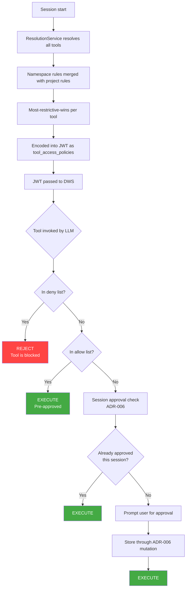
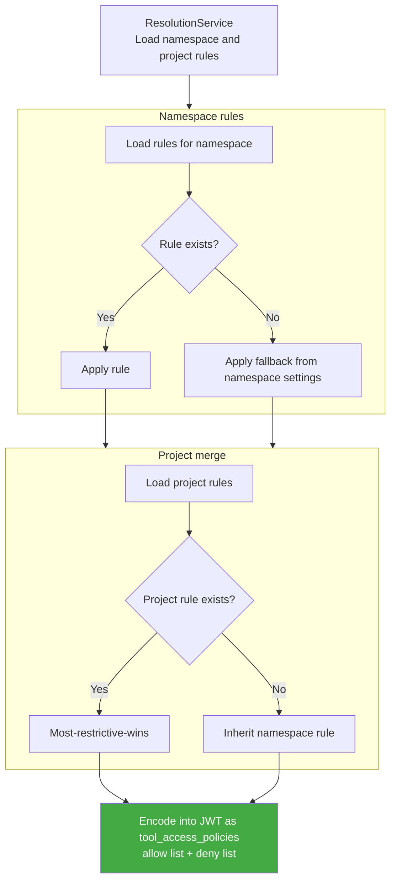



## エグゼクティブサマリー {#executive-summary}

このドキュメントは、GitLab の AI ツールルールエンジンのアーキテクチャを定義します。これは、[ADR-006: ツール承認システム](006_tool_approval.md)で確立したセッションレベルのツール承認システムの上に位置する、永続的かつ階層的なポリシー層です。

**ADR-006（実装済み）**が答えるのは、*「このユーザーは、このセッションで、このツールと引数のまったく同じ組み合わせをすでに承認しているか？」*という問いです。承認を SHA256 ハッシュ化してワークフローの JSONB 列に保存し、そのスコープは単一のセッションです。

**このドキュメント（009）**が答えるのは、*「そもそもこのツールは許可されているか、人間の確認が必要か？」*という問いです。永続的な `ai_tool_rules` テーブルを導入し、ポリシーが組織/グループからプロジェクトとユーザーのスコープまで階層的に適用され、セッションをまたいで保持されるようにします。

このシステムでは、2 つの関心事を独立した軸として扱います。

- **軸 1 — アクセス制御**（`web_access` / `local_access`）: ツールがそもそも許可されているか、人間の確認が必要かを決定します。値は `allow`、`ask`、`deny` です。いずれかの祖先レベルで `deny` が設定されると、すべての子孫でそのツールを完全にブロックし、上書きはできません。
- **軸 2 — 利用環境**: ルールを利用環境（`web` または `local`）ごとに適用し、Web ベースと IDE ベースの呼び出しに異なるポリシーを設定できるようにします。

| シグナル | 階層への適用方向 | 上書き可能か？ |
| :--- | :--- | :--- |
| `deny` | 上位から下位 | いいえ |
| `ask` | 上位から下位 | いいえ |
| `allow` | 継承しない | 明示的なルールが必要 |

---

## 1. 問題の定義 {#1-problem-statement}

- **現状:** 2 つのシステムがあります。ADR-006 はセッションをスコープとした承認の永続化を提供し、ユーザーがツールと引数の組み合わせを承認すると、そのワークフローセッション中は再度確認されません。[MR !230300](https://gitlab.com/gitlab-org/gitlab/-/merge_requests/230300)は、インスタンス/グループ/サブグループ/プロジェクトのレベルで階層的に適用される 3 状態の機能トグル（`default_on`/`default_off`/`never_on`）を追加し、管理者がツール承認を有効にするかどうかを大まかに制御できるようにします。しかし、どちらのシステムも、ツールごとのポリシー、ユーザーレベルの事前承認、アクセス制御（特定のツールの完全なブロック）をサポートしていません。
- **望ましい状態:** ポリシーが組織/グループのレベルから、プロジェクトと個々のユーザーの両方へ階層的に適用される、永続的なツールごとのルールエンジンです。MR !230300 の機能レベルのトグル（主スイッチを制御）と ADR-006 のセッション承認（セッション内のキャッシュを提供）を基盤に、ツール単位の細かな制御と利用環境を考慮したガバナンスモデルを追加します。
- **中心的な目標:** ツールガバナンスの基盤となるエントリーポイントとして、堅牢な GraphQL エンドポイント群を確立します。この基盤は、最終的にはエンタープライズ規模で拡張されたガバナンスとコンプライアンスの要件をサポートします。

---

## 2. 既存システムとの統合 {#2-integration-with-existing-systems}

このシステムは、既存のツール承認基盤を置き換えるのではなく、それと組み合わせて動作します。3 つの層が異なる抽象化レベルで動作します。

| 層 | システム | 役割 | 永続性 | スコープ |
| :--- | :--- | :--- | :--- | :--- |
| **機能トグル** | 階層的に適用される `tool_approval_for_session` 設定（[MR !230300](https://gitlab.com/gitlab-org/gitlab/-/merge_requests/230300)） | 主スイッチ: このスコープでツール承認システムが有効か？ | 永続的（`cascading_attr` を通じた設定テーブル） | インスタンス/グループ/サブグループ/プロジェクト |
| **ツールごとのガバナンス** | **009（本ドキュメント）** — ガバナンスルール | ポリシーの上限: *この特定のツール*は許可されているか？承認が必要か？ | 永続的（専用 DB テーブル） | 組織/グループ/プロジェクト/ユーザーの階層 |
| **セッションキャッシュ** | **006** — セッション承認 | ランタイムキャッシュ: ユーザーはこのセッションでこのツールと引数をすでに承認しているか？ | セッションスコープ（ワークフローの JSONB） | 単一のワークフローセッション |

### 2.1 機能レベルのトグル（既存） {#21-feature-level-toggle-existing}

階層的に適用される `tool_approval_for_session` 設定は、インスタンス/グループ/サブグループ/プロジェクトのレベルで 3 状態の機能トグルを提供します。

| 状態 | 意味 | 階層への適用動作 |
| :--- | :--- | :--- |
| `default_on` | ツール承認が有効 — ツールはデフォルトで承認が必要 | 子孫で上書き可能 |
| `default_off` | ツール承認が無効 — ツールはデフォルトで自由に実行 | 子孫で上書き可能 |
| `never_on` | ツール承認をオフに固定 — どの子孫も承認要件を無効化できない | 上書き不可（`cascading_attr` のロックを使用） |

この設定は GitLab の既存の `cascading_attr` 基盤を使用し、ガバナンスシステム全体の**主スイッチ**として動作します。`default_off` の場合も、ツールごとのガバナンスルール（本ドキュメント）が存在すれば適用します。機能トグルが制御するのは、ツールごとのルールに一致しない場合の*デフォルトの動作*であり、ルールエンジンを参照するかどうかではありません。

### 2.2 組み合わせたランタイムフロー {#22-composed-runtime-flow}

ワークフローセッションの開始時に、Rails は `ResolutionService` を通じてすべてのツールガバナンスの判断を事前に確定します。確定した許可/拒否リストを、署名付き JWT に `tool_access_policies` としてエンコードし、そのセッションの期間にわたり DWS に渡します。DWS は、LLM にツールを提示する前に、JWT から許可/拒否リストを読み取ります。



**組み合わせにおける主要なルール:**

1. ガバナンスの解決処理はセッション開始時に 1 回実行し、拒否ルールはセッション開始前に評価します。拒否されたツールが LLM に届くことはありません。
1. `deny` ルールは、すべての子孫でツールを完全にブロックし、上書きはできません。
1. `ask` ルールは、呼び出し時に ADR-006 のセッション承認フローを通じて人間の確認を要求します。
1. `allow` ルールはツールを事前承認し、確認を不要にします。
1. ルールが存在しない場合のフォールバックは、名前空間の `tool_approval_for_session` 設定によって決まります。
1. グループレベルの単一のルールは、そのグループ内のすべてのプロジェクトに適用されます。組織全体のポリシーにはトップレベルグループのルールで十分です。プロジェクトごとのルールは上書き用であり、通常のケースではありません。

### 2.3 セッション承認と引数の一致判定 {#23-session-approvals-and-argument-matching}

ADR-006 は、セッション承認をツールと引数の組み合わせの SHA256 ハッシュとして保存します。これは設計上、完全一致の仕組みであり、「ユーザーは*まさにこの*呼び出しを承認したか？」に答えます。SHA256 ハッシュは、本質的に glob/正規表現によるパターンマッチングとは両立しません。

v1 では、これは問題になりません。ガバナンスルール（本ドキュメント）とセッション承認（ADR-006）の両方が完全一致を使用します。v2 でガバナンスルールに glob/正規表現による一致判定を導入する際には、セッション承認層も独自に進化する必要があります。おそらく、ハッシュによる検索からパターンを考慮した比較へ移行します。その変更は ADR-006 のストレージモデルの範囲であり、ここで定義するガバナンスルール API には影響しません。

### 2.4 ケイパビリティのネゴシエーション {#24-capability-negotiation}

ADR-006 のケイパビリティのネゴシエーション（`/direct_access` を通じた `tool_call_approval`）は変更しません。ガバナンスルールシステムは、ネゴシエーション対象の新しいケイパビリティを追加しません。既存の承認フローの前に、サーバー側で事前チェックとして動作します。`tool_call_approval` ケイパビリティは、引き続き階層的に適用される `tool_approval_for_session` 設定に基づいてフィルタリングされます。

---

## 3. ガバナンスのロジック {#3-governance-logic}

システムは、利用環境を考慮した `allow`、`ask`、`deny` の 3 状態モデルで動作します。ルールを利用環境（`web_access`、`local_access`）ごとに保存し、Web ベースと IDE ベースの呼び出しに異なるポリシーを設定できるようにします。

### 3.1 適用の階層 {#31-hierarchy-of-enforcement}

解決処理では、名前空間とプロジェクトの階層全体で、最も制限の厳しいものを優先します。

- いずれかの祖先レベルで `deny` が設定されると、すべての子孫で直ちにツールをブロックします。上書きはできません。
- プロジェクトのルールは名前空間のルールより厳しくすることしかできず、名前空間のポリシーを緩めることはできません。
- ルールが存在しない場合、フォールバックは名前空間の `tool_approval_for_session_availability` 設定によって決まります。`default_off` は `allow` に、`default_on` は `ask` にフォールバックします。



### 3.2 権限の階層と UI の状態 {#32-authority-tiers--ui-states}

UI は、利用環境ごとに各ツールの現在の状態を反映します。

#### アクセスの強制制御（上書き不可の階層適用） {#access-mandates-hard-cascade}

いずれかの祖先レベルに `deny` ルールが存在すると、すべての子孫でツールを完全にブロックします。

- **動作:** ツールにアクセスできません。ローカルでの上書きはできません。
- **UI の状態:** トグルは**ロック/無効化**され、*「[グループ名] によりブロック」*と表示されます。

#### 承認が必要 {#approval-required}

ルールが `ask` に設定されている場合、ツールの実行前に人間の確認が必要です。

- **動作:** ツールは利用可能ですが、呼び出すたびに承認が必要です（ADR-006 のセッションキャッシュが適用されます）。
- **UI の状態:** トグルは**確認**を表示し、祖先スコープで設定された場合はロックされることがあります。

#### 自動承認 {#auto-approve}

ルールが `allow` に設定されている場合、ツールは確認なしで実行します。

- **動作:** そのセッションではツールが事前承認されています。
- **UI の状態:** トグルは**許可**を表示します。

### 3.3 解決マトリックス {#33-resolution-matrix}

| 名前空間のルール | プロジェクトのルール | 実効ルール |
| :--- | :--- | :--- |
| `deny` | 任意 | `deny` |
| `ask` | `deny` | `deny` |
| `ask` | `allow` | `ask`（プロジェクトでは緩和不可） |
| `ask` | `ask` | `ask` |
| `allow` | `deny` | `deny` |
| `allow` | `ask` | `ask` |
| `allow` | `allow` | `allow` |
| なし | `deny` | `deny` |
| なし | `ask` | `ask` |
| なし | `allow` | `allow` |
| なし | なし | 名前空間の設定からのフォールバック |

---

## 4. API 設計と統合 {#4-api-design--integration}

### 4.1 GraphQL ミューテーション {#41-graphql-mutations}

```graphql
mutation UpdateAiToolRule($input: UpdateAiToolRuleInput!) {
  updateAiToolRule(input: $input) {
    toolRule {
      id
      name
      webAccess
      localAccess
      actionType
      category
      source
    }
    errors
  }
}
```

**UpdateAiToolRule**
名前空間のオーナーが、特定のツールのガバナンスルールを定義または更新できるようにします。`fullPath`（名前空間）、任意の `projectPath`（プロジェクトをスコープとするルール用）、`toolId`、`webAccess`、`localAccess` を受け付けます。書き込み時にツール名をレジストリに照らして検証します。プロジェクトをスコープとするルールは、名前空間のルールより厳しくすることしかできず、緩和は許可しません。

### 4.2 GraphQL クエリ {#42-graphql-queries}

```graphql
query {
  aiToolRules(fullPath: "my-group", projectPath: "my-group/my-project") {
    nodes {
      id
      name
      webAccess
      localAccess
      actionType
      category
      source
    }
  }
}
```

**aiToolRules**
名前空間とプロジェクトのルール全体で最も制限の厳しいものを優先し、レジストリ内のすべてのツールについて、統合した実効ルールを返します。`projectPath` を指定すると、名前空間のルールにプロジェクトレベルのルールを統合します。明示的なルールがないツールには、名前空間の `tool_approval_for_session_availability` 設定から導出したフォールバック値を返します。任意のフィルター引数として `search`、`actionType`、`category`、`source` と、それらの否定形をサポートします。

### 4.3 認可モデル {#43-authorization-model}

- **名前空間のルール:** Owner ロールが必要です（読み取り + 書き込み）。
- **プロジェクトのルール:** 親の名前空間の Owner である必要があります。プロジェクトレベルのルールは厳しくすることしかできないため、名前空間のポリシーを緩めることはありません。
- **ユーザーのルール:** GA 後に延期します。v2 のドキュメントを参照してください。

---

## 5. データモデル {#5-data-model}

### 5.1 データベーススキーマ {#51-database-schema}

```ruby
create_table :ai_tool_rules do |t|
  t.references :namespace, null: false, foreign_key: { on_delete: :cascade }
  t.references :project, null: true, foreign_key: { on_delete: :cascade }
  t.string :tool_name, null: false
  t.integer :web_access, limit: 2      # 0: allow, 1: ask, 2: deny
  t.integer :local_access, limit: 2    # 0: allow, 1: ask, 2: deny
  t.string :tool_source
  t.jsonb :tool_arguments
  t.timestamps_with_timezone

  t.check_constraint "(web_access IS NOT NULL OR local_access IS NOT NULL)",
    name: "chk_ai_tool_rules_has_permission"
end

add_index :ai_tool_rules,
  [:namespace_id, :project_id, :tool_name],
  unique: true,
  nulls_not_distinct: true,
  name: "idx_ai_tool_rules_ns_proj_tool_unique"

add_index :ai_tool_rules, :project_id,
  name: "index_ai_tool_rules_on_project_id"
```

**namespace_id は常に必須です。** `project_id` は、`namespace_id` と同列の代替ではなく、追加のスコープ制約です。プロジェクトのルールとは、名前空間の代わりにプロジェクトが所有するルールではなく、特定のプロジェクトへさらにスコープを絞った名前空間のルールです。これによりデータの整合性を強化し（両列に外部キーを設定）、ポリモーフィック関連のパターンを避けます。

複合ユニークインデックスの **`NULLS NOT DISTINCT`** は、一意性の判定で `NULL` の `project_id` 値を等しいものとして扱います。これにより、ツールごとの名前空間レベルのルールは最大 1 件、ツールとプロジェクトの組み合わせごとのプロジェクトレベルのルールも最大 1 件に制限します。

**ON DELETE CASCADE:** 名前空間またはプロジェクトが削除されると、関連するすべてのガバナンスルールを自動的に削除します。

### 5.2 スキーマの構造 {#52-schema-structure}

- **namespace_id**: 常に非 null です。すべてのルールのルートとなる所有者です。
- **project_id**: null を許容します。指定されている場合、ルールのスコープを名前空間内の特定のプロジェクトに限定します。
- **web_access**: SmallInt 列挙型です。Web とアンビエントの利用環境の権限です。`0` = 許可、`1` = 確認、`2` = 拒否です。
- **local_access**: SmallInt 列挙型です。ローカル/IDE の利用環境の権限です。`web_access` と同じ値を使用します。
- **tool_name**: 書き込み時にツールレジストリに照らして検証する文字列の識別子です。
- **tool_source**: 文字列です。組み込みツールには `gitlab`、外部 MCP ツールには `mcp` を使用します。
- **tool_arguments**: JSONB です。将来の引数レベルの一致判定用に予約しています。現在は解決処理で使用しません。

---

## 6. パフォーマンス {#6-performance}

**事前の解決処理:** ガバナンスの判断は、呼び出しごとではなくセッション開始時に 1 回確定します。確定した許可/拒否リストを署名付き JWT にエンコードして DWS に渡すことで、呼び出しごとのレイテンシーをなくし、判断のキャッシュや Redis pub/sub による無効化を不要にします。ルールの変更は、次のセッションの開始時に有効になります。

**クエリの効率:** 解決処理では、名前空間のルールとプロジェクトのルールについてそれぞれ 1 回、計 2 回のクエリを実行し、メモリ内で統合します。現在のツールレジストリとルールテーブルの規模では、これで効率的です。より深いグループ階層や大規模なルール集合では、GitLab の `traversal_ids`（名前空間のマテリアライズドパス）を使用して、単一のクエリですべてのルールを取得できます。この最適化は、本番データで必要性が示されるまで延期します。

**監査証跡:** ツールルールの作成または更新時に監査イベントを発行し、コンプライアンスチームにポリシー変更の証跡を提供します。ツール呼び出しの監査イベントは ADR-006 が扱います。

---

## 7. セキュリティと整合性 {#7-security--integrity}

- **JWT 署名:** ガバナンスの判断を署名付き JWT にエンコードします。DWS は許可/拒否リストを読み取る前に JWT の署名を検証し、通信中のなりすましや改ざんを防ぎます。
- **フェイルクローズポリシー:** 解決処理が失敗した場合、システムは `DEFAULT_PRIVILEGES` にフォールバックします。これは、利用可能なすべての権限グループ（`READ_WRITE_FILES`、`READ_ONLY_GITLAB`、`READ_WRITE_GITLAB`、`RUN_COMMANDS`、`USE_GIT`、`RUN_MCP_TOOLS`）を含む定義済みの集合です。これにより、すべてのツールへのアクセスを許可しますが、事前承認は行いません。そのため、すべてのツール呼び出しで、ADR-006 のセッション承認フローを通じたユーザー確認が必要になります。これはアクセスに関してはフェイルオープン、自律性に関してはフェイルクローズです。ツールは利用可能ですが、自動承認されるものはありません。
- **拒否されたツールの除外:** DWS が LLM にツールを提示する前に、拒否されたツールをツールセットから除外します。モデルは使用できないツールを見ることがないため、ハルシネーションのリスクを減らし、ブロックされたツールを呼び出そうとすることを防ぎます。

---

## 8. v2 とその先 {#8-v2-and-beyond}

延期されたケイパビリティは、以前は関連する「v2: 延期されたケイパビリティ」ドキュメントで追跡していましたが、そのドキュメントは廃止済みです（決定ではなくバックログを記録しており、ADR の形式に合わないためです）。各延期項目の扱いについては [ADR-010 §7](010_auto_mode_phased_rollout.md)を参照してください。ユーザーレベルの自動承認へのオプトインは、ADR-010 の委任設定で提供します。glob/正規表現による引数の一致判定、その GIN インデックス、具体性に基づく優先順位は、ADR-010 における将来の引数レベルのガバナンス上限として引き継ぎます。残りのガバナンスエンジンのバックログ（監査のみのモード、コンプライアンスのプリセット、プロンプトレベルでの拒否されたツールの除外、インスタンスレベルのルール、traversal-ID クエリの最適化）は、追跡用の Issue に移す予定です。
