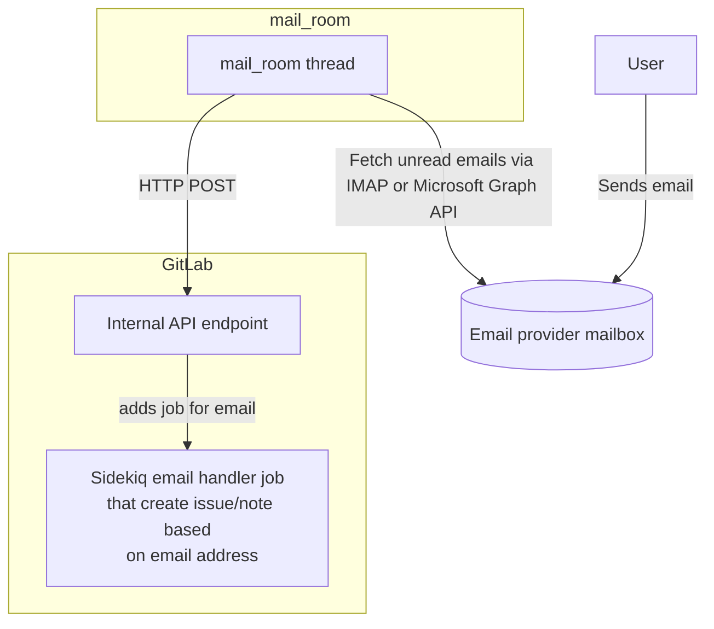
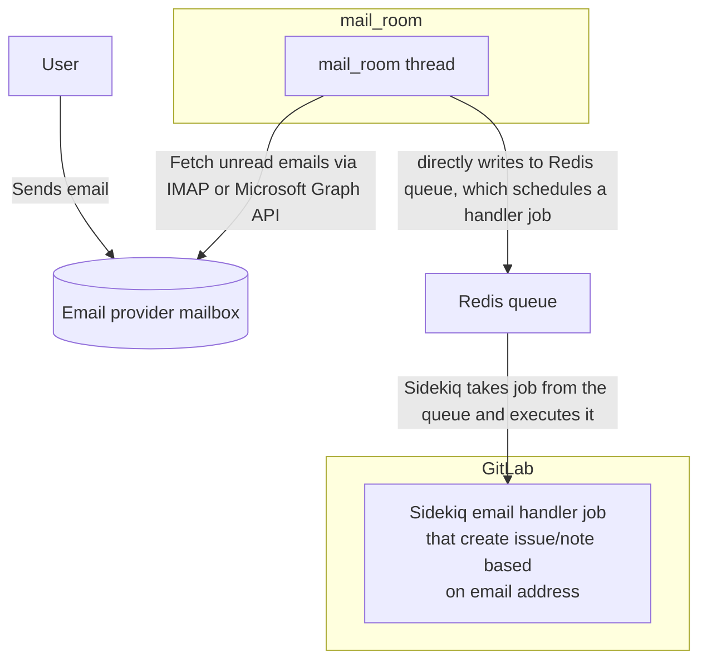
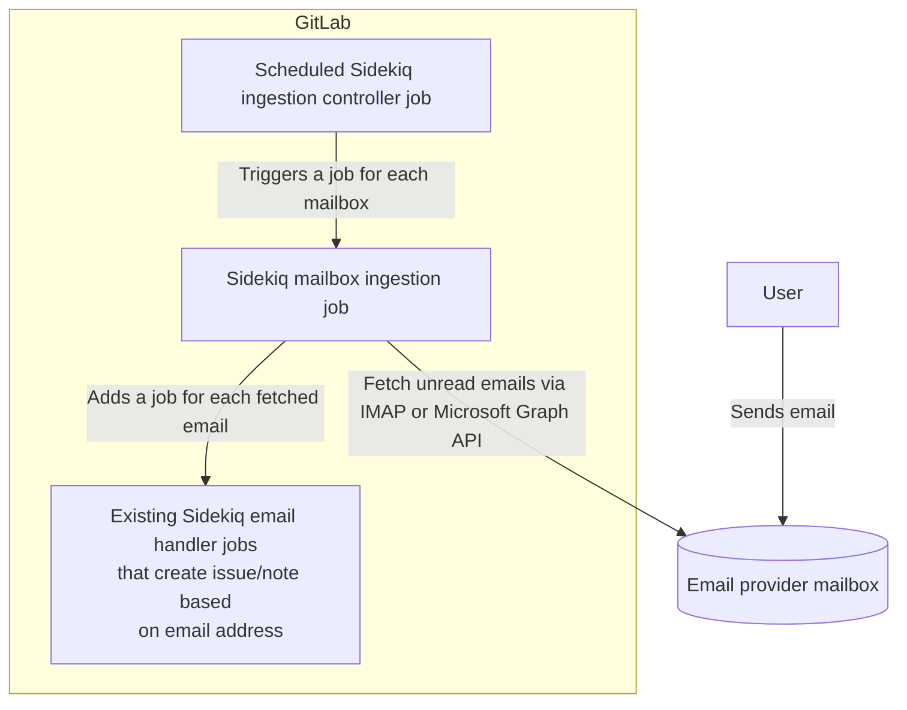

<!-- vale gitlab.CurrentStatus = NO -->

このページには今後予定されている製品・機能・機能性に関する情報が含まれています。ここに示す情報は参考目的のみです。購入・計画の決定にこの情報を使用しないでください。製品・機能・機能性の開発、リリース、タイミングは変更または延期される可能性があり、GitLab Inc. の独自の判断に委ねられています。

<table class="w-full text-sm border-collapse">
<thead>
<tr class="bg-gray-100 text-left">
<th class="px-3 py-2 border border-gray-300">Status</th>
<th class="px-3 py-2 border border-gray-300">Authors</th>
<th class="px-3 py-2 border border-gray-300">Coach</th>
<th class="px-3 py-2 border border-gray-300">DRIs</th>
<th class="px-3 py-2 border border-gray-300">Owning Stage</th>
<th class="px-3 py-2 border border-gray-300">Created</th>
</tr>
</thead>
<tbody>
<tr>
<td class="px-3 py-2 border border-gray-300">proposed</td>
<td class="px-3 py-2 border border-gray-300"><a href="https://gitlab.com/msaleiko" class="text-blue-600 hover:underline">@msaleiko</a></td>
<td class="px-3 py-2 border border-gray-300"><a href="https://gitlab.com/stanhu" class="text-blue-600 hover:underline">@stanhu</a></td>
<td class="px-3 py-2 border border-gray-300"></td>
<td class="px-3 py-2 border border-gray-300">devops::plan</td>
<td class="px-3 py-2 border border-gray-300">2023-06-05</td>
</tr>
</tbody>
</table>

## サマリー

GitLab ユーザーはメールで新しい Issue やコメントを送信できます。管理者は GitLab が定期的にポーリングして未読メールを取得する専用メールボックスを設定します。メールアドレスのサブアドレス部分のスラグとハッシュに基づいて、このメールが Issue を作成するのか、Service Desk Issue を追加するのか、または既存 Issue へのコメントを追加するのかを判定します。

現在、メールは `mail_room` と呼ばれる別プロセスによって取り込まれています。私たちは `mail_room` によるメール取り込みを廃止し、代わりにスケジュール済み Sidekiq ジョブを使用して GitLab 内で直接取り込む方式に移行したいと考えています。

これは [Service Desk 向けカスタムメールアドレス取り込み](https://gitlab.com/gitlab-org/gitlab/-/issues/329990) の基盤を構築し、詳細なヘルスロギングを可能にし、他のサービスプロバイダーアダプター（たとえば Gmail API 経由など）の統合を容易にするものです。また、セルフマネージドの顧客のインフラセットアップと保守コストを削減し、チームメンバーが GDK でメール取り込みを扱いやすくします。

## 用語集

- メール取り込み（Email ingestion）: IMAP または API を介してメールボックスからメールを読み取り、処理のために転送すること（例: Issue の作成やコメントの追加）
- サブアドレス（Sub-addressing）: メールアドレスはローカル部（`@` の前すべて）とドメイン部で構成されます。メールサブアドレスでは、ローカル部に `+` 記号に続く任意のテキストを追加することで、メールアドレスのユニークなバリエーションを作成できます。これらのサブアドレスはフィルタリング、分類、区別に使用でき、これらすべてのメールは同じメールボックスに配信されます。たとえば `user+subaddress@example.com` や `user+1@example.com` は `user@example.com` のサブアドレスです。
- `mail_room`: 設定された各メールボックスに対して新しいプロセスを生成し、定期的に新しいメールを読み取り、処理ユニットに転送する [実行スクリプト](https://gitlab.com/gitlab-org/ruby/gems/gitlab-mail_room)。
- [`incoming_email`](https://docs.gitlab.com/ee/administration/incoming_email.html): メールで Issue やコメントを追加するために使用するメールアドレス。GitLab の Issue コメント通知に返信すると、その返信メールは設定された `incoming_email` メールボックスに届き、`mail_room` で読み取られ GitLab によって処理されます。このアドレスを Service Desk メールアドレスとして使用することもできます。設定はインスタンスごとで、メールボックスへのアクセスに IMAP または Microsoft Graph API の完全な認証情報が必要です。
- [`service_desk_email`](https://docs.gitlab.com/ee/user/project/service_desk/configure.html#use-an-additional-service-desk-alias-email): Service Desk のみに使用される追加のエイリアスメールアドレス。Service Desk Issue を作成するために `incoming_email` から生成されたアドレスを使用することもできます。
- `delivery_method`: 管理者は `mail_room` が取得したメールを GitLab に転送する方法を定義できます。レガシーで現在は非推奨のアプローチは `sidekiq` と呼ばれ、Redis キューに直接新しいジョブを追加します。現在の推奨方式は `webhook` と呼ばれ、GitLab 内部 API エンドポイントに POST リクエストを送信します。このエンドポイントがジョブデータの圧縮などの完全なフレームワークを使用して新しいジョブを追加します。欠点は、`mail_room` と GitLab が共有キーファイルを必要とすることで、大規模なセットアップでの配布が困難な場合があります。

## 動機

現在の実装はスケーラビリティを欠いており、大幅なインフラ保守を必要とします。さらに、[設定エラーの適切な可観測性](https://gitlab.com/gitlab-org/gitlab/-/issues/384530) や [システム全体のヘルス](https://gitlab.com/groups/gitlab-org/-/epics/9407) が不足しています。さらに、[マルチノード Linux パッケージ（Omnibus）インストールのセットアップとサポート提供](https://gitlab.com/gitlab-org/gitlab/-/issues/391859) は困難であり、定期的なメール取り込みの問題がリアクティブなサポートを必要としています。

私たちは `mail_room` gem のフォーク（[`gitlab-mail_room`](https://gitlab.com/gitlab-org/ruby/gems/gitlab-mail_room)）を使用しており、これはアップストリームに移植されない GitLab 固有の機能を含んでいるため、顕著な保守オーバーヘッドがあります。

Service Desk シングル・エンジニア・グループ（SEG）は [Service Desk 向けカスタマイズ可能なメールアドレス](https://gitlab.com/gitlab-org/gitlab/-/issues/329990) の作業を開始し、[`16.4` でベータの初回イテレーションをリリース](https://about.gitlab.com/releases/2023/09/22/gitlab-16-4-released/#custom-email-address-for-service-desk) しました。[MVC として `Forwarding & SMTP` モード](https://gitlab.com/gitlab-org/gitlab/-/issues/329990#note_1201344150) を導入し、管理者はカスタムメールアドレスからプロジェクトの `incoming_mail` メールアドレスへのメール転送を設定します。また SMTP 認証情報を提供することで、GitLab がカスタムメールアドレスから代理でメールを送信できるようにします。このアプローチには既存のメカニクス以外の追加メール取り込みは必要ありません。

第2イテレーションとして、Service Desk 向けカスタムメールアドレスの Microsoft Graph サポートも追加したいと考えています。そのため、システムで定義された2つ以上のアドレスを取り込む方法が必要です。Microsoft Graph サポートのソリューションパスとして、特権ユーザーがカスタムメールアカウントを接続し、[Microsoft Graph webhook（`Outlook message`）経由でメッセージを受信](https://learn.microsoft.com/en-us/graph/change-notifications-overview#supported-resources) できる方式を検討します。GitLab はメール更新を受信するためのパブリックエンドポイントが必要になります。これはセルフマネージドインスタンスでは機能しない可能性があるため、Microsoft の顧客向けの直接メール取り込みも必要になります。しかし webhook アプローチは、数千のメールボックスをポーリングする可能性がある GitLab SaaS のパフォーマンスと効率を改善できます。

### 目標

このイニシアチブの目標は、メール取り込みのスケーラビリティを向上させ、インフラを大幅にスリム化することです。

1. この統合により、別プロセスのセットアップが不要になり、将来のイニシアチブへの道が開かれます。これには直接カスタムメールアドレス取り込み（IMAP および Microsoft Graph）、[改善されたヘルスモニタリング](https://gitlab.com/groups/gitlab-org/-/epics/9407)、[データ保持（オリジナルの保存）](https://gitlab.com/groups/gitlab-org/-/epics/10521)、および[メールサイズ制限内の添付ファイル処理の強化](https://gitlab.com/gitlab-org/gitlab/-/issues/406668) が含まれます。
1. チームメンバーがメール取り込みを使った機能開発を容易にします。[現在は複数の手動ステップが必要です。](https://gitlab.com/gitlab-org/gitlab-development-kit/-/blob/main/doc/howto/service_desk_mail_room.md)

### 対象外（Non-Goals）

このブループリントは、リストされた将来のすべてのイニシアチブの実装詳細を提示することを目的としていません。しかし、今後の機能（カスタマイズ可能な Service Desk メールアドレス IMAP / Microsoft Graph、ヘルスチェックなど）の基盤となります。

その他の取り込み方式は含めません。現在のセット（`incoming_email` と `service_desk_email` の IMAP および Microsoft Graph API）の提供に集中します。

## 現在の設定

管理者は `gitlab.rb` 設定ファイルでメールボックスの設定（認証情報と配信方法）（[`incoming_email`](https://docs.gitlab.com/ee/administration/incoming_email.html) と [`service_desk_email`](https://docs.gitlab.com/ee/user/project/service_desk/configure.html#use-an-additional-service-desk-alias-email)）を行います。設定変更のたびに GitLab の再設定と再起動が必要です。

これらのメールボックスからメールを取り込むために、別プロセス `mail_room` を使用しています。`mail_room` は設定されたメールボックスごとにスレッドを生成し、毎分それらのメールボックスをポーリングします。待機中はスレッドがアイドル状態になります。`mail_room` は `gitlab.rb` の設定から生成された設定ファイルを読み取ります。

`mail_room` は IMAP と Microsoft Graph 経由で接続し、未読メールを取得し、それらを既読または削除済みとしてマークします（設定に基づく）。メールを受け取り、2つの配信方法のいずれかを介して宛先に配信します。

### `webhook` 配信方法（推奨）

`webhook` 配信方法は、`mail_room` から GitLab に取り込まれたメールを移動するための推奨方式です。`mail_room` はメール本文とメタデータを内部 API エンドポイント `/api/v4/internal/mail_room` に POST し、エンドポイントが正しいハンドラーワーカーを選択して実行をスケジュールします。

### `sidekiq` 配信方法（16.0 以降非推奨）

`sidekiq` 配信方法は、Sidekiq がジョブ管理に使用する Redis キューにメール本文とメタデータを直接追加します。配信方法と Redis 設定の間に強い結合があるため、[16.0 で非推奨](https://docs.gitlab.com/ee/update/deprecations.html#sidekiq-delivery-method-for-incoming_email-and-service_desk_email-is-deprecated) になっています。また、ジョブペイロード圧縮などの Sidekiq フレームワーク最適化を使用できません。

## 提案

**Sidekiq ジョブを使用してメールボックスを定期的（毎分、将来的には設定可能）にポーリングします。その他すべてのレガシーメール取り込みインフラを削除します。**

1. 毎分または2分ごとにスケジュールされる `controller` ジョブを使用します。このジョブは設定済みの各メールボックス（`incoming_email` と `service_desk_email`）に対して1つのジョブを追加します。
1. 具体的な `ingestion` ジョブはメールボックス（IMAP または Microsoft Graph）をポーリングし、未読メールをダウンロードし、各メールを処理するジョブを1つ追加します。使用された `To` メールアドレスに基づいて、どのメールハンドラーを使用すべきかを決定します。
1. `既存のメールハンドラー` ジョブは、既存 Issue / マージリクエストに Issue、Service Desk Issue、またはノートを作成しようとします。これらのハンドラーは `mail_room` を介したレガシーメール取り込みでも使用されます。

### Sidekiq ジョブとジョブペイロードサイズの最適化

Sidekiq ジョブにサイズ制限を設けており、メールジョブペイロード（特に添付ファイル付きメール）はその制限を超える可能性があります。メール処理を Sidekiq メールボックス取り込みジョブ内で直接処理するアイデアを実験すべきです。このモードと各メールに対する Sidekiq ジョブを切り替えるために `ops` フィーチャーフラグを使用できます。

メッセージ ID のみを取得して、その後の子ジョブでメッセージ全体をダウンロードする（たとえば `UID` 範囲でフィルタリング）ソリューションパスも検討したいと考えています。たとえば、メールボックスをポーリングしてメッセージ ID のリストを取得し、次に 25 件（または n 件）ごとに新しいジョブを作成してメッセージ ID または範囲を引数として渡します。これらのジョブはその後メッセージ全体をダウンロードし、同期的に Issue または返信を追加します。メール数が 25 件未満の場合、リソースを節約するために現在のジョブで直接メールを処理することもできます。これにより、メールサイズの制限要因としてジョブペイロードサイズを排除できます。欠点は、IMAP サーバーへの呼び出しが1回ではなく2回（n+1）必要になることです。

## 実行計画

1. `mail_room` メール取り込みの非推奨警告を追加します。
1. [`gitlab-mail_room` gem](https://gitlab.com/gitlab-org/ruby/gems/gitlab-mail_room) から接続固有のロジックを新しい別の gem に分離します。`mail_room` やその他のクライアントはここでの作業を利用できます。現在、IMAP と Microsoft Graph API 接続をサポートしています。
1. 新しいジョブを追加します（Sidekiq が停止している場合に大量のジョブバックログが発生しないよう、冪等性と重複排除フラグを設定します）。
1. GitLab 内で Sidekiq ジョブによるメール取り込みを有効にする設定（`gitlab.rb`）を追加します。`mail_room` メール取り込みを無効にするには `gitlab.rb` で `mailroom['enabled'] = false` を設定する必要があります。フィーチャーフラグを追加することも検討します。
1. 一般公開前に `gitlab.com` で使用しますが、セルフマネージドにも `beta` として試用を許可します。
1. 一般公開でロールアウトされ削除スケジュールが確定したら、`gitlab-mail_room` への依存を完全に削除し、内部 API エンドポイント `api/internal/mail_room`、`mail_room` 用の動的生成静的設定ファイル `mail_room.yml`、その他の設定とバイナリを削除します。

## 変更管理

[GitLab 16.0 で `mail_room` の `sidekiq` 配信方法を非推奨とし](https://docs.gitlab.com/ee/update/deprecations.html#sidekiq-delivery-method-for-incoming_email-and-service_desk_email-is-deprecated)、GitLab 18.0 での削除をスケジュールしました。このブループリントが実装され顧客が一般公開で新しいメール取り込みを使用できるようになった後でのみ、`sidekiq` 配信方法を削除できます。

その後、`mail_room` の削除をスケジュールする必要があります（GitLab 17.0 以降）。これは破壊的変更になります。セルフマネージドの顧客がアクションを取らなくてもいいよう、事前に新しいメール取り込みをデフォルトにすることも検討できます。

## 代替ソリューション

### 何もしない

現在の設定には限界があり、2つのメールアドレスしかフェッチできません。Service Desk カスタムメールアドレスを IMAP または API インテグレーションで公開するには、上記で説明したのと同じアーキテクチャを提供する必要があります。そのため、今すぐ行動し、まず `incoming_email` と `service_desk_email` の一般的なメール取り込みを含めてインフラのオーバーヘッドを削除すべきです。

## 追加リソース

- [このデザインドキュメントのメタ Issue](https://gitlab.com/gitlab-org/gitlab/-/issues/393157)

## タイムライン

- 2023-09-26: ブループリントの初版がマージされました。
