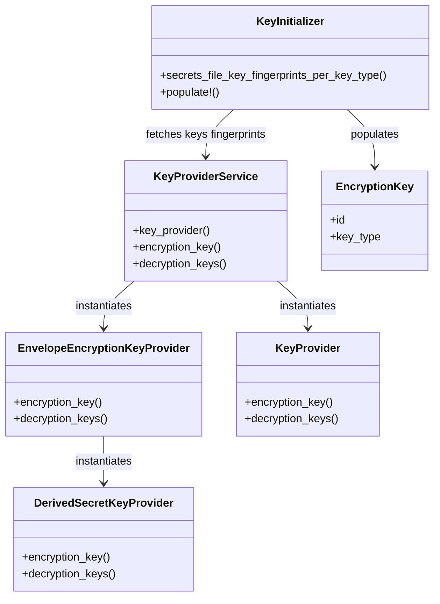

<div class="my-3 border-l-4 border-blue-500 bg-blue-50 px-4 py-3 rounded-r text-sm text-blue-800">
このページには今後予定されている製品・機能・機能性に関する情報が含まれています。ここに示す情報は参考目的のみです。購入・計画の決定にこの情報を使用しないでください。製品・機能・機能性の開発、リリース、タイミングは変更または延期される可能性があり、GitLab Inc. の独自の判断に委ねられています。
</div>

<div class="overflow-x-auto my-4">
<table class="w-full text-sm border-collapse">
<thead>
<tr class="bg-gray-100 text-left">
<th class="px-3 py-2 border border-gray-300">Status</th>
<th class="px-3 py-2 border border-gray-300">Authors</th>
<th class="px-3 py-2 border border-gray-300">Coach</th>
<th class="px-3 py-2 border border-gray-300">DRIs</th>
<th class="px-3 py-2 border border-gray-300">Owning Stage</th>
<th class="px-3 py-2 border border-gray-300">Created</th>
</tr>
</thead>
<tbody>
<tr>
<td class="px-3 py-2 border border-gray-300"><span class="inline-block rounded px-2 py-0.5 text-xs font-medium bg-gray-100 text-gray-700">rejected</span></td>
<td class="px-3 py-2 border border-gray-300"><a href="https://gitlab.com/rymai" class="text-blue-600 hover:underline">@rymai</a></td>
<td class="px-3 py-2 border border-gray-300"><a href="https://gitlab.com/andrewn" class="text-blue-600 hover:underline">@andrewn</a>, <a href="https://gitlab.com/grzesiek" class="text-blue-600 hover:underline">@grzesiek</a></td>
<td class="px-3 py-2 border border-gray-300"></td>
<td class="px-3 py-2 border border-gray-300"><span class="inline-block rounded px-2 py-0.5 text-xs font-medium bg-gray-100 text-gray-700">~devops::tenant scale</span></td>
<td class="px-3 py-2 border border-gray-300">2024-12-03</td>
</tr>
</tbody>
</table>
</div>


> [!warning] 計画から除外され、新しいブループリントに統合されました
>
> このブループリントは修正され、[ActiveRecord Encryption への移行](/handbook/engineering/architecture/design-documents/migrate_to_activerecord_encryption/) ブループリントに組み込まれました。（「Rejected」は利用可能な最も近いステータスです。「いくつかの修正を加えて拡張された」の方が実態に近いでしょう。）現在の計画についてはそちらのブループリントをご参照ください。

## はじめに

GitLab の暗号化キー（保存時の機密データを保護するために使用）を、システムのダウンタイムなしにローテーションできるソリューションが必要です。これは顧客と GitLab.com の両方にとって重大なセキュリティおよび運用リスクに対応するものです。提案するソリューションは、複数の同時キーのサポート、自動バックグラウンド再暗号化、およびマルチノードインストール向けに最適化されたデプロイワークフローによって、ゼロダウンタイムのキーローテーションを実現し、組織がサービスを中断することなくセキュリティのベストプラクティスを維持できるようにします。

## 目的

このデザインドキュメントは、GitLab の現在の暗号化キー管理システムの大きな不便さに対処します。現在、GitLab の暗号化キー（データベース内の保存時機密データを保護）は、システム全体をオフラインにしなければローテーションできません。この制限は重大なビジネスリスクをもたらします:

1. キーが侵害された場合、顧客はキーローテーション中にサービス停止に直面します
2. GitLab.com や大規模エンタープライズデプロイメントでは、必要なダウンタイムが定期的なキーローテーションを事実上不可能にします
3. GitLab の Dedicated および Cells インフラの拡大に伴い、キー侵害のリスクが高まり、複数インスタンスにわたるキー管理の運用複雑さも増大します
4. [Protocells では、すべてのセルが同じシークレットを使用](https://gitlab.com/groups/gitlab-org/-/epics/13166#proposal) するため、キー流出のリスクと影響がさらに高まります

提案するソリューションは以下によってゼロダウンタイムの暗号化キーローテーションを実現します:

- 複数の同時暗号化キーのサポート
- データの自動バックグラウンド再暗号化
- 新しい管理インターフェースによるキー使用状況とローテーション進捗の明確な可視性
- マルチノードインストール向けに最適化されたデプロイワークフロー

主要なビジネス上のメリット:

- セキュリティ上重要なキーローテーション中のサービス停止を排除
- 定期的なキーローテーションを要求するセキュリティポリシーへのコンプライアンスを可能化
- 特に Cells のコンテキストにおいて、マルチインスタンスデプロイメントの運用リスクを低減
- 特に Cells Org Mover 使用時の GitLab インスタンス間の安全なデータ移動の基盤を提供

実装はシステムの安定性を維持しながらこの機能を導入することに重点を置いた7つのイテレーションにわたって計画されています。このプロジェクトは GitLab のスケーリングイニシアチブとエンタープライズセキュリティ要件を直接支援します。

## 概要

**Rails モノリスにおいて:**

- データベースパフォーマンスの低下を避けるための自動スロットリングを備えた、常時稼働のバックグラウンドプロセスを導入します。GitLab がオンラインを維持しながら段階的な再暗号化を処理します。このプロセスはレガシー暗号化キーで暗号化されたデータを検索して再暗号化します。

**インフラオペレーター向け（セルフマネージド管理者、GitLab.com SRE、Dedicated SRE）:**

- データを暗号化するための前のキーを置き換える新しい暗号化キーを導入する機能を提供します。新しいキーおよびすべての以前のキーは復号化に使用されます。
- 新しい暗号化キーが最初にキー配列の先頭に追加される（最初は復号化のみに使用される）マルチノードインストール向けのデプロイワークフローを導入します。新しいキーがすべてのノードにデプロイされたら、キー配列の末尾に移動する必要があり、そこからの暗号化に使用されます。これは、インフラオペレーターが新しいキーを `config/secrets.yml` に追加して新しいデプロイを開始するシナリオで重要です。デプロイフェーズ中、一部のポッド/VM は新しいキーを持っていません。新しいポッド/VM がデプロイ完了前に新しいキーを使用して再暗号化を開始しないことが重要です。デプロイが正常に完了すると、すべてのポッド/VM が新しいキーを持ち、管理者はキーを配列の最後に移動して現在の暗号化キーにできます。

**インスタンス管理者向け（セルフマネージド管理者、GitLab.com SRE、Dedicated 顧客）:**

- キー、その状態と使用状況をリスト表示し、レガシーキーで暗号化されたデータの再暗号化の進捗を監視するための新しい管理ページを提供します。

### 対象外（Non-goals）

このブループリントは以下をカバーしません:

- GitLab がオフラインの間にすべてのデータを再暗号化するスクリプトの導入。顧客のユースケースとして存在する可能性はありますが、初期段階では実装しません。
- `secret_key_base`、`otp_key_base`、`openid_connect_signing_key`、`encrypted_settings_key_base` などの他のキーとシークレット。ただし、理想的には将来的に他のシークレットにも大きな変更なく適用できるほど汎用的なソリューションを説明すべきです。
- 管理 UI からの暗号化キーローテーションの可能性（これはランタイム時に `config/secrets.yml` への書き込みを必要とし、ほとんどのデプロイ戦略では不可能です）。
- 外部シークレットマネージャー（例: GCP および AWS KMS）からの暗号化キーのプル可能性。これは関連性が高くよりセキュアですが、専用の提案で解決すべきです。
- [エンベロープ暗号化を使用するかどうか](https://cloud.google.com/kms/docs/envelope-encryption) の決定。エンベロープ暗号化は多くのメリットがあり Active Record Encryption でネイティブサポートされていますが、使用するかどうかの決定はこの提案とは独立しており、専用の提案で解決すべきです。

### 前提条件

このアイデアは2つの前提条件に基づいています:

1. 複数の暗号化キーのサポート: これによりシークレットのオンラインローテーションが可能になります
1. 属性の暗号化に使用されたキーを知る能力: これによりレガシーキーで暗号化されたデータを再暗号化できます

### ローテーションワークフロー

1. キーをローテーションする必要がある場合、`config/secrets.yml` の `db_key_base` / `active_record_encryption_primary_key` / `active_record_encryption_deterministic_key` 配列の末尾に新しいキーを追加し、GitLab を再起動します。マルチノードインストールでは、新しいキーのデプロイは2フェーズで行う必要があります: まずキー配列の先頭にキーを追加してすべての場所にデプロイされるまで待機し、その後キーを配列の末尾に移動して新しいデプロイを開始します。
1. キー配列の末尾にデプロイされると、新しいキーが現在の暗号化キーになります。
1. 復号化プロセスはデータの暗号化に使用されたキーを使用します。暗号化キー ID が暗号化データと一緒に保存されていない場合、復号化プロセスは（キー配列の順序で）各キーを試し、データを復号化できるキーが見つかるまで続けます。そのため、すべてのデータを一括再暗号化するために GitLab を停止する必要がありません。
1. バックグラウンドプロセスが継続的に実行され、現在ではない暗号化キーで暗号化されたデータを再暗号化します。大規模なインスタンス（例: GitLab.com）では再暗号化プロセス全体に長い時間がかかる可能性がありますが、制限 / スロットリングメカニズムが整っている限り、データベースの安定性に影響を与えるべきではありません。バックグラウンドプロセスは、すべてのデータが現在の暗号化キーで再暗号化されると即座にノーオップになります。
1. 新しい専用管理ページで暗号化キーの使用状況を監視できます:
   - 各アクティブな暗号化 / 復号化キーで暗号化されているデータの割合は？
   - 現在の暗号化キーですべてが再暗号化されるまでの推定時間は？
   - `config/secrets.yml` から削除できるキーはどれか（このキーで暗号化されたデータはもうない）？

### 「暗号化キー」管理ページのモックアップ


## 決定事項

## 実装詳細

### キーの追跡

キーのライフサイクル情報は新しい `encryption_keys` テーブルに保存され、以下が含まれます:

- キータイプ `key_type`（enum）:
  - `db_key_base`
  - `db_key_base_32`
  - `db_key_base_truncated`
  - `active_record_encryption_primary_key`
  - `active_record_encryption_deterministic_key`
- キーフィンガープリント（4つの16進文字）（[Rails のコード](https://github.com/rails/rails/blob/v7.0.8.6/activerecord/lib/active_record/encryption/key.rb#L24) にインスパイアされた）
- キー作成時刻 `created_at`: `config/secrets.yml` に最初に現れた時刻
- キー削除時刻 `removed_at`: キーが `config/secrets.yml` から消えた時刻

この情報をデータベースで追跡することで以下の機能が提供されます:

- 現在の暗号化キーと復号化キーの確認
- 過去に使用されたキーの追跡

後に、別のテーブルでキー使用に関する統計も保持できます。

注意: データの暗号化 / 復号化に実際に使用されるキーは引き続き `config/secrets.yml` ファイルから取得されます。

#### 初期化中

初期化中、`config/secrets.yml` に新しいキーが検出された場合、以下の3つのステップが発生します:

1. 新しいキーのフィンガープリントが既存の未削除キーのフィンガープリントと衝突する場合、アプリケーションは起動を失敗させます。これは復号化時に復号化キーを選択する際にあいまいさをもたらすためです。その場合、キーを削除して別のキーに置き換える必要があります。実際に `config/secrets.yml` にキーが追加される前にこの衝突チェックを実行するための rake タスクが提供される予定です。
1. 新しいキーのレコードが `encryption_keys` テーブルに作成されます。
1. キーが `encryption_keys` に存在しても `config/secrets.yml` にない場合、レコードの `removed_at` が設定されます。キーがまだ使用中だった場合（定期的に計算する使用状況データに基づいて）、キーなしでアプリケーションが起動するのを防ぐためにエラーが発生します。

### 暗号化キーの選択

フレームワークに依存しない方法で暗号化 / 復号化キーの選択を抽象化するための `KeyProviderService` を導入します（レガシー暗号化フレームワークから Active Record Encryption への移行を容易にするため）。

### アーキテクチャ



### `attr_encrypted` に必要な変更

`attr_encrypted` gem は `key:` オプションにメソッド名を渡すことで動的キーをサポートします:

```ruby
attr_encrypted :email, key: :db_key_base_32
```

この機能を活用して、暗号化 / 復号化に使用されるキーを `Gitlab::Database::Encryption::KeyProviderService` から取得します。

PoC コードは <https://gitlab.com/gitlab-org/gitlab/-/merge_requests/177748/diffs?commit_id=828f2470e5d034e77b7c094952ff2d7676cf962f#5d31008bc68bfcfa3787a3338a808f53c51a6ad5> を参照してください。

### `TokenAuthenticatable` に必要な変更

変更は `attr_encrypted` に行うものと同様です。

PoC コードは <https://gitlab.com/gitlab-org/gitlab/-/merge_requests/177748/diffs?commit_id=828f2470e5d034e77b7c094952ff2d7676cf962f#a99cfc117c9fe8408818387e8197ef3186848efe> を参照してください。

### 「暗号化キー」管理ページの実装

PoC コードは <https://gitlab.com/gitlab-org/gitlab/-/merge_requests/177838/diffs?commit_id=a5cafd65bb706fd1ad2784d7a35592443f02980e> を参照してください。

### バックグラウンド再暗号化プロセス

以下はバックグラウンド再暗号化プロセスが大まかに行うことのナイーブな実装例です。

```ruby
# ActiveRecord::Encryption
def reencrypts_active_record_encryption(model, attributes, key_fingerprint)
  attributes.each do |attr|
    model.where("NOT (#{attr}->'h'->'i') ? :value", value: ::Base64.strict_encode64(key_fingerprint))
      .find_in_batches do |batch|
      batch.each do |record|
        record.encrypt # this forces the re-encryption of all encrypted attribute
      end
    end
  end
end

def reencrypts_legacy_encryption(model, attributes, encryption_key_id)
  model.where.not(encryption_key_id: encryption_key_id).find_in_batches do |batch|
    batch.each do |record|
      attributes.each do |attr|
        record.public_send(:"#{attr}=", record.public_send(attr))
      end
      record.save!
    end
  end
end

ApplicationRecord.descendants.select { |d| d.deterministic_encrypted_attributes.present? }.each do |model|
  reencrypts_active_record_encryption(
    model,
    model.deterministic_encrypted_attributes,
    Gitlab::Database::Encryption::KeyProviderService.new(:active_record_encryption_deterministic_key).encryption_key.id
  )
end

ApplicationRecord.descendants.select { |d| d.encrypted_attributes.present? }.each do |model|
  reencrypts_active_record_encryption(
    model,
    model.encrypted_attributes,
    Gitlab::Database::Encryption::KeyProviderService.new(:active_record_encryption_primary_key).encryption_key.id
  )
end

# TokenAuthenticatable
encryption_key = EncryptionKey.find_by_fingerprint(Gitlab::CryptoHelper.encryption_key.id)

ApplicationRecord.descendants.select { |d| d.include?(TokenAuthenticatable) && d.encrypted_token_authenticatable_fields.present? }.each do |model|
  encrypted_fields = model.encrypted_token_authenticatable_fields

  reencrypts_legacy_encryption(model, encrypted_fields, encryption_key.id)
end

# attr_encrypted
ApplicationRecord.descendants.select { |d| d.attr_encrypted_attributes.present? }.each do |model|
  encrypted_fields = model.attr_encrypted_attributes
  key_type = encrypted_fields[encrypted_fields.keys.first][:key]
  current_key_fingerprint = Gitlab::Database::Encryption::KeyProviderService.new(key_type).encryption_key.id

  reencrypts_legacy_encryption(model, encrypted_fields, EncryptionKey.find_by_fingerprint(current_key_fingerprint).id)
end
```

最終的な実装は [スロットリングメカニズムを含むバックグラウンドマイグレーションフレームワーク](https://docs.gitlab.com/ee/development/database/batched_background_migrations.html#throttling-batched-migrations) を基盤にできます。

また、バックグラウンドマイグレーションフレームワークを使用することで、再暗号化する各テーブルに対して1つのバックグラウンドマイグレーションを持ち、管理 UI に[その進捗](https://docs.gitlab.com/ee/development/database/batched_background_migrations.html#monitor-the-progress-and-status-of-a-batched-background-migration)を直接レポートできます。

### `ActiveRecord::Encryption` によって暗号化されたデータ

`ActiveRecord::Encryption` フレームワークはすでに前提条件を満たしています（決定論的キーのローテーションは除きますが、回避策を見つけるか、適切なサポートを実装する可能性があります）。

### `attr_encrypted` と `TokenAuthenticatable` によって暗号化されたデータ

現在の計画は、`attr_encrypted` と `TokenAuthenticatable` のすべての使用を `ActiveRecord::Encryption` に移行することです。

あるいは、`attr_encrypted` と `TokenAuthenticatable` は属性の暗号化に使用されたキーのフィンガープリントを保存しないため、暗号化済みカラムを含むテーブルに `EncryptionKey#id` カラムを参照する新しい `encryption_key_id` カラムを導入することもできます。

テーブルごとに1つの `encryption_key_id` カラムで十分です。特定のレコードのすべての暗号化済み属性には同じキーが使用されるためです。

導入後、ポストデプロイマイグレーションが現在の暗号化キー ID ですべての行を埋める必要があります。

`attr_encrypted` と `TokenAuthenticatable` の実装は `encryption_key_id` 属性を埋めるように変更する必要があります。

### `db_key_base` のその他の使用箇所

`db_key_base` シークレットが使用されている箇所がいくつかあります（主に JWT 生成で）:

- `app/services/auth/dependency_proxy_authentication_service.rb` 内の `Auth::DependencyProxyAuthenticationService#secret`
- `ee/lib/gitlab/geo/oauth/logout_state.rb` 内の `Gitlab::Geo::Oauth::LogoutState#with_cipher`
  - 注意: `Gitlab::Geo::Oauth::LoginState#key` では `Gitlab::Application.credentials.secret_key_base` を使用しています...
- `lib/gitlab/conan_token.rb` 内の `Gitlab::ConanToken#secret`
- `lib/gitlab/jwt_token.rb` 内の `Gitlab::JWTToken#secret`
- `lib/gitlab/lfs_token.rb` 内の `Gitlab::LfsToken::HMACToken#secret`

これらすべての場合において、一般的なプラクティスに従うべきです:

- 現在のアクティブキーで暗号化
- 1つが機能するまですべてのキーで復号化を試みる

### 決定論的キーのローテーション

決定論的暗号化は特定のカラム値でテーブルをクエリすることを可能にします（たとえば、個人アクセストークンは現在ダイジェストでクエリされますが、キーをローテーションしてもすべてのトークンを無効化しないよう暗号化に移行すべきです）。

現時点では `ActiveRecord::Encryption` は決定論的キーのローテーションをサポートしておらず、そのサポートは GitLab または Rails 直接に実装する必要があります。

とはいえ、カスタムキープロバイダーを指定してこの制限を回避できる可能性があります。内部的には `DerivedSecretKeyProvider` のロジックを使用しながら `deterministic: true` オプションを指定します。これにより暗号化プロセスが初期化ベクターをランダムではなく暗号化コンテンツに基づいて生成するようになります:

```ruby
encrypts :attr, deterministic: true, key_provider: Gitlab::Database::Encryption::KeyProviderService.new(:active_record_encryption_deterministic_key)
```

## 概念実証（PoC）マージリクエスト

### 複数暗号化キーサポート

以下のマージリクエストは `attr_encrypted` と `TokenAuthenticatable` の両方で複数の暗号化キーのサポートが今日すでに可能であることを示しています: <https://gitlab.com/gitlab-org/gitlab/-/merge_requests/177748>

この PoC に欠けているのは [第2前提条件](#前提条件) です: 属性の暗号化に使用されたキーを知る能力。これはテーブルごとに新しい `encryption_key_id` カラムを導入することでサポートを追加できます。

### 暗号化キーサービスと管理 UI

以下のマージリクエストは暗号化キーサービスと管理 UI の基礎を実装しています: <https://gitlab.com/gitlab-org/gitlab/-/merge_requests/177838>

この PoC に欠けているのは:

- レガシーキーでエンコードされたデータを再暗号化する自動バックグラウンドプロセス
- 管理でのキー使用状況統計

## イテレーション計画

### イテレーション 1: 暗号化キーサービスの導入と複数 `db_key_base` のサポート

1. `#encryption_key` と `#decryption_keys` を `ActiveRecord::Encryption` と同様に抽象化する `KeyProviderService` を導入します。
1. `attr_encrypted` と `TokenAuthenticatable` で複数キーのサポートを実装しますが、（イテレーション4が完了するまで）複数のキーが定義された場合はエラーを発生させます。
1. `db_key_base` の他の使用箇所での複数キーサポートを実装します

Epic: <https://gitlab.com/groups/gitlab-org/-/epics/17142>

### イテレーション 2: 暗号化済み属性を Active Record Encryption に移行

1. `attr_encrypted` と `TokenAuthenticatable` を使用するすべてのモデルを `ActiveRecord::Encryption` に移行します

Epic: <https://gitlab.com/groups/gitlab-org/-/epics/16793>

### イテレーション 3: `EncryptionKey` モデルの実装

1. データベースでのキー追跡システムの実装
   - キー情報（id、フィンガープリント、ステータス、タイムスタンプ）を保存する新しい `encryption_keys` テーブルの作成
   - 衝突検出メカニズムの追加

Epic: <https://gitlab.com/groups/gitlab-org/-/epics/17143>

### イテレーション 4: 暗号化キーイニシャライザー

1. `config/secrets.yml` からキーを読み込み、データベースを埋める / 更新する `KeyInitializer.populate!` を呼び出すイニシャライザーを実装します。

Epic: <https://gitlab.com/groups/gitlab-org/-/epics/17144>

### イテレーション 5: 暗号化キー管理インターフェース

1. キー追跡のための管理インターフェースを作成します
   - キーステータスと使用状況統計を表示する UI の開発

Epic: <https://gitlab.com/groups/gitlab-org/-/epics/17147>

### イテレーション 6: 再暗号化プロセス

1. バックグラウンド再暗号化プロセスの実装
   - バックグラウンドマイグレーションフレームワーク上に構築
   - 再暗号化中のデータベース負荷を制御下に置く
   - `ActiveRecord::Encryption`、`attr_encrypted`、`TokenAuthenticatable` をサポート
1. 再暗号化の進捗追跡を開発
   - 再暗号化の進捗を追跡するデータベースカラムを追加
   - 再暗号化ステータスを表示するために管理インターフェースを更新

Epic: <https://gitlab.com/groups/gitlab-org/-/epics/17145>

### イテレーション 7: 追加ツール

1. 事前にキーの衝突を検出するための rake タスクを作成
1. 誤ったキー削除に対するセーフガードを開発

Epic: <https://gitlab.com/groups/gitlab-org/-/epics/17146>

## 参考資料

- <https://gitlab.com/gitlab-org/gitlab/-/issues/25332>
- <https://gitlab.com/gitlab-org/gitlab/-/issues/26243>
- <https://gitlab.com/groups/gitlab-org/-/epics/10193>
- <https://gitlab.com/gitlab-com/gl-infra/gitlab-dedicated/team/-/issues/594>（機密）
- <https://gitlab.com/gitlab-org/gitlab/-/issues/228663>（機密）
- <https://gitlab.com/gitlab-com/gl-security/security-department-meta/-/issues/756>（機密）
- <https://gitlab.com/gitlab-org/gitlab/-/issues/244855>（機密）
- <https://gitlab.com/groups/gitlab-com/gl-infra/-/epics/443>（機密）
- <https://gitlab.com/gitlab-com/gl-infra/production-engineering/-/issues/12927>（機密）

## 担当者

DRI:

<!-- vale gitlab.Spelling = NO -->

| 役割 | 担当者 |
|---------------------|------------------------------------------------|
| Author | Rémy Coutable, Principal Engineer |

<!-- vale gitlab.Spelling = YES -->
