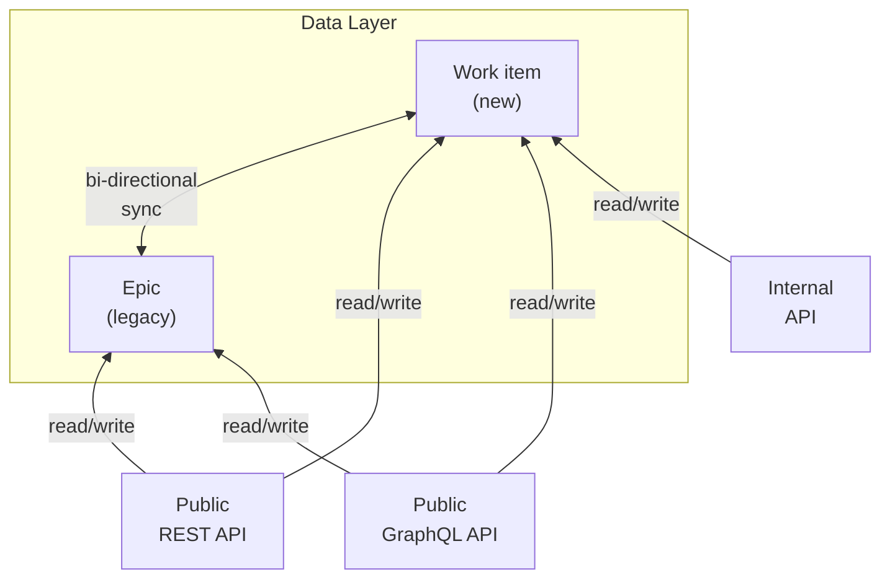
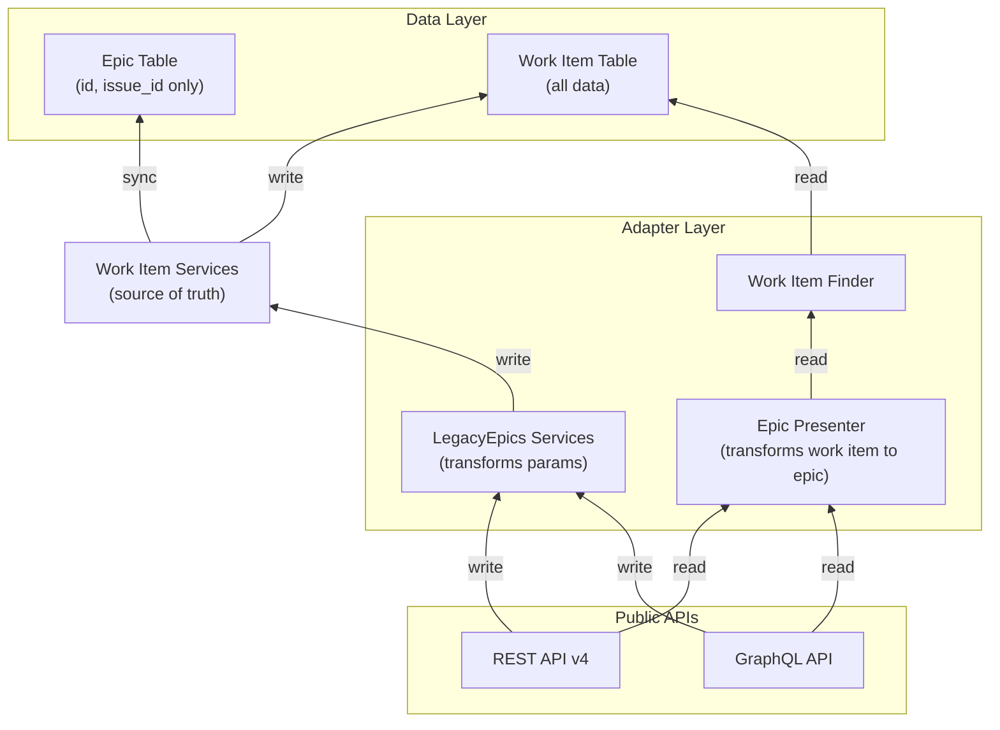

<div class="my-3 border-l-4 border-blue-500 bg-blue-50 px-4 py-3 rounded-r text-sm text-blue-800">
このページには今後予定されている製品・機能・機能性に関する情報が含まれています。ここに示す情報は参考目的のみです。購入・計画の決定にこの情報を使用しないでください。製品・機能・機能性の開発、リリース、タイミングは変更または延期される可能性があり、GitLab Inc. の独自の判断に委ねられています。
</div>

<div class="overflow-x-auto my-4">
<table class="w-full text-sm border-collapse">
<thead>
<tr class="bg-gray-100 text-left">
<th class="px-3 py-2 border border-gray-300">Status</th>
<th class="px-3 py-2 border border-gray-300">Authors</th>
<th class="px-3 py-2 border border-gray-300">Coach</th>
<th class="px-3 py-2 border border-gray-300">DRIs</th>
<th class="px-3 py-2 border border-gray-300">Owning Stage</th>
<th class="px-3 py-2 border border-gray-300">Created</th>
</tr>
</thead>
<tbody>
<tr>
<td class="px-3 py-2 border border-gray-300"><span class="inline-block rounded px-2 py-0.5 text-xs font-medium bg-gray-100 text-gray-700">implemented</span></td>
<td class="px-3 py-2 border border-gray-300"><a href="https://gitlab.com/nicolasdular" class="text-blue-600 hover:underline">@nicolasdular</a></td>
<td class="px-3 py-2 border border-gray-300"></td>
<td class="px-3 py-2 border border-gray-300"><a href="https://gitlab.com/nicolasdular" class="text-blue-600 hover:underline">@nicolasdular</a></td>
<td class="px-3 py-2 border border-gray-300"><span class="inline-block rounded px-2 py-0.5 text-xs font-medium bg-gray-100 text-gray-700">~devops::plan</span></td>
<td class="px-3 py-2 border border-gray-300">2025-12-16</td>
</tr>
</tbody>
</table>
</div>


## サマリー

Issue と Epic を1つの [ワークアイテムフレームワーク](https://docs.gitlab.com/development/work_items/) に統合するため、既存の Epic をワークアイテムに移行しました。Issue はプロジェクトレベルにのみ存在し `issues` テーブルを使用します。一方、Epic はグループレベルにあり、ほとんどの機能に専用テーブルを持っています。Issue はワークアイテムの基盤であるため、すべての Epic を `issues` テーブルに移行し、ワークアイテム API を通じて提供しました。これはユーザーへのダウンタイムなしに、既存 API への破壊的変更なしに実現されました。

## コンテキスト

**ワークアイテムとは?** ワークアイテムは GitLab におけるすべての作業追跡エンティティ（Issue、Epic、インシデント、要件、テストケースなど）のための統合フレームワークです。この移行以前、Epic は Issue とは別に保存・管理されており、重複したコードと保守が必要でした。

**なぜ Epic を移行するのか?** Epic と Issue は同様の機能を共有していましたが、別々の実装を持っていました。異なるストレージと API エンドポイントは、新しい機能や改善を行うたびに両方で並行開発と保守が必要であることを意味し、以下を生じさせていました:

- すべての新機能に対する重複コード
- 一貫性のないユーザーエクスペリエンス
- 新しいワークアイテムタイプの導入困難
- 保守負担の増大

Epic を `issues` テーブルに移行し、ワークアイテム API を通じて提供することで、技術的負債を削減し、機能ベロシティを向上させ、一貫したユーザーエクスペリエンスを提供します。

**現在のステータス:** 移行は完了し本番環境で稼働しています。現在、クリーンアップフェーズにあり、双方向同期を削除してワークアイテムを通じた書き込み専用への統合を進めています。

### 目標

- ワークアイテム API を通じて Epic を提供する
- Issue が発生した場合にレガシー動作に戻すオプションを持つ安全なロールアウト
- ゼロダウンタイム
- データの一貫性
- API への破壊的変更なし

## 設計と実装の詳細

移行は5つの独立した作業ストリームに整理されました:

1. ワークアイテムと Epic の機能パリティ
2. Epic からワークアイテムへの同期
3. Epic データのワークアイテムへのバックフィル
4. ハイブリッド同期
5. レガシー Epic コードのクリーンアップと双方向同期の削除

Epic からワークアイテムテーブルへの機能パリティとデータのバックフィルは単純なプロセスでした。そのため、Epic からワークアイテムへの同期、ハイブリッド同期、クリーンアップにのみ焦点を当てます。

### Epic とワークアイテムの同期

Epic: https://gitlab.com/groups/gitlab-org/-/epics/12738

`epics` テーブルを `issues` テーブルにバックフィルする前に、Epic データをワークアイテムに同期するシステムを実装しました。これは1対1のマッピングではなく、一部の機能は異なる方法で実装されていました。

**同期戦略:** すべての Epic が `issues` テーブルに対応するワークアイテムを持ちます。関係を維持するために `epics` テーブルに `issue_id` カラムを追加しました。これにより移行中、両テーブルの同期を保つことができます。

**フィールドマッピング:** 以下の表は Epic フィールドがワークアイテムテーブルにどのようにマッピングされるかを示しています。「直接同期」とマークされたフィールドはそのままコピーされます。「移行済み」とマークされたフィールドは新しい構造に変換されます。「非同期」とマークされたフィールドは不要または別途処理されます。

| Epic フィールド | 対象テーブル | マッピングタイプ | 注記 |
|--------|--------|--|--|
| id | - | 参照 | ワークアイテムへのリンクに `epics` テーブルへ `issue_id` カラムを追加 |
| iid | `issues` | 直接同期 | `namespace_id` を使用して各ネームスペース内で一意に保持 |
| title | `issues` | 直接同期 | - |
| description | `issues` | 直接同期 | - |
| title_html | `issues` | 直接同期 | - |
| description_html | `issues` | 直接同期 | - |
| author_id | `issues` | 直接同期 | - |
| updated_by_id | `issues` | 直接同期 | - |
| last_edited_by_id | `issues` | 直接同期 | - |
| last_edited_at | `issues` | 直接同期 | - |
| created_at | `issues` | 直接同期 | - |
| updated_at | `issues` | 直接同期 | - |
| closed_by_id | `issues` | 直接同期 | - |
| closed_at | `issues` | 直接同期 | - |
| state_id | `issues` | 直接同期 | - |
| confidential | `issues` | 直接同期 | - |
| cached_markdown_version | `issues` | 自動生成 | ワークアイテム作成時に生成 |
| color | `work_item_colors` | 移行済み | 専用テーブルに移動 |
| group_id | `issues` | 名前変更 | issues テーブルでは `namespace_id` と呼ばれる |
| parent_id | `work_item_parent_links` | 移行済み | `work_item_parent_id` を使用して `relative_position` と同期 |
| relative_position | `work_item_parent_links` | 移行済み | 順序付けのために `parent_id` と同期 |
| assignee_id | - | 非同期 | Epic では有効化されていない |
| external_key | `issues` | 削除済み | 最初は同期されていたが使用されなかった |
| lock_version | - | 非同期 | [Issue #439716](https://gitlab.com/gitlab-org/gitlab/-/issues/439716) を参照 |
| total_opened_issue_weight | - | 非同期 | キャッシュカウント、まだ未実装 |
| total_closed_issue_weight | - | 非同期 | キャッシュカウント、まだ未実装 |
| total_opened_issue_count | - | 非同期 | キャッシュカウント、まだ未実装 |
| total_closed_issue_count | - | 非同期 | キャッシュカウント、まだ未実装 |
| start_date_sourcing_epic_id | `work_item_dates_sources` | 移行済み | `start_date_sourcing_work_item_id` に同期 |
| due_date_sourcing_epic_id | `work_item_dates_sources` | 移行済み | `due_date_sourcing_work_item_id` に同期 |
| start_date | `work_item_dates_sources` | 移行済み | - |
| end_date | `work_item_dates_sources` | 移行済み | `due_date` に同期 |
| start_date_sourcing_milestone_id | `work_item_dates_sources` | 移行済み | - |
| due_date_sourcing_milestone_id | `work_item_dates_sources` | 移行済み | - |
| start_date_fixed | `work_items` + `work_item_dates_sources` | 移行済み | 両テーブルに同期 |
| due_date_fixed | `work_items` + `work_item_dates_sources` | 移行済み | 両テーブルに同期 |
| start_date_is_fixed | `work_item_dates_sources` | 移行済み | - |
| due_date_is_fixed | `work_item_dates_sources` | 移行済み | - |

**関連テーブル:** epics テーブルに加えて、以下のテーブルを同期するための外部キーも追加しました:

- `related_epic_links` → `issue_links`: 各 Epic リンクに対応する Issue リンクが得られます。`related_epic_link.issue_link_id` 外部キーが一貫性を保証します。
- `epic_issues` → `work_item_parent_links`: 各 Epic-Issue 関係に対応する親子ワークアイテムリンクが得られます。`epic_issues.work_item_parent_link_id` 外部キーが一貫性を保証します。

#### 双方向同期

**なぜ双方向なのか?** 当初、Epic からワークアイテムへのみの同期を検討しました。しかし、このアプローチには重大な欠点がありました:

1. **API 書き換えの負担:** すべての Epic API（REST および GraphQL）をワークアイテムデータを使用するように書き直す必要があります。これはユーザー向けの利益を遅らせることになります。
2. **ロールバックパス不在:** ワークアイテムにのみ書き込んだ場合、バグが発生した際にレガシー Epic システムにロールバックできません。

**ソリューション:** 双方向同期を実装しました。Epic またはワークアイテムへの変更はもう一方に同期されます。これにより以下が可能になりました:

- 既存の Epic API を変更なく機能し続ける
- 自分たちのペースでワークアイテムに段階的に移行
- Issue が発生した場合に安全にロールバック

**実装:** `issues` テーブル（`work_item_type = 'Epic'`）のすべての属性を対応する `epics` レコードに同期しました。また `issue_links` と `work_item_parent_links` を対応する Epic 相当品（`related_epic_links` と `epic_issues`/`epics.parent_id`）に戻して同期しました。

同期はデータの一貫性を保証するためにデータベーストランザクション内で Epic とワークアイテムサービスに実装されました。どちらの同期が失敗した場合も、操作全体がロールバックされます。



#### ハイブリッド同期

**ハイブリッド同期とは?** 一部の機能は Epic と Issue の両方で `Issuable` 抽象化の下に実装されており、すでに同じデータベーステーブルを使用していました:

- `resource_label_events`
- `sent_notifications`
- `resource_state_events`
- `description_versions`
- `award_emoji`
- `events`
- `subscriptions`
- `notes`
- `label_links`

**なぜハイブリッドなのか?** これらのテーブルはすでに `noteable_type` と `noteable_id` カラムを通じて Epic と Issue の両方をサポートしていたため、データのバックフィルや同期は必要ありませんでした。代わりに、UNION クエリを使用して Epic とワークアイテムのレコードの両方から同時に読み取りました。

**仕組み:** Epic を表すワークアイテムのノートをフェッチする際、以下の両方をクエリします:

- `noteable_type = 'Issue'` かつ `noteable_id = <work_item_id>` のノート
- `noteable_type = 'Epic'` かつ `noteable_id = <epic_id>` のノート

Active Record の関連フェッチをオーバーライドするために `UnifiedAssociations` コンサーンを導入しました。これにより `has_many :notes` 関係が透過的に両テーブルをクエリできます。

**例:** `issues.id = 12345` のワークアイテムとその対応する `epics.id = 6789` の Epic の場合:

```sql
SELECT "notes".* FROM (
  (SELECT "notes".* FROM "notes" WHERE "notes"."noteable_id" = 12345 AND "notes"."noteable_type" = 'Issue')
  UNION
  (SELECT "notes".* FROM "notes" WHERE "notes"."noteable_id" = 6789 AND "notes"."noteable_type" = 'Epic')
)
```

**将来のクリーンアップ:** Epic テーブルへの書き込みを停止したら、すべてのデータをバックフィルして（`noteable_type` を 'Epic' から 'Issue' に、`noteable_id` をワークアイテム ID に変更）、その後 UNION クエリを削除してワークアイテムレコードのみから読み取ることができます。

### レガシー Epic コードのクリーンアップと双方向同期の削除

同期とバックフィルの後、フロントエンドでワークアイテム API を使用できるようになりました。ただし、サポートのために Epic REST および GraphQL API が残っています。REST API は削除できませんが、メジャーリリースで GraphQL API を非推奨にして削除できます。

**現在のフェーズ:** 現在クリーンアップフェーズにあります。目標は双方向同期を削除し、ワークアイテムテーブルからのみ読み取り・書き込みを開始することです。`epics`、`related_epic_links`、および `epic_issues` テーブルは最終的に対応するワークアイテムテーブルへの参照としてのみ機能すべきです。

**クリーンアップステップ:**

1. ワークアイテムを最初に書き込むアダプターを構築する（ワークアイテムが信頼できる情報源になる）
2. Epic API をワークアイテムから読み取るように切り替える
3. ワークアイテムから Epic への同期を削除する
4. Epic データを削除するが、API 参照のために ID は保持する

#### アダプター

**課題:** Epic API をワークアイテムから読み取るように即座に切り替えると、ロールバックする能力を失います。すべての Epic API を一度に書き直すこともできません。

**ソリューション:** Epic API をラップするが内部ではワークアイテムサービスに委譲するアダプターサービスを構築しました。これにより以下が可能になりました:

- エンドポイントごとのフィーチャーフラグによる移行
- 互換性を検証するための既存 Epic テストの再利用
- 必要に応じた個別エンドポイントのロールバック
- 大規模な書き直しなしの段階的移行

**例:** Epic 作成エンドポイントが現在 `Epics::CreateService` の代わりに `WorkItems::LegacyEpics::CreateService` を呼び出します。アダプターは Epic パラメーターをワークアイテムパラメーターに変換し、ワークアイテムサービスを呼び出します。

```ruby
# Epic API endpoint
post ':id/(-/)epics/:epic_iid/epics' do
  ::WorkItems::LegacyEpics::CreateService.new(...).execute
end
```

```ruby
# Adapter service
module WorkItems
  module LegacyEpics
    class CreateService
      def initialize(group:, perform_spam_check: true, current_user: nil, params: {})
        @transformed_params = transform_params(params)
      end

      def execute
        # We can also use the legacy service via a feature-flag if needed
        result = ::WorkItems::CreateService.new(@transformed_params).execute
        transform_result(result)
      end
    end
  end
end
```

**メリット:**

1. フィーチャーフラグによるロールアウト: Issue が発生した場合に古いサービスに安全にロールバックできる
2. テスト再利用: すべてのレガシー Epic テストが引き続き通過し、互換性を検証する
3. 段階的移行: エンドポイントを1つずつ移行できる

#### 最終アーキテクチャ

**最終状態:** 最終的にワークアイテムのみから読み取り、データを Epic として API に提示します。`epics` テーブルは参照目的の `id` のみを含み、`issue_id` を使用して対応するワークアイテムにリンクします。

**タイムライン:** REST API v4 を削除するまで `epics` テーブルで `id` の作成を続ける必要があります。その後、`epics` テーブルとすべての参照を完全に削除できます。

**データフロー:** 以下の図はクリーンアップ完了後の最終アーキテクチャを示しています:



**重要ポイント:**

- ワークアイテムが唯一の信頼できる情報源
- Epic API はデータを変換する薄いアダプター
- Epic テーブルは API 互換性のための参照のみ
- すべての書き込みはワークアイテムサービスを通じて行われる
- すべての読み取りはワークアイテムから提供される（必要な場合は Epic として提示）
