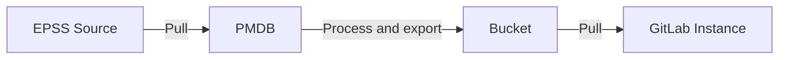
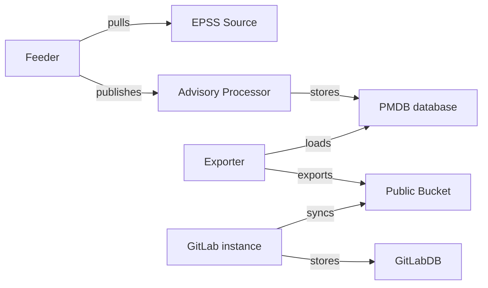



重要な用語については[用語集](#用語集)を参照してください。

## サマリー

[EPSS](https://www.first.org/epss/faq) スコアは、CVE が今後30日間に悪用される可能性を示します。このデータは、プロジェクトの脆弱性を修正する際の優先順位付け作業の改善と簡略化に使用できます。EPSS サポートの要件は [EPSS Epic](https://gitlab.com/groups/gitlab-org/-/epics/11544) に EPSS の概要とともに概説されています。このドキュメントは EPSS サポートの技術的な実装に焦点を当てています。

EPSS スコアは [EPSS Data ページ](https://www.first.org/epss/data_stats) から、または提供されている API を通じて取得できます。最終的に、EPSS スコアは GitLab GraphQL API を通じてアクセス可能になり、脆弱性レポートと詳細ページに表示され、ポリシーの設定時にフィルタリングや使用ができるようになります。

パッケージメタデータデータベース（PMDB、license-db とも呼ばれる）は、この目的のための既存のアドバイザリー取得・エンリッチメント方法です。フローは以下の通りです:

## 動機

脆弱性優先順位付けの古典的なアプローチは [CVSS](https://www.first.org/cvss/) に基づく深刻度を使用することです。このアプローチはある程度の指針を提供しますが、洗練されていません — 公開されているすべての CVE の半数以上が高または重大なスコアを持っています。修正疲れを軽減し開発者が作業をより適切に優先順位付けするための他の指標が必要です。EPSS は近い将来に悪用される可能性が最も高い脆弱性を特定するための指標を提供します。既存の優先順位付け方法と組み合わせることで、EPSS は修正作業の焦点を絞り、修正作業量を削減するのに役立ちます。EPSS をユーザーに提示される情報に追加することで、これらのメリットを GitLab プラットフォームに提供します。

### 目標

- ユーザーが GitLab 上の EPSS スコアを脆弱性優先順位付けの別の指標として使用できるようにする。
- 定期的な EPSS スコア再取得を効率的に行い、システム負荷を最小化するスケーラブルな手段を提供する。

#### フェーズ 1（MVC）

- GraphQL API を通じて EPSS スコアへのアクセスを有効にする。

#### フェーズ 2

- 脆弱性レポートと詳細ページに EPSS スコアを表示する。

#### フェーズ 3

- EPSS スコアに基づいて脆弱性をフィルタリングできるようにする。
- EPSS スコアに基づいてポリシーを作成できるようにする。

### 対象外（Non-Goals）

- EPSS（またはその他の指標）に基づいてユーザーに優先順位を指示すること。

## 提案

GitLab プラットフォームで EPSS をサポートします。

[EPSS Epic](https://gitlab.com/groups/gitlab-org/-/epics/11544) での議論に続き、提案するフローは以下の通りです:

1. PMDB データベースに EPSS スコアを保存する新しいテーブルが追加されます。
1. PMDB インフラが毎日フィーダーを実行し、EPSS データを取得・処理します。
1. アドバイザリープロセッサーが EPSS データを受け取り、PMDB DB に保存します。
1. PMDB が EPSS データを新しい PMDB EPSS バケットにエクスポートします。
    - EPSS データを保存する新しいバケットを作成します。
    - 新しいデータがアップロードされたら以前の EPSS データを削除します（古いデータはもう不要なため）。
    - EPSS スコアを小数点以下2桁に切り捨てます。
1. GitLab インスタンスが PMDB EPSS バケットからデータを取得します。
    - Rails DB に EPSS データを保存する新しいテーブルを作成します。
1. GitLab インスタンスが GraphQL API を通じて EPSS データを公開し、脆弱性レポートと詳細ページにデータを提示します。

## 設計と実装の詳細

### 決定事項

- [001: すべての EPSS エントリーをエクスポートする](decisions/001_export_all_epss.md)
- [002: EPSS データに新しいバケットを使用する](decisions/002_use_new_bucket.md)
- [003: API から CSV ファイルへの切り替え](decisions/003_switch_from_api_to_csv_file.md)

### 重要な注意事項

- すべての EPSS スコアは毎日更新されます。これはこの機能の設計において非常に重要です。
- EPSS ソースから[取得するフィールド](https://www.first.org/epss/data_stats) は `cve`、`score`、`percentile` です。小数点以下9桁まで保持されます。
  - アップサートの量を削減するため、[変更の大きさを確認するスパイク](https://gitlab.com/gitlab-org/gitlab/-/issues/468286) に基づき、EPSS スコアを小数点以下2桁に切り捨てます。

### PMDB

- [PMDB](https://gitlab.com/gitlab-org/security-products/license-db) にアドバイザリー識別子と EPSS スコアを含む新しい EPSS テーブルを作成します。これには [スキーマ](https://gitlab.com/gitlab-org/security-products/license-db/schema) の変更と必要なマイグレーションが含まれます。
- 新しい PMDB テーブルに EPSS データを取り込みます。EPSS データ構造をオリジンにできるだけ近い状態に保ちたいため、すべてのデータがエクスポーターで利用可能になります。エクスポーターは処理方法を選択できます。そのため、スコアとパーセンタイルは完全な値で保存されます。
- 別のバケットに EPSS スコアをエクスポートします。
  - 新しいものが追加された後は前日のエクスポートを削除します（もう不要なため）。
- 既存の Terraform モジュールを使用して、PMDB コンポーネントが使用するデプロイメントに新しい pubsub トピックを追加します。

### GitLab Rails バックエンド

- EPSS スコアを保持する Rails バックエンドのテーブルを作成します。
- EPSS エクスポートを取り込み、新しいテーブルに保存する Rails 同期を設定します。
- GraphQL API Occurrence オブジェクトに EPSS データ属性を含めます。

### GitLab UI

- 脆弱性レポートページに EPSS データを追加します。
- 脆弱性詳細ページに EPSS データを追加します。
- EPSS スコアによるフィルタリングを許可します。
- EPSS スコアに基づくポリシー作成を許可します。

## 代替ソリューション

## 用語集

- **PMDB**（パッケージメタデータデータベース、license-db とも呼ばれる）: PMDB は Rails アプリケーションの外にある独立したサービス（単なるデータベースではない）で、GitLab インスタンスが消費するためのパッケージメタデータを収集、保存、エクスポートします。[完全なドキュメント](https://gitlab.com/gitlab-org/security-products/license-db/deployment/-/blob/main/docs/DESIGN.md?ref_type=heads) を参照してください。PMDB のコンポーネントには以下が含まれます:
  - **フィーダー**: PMDB デプロイメントによって呼び出されるスケジュール済みジョブで、関連するソースからのデータを PMDB プロセッサーが消費する pub/sub メッセージとして公開します。
  - **アドバイザリープロセッサー**: Cloud Run インスタンスとして実行され、アドバイザリー関連データを含むアドバイザリーフィーダーが公開したメッセージを消費し、PMDB データベースに保存します。
  - **PMDB データベース**: ライセンスとアドバイザリーデータを保存する PostgreSQL インスタンス。
  - **エクスポーター**: PMDB データベースからライセンス / アドバイザリーデータをパブリック GCP バケットにエクスポートします。
- **GitLab データベース**: GitLab インスタンスが使用するデータベース。
- **CVE**（Common Vulnerabilities and Exposures: 共通脆弱性識別子）: 公開されている情報セキュリティ脆弱性のリスト。「CVE」は通常、特定の脆弱性とその CVE ID を指します。
- **EPSS**（Exploit prediction scoring system: エクスプロイト予測スコアリングシステム）**スコア**: 特定の脆弱性が今後30日間に実際に悪用される確率を0から1で表すスコア。
- **EPSS スコアパーセンタイル**: 特定の脆弱性の EPSS スコアに対して、同じまたはそれ以下の EPSS スコアを持つすべてのスコア付き脆弱性の割合。
