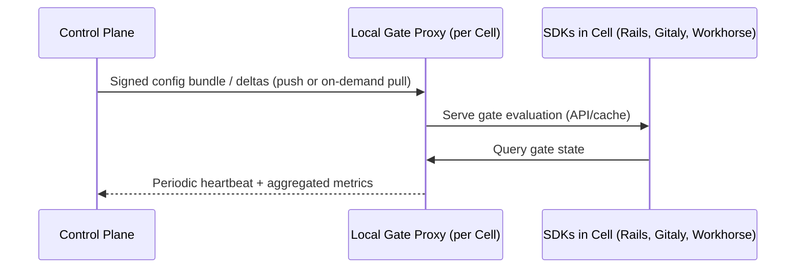
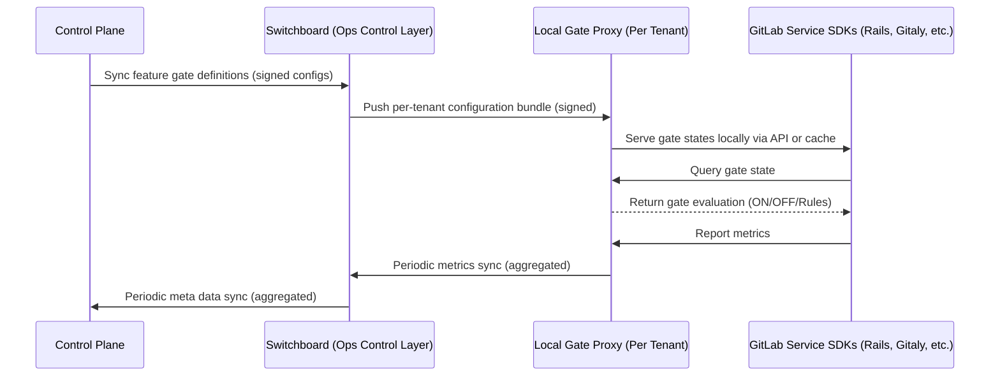




## エグゼクティブサマリー

フィーチャーフラグは GitLab の成功に不可欠な要素であり、拡大するプロダクトポートフォリオ全体で安全かつイテレーティブに機能を提供することを可能にしてきました。しかし、現在のソリューションは運用上の限界に達しており、新機能の市場投入時間の増加、インシデント発生率の上昇、リリース管理能力における競合上の不利をもたらしています。

このブループリントでは、フィーチャーゲートを紹介します。これは機能管理を戦術的な開発ユーティリティから、GitLab SaaS プラットフォームのロールアウトとインシデント管理をより適切に制御できる戦略的なビジネスイネーブラーへと変革する、より広範なフレームワークです。

### スコープ内

このブループリントでは、フィーチャーゲートフレームワークの対象を GitLab SaaS プラットフォームのみとしています。ただし、この作業は将来のイテレーションで全 GitLab プラットフォームを包含するようにフレームワークを拡張する道を開きます。

## スコープ外

- 実装の詳細、システムアーキテクチャ、SDK API については、実行計画とタイムラインとともにフォローアップの技術文書で対応します。
- コードベース内の既存のフィーチャーフラグは新しいフィーチャーゲートソリューションに自動的には移行されません。所有者が評価し、期限切れまたは未使用の場合は完全に削除するか、設定に変換するか、このドキュメントのガイドラインに従ってゲートに置き換えます。
- このブループリントはセルフマネージドまたは JiHu のロールアウトをカバーしません。

## 動機

GitLab の急速な成長により、多様な環境に展開された 3 つの主要製品のポートフォリオが構築され、700 以上のアクティブフラグを管理するフィーチャーフラグソリューションが支えています。元々はよりシンプルなアーキテクチャのために設計されたこのソリューションは、ビジネスニーズと技術的進化にスケールしておらず、現代のフィーチャー管理における競争力を制限し、効率的かつ安全に価値を提供する能力を妨げています。

### 既存のフィーチャーフラグソリューション

GitLab.com は現在、Flipper ベースのフィーチャーフラグソリューションを使用しています。フラグは Slack 経由で手動制御され、GitLab の Issue がフラグのライフサイクルを通じた追跡に使用されています。

このソリューションには以下の制限があります。

- **ロールアウト戦略の制限**: GitLab Dedicated で段階的ロールアウトのプログレッシブデリバリーサポートがないため、段階的なロールアウトによる機能リリースのリスク軽減ができず、顧客体験や迅速なイテレーション能力に影響する可能性があります。
- **運用上の負担**: 700 以上の手動管理フラグがエンジニアリング時間を消費しており、明確な所有権がなく放置されたフラグが技術的負債として蓄積しています。
- **コンプライアンス**: 限られたユーザー管理と監査ログがコンプライアンスチームに複雑性をもたらしています。
- **言語のギャップ**: Ruby のみの実装では Go/Python/JS サービスが除外され、モノリシックな結合により新しいアーキテクチャでのフィーチャーフラグ使用が妨げられています。
- **ビジネスへの影響**: 手動フラグ調整がエンジニアリング時間を消費し、デプロイの成功を損ない、プロダクトチームは意思決定のための使用データを持たず、Dedicated の顧客は .com ユーザーと同じ機能を持ちません。スケールするにつれて、機能を効率的に管理し、コンプライアンス要件を満たすためのより優れたツールが必要です。

GitLab は[フィーチャーフラグ用の Unleash 互換 API](https://docs.gitlab.com/operations/feature_flags/) を提供しています。この機能は多くの顧客が本番環境で使用しています。

## 目標

運用上のボトルネックを排除し、セキュリティとコンプライアンスを強化し、スケールでのイノベーションをサポートすることで、GitLab チームが GitLab SaaS プラットフォームで安全、制御、データ駆動の機能ロールアウトを実現できるよう支援します。

## 要件

**リリースの安全性と品質**

- **月次リリースの保護:** 堅牢な自動ゲーティング制御と段階的ロールアウトを通じて、月次リリースで未完成の機能が漏れないようにします。
- **マルチテナントのセグメンテーションとロールアウトのサポート:** プログレッシブロールアウトのために、組織ごとまたはユーザーコホートによる有効化で、すべての Cell へのパッケージ展開を可能にします。

**インシデント対応と回復**

- **インシデント解決の加速:** 既存のオブザーバビリティおよびモニタリングツールと統合して、エラーとフィーチャー状態を相関させ、インシデント中の可視性を提供します。
- **システム耐障害性の確保:** GitLab モノリスから独立してフィーチャーゲートの外部制御を可能にし、システム障害中でも機能を無効にできるようにします。

**コンプライアンスとガバナンス**

- **規制要件の充足:** コンプライアンス基準を満たすために、ロールベースのアクセス制御を備えたすべてのゲート変更の完全な監査証跡を提供します。

**運用上の卓越性**

- **スケールでの自動化:** GitLab のオートデプロイを、事前定義された成功基準に基づいてゲート状態の変更をトリガーする自動化ワークフローでサポートします。
- **フィーチャー管理の民主化:** どのチームでも独立してフィーチャーゲートを作成、設定、廃止できる直感的なセルフサービスツールを提供します。

**開発生産性**

- **フィーチャーテストの簡素化:** 異なるゲート設定での包括的なテスト、フィーチャー間の依存関係の管理、フィーチャー動作の完全なオブザーバビリティを可能にします。
- **Dedicated 運用の強化:** ベータ機能への制御されたアクセスを可能にし、コードデプロイを必要とせずに顧客に影響する Issue に迅速に対応するための Dedicated オペレーター向けキルスイッチ機能を提供します。

## プロポーザル

**フィーチャーゲート** は GitLab SaaS プラットフォームの機能ロールアウトとアクセス制御のフレームワークです。戦術的なフィーチャーフラグを超えて進化し、フィーチャー管理を **ガバナンス、自動化、モニタリング** と統合します。

このフレームワークは、マルチクラウド、マルチセルアーキテクチャ、複雑なプロダクトポートフォリオを含む現代のソフトウェアデリバリーのニーズを満たすように設計されています。新機能であれ、既存の GA 機能への大幅な変更、拡張、リファクタリングであれ、フレームワークはロールアウトを段階的に管理します。それは **安定性、運用性、スケーラビリティ、コンプライアンス** を確保しながら行います。

### 主な特徴

- **コントロールプレーン:** 耐障害性の高いスタンドアロンサービスが、メインアプリケーションから切り離されて、すべてのゲート定義、ロールアウトルール、アクセス制御を管理します。
- **マルチ言語 SDK:** Ruby、Go、Python などの軽量クライアントにより、多様なサービスと環境全体で一貫したゲート評価を保証します。
- **ゲートプロキシ:** セル/テナントレベルの軽量サービスで、パフォーマンスと耐障害性のためにフィーチャーゲート SDK に署名されたフィーチャーゲート設定をキャッシュして提供します。
- **包括的な API と UI:** セルフサービスのゲート作成、設定、モニタリングのためのリッチな管理インターフェースで、自動および手動ワークフローの両方をサポートします。
- **自動化ワークフロー:** 組み込みの安全チェック、段階的なロールアウト、ライフサイクル自動化を備えた標準化された開発およびリリースワークフロー。
- **高度なガバナンス:** すべてのゲートに対するロールベースの権限、監査証跡、所有権追跡で、規制コンプライアンスと運用上の卓越性をサポートします。
- **統合モニタリング:** フィーチャーの健全性とパフォーマンスを追跡するリアルタイムダッシュボードとアラートで、データ駆動の意思決定と迅速なインシデント対応を可能にします。
- **Cell とリング対応:** マルチセルデプロイとリングベースのロールアウトのネイティブサポートで、影響範囲を最小化し、複雑な分散アーキテクチャ内でのプログレッシブデリバリーを可能にします。

## フレームワークの柱

### 自動化と標準化されたワークフロー

フィーチャーゲートは、すべての機能のライフサイクルに不可欠な部分として必須のゲーティングを強制します。これは、[実験的、ベータ、パブリックアベイラビリティワークフロー](https://docs.gitlab.com/policy/development_stages_support)における **Discovery** と呼ばれる新しい必須開発ステージを通じて、機能の構想段階から確保されます。

ゲート駆動の開発ワークフローでは、すべての機能はデフォルトですべてのゲートが無効になっている **Discovery** フェーズから始まります。ワークフローステージ間の進行は自動化されており、事前定義された基準（テスト結果、パフォーマンスなど）を満たすことを条件とします。これにより、検証済みで本番対応の機能のみが広いユーザーに到達し、リグレッションや不完全なローンチのリスクを低減します。

以下のチャートはフィーチャーゲートの開発ワークフローを説明しています。

  ```mermaid
  flowchart TD
    Start([Start: New Feature]) --> Discovery[Discovery]
    
    Discovery --> Decision{Feature<br/>Complexity?}
    
    Decision -->|Complex| Experiment[Experiment]
    Decision -->|Simple| Public[Public Availability]
    
    Experiment --> Beta[Beta]
    Beta --> Public
    
    Public --> End([End: Released])
    
    %% Styling
    style Start fill:#f9f,stroke:#333,stroke-width:2px
    style Discovery fill:#663399,color:#fff,stroke:#333,stroke-width:2px
    style Experiment fill:#7d3f98,color:#fff,stroke:#333,stroke-width:2px
    style Beta fill:#8b4f9f,color:#fff,stroke:#333,stroke-width:2px
    style Public fill:#9966cc,color:#fff,stroke:#333,stroke-width:2px
    style End fill:#9f9,stroke:#333,stroke-width:2px
    style Decision fill:#ffd700,stroke:#333,stroke-width:2px
    
    %% Notes
    Discovery -.-> DiscNote[1.New stage introduced by Feature Gates workflow.<br/>2.Every feature begins here.<br/>3.Only available within predefined workflows for a safe rollout mechanism.<br/> 4.Gates are off]
    
    Experiment -.-> ExpNote[1.More gradual rollout.<br/>2.Opt-in mechanism.<br/>3.Preview of upcoming functionality is the core of development stages support policy.]
    
    Beta -.-> BetaNote[1.Wider testing phase with expanded user access.<br/>2.Opt-in mechanism.<br/>3.Final testing before release.]
    
    Public -.-> PubNote[1.Feature gate defaulted to ON.<br/>2.Available to all users.]
    
    Decision -.-> DecNote[Simple features can jump directly to Public Availability.]
    
    %% Style notes
    style DiscNote fill:#f9f9f9,stroke:#666,stroke-width:1px,stroke-dasharray: 5 5
    style ExpNote fill:#e6f3ff,stroke:#4169e1,stroke-width:1px,stroke-dasharray: 5 5
    style BetaNote fill:#f9f9f9,stroke:#666,stroke-width:1px,stroke-dasharray: 5 5
    style PubNote fill:#f9f9f9,stroke:#666,stroke-width:1px,stroke-dasharray: 5 5
    style DecNote fill:#ffebcd,stroke:#666,stroke-width:1px,stroke-dasharray: 5 5
  ```

#### 月次リリースとの整合性と設定スナップショット

**月次リリース** が準備される際、フィーチャーゲートの背後にマージされたすべてのコードは、ロールアウトステージに関係なく自動的に含まれます。しかし、**何が有効な状態でリリースされるか** は **コントロールプレーンのスナップショットプロセス** によって厳密に管理され、検証済みで承認されたゲートのみがデフォルトで有効になることを保証します。

- **スナップショット生成と埋め込み**

  リリースカットパイプラインの一部として、**コントロールプレーンは「フィーチャーゲートリリーススナップショット」を自動的に生成します。**

  - スナップショットは、その時点での各ゲートの ID、デフォルト状態、ステージ、メタデータをキャプチャします。
  - スナップショットは **暗号化署名** され、バージョン管理され、コントロールプレーンに一元的に保存されます。
  - スナップショットはリリースパイプラインに **アーティファクトとしてエクスポート** され、**デプロイメントバンドルに埋め込まれます**。
  - これにより、すべてのデプロイ環境が特定のリリースに対して **テスト済み、検証済み、署名済みのゲートデフォルトのセット** に対して実行されることが保証されます。
  - このパイプラインステップ中に、自動チェックがゲートの一貫性と所有権を検証します。
  - いずれかのゲートが検証に失敗したり、ビルド/テストのリグレッションを引き起こした場合、リリースジョブは所有する機能チームに自動的に通知します。チームはスナップショットが再生成される前に、根本的な Issue を修正するか、デフォルト状態を調整できます。

- **リリースにおけるゲートの状態**

  一度埋め込まれると、スナップショットはそのリリースで **どの機能がオンまたはオフになるか** を正確に定義します。

  - **新規または未完成の機能** → デフォルトで **オフ**。
  - **完成した、承認済みの GA 機能** → リリースではデフォルトで **オン** - プロダクトがガイドとして[ステージサポートポリシー](https://docs.gitlab.com/policy/development_stages_support/)を使用して機能ステータスを決定します。
  - **実験 / ベータ機能** → 指定されたコホート（内部ユーザー、ベータ参加者など）に対してのみ有効。後に昇格しない限り、その他のユーザーには無効。
  - プログレッシブロールアウトやライブパーセンテージは静的スナップショットには **効果がありません** - リリースは常に現在のライブロールアウト状態ではなく **デフォルト設定** でリリースされます。

- **リリース後の検証**

  - 機能チームは、完成した承認済みのゲートのみがデフォルトで **オン** であることを確認します。
  - その後の昇格（例: ベータ → GA）は、配信済みのデフォルトを変更するのではなく、リリース後にコントロールプレーンを通じて動的に処理されます。

#### アプリケーションとフィーチャーゲートの相互作用

1. 開発者が **ゲート管理 UI** または API を使用して機能のゲートを設定します。
2. これらの設定は **コントロールプレーン** に保存されます。
3. ゲート付き機能のマージされたコードは、デプロイメントパイプラインに従って指定された環境にデプロイされます。
4. ユーザーが GitLab アプリケーションインスタンスにアクセスすると、アプリケーションの **フィーチャーゲート SDK** が **ローカルゲートプロキシ** にコールし、プラットフォームと環境のコンテキストを踏まえてゲートの状態を取得します。ローカルプロキシは必要に応じて **コントロールプレーン** からフェッチします。セルフマネージドインスタンスはパッケージ済みのデフォルトにフォールバックします。
5. **フィーチャーゲート SDK** は **ローカルゲートプロキシ** から受信した情報を使用して、ゲートの状態をローカルで評価してキャッシュします。
6. アプリケーションインスタンスは **フィーチャーゲート SDK** を使用して、特定のユーザーにその機能を表示するかどうかを決定します。

### プログレッシブ & ガードされたロールアウト

自動化ワークフローの導入により、機能リリースはプログレッシブなコホートベースのロールアウトで管理されるようになりました。このアプローチにより、機能を内部チーム（ドッグフーディング）、ベータテスター、またはランダムなユーザーコホートなどの対象ユーザーグループにベータプログラムや制御された実験を通じて段階的に公開できます。このプロセスはリアルタイムモニタリングと自動保護手段と密接に連携し、ユーザーへの影響を最小化します。

#### 仕組み

- **コホートベースのロールアウト** - コホートとは、定義されたルール（例: 全内部スタッフ、組織 X の全ユーザー、またはベータプログラムに明示的にオプトインしたユーザー）に基づいて機能に公開される特定の孤立したユーザーグループです。ロールアウトワークフローの各ステージには 1 つ以上のコホートが含まれます。フレームワークはターゲティングルールを使用して、機能がすべてのコホートに届くまでコホート間のロールアウトを進めます。

- **インクリメンタル/プログレッシブロールアウト** - ロールアウトは最小限の公開から始まり、段階的に拡大されます。公開の増加は事前定義されたルールと自動チェックによって管理され、Issue が発生した場合にチームが迅速にロールアウトを中断または元に戻せるようにします。

- **自動保護手段と即時ロールバック** - フィーチャーゲートは、モニタリングおよびアラートプラットフォーム（例: Grafana）との統合を使用して **主要健全性メトリクスの複合セット** を継続的にモニタリングします。これは誤検知とアラートノイズを最小化する **高品質ロールバックシグナル (HFRS)** を生成するために使用されます。HFRS シグナルが定義されたしきい値を超えた場合、フィーチャーゲートシステムは自動的にターゲットを絞った回復アクションを実行し、適切なチームに通知します。

  - **複合ロールバックメトリクス:** サイドエフェクトのリグレッションを防ぐために（例: エラーレートは低いが他の場所で大規模な CPU スパイクを引き起こす機能）、HFRS は以下を組み合わせて形成されます。

    - **Tier 1: 機能 SLO:** 機能の健全性を直接測定するメトリクス（例: レイテンシーとエラーレート）。
    - **Tier 2: プラットフォームガードレール（正規化済み）:** **Cell スコープのリソースベースメトリクス**（例: **CPU 使用率、メモリ、キュー深度**）でプラットフォームの整合性に対する機能の影響を測定します。これらのガードレールは、ローカライズされたパフォーマンススパイクへの感度を確保しながらグローバルな正規化のマスキング効果を避けるために、**グローバルな生の平均ではなくローカルセルの履歴ベースラインに対して正規化** されています。コントロールプレーンは複数のセルが同時にローカライズされた HFRS をトリガーした場合に相関を使用して体系的な問題を検出します。

  - **しきい値とロールバックルール:** ルールは複合メトリクスにわたる **持続的な違反** を要求することで誤検知を防ぐように調整されています。これらのルールは管理 UI で機能エンジニアによって設定されますが、レビューとチューニングの対象となります。システムのアクションは定義されたロールバックポリシーに基づいて細かく設定されています: 自動的に **公開を縮小する**（例: 最後の既知の安定した設定スナップショットにフォールバック）か、特定の問題のある機能に対してターゲットを絞った **キルスイッチ** をトリガーします。

  - **SRE ガバナンスとインシデント制御:** **SRE チーム** は、リソース集約型のロールアウトに対してシステムの健全性と信頼性を保護するためのこれらの非交渉可能なしきい値を確保する専門知識を活用して、**プラットフォームガードレール**（Tier 2 HFRS）を定義、チューニング、施行する重要な役割を担います。グローバルロールバック決定のためのセルごとの HFRS シグナルの正規化と集計の方法は、実装フェーズ中の重要な調査とモニタリング領域となります。インシデントを制御するために、オンコール SRE は手動で **ターゲットを絞ったキルスイッチをトリガー** して問題のある機能ゲートを即座に無効にすることができ、自動化ポリシーとは独立して重大インシデント中にシステムの可用性を保護する重要なライフボートとして機能します。

#### デプロイ環境全体でのロールアウト

ロールアウトはコードのデプロイスケジュールとは独立して管理され、各環境（例: staging-canary、production-canary、staging、production）を制御された機能ロールアウトの独自のステージとして扱います。このアプローチにより、コードが最初にデプロイされ（例: デフォルトでゲートをオフ）、機能が後から段階的に有効になることが保証されます。

- **デプロイメントパイプラインテストとの相互作用:** - ゲートのロールアウトは、基礎となるコードが安定していることを条件とします。

  - **テストはゲートの状態を知る必要があります:** - 自動テストは、さまざまなゲート状態（オン、オフ、フォールバック）下でのアプリケーション動作を検証するために、フィーチャーゲートの状態を明示的に認識する必要があります。実際には、ゲートの状態は単純にテストフィクスチャの一部となり、3 つのコードパス（例: GA -> オン、実験的/ロールバック -> オフ、失敗/フォールバックモード）すべてを検証します。テストの焦点は CI（ユニット/統合）から本番環境のような環境へのデプロイ（E2E）に移行するにつれて、複数のアクティブな機能が連携して動作することを確認するために個別ゲートから完全な統合へとシフトします。

  - **ゲートはテストを待ちます:** - ゲートのロールアウトはワークフロー全体の後続ステップであり、デプロイメントパイプラインのテストが成功するのを待つ必要があります。
    - プログレッシブロールアウトを制御する自動化ワークフローは CI/CD 統合を条件とします。これにより、フィーチャーゲートが新しい環境でガードされたロールアウトを開始する前に、基礎となるコードパッケージがすべての基本的な環境と機能テストに合格したことが保証されます。
    - テストが通過し、コードがデプロイされると、ガードされたロールアウトフェーズが始まります。この時点で、ゲートは小さなコホートに対して有効になり、焦点はパイプラインテストからヘルスメトリクスに基づくガードされたロールバックのためのライブモニタリングに移ります。

  - **次のロールアウトステージのトリガー:** - コントロールプレーンは現在の環境（例: staging-canary）からの集計メトリクス（エラーレート、レイテンシーなど）をモニタリングします。これらのメトリクスが安定し、一定期間すべての事前定義された成功基準を満たすと、その環境のゲートのロールアウトは検証済みとみなされます。この検証は「ゲートがロールアウトを完了した」シグナルとして機能します。自動化ワークフローは、フィーチャーゲートの有効化ポリシーを次の対象環境（例: production-canary）へ昇格させるトリガーとなります。

#### 自動化ワークフローの例

1. 新しい機能がユーザーの 5% にデプロイされます。
2. 重要な SLI とフィーチャーゲートメトリクスに対して事前定義されたしきい値が設定されます。
3. モニタリングツールがリアルタイムでこれらのメトリクスを継続的に追跡します。
4. しきい値が違反された場合、フィーチャーゲートシステムは影響を受けるプラットフォームのすべてまたは影響を受けるコホートに対して即時ロールバックをトリガーし、フィーチャーゲートの所有者にアラートを送信します。
5. すべてのロールアウトアクション、しきい値違反、ロールバックが監査と将来の分析のためにログに記録されます。
6. Issue が解決されたら、ロールアウトを安全に再開できます。

#### 依存関係

- サポートコントロール（例: オブザーバビリティ、メトリクスと使用状況のインストルメンテーション）。

### フェデレーテッドデプロイメントトポロジー

フィーチャーゲートフレームワークは、GitLab SaaS プラットフォーム全体で一貫した制御、可視性、耐障害性を確保するために、フェデレーテッドだが中央集権的に管理されるトポロジーを通じて動作します。

**コントロールプレーン** サービスはモノリスの一部ではなく、アプリケーションとは別のデータベースを操作します。各テナントは API または制御された配布チャネルを通じて署名済み設定とメトリクスポリシーを利用します。

各テナント/インスタンス/Cell は **ローカルゲートプロキシ** を持ちます。これらのプロキシはベースデプロイメントテンプレート（例: Terraform モジュール、Helm チャート、またはクラスターブートストラップマニフェスト）に含まれています。環境（例: Cell、テナント、またはインスタンス）が作成されると、プロキシが自動的にデプロイされます。
これらの **ローカルゲートプロキシ** は耐障害性レイヤーですが、すべてのゲート定義、署名、更新はコントロールプレーンから発生します。

コントロールプレーン自体は HA で動作する必要があります（例: マルチ AZ/リージョン、フェイルオーバー、テスト済みの DR ランブック）。

#### 耐障害性とサッドパス処理（グレースフルデグラデーション）

フェデレーテッドアーキテクチャは耐障害性を特に考慮して設計されており、制御レイヤーの障害がアプリケーションのコアフィーチャー評価と可用性に影響しないことを保証します。

- **コントロールプレーンの障害:**
  - **ローカルゲートプロキシ** がプライマリ耐障害性レイヤーとして機能します。
  - 中央コントロールプレーンが障害した場合、すべてのプロキシは **最後に正常にキャッシュして署名した設定バンドル** をローカルアプリケーション SDK に引き続き提供します。
  - フィーチャー評価は最後の既知の良好な状態に基づいて継続され、コントロールプレーンが回復するまで更新/ロールアウト昇格は一時停止されます。

- **ローカルゲートプロキシの障害:**
  - ローカルゲートプロキシ（Cell/テナントごと）が障害または到達不能になった場合、アプリケーション **SDK は直接コントロールプレーンにクエリしようとしません**。これは孤立モデルに違反し、複雑な通信依存関係をもたらす可能性があります。
  - 代わりに、**フィーチャーゲート SDK** は最初に最後の成功したゲート評価の **インメモリキャッシュ** を確認します。
  - キャッシュが利用不能または期限切れの場合、SDK は安全のために **フェイルクローズド** の原則を適用し、クエリされたすべてのフィーチャーゲートを **オフ（無効）** にデフォルト設定します。これにより、重大なインフラ障害中に潜在的にバグのある、または不完全な機能が公開されることを防ぎます。

- **アプリケーション SDK フォールバック:** SDK はすべての環境に定義されたフォールバックメカニズムを含みます。SaaS では、最終的なサッドパスはゲートをオフにデフォルト設定し、システムの安定性を確保することです。

この多層キャッシュとフォールバック戦略は、システム障害中でも機能を無効にできるという要件を満たす **システム耐障害性** を確保し、堅牢なグレースフルデグラデーションパスを提供します。

#### 環境別デプロイメントモデル

**開発**

- **トポロジー:** 各開発環境は、GDK インストールと並んでコントロールプレーンとローカルゲートプロキシの **エフェメラルインスタンス** を実行する機能を持ち、通常はコンテナ化されています。これはエンドツーエンドのテスト実行に便利ですが、日常的な開発や受け入れテストには必須ではありません。後者については、エンジニアはデフォルトで軽量なインメモリテストダブル（例: ローカル設定ファイル）を使用し、SDK を使用してゲート状態、コホートメンバーシップ、キャッシュ動作をテストごとに定義して、高速で決定論的かつ孤立したテスト実行を確保する必要があります。これにより、テスト間のグローバル共有状態を防ぎ、キャッシュ関連の非決定論を排除し、CI のセットアップ時間を大幅に削減します。

- **メンテナンスと更新:** コンテナ化されたイメージは **GitLab インフラ** がユニバーサルビルドツールチェーン（UBT）を通じてプロビジョニングおよび更新し、メインブランチからの最新更新を反映します。

**GitLab マルチテナント SaaS (GitLab.com)**

- **トポロジー:** 中央コントロールプレーンはメイン SaaS アプリケーションクラスターとは別に **独立した GitLab 管理インフラ** にデプロイされています。各 **Cell** は **ローカルゲートプロキシ** サービスをホストします。Cell の SDK（Rails、Gitaly、Workhorse など）はゲートルックアップとテレメトリのためにローカルプロキシのみと通信します。

- **メンテナンスと更新:** 設定、スキーマ、ロールアウト更新の継続的デリバリーで **GitLab インフラと DevEx チーム** が共同管理します。



**GitLab Dedicated**

- **トポロジー:** 中央コントロールプレーンは、Dedicated の運用制御レイヤーである **Switchboard** にフィーチャーゲートを **署名済み設定バンドル** としてプッシュします。Switchboard はテナントの適格性（例: バージョン互換性、メンテナンスウィンドウ、ライセンスなど）を検証し、テナントスコープの署名済みバンドルを各テナントの **ローカルゲートプロキシ** サービスに配布します。テナントの SDK（Rails、Gitaly、Workhorse など）はゲートルックアップとテレメトリのためにローカルプロキシのみと通信します。**GitLab Dedicated - パブリックセクター** では、アウトバウンドのネットワークアクセスが厳格に規制されており（例: mTLS、IP ホワイトリスト、承認ワークフロー）、テナントが中央コントロールプレーンと安全に同期できるようにします。

- **メンテナンスと更新:** 中央コントロールプレーンと署名インフラは **GitLab インフラ** が維持します。**Dedicated Ops** は Switchboard とテナントごとのプロキシを管理し、制御されたロールアウト、バージョン互換性、SLA コンプライアンスを確保します。**テナント管理者** は、規制管理を維持するコンプライアンスフレームワークの下で、ローカル変更承認、キャッシュポリシー、接続ウィンドウの管理を担当します。



### 統合インシデント対応とモニタリング

フィーチャーゲートフレームワークは GitLab SaaS プラットフォーム全体に **フィーチャー中心のオブザーバビリティとインシデント対応レイヤー** を確立します。**フィーチャーの動作**、**設定**、**システム健全性** を接続し、インシデント、トリアージ、ロールバックを孤立したシステムメトリクスではなく *フィーチャーコンテキスト* によって駆動できるようにします。

**オブザーバビリティ戦略** - 現在、各 GitLab SaaS プラットフォームはプラットフォームの **プライバシー**、**コンプライアンス**、**スケーラビリティ** 要件を満たすために独立したオブザーバビリティスタックを運用しています。フレームワークはこれらの既存スタックの上に層を重ね、**標準化されたメタデータ** と **アラートルーティング** を通じてセル/テナント全体でフィーチャーレベルのインサイトを接続する **フェデレーテッドオブザーバビリティモデル** を実装します（生のテレメトリではなく）。

| プラットフォーム | オブザーバビリティセットアップ | データ管理 |
| ----------------------------- | ------------------------------------------------------------------ | ----------------------------- |
| **GitLab.com** | 中央マルチテナントオブザーバビリティスタック | GitLab 管理 |
| **Dedicated** | テナントごとに 1 つのオブザーバビリティスタック | GitLab 管理 |

**フェデレーテッド集計モデル** - フィーチャーゲートはテナント/Cell ごとのローカルテレメトリストレージを通じて動作し、コントロールプレーンレベルでメタデータを集計します。

| レイヤー | 保持するもの | 使用者 | 目的 |
| ---------------------------------------- | --------------------------------------------------------------------------------------------------- | ------------------------------ | -------------------------------------------------------------------------- |
| **ローカルオブザーバビリティ（Cell / テナント）** | テナント/Cell レベルで収集された完全なメトリクス、トレース、ログ | GitLab SRE と機能エンジニア | 詳細なデバッグとパフォーマンスインサイト |
| **Alertmanager ルーティング** | フィーチャーゲートメタデータ（ID、バージョン、ステージ、重大度）でエンリッチされた構造化されたルールベースのアラート | GitLab SRE と機能エンジニア | リアルタイム健全性とインシデント検出のためのプライマリシグナルチャネル |
| **ローカルゲートプロキシ** | 設定健全性メタデータ | GitLab エンジニアリング / プロダクト | 長期トレンドの定期的なサマリーを提供 |
| **コントロールプレーン** | 集計されたアラートメタデータ、ゲート設定、バージョン履歴、相関サマリー | GitLab エンジニアリング / プロダクト | グローバル可視性、自動ロールバック、クロス環境相関 |

**セキュアな集計パス** を確保するために、フレームワークは以下を実施します。

- **機密情報を含むテレメトリはテナント境界を越えません** - テナント/Cell のテレメトリはローカルに残り、構造化されたメタデータのみがエクスポートされます。
- **標準化されたアラート取り込み** - フィーチャー関連のアラートは、`.com` と Dedicated に使用される同じ[ルーティングツリー](https://gitlab.com/gitlab-com/runbooks/-/blob/master/alertmanager/routing-tests.jsonnet)に従って **Alertmanager ウェブフック** を通じてコントロールプレーンにルーティングされます。
- **制御された、スキーマ検証済みデータ交換** - コントロールプレーンは署名済みのスキーマ検証済みメタデータのみを受け入れます。
- **匿名化と監査可能性** - すべてのメタデータは PII と顧客識別子を除外し、イベントは監査証跡継続性を持つコントロールプレーンにログされます。

**コア機能**

- **ガードされたロールアウトとキルスイッチ** - ロールアウトは **アラートしきい値** と **フィーチャー健全性** に結びついています。自動ロールバックとキルスイッチにより、問題のあるゲートの即座の無効化（例: キャッシュ無効化、メンテナンスウィンドウに関係なく緊急ポリシーの速成）が再デプロイなしに可能です。オペレーショナルコントロール（例: Sidekiq ワーカーの無効化）も同じゲートモデルを使用できます - ロールアウトルールのない **ops ゲート** として。

- **コンテキストゲート状態タグ** - すべてのログラインにすべてのゲート状態をログするのではなく、**直接関連するフィーチャーゲート** の状態のみがエラー/例外イベントと主要なロールアウト変更でタグまたはメタデータとしてログされます。この動的タグにより、診断に重要なコンテキストが利用可能になります。
  - フィーチャー固有のエラーについては、ガードしているゲート（およびその直接依存関係）の状態が含まれます。
  - グローバルインシデントについては、事前定義された **影響の大きい、最近変更された、または潜在的に問題のあるゲート** の状態がキャプチャされます。

- **標準ダッシュボードとアラート** - フレームワークは以下の次元に対して **標準化されたダッシュボードパネルとアラート** を登録します。

  - **健全性:** 有効化状態、ロールアウト進行状況、設定の新鮮度
  - **パフォーマンス:** レイテンシー、エラーレート、リソース消費、Apdex
  - **環境比較:** ステージング対本番、カナリア対メイン

  **自己記述型テレメトリ** は標準化されたメトリクス（ゲートメタデータとしきい値を含む）を通じて各フィーチャーゲートに対して自動的に発行されます。オブザーバビリティスタックは **メトリクス駆動の可視性** を活用できます - ダッシュボードとアラートが環境全体のフィーチャーゲートのライブ状態に動的に適応できます。

  - **テンプレートデプロイ** - テンプレート（例: [集計セットとアラート](https://gitlab.com/gitlab-com/runbooks/-/blob/81250cbf55d6461578cbd769bee6a1cb55d062df/metrics-catalog/README.md?plain=1#L133)）は集中管理されたアセットとしてランブックに保存され、バージョン管理、レビューされ、すでにオブザーバビリティスタックの設定を管理するオブザーバビリティインフラデプロイメントパイプラインの一部です。

  - **メトリクス発行** - 各サービスとコントロールプレーンはフィーチャーゲートに関するメトリクスを発行します。
    - ラベル内のメタデータ（フィーチャーゲート名、機能カテゴリ、ロールアウトステージ）
    - しきい値（アラートとロールバックのしきい値）
    - 関連情報を含むスループット、エラー、Apdex メトリクス

  - **動的ダッシュボード（可視化レイヤー）** - ダッシュボードはラベルフィルターを使用してこれらの発行メトリクスを参照します。パネルは任意のゲートのライブデータで自動的に表示され、コンパイル時の設定や再デプロイは不要です。

  - **再利用可能なアラートテンプレート（アラートレイヤー）** - アラートルールはラベル対応で、メトリクスラベルまたはコントロールプレーンメタデータからしきい値を評価します。

  このアプローチにより、これらのメトリクスを受信するための[集計セット](https://gitlab.com/gitlab-com/runbooks/-/blob/81250cbf55d6461578cbd769bee6a1cb55d062df/metrics-catalog/README.md?plain=1#L133)を作成し、しきい値に基づいてアラートを追加し、ダッシュボードを毎回デプロイすることなく設定可能なフィーチャーゲートフィルターを持つダッシュボードを提供できます。

- **インテリジェントアラートと相関** - Alertmanager が **プライマリアラートトランスポート** として機能し、コントロールプレーンがテナント、リング、環境全体からの高度にフィルタリングされた構造化アラートを解釈する **推論レイヤー** として機能します。

  - **問題検出（高品質シグナル）:** ローカルオブザーバビリティスタックが違反した複合 SLO に対して **高品質ロールバックシグナル（HFRS）** をトリガーします。これらの HFRS は 2 つのメトリクス Tier にわたる **持続的な違反** を要求することで誤検知を防ぎます。
    - **Tier 1: 機能 SLO**（例: 特定のエラーレート）。
    - **Tier 2: プラットフォームガードレール（正規化済み）**（例: Cell A の持続的な CPU 飽和）。
    シグナルは確信を持った帰属のためにゲートメタデータでエンリッチされます。

  - **アラートルーティング:** Alertmanager はこれらの高度にフィルタリングされたアラートを（ウェブフックを介して）**コントロールプレーン** に配信します。システムは **リクエストごとに生のメトリクスをクエリするのを避け**、インシデント対応メカニズム全体が高速で中央スタックに過負荷をかけないようにします。

  - **グローバル相関とガードされたロールバック:** コントロールプレーンはこれらの高品質アラートの状態を維持し、Issue を引き起こした正確なフィーチャーゲートバージョンを特定するために相関させます。これらの HFRS シグナルは **ガードされたロールバック** ロジックのプライマリインプットで、以下をトリガーします。
    - **ターゲットを絞ったロールバック:** 設定スナップショットを使用して問題のあるゲートのみを最後の安定したステップに段階的に戻し、グローバルな過剰修正を避けます。
    - **インシデントワークフロー:** 既存のロジック（Slack チャネルの機能カテゴリと SRE ページングの重大度を使用）を通じてアラートをルーティングし、生のメトリクスを集中させることなく **リアルタイムのフィーチャー中心モニタリング** を確保します。
- **エラー相関と診断** - **コンテキストゲート状態タグ** に加えて、フィーチャーゲートはすべてのテレメトリタイプにわたって一貫した軽量な相関プリミティブを確立するために以下のメカニズムを使用します。

  | メカニズム | 説明 |
  | --------------------------- | -------------------------------------------------------------------------------------------- |
  | **自動アノテーション** | ゲートのトグルが時間的相関のために Grafana/Kibana アノテーションを自動的に作成します。 |
  | **設定スナップショット** | コントロールプレーンが各ロールアウトまたは変更時（GA、ロールバック）に完全なゲート設定を記録します。 |
  | **監査ログ** | すべてのゲート変更（誰が、何を、いつ、どこで）の不変レコード。 |

  **典型的なトリアージフロー** では、エンジニアは以下を行います。

  - ゲートメタデータでエンリッチされたエラーログを検査します。
  - 最近のゲート変更イベントと監査証跡を確認します。
  - 設定スナップショットを比較して相関を確認します。
  - コントロールプレーンまたはローカルプロキシでロールバックまたはロールアウトを調整します。

  **相関フローの例**

  - 3 つの Dedicated テナントのローカル Prometheus が `ai_code_suggestions` レイテンシーのアラートを発火します。
  - 各テナントの **Alertmanager** がそれらのアラートをコントロールプレーンウェブフック（アラートメタデータ）にルーティングします。
  - コントロールプレーンが繰り返しパターン（テナント全体で同じゲート + バージョン）を検出し、以下をトリガーします。
    - グローバルインシデント管理（incident.io、PagerDuty）へのアラート。
    - 推奨または自動ロールバック
  - コントロールプレーンはインシデント相関をログし、ゲート設定を更新し、影響を受ける環境に下流へロールバック指示を同期します。
  - インシデントツールが投稿します。

    > "Correlated error trend across Dedicated tenants - gate `ai_code_suggestions` v1.4 auto-paused globally."

   この新しい自動化されたパスはオンコールに負担をかけず、責任を左にシフトします。

- **メタデータエクスポートガバナンス** - 厳格なプライバシーコントロールのもとで運営されているために送信メタデータエクスポートを制限または無効にできる Dedicated テナントについては、プログレッシブロールアウトが一時停止されます。このような場合、コントロールプレーンは引き続き署名済み設定バンドルを配信しますが、テレメトリの確認なしにフィーチャーゲートを自動的に昇格またはロールバックしません。代わりに、ロールアウトの進行には Switchboard を通じた明示的な人間の承認が必要で、顧客テナント管理者が設定変更をレビューして承認します。これらの手動承認はバージョン管理され、署名され、コントロールプレーン内で完全に監査可能であり、テレメトリサイレント環境でのロールアウトタイミングと公開に対するテナントの完全な制御を維持しながら、追跡可能でコンプライアンスに準拠したフィーチャー変更を保証します。

#### 依存関係

- サポートコントロール（例: オブザーバビリティ、メトリクス、使用状況のインストルメンテーション）。
- インシデント管理ソリューションとの統合 API。

### 効率化されたテスト

フィーチャーゲートフレームワークは開発中の機能のテストプロセスを簡素化し、以下によって堅牢性を確保し環境の汚染を削減します。

- **設定可能な機能** - 機能チームは機能の動作をカスタマイズするために必要な設定を表すためにコードトグル/フラグではなく設定を使用することに依存する必要があります。フラグは短命であり、設定は永続的かつユーザーごとに一意であるため、異なる機能動作を分離してテストできるからです。

- **環境スコープ** - フィーチャーゲートの変更は、エンジニアによる明示的な設定に基づいて個々の環境（例: ステージング、CI テスト環境、プリプロダクション）にスコープされます。フィーチャーゲートを設定する際、エンジニアはゲートを適用する環境を指定します（設定ファイル、環境変数、または管理 UI を通じて）。これにより、ある環境でテストのためにゲートを有効または無効にしても、本番や他の並行環境に影響せず、安全で孤立したテストとロールアウトが可能になります。

- **アドホックテスト環境名前空間** - フィーチャーゲート SDK を使用して、エンジニアは自動テスト用に専用の一時的なテスト環境名前空間（またはコンテキスト）をプログラムで作成できます。各テストまたはテストスイートは一意の名前空間を生成し、本番や他のテストから完全に孤立してフィーチャーゲートの状態を定義および操作できます。これらの名前空間はフィーチャーゲートサービス内で論理的に管理され、追加の物理的なインフラは必要ありません。
  
  テスト実行中、特定のテストランナーまたは CI プロセスのみがそのエフェメラル名前空間にアクセスでき、ゲート状態の変更がそのテストのみにスコープされ、他のテストからは見えないことが保証されます。テストが完了すると、名前空間とそのゲート状態が自動的にクリーンアップされ、状態の漏れやクロステスト汚染を防ぎます。

#### GitLab のテストアプローチとの統合

フィーチャーゲートのテスト方法論は GitLab の既存のテスト Tier とすべての開発ステージにシームレスに適合して改善するように設計されています。

- **開発** - これは **ユニットとローカル統合テスト** と一致し、開発者に即座の孤立したフィードバックを提供します。

  - **オフラインモード:** 開発者は **モック設定ファイル** を使用してユニットテストのゲート状態をシミュレートでき、外部依存関係なしに迅速なローカル開発を確保します。
  - **オンラインモード:** 統合テストのために、開発者は **サンドボックス環境** に接続して実際のゲート状態を設定および検証し、コードをマージする前にコントロールプレーンとの相互作用が正しいことを確保します。
  - **フォールバック検証:** システムは **フォールバックシナリオ**（例: ゲートサーバーが到達不能な場合）とすべての可能なゲート状態（有効、無効、カスタムパーセンテージ）の明示的なテストを義務付け、堅牢なコードを促進します。

- **継続的インテグレーション** - これは並行実行を可能にし状態の漏れを排除することで **CI テストパイプライン** を大幅に強化します。

  - **並行テスト孤立:** フレームワークは **環境スコープ** と **アドホックテスト環境名前空間** を使用してテストを孤立させます。各テストまたはテストスイートはフィーチャーゲートサービス内に一意の一時的な名前空間を取得し、**他の並行テストに影響せずに** ゲート状態を定義および操作できます。
  - **包括的な検証:** エンジニアはパイプライン実行中にさまざまなゲート状態下でのアプリケーション動作を検証し、エッジ条件をシミュレートし、フォールバックシナリオをテストできます。
  - **トレーサビリティ:** テストレポートは各テストに使用された正確なフィーチャーゲート設定と環境コンテキストをキャプチャし、特定のゲート状態に接続することで失敗のデバッグに重要です。

- **ステージング** - フレームワークは **コホートベーステスト** を使用して **エンドツーエンド（E2E）テスト** に重要なステージングのような共有環境での汚染の長年の問題を解決します。このメソッドは **ユーザー ID/コホートメンバーシップ** を使用して信頼性の高い孤立と包括的なテストカバレッジの両方を実現します。
  
  - **テスト孤立と信頼性** - フレームワークはテストを実行するユーザーの ID に基づいて機能を有効にします。

    - **テストユーザー:** テスト設定中、自動テストはフィーチャーゲートシステムで一意のステージング専用コホート ID（例: `staging-team-A-exp1`）で明示的にタグ付けされた **テストユーザー** を使用するように設定されます。
    - **ターゲットを絞った有効化:** テストが実行されると、フィーチャーゲート SDK はこのテストを実行するユーザーが指定されたコホートのメンバーかどうかを確認するためにシステムにクエリしてゲート状態を解決します（例: `staging-team-A-exp1`）。
    - **結果:** 機能は **そのテストユーザーに対してのみ** アクティブです。これにより、複数のチームが干渉なしに同じステージング環境で異なる開発中の機能の並行 E2E テストを同時に実行できます。

  - **シミュレーションとカバレッジ** - このメソッドにより、必要なコードパスを完全にテストできます。

    - **ポジティブテストケース:** テストはコホート **内** のステージングユーザーで実行され、新しい機能の機能が正しいことを検証します。
    - **ネガティブ/レガシーテストケース:** テストはコホート **外** のステージングユーザーで実行され、レガシーコードパスが正しく維持され、新しい機能が意図せず漏れていないことを検証します。

### ライフサイクル自動化とアカウンタビリティ

#### ゲートの作成と設定

フィーチャーゲートは開発プロセスの早期（例: discovery フェーズ）に UI または API を通じてエンジニアが作成します。自動化ボットも新しいマージリクエストに基づいてゲート設定を提案または事前入力することがあります。例えば:

- 名前、説明、機能カテゴリ、有効期限
- ゲート間の依存関係（例: 依存関係グラフに表示）
- 新しいゲートはデフォルトで無効から始まります

管理 UI のダッシュボードとレポートがゲートのステータス、使用状況、所有権、ライフサイクルイベントの可視性を提供します。

#### ゲートのクリーンアップ

ゲートはリリースサイクルごとに有効期限が自動チェックされます。初期実装では、システムは自動コード削除を試みません。自動クリーンアップ MR はリスクが高く、多大なエンジニアリング投資が必要なためです。代わりに、システムは所有グループに期限と最善努力のコード参照リストを含むクリーンアップ Issue を生成します。これにより、運用リスクなしに持続可能なハイジーンを確保します。パターンが一貫してきてコントロールプレーンが成熟するにつれて、補助クリーンアップツールを検討し、最終的には後のイテレーションで自動クリーンアップ MR を検討できます。

##### プロセス

- 機能チームは期限切れのゲートをクリーンアップするために 2 週間あります。
- MR が承認されてマージされると、チームはシステムからゲートを削除できます。
- エスカレーション: ステージのリーダーシップ → 部門 → VP
- 部門リーダーシップは優先度の変更やインシデントのために延長を承認できます
  
#### ゲートの所有権

機能カテゴリを使用して、ハンドブックを SSoT として機能ゲートの所有権（例: グループとステージ）を推定できます。機能グループが機能を変更または解散する場合、グループは機能カテゴリとそれぞれのゲートをどうするかについて意図的なアクションを取る必要があります: 別のグループに移行する、メンテナンスモードに設定する（新しいグループが所有する）、または完全に削除します。

### 監査とガバナンス

- フィーチャーゲートのロールベースの権限を使用して、どの環境で誰が何をできるかを管理できます。

- 環境に対するロールとアクセスレベルの例:

  | ロール | 権限 |
  | -------------------------------------------- | ---------------------------------------------------------------------- |
  | **開発者** | *dev/staging* でゲートを作成および編集 |
  | **機能グループ** | *production* でゲートをトグルし、ロールアウトパーセンテージを管理 |
  | **管理者 / セキュリティ** | ロール、監査ログ、ゲートの所有権を管理 |
  | **オブザーバー** | ゲートのステータスとメトリクスへの読み取り専用アクセス（例: リリースマネージャー）|
  
  | 環境 | 制限 |
  | ----------- | ------------------------------------- |
  | Dev | すべての開発者が作成とトグルが可能 |
  | Staging | 誰でもトグルが可能 |
  | Production | 機能グループがトグル可能 |

- 運用ワークフローと異なるロールの例:

  - 標準ゲートライフサイクル
      1. **作成**: 機能開発者がフィーチャーゲートプラットフォームを通じて作成
      2. **レビュー**: プロダクトマネージャーがロールアウト計画を承認
      3. **デプロイ**: CI/CD を通じた自動デプロイ
      4. **有効化**: ルールに基づく自動ロールアウト
      5. **モニタリング**: ゲート状態変更のための自動アラート
      6. **クリーンアップ**: プロダクトマネージャーと EM の確認でスケジュールされたクリーンアップ

  - 緊急手順
      1. **インシデント検出**: SRE/インフラ/RM がゲート関連の Issue を特定
      2. **即時対応**: 手動または自動ルールを使用した緊急ロールバック
      3. **エスカレーション**: ビジネス影響評価のためにプロダクトマネージャーに通知
      4. **解決**: 機能開発者、EM、SRE、リリースマネージャーとの調整による修正
  
- フィーチャーゲートの状態変更をログすることで、ロールアウト Issue の必要性がなくなります。

### Cell アーキテクチャサポート

フィーチャーゲートフレームワークは、**フィーチャーの状態をアプリケーションのデータベースから切り離し、ロールアウトロジックにバージョン認識を緊密に統合することで**、Cell アーキテクチャにおける現在のフィーチャーフラグシステムが直面する同期と一貫性の Issue を根本的に解決します。

#### 分離と耐障害性

アーキテクチャは分散型の施行モデルを活用して、各 Cell がフィーチャー評価において運用上自律的であることを保証します。

- **コントロールプレーン** - サービスはすべてのゲート定義、ポリシー、ロールアウトルールの唯一のグローバルな信頼できる情報源であり、**メインアプリケーションモノリスから切り離されています**。
- **ローカルゲートプロキシ** - 各 **Cell** は専用の **ローカルゲートプロキシ** をホストします。このプロキシは署名済みフィーチャーゲート設定をローカルにキャッシュし、Cell の SDK が高パフォーマンスで耐障害性のあるゲートルックアップのために **ローカルプロキシのみと通信** できるようにします。これにより、グローバルな共有データベースを常にクエリする必要がなくなり、既存の同期と一貫性の問題に対処します。

#### ロールアウト粒度と自動包含

ロールアウト制御は **リング** レベルで動作し、エンジニアの運用オーバーヘッドを削減しながら同一の Cell にわたって一貫したフィーチャー公開を確保します。

- **カスタマイズの単位としてのリング** - ロールアウトは Cell ごとではなく **リング ID** ごとに適用されます。**自動化ワークフロー** とプログレッシブロールアウトロジックは、増加する Cell の数を抽象化し、リングを単一の設定ドメインとしてターゲットにします。これにより、リング内のすべての Cell が同一のゲートポリシー、ロールアウトステージ、設定を共有することが保証されます。

- **自動包含** - 新しい Cell がプロビジョニングされて既存のリングにアタッチされると、リングの現在のフィーチャーゲート設定とロールアウトステージが自動的に継承されます。これにより、追加のオペレーター介入なしにフィーチャー公開が決定論的でドリフトなく維持されます。

- **ドリフト処理とインシデント孤立** -
  ドリフト処理は、インシデントにより Cell を一時的に孤立させる必要がある場合にのみ発生します。これにより、より広いロールアウトの一貫性を乱すことなく安定性が確保されます。

  1. オブザーバビリティスタックが特定のフィーチャーゲートと相関した SLA またはエラーレートの違反を検出します。SRE は [tissue](https://gitlab.com/gitlab-com/gl-infra/cells/tissue/-/tree/main/rings)（私たちの **Cell レジストリ**）で影響を受けた Cell を「メンテナンス」としてマークして孤立をトリガーします。
  2. コントロールプレーンはこの更新を受信し、Cell の環境コンテキストが標準リングから **メンテナンスリング**（例: リング - 1）にシフトしたことを認識します。
  3. コントロールプレーンは制限的なポリシー（例: キルスイッチの有効化またはプログレッシブロールアウトの停止）を施行する一時的な、署名済み、バージョン管理されたオーバーライドバンドルを生成します。
  4. 影響を受けた Cell の **ローカルゲートプロキシ** がオーバーライドを即座に適用し、コードのデプロイなしに環境を安定させます。
  5. メンテナンスモード中、発行されたすべてのメトリクスがタグ付けされ（例: `ring_context=maintenance`）、通常のロールアウトテレメトリから除外されます。Cell が健全な状態に戻り親リングに再参加すると、ローカルゲートプロキシは自動的にベースラインポリシーに戻ります。

このパターンはインシデントを綺麗に孤立させ、リング全体の厳密な設定一貫性を維持し、手動の再設定やコードの再デプロイなしに機能ロールアウトを安全に継続できるようにします。

#### バージョン不一致制御

リング内の Cell は GitLab バージョンが異なる場合があるため、システムはターゲティングとインシデント相関の両方のコアディメンジョンとして **GitLab アプリケーションバージョン** を扱う必要があります。

- **コンテキストとしてのバージョン報告** - 各 Cell 内のローカルゲートプロキシは、コントロールプレーンにプッシュするすべての集計メトリクスとメタデータに Cell の現在のアプリケーションバージョンを含める必要があります。
- **リグレッション安全性** - コントロールプレーンはこのバージョンタグを使用して安全性を確保しリグレッションを防ぎます。
  - バージョン `V1` を実行している Cell で機能のリグレッションが検出された場合、コントロールプレーンは自動的にグローバルに `V1` バージョンセグメント全体でゲート状態を `オフ` として施行できます。これにより、その脆弱なバージョンを実行している他の Cell が問題のある機能を受信しないことが保証されます。
  - ロールアウトポリシーはバージョン述語を使用して定義できます（例: 「アプリバージョンが `> V1.0` の場合のみリング B の機能 X を有効にする」）。フィーチャーの有効化を証明済みのコードの安定性に結びつけます。

### GitLab SaaS との統合

新しい[機能開発ワークフロー](https://docs.gitlab.com/policy/development_stages_support)は SaaS プラットフォームでプレビュー機能を提供するための一貫した統一されたエクスペリエンスを提供します。

#### GitLab マルチテナント SaaS (GitLab.com)

- すべてのステージがマルチテナント SaaS でサポートされます。

- **ワークフロー:**
  機能の有効化は、機能のプライマリ **アクター** またはスコープ（例: プロジェクト/グループ機能対ユーザーインターフェース機能）によって決定される 2 つのパスの 1 つに従います。

  - **パス 1: 階層型（プロジェクト/グループスコープの機能）**

    > GitLab がインスタンス機能を制御 → 組織オーナーが有効化 → グループオーナーが有効化 → プロジェクトメンテナーが設定

  - **パス 2: ユーザー駆動型（グローバル/ユーザースコープの機能）**

    > GitLab がインスタンス機能を制御 → 組織オーナーが有効化 → ユーザーがオプトイン

- GitLab は **Tier 制有効化モデル** を通じてどの機能を利用可能にするかを制御します。例えば:

  - **グループレベル:**

    - グループオーナーはプロジェクトに対して特定の機能を有効にできます。例えば:

      ```bash
      Group > Settings > General > Advanced Features (NEW)
      ├── Beta Features Program
      │   ├── [ ] Enable beta features for this group
      │   └── Select specific beta features:
      │       ├── [ ] Feature A (Beta)
      │       └── [ ] Feature B (Beta)
      └── Experimental Features Program
          ├── [ ] Enable Experimental features (Ultimate only)
          ├── Warning: Experimental features may change or be removed
          └── Select specific experimental features:
              └── [ ] Feature C (Experimental)
      ```

  - **プロジェクトレベル:**

    - プロジェクトオーナーはプロジェクトに対して特定の機能を有効にできます。例えば:

      ```bash
      Project > Settings > General > Feature Programs
      ├── Inherit from group: [Group Name] ✓
      └── Override settings:
          ├── [ ] Disable beta features for this project
          └── [ ] Disable experimental features
      ```

  - **ユーザーレベル:**

    - ユーザーは環境設定で特定の機能にオプトインできます。例えば:

      ```bash
      User > Preferences > Feature Preferences
      ├── Beta Features (if enabled by Instance/Organization)
      │   ├── [ ] New merge request UI (Beta)
      │   └── [ ] Advanced code search (Beta)
      └── Experimental Features (if enabled by Instance/Organization)
          └── [ ] AI code suggestions (Experimental)
      ```

- ユーザーは実験的および/またはベータ機能にオプトインできますが、Issue が発生した場合や定義された SLA を超えた場合はグローバルに無効にできます。

#### GitLab Dedicated

- **Discovery** と **Experimental** を除くすべてのステージがサポートされます。

- **ワークフロー:**
  機能の有効化は、機能のプライマリ **アクター** またはスコープ（プロジェクト/グループスコープ対ユーザースコープ）によって決定される 2 つのパスの 1 つに従います。

  - **パス 1: 階層型（プロジェクト/グループスコープの機能）**
    > Switchboard（インスタンス管理者）→ 機能の可用性 → GitLab インスタンス → 管理パネル（フィーチャーゲート）→ 組織設定 → グループ設定 / プロジェクト設定

  - **パス 2: ユーザー駆動型（グローバル/ユーザースコープの機能）**
    > Switchboard（インスタンス管理者）→ 機能の可用性 → GitLab インスタンス → 管理パネル（フィーチャーゲート）→ 組織設定 / ユーザー設定

  - **Switchboard** は GitLab テナントオペレーターと GitLab Dedicated テナントインスタンスの間のプライマリ接続として機能するため、**2 Tier 有効化モデル** を使用してインスタンスレベルで機能の可用性を管理する論理的な場所となります。

    - **Tier 1 - インスタンスレベル（Switchboard 経由）:**
      - 顧客のインスタンス管理者が Switchboard で機能可用性カテゴリを有効にします。
      - 新しいセクション: 以下のオプションを含む「Admin Area > Settings > Feature Availability」:
        - 本番機能のみ（デフォルト）
        - 本番 + ベータ機能（新規）
      - これは GitLab 管理パネルに表示されるものの「メインスイッチ」として機能します

    - **Tier 2 - 機能レベル（GitLab 管理パネル経由）:**
      - Switchboard で有効化されると、個々の機能が GitLab インスタンスの管理パネルに表示されます。
      - 機能にはバッジが明確にマークされます: ベータ、または GA。
      - インスタンス管理者は特定のベータ機能を選択的に有効にできます。一方、GA 機能はデフォルトで有効です。

    - その他（例: グループ設定 / ユーザー設定 / プロジェクト設定）はマルチテナント SaaS と同様のアプローチに従います。

- 顧客は管理パネルからベータ機能にオプトインできますが、管理者は Issue が発生した場合に無効にすることもでき、定義された SLA を超えた場合に Switchboard で自動ロールバックを設定することもできます。
- 機能のロールアウトは、何を試験するかなぜかを推進する機能 PM/EM と、Dedicated のどの顧客を何人含めるかを管理し「オプトイン」プロセスを管理する Dedicated PM/EM の協力的な決定となります。これは Dedicated PM/EM がベータ実験に対する顧客のエンゲージメント、リスク許容度、Dedicated フリート内の全体的な運用キャパシティに関してより多くのコンテキストを持っているためです。

#### 一般的な開発ガイドライン

- フィーチャーゲートに属するフラグは、プラットフォームごとの採用期間に対応するために、100% ロールアウト後と事前定義された安定期間の後に削除されます。
  
- 各機能に対して正しいアクターを定義するのは開発チームです。ユーザー、プロジェクト、グループ、組織、またはインスタンス全体である可能性があります。これにより、インスタンス管理者から単一のユーザーまで、特定の機能プレビューを有効または無効にできるカスケード制御のセットを開発できます。
  
- 「フィーチャープレビュー」は GitLab アプリケーションの管理ページで、インスタンス管理者が利用可能な機能とその状態（例: GA、ベータ、または実験的）を確認し、有効にしたいものとどのアクターに対して有効にするかを選択できます。

#### 依存関係

- 管理パネル: 機能設定 UI。
- 組織、プロジェクト、ユーザー設定: 機能設定。
- オペレーター駆動の機能設定: Dedicated Commercial と Gov。
- 明確な所有権を持つ整合されたロールアウトプロセス。
- サポートコントロール（例: オブザーバビリティ、メトリクスと使用状況のインストルメンテーション）。

### フィーチャーゲートの実践 - 例

#### シナリオ 1: プレビューステージなしの新機能 - マルチテナント SaaS

- 実験やベータのプレビューステージを必要としない機能の場合、指定されたフィーチャーゲートを持つ Discovery ステージから始まります。

- このワークフローでは、フィーチャーゲートは機能を有効にするための単純な制御として機能します。

- **ワークフロー:**  
    1. 最初のロールアウトでは、ゲートはオフになります。
    2. 開発チームが機能を検証する準備ができたら、自分たちと PM に選択的に有効にします。
    3. 機能は調整が必要な場合とそうでない場合があります。準備ができたら、すべての GitLab チームメンバーに対して有効にします。
    4. 機能は調整が必要な場合とそうでない場合があります。準備ができたら、ユーザーへの機能公開を安全に増加させる段階的なロールアウトを有効にします。
    5. 機能がフルロールアウトに達して安定期間が経過したら、デフォルトをオンにし、後でゲートをコードベースから削除できます。効果的に機能をパブリックアベイラビリティステージに移行させます。

#### シナリオ 2: 実験とベータを伴う新機能 - マルチテナント SaaS

- 一部の機能はより長い開発時間を必要とし、安定性を気にしない顧客に影響を与えずに興味のあるユーザーからの早期フィードバックを利益としています。

- **ワークフロー:**
    1. 最初のロールアウトでは、ゲートは **オフ** になります。
    2. 開発チームが機能を検証する準備ができたら、自分たちと PM に選択的に有効にします。
    3. 機能は調整が必要な場合とそうでない場合があります。準備ができたら、すべての GitLab チームメンバーに対して有効にします。
    4. 新機能の改善を進める中で、開発チームと PM が機能を **実験的ステージ** に移動すべき時期を決定します。
    5. 機能が **実験的** に設定されると、制御の階層（インスタンス管理者 > 組織 > グループ > ユーザー）で行われた決定に従って **フィーチャープレビュー** パネルに表示されます。
    6. 顧客はアウトラインされた[プロセス](https://docs.gitlab.com/policy/development_stages_support)に従ってオプトインしてフィードバックを提供できます。
    7. チームが機能とフィードバックに取り組み続けると、機能は **ベータ** に移行し、後に **パブリックアベイラビリティ** に移行します。

#### シナリオ 3: ベータを伴う新機能 - Dedicated

- **ワークフロー:**
  1. 最初のロールアウトでは、ゲートは **オフ** になります。
  2. 開発チームが機能を検証する準備ができたら、自分たちと PM に選択的に有効にします。
  3. 機能は調整が必要な場合とそうでない場合があります。準備ができたら、すべての GitLab チームメンバーに対して有効にします。
  4. 新機能の改善を進める中で、開発チームと PM が機能を **ベータステージ** に移動すべき時期を決定します。
  5. **Dedicated プロダクトおよび/または運用チーム** が顧客向けフィーチャーゲートの可用性をレビューして承認します。
  6. 顧客のインスタンス管理者が **Switchboard** で機能カテゴリを有効にします（例: オプトインアクション）。
  7. 設定がテナントにデプロイされます（即時またはメンテナンスウィンドウ）。
  8. 顧客のインスタンス管理者が **管理パネル（フィーチャープレビュー）** で新しい機能を確認します。
  9. 顧客のインスタンス管理者が希望するベータ機能を選択的に有効にします。
  10. 機能は適切な非 GA 警告とともにエンドユーザーに利用可能になります。

#### シナリオ 4: 完全 SDLC: GitLab.com でベータ → GA、その後 Dedicated で利用可能（ステップバイステップ）

**パート 1: GitLab.com SDLC（機能チームの所有権）**

以下のステップは主に **機能開発チーム** と **プロダクトマネージャー** が所有します。

- **開発: 機能の構想（Discovery ステージ）**

  - 新しい機能は **Discovery** ステージで開始され、必須のフィーチャーゲートが作成されます。
  - ゲートのデフォルト状態はコードベースで **オフ** に設定されます。
  - **フィーチャーゲート SDK** がコードに統合され、新しい機能ロジックを実行する前にゲートの状態を確認します。

- **テスト: MR レビュー**

  - **ユニットと統合テスト** が MR レビュー中に CI で実行され、**機能オン**、**機能オフ**、**フォールバック/失敗モード** の 3 つのコードパスすべてを明示的にテストします。

- **デプロイ: 内部検証（ドッグフーディング）**

  - MR がマージされると、機能コードがステージングと本番（Canary/Main）にデプロイされます。ゲートはすべての外部ユーザーに対してオフのままです。
  - エンドツーエンドのテストがオートデプロイパイプラインの一部として実行され、デプロイされたコード（通常はステージング）に対して完全なアプリケーションフローを検証します。
  - 機能チームと PM が満足した場合、本番での検証のために自分たちに対してゲートを有効にします。
  - 機能がチームのドッグフーディング基準を満たすと、機能チームはすべての **GitLab チームメンバー** に有効にしてドッグフーディングを開始し、受け取ったフィードバックに基づいて機能を改善します。

- **リリース: ベータローンチ**

  - 機能が安定したら、機能チームと PM が機能を **ベータステージ** に移行することを承認します。
  - 機能は（インスタンス/組織によって有効にされている場合）ユーザー > 環境設定 > フィーチャー環境設定パネルに表示されるように設定されます。顧客はフィードバックを提供するために UI から機能に **オプトイン** します。

- **リリース: GA 移行とフルロールアウト**

  - 機能が安定してベータユーザーによって検証されると、PM によって **パブリックアベイラビリティ**（GA）ステージに移行することが承認されます。
  - **自動化ワークフロー** が GitLab.com ユーザーの 100% への **プログレッシブロールアウト** を管理し、健全性メトリクスによって継続的にモニタリングされます。
  - 機能が 100% ロールアウトに達して定義された期間安定したら、ゲートは .com ユーザーに対してコードベースで **オン** にデフォルト設定されます。

**パート 2: GitLab Dedicated 可用性（Dedicated チームの所有権）**

これらのステップは GitLab.com のロールアウト方法から切り離されているため、同じです。

- **Dedicated ガバナンスレビュー（ゲートキーピング）**

  - **Dedicated PM/EM** が運用キャパシティ、顧客エンゲージメント、リスク許容度について現在の GA 機能をレビューします。
  - このチームからの **承認** は、顧客の有効化のためにゲートが利用可能になる前に必要です。

- **デプロイ: 設定の同期**

  - 承認されると、Dedicated チームが Dedicated のロールアウトルールを有効化し、中央 **コントロールプレーン** が最終的な署名済み設定バンドル（ゲートはオン）を **Switchboard** にプッシュします。
  - 設定は顧客テナントの **ローカルゲートプロキシ** にデプロイされます。

- **リリース: 顧客インスタンスの有効化（Tier 1）**

  - 顧客の **インスタンス管理者** が **Switchboard** で機能カテゴリをトグルする最初の有効化アクションを取ります。これはインスタンスに表示されるものの「メインスイッチ」として機能します。

- **リリース: 機能レベルの有効化（Tier 2）**

  - GA 機能が GitLab インスタンスの **管理パネル（フィーチャープレビュー）** に表示され、Dedicated 顧客が使用するためにデフォルトで有効になります。

## 成功メトリクス

以下はフィーチャーゲートフレームワークがどれほど効果的かを測定するための提案された成功メトリクスです。

### 定量的メトリクス（データ駆動型）

- **デプロイとロールアウトメトリクス**:

  - **デプロイ頻度**: ゲートの背後に機能をデプロイする頻度（高いほどアジリティが高い）。
  - **市場投入時間**: 機能が開発からユーザーに届くまでの速さ（短いほど良い）。
  - **制御されたロールアウトの使用**: 段階的ロールアウトを使用するデプロイのパーセンテージ（高いほどリスク管理が良い）。

- **リスクと回復メトリクス**:

  - **ロールバック速度**: 問題のある機能をどれだけ早くオフにできるか（速いほど良い）。
  - **エラーレート**: ゲートを通じて機能を有効にした後のインシデント（少ないほど品質が良い）。

- **システム効率**:

  - **ゲートライフサイクル**: ゲートがアクティブな状態を維持する期間（短いほどコードがクリーン）。
  - **パフォーマンスへの影響**: ゲートチェックのオーバーヘッド（最小限が良い）。

  - **ガバナンスメトリクス**: 古い/未使用のゲートの数。

### 定性的メトリクス（フィードバックベース）

- **開発者エクスペリエンス**: 使いやすさに関するサーベイとフィードバック。例えば、開発者は負担ではなく支援されると感じる必要があります。
- **プロダクトチームの自律性**: 非技術的なチームが独立して機能を管理できる。例えば、PM はエンジニアリングの助けなしにフィーチャーゲートを活用できる必要があります。
- **顧客満足度**: NPS、フィードバック、サポートチケットを追跡する。例えば、スムーズなロールアウトにより混乱の苦情が減少します。

## 要件の相関

**リリースの安全性と品質**

- **月次リリースの保護:** 必須のゲーティングと段階的なワークフローにより、完成した承認済みの機能のみが顧客にリリースされます。
- **マルチテナントのセグメンテーションとロールアウトのサポート:** ゲートは、インフラの安全性のためのリングごとの有効化から始まり、ポリシーとビジネスセグメンテーションのための組織ごとまたはユーザーコホートの有効化まで、レイヤー化された有効化モデルですべての Cell へのパッケージ展開を可能にします。

**インシデント対応と回復**

- **インシデント解決の加速:** 即時のゲートトグル（例: キルスイッチ）とモニタリング統合により、迅速な Issue の孤立とロールバックが可能になります。
- **システム耐障害性の確保:** アプリケーションランタイムからフィーチャー制御を切り離すことで、部分的または完全な障害中でもフィーチャーゲートが機能し続けることが保証されます。ローカルテナント/Cell のゲート定義とロールアウトルールのキャッシュにより、コントロールプレーンが利用不能な場合でも耐障害性が向上します。

**コンプライアンスとガバナンス**

- **規制要件の充足:** ロールベースのアクセスと完全な監査証跡により、すべてのゲート変更のコンプライアンスとトレーサビリティを確保します。

**運用上の卓越性**

- **スケールでのデプロイの自動化:** 自動化ワークフローと CI/CD 統合が安全で大規模なロールアウトを効率化します。
- **フィーチャー管理の民主化:** 直感的な UI と権限により、チームがエンジニアリングのボトルネックなしに独立してゲートを管理できます。

**開発生産性**

- **フィーチャーテストの簡素化:** ゲートは効率的で包括的なテストのための環境シミュレーションと並行テスト孤立をサポートします。
- **Dedicated 運用の強化:** Dedicated オペレーターがベータ機能へのアクセスや緊急キルスイッチ機能を含むフィーチャー管理の直接制御を得ます。

## 結論

フィーチャーゲートは GitLab がスケールで安全かつ効率的に機能を提供できるようにします。自動化、ガバナンス、モニタリングを統合することで、このフレームワークは迅速なイノベーションをサポートし、リスクを軽減し、一貫した信頼性の高いリリースを確保します。

## 参考資料

- [フィーチャーフラグサーベイの結果](https://docs.google.com/document/d/1eQuUTiiM8PzFs--NDgOacOa6m9Sqwh5A9sHvWsTMfnI/edit?tab=t.0#heading=h.7fhqmltt32dl)
- [フィーチャーゲートリサーチ](https://docs.google.com/document/d/1dd2vo-drmZPrsIk5wUdRmXvIP_AdPjtjk63j4MzLX70/edit?tab=t.aku1f7yj1wwl)
- [フィーチャーゲート](https://docs.google.com/document/d/19DCi1pTeiNKQPGX1Q0GwZDXbTi5G22IDvB8C0P3nFhg/edit?tab=t.0#heading=h.pcd43qwybjob)
- [フィーチャーゲートを超えて](https://docs.google.com/document/d/1yqyXcqw21a4hYZjQvjjYm6N_wYb3zY4-UuuD0z3gl6U/edit?tab=t.0#heading=h.gouqe6g6xhle)
- [フィーチャーフラグ - プロダクト機能](https://docs.gitlab.com/operations/feature_flags/#:~:text=GitLab%20implements%20a%20single%20backend,for%20various%20languages%20and%20frameworks.)
- [GitLab の開発におけるフィーチャーフラグ](https://docs.gitlab.com/development/feature_flags/)
